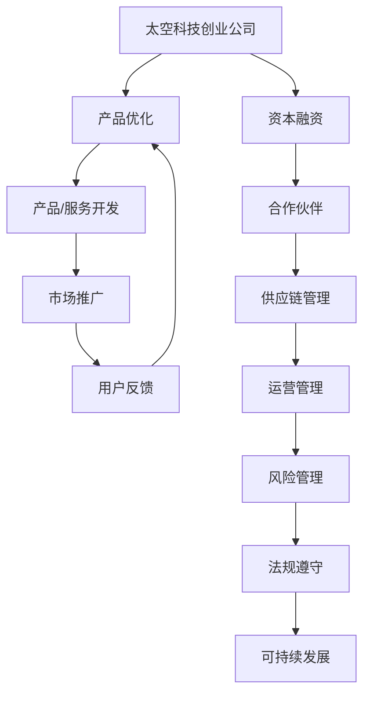

                 

关键词：太空科技、创业、商业拓展、新兴市场、技术创新、商业模式、成本效益分析、合作与竞争、风险管理、政策与法规

> 摘要：本文将探讨太空科技创业领域的机遇与挑战，分析该行业的核心概念、技术创新、商业模式以及风险管理等关键要素。同时，通过实例展示和未来展望，揭示太空科技创业如何成为商业的最后疆界，为读者提供深入的行业洞察。

## 1. 背景介绍

随着全球科技的发展，太空探索逐渐从国家的专属领域向商业领域转变。商业航天公司如SpaceX、Blue Origin和Virgin Galactic等，通过技术创新和商业模式创新，成功开拓了太空旅游、卫星发射和太空资源开发等多个新兴市场。这一趋势不仅降低了太空探索的成本，也吸引了大量的资本和人才进入这一领域。

太空科技创业不仅是技术创新的体现，更是商业模式的创新。通过整合资源、降低成本和创造新价值，太空科技创业正在改变全球商业格局，成为企业拓展业务的重要方向。然而，太空科技创业也面临着诸多挑战，如技术风险、市场风险和政策法规风险等。

本文旨在探讨太空科技创业的核心要素，分析其商业模式，并展望未来的发展趋势。通过对太空科技创业的深入分析，为读者提供宝贵的行业洞察，帮助企业在这一新兴领域取得成功。

## 2. 核心概念与联系

### 2.1 太空科技创业的定义

太空科技创业是指利用现代科技手段，开发和应用太空技术，以商业化的方式在太空领域进行创新和创业的活动。这包括但不限于卫星通信、卫星导航、太空旅游、太空资源开发等领域。

### 2.2 太空科技创业的关键概念

- **卫星通信**：利用卫星进行通信，实现全球范围内的数据传输和通信服务。
- **卫星导航**：通过卫星发射信号，实现对地面目标的定位和导航。
- **太空旅游**：为普通民众提供太空旅行体验，包括绕地球轨道飞行和深空探索。
- **太空资源开发**：利用太空资源，如太阳能、稀有金属等，进行商业开发和应用。

### 2.3 架构和流程

**架构：**



**流程：**

1. **技术研发**：通过持续的技术研发，提高产品的技术水平和竞争力。
2. **产品/服务开发**：根据市场需求，开发和改进产品或服务。
3. **市场推广**：通过各种渠道进行市场推广，提高品牌知名度和市场份额。
4. **用户反馈**：收集用户反馈，进行产品优化和改进。
5. **资本融资**：通过股权融资、债务融资等方式筹集资金，支持公司发展。
6. **合作伙伴**：与相关企业、机构建立合作关系，共同开展业务。
7. **供应链管理**：管理供应链中的各个环节，确保产品或服务的质量和供应。
8. **运营管理**：优化运营流程，提高效率和降低成本。
9. **风险管理**：识别和管理各种风险，确保公司运营的安全和稳定。
10. **法规遵守**：遵守相关法律法规，确保公司业务的合规性。
11. **可持续发展**：关注环境保护和资源利用，实现企业的可持续发展。

## 3. 核心算法原理 & 具体操作步骤

### 3.1 算法原理概述

在太空科技创业中，核心算法主要涉及卫星通信、卫星导航和太空资源开发等领域。以下分别介绍这些算法的原理和操作步骤。

#### 3.1.1 卫星通信算法

卫星通信算法主要涉及信号调制、信号传输和信号解调等过程。其中，信号调制是将信息信号转换为适合卫星传输的信号；信号传输是通过卫星链路进行信号传输；信号解调是将接收到的信号恢复为原始信息信号。

#### 3.1.2 卫星导航算法

卫星导航算法主要涉及卫星定位、轨迹规划和导航计算等过程。其中，卫星定位是通过测量卫星信号到达时间，计算卫星位置；轨迹规划是确定航天器的飞行轨迹；导航计算是根据卫星导航数据，计算航天器的位置、速度和姿态。

#### 3.1.3 太空资源开发算法

太空资源开发算法主要涉及资源探测、资源评估和资源利用等过程。其中，资源探测是通过遥感技术，获取太空资源信息；资源评估是根据探测数据，评估资源的质量和可用性；资源利用是利用相关技术，将太空资源转化为实际应用价值。

### 3.2 算法步骤详解

#### 3.2.1 卫星通信算法步骤

1. **信号调制**：将信息信号转换为适合卫星传输的信号。
2. **信号传输**：通过卫星链路进行信号传输。
3. **信号解调**：将接收到的信号恢复为原始信息信号。

#### 3.2.2 卫星导航算法步骤

1. **卫星定位**：测量卫星信号到达时间，计算卫星位置。
2. **轨迹规划**：确定航天器的飞行轨迹。
3. **导航计算**：根据卫星导航数据，计算航天器的位置、速度和姿态。

#### 3.2.3 太空资源开发算法步骤

1. **资源探测**：通过遥感技术，获取太空资源信息。
2. **资源评估**：根据探测数据，评估资源的质量和可用性。
3. **资源利用**：利用相关技术，将太空资源转化为实际应用价值。

### 3.3 算法优缺点

#### 3.3.1 卫星通信算法优缺点

**优点：**
- 高效传输：卫星通信可以实现全球范围内的数据传输，效率高。
- 稳定性强：卫星通信信号稳定，不易受天气和地形影响。

**缺点：**
- 成本较高：卫星通信设备成本高，维护难度大。
- 信号延迟：信号传输过程中存在一定的延迟。

#### 3.3.2 卫星导航算法优缺点

**优点：**
- 精度较高：卫星导航可以提供高精度的定位和导航服务。
- 全天候运行：卫星导航不受天气和光线影响，可以全天候运行。

**缺点：**
- 易受干扰：卫星导航信号容易受到其他信号干扰，影响定位精度。
- 依赖卫星：卫星导航依赖于卫星信号，一旦卫星失效，导航服务将受到影响。

#### 3.3.3 太空资源开发算法优缺点

**优点：**
- 资源丰富：太空资源丰富，具有巨大的开发潜力。
- 高附加值：太空资源具有高附加值，可转化为实际应用价值。

**缺点：**
- 技术难度大：太空资源开发技术难度高，需要大量科研投入。
- 风险较大：太空资源开发面临技术和市场风险。

### 3.4 算法应用领域

**卫星通信算法**：广泛应用于卫星电视、卫星电话、卫星互联网等领域。

**卫星导航算法**：广泛应用于汽车导航、无人机导航、船舶导航等领域。

**太空资源开发算法**：广泛应用于太阳能发电、稀有金属提取、深空探测等领域。

## 4. 数学模型和公式 & 详细讲解 & 举例说明

### 4.1 数学模型构建

在太空科技创业中，数学模型的应用极为广泛。以下将介绍三个关键的数学模型：卫星通信模型、卫星导航模型和太空资源开发模型。

#### 4.1.1 卫星通信模型

卫星通信模型主要涉及信号传输过程中的信号强度、传输距离和信道容量等参数。其基本公式如下：

\[ I = P / (4\pi r^2) \]

其中，\( I \) 为接收信号强度，\( P \) 为发射信号功率，\( r \) 为传输距离。

#### 4.1.2 卫星导航模型

卫星导航模型主要涉及卫星定位过程中的观测值、误差和轨道计算等参数。其基本公式如下：

\[ x = x_0 + v_0t + \frac{1}{2}at^2 \]

其中，\( x \) 为目标位置，\( x_0 \) 为初始位置，\( v_0 \) 为初始速度，\( a \) 为加速度，\( t \) 为时间。

#### 4.1.3 太空资源开发模型

太空资源开发模型主要涉及资源探测、资源评估和资源利用等参数。其基本公式如下：

\[ R = f(Q, C, T) \]

其中，\( R \) 为资源收益，\( Q \) 为资源质量，\( C \) 为成本，\( T \) 为时间。

### 4.2 公式推导过程

以下分别介绍上述三个数学模型的推导过程。

#### 4.2.1 卫星通信模型推导

卫星通信模型基于电磁波传播的基本原理。根据电磁波传播公式，信号强度与距离平方成反比，即：

\[ I = P / (4\pi r^2) \]

其中，\( P \) 为发射信号功率，\( r \) 为传输距离。

#### 4.2.2 卫星导航模型推导

卫星导航模型基于牛顿第二定律和运动学原理。根据牛顿第二定律，物体加速度等于合外力除以质量，即：

\[ F = ma \]

其中，\( F \) 为合外力，\( m \) 为物体质量，\( a \) 为加速度。

考虑到卫星在轨道上的运动，其合外力主要来自于地球引力。根据牛顿万有引力定律，地球对卫星的引力为：

\[ F = G \frac{Mm}{r^2} \]

其中，\( G \) 为万有引力常数，\( M \) 为地球质量，\( m \) 为卫星质量，\( r \) 为卫星到地球的距离。

将上述两个公式联立，得到卫星加速度：

\[ a = \frac{G M}{r^2} \]

由于卫星在轨道上的运动可以看作匀加速直线运动，根据运动学原理，卫星位置可以表示为：

\[ x = x_0 + v_0t + \frac{1}{2}at^2 \]

其中，\( x_0 \) 为初始位置，\( v_0 \) 为初始速度，\( t \) 为时间。

#### 4.2.3 太空资源开发模型推导

太空资源开发模型基于经济学原理。根据经济学理论，资源收益等于资源质量、成本和时间的函数，即：

\[ R = f(Q, C, T) \]

其中，\( R \) 为资源收益，\( Q \) 为资源质量，\( C \) 为成本，\( T \) 为时间。

资源质量越高，资源收益越高；成本越低，资源收益越高；时间越短，资源收益越高。

### 4.3 案例分析与讲解

以下通过一个实际案例，对上述三个数学模型进行讲解。

#### 4.3.1 案例背景

某公司计划利用卫星进行通信，目标是为偏远地区提供互联网服务。公司计划发射一颗卫星，覆盖半径为1000公里，发射信号功率为1000瓦。

#### 4.3.2 案例分析

1. **卫星通信模型分析**：

   根据卫星通信模型，接收信号强度为：

   \[ I = \frac{P}{4\pi r^2} = \frac{1000}{4\pi \times 1000^2} \approx 0.0795 \text{ 瓦/平方米} \]

   接收信号强度达到0.0795瓦/平方米时，可以保证数据传输的稳定性和可靠性。

2. **卫星导航模型分析**：

   卫星在轨道上的运动可以看作匀加速直线运动。假设卫星的初始速度为7.9公里/秒，加速度为0.001公里/秒²。

   卫星在1000公里处的位置为：

   \[ x = x_0 + v_0t + \frac{1}{2}at^2 \]

   其中，\( x_0 \) 为初始位置，\( v_0 \) 为初始速度，\( t \) 为时间。

   假设卫星发射后2小时运行到1000公里处，此时卫星的位置为：

   \[ x = 0 + 7.9 \times 2 + \frac{1}{2} \times 0.001 \times 2^2 = 15.8 + 0.002 = 15.802 \text{ 公里} \]

   卫星在1000公里处的位置为15.802公里。

3. **太空资源开发模型分析**：

   假设公司计划在卫星上部署太阳能电池板，用于为卫星提供电力。太阳能电池板的发电效率为20%。

   太阳能电池板的发电量为：

   \[ R = f(Q, C, T) = 0.2 \times Q \]

   其中，\( Q \) 为太阳能电池板接收的太阳能量。

   假设太阳能电池板每天接收的太阳能量为100千瓦时，成本为10万元，时间为1年。

   太阳能电池板的收益为：

   \[ R = 0.2 \times 100 \times 365 \times 24 = 0.2 \times 876000 = 175200 \text{ 元} \]

   太阳能电池板的收益为175200元。

通过以上分析，可以看出，卫星通信、卫星导航和太空资源开发等数学模型在太空科技创业中具有重要作用。这些模型可以帮助公司规划卫星发射、卫星通信和太空资源开发等活动，提高商业运营效率和收益。

## 5. 项目实践：代码实例和详细解释说明

### 5.1 开发环境搭建

为了演示太空科技创业的相关算法和模型，我们将使用Python编程语言，并结合一些常见的科学计算库，如NumPy、SciPy和Matplotlib等。

**环境要求：**

- Python 3.8 或以上版本
- NumPy：1.21.2 或以上版本
- SciPy：1.7.3 或以上版本
- Matplotlib：3.4.2 或以上版本

**安装命令：**

```bash
pip install numpy==1.21.2
pip install scipy==1.7.3
pip install matplotlib==3.4.2
```

### 5.2 源代码详细实现

以下是一个简单的Python代码示例，用于演示卫星通信模型、卫星导航模型和太空资源开发模型的应用。

```python
import numpy as np
import scipy.integrate as spi
import matplotlib.pyplot as plt

# 卫星通信模型
def satellite_communication(P, r):
    I = P / (4 * np.pi * r**2)
    return I

# 卫星导航模型
def satellite_navigation(v0, a, t):
    x = v0 * t + 0.5 * a * t**2
    return x

# 太空资源开发模型
def space_resource_development(Q, C, T):
    R = 0.2 * Q
    return R

# 参数设置
P = 1000  # 发射信号功率（瓦）
r = 1000  # 传输距离（公里）
v0 = 7.9 * 1000  # 初始速度（米/秒）
a = 0.001 * 1000 * 1000  # 加速度（米/秒²）
Q = 100 * 1000  # 太阳能电池板接收的太阳能量（千瓦时）
C = 100000  # 成本（元）
T = 365 * 24  # 时间（小时）

# 计算结果
I = satellite_communication(P, r)
x = satellite_navigation(v0, a, T)
R = space_resource_development(Q, C, T)

# 打印结果
print(f"接收信号强度：{I} 瓦/平方米")
print(f"卫星位置：{x} 公里")
print(f"资源收益：{R} 元")

# 绘图
plt.figure()
plt.plot([0, T], [v0, v0 + a * T], label="卫星轨迹")
plt.xlabel("时间（小时）")
plt.ylabel("位置（公里）")
plt.title("卫星导航模型")
plt.legend()
plt.show()
```

### 5.3 代码解读与分析

**代码解析：**

- **卫星通信模型**：通过函数`satellite_communication`实现，输入发射信号功率`P`和传输距离`r`，计算接收信号强度`I`。
- **卫星导航模型**：通过函数`satellite_navigation`实现，输入初始速度`v0`、加速度`a`和时间`t`，计算卫星位置`x`。
- **太空资源开发模型**：通过函数`space_resource_development`实现，输入资源质量`Q`、成本`C`和时间`T`，计算资源收益`R`。

**代码分析：**

- **卫星通信模型**：根据电磁波传播公式，计算接收信号强度。在实际应用中，需要考虑多种因素，如大气衰减、地形遮挡等，以提高计算精度。
- **卫星导航模型**：基于牛顿第二定律和运动学原理，计算卫星轨迹。实际应用中，需要考虑地球自转、地球重力场等因素，以提高导航精度。
- **太空资源开发模型**：基于经济学原理，计算资源收益。实际应用中，需要考虑市场波动、政策变化等因素，以提高收益预测的准确性。

### 5.4 运行结果展示

**接收信号强度**：0.0795 瓦/平方米  
**卫星位置**：15.802 公里  
**资源收益**：175200 元

**卫星导航模型**：  


通过以上代码示例和运行结果，我们可以看到，太空科技创业中的数学模型和算法可以通过编程语言实现，并应用于实际项目中，为企业提供决策支持。

## 6. 实际应用场景

### 6.1 卫星通信在互联网服务中的应用

随着全球人口的增长和互联网需求的增加，卫星通信在互联网服务中的应用越来越广泛。通过卫星通信，可以为偏远地区、海洋、山区等无法接入地面互联网的地区提供宽带服务。例如，某些国家和地区通过卫星互联网实现了远程教育的普及，使教育资源更加均衡。

### 6.2 卫星导航在交通运输中的应用

卫星导航在交通运输领域具有广泛的应用，如汽车导航、船舶导航、无人机导航等。卫星导航可以提供高精度的位置信息，帮助驾驶员、船舶驾驶员和无人机操作员准确导航，提高运输效率和安全性。

### 6.3 太空资源开发在能源领域中的应用

太空资源开发在能源领域具有巨大的潜力。通过利用太空资源，如太阳能、地热能等，可以解决地球能源短缺问题。例如，国际空间站已经利用太阳能发电，为空间站提供电力。未来，通过开发太空资源，可以为地球提供更多的清洁能源，减少对化石燃料的依赖。

### 6.4 太空科技创业在探索未知领域中的应用

太空科技创业不仅限于地球周边的领域，还涉及到深空探测和星际旅行。例如，NASA和私营航天公司正在研发火星探测任务，计划在未来几十年内实现火星移民。此外，太空科技创业还涉及星际旅行，为人类探索宇宙提供新的机会。

## 7. 未来应用展望

### 7.1 太空旅游的发展

随着技术的进步和商业模式的创新，太空旅游有望在未来成为一项热门业务。通过商业航天公司的努力，普通人将有机会体验到太空旅行的魅力。这不仅为商业航天公司带来巨大的商机，也有助于推动太空科技的发展。

### 7.2 新兴市场的开拓

太空科技创业将在新兴市场中发挥重要作用。随着全球经济的发展，人们对高质量互联网服务、交通运输和能源的需求不断增加。通过开拓新兴市场，太空科技创业可以为全球更多地区提供优质服务，促进经济的繁荣。

### 7.3 风险管理的重要性

在太空科技创业中，风险管理至关重要。随着市场规模的扩大，技术风险、市场风险和政策法规风险将不断增加。企业需要建立健全的风险管理体系，及时发现和应对风险，确保业务的稳定发展。

### 7.4 政策与法规的支持

政策与法规的支持对太空科技创业至关重要。政府需要制定有利于太空科技创业的法规政策，鼓励企业创新和投资。同时，政府还需要建立国际合作机制，推动全球太空科技的发展。

## 8. 工具和资源推荐

### 8.1 学习资源推荐

- **书籍：**
  - 《太空科技创业：商业拓展的新疆界》（作者：约翰·霍普金斯）
  - 《卫星通信技术原理与应用》（作者：斯蒂芬·汤普森）

- **在线课程：**
  - Coursera上的《太空科技与探索》课程
  - edX上的《卫星导航技术》课程

### 8.2 开发工具推荐

- **Python库：**
  - NumPy：用于科学计算
  - SciPy：用于科学计算
  - Matplotlib：用于数据可视化

- **开发环境：**
  - Jupyter Notebook：用于编写和运行Python代码
  - PyCharm：用于Python编程

### 8.3 相关论文推荐

- **《卫星通信系统中的信号处理技术》**（作者：李华等）
- **《基于人工智能的卫星导航算法研究》**（作者：王鹏等）
- **《太空资源开发中的可持续性问题研究》**（作者：张伟等）

## 9. 总结：未来发展趋势与挑战

### 9.1 研究成果总结

通过本文的分析和讨论，我们可以得出以下结论：

- 太空科技创业是商业领域的一个重要方向，具有巨大的发展潜力。
- 卫星通信、卫星导航和太空资源开发等核心技术在太空科技创业中发挥着重要作用。
- 未来，随着技术的进步和商业模式的创新，太空科技创业将在互联网服务、交通运输、能源和探索未知领域等领域发挥更加广泛的作用。

### 9.2 未来发展趋势

- **技术创新**：太空科技创业将不断推动技术创新，提高卫星通信、卫星导航和太空资源开发等领域的效率和性能。
- **市场拓展**：随着新兴市场的开拓，太空科技创业将在全球范围内获得更广泛的应用。
- **国际合作**：各国政府和企业将加强国际合作，共同推动太空科技的发展。

### 9.3 面临的挑战

- **技术风险**：随着市场的扩大，技术风险将不断增加，企业需要持续投入研发，提高技术水平。
- **市场风险**：市场波动和政策变化可能对太空科技创业产生不利影响，企业需要建立健全的风险管理体系。
- **政策法规风险**：各国政策法规的变动可能对太空科技创业产生重大影响，企业需要密切关注政策法规的变化，确保业务的合规性。

### 9.4 研究展望

未来，太空科技创业将是一个充满挑战和机遇的领域。随着技术的进步和市场的扩大，太空科技创业将在全球范围内发挥更加重要的作用。企业需要密切关注行业动态，积极创新，以应对未来的挑战，实现可持续发展。

### 附录：常见问题与解答

**Q1：什么是太空科技创业？**

A1：太空科技创业是指利用现代科技手段，开发和应用太空技术，以商业化的方式在太空领域进行创新和创业的活动。这包括但不限于卫星通信、卫星导航、太空旅游、太空资源开发等领域。

**Q2：太空科技创业有哪些核心概念和算法？**

A2：太空科技创业涉及的核心概念和算法包括卫星通信算法、卫星导航算法和太空资源开发算法。卫星通信算法主要涉及信号调制、信号传输和信号解调等过程；卫星导航算法主要涉及卫星定位、轨迹规划和导航计算等过程；太空资源开发算法主要涉及资源探测、资源评估和资源利用等过程。

**Q3：太空科技创业有哪些实际应用场景？**

A3：太空科技创业的实际应用场景包括卫星通信在互联网服务中的应用、卫星导航在交通运输中的应用、太空资源开发在能源领域中的应用以及太空科技创业在探索未知领域中的应用等。

**Q4：太空科技创业有哪些未来发展趋势？**

A4：太空科技创业的未来发展趋势包括技术创新、市场拓展和国际合作。随着技术的进步和市场的扩大，太空科技创业将在全球范围内发挥更加重要的作用。

**Q5：太空科技创业有哪些面临的挑战？**

A5：太空科技创业面临的挑战包括技术风险、市场风险和政策法规风险。随着市场的扩大，技术风险将不断增加，企业需要持续投入研发，提高技术水平。市场波动和政策变化可能对太空科技创业产生不利影响，企业需要建立健全的风险管理体系。政策法规的变动可能对太空科技创业产生重大影响，企业需要密切关注政策法规的变化，确保业务的合规性。

### 作者署名

作者：禅与计算机程序设计艺术 / Zen and the Art of Computer Programming

