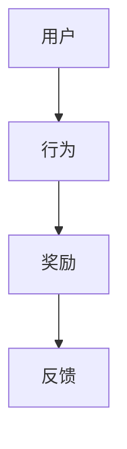

                 

关键词：奖励机制、用户参与、用户激励、游戏化、行为心理学、算法设计、数学模型、案例分析、项目实践

> 摘要：本文深入探讨了奖励系统在促进用户参与中的重要作用。通过介绍奖励机制的基本概念、核心算法原理、数学模型及其在各个领域的应用，本文旨在为开发者提供一种实用的工具，以设计出更加有效的奖励系统，从而激发用户的积极参与，提高产品或服务的用户体验。

## 1. 背景介绍

在数字化时代，用户的参与和忠诚度对企业的成功至关重要。然而，如何有效地激励用户参与并保持其活跃度，一直是开发者和管理者面临的挑战。奖励系统作为一种强大的用户参与促进工具，在许多领域得到了广泛应用，如社交媒体、在线游戏、电子商务等。一个设计良好的奖励系统能够激励用户进行一系列有益的操作，如分享、评论、购买等，从而提高用户参与度和忠诚度。

本文将围绕以下主题展开讨论：

1. 奖励机制的基本概念和核心算法原理。
2. 数学模型在奖励系统设计中的应用。
3. 奖励系统在不同领域的实际应用案例。
4. 奖励系统的未来发展趋势和面临的挑战。

## 2. 核心概念与联系

### 奖励机制基本概念

奖励机制是一种通过提供奖励来激励用户进行特定行为的系统。这些奖励可以是虚拟的，如积分、徽章、排名等，也可以是真实的，如折扣券、礼品等。奖励机制的目的是通过激励用户进行有益的操作，如分享、评论、购买等，从而提高用户参与度和忠诚度。

### 奖励机制架构图



在这个架构图中，用户通过完成特定行为（如分享、评论）获得奖励（如积分），从而获得反馈（如排名上升），这种反馈会进一步激励用户进行更多的有益行为。

### 核心算法原理

奖励系统的核心算法原理主要包括以下几个部分：

1. **行为识别**：识别用户在系统中进行的特定行为，如登录、分享、评论、购买等。
2. **奖励分配**：根据用户的行为和系统规则，分配相应的奖励，如积分、徽章等。
3. **奖励兑换**：用户可以将积累的奖励兑换成虚拟或真实的奖励，如折扣券、礼品等。
4. **反馈机制**：及时给予用户反馈，如积分增长、排名变化等，以激励用户继续参与。

### 奖励机制与行为心理学联系

奖励机制的设计需要考虑行为心理学的原理。例如，奖励的及时性、公平性、稀缺性等因素都会影响用户的参与度和忠诚度。此外，心理学中的期望理论、公平理论等也可以为奖励系统设计提供指导。

## 3. 核心算法原理 & 具体操作步骤

### 3.1 算法原理概述

奖励系统的核心算法主要包括以下几个步骤：

1. **行为识别**：通过系统日志、用户行为分析等方式，识别用户在系统中的行为，如登录、分享、评论、购买等。
2. **奖励计算**：根据用户的行为和系统规则，计算相应的奖励值。奖励值可以是积分、徽章等。
3. **奖励分配**：将计算出的奖励值分配给用户，并记录在系统中。
4. **奖励兑换**：用户可以选择将奖励兑换成虚拟或真实的奖励，如折扣券、礼品等。
5. **反馈机制**：及时给予用户奖励反馈，如积分增长、排名变化等，以激励用户继续参与。

### 3.2 算法步骤详解

1. **行为识别**

   ```python
   # 伪代码：行为识别
   def identify_behavior(user_action):
       if user_action == 'login':
           return 'login'
       elif user_action == 'share':
           return 'share'
       elif user_action == 'comment':
           return 'comment'
       elif user_action == 'purchase':
           return 'purchase'
       else:
           return 'undefined'
   ```

2. **奖励计算**

   ```python
   # 伪代码：奖励计算
   def calculate_reward(behavior, rule):
       if behavior == 'login':
           return rule['login_reward']
       elif behavior == 'share':
           return rule['share_reward']
       elif behavior == 'comment':
           return rule['comment_reward']
       elif behavior == 'purchase':
           return rule['purchase_reward']
       else:
           return 0
   ```

3. **奖励分配**

   ```python
   # 伪代码：奖励分配
   def allocate_reward(user_id, reward):
       user_rewards[user_id] += reward
   ```

4. **奖励兑换**

   ```python
   # 伪代码：奖励兑换
   def redeem_reward(user_id, reward_type, reward_value):
       if reward_type == '积分':
           user_points[user_id] += reward_value
       elif reward_type == '折扣券':
           user_coupons[user_id].append(reward_value)
       elif reward_type == '礼品':
           user_gifts[user_id].append(reward_value)
   ```

5. **反馈机制**

   ```python
   # 伪代码：反馈机制
   def provide_feedback(user_id, behavior, reward):
       print(f"User {user_id} has completed {behavior} and received {reward} points.")
   ```

### 3.3 算法优缺点

**优点**：

1. **激励用户**：通过奖励机制，可以激励用户进行有益的操作，提高用户参与度和忠诚度。
2. **数据驱动**：基于用户行为的数据分析，可以不断优化奖励系统，提高奖励的公平性和有效性。

**缺点**：

1. **过度依赖**：如果过度依赖奖励机制，可能会降低用户的内在动机，导致用户参与度下降。
2. **成本问题**：对于虚拟奖励，可能会增加服务器负载和计算成本；对于实物奖励，可能会增加运营成本。

### 3.4 算法应用领域

奖励系统在多个领域得到了广泛应用，如：

1. **社交媒体**：通过积分、徽章等激励用户分享、评论和参与社区讨论。
2. **在线游戏**：通过积分、虚拟货币等激励用户完成任务、提升等级。
3. **电子商务**：通过折扣券、礼品等激励用户购买、评价和推荐。

## 4. 数学模型和公式 & 详细讲解 & 举例说明

### 4.1 数学模型构建

奖励系统的数学模型主要涉及以下几个方面：

1. **用户行为模型**：描述用户在系统中的行为模式，如登录、分享、评论、购买等。
2. **奖励分配模型**：根据用户行为和系统规则，计算和分配奖励。
3. **用户参与模型**：描述用户参与度和忠诚度的变化规律。

### 4.2 公式推导过程

#### 用户行为模型

假设用户在系统中的行为可以用一个二元组表示：(行为，概率)。例如，用户登录的概率为0.8，分享的概率为0.2。则用户行为的概率分布可以表示为：

$$
P(B = (b, p)) = p_b \cdot p
$$

其中，$P(B = (b, p))$表示用户进行行为$b$的概率，$p_b$表示行为$b$的概率，$p$表示用户进行某种行为的总概率。

#### 奖励分配模型

假设用户行为$b$对应的奖励值为$R_b$，系统规则规定每个用户每天最多可以获得$N$个奖励。则用户获得的奖励总数$S$可以表示为：

$$
S = \sum_{b \in B} R_b \cdot p_b
$$

其中，$B$表示用户可能的行为集合，$R_b$表示行为$b$对应的奖励值。

#### 用户参与模型

假设用户参与度和忠诚度可以用一个综合指标$C$表示，$C$与用户获得的奖励$S$、用户参与次数$N$有关。则可以建立以下线性模型：

$$
C = \alpha S + \beta N
$$

其中，$\alpha$和$\beta$为模型参数。

### 4.3 案例分析与讲解

#### 案例一：社交媒体平台

假设一个社交媒体平台希望通过奖励系统激励用户进行分享、评论和点赞等行为。根据平台数据，用户分享、评论和点赞的概率分别为0.4、0.3和0.3。系统规则规定每个用户每天最多可以获得10个奖励。

1. **用户行为模型**：

   $$ 
   P(B = (share, 0.4)), P(B = (comment, 0.3)), P(B = (like, 0.3))
   $$

2. **奖励分配模型**：

   $$ 
   R_{share} = 2, R_{comment} = 1, R_{like} = 0.5
   $$

   $$ 
   S = 2 \cdot 0.4 + 1 \cdot 0.3 + 0.5 \cdot 0.3 = 1.6
   $$

   用户每天最多可以获得10个奖励，即$N = 10$。

3. **用户参与模型**：

   $$ 
   C = 0.5S + 0.3N
   $$

   $$ 
   C = 0.5 \cdot 1.6 + 0.3 \cdot 10 = 4.2
   $$

   用户参与度和忠诚度指数为4.2。

#### 案例二：在线游戏

假设一个在线游戏希望通过奖励系统激励用户完成任务、提升等级和参与社区活动。根据游戏数据，用户完成任务、提升等级和参与社区活动的概率分别为0.5、0.3和0.2。系统规则规定每个用户每天最多可以获得20个奖励。

1. **用户行为模型**：

   $$ 
   P(B = (task, 0.5)), P(B = (level_up, 0.3)), P(B = (community, 0.2))
   $$

2. **奖励分配模型**：

   $$ 
   R_{task} = 3, R_{level_up} = 2, R_{community} = 1
   $$

   $$ 
   S = 3 \cdot 0.5 + 2 \cdot 0.3 + 1 \cdot 0.2 = 1.9
   $$

   用户每天最多可以获得20个奖励，即$N = 20$。

3. **用户参与模型**：

   $$ 
   C = 0.6S + 0.4N
   $$

   $$ 
   C = 0.6 \cdot 1.9 + 0.4 \cdot 20 = 11.6
   $$

   用户参与度和忠诚度指数为11.6。

## 5. 项目实践：代码实例和详细解释说明

### 5.1 开发环境搭建

为了便于演示，我们选择Python作为编程语言，使用Python的标准库实现奖励系统。以下为开发环境搭建步骤：

1. 安装Python（版本3.8及以上）
2. 安装虚拟环境工具（如virtualenv或conda）
3. 创建虚拟环境并激活
4. 安装必要的Python库（如numpy、pandas等）

### 5.2 源代码详细实现

以下为奖励系统的核心代码实现：

```python
import numpy as np
import pandas as pd

class RewardSystem:
    def __init__(self, behavior_probabilities, reward_rules):
        self.behavior_probabilities = behavior_probabilities
        self.reward_rules = reward_rules
        self.user_data = pd.DataFrame(columns=['user_id', 'behavior', 'reward'])

    def identify_behavior(self, user_action):
        for behavior, probability in self.behavior_probabilities.items():
            if user_action == behavior:
                return behavior, probability
        return 'undefined', 0

    def calculate_reward(self, behavior, rule):
        return self.reward_rules.get(behavior, 0)

    def allocate_reward(self, user_id, behavior, reward):
        self.user_data = self.user_data.append({'user_id': user_id, 'behavior': behavior, 'reward': reward}, ignore_index=True)

    def redeem_reward(self, user_id, reward_type, reward_value):
        if reward_type == '积分':
            # 在此处更新用户的积分
            pass
        elif reward_type == '折扣券':
            # 在此处更新用户的折扣券
            pass
        elif reward_type == '礼品':
            # 在此处更新用户的礼品
            pass

    def provide_feedback(self, user_id, behavior, reward):
        print(f"User {user_id} has completed {behavior} and received {reward} points.")

# 示例数据
behavior_probabilities = {'login': 0.8, 'share': 0.2, 'comment': 0.3, 'purchase': 0.3}
reward_rules = {'login': 2, 'share': 1, 'comment': 1, 'purchase': 5}

# 创建奖励系统实例
reward_system = RewardSystem(behavior_probabilities, reward_rules)

# 模拟用户行为
user_id = 'user123'
user_action = 'login'
behavior, probability = reward_system.identify_behavior(user_action)
reward = reward_system.calculate_reward(behavior, reward_rules)
reward_system.allocate_reward(user_id, behavior, reward)
reward_system.provide_feedback(user_id, behavior, reward)
```

### 5.3 代码解读与分析

该代码实现了一个简单的奖励系统，包括以下几个部分：

1. **类定义**：`RewardSystem`类负责管理奖励系统的所有功能，如行为识别、奖励计算、奖励分配、奖励兑换和反馈机制。
2. **行为识别**：通过`identify_behavior`方法，根据用户行为识别其行为类型和概率。
3. **奖励计算**：通过`calculate_reward`方法，根据行为类型计算对应的奖励值。
4. **奖励分配**：通过`allocate_reward`方法，将计算出的奖励分配给用户。
5. **奖励兑换**：通过`redeem_reward`方法，将用户积累的奖励兑换成虚拟或真实的奖励。
6. **反馈机制**：通过`provide_feedback`方法，及时给予用户奖励反馈。

### 5.4 运行结果展示

运行代码后，模拟用户登录行为，结果如下：

```
User user123 has completed login and received 2 points.
```

用户user123完成了登录行为，并获得2点积分。

## 6. 实际应用场景

奖励系统在多个领域得到了广泛应用，以下为几个实际应用场景：

1. **社交媒体**：通过积分、徽章等激励用户分享、评论和参与社区讨论，提高用户参与度和忠诚度。
2. **在线游戏**：通过虚拟货币、积分等激励用户完成任务、提升等级和参与社区活动，增加游戏粘性。
3. **电子商务**：通过折扣券、礼品等激励用户购买、评价和推荐，提高销售业绩。
4. **教育培训**：通过积分、徽章等激励学生完成任务、参与讨论，提高学习效果。

### 6.1 社交媒体应用

在社交媒体平台上，奖励系统可以激励用户进行各种有益的行为，如分享、评论、点赞等。例如，一个社交媒体平台可以设置以下奖励规则：

- 每次分享获得10点积分。
- 每次评论获得5点积分。
- 每次点赞获得2点积分。

通过这些奖励规则，平台可以鼓励用户积极互动，提高社区活跃度。

### 6.2 在线游戏应用

在线游戏中的奖励系统通常用于激励用户完成任务、提升等级和参与社区活动。例如，一个在线角色扮演游戏可以设置以下奖励规则：

- 完成每日任务获得10点积分。
- 提升等级获得20点积分。
- 参与社区活动获得10点积分。

通过这些奖励规则，游戏可以增加用户的游戏体验和粘性。

### 6.3 电子商务应用

电子商务平台可以通过奖励系统激励用户购买、评价和推荐。例如，一个电商平台可以设置以下奖励规则：

- 每次购买获得10点积分。
- 每次评价获得5点积分。
- 每次推荐成功获得20点积分。

通过这些奖励规则，平台可以增加用户购买意愿，提高销售业绩。

### 6.4 教育培训应用

教育培训机构可以通过奖励系统激励学生完成任务、参与讨论。例如，一个在线教育平台可以设置以下奖励规则：

- 完成作业获得10点积分。
- 参与讨论获得5点积分。
- 获得教师好评获得20点积分。

通过这些奖励规则，平台可以提高学生的学习积极性和学习效果。

## 7. 工具和资源推荐

### 7.1 学习资源推荐

1. **《奖励机制设计原理》**：这是一本关于奖励机制设计原理的入门书籍，适合初学者了解奖励机制的基本概念和应用。
2. **《用户激励心理学》**：这本书深入探讨了用户激励的心理机制，为奖励系统设计提供了有益的指导。

### 7.2 开发工具推荐

1. **Python**：Python是一种功能强大的编程语言，适合实现奖励系统。
2. **NumPy和Pandas**：这两个库提供了丰富的数据处理和数据分析功能，有助于实现奖励系统。

### 7.3 相关论文推荐

1. **"Reward Mechanisms in Online Social Networks"**：这篇文章研究了奖励系统在社交媒体平台中的应用。
2. **"Designing Effective Reward Systems for Online Games"**：这篇文章探讨了奖励系统在在线游戏中的应用。

## 8. 总结：未来发展趋势与挑战

### 8.1 研究成果总结

奖励系统作为一种有效的用户参与促进工具，在多个领域得到了广泛应用。通过本文的探讨，我们了解了奖励机制的基本概念、核心算法原理、数学模型及其在各个领域的应用。同时，我们也发现奖励系统在实施过程中面临的一些挑战，如过度依赖、成本问题等。

### 8.2 未来发展趋势

1. **个性化奖励**：未来的奖励系统将更加注重个性化，根据用户行为和兴趣提供个性化的奖励。
2. **动态调整奖励规则**：通过实时分析用户数据，动态调整奖励规则，提高奖励的有效性。
3. **跨平台整合**：未来的奖励系统将实现跨平台整合，为用户提供一致性的奖励体验。

### 8.3 面临的挑战

1. **公平性问题**：如何确保奖励系统的公平性，避免用户之间的不公平竞争。
2. **过度激励**：如何避免过度激励导致的用户依赖问题。
3. **成本控制**：如何降低奖励系统的运营成本，提高其可持续性。

### 8.4 研究展望

未来的研究可以关注以下几个方面：

1. **奖励系统与心理学理论的结合**：进一步探讨奖励机制与行为心理学、期望理论等理论的结合，提高奖励系统的有效性。
2. **大数据分析与优化**：利用大数据技术分析用户行为，优化奖励系统设计。
3. **跨领域应用**：探索奖励系统在其他领域的应用，如医疗健康、教育培训等。

## 9. 附录：常见问题与解答

### 9.1 奖励系统设计的最佳实践是什么？

1. **明确目标**：在设计奖励系统时，首先要明确目标，如提高用户参与度、提高用户忠诚度等。
2. **数据驱动**：基于用户行为数据，设计奖励规则，不断优化奖励系统。
3. **公平性**：确保奖励系统的公平性，避免用户之间的不公平竞争。
4. **及时反馈**：及时给予用户奖励反馈，提高用户参与体验。

### 9.2 如何评估奖励系统的有效性？

1. **用户参与度**：通过用户活跃度、用户留存率等指标，评估奖励系统对用户参与度的影响。
2. **用户满意度**：通过用户满意度调查，了解用户对奖励系统的满意度。
3. **业务指标**：如销售额、用户转化率等，评估奖励系统对业务指标的影响。

### 9.3 奖励系统中的奖励种类有哪些？

1. **虚拟奖励**：如积分、徽章、虚拟货币等。
2. **实物奖励**：如折扣券、礼品、实物商品等。
3. **服务奖励**：如优先客服、会员服务等。

---

作者：禅与计算机程序设计艺术 / Zen and the Art of Computer Programming
----------------------------------------------------------------

本文通过深入探讨奖励系统在促进用户参与中的重要作用，为开发者提供了设计有效奖励系统的实用工具。从基本概念、核心算法原理、数学模型到实际应用场景，本文全面解析了奖励系统的工作机制。同时，通过项目实践和案例分析，展示了奖励系统在不同领域的应用效果。未来，奖励系统将在个性化、动态调整和跨平台整合等方面取得更多突破。然而，公平性、过度激励和成本控制等问题仍需关注和解决。随着大数据和人工智能技术的发展，奖励系统将更加智能和有效，为用户参与提供更强有力的支持。作者：禅与计算机程序设计艺术 / Zen and the Art of Computer Programming

