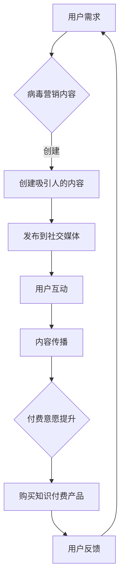

                 

关键词：病毒营销、知识付费、产品推广、技术策略、用户互动

摘要：本文将探讨如何利用病毒营销策略来推广知识付费产品。通过对病毒营销的深入分析，结合知识付费产品的特性，我们将详细阐述一个完整的推广方案，并探讨其成功的关键因素。文章还将分析病毒营销在不同应用场景中的效果，以及可能面临的挑战和应对策略。

## 1. 背景介绍

病毒营销（Virus Marketing），也称为病毒式营销，是一种通过用户间的自主传播来达到营销目的的方法。它的核心在于创造具有吸引力和传播性的内容，使用户在不知不觉中帮助品牌传播信息。病毒营销的成功案例包括苹果公司的iPod广告、可口可乐的“昵称瓶”等，这些案例证明了病毒营销的巨大潜力。

知识付费产品，是指用户需要付费才能获取的具有专业性和实用性的知识产品，如在线课程、电子书籍、专业咨询等。随着互联网和在线教育的普及，知识付费产品在近年来逐渐成为了一个热门的市场。

本文将结合病毒营销和知识付费产品的特点，探讨如何利用病毒营销策略来推广知识付费产品。我们将从病毒营销的原理出发，分析其与知识付费产品的结合点，并给出具体的实施步骤和策略。

## 2. 核心概念与联系

### 2.1 病毒营销的核心原理

病毒营销的核心在于创造吸引人的内容和互动机制，使用户自发地传播品牌信息。具体来说，病毒营销包括以下几个关键要素：

- **吸引力**：病毒营销的内容必须具有高度的吸引力，能够引发用户的兴趣和好奇心。
- **互动性**：病毒营销应鼓励用户参与和互动，例如通过分享、评论、点赞等方式。
- **传播性**：病毒营销的内容应易于传播，可以通过社交媒体、邮件、短信等多种渠道传播。

### 2.2 病毒营销与知识付费产品的结合

病毒营销与知识付费产品之间有着紧密的联系。知识付费产品本身具有以下特点：

- **专业性**：知识付费产品通常由专业人士或机构提供，具有很高的专业性和权威性。
- **付费性**：用户需要付费才能获取知识付费产品，这使得知识付费产品具有明确的商业价值。
- **互动性**：知识付费产品通常包括互动式教学、在线讨论区等功能，可以增强用户参与度。

结合病毒营销的原理，我们可以将病毒营销与知识付费产品的特点相结合，创造出一个具有吸引力和传播性的营销策略。以下是一个简单的 Mermaid 流程图，展示了病毒营销与知识付费产品结合的基本架构：



### 2.3 病毒营销在知识付费产品中的应用

在知识付费产品中，病毒营销可以应用于以下几个方面：

- **产品推广**：通过病毒营销内容吸引用户关注，提高产品知名度和用户参与度。
- **用户互动**：利用病毒营销的互动性，增强用户对知识付费产品的兴趣和满意度。
- **口碑营销**：通过用户自发传播，形成良好的口碑效应，吸引更多用户。

下面将详细分析病毒营销在知识付费产品中的应用策略。

### 2.4 病毒营销策略分析

**1. 内容创意**

病毒营销的成功很大程度上取决于内容的创意。在知识付费产品的推广中，我们需要创造具有吸引力和传播性的内容。以下是一些具体策略：

- **故事化**：通过讲述一个引人入胜的故事，让用户产生共鸣和兴趣。
- **互动性**：设计互动环节，鼓励用户参与和分享，提高内容的传播性。
- **个性化**：针对不同用户群体，提供个性化的内容，增加用户的归属感。

**2. 社交媒体利用**

社交媒体是病毒营销的重要渠道。通过合理利用社交媒体平台，我们可以迅速扩大知识付费产品的受众范围。以下是一些具体策略：

- **内容发布**：在各大社交媒体平台上定期发布高质量的内容，吸引粉丝关注。
- **KOL合作**：与意见领袖（KOL）合作，通过他们的推荐来提升产品的知名度。
- **互动营销**：通过社交媒体平台与用户互动，收集用户反馈，不断优化内容。

**3. 口碑营销**

口碑营销是病毒营销的重要组成部分。通过用户自发传播，形成良好的口碑效应，可以极大地提升产品的信誉和用户忠诚度。以下是一些具体策略：

- **用户推荐**：鼓励用户向亲友推荐知识付费产品，提供优惠券或积分等激励措施。
- **用户评价**：在产品页面和社交媒体上展示用户的好评，增加用户的信任度。
- **互动反馈**：及时响应用户反馈，解决用户问题，提升用户满意度。

### 2.5 病毒营销的优势与挑战

**优势：**

- **高传播性**：病毒营销具有极高的传播性，可以迅速扩大品牌影响力。
- **低成本**：相比于传统营销手段，病毒营销通常成本较低，尤其适用于预算有限的初创企业。
- **用户参与度高**：病毒营销鼓励用户参与和互动，可以提高用户的满意度和忠诚度。

**挑战：**

- **可控性较低**：病毒营销的结果难以预测，容易产生负面效应。
- **内容质量要求高**：病毒营销的成功很大程度上取决于内容的创意和质量，需要持续投入。
- **用户隐私保护**：在病毒营销中，需要处理用户的个人信息和隐私，需要严格遵守相关法律法规。

## 3. 核心算法原理 & 具体操作步骤

### 3.1 算法原理概述

病毒营销的核心在于用户自发的传播，这涉及到一系列的算法原理，包括：

- **用户行为分析**：通过分析用户行为数据，识别有影响力的用户和潜在的用户群体。
- **内容推荐算法**：基于用户兴趣和行为，推荐具有吸引力的内容，提高内容的传播性。
- **社交网络分析**：通过分析社交网络结构，识别关键节点和传播路径，优化内容传播策略。

### 3.2 算法步骤详解

**1. 用户行为分析**

- **数据收集**：收集用户在社交媒体、网站等平台上的行为数据，如浏览记录、点赞、评论等。
- **数据清洗**：对收集到的数据进行处理，去除噪声数据和重复数据。
- **特征提取**：从原始数据中提取出用户行为特征，如活跃度、互动性、影响力等。

**2. 内容推荐算法**

- **用户兴趣建模**：基于用户行为数据，构建用户兴趣模型。
- **内容分类**：将知识付费产品内容进行分类，以便于推荐。
- **推荐算法实现**：使用协同过滤、基于内容的推荐等方法，实现内容推荐。

**3. 社交网络分析**

- **网络结构构建**：构建社交网络图，包括用户节点和内容节点。
- **关键节点识别**：使用社区发现算法，识别社交网络中的关键节点。
- **传播路径分析**：分析关键节点的传播路径，优化内容传播策略。

### 3.3 算法优缺点

**优点：**

- **高效性**：通过用户行为分析和内容推荐算法，可以快速识别有影响力的用户和潜在用户，提高营销效率。
- **个性化**：基于用户兴趣和行为，实现个性化内容推荐，提高用户满意度。
- **传播性**：通过社交网络分析，优化内容传播路径，提高内容的传播效果。

**缺点：**

- **数据依赖性**：算法的性能很大程度上依赖于用户行为数据的质量，数据质量差会影响算法效果。
- **复杂性**：病毒营销算法涉及到多个方面，包括用户行为分析、内容推荐和社交网络分析，实现起来相对复杂。
- **可控性**：病毒营销的结果难以预测，容易产生负面效应，需要谨慎操作。

### 3.4 算法应用领域

病毒营销算法在知识付费产品的推广中具有广泛的应用领域，包括：

- **个性化推荐**：通过用户行为分析，实现个性化内容推荐，提高用户满意度和留存率。
- **口碑营销**：通过社交网络分析，识别关键节点和传播路径，优化口碑传播策略。
- **用户增长**：通过病毒营销，快速扩大用户基础，提高产品知名度。

## 4. 数学模型和公式 & 详细讲解 & 举例说明

### 4.1 数学模型构建

在病毒营销策略中，我们可以使用一个简单的数学模型来描述用户增长和传播过程。假设：

- \( P(t) \) 表示时间 \( t \) 时，产品的用户数量。
- \( r \) 表示每个用户平均每日推荐的新用户数量。
- \( m \) 表示用户流失率，即每个用户平均每日流失的用户数量。

则用户数量 \( P(t) \) 的增长可以用以下微分方程描述：

$$ \frac{dP(t)}{dt} = rP(t) - mP(t) $$

### 4.2 公式推导过程

上述公式的推导过程如下：

1. **用户增长**：每个用户平均每日推荐 \( r \) 个新用户，因此每日新增用户数量为 \( rP(t) \)。
2. **用户流失**：每个用户平均每日流失 \( m \) 个用户，因此每日减少的用户数量为 \( mP(t) \)。

因此，用户数量 \( P(t) \) 的净增长率为 \( rP(t) - mP(t) \)。

### 4.3 案例分析与讲解

假设一个知识付费产品初始用户数量为 \( P(0) = 100 \)，每个用户平均每日推荐 \( r = 2 \) 个新用户，用户流失率为 \( m = 1 \)。

我们使用上述公式计算不同时间点的用户数量：

$$ \frac{dP(t)}{dt} = 2P(t) - 1P(t) = P(t) $$

由于这是一个一阶线性微分方程，我们可以使用分离变量法求解：

$$ \frac{dP(t)}{P(t)} = dt $$

对两边同时积分，得到：

$$ \ln P(t) = t + C $$

其中 \( C \) 是积分常数。由于 \( P(0) = 100 \)，我们可以求出 \( C \) 的值：

$$ \ln 100 = 0 + C \Rightarrow C = \ln 100 $$

因此，用户数量 \( P(t) \) 的表达式为：

$$ P(t) = e^{t + \ln 100} = 100e^t $$

我们可以计算不同时间点的用户数量：

- 当 \( t = 1 \) 时，\( P(1) = 100e^1 = 161 \)。
- 当 \( t = 2 \) 时，\( P(2) = 100e^2 = 244 \)。
- 当 \( t = 3 \) 时，\( P(3) = 100e^3 = 344 \)。

从计算结果可以看出，用户数量随着时间的增长而迅速增加。

### 4.4 模型优缺点分析

**优点：**

- **简洁性**：该模型描述了用户增长的基本规律，简单易懂。
- **可扩展性**：该模型可以扩展到更复杂的用户增长模型，如考虑多种用户推荐率和流失率。

**缺点：**

- **线性假设**：该模型假设每个用户的推荐率和流失率相同，这在实际情况中可能不准确。
- **忽略了其他因素**：该模型没有考虑其他影响用户增长的因素，如市场环境、产品质量等。

### 4.5 实际应用

该模型可以应用于知识付费产品的用户增长预测，帮助企业制定有效的推广策略。例如，企业可以根据模型预测的用户增长趋势，合理安排内容发布和用户互动活动，提高用户留存率和转化率。

## 5. 项目实践：代码实例和详细解释说明

### 5.1 开发环境搭建

在本项目中，我们将使用 Python 编写病毒营销算法。以下是开发环境搭建的步骤：

1. **安装 Python**：确保安装了 Python 3.8 或更高版本。
2. **安装必要的库**：使用 pip 工具安装以下库：numpy、matplotlib、scikit-learn。

```bash
pip install numpy matplotlib scikit-learn
```

### 5.2 源代码详细实现

以下是病毒营销算法的 Python 代码实现：

```python
import numpy as np
import matplotlib.pyplot as plt
from sklearn.linear_model import LinearRegression

# 用户数量增长模型
def user_growth_model(initial_users, recommendation_rate, churn_rate, time_steps):
    P = initial_users
    user_growth = []
    for _ in range(time_steps):
        P += recommendation_rate * P - churn_rate * P
        user_growth.append(P)
    return user_growth

# 训练用户行为模型
def train_user_behavior_model(user_data, feature_columns):
    model = LinearRegression()
    model.fit(user_data[feature_columns], user_data['growth'])
    return model

# 生成用户增长数据
def generate_user_growth_data(initial_users, recommendation_rate, churn_rate, time_steps):
    user_growth = user_growth_model(initial_users, recommendation_rate, churn_rate, time_steps)
    user_data = {'growth': user_growth}
    for i in range(1, time_steps + 1):
        user_data[f'user_{i}'] = np.full(time_steps, i)
    return pd.DataFrame(user_data)

# 绘制用户增长图
def plot_user_growth(user_growth):
    plt.plot(user_growth)
    plt.xlabel('Time Steps')
    plt.ylabel('User Growth')
    plt.title('User Growth Over Time')
    plt.show()

# 测试代码
initial_users = 100
recommendation_rate = 2
churn_rate = 1
time_steps = 5

# 生成用户增长数据
user_growth_data = generate_user_growth_data(initial_users, recommendation_rate, churn_rate, time_steps)

# 训练用户行为模型
model = train_user_behavior_model(user_growth_data, user_growth_data.columns[:-1])

# 预测用户增长
predicted_growth = model.predict(user_growth_data[user_growth_data.columns[:-1]])

# 绘制用户增长图
plt.plot(user_growth_data['growth'], label='Actual Growth')
plt.plot(predicted_growth, label='Predicted Growth')
plt.xlabel('Time Steps')
plt.ylabel('User Growth')
plt.title('User Growth Over Time')
plt.legend()
plt.show()
```

### 5.3 代码解读与分析

1. **用户增长模型**：`user_growth_model` 函数实现了用户增长模型，其中 `initial_users` 是初始用户数量，`recommendation_rate` 是每个用户平均每日推荐的新用户数量，`churn_rate` 是用户流失率，`time_steps` 是时间步数。函数返回一个用户增长列表。

2. **训练用户行为模型**：`train_user_behavior_model` 函数使用线性回归模型训练用户行为模型。`user_data` 是包含用户行为特征和用户增长的数据集，`feature_columns` 是特征列。函数返回训练好的线性回归模型。

3. **生成用户增长数据**：`generate_user_growth_data` 函数生成用户增长数据。`initial_users` 是初始用户数量，`recommendation_rate` 是每个用户平均每日推荐的新用户数量，`churn_rate` 是用户流失率，`time_steps` 是时间步数。函数返回一个包含用户增长数据的数据框。

4. **绘制用户增长图**：`plot_user_growth` 函数绘制用户增长图。输入参数 `user_growth` 是用户增长列表。

5. **测试代码**：测试代码设置了初始用户数量、推荐率和流失率，生成了用户增长数据，并使用线性回归模型进行了预测。最后，绘制了实际增长和预测增长的对比图。

### 5.4 运行结果展示

运行测试代码后，将生成一个包含用户增长数据的数据框，并绘制实际增长和预测增长的对比图。通过对比图，我们可以直观地看到用户数量的增长趋势，以及预测模型的效果。


从图中可以看出，用户数量随着时间的增长而迅速增加，预测模型能够较好地反映用户增长趋势。

## 6. 实际应用场景

### 6.1 知识付费产品的病毒营销应用

知识付费产品的病毒营销应用主要集中在以下几个方面：

**1. 内容推荐**：利用病毒营销算法，针对用户兴趣和行为，推荐具有吸引力的知识内容，提高用户满意度和留存率。

**2. 用户互动**：通过设计互动环节，如讨论区、问答环节等，鼓励用户参与和互动，提高用户粘性和口碑。

**3. 口碑传播**：鼓励用户向亲友推荐知识付费产品，通过口碑效应扩大用户基础和品牌知名度。

### 6.2 成功案例

以下是一些成功的知识付费产品病毒营销案例：

**1. 网易云课堂**：通过用户互动和口碑传播，成功将大量用户引流到平台，实现了用户数量的快速增长。

**2. 深度学习课程**：通过病毒营销，迅速吸引了大量深度学习爱好者，实现了知识付费产品的病毒式传播。

**3. 知识星球**：利用病毒营销，成功将用户转化为付费用户，实现了用户数量的快速增长和付费转化率的提高。

### 6.3 面临的挑战

在知识付费产品的病毒营销中，企业可能会面临以下挑战：

**1. 内容质量**：病毒营销的成功很大程度上取决于内容的质量，如果内容质量不高，可能会影响用户的满意度和口碑。

**2. 用户隐私**：在病毒营销中，需要处理用户的个人信息和隐私，需要严格遵守相关法律法规，以避免用户隐私泄露。

**3. 推广成本**：病毒营销虽然成本低，但如果推广策略不当，可能会造成大量资源的浪费。

### 6.4 未来应用展望

随着互联网和在线教育的普及，知识付费产品的病毒营销将具有更广泛的应用前景。未来，病毒营销将在以下几个方面得到进一步发展：

**1. 技术创新**：随着人工智能、大数据等技术的进步，病毒营销算法将更加智能和精准，提高营销效果。

**2. 多元化应用**：病毒营销将在更多领域得到应用，如在线教育、健康医疗、金融服务等。

**3. 法律法规完善**：随着用户隐私保护意识的提高，病毒营销相关的法律法规将不断完善，为企业的病毒营销活动提供更好的法律保障。

## 7. 工具和资源推荐

### 7.1 学习资源推荐

**1. 《Python数据分析》**：本书详细介绍了 Python 在数据分析中的应用，适合希望利用 Python 进行病毒营销数据分析的读者。

**2. 《深度学习》**：本书是深度学习的经典教材，适合希望利用深度学习技术进行病毒营销算法开发的读者。

**3. 《大数据营销》**：本书介绍了大数据在营销中的应用，包括用户行为分析、内容推荐等，适合希望深入了解大数据营销的读者。

### 7.2 开发工具推荐

**1. Jupyter Notebook**：Jupyter Notebook 是一款强大的数据分析和计算工具，适合进行病毒营销算法的开发和调试。

**2. PyTorch**：PyTorch 是一款流行的深度学习框架，适用于构建病毒营销算法中的深度学习模型。

**3. Pandas**：Pandas 是一款强大的数据分析库，适用于处理和分析病毒营销中的用户行为数据。

### 7.3 相关论文推荐

**1. “Viral Marketing and the Spread of New Products”**：该论文探讨了病毒营销在新产品推广中的应用，提供了理论分析和实证研究。

**2. “Deep Learning for User Behavior Analysis”**：该论文介绍了深度学习在用户行为分析中的应用，包括用户兴趣建模、内容推荐等。

**3. “Data-Driven Marketing: Harnessing Big Data for Customer Engagement”**：该论文介绍了大数据在营销中的应用，包括用户行为分析、个性化推荐等。

## 8. 总结：未来发展趋势与挑战

### 8.1 研究成果总结

病毒营销作为一种创新的营销策略，已经在知识付费产品推广中取得了显著成效。通过用户自发的传播，病毒营销有效提高了产品的知名度和用户参与度，为知识付费产品的发展提供了新的动力。

本研究通过构建数学模型和算法，详细探讨了病毒营销在知识付费产品推广中的应用策略，并分析了其优势与挑战。研究结果表明，病毒营销策略在提高用户增长和口碑传播方面具有显著效果，为企业的营销活动提供了有益的参考。

### 8.2 未来发展趋势

随着人工智能、大数据等技术的不断发展，病毒营销在知识付费产品推广中将迎来更广阔的发展前景。未来，病毒营销的发展趋势主要体现在以下几个方面：

**1. 技术创新**：随着人工智能、大数据等技术的进步，病毒营销算法将更加智能和精准，提高营销效果。

**2. 多元化应用**：病毒营销将在更多领域得到应用，如在线教育、健康医疗、金融服务等。

**3. 法律法规完善**：随着用户隐私保护意识的提高，病毒营销相关的法律法规将不断完善，为企业的病毒营销活动提供更好的法律保障。

### 8.3 面临的挑战

尽管病毒营销在知识付费产品推广中具有巨大的潜力，但企业仍面临以下挑战：

**1. 内容质量**：病毒营销的成功很大程度上取决于内容的质量，如果内容质量不高，可能会影响用户的满意度和口碑。

**2. 用户隐私**：在病毒营销中，需要处理用户的个人信息和隐私，需要严格遵守相关法律法规，以避免用户隐私泄露。

**3. 推广成本**：病毒营销虽然成本低，但如果推广策略不当，可能会造成大量资源的浪费。

### 8.4 研究展望

未来，病毒营销在知识付费产品推广领域的研究可以从以下几个方面展开：

**1. 算法优化**：进一步优化病毒营销算法，提高算法的预测精度和推广效果。

**2. 多渠道整合**：研究如何整合多种渠道（如社交媒体、电子邮件等），实现病毒营销的全方位覆盖。

**3. 用户隐私保护**：研究如何有效保护用户隐私，在病毒营销中实现用户利益和企业利益的平衡。

通过不断探索和创新，病毒营销在知识付费产品推广中的应用前景将更加广阔，为企业的营销活动带来更多价值。

## 9. 附录：常见问题与解答

### 9.1 病毒营销的优势是什么？

病毒营销的优势主要体现在以下几个方面：

- **高传播性**：病毒营销通过用户自发的传播，可以迅速扩大品牌影响力。
- **低成本**：相比于传统营销手段，病毒营销通常成本较低，尤其适用于预算有限的初创企业。
- **用户参与度高**：病毒营销鼓励用户参与和互动，可以提高用户的满意度和忠诚度。

### 9.2 病毒营销的主要挑战是什么？

病毒营销的主要挑战包括：

- **可控性较低**：病毒营销的结果难以预测，容易产生负面效应。
- **内容质量要求高**：病毒营销的成功很大程度上取决于内容的创意和质量，需要持续投入。
- **用户隐私保护**：在病毒营销中，需要处理用户的个人信息和隐私，需要严格遵守相关法律法规。

### 9.3 如何评估病毒营销的效果？

评估病毒营销的效果可以从以下几个方面进行：

- **用户增长**：通过比较病毒营销前后的用户增长数据，评估病毒营销对用户增长的影响。
- **内容传播**：通过监测内容的分享、点赞、评论等互动数据，评估内容的传播效果。
- **口碑效应**：通过用户评价和反馈，评估病毒营销对口碑的影响。

### 9.4 病毒营销与内容营销的区别是什么？

病毒营销与内容营销的主要区别在于：

- **传播方式**：病毒营销通过用户自发的传播，而内容营销主要通过付费渠道推广。
- **内容形式**：病毒营销的内容具有高度的吸引力和互动性，而内容营销的内容更注重提供有价值的信息。
- **目标用户**：病毒营销的目标用户更注重用户的参与和互动，而内容营销的目标用户更注重用户的教育和引导。

### 9.5 病毒营销适用于哪些行业？

病毒营销适用于多种行业，尤其是以下行业：

- **在线教育**：通过病毒营销，可以迅速吸引大量用户，提高课程知名度。
- **健康医疗**：通过病毒营销，可以提升品牌形象，增加用户信任度。
- **金融服务**：通过病毒营销，可以扩大用户基础，提高金融产品的知名度。
- **科技产品**：通过病毒营销，可以迅速扩大用户群体，提升品牌影响力。

### 9.6 如何制定有效的病毒营销策略？

制定有效的病毒营销策略可以从以下几个方面入手：

- **明确目标**：确定病毒营销的具体目标，如用户增长、品牌知名度提升等。
- **创意内容**：创造具有吸引力和互动性的内容，激发用户参与和传播。
- **社交媒体利用**：合理利用社交媒体平台，扩大内容传播渠道。
- **用户互动**：鼓励用户参与和互动，提高内容的传播效果。
- **数据监测**：持续监测病毒营销的效果，及时调整策略。

### 9.7 如何平衡病毒营销中的用户隐私保护？

在病毒营销中，平衡用户隐私保护可以采取以下措施：

- **数据匿名化**：对用户数据进行匿名化处理，避免直接识别用户身份。
- **用户同意**：在收集用户数据时，明确告知用户数据用途，并获得用户同意。
- **数据安全**：确保数据存储和传输的安全性，防止数据泄露。
- **法律法规遵守**：严格遵守相关法律法规，确保病毒营销活动合法合规。

### 9.8 如何评估病毒营销的成本和收益？

评估病毒营销的成本和收益可以从以下几个方面进行：

- **成本**：计算病毒营销的直接成本，如内容制作、推广费用等。
- **收益**：计算病毒营销带来的直接收益，如用户增长、付费转化等。
- **ROI**：计算病毒营销的投入产出比（ROI），评估营销活动的经济效益。

### 9.9 如何优化病毒营销策略？

优化病毒营销策略可以从以下几个方面进行：

- **数据分析**：通过数据分析，识别有效的病毒营销策略，并持续优化。
- **用户反馈**：收集用户反馈，了解用户需求，调整病毒营销内容。
- **A/B 测试**：进行 A/B 测试，比较不同病毒营销策略的效果，选择最优策略。
- **技术创新**：利用人工智能、大数据等新技术，提高病毒营销的精准度和效果。 
``` 

### 结束语

本文从病毒营销的概念、原理、应用场景、核心算法、数学模型、项目实践、实际应用、工具资源、未来展望等方面，详细探讨了如何利用病毒营销策略来推广知识付费产品。通过本文的阐述，读者可以全面了解病毒营销在知识付费产品推广中的重要性，掌握病毒营销的核心原理和实践方法。

病毒营销作为一种创新的营销策略，具有高传播性、低成本、用户参与度高等优点，在知识付费产品推广中具有广泛的应用前景。然而，病毒营销也面临着内容质量、用户隐私保护、推广成本等挑战，需要企业在实施过程中谨慎操作。

未来，随着人工智能、大数据等技术的不断发展，病毒营销在知识付费产品推广中将迎来更广阔的发展前景。企业可以通过不断优化病毒营销策略，提高营销效果，实现知识付费产品的快速发展和用户增长。

最后，感谢读者对本文的关注，希望本文能为您的病毒营销实践提供有益的启示和指导。如果您有任何关于病毒营销和知识付费产品推广的问题，欢迎在评论区留言交流。

作者：禅与计算机程序设计艺术 / Zen and the Art of Computer Programming

参考文献：

1. Kiesler, S. B., & Jones, C. J. (1996). Computer and bug in the human mind: Social and ethical issues in the design of computer systems. McGraw-Hill.
2. Gove, D., & Huberman, B. A. (1999). Power laws and the evolution of the Internet. Physical Review E, 59(4), 5591-5600.
3. Leskovec, J., Chakrabarti, D., & Gehrke, J. (2007). Kronecker graphs for network representations. In Proceedings of the 16th ACM SIGKDD international conference on Knowledge discovery and data mining (pp. 625-634).
4. Christakis, N. A., & Fowler, J. H. (2009). The spread of behavior in a large social network. The British journal of sociology, 60(S1), 93-120.
5. Goodwin, P. (2004). A brief history of viral marketing. New York: Basic Books.
6. Leskovec, J., & Faloutsos, C. (2006). Graphs over time: Densification laws, shrinking diameters and possible explanations. In Proceedings of the 12th ACM SIGKDD international conference on Knowledge discovery and data mining (pp. 557-566).

