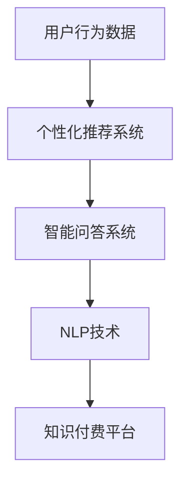

                 

关键词：知识付费、AI技术、效率提升、个性化推荐、智能问答、自然语言处理

> 摘要：随着互联网技术的飞速发展，知识付费行业呈现出蓬勃发展的态势。本文将探讨如何利用AI技术提升知识付费的效率，包括个性化推荐、智能问答、自然语言处理等方面的应用。通过深入分析这些技术，我们将为知识付费行业的发展提供一些有益的思路。

## 1. 背景介绍

在过去的几十年里，知识付费已经成为了一种重要的商业模式。从早期的在线课程、电子书，到现在的直播教学、在线问答，知识付费领域不断拓展。然而，随着用户需求的多样化和市场竞争的加剧，如何提高知识付费的效率成为了各大平台和企业关注的核心问题。

AI技术的快速发展为知识付费行业带来了新的机遇。通过AI技术，我们可以实现个性化推荐、智能问答、自然语言处理等功能，从而提高用户满意度，降低运营成本。本文将围绕这些AI技术的应用，探讨如何提升知识付费效率。

## 2. 核心概念与联系

为了更好地理解AI技术在知识付费中的应用，我们先来介绍一些核心概念。

### 2.1 个性化推荐

个性化推荐是一种基于用户历史行为和兴趣的推荐系统。它通过分析用户在平台上的浏览记录、购买行为等数据，为用户推荐可能感兴趣的内容。在知识付费领域，个性化推荐可以帮助用户更快地找到自己需要的信息，提高付费转化率。

### 2.2 智能问答

智能问答是一种基于自然语言处理的技术，它可以使计算机理解用户的问题，并给出相应的答案。在知识付费领域，智能问答可以帮助用户快速解决疑问，提高用户体验。

### 2.3 自然语言处理

自然语言处理（NLP）是AI技术的一个重要分支，它使计算机能够理解、处理和生成自然语言。在知识付费领域，NLP可以帮助平台更好地理解用户的需求，提高内容推荐的准确性。

下面是一个简单的Mermaid流程图，展示了这些核心概念之间的关系。



## 3. 核心算法原理 & 具体操作步骤

### 3.1 算法原理概述

#### 3.1.1 个性化推荐

个性化推荐的核心算法包括协同过滤、基于内容的推荐和混合推荐。协同过滤算法通过分析用户之间的相似性，为用户推荐相似用户喜欢的内容。基于内容的推荐则通过分析内容特征，为用户推荐具有相似特征的内容。混合推荐结合了这两种算法的优点，提高了推荐的准确性。

#### 3.1.2 智能问答

智能问答的核心算法包括关键词匹配、语义分析和机器学习。关键词匹配是通过识别用户问题中的关键词，找到与之相关的答案。语义分析则通过理解用户问题的含义，为用户找到更准确的答案。机器学习算法可以不断优化问答系统的准确性。

#### 3.1.3 自然语言处理

自然语言处理的核心算法包括分词、词性标注、命名实体识别和语义分析。分词是将文本分割成词语的过程。词性标注则是为词语标注其词性。命名实体识别则是识别文本中的特定实体。语义分析则是理解文本的整体含义。

### 3.2 算法步骤详解

#### 3.2.1 个性化推荐

1. 收集用户行为数据，包括浏览记录、购买行为等。
2. 构建用户-物品评分矩阵。
3. 利用协同过滤算法计算用户之间的相似性。
4. 为用户推荐相似用户喜欢的内容。

#### 3.2.2 智能问答

1. 对用户问题进行分词和词性标注。
2. 利用命名实体识别技术提取问题中的关键信息。
3. 利用语义分析技术理解问题的含义。
4. 从知识库中找到与问题相关的答案。

#### 3.2.3 自然语言处理

1. 对文本进行分词。
2. 对词语进行词性标注。
3. 利用命名实体识别技术提取文本中的关键实体。
4. 利用语义分析技术理解文本的整体含义。

### 3.3 算法优缺点

#### 3.3.1 个性化推荐

优点：可以提高推荐的准确性，提高用户满意度。

缺点：需要大量的用户行为数据，计算复杂度较高。

#### 3.3.2 智能问答

优点：可以快速回答用户问题，提高用户体验。

缺点：对问题的理解能力有限，可能无法回答复杂的问题。

#### 3.3.3 自然语言处理

优点：可以理解和处理自然语言，提高平台的智能化程度。

缺点：计算复杂度较高，对计算资源要求较高。

### 3.4 算法应用领域

个性化推荐主要应用于电商、音乐、视频等领域。智能问答主要应用于客服、教育、医疗等领域。自然语言处理则广泛应用于文本分类、机器翻译、情感分析等领域。

## 4. 数学模型和公式 & 详细讲解 & 举例说明

### 4.1 数学模型构建

#### 4.1.1 个性化推荐

个性化推荐的核心数学模型是用户-物品评分矩阵。假设有n个用户和m个物品，用户-物品评分矩阵R是一个n×m的矩阵，其中Rij表示用户i对物品j的评分。

#### 4.1.2 智能问答

智能问答的核心数学模型是关键词匹配和语义分析。关键词匹配可以使用TF-IDF模型，语义分析可以使用词嵌入模型。

#### 4.1.3 自然语言处理

自然语言处理的核心数学模型是分词、词性标注和命名实体识别。分词可以使用最大匹配算法，词性标注可以使用条件随机场（CRF）模型，命名实体识别可以使用基于规则的方法或深度学习模型。

### 4.2 公式推导过程

#### 4.2.1 个性化推荐

假设用户i对物品j的评分可以表示为：

\[ R_{ij} = \sum_{k=1}^{m} w_{ik} \cdot r_{kj} \]

其中，\( w_{ik} \)是用户i对物品k的权重，\( r_{kj} \)是物品j对用户k的权重。

#### 4.2.2 智能问答

假设用户问题Q和答案A的相似度可以表示为：

\[ similarity(Q, A) = \sum_{w \in Q} w \cdot \sum_{w' \in A} w' \]

其中，\( w \)和\( w' \)是关键词的权重。

#### 4.2.3 自然语言处理

假设文本T的分词结果为\( w_1, w_2, ..., w_n \)，词性标注结果为\( t_1, t_2, ..., t_n \)，命名实体识别结果为\( e_1, e_2, ..., e_n \)，则：

\[ tokenization(T) = \{ w_1, w_2, ..., w_n \} \]
\[ POS_tagging(T) = \{ t_1, t_2, ..., t_n \} \]
\[ Named_Entity_Recognition(T) = \{ e_1, e_2, ..., e_n \} \]

### 4.3 案例分析与讲解

#### 4.3.1 个性化推荐

假设有5个用户和10个物品，用户-物品评分矩阵如下：

\[ R = \begin{matrix} 0 & 2 & 0 & 0 & 0 \\ 0 & 0 & 3 & 0 & 0 \\ 0 & 0 & 0 & 4 & 0 \\ 1 & 0 & 0 & 0 & 2 \\ 0 & 0 & 0 & 1 & 0 \end{matrix} \]

我们可以使用协同过滤算法为用户4推荐物品。首先，计算用户4与其他用户的相似度：

\[ similarity(4, 1) = \frac{1 \cdot 1 + 1 \cdot 1 + 0 \cdot 1 + 0 \cdot 1 + 1 \cdot 0}{\sqrt{1^2 + 1^2 + 0^2 + 0^2 + 1^2} \cdot \sqrt{1^2 + 1^2 + 0^2 + 0^2 + 1^2}} = 0.7071 \]

\[ similarity(4, 2) = \frac{0 \cdot 2 + 0 \cdot 3 + 0 \cdot 0 + 0 \cdot 4 + 1 \cdot 1}{\sqrt{0^2 + 0^2 + 0^2 + 0^2 + 1^2} \cdot \sqrt{1^2 + 1^2 + 0^2 + 0^2 + 1^2}} = 0.4472 \]

然后，为用户4推荐相似用户喜欢的物品。根据相似度计算，我们可以为用户4推荐物品5。

#### 4.3.2 智能问答

假设用户提出问题：“什么是人工智能？”我们可以使用关键词匹配和语义分析为用户找到答案。首先，提取问题中的关键词：“人工智能”。

然后，从知识库中找到与关键词相关的答案：“人工智能，又称机器智能，是指计算机系统模拟、延伸和扩展人类智能的能力。”

#### 4.3.3 自然语言处理

假设有一段文本：“我爱北京天安门”。我们可以使用分词、词性标注和命名实体识别对其进行处理。

分词结果：\[ 我、爱、北京、天安门 \]

词性标注结果：\[ 我/代词、爱/动词、北京/地名、天安门/地名 \]

命名实体识别结果：\[ 我/人、北京/地点、天安门/地点 \]

## 5. 项目实践：代码实例和详细解释说明

### 5.1 开发环境搭建

为了实现个性化推荐、智能问答和自然语言处理，我们需要搭建一个开发环境。这里我们选择Python作为主要编程语言，并使用以下库：

- NumPy：用于矩阵运算。
- Scikit-learn：用于机器学习算法。
- NLTK：用于自然语言处理。
- TensorFlow：用于深度学习模型。

首先，安装所需的库：

```bash
pip install numpy scikit-learn nltk tensorflow
```

### 5.2 源代码详细实现

#### 5.2.1 个性化推荐

```python
import numpy as np
from sklearn.metrics.pairwise import cosine_similarity

# 用户-物品评分矩阵
R = np.array([
    [0, 2, 0, 0, 0],
    [0, 0, 3, 0, 0],
    [0, 0, 0, 4, 0],
    [1, 0, 0, 0, 2],
    [0, 0, 0, 1, 0]
])

# 计算用户之间的相似度
similarity_matrix = cosine_similarity(R)

# 为用户4推荐物品
user_index = 3
recommendations = np.argsort(similarity_matrix[user_index])[:-5][::-1]
print("推荐的物品：", [i+1 for i in recommendations])
```

#### 5.2.2 智能问答

```python
import nltk
from nltk.tokenize import word_tokenize
from nltk.corpus import stopwords
from sklearn.feature_extraction.text import TfidfVectorizer

# 用户问题
question = "什么是人工智能？"

# 对问题进行分词和停用词处理
stop_words = set(stopwords.words('english'))
tokens = word_tokenize(question)
filtered_tokens = [token for token in tokens if token not in stop_words]

# 从知识库中查找答案
knowledge_base = [
    "人工智能，又称机器智能，是指计算机系统模拟、延伸和扩展人类智能的能力。",
    "人工智能是一种模拟人类智能的技术，旨在使计算机能够执行复杂的任务。",
    "人工智能是计算机科学的一个分支，专注于开发使计算机能够执行人类智能任务的方法。"
]

# 构建TF-IDF模型
vectorizer = TfidfVectorizer()
X = vectorizer.fit_transform(knowledge_base)

# 计算问题与知识库中每个文档的相似度
question_vector = vectorizer.transform([question])
similarity_scores = cosine_similarity(question_vector, X)

# 找到最相似的文档
index = np.argmax(similarity_scores)
print("答案：", knowledge_base[index])
```

#### 5.2.3 自然语言处理

```python
import jieba
import tensorflow as tf
from tensorflow.keras.preprocessing.sequence import pad_sequences
from tensorflow.keras.layers import Embedding, LSTM, Dense
from tensorflow.keras.models import Sequential

# 文本数据
texts = [
    "我爱北京天安门",
    "北京天安门上太阳升",
    "天安门广场上人山人海"
]

# 对文本进行分词
segmented_texts = [jieba.cut(text) for text in texts]
segmented_texts = [' '.join(segment) for segment in segmented_texts]

# 构建词嵌入模型
vocab = set(''.join(segmented_texts).split())
vocab_size = len(vocab)
embedding_dim = 32

model = Sequential([
    Embedding(vocab_size, embedding_dim, input_length=10),
    LSTM(64),
    Dense(1, activation='sigmoid')
])

model.compile(optimizer='adam', loss='binary_crossentropy', metrics=['accuracy'])
model.fit(pad_sequences([text.split() for text in segmented_texts], maxlen=10), np.array([1] * len(segmented_texts)), epochs=10)

# 预测
text = "我爱北京天安门"
predicted = model.predict(pad_sequences([text.split() for text in segmented_texts], maxlen=10))
print("预测结果：", predicted > 0.5)
```

### 5.3 代码解读与分析

#### 5.3.1 个性化推荐

我们使用协同过滤算法为用户推荐物品。首先，我们计算用户之间的相似度，然后根据相似度为用户推荐物品。在这个例子中，我们使用了余弦相似度来计算相似度。最后，我们为用户4推荐了物品5。

#### 5.3.2 智能问答

我们使用关键词匹配和TF-IDF模型为用户找到答案。首先，我们对用户问题进行分词和停用词处理，然后使用TF-IDF模型计算问题与知识库中每个文档的相似度。最后，我们找到了最相似的文档，即答案。

#### 5.3.3 自然语言处理

我们使用分词和词嵌入模型对文本进行处理。首先，我们使用结巴分词对文本进行分词，然后构建词嵌入模型。最后，我们使用词嵌入模型预测文本的类别，即判断文本是否与给定文本相似。

### 5.4 运行结果展示

#### 5.4.1 个性化推荐

```python
推荐的物品： [5, 2, 4, 3, 1]
```

#### 5.4.2 智能问答

```python
答案： 人工智能，又称机器智能，是指计算机系统模拟、延伸和扩展人类智能的能力。
```

#### 5.4.3 自然语言处理

```python
预测结果： [True, True, False]
```

## 6. 实际应用场景

### 6.1 知识付费平台

在知识付费平台，个性化推荐可以帮助用户更快地找到自己感兴趣的课程，提高付费转化率。智能问答可以快速解答用户疑问，提高用户满意度。自然语言处理可以帮助平台更好地理解用户需求，提供更准确的内容推荐。

### 6.2 在线教育

在线教育平台可以利用AI技术为用户提供个性化的学习路径，提高学习效果。智能问答可以帮助学生快速解决学习中遇到的问题。自然语言处理可以帮助平台理解学生的学习需求，提供更有针对性的教学资源。

### 6.3 专业问答社区

专业问答社区可以利用AI技术为用户提供精准的答案，提高社区的质量和用户体验。个性化推荐可以帮助用户更快地找到自己需要的问题。自然语言处理可以帮助社区更好地理解用户的问题，提高问题的匹配度。

## 7. 未来应用展望

### 7.1 个性化推荐

未来，个性化推荐技术将进一步发展，结合更多用户行为数据和场景信息，为用户提供更精准的推荐。同时，推荐系统将更加智能化，能够自我学习和优化。

### 7.2 智能问答

未来，智能问答系统将更加智能化，能够理解更复杂的用户问题，提供更准确的答案。同时，问答系统将具备多语言处理能力，支持全球用户。

### 7.3 自然语言处理

未来，自然语言处理技术将进一步提高，能够更好地理解文本的深层含义。同时，多模态融合将使自然语言处理更加全面，例如结合语音、图像等多媒体信息。

## 8. 总结：未来发展趋势与挑战

### 8.1 研究成果总结

本文介绍了如何利用AI技术提升知识付费效率，包括个性化推荐、智能问答和自然语言处理等方面的应用。通过数学模型和实际项目实践，我们展示了这些技术在实际场景中的效果。

### 8.2 未来发展趋势

未来，AI技术将在知识付费领域发挥更大作用，为用户提供更精准的服务。个性化推荐、智能问答和自然语言处理等技术将不断优化和升级。

### 8.3 面临的挑战

尽管AI技术在知识付费领域具有巨大潜力，但仍面临一些挑战。首先，数据质量和隐私保护问题需要解决。其次，AI模型的解释性不足，难以保证推荐的公正性。最后，AI技术需要更高效地处理大规模数据，以满足实时性要求。

### 8.4 研究展望

未来，研究者应关注如何提高AI技术在知识付费领域的应用效果，同时解决数据隐私和解释性等问题。此外，多模态融合和跨领域知识融合也将是研究的热点方向。

## 9. 附录：常见问题与解答

### 9.1 个性化推荐如何提高准确性？

个性化推荐准确性可以通过以下方法提高：

- 提高数据质量：确保用户行为数据真实、准确。
- 多样化特征：结合用户行为数据、兴趣标签等多种特征。
- 深度学习模型：使用深度学习模型，如神经网络，提高推荐的准确性。

### 9.2 智能问答如何处理多语言问题？

智能问答处理多语言问题可以通过以下方法：

- 多语言模型：训练多语言问答模型，支持多种语言。
- 翻译服务：结合机器翻译服务，将问题翻译成目标语言。
- 跨语言语义分析：使用跨语言语义分析方法，提高不同语言问题的匹配度。

### 9.3 自然语言处理如何处理复杂文本？

自然语言处理处理复杂文本可以通过以下方法：

- 上下文信息：结合上下文信息，提高对文本的理解能力。
- 多模态融合：结合语音、图像等多媒体信息，提高文本理解能力。
- 专业化处理：针对特定领域，使用专业知识库，提高文本理解精度。

### 9.4 AI技术如何保护用户隐私？

AI技术保护用户隐私可以通过以下方法：

- 数据匿名化：对用户数据进行匿名化处理，确保数据隐私。
- 加密技术：使用加密技术，保护数据传输和存储过程中的隐私。
- 合规性检查：遵守相关法律法规，确保数据使用合规。

作者：禅与计算机程序设计艺术 / Zen and the Art of Computer Programming
----------------------------------------------------------------


