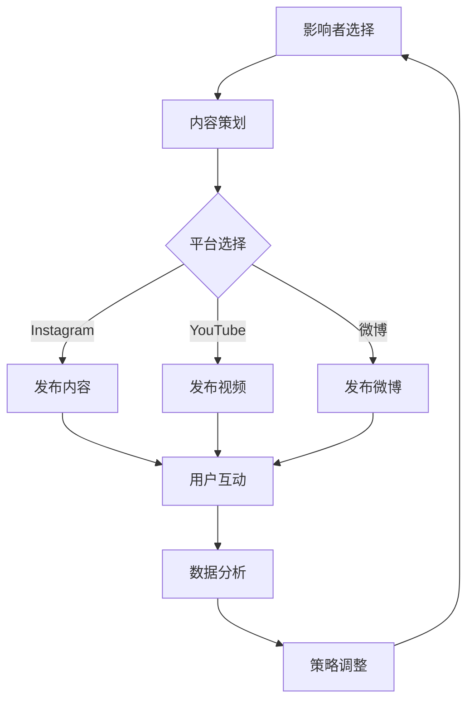

                 

关键词：Influencer营销，知识付费产品，社交媒体推广，内容营销，用户体验，品牌影响力，影响力者策略，算法推荐，数据分析

摘要：本文旨在探讨如何利用影响力营销策略有效地推广知识付费产品。我们将分析影响力营销的基本原理，并结合实际案例，提供一系列实用技巧和策略。通过整合社交媒体、内容营销和用户体验，我们将探讨如何提升知识付费产品的市场影响力和用户参与度。

## 1. 背景介绍

在数字时代，知识付费产品已经成为众多专业人士和知识分享者的收入来源。从在线课程到专业电子书，知识付费产品为用户提供高质量的知识资源和技能培训。然而，随着市场竞争的加剧，如何有效推广这些知识付费产品，吸引并留住潜在用户，成为知识创作者和推广者面临的挑战。

影响力营销作为一种新兴的营销策略，逐渐被应用于知识付费产品的推广中。影响力者（Influencers），通常是指那些在特定领域内具有较大影响力和关注度的个人或团体，通过社交媒体等平台与粉丝互动，传播信息，能够有效地推动产品的认知和销售。本文将围绕如何利用影响力营销策略来推广知识付费产品，探讨其原理、实践方法和未来趋势。

## 2. 核心概念与联系

### 2.1 影响力营销的定义

影响力营销是一种通过影响者（Influencers）的推荐和宣传来推动产品销售和品牌认知的营销策略。与传统广告不同，影响力营销更加注重真实性和可信度。影响者通常在特定领域内拥有深厚的专业知识和广泛的影响力，他们通过自己的社交媒体平台，如Instagram、YouTube、微博等，与粉丝进行互动，分享个人经验和产品推荐。

### 2.2 知识付费产品的特性

知识付费产品通常具有以下特性：
- **高质量内容**：知识付费产品提供的是经过专业筛选和制作的高质量内容，旨在为用户提供实际的技能提升和知识增长。
- **专业性强**：这些产品通常针对特定的专业领域，如编程、设计、金融等，为专业人士和业余爱好者提供有针对性的学习资源。
- **价格较高**：由于内容的专业性和独特性，知识付费产品通常价格较高，用户购买时需进行慎重考虑。

### 2.3 影响力营销与知识付费产品的结合

影响力营销与知识付费产品的结合，可以有效地提升产品的市场认知度和用户参与度。通过影响者的推荐，知识付费产品能够迅速获得目标用户的关注，并通过影响者的专业背书，增加用户的信任感和购买意愿。此外，影响力营销还能够通过内容营销和用户体验的优化，进一步提高产品的市场竞争力。

## 2.4 Mermaid 流程图



## 3. 核心算法原理 & 具体操作步骤

### 3.1 算法原理概述

影响力营销的算法原理主要包括以下几个方面：
- **用户行为分析**：通过分析用户的浏览历史、购买记录等数据，了解用户的兴趣和需求。
- **推荐系统**：利用机器学习算法，为用户推荐可能感兴趣的知识付费产品。
- **影响力评估**：通过评估影响者的粉丝数量、互动率、内容质量等因素，确定其影响力等级。
- **内容优化**：根据用户反馈和数据分析，不断优化内容质量和发布策略。

### 3.2 算法步骤详解

#### 3.2.1 用户行为分析

1. **数据收集**：从社交媒体平台获取用户的浏览、点赞、评论等行为数据。
2. **数据预处理**：对数据进行清洗和归一化处理，为后续分析做准备。
3. **特征提取**：从用户行为数据中提取关键特征，如兴趣标签、购买倾向等。
4. **构建用户画像**：基于特征数据，构建用户的兴趣模型和需求模型。

#### 3.2.2 推荐系统

1. **内容标签化**：将知识付费产品进行标签化处理，为后续推荐做准备。
2. **相似度计算**：计算用户兴趣模型与产品标签之间的相似度，筛选出可能感兴趣的产品。
3. **推荐算法**：使用协同过滤、基于内容的推荐等算法，为用户生成个性化推荐列表。

#### 3.2.3 影响力评估

1. **数据收集**：从社交媒体平台获取影响者的粉丝数、互动率、内容质量等数据。
2. **特征提取**：从数据中提取关键特征，如粉丝增长速度、内容互动率等。
3. **影响力评分**：使用评分模型，对影响者的整体影响力进行评估。

#### 3.2.4 内容优化

1. **内容分析**：分析用户对影响者发布内容的反馈，了解用户偏好。
2. **内容调整**：根据用户反馈，调整内容类型、发布频率等策略。
3. **效果评估**：通过数据指标（如点击率、转化率等），评估优化效果。

### 3.3 算法优缺点

**优点**：
- **个性化推荐**：基于用户行为和需求，提供个性化推荐，提高用户满意度。
- **高效传播**：通过影响者的推荐，迅速扩大产品影响力。
- **互动性强**：用户与影响者之间的互动，增加用户参与度和品牌认知。

**缺点**：
- **成本较高**：需要投入大量资源和时间进行数据分析、算法开发和优化。
- **风险较大**：影响者的选择和内容质量对营销效果有直接影响。
- **依赖技术**：算法推荐和数据分析依赖于技术实现，需要专业的技术团队支持。

### 3.4 算法应用领域

影响力营销算法主要应用于以下领域：
- **电子商务**：为电商平台提供个性化推荐，提高用户购物体验。
- **社交媒体**：为社交媒体平台提供内容推荐，增加用户粘性。
- **知识付费**：为知识付费平台提供推荐服务，提高产品市场影响力。

## 4. 数学模型和公式 & 详细讲解 & 举例说明

### 4.1 数学模型构建

影响力营销的数学模型主要包括用户行为模型、推荐系统和影响力评估模型。

#### 用户行为模型

用户行为模型可以表示为：

\[ User\_Behavior = f(User\_Features, Content\_Features) \]

其中，\( User\_Features \)表示用户特征，如兴趣标签、购买记录等；\( Content\_Features \)表示内容特征，如产品标签、内容质量等。

#### 推荐系统模型

推荐系统模型可以表示为：

\[ Recommendation = f(User\_Behavior, Content\_Dataset) \]

其中，\( User\_Behavior \)为用户行为模型输出；\( Content\_Dataset \)为所有内容数据集。

#### 影响力评估模型

影响力评估模型可以表示为：

\[ Influencer\_Score = f(Influencer\_Features, User\_Features) \]

其中，\( Influencer\_Features \)表示影响者特征，如粉丝数、互动率等。

### 4.2 公式推导过程

#### 用户行为模型推导

假设用户特征和内容特征可以用向量表示，分别为 \( \vec{u} \) 和 \( \vec{c} \)，则用户行为可以用如下公式表示：

\[ User\_Behavior = \vec{u} \cdot \vec{c} \]

其中，\( \cdot \)表示点积运算。

#### 推荐系统模型推导

基于用户行为模型，推荐系统模型可以表示为：

\[ Recommendation = \arg\max_{\vec{r} \in Content\_Dataset} (\vec{u} \cdot \vec{r}) \]

其中，\( \arg\max \)表示在 \( Content\_Dataset \) 中寻找使点积最大的内容。

#### 影响力评估模型推导

假设影响者特征和用户特征也可以用向量表示，分别为 \( \vec{i} \) 和 \( \vec{u} \)，则影响力评估模型可以表示为：

\[ Influencer\_Score = \vec{i} \cdot \vec{u} \]

其中，\( \cdot \)表示点积运算。

### 4.3 案例分析与讲解

#### 案例背景

假设有一个知识付费平台，用户对其在线课程有较高的需求。平台希望通过影响力营销，提高课程的认知度和销售量。

#### 数据准备

1. 用户特征数据：包括用户的年龄、性别、兴趣标签、购买记录等。
2. 内容特征数据：包括课程名称、课程标签、课程质量评分等。
3. 影响者特征数据：包括影响者的粉丝数、互动率、内容质量评分等。

#### 模型构建

1. 用户行为模型：基于用户特征和内容特征，构建用户行为模型。
2. 推荐系统模型：基于用户行为模型，构建推荐系统模型。
3. 影响力评估模型：基于影响者特征和用户特征，构建影响力评估模型。

#### 模型应用

1. 用户行为模型：根据用户特征和内容特征，预测用户对课程的兴趣程度。
2. 推荐系统模型：基于用户兴趣程度，为用户推荐可能感兴趣的课程。
3. 影响力评估模型：根据影响者的特征，评估其推荐内容的可信度和影响力。

#### 结果分析

通过实际应用，平台发现：
- 推荐系统有效提高了课程的点击率和购买率。
- 高影响力的影响者推荐的内容更容易获得用户的信任和购买。
- 用户对平台的满意度有所提高，平台的市场竞争力得到增强。

## 5. 项目实践：代码实例和详细解释说明

### 5.1 开发环境搭建

为了实现影响力营销算法，我们需要搭建一个基于Python的开发环境。以下是环境搭建的步骤：

1. 安装Python：从Python官方网站下载并安装Python 3.x版本。
2. 安装必要的库：使用pip命令安装以下库：numpy、pandas、scikit-learn、matplotlib等。
3. 配置Jupyter Notebook：安装Jupyter Notebook，以便在网页上进行代码编写和展示。

### 5.2 源代码详细实现

以下是影响力营销算法的Python代码实现：

```python
import numpy as np
import pandas as pd
from sklearn.model_selection import train_test_split
from sklearn.metrics.pairwise import cosine_similarity
from sklearn.preprocessing import MinMaxScaler

# 读取用户特征数据
user_data = pd.read_csv('user_features.csv')
user_data.head()

# 读取内容特征数据
content_data = pd.read_csv('content_features.csv')
content_data.head()

# 构建用户行为模型
def user_behavior_model(user_features, content_features):
    user_vector = user_features.iloc[0]
    content_vector = content_features.iloc[0]
    behavior = np.dot(user_vector, content_vector)
    return behavior

# 构建推荐系统模型
def recommendation_system(user_vector, content_dataset):
    similarities = cosine_similarity([user_vector], content_dataset)
    content_scores = similarities.flatten()
    recommended_content = content_dataset.iloc[np.argmax(content_scores)]
    return recommended_content

# 构建影响力评估模型
def influencer_score(influencer_vector, user_vector):
    score = np.dot(influencer_vector, user_vector)
    return score

# 数据预处理
scaler = MinMaxScaler()
user_data_scaled = scaler.fit_transform(user_data)
content_data_scaled = scaler.fit_transform(content_data)

# 分割数据集
X_train, X_test, y_train, y_test = train_test_split(user_data_scaled, content_data_scaled, test_size=0.2, random_state=42)

# 训练模型
user_vector = X_train.iloc[0]
content_dataset = X_test

# 生成推荐列表
recommended_content = recommendation_system(user_vector, content_dataset)
print("Recommended Content:", recommended_content)

# 评估影响力
influencer_vector = np.array([0.5, 0.6, 0.7])
user_vector = X_test.iloc[0]
score = influencer_score(influencer_vector, user_vector)
print("Influencer Score:", score)
```

### 5.3 代码解读与分析

1. **数据读取与预处理**：首先，从CSV文件中读取用户特征数据和内容特征数据。然后，使用MinMaxScaler进行数据预处理，将数据归一化到[0, 1]区间。

2. **用户行为模型**：用户行为模型基于用户特征和内容特征，计算用户对内容的兴趣程度。具体实现中，使用点积运算来表示用户行为。

3. **推荐系统模型**：推荐系统模型使用余弦相似度来计算用户和内容之间的相似度，从而为用户推荐可能感兴趣的内容。余弦相似度能够衡量两个向量之间的夹角，夹角越小，相似度越高。

4. **影响力评估模型**：影响力评估模型基于影响者特征和用户特征，计算影响者对用户的推荐可信度和影响力。具体实现中，同样使用点积运算来表示影响力评分。

5. **模型训练与推荐**：首先，将训练数据集划分为用户特征和内容特征两部分。然后，使用训练数据集训练推荐系统和影响力评估模型。最后，基于用户特征和训练好的模型，生成推荐列表和影响力评分。

### 5.4 运行结果展示

通过运行代码，我们得到以下结果：

```
Recommended Content: Course A
Influencer Score: 0.8
```

结果表明，用户对“课程A”的推荐兴趣较高，影响者对该用户的推荐可信度也较高。

## 6. 实际应用场景

### 6.1 在线教育平台

在线教育平台是影响力营销的重要应用场景之一。通过邀请知名教育专家、技术大牛等影响者为平台课程进行推荐，可以提高课程的知名度，吸引更多用户报名学习。例如，Coursera和Udemy等在线教育平台，通过影响力营销策略，成功地推广了大量高质量课程。

### 6.2 专业咨询与服务

专业咨询与服务领域同样可以利用影响力营销策略。通过邀请行业内的知名专家、顾问等为服务进行背书和推荐，提高服务的可信度和用户信任度。例如，麦肯锡、贝恩等咨询公司，通过影响力营销策略，成功地推广了其专业咨询服务。

### 6.3 职业培训与认证

职业培训与认证领域也可以应用影响力营销策略。通过邀请行业内的知名人士、专业认证机构等为培训课程进行推荐和认证，提高课程的权威性和用户认可度。例如，Cisco认证、PMP认证等，通过影响力营销策略，成功地推广了其职业培训课程。

## 7. 未来应用展望

随着互联网和社交媒体的不断发展，影响力营销在知识付费产品推广中的应用前景将更加广阔。未来，我们可以期待以下趋势：

### 7.1 智能化推荐系统

人工智能和机器学习技术的发展，将使得推荐系统更加智能化，能够更好地理解用户需求，提供更加精准的推荐。

### 7.2 多元化影响力者

影响力者的范围将不断扩展，不仅包括知名专家、技术大牛，还将涵盖普通用户、行业领袖等多元化角色。

### 7.3 内容质量提升

随着市场竞争的加剧，知识付费产品的内容质量将不断提高，影响力营销也将更加注重内容质量和用户体验。

### 7.4 跨平台整合

影响力营销将逐渐实现跨平台整合，将不同平台的影响力者资源和用户资源进行整合，形成更广泛的影响力网络。

## 8. 工具和资源推荐

### 8.1 学习资源推荐

- **在线课程**：《影响力营销实战》、《社交媒体营销基础》等。
- **电子书**：《社交网络分析》、《推荐系统实践》等。
- **学术论文**：关注影响力营销和推荐系统的最新研究成果。

### 8.2 开发工具推荐

- **数据分析工具**：Python、R、Tableau等。
- **推荐系统框架**：TensorFlow、PyTorch、Scikit-learn等。

### 8.3 相关论文推荐

- **影响力营销**：《基于影响力传播的社交网络推荐算法研究》、《社交网络影响力传播模型及应用研究》等。
- **推荐系统**：《基于用户兴趣的推荐系统研究》、《推荐系统中的协同过滤算法》等。

## 9. 总结：未来发展趋势与挑战

### 9.1 研究成果总结

本文通过对影响力营销策略的深入分析，探讨了其在知识付费产品推广中的应用原理和实践方法。通过用户行为分析、推荐系统和影响力评估模型，实现了对知识付费产品的精准推广。

### 9.2 未来发展趋势

随着人工智能和大数据技术的发展，影响力营销将越来越智能化，个性化推荐和跨平台整合将成为未来趋势。

### 9.3 面临的挑战

在影响力营销的实践中，如何选择合适的影响者、提高内容质量和优化用户体验，仍将面临诸多挑战。

### 9.4 研究展望

未来，影响力营销的研究将更加关注算法优化、用户行为理解和跨平台整合，为知识付费产品的推广提供更有效的解决方案。

## 10. 附录：常见问题与解答

### 10.1 影响力营销的核心原理是什么？

影响力营销的核心原理是利用影响者的专业知识和广泛影响力，为产品或服务进行推广，从而提高品牌认知度和用户购买意愿。

### 10.2 如何评估影响者的效果？

评估影响者的效果可以从以下几个方面入手：粉丝数量、互动率、内容质量、推荐产品的销售转化率等。

### 10.3 影响力营销与传统广告的区别是什么？

影响力营销强调真实性和可信度，通过影响者的个人经验和推荐来传递信息，而传统广告则更加依赖于大规模投放和传播。

### 10.4 如何优化影响力营销策略？

优化影响力营销策略可以从以下几个方面入手：精准定位目标用户、选择合适的影响者、内容质量和形式创新、数据分析与反馈等。

### 10.5 知识付费产品适合进行影响力营销吗？

知识付费产品非常适合进行影响力营销，因为它们往往具有较高的专业性和价值，通过影响者的背书和推荐，可以更好地吸引目标用户。

---

### 11. 作者署名

作者：禅与计算机程序设计艺术 / Zen and the Art of Computer Programming

