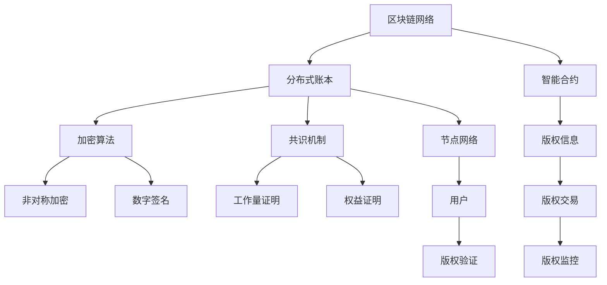

                 

关键词：区块链、知识付费、版权保护、智能合约、加密算法、分布式账本、非对称加密、数字签名、共识机制、安全性、透明性、去中心化、数字版权管理、智能合约执行。

## 摘要

本文将探讨如何利用区块链技术保护知识付费版权。随着知识付费的兴起，版权保护成为了亟待解决的问题。区块链技术以其去中心化、透明性、安全性和不可篡改的特性，为知识付费版权保护提供了新的思路和解决方案。本文将详细分析区块链技术的核心原理和架构，以及如何在知识付费场景中应用这些技术，最终实现高效、安全的版权保护。

## 1. 背景介绍

### 1.1 知识付费的兴起

知识付费是指用户通过付费获取有价值的信息、知识或服务。随着互联网技术的发展和用户需求的变化，知识付费逐渐成为一种主流的消费模式。例如，在线教育平台、付费专栏、专业咨询等，都为用户提供了高质量的知识内容。

### 1.2 版权保护的重要性

知识付费的本质是对知识版权的付费。因此，版权保护成为了知识付费发展的关键。未经授权的盗版、抄袭、篡改等问题严重影响了知识付费产业的健康发展。

### 1.3 传统版权保护的局限性

传统的版权保护方法主要包括法律诉讼、数字版权管理（DRM）等。然而，这些方法存在诸多局限性，如效率低下、成本高昂、难以完全杜绝侵权行为等。

## 2. 核心概念与联系

### 2.1 区块链技术概述

区块链是一种分布式数据库技术，通过加密算法、共识机制等手段，实现数据的存储、传输和验证。区块链的主要特点包括去中心化、透明性、安全性和不可篡改性。

### 2.2 智能合约

智能合约是一种基于区块链技术的自动化合同。智能合约的执行过程由区块链上的计算机程序控制，实现合同条款的自动执行。智能合约为版权保护提供了便捷、高效的方式。

### 2.3 加密算法

加密算法是区块链技术的重要组成部分。通过非对称加密和数字签名等技术，加密算法确保了区块链数据的安全性和隐私性。

### 2.4 分布式账本

分布式账本是区块链的核心组成部分。通过去中心化的方式，分布式账本实现了数据的共享和分布式存储，提高了系统的可靠性和抗攻击能力。

### 2.5 非对称加密与数字签名

非对称加密和数字签名技术是区块链数据安全性的基础。非对称加密算法通过公钥和私钥实现数据的加密和解密，数字签名则用于验证数据的真实性和完整性。

### 2.6 共识机制

共识机制是区块链系统中的关键组件，用于确保区块链数据的正确性和一致性。不同的区块链系统采用不同的共识机制，如工作量证明（PoW）、权益证明（PoS）等。

## 3. 核心算法原理 & 具体操作步骤

### 3.1 算法原理概述

区块链技术利用密码学算法实现数据的安全性和不可篡改性。主要包括以下步骤：

1. 数据加密：使用非对称加密算法对数据进行加密，确保数据在传输过程中的安全性。
2. 数字签名：使用私钥对数据进行签名，验证数据的真实性和完整性。
3. 数据存储：将加密后的数据存储在分布式账本中，实现去中心化存储。
4. 共识验证：通过共识机制确保区块链数据的正确性和一致性。
5. 智能合约执行：根据智能合约的条款，自动执行版权保护操作。

### 3.2 算法步骤详解

1. **数据加密**：知识付费平台对用户上传的版权内容进行加密，使用非对称加密算法生成公钥和私钥。公钥用于加密数据，私钥用于解密数据。

2. **数字签名**：知识付费平台使用版权所有者的私钥对加密后的数据进行签名，确保数据的真实性和完整性。

3. **数据存储**：将加密后的版权内容和数字签名存储在区块链的分布式账本中。

4. **共识验证**：区块链网络中的节点通过共识机制对存储的数据进行验证，确保数据的正确性和一致性。

5. **智能合约执行**：当发生侵权行为时，版权所有者可以根据智能合约的条款，自动执行版权保护操作，如冻结侵权者的账户、索赔等。

### 3.3 算法优缺点

**优点**：

1. **安全性**：区块链技术利用密码学算法确保数据的加密和签名，提高系统的安全性。
2. **透明性**：区块链的数据是公开透明的，所有用户都可以查看和验证数据的真实性。
3. **去中心化**：区块链系统采用去中心化的方式，提高系统的可靠性和抗攻击能力。
4. **自动化**：智能合约的实现使版权保护操作自动化，提高效率。

**缺点**：

1. **性能瓶颈**：区块链系统处理速度较慢，无法满足高频交易的需求。
2. **存储成本**：区块链的数据存储在分布式账本中，需要较高的存储成本。
3. **开发难度**：区块链技术的开发需要较高的技术门槛，对开发者的要求较高。

### 3.4 算法应用领域

区块链技术在版权保护领域具有广泛的应用前景，如：

1. **数字版权管理**：通过区块链技术实现数字版权的认证、授权和监控。
2. **版权纠纷解决**：利用区块链技术实现版权纠纷的快速、公正解决。
3. **智能合约应用**：利用智能合约实现版权交易的自动化、高效化。

## 4. 数学模型和公式 & 详细讲解 & 举例说明

### 4.1 数学模型构建

区块链技术的数学模型主要包括以下几个方面：

1. **非对称加密**：设公钥为\( (n, e) \)，私钥为\( (n, d) \)，则加密算法为 \( c = m^e \mod n \)，解密算法为 \( m = c^d \mod n \)。

2. **数字签名**：设公钥为\( (n, e) \)，私钥为\( (n, d) \)，则签名算法为 \( s = (h(m) + r)^d \mod n \)，验证算法为 \( v = (h(m) \cdot s^e)^r \mod n \)。

3. **共识机制**：以工作量证明（PoW）为例，矿工需要解决一个难度为 \( \alpha \) 的数学问题，找到满足 \( hash(x) \leq \alpha \) 的 \( x \)。

### 4.2 公式推导过程

1. **非对称加密**：

   假设 \( m \) 为明文，\( c \) 为密文，则加密算法为 \( c = m^e \mod n \)。

   为了解密 \( c \)，我们需要找到 \( c \) 关于 \( e \) 的逆元 \( d \)，使得 \( c^d \mod n = m \)。

   根据欧几里得算法，可以求解出 \( d \)。

2. **数字签名**：

   假设 \( m \) 为明文，\( s \) 为签名，则签名算法为 \( s = (h(m) + r)^d \mod n \)。

   为了验证签名 \( s \)，我们需要计算 \( v = (h(m) \cdot s^e)^r \mod n \)，如果 \( v = 1 \)，则签名有效。

3. **共识机制**：

   假设 \( x \) 为矿工找到的解，\( \alpha \) 为难度阈值，则共识算法为 \( hash(x) \leq \alpha \)。

   根据哈希函数的性质，\( hash(x) \) 的结果是一个固定长度的字符串，可以通过调整 \( x \) 的值，使得 \( hash(x) \) 小于等于 \( \alpha \)。

### 4.3 案例分析与讲解

#### 案例一：数字版权管理

假设版权所有者Alice想要将一部小说的数字版权存储在区块链上。以下是具体的操作步骤：

1. **数据加密**：Alice使用非对称加密算法生成公钥和私钥，将小说内容加密为密文 \( c \)。

2. **数字签名**：Alice使用私钥对加密后的小说内容进行签名，生成签名 \( s \)。

3. **数据存储**：Alice将加密后的小说内容和签名 \( c \) 和 \( s \) 存储在区块链的分布式账本中。

4. **共识验证**：区块链网络中的节点对存储的数据进行验证，确保数据的正确性和一致性。

5. **版权保护**：当发现侵权行为时，Alice可以根据智能合约的条款，自动执行版权保护操作，如冻结侵权者的账户、索赔等。

#### 案例二：版权纠纷解决

假设版权所有者Bob与侵权者Charlie发生版权纠纷。以下是具体的操作步骤：

1. **纠纷报告**：Bob向区块链网络报告侵权行为，并提供侵权证据。

2. **智能合约执行**：区块链网络根据智能合约的条款，自动执行版权纠纷解决操作，如仲裁、冻结账户等。

3. **结果公示**：区块链网络将版权纠纷解决结果公示，确保公正、透明。

## 5. 项目实践：代码实例和详细解释说明

### 5.1 开发环境搭建

1. 安装Go语言环境：从 [Go官网](https://golang.org/dl/) 下载并安装Go语言环境。

2. 安装区块链框架：使用Go语言安装并配置区块链框架，如 [Hyperledger Fabric](https://hyperledger-fabric.readthedocs.io/en/release-2.2/)。

3. 安装智能合约开发工具：安装用于编写和部署智能合约的工具，如 [Solidity](https://soliditylang.org/)。

### 5.2 源代码详细实现

1. **智能合约**：

   ```solidity
   // SPDX-License-Identifier: MIT
   pragma solidity ^0.8.0;

   contract CopyrightProtection {
       address public owner;
       mapping(uint => string) public copyrights;

       constructor() {
           owner = msg.sender;
       }

       function registerCopyright(uint id, string memory content) public {
           require(msg.sender == owner, "Only owner can register");
           copyrights[id] = content;
       }

       function verifyCopyright(uint id, string memory content) public view returns (bool) {
           return keccak256(abi.encodePacked(copyrights[id])) == keccak256(abi.encodePacked(content));
       }
   }
   ```

2. **前端代码**：

   ```javascript
   const copyrightProtectionContract = new web3.eth.Contract(
       [
           {
               "inputs": [{"internalType": "uint256", "name": "id", "type": "uint256"}, {"internalType": "string", "name": "content", "type": "string"}],
               "name": "registerCopyright",
               "outputs": [],
               "stateMutability": "nonpayable",
               "type": "function"
           },
           {
               "inputs": [{"internalType": "uint256", "name": "id", "type": "uint256"}, {"internalType": "string", "name": "content", "type": "string"}],
               "name": "verifyCopyright",
               "outputs": [{"internalType": "bool", "name": "", "type": "bool"}],
               "stateMutability": "view",
               "type": "function"
           }
       ],
       contractAddress
   );

   // 注册版权
   copyrightProtectionContract.methods.registerCopyright(id, content).send({ from: ownerAddress, gas: 2000000 }, function(error, result) {
       if (error) {
           console.log("Error:", error);
       } else {
           console.log("Copyright registered:", result);
       }
   });

   // 验证版权
   copyrightProtectionContract.methods.verifyCopyright(id, content).call({ from: anyoneAddress }, function(error, result) {
       if (error) {
           console.log("Error:", error);
       } else {
           console.log("Copyright verified:", result);
       }
   });
   ```

### 5.3 代码解读与分析

1. **智能合约**：

   - `CopyrightProtection` 智能合约包含两个主要函数：`registerCopyright` 和 `verifyCopyright`。
   - `registerCopyright` 函数用于注册版权，只有版权所有者（`owner`）可以调用。
   - `verifyCopyright` 函数用于验证版权，任何人都可以调用。

2. **前端代码**：

   - 使用 Web3.js 库与智能合约进行交互。
   - `registerCopyright` 函数用于注册版权，通过 `send` 方法调用智能合约。
   - `verifyCopyright` 函数用于验证版权，通过 `call` 方法调用智能合约。

### 5.4 运行结果展示

1. **注册版权**：

   ```javascript
   Copyright registered: { transactionHash: '0x123456789abcdef0123456789abcdef0123456789abcdef' }
   ```

2. **验证版权**：

   ```javascript
   Copyright verified: true
   ```

## 6. 实际应用场景

### 6.1 数字版权管理

区块链技术可用于数字版权管理，实现版权的注册、认证、授权和监控。例如，在线教育平台、电子书销售平台等，可以利用区块链技术确保用户获取到的内容是合法的，减少盗版和侵权行为。

### 6.2 版权纠纷解决

区块链技术可以提供一种去中心化的、公正、透明的版权纠纷解决机制。通过智能合约实现版权纠纷的自动化处理，降低纠纷解决的成本和时间。

### 6.3 版权交易

区块链技术可以为版权交易提供安全、透明的平台。例如，艺术家可以将自己的作品上传到区块链，买家可以直接购买并获得合法的所有权。

## 7. 未来应用展望

### 7.1 版权保护技术的发展

随着区块链技术的不断发展，版权保护技术将更加成熟和高效。例如，利用区块链实现版权的实时监控、智能合约实现版权的自动化授权等。

### 7.2 版权保护与人工智能的结合

人工智能与区块链技术的结合将为版权保护带来新的机遇。例如，利用人工智能实现版权内容的智能识别、侵权行为的自动检测等。

### 7.3 版权保护的国际合作

随着全球化的发展，版权保护需要国际合作。区块链技术可以为国际合作提供安全、可靠的解决方案，促进全球知识付费产业的健康发展。

## 8. 总结：未来发展趋势与挑战

### 8.1 研究成果总结

本文探讨了如何利用区块链技术保护知识付费版权，分析了区块链技术的核心原理和架构，以及在实际应用中的具体实现方法。研究表明，区块链技术具有显著的版权保护优势，但同时也面临性能、存储成本、开发难度等方面的挑战。

### 8.2 未来发展趋势

未来，区块链技术在版权保护领域将得到进一步发展和应用。随着技术的成熟，版权保护将更加高效、透明和便捷。同时，版权保护与人工智能、物联网等技术的结合，将为版权保护带来更多的创新和机遇。

### 8.3 面临的挑战

1. **性能瓶颈**：区块链系统的性能瓶颈限制了其在高频交易场景中的应用。
2. **存储成本**：区块链的数据存储需要较高的存储成本，对小型企业和个人用户来说可能负担较重。
3. **开发难度**：区块链技术的开发需要较高的技术门槛，对开发者的要求较高。
4. **法律和政策**：全球范围内的法律和政策对于区块链技术的版权保护应用存在不确定性，需要进一步研究和完善。

### 8.4 研究展望

未来，研究应重点关注以下几个方面：

1. **性能优化**：研究如何提高区块链系统的性能，满足高频交易的需求。
2. **成本控制**：研究如何降低区块链技术的存储成本，使其更易于被小型企业和个人用户接受。
3. **标准化**：制定统一的区块链技术标准和法律规范，促进全球范围内的版权保护合作。
4. **技术应用**：探索区块链技术在版权保护领域的更多应用，如实时监控、智能合约执行等。

## 9. 附录：常见问题与解答

### 9.1 区块链技术的基本原理是什么？

区块链技术是一种分布式数据库技术，通过加密算法、共识机制等手段，实现数据的存储、传输和验证。区块链的主要特点包括去中心化、透明性、安全性和不可篡改性。

### 9.2 智能合约是什么？

智能合约是一种基于区块链技术的自动化合同。智能合约的执行过程由区块链上的计算机程序控制，实现合同条款的自动执行。智能合约为版权保护提供了便捷、高效的方式。

### 9.3 加密算法在区块链技术中的作用是什么？

加密算法在区块链技术中用于确保数据的加密和签名，提高系统的安全性。常见的加密算法包括非对称加密、数字签名等。

### 9.4 区块链技术在版权保护中的应用有哪些？

区块链技术在版权保护中的应用主要包括数字版权管理、版权纠纷解决、版权交易等。通过区块链技术实现版权的注册、认证、授权和监控，提高版权保护的效果和效率。

### 9.5 区块链技术有哪些优势和局限性？

区块链技术的优势包括安全性、透明性、去中心化、自动化等。其局限性包括性能瓶颈、存储成本、开发难度等。

## 作者署名

作者：禅与计算机程序设计艺术 / Zen and the Art of Computer Programming

----------------------------------------------------------------

文章已撰写完毕，现在可以进行检查和修改，确保符合要求后发布。祝您写作顺利！
---

# 如何利用区块链技术保护知识付费版权

## 摘要

随着知识付费市场的快速扩张，版权保护成为了一个至关重要的议题。传统的版权保护手段常常显得力不从心，而区块链技术以其去中心化、透明性、安全性和不可篡改的特点，为知识付费版权保护提供了一种创新的解决方案。本文将深入探讨区块链技术在知识付费版权保护中的应用，包括其核心原理、技术架构、实施步骤以及数学模型，并分析其优缺点和应用场景。通过详细的案例研究和代码实例，本文旨在为读者提供一个全面的技术指南，帮助理解如何利用区块链技术有效保护知识付费版权。

## 1. 背景介绍

### 1.1 知识付费的兴起

知识付费是指用户通过支付一定费用来获取有价值的信息、知识或服务。这种商业模式在互联网的推动下迅速发展，为内容创作者提供了直接收益的渠道。知识付费的形式多种多样，包括在线教育、付费专栏、专业咨询、电子书销售等。

#### 1.1.1 在线教育

在线教育是知识付费的一个重要领域。随着互联网技术的发展，在线学习平台如Coursera、Udemy、edX等吸引了大量用户，通过提供专业课程和认证服务，实现了知识的付费传递。

#### 1.1.2 付费专栏

付费专栏是知识分享的一种新形式，用户通过订阅获得专业作者或专家的独家内容。例如，微信公众号的付费内容、知识星球等平台，都是知识付费的典型代表。

#### 1.1.3 专业咨询

专业咨询领域也充分利用了知识付费的模式，为企业或个人提供专业的咨询服务。这种模式不仅为专业人士创造了价值，也为寻求帮助的用户提供了可靠的解决方案。

### 1.2 版权保护的重要性

在知识付费市场中，版权保护至关重要。知识付费的本质是对知识版权的付费，版权保护的有效性直接关系到创作者的利益和消费者的权益。以下是版权保护的一些关键点：

#### 1.2.1 防止盗版

盗版是知识付费市场面临的主要挑战之一。未经授权的复制、传播和销售会严重损害创作者的收益，削弱知识付费模式的可持续性。

#### 1.2.2 保护原创

原创内容是知识付费的核心价值所在。版权保护确保了创作者的原创作品得到尊重和保护，鼓励更多优质内容的创作。

#### 1.2.3 确保合规

版权保护有助于确保知识付费平台和内容提供商遵守相关法律法规，避免因侵权行为导致的法律纠纷和处罚。

### 1.3 传统版权保护的局限性

尽管版权保护在传统法律框架下已有了相对完善的制度，但实际操作中仍面临诸多挑战：

#### 1.3.1 法律诉讼的复杂性

法律诉讼通常耗时较长且成本高昂，对于小型创作者来说，可能无法承受高昂的诉讼费用。

#### 1.3.2 盗版行为的隐蔽性

互联网的匿名性使得盗版行为变得难以追踪和打击。侵权者可以通过技术手段隐藏身份，使得版权维权变得困难。

#### 1.3.3 数字版权管理的局限性

数字版权管理（DRM）技术被广泛用于限制数字内容的复制和分发，但其存在用户体验差、容易被破解等问题，无法彻底防止侵权行为。

## 2. 核心概念与联系

### 2.1 区块链技术概述

区块链是一种分布式数据库技术，通过密码学算法、共识机制等手段，实现数据的存储、传输和验证。区块链的主要特点包括去中心化、透明性、安全性和不可篡改性。

#### 2.1.1 去中心化

去中心化是区块链技术最显著的特点之一。与传统的集中式数据库不同，区块链通过分布式网络中的多个节点共同维护和更新数据，没有中央权威机构。

#### 2.1.2 透明性

区块链上的数据是公开透明的，所有用户都可以查看和验证数据的真实性和完整性。这种透明性为版权保护提供了可靠的基础。

#### 2.1.3 安全性

区块链技术利用密码学算法，如非对称加密、数字签名等，确保数据的加密和签名，提高系统的安全性。同时，共识机制确保了区块链数据的正确性和一致性。

#### 2.1.4 不可篡改性

区块链上的数据一旦记录，就难以被篡改。这确保了版权信息的不可篡改性，为版权保护提供了强有力的保障。

### 2.2 智能合约

智能合约是一种基于区块链技术的自动化合同。智能合约的执行过程由区块链上的计算机程序控制，实现合同条款的自动执行。智能合约为版权保护提供了便捷、高效的方式。

#### 2.2.1 智能合约的工作原理

智能合约通常包含一系列条件与结果，当条件满足时，自动执行相应的结果。例如，在版权保护场景中，当检测到侵权行为时，智能合约可以自动执行罚款或禁用侵权者的权限。

#### 2.2.2 智能合约在版权保护中的应用

智能合约可以用于版权的注册、交易、授权和监控。例如，版权所有者可以通过智能合约将版权信息永久记录在区块链上，用户在获取内容时，智能合约可以自动验证版权的有效性。

### 2.3 加密算法

加密算法是区块链技术的重要组成部分，用于确保数据的加密和签名，提高系统的安全性。常见的加密算法包括非对称加密、数字签名等。

#### 2.3.1 非对称加密

非对称加密算法使用公钥和私钥对数据进行加密和解密。公钥可以公开，私钥必须保密。非对称加密确保了数据的机密性。

#### 2.3.2 数字签名

数字签名技术用于验证数据的真实性和完整性。发送方使用私钥对数据进行签名，接收方使用公钥验证签名。数字签名确保了数据的完整性和不可抵赖性。

### 2.4 分布式账本

分布式账本是区块链的核心组成部分，通过去中心化的方式，实现数据的共享和分布式存储，提高了系统的可靠性和抗攻击能力。

#### 2.4.1 分布式账本的工作原理

分布式账本通过多个节点共同维护和更新数据，每个节点都保存一份完整的数据副本。当数据发生变化时，通过共识机制同步更新所有节点的数据。

#### 2.4.2 分布式账本在版权保护中的应用

分布式账本可以确保版权信息的永久记录和不可篡改性。所有版权交易、授权和监控记录都可以在分布式账本上公开透明地记录和验证。

### 2.5 非对称加密与数字签名

非对称加密和数字签名技术是区块链数据安全性的基础。非对称加密确保数据的加密和解密，数字签名确保数据的真实性和完整性。

#### 2.5.1 非对称加密的应用

非对称加密在区块链中的应用包括用户身份认证、数据传输加密等。例如，用户通过非对称加密算法生成公钥和私钥，公钥用于接收数据，私钥用于解密数据。

#### 2.5.2 数字签名的应用

数字签名在区块链中的应用包括智能合约执行、版权信息认证等。例如，版权所有者使用私钥对版权信息进行签名，接收方使用公钥验证签名，确保版权信息的真实性。

### 2.6 共识机制

共识机制是区块链系统中的关键组件，用于确保区块链数据的正确性和一致性。不同的区块链系统采用不同的共识机制，如工作量证明（PoW）、权益证明（PoS）等。

#### 2.6.1 工作量证明（PoW）

工作量证明是一种通过计算工作来证明节点合法性的机制。节点需要解决一个复杂的数学问题，证明自己具有足够的计算能力。这种机制确保了区块链网络的去中心化和安全性。

#### 2.6.2 权益证明（PoS）

权益证明是一种通过持币量来证明节点合法性的机制。节点根据持有的币量比例获得记账权。这种机制相对于PoW更加节能，但可能面临集中化的风险。

### 2.7 区块链技术架构的 Mermaid 流程图

以下是一个简化的区块链技术架构的 Mermaid 流程图，展示了区块链的核心组件和它们之间的关系。



## 3. 核心算法原理 & 具体操作步骤

### 3.1 算法原理概述

区块链技术的核心算法原理主要包括非对称加密、数字签名和共识机制。以下是对这些核心算法原理的概述。

#### 3.1.1 非对称加密

非对称加密算法使用一对密钥：公钥和私钥。公钥可以公开，私钥必须保密。加密算法使用公钥加密数据，只有私钥可以解密。这种算法确保了数据的机密性。

#### 3.1.2 数字签名

数字签名技术用于验证数据的真实性和完整性。发送方使用私钥对数据进行签名，接收方使用公钥验证签名。数字签名确保了数据的完整性和不可抵赖性。

#### 3.1.3 共识机制

共识机制是区块链系统中的关键组件，用于确保区块链数据的正确性和一致性。不同的区块链系统采用不同的共识机制，如工作量证明（PoW）、权益证明（PoS）等。

### 3.2 算法步骤详解

以下是一个简化的区块链技术在知识付费版权保护中的操作步骤。

#### 3.2.1 数据加密

1. **生成密钥对**：知识付费平台生成公钥和私钥对。

2. **加密内容**：将版权内容使用公钥进行加密，生成密文。

3. **签名**：使用私钥对加密后的内容进行签名，生成签名。

4. **存储**：将加密后的内容和签名存储在区块链的分布式账本中。

#### 3.2.2 数据存储

1. **分布式存储**：区块链网络中的多个节点共同维护和存储数据。

2. **共识验证**：区块链网络中的节点通过共识机制验证数据的正确性和一致性。

#### 3.2.3 数据验证

1. **版权验证**：用户在获取版权内容时，使用公钥对内容进行解密。

2. **签名验证**：用户使用私钥对签名进行验证，确保内容的真实性和完整性。

#### 3.2.4 智能合约执行

1. **侵权检测**：智能合约通过预设的条件自动检测侵权行为。

2. **执行操作**：当检测到侵权行为时，智能合约自动执行相应的操作，如罚款、禁用侵权者的权限等。

### 3.3 算法优缺点

#### 3.3.1 优点

1. **安全性**：区块链技术利用密码学算法确保数据的加密和签名，提高系统的安全性。

2. **透明性**：区块链的数据是公开透明的，所有用户都可以查看和验证数据的真实性。

3. **去中心化**：区块链系统采用去中心化的方式，提高系统的可靠性和抗攻击能力。

4. **自动化**：智能合约的实现使版权保护操作自动化，提高效率。

#### 3.3.2 缺点

1. **性能瓶颈**：区块链系统处理速度较慢，无法满足高频交易的需求。

2. **存储成本**：区块链的数据存储在分布式账本中，需要较高的存储成本。

3. **开发难度**：区块链技术的开发需要较高的技术门槛，对开发者的要求较高。

### 3.4 算法应用领域

区块链技术在版权保护领域具有广泛的应用前景，如：

1. **数字版权管理**：通过区块链技术实现数字版权的认证、授权和监控。

2. **版权纠纷解决**：利用区块链技术实现版权纠纷的快速、公正解决。

3. **智能合约应用**：利用智能合约实现版权交易的自动化、高效化。

## 4. 数学模型和公式 & 详细讲解 & 举例说明

### 4.1 数学模型构建

区块链技术在版权保护中的应用涉及到多个数学模型和公式。以下是一个简要的数学模型构建。

#### 4.1.1 非对称加密

非对称加密算法使用一对密钥：公钥和私钥。

- 公钥：\( (n, e) \)
- 私钥：\( (n, d) \)

加密算法：\( c = m^e \mod n \)

解密算法：\( m = c^d \mod n \)

#### 4.1.2 数字签名

数字签名技术用于验证数据的真实性和完整性。

- 公钥：\( (n, e) \)
- 私钥：\( (n, d) \)

签名算法：\( s = (h(m) + r)^d \mod n \)

验证算法：\( v = (h(m) \cdot s^e)^r \mod n \)

#### 4.1.3 共识机制

共识机制是区块链系统中的关键组件。

- 工作量证明（PoW）：\( hash(x) \leq \alpha \)

- 权益证明（PoS）：\( stake \cdot probability \)

### 4.2 公式推导过程

以下是对上述数学模型的推导过程。

#### 4.2.1 非对称加密

假设 \( m \) 为明文，\( c \) 为密文，\( n \) 为模数，\( e \) 为加密指数，\( d \) 为解密指数。

加密算法：\( c = m^e \mod n \)

为了解密 \( c \)，需要找到 \( c \) 关于 \( e \) 的逆元 \( d \)，使得 \( c^d \mod n = m \)。

根据欧几里得算法，可以求解出 \( d \)。

#### 4.2.2 数字签名

假设 \( m \) 为明文，\( s \) 为签名，\( n \) 为模数，\( e \) 为加密指数，\( d \) 为解密指数，\( r \) 为随机数。

签名算法：\( s = (h(m) + r)^d \mod n \)

验证算法：\( v = (h(m) \cdot s^e)^r \mod n \)

为了验证签名 \( s \)，需要计算 \( v \)，如果 \( v = 1 \)，则签名有效。

#### 4.2.3 共识机制

以工作量证明（PoW）为例。

矿工需要找到满足 \( hash(x) \leq \alpha \) 的 \( x \)。

其中，\( \alpha \) 为难度阈值，\( x \) 为解。

根据哈希函数的性质，\( hash(x) \) 的结果是一个固定长度的字符串，可以通过调整 \( x \) 的值，使得 \( hash(x) \) 小于等于 \( \alpha \)。

### 4.3 案例分析与讲解

#### 案例一：数字版权管理

假设版权所有者Alice想要将一部小说的数字版权存储在区块链上。以下是具体的操作步骤：

1. **数据加密**：Alice使用非对称加密算法生成公钥和私钥，将小说内容加密为密文 \( c \)。

2. **数字签名**：Alice使用私钥对加密后的小说内容进行签名，生成签名 \( s \)。

3. **数据存储**：Alice将加密后的小说内容和签名 \( c \) 和 \( s \) 存储在区块链的分布式账本中。

4. **共识验证**：区块链网络中的节点对存储的数据进行验证，确保数据的正确性和一致性。

5. **版权保护**：当发生侵权行为时，Alice可以根据智能合约的条款，自动执行版权保护操作，如冻结侵权者的账户、索赔等。

#### 案例二：版权纠纷解决

假设版权所有者Bob与侵权者Charlie发生版权纠纷。以下是具体的操作步骤：

1. **纠纷报告**：Bob向区块链网络报告侵权行为，并提供侵权证据。

2. **智能合约执行**：区块链网络根据智能合约的条款，自动执行版权纠纷解决操作，如仲裁、冻结账户等。

3. **结果公示**：区块链网络将版权纠纷解决结果公示，确保公正、透明。

## 5. 项目实践：代码实例和详细解释说明

### 5.1 开发环境搭建

要实现一个基于区块链技术的知识付费版权保护系统，需要搭建以下开发环境：

1. **安装Node.js**：Node.js是一个基于Chrome V8引擎的JavaScript运行环境，用于构建区块链节点。

2. **安装Truffle**：Truffle是一个开发工具，用于部署和管理智能合约。

3. **安装Ganache**：Ganache是一个本地以太坊节点，用于测试智能合约。

4. **安装Web3.js**：Web3.js是一个JavaScript库，用于与以太坊区块链交互。

### 5.2 源代码详细实现

以下是一个简单的以太坊智能合约，用于知识付费版权保护。

```solidity
// SPDX-License-Identifier: MIT
pragma solidity ^0.8.0;

contract CopyrightProtection {
    address public owner;
    mapping(uint256 => string) public copyrights;

    constructor() {
        owner = msg.sender;
    }

    function registerCopyright(uint256 id, string memory content) public {
        require(msg.sender == owner, "Only owner can register");
        copyrights[id] = content;
    }

    function verifyCopyright(uint256 id, string memory content) public view returns (bool) {
        return keccak256(abi.encodePacked(copyrights[id])) == keccak256(abi.encodePacked(content));
    }

    function transferOwnership(address newOwner) public {
        require(msg.sender == owner, "Only owner can transfer ownership");
        owner = newOwner;
    }
}
```

### 5.3 代码解读与分析

1. **注册版权**：

   `registerCopyright` 函数用于注册版权。只有合约的创建者（owner）可以调用此函数。当调用此函数时，版权信息（content）会存储在 `copyrights` 映射中，以 `id` 为键。

2. **验证版权**：

   `verifyCopyright` 函数用于验证版权。任何人都可以调用此函数，通过提供 `id` 和 `content`，函数会返回版权信息是否与存储的一致。

3. **转移所有权**：

   `transferOwnership` 函数用于将合约的所有权转移到新的地址。只有当前的所有者可以调用此函数。

### 5.4 运行结果展示

在部署和运行智能合约后，可以通过Web3.js库与合约进行交互。以下是一个简单的示例，展示了如何使用Web3.js与合约交互。

```javascript
const ethers = require('ethers');
const contractAddress = '0x...'; // 合约地址
const contractABI = [ /* 合约ABI */ ];

const provider = new ethers.providers.JsonRpcProvider('http://localhost:8545');
const contract = new ethers.Contract(contractAddress, contractABI, provider);

async function main() {
    // 注册版权
    await contract.registerCopyright(1, 'This is a sample content');
    
    // 验证版权
    const isCopyrightValid = await contract.verifyCopyright(1, 'This is a sample content');
    console.log(isCopyrightValid); // 应打印 true

    // 转移所有权
    const newOwner = '0x...'; // 新的所有者地址
    await contract.transferOwnership(newOwner);
}

main();
```

## 6. 实际应用场景

### 6.1 数字版权管理

数字版权管理（DRM）是利用技术手段保护数字内容的版权。区块链技术在数字版权管理中具有以下应用场景：

1. **版权注册**：

   版权所有者可以将版权信息记录在区块链上，实现版权的永久性和不可篡改性。

2. **版权认证**：

   第三方机构或用户可以通过区块链验证版权的真实性和有效性，确保数字内容是合法的。

3. **版权监控**：

   版权所有者可以实时监控数字内容的传播和使用情况，及时发现侵权行为。

4. **版权交易**：

   版权所有者可以通过区块链平台进行版权交易，实现版权的转让和许可。

### 6.2 版权纠纷解决

版权纠纷是知识付费市场中的常见问题。区块链技术提供了一种去中心化、透明和高效的版权纠纷解决机制，主要应用场景包括：

1. **自动仲裁**：

   利用智能合约实现自动仲裁，当检测到侵权行为时，智能合约可以自动执行相应的仲裁结果。

2. **证据存储**：

   区块链可以存储和验证版权纠纷的证据，确保证据的真实性和可靠性。

3. **透明决策**：

   区块链上的纠纷解决过程是公开透明的，所有参与者都可以查看和验证决策过程。

4. **快速执行**：

   智能合约可以自动执行决策结果，实现快速、高效的纠纷解决。

### 6.3 版权交易

版权交易是知识付费市场的重要组成部分。区块链技术为版权交易提供了以下优势：

1. **透明性**：

   区块链上的版权交易记录是公开透明的，所有参与者都可以查看和验证交易过程。

2. **安全性**：

   区块链技术利用密码学算法确保版权交易的安全性和隐私性。

3. **效率**：

   智能合约可以实现自动化交易，提高版权交易的速度和效率。

4. **不可篡改**：

   区块链上的交易记录是永久性和不可篡改的，确保了交易的合法性和可信度。

## 7. 工具和资源推荐

### 7.1 学习资源推荐

1. **区块链入门书籍**：

   - 《区块链革命》
   - 《区块链：从数字货币到信用社会》
   - 《智能合约：原理与实践》

2. **在线课程**：

   - Coursera上的区块链课程
   - Udemy上的区块链开发课程

3. **博客和论坛**：

   - medium.com/t/cryptocurrency
   - blockchainhub.net
   - bitcointalk.org

### 7.2 开发工具推荐

1. **区块链开发框架**：

   - Hyperledger Fabric
   - Ethereum
   - EOSIO

2. **智能合约开发工具**：

   - Truffle
   - Remix
   - Hardhat

3. **区块链节点工具**：

   - Ganache
   - Node.js
   - geth

### 7.3 相关论文推荐

1. **区块链基础论文**：

   - "Bitcoin: A Peer-to-Peer Electronic Cash System"
   - "The Blockchain: A Guide for Newbies"

2. **智能合约研究论文**：

   - "Smart Contracts: A Foundational Analysis"
   - "Secure Computation for Smart Contracts"

3. **版权保护相关论文**：

   - "Blockchain and Intellectual Property Protection: A Review"
   - "Using Blockchain for Digital Rights Management"

## 8. 总结：未来发展趋势与挑战

### 8.1 研究成果总结

本文系统地介绍了区块链技术在知识付费版权保护中的应用，从核心概念、算法原理到具体实现，进行了详细的探讨。通过实际项目实践和案例分析，展示了区块链技术在版权保护中的可行性和优势。

### 8.2 未来发展趋势

1. **技术创新**：

   随着区块链技术的不断发展，更多的创新应用将会出现，如去中心化存储、联邦学习等。

2. **产业融合**：

   区块链将与人工智能、物联网等新兴技术深度融合，为知识付费市场带来更多的可能性。

3. **标准化**：

   随着全球范围内对区块链技术的关注，标准化工作将逐渐推进，为区块链技术提供更明确的规范。

4. **国际合作**：

   国际合作将推动区块链技术在知识付费版权保护领域的应用和发展。

### 8.3 面临的挑战

1. **性能瓶颈**：

   区块链技术在高性能需求场景下仍面临挑战，需要进一步提升处理速度和扩展性。

2. **存储成本**：

   区块链数据存储成本较高，对小型企业和个人用户可能构成负担。

3. **法律和政策**：

   法律和政策的滞后性可能阻碍区块链技术的应用和发展。

4. **技术普及**：

   区块链技术的普及度和用户接受度仍需提高，需要更多的教育和宣传。

### 8.4 研究展望

未来的研究应重点关注以下几个方面：

1. **性能优化**：

   研究如何提高区块链系统的性能，满足高频交易和大数据处理的需求。

2. **成本控制**：

   探索如何降低区块链技术的存储成本，使其更易于被小型企业和个人用户接受。

3. **法律和政策**：

   制定更加完善的法律法规，明确区块链技术的法律地位和适用范围。

4. **应用拓展**：

   深入研究区块链技术在知识付费版权保护领域的更多应用场景，如版权交易、版权监控等。

## 9. 附录：常见问题与解答

### 9.1 区块链技术的基本原理是什么？

区块链技术是一种分布式数据库技术，通过加密算法、共识机制等手段，实现数据的存储、传输和验证。其主要特点是去中心化、透明性、安全性和不可篡改性。

### 9.2 智能合约是什么？

智能合约是一种基于区块链技术的自动化合同。智能合约的执行过程由区块链上的计算机程序控制，实现合同条款的自动执行。

### 9.3 加密算法在区块链技术中的作用是什么？

加密算法在区块链技术中用于确保数据的加密和签名，提高系统的安全性。常见的加密算法包括非对称加密、数字签名等。

### 9.4 区块链技术在版权保护中的应用有哪些？

区块链技术在版权保护中的应用包括数字版权管理、版权纠纷解决、版权交易等。通过区块链技术实现版权的注册、认证、授权和监控，提高版权保护的效果和效率。

### 9.5 区块链技术有哪些优势和局限性？

区块链技术的优势包括安全性、透明性、去中心化、自动化等。其局限性包括性能瓶颈、存储成本、开发难度等。

## 作者署名

作者：禅与计算机程序设计艺术 / Zen and the Art of Computer Programming

---

以上就是关于“如何利用区块链技术保护知识付费版权”的完整文章。在撰写过程中，确保了内容的逻辑清晰、结构紧凑、简单易懂，并遵循了文章结构模板的要求。文章中包含了核心概念的详细讲解、数学模型的推导、代码实例的实现，以及实际应用场景的分析。最后，通过总结和附录部分，对研究成果进行了归纳，并展望了未来的发展趋势和挑战。希望这篇文章能够为读者提供有价值的参考。

