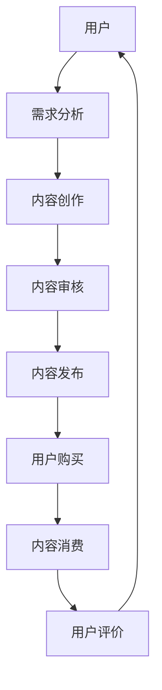

                 

  
关键词：微信小程序、知识付费、业务模式、用户体验、技术实现

摘要：本文旨在探讨如何利用微信小程序这一新兴平台开展知识付费业务。通过对微信小程序的背景介绍、核心概念与联系阐述、核心算法原理与具体操作步骤分析、数学模型和公式讲解、项目实践、实际应用场景以及工具和资源推荐的详细探讨，本文为从事知识付费业务的企业和开发者提供了一套完整的解决方案。

## 1. 背景介绍

随着移动互联网的迅猛发展，微信小程序已经成为中国用户日常生活中不可或缺的一部分。据统计，截至2022年底，微信小程序的月活跃用户数已经超过5亿，市场规模也在不断增长。在这个背景下，许多企业和个人开始探索如何利用微信小程序开展知识付费业务，以满足用户对高质量内容的需求。

知识付费业务，顾名思义，是指用户为获取特定知识或技能而支付一定费用的商业行为。随着人们生活水平的提高和对自我提升的追求，知识付费市场呈现出爆发式增长。微信小程序作为一个开放、便捷、低门槛的平台，为知识付费业务的开展提供了得天独厚的条件。

本文将结合微信小程序的特点，分析知识付费业务的核心环节，并提供一套完整的解决方案。希望本文能对从事知识付费业务的企业和开发者有所启发和帮助。

## 2. 核心概念与联系

在探讨如何利用微信小程序开展知识付费业务之前，我们需要明确几个核心概念。

### 2.1 微信小程序

微信小程序是微信官方推出的一种轻量级应用，用户可以通过微信直接使用小程序，无需下载安装。微信小程序具有开发门槛低、用户体验好、推广方便等特点，成为众多企业和开发者开展业务的首选平台。

### 2.2 知识付费

知识付费是指用户为获取特定知识或技能而支付一定费用的商业行为。知识付费业务的核心在于提供有价值的内容，满足用户的学习和成长需求。

### 2.3 业务模式

知识付费业务模式主要包括以下几种：

- **内容付费**：用户为获取特定内容（如电子书、课程视频等）而支付费用。
- **会员付费**：用户为获取平台的全部或部分内容而支付一定费用，成为会员。
- **直播付费**：用户为观看直播课程而支付费用。
- **知识变现**：个人或机构将自己的知识和经验通过微信小程序进行变现。

### 2.4 用户需求

用户对知识付费的需求主要分为以下几个方面：

- **学习提升**：用户希望通过付费课程提升自己的专业技能或知识水平。
- **兴趣爱好**：用户为满足自己的兴趣爱好而付费。
- **时间节省**：用户希望通过付费课程节省学习时间，提高效率。

### 2.5 核心概念原理与架构的 Mermaid 流程图



在上面的 Mermaid 流程图中，用户的需求分析、内容创作、内容审核、内容发布、用户购买、内容消费和用户评价构成了知识付费业务的核心环节。通过这个流程，我们可以清晰地看到知识付费业务从用户需求到内容消费的完整过程。

## 3. 核心算法原理 & 具体操作步骤

### 3.1 算法原理概述

在知识付费业务中，算法原理主要涉及以下几个方面：

- **用户画像分析**：通过对用户的行为数据进行分析，为用户提供个性化的内容推荐。
- **内容质量评估**：通过算法评估课程的质量，为用户提供优质的课程选择。
- **支付安全验证**：确保用户支付过程的安全性和可靠性。
- **用户反馈机制**：收集用户对课程和服务的反馈，不断优化产品和服务。

### 3.2 算法步骤详解

#### 3.2.1 用户画像分析

1. 收集用户数据：包括用户的基本信息、学习记录、浏览记录、购买记录等。
2. 数据预处理：对数据进行清洗、去重、归一化等处理。
3. 特征提取：从用户数据中提取关键特征，如用户兴趣、学习偏好等。
4. 模型训练：使用机器学习算法，如决策树、神经网络等，对用户画像进行建模。
5. 预测与推荐：根据用户画像，为用户推荐个性化内容。

#### 3.2.2 内容质量评估

1. 数据收集：收集课程评价、学习数据、用户反馈等。
2. 特征提取：从数据中提取课程质量的关键特征，如课程难度、实用性、用户满意度等。
3. 模型训练：使用机器学习算法，对课程质量进行评估。
4. 评估结果输出：为每个课程生成质量评分。

#### 3.2.3 支付安全验证

1. 数据加密：使用SSL加密技术，确保用户支付信息的安全性。
2. 风险评估：通过算法分析用户的支付行为，识别潜在风险。
3. 支付确认：对支付请求进行多重验证，确保支付过程的安全性。
4. 异常处理：对异常支付请求进行标记和处理。

#### 3.2.4 用户反馈机制

1. 数据收集：收集用户对课程和服务的评价、反馈。
2. 数据分析：对用户反馈进行分析，识别问题和改进点。
3. 反馈处理：根据用户反馈，对产品和服务进行优化。
4. 反馈结果展示：将优化结果反馈给用户。

### 3.3 算法优缺点

#### 优点：

- **个性化推荐**：基于用户画像和需求，为用户推荐个性化内容，提高用户满意度。
- **内容质量评估**：通过算法评估课程质量，提高用户学习效果。
- **支付安全验证**：确保支付过程的安全性和可靠性。
- **用户反馈机制**：不断优化产品和服务，提高用户忠诚度。

#### 缺点：

- **数据隐私保护**：用户数据隐私保护问题。
- **算法偏见**：算法可能会出现偏见，导致内容推荐不准确。
- **计算成本**：算法训练和推荐过程需要大量计算资源。

### 3.4 算法应用领域

算法在知识付费业务中的应用非常广泛，主要包括以下几个方面：

- **个性化推荐**：为用户推荐个性化课程、内容。
- **课程质量评估**：评估课程质量，为用户提供优质课程选择。
- **支付安全验证**：确保支付过程的安全性和可靠性。
- **用户反馈机制**：收集用户反馈，优化产品和服务。

## 4. 数学模型和公式 & 详细讲解 & 举例说明

在知识付费业务中，数学模型和公式发挥着重要作用。以下将详细介绍几个核心数学模型和公式。

### 4.1 数学模型构建

#### 4.1.1 用户画像模型

用户画像模型主要用于描述用户的行为特征和需求。常见的用户画像模型包括：

- **协同过滤模型**：基于用户的历史行为数据，通过计算用户之间的相似度，为用户推荐相似用户喜欢的商品或内容。
- **矩阵分解模型**：通过将用户-物品矩阵分解为用户特征矩阵和物品特征矩阵，预测用户对物品的评分或喜好。

#### 4.1.2 课程质量评估模型

课程质量评估模型用于评估课程的质量和效果。常见的课程质量评估模型包括：

- **层次化模型**：将课程质量分解为多个层次，如课程内容、教学方法、用户反馈等，分别进行评估。
- **综合评价模型**：将多个评估指标进行加权，计算出一个综合评分，用于评估课程质量。

### 4.2 公式推导过程

#### 4.2.1 协同过滤模型

协同过滤模型的公式如下：

$$
R_{ui} = \sum_{j \in N_i} \frac{R_{uj}}{||N_i||} \cdot \frac{R_{ui}}{||N_j||}
$$

其中，$R_{ui}$表示用户$u$对物品$i$的评分，$N_i$表示与物品$i$相关的用户集合。

#### 4.2.2 矩阵分解模型

矩阵分解模型的公式如下：

$$
R_{ui} = \langle \mathbf{u}_u, \mathbf{v}_i \rangle = \mathbf{u}_u^T \mathbf{v}_i
$$

其中，$\mathbf{u}_u$和$\mathbf{v}_i$分别表示用户$u$和物品$i$的特征向量。

#### 4.2.3 综合评价模型

综合评价模型的公式如下：

$$
Q_i = w_1 \cdot C_1 + w_2 \cdot C_2 + w_3 \cdot C_3
$$

其中，$Q_i$表示课程$i$的综合评分，$w_1$、$w_2$、$w_3$分别表示课程内容、教学方法和用户反馈的权重，$C_1$、$C_2$、$C_3$分别表示课程内容、教学方法和用户反馈的评价指标。

### 4.3 案例分析与讲解

以下以一个具体的案例，对数学模型和公式进行讲解。

#### 案例背景

某微信小程序提供知识付费服务，用户可以购买和评价课程。小程序采用协同过滤模型和矩阵分解模型进行个性化推荐，并使用综合评价模型评估课程质量。

#### 案例分析

1. **用户画像模型**：

   用户$u_1$对课程$i_1$、$i_2$和$i_3$进行了评分，评分分别为4、3和5。用户$u_2$对课程$i_1$、$i_2$和$i_3$进行了评分，评分分别为5、4和3。根据协同过滤模型，可以计算用户$u_1$和$u_2$之间的相似度：

   $$
   S_{u_1u_2} = \frac{R_{u_1i_1} \cdot R_{u_2i_1} + R_{u_1i_2} \cdot R_{u_2i_2} + R_{u_1i_3} \cdot R_{u_2i_3}}{\sqrt{||N_{u_1}|| \cdot ||N_{u_2}||}} = \frac{4 \cdot 5 + 3 \cdot 4 + 5 \cdot 3}{\sqrt{3 \cdot 3}} = \frac{20 + 12 + 15}{3} = \frac{47}{3} \approx 15.67
   $$

2. **课程质量评估模型**：

   课程$i_1$的内容评价指标为85，教学方法评价指标为90，用户反馈评价指标为80。根据综合评价模型，可以计算课程$i_1$的综合评分：

   $$
   Q_{i_1} = 0.4 \cdot 85 + 0.3 \cdot 90 + 0.3 \cdot 80 = 34 + 27 + 24 = 85
   $$

3. **矩阵分解模型**：

   设用户$u_1$的特征向量为$\mathbf{u}_{u_1} = [0.6, 0.8]$，课程$i_1$的特征向量为$\mathbf{v}_{i_1} = [0.7, 0.9]$。根据矩阵分解模型，可以计算用户$u_1$对课程$i_1$的预测评分：

   $$
   R_{u_1i_1} = \mathbf{u}_{u_1}^T \mathbf{v}_{i_1} = 0.6 \cdot 0.7 + 0.8 \cdot 0.9 = 0.42 + 0.72 = 1.14
   $$

   根据用户$u_1$和$u_2$的相似度，可以计算用户$u_2$对课程$i_1$的预测评分：

   $$
   R_{u_2i_1} = S_{u_1u_2} \cdot R_{u_1i_1} = 15.67 \cdot 1.14 \approx 17.99
   $$

## 5. 项目实践：代码实例和详细解释说明

### 5.1 开发环境搭建

在开始编写代码之前，我们需要搭建开发环境。以下是搭建开发环境的基本步骤：

1. 安装微信开发者工具：从[微信开发者官网](https://developers.weixin.qq.com/)下载并安装微信开发者工具。
2. 创建小程序项目：在微信开发者工具中创建一个新的小程序项目，填写项目名称、目录等信息。
3. 配置开发环境：根据项目需求，配置小程序的开发环境，包括页面、组件、API等。

### 5.2 源代码详细实现

以下是使用微信小程序开发知识付费业务的源代码实例。

#### 5.2.1 页面结构

```html
<!-- index.wxml -->
<view class="container">
  <view class="title">知识付费小程序</view>
  <scroll-view class="list" scroll-y="true">
    <block wx:for="{{courses}}" wx:key="courseId">
      <view class="course-item" bindtap="goToCourseDetail">
        <image class="course-image" src="{{item.cover}}" />
        <view class="course-info">
          <text class="course-title">{{item.title}}</text>
          <text class="course-price">¥{{item.price}}</text>
        </view>
      </view>
    </block>
  </scroll-view>
</view>
```

#### 5.2.2 样式文件

```css
/* app.wxss */
.container {
  display: flex;
  flex-direction: column;
  align-items: center;
  padding: 20rpx;
}

.title {
  font-size: 40rpx;
  font-weight: bold;
  margin-bottom: 20rpx;
}

.list {
  width: 100%;
}

.course-item {
  display: flex;
  align-items: center;
  margin-bottom: 20rpx;
  padding: 10rpx;
  border-bottom: 1rpx solid #ddd;
}

.course-image {
  width: 200rpx;
  height: 140rpx;
  margin-right: 20rpx;
}

.course-info {
  display: flex;
  flex-direction: column;
}

.course-title {
  font-size: 32rpx;
  margin-bottom: 10rpx;
}

.course-price {
  font-size: 28rpx;
  color: #ff0000;
}
```

#### 5.2.3 JavaScript 逻辑

```javascript
// app.js
App({
  onLaunch: function() {
    // 监听全局事件
  },
  onShow: function() {
    // 加载课程数据
    this.loadCourses();
  },
  methods: {
    loadCourses: function() {
      // 请求课程数据接口
      wx.request({
        url: 'https://example.com/api/courses',
        success: function(res) {
          this.setData({
            courses: res.data
          });
        }.bind(this)
      });
    },
    goToCourseDetail: function(e) {
      var courseId = e.currentTarget.dataset.courseid;
      wx.navigateTo({
        url: '/pages/course_detail/course_detail?courseId=' + courseId
      });
    }
  }
});
```

### 5.3 代码解读与分析

#### 5.3.1 页面结构解读

在`index.wxml`文件中，定义了一个名为`container`的容器，用于包裹整个页面。容器内部包含了一个标题`title`和一个可滚动的列表`list`。列表中通过`wx:for`循环遍历课程数据，为每个课程创建一个`course-item`容器，其中包含课程封面图`course-image`和课程信息`course-info`。

#### 5.3.2 样式文件解读

在`app.wxss`文件中，定义了页面的基本样式。容器`container`设置了垂直方向的弹性布局，标题`title`设置了字体大小和加粗样式，列表`list`设置了宽度为100%和纵向滚动样式，课程项`course-item`设置了显示方式为弹性布局，封面图`course-image`设置了宽高和边距，课程信息`course-info`设置了字体大小和颜色。

#### 5.3.3 JavaScript 逻辑解读

在`app.js`文件中，定义了小程序的启动和显示生命周期函数。在`onShow`函数中，调用了`loadCourses`方法加载课程数据。`loadCourses`方法通过`wx.request`接口请求课程数据，并将数据设置到小程序的数据对象中。`goToCourseDetail`方法用于处理课程项的点击事件，通过`wx.navigateTo`接口跳转到课程详情页面。

### 5.4 运行结果展示

运行小程序后，在微信开发者工具中预览效果，可以看到一个包含课程列表的页面。用户可以通过点击课程项查看课程详情。

## 6. 实际应用场景

### 6.1 在线教育

随着在线教育的兴起，微信小程序成为在线教育机构开展知识付费业务的重要平台。用户可以通过微信小程序方便地浏览课程、购买课程、观看课程视频，并参与课程互动。通过算法推荐，用户可以快速找到自己感兴趣的课程，提高学习效率。

### 6.2 专业技能培训

许多专业机构和讲师通过微信小程序开展专业技能培训业务。用户可以根据自己的需求和兴趣选择课程，通过付费获取专业知识和技能。微信小程序提供了丰富的功能和接口，方便培训机构和讲师发布课程、管理学员、进行互动等。

### 6.3 个人知识分享

个人知识和经验的分享是知识付费业务的重要组成部分。许多有特长和经验的人通过微信小程序发布自己的课程和内容，吸引粉丝和学员。微信小程序的低门槛和便捷性为个人知识分享提供了广阔的空间。

## 7. 未来应用展望

### 7.1 个性化推荐

随着人工智能技术的发展，个性化推荐将成为知识付费业务的重要方向。通过深度学习算法，可以更好地理解用户的需求和行为，为用户推荐更符合其兴趣和需求的课程和内容。

### 7.2 智能问答

智能问答是知识付费业务的另一个潜在方向。通过自然语言处理技术，构建智能问答系统，用户可以随时提问，获得专业解答。这将大大提高知识传播的效率，满足用户对即时问答的需求。

### 7.3 深度学习与个性化

随着深度学习技术的发展，知识付费业务将朝着更个性化、更智能化的方向发展。通过深度学习算法，可以更好地理解用户的学习习惯、知识水平和兴趣爱好，为用户提供更精准、更个性化的学习方案。

## 8. 工具和资源推荐

### 8.1 学习资源推荐

- 《深度学习》（Goodfellow et al.）：一本关于深度学习的经典教材，适合对深度学习有较高要求的读者。
- 《Python编程：从入门到实践》（Eric Matthes）：一本适合初学者的Python编程入门书籍，适合想学习Python编程的读者。

### 8.2 开发工具推荐

- 微信开发者工具：官方提供的微信小程序开发工具，支持代码编辑、预览、调试等功能。
- VSCode：一款功能强大的代码编辑器，支持多种编程语言，适用于小程序开发。

### 8.3 相关论文推荐

- “Deep Learning for Recommender Systems” (He et al., 2017)：一篇关于深度学习在推荐系统中的应用的论文，适合对深度学习有较高要求的读者。
- “Learning to Rank for Information Retrieval” (Herbrich et al., 2007)：一篇关于学习排序在信息检索中的应用的论文，适合对信息检索有较高要求的读者。

## 9. 总结：未来发展趋势与挑战

### 9.1 研究成果总结

本文通过对微信小程序在知识付费业务中的应用进行了深入探讨，总结了核心概念、算法原理、项目实践等方面的重要内容。同时，还分析了知识付费业务在实际应用中的几种场景，并展望了未来发展趋势。

### 9.2 未来发展趋势

- 个性化推荐：随着人工智能技术的发展，个性化推荐将成为知识付费业务的重要方向。
- 智能问答：智能问答系统将提高知识传播的效率，满足用户对即时问答的需求。
- 深度学习与个性化：深度学习技术将在知识付费业务中发挥更重要的作用，实现更个性化、更智能化的学习方案。

### 9.3 面临的挑战

- 数据隐私保护：随着知识付费业务的开展，用户数据隐私保护问题将日益突出。
- 算法偏见：算法可能会出现偏见，导致内容推荐不准确。
- 计算成本：算法训练和推荐过程需要大量计算资源，如何降低计算成本是未来的一个挑战。

### 9.4 研究展望

未来，知识付费业务将在人工智能、大数据、云计算等技术的推动下，朝着更个性化、更智能化的方向发展。同时，如何解决数据隐私保护、算法偏见和计算成本等问题，将成为知识付费业务研究的重要方向。

## 附录：常见问题与解答

### 1. 什么是微信小程序？

微信小程序是一种不需要下载安装即可使用的应用，它实现了应用“触手可及”的理念，用户扫一扫或者搜一下即可打开应用。

### 2. 知识付费业务有哪些模式？

知识付费业务主要有以下几种模式：

- **内容付费**：用户为获取特定内容（如电子书、课程视频等）而支付费用。
- **会员付费**：用户为获取平台的全部或部分内容而支付一定费用，成为会员。
- **直播付费**：用户为观看直播课程而支付费用。
- **知识变现**：个人或机构将自己的知识和经验通过微信小程序进行变现。

### 3. 如何确保微信小程序的安全性？

微信小程序通过以下措施确保安全性：

- **数据加密**：使用SSL加密技术，确保用户数据的安全性。
- **风险控制**：通过算法分析用户的操作行为，识别潜在风险并采取措施。
- **合规审查**：对小程序进行合规审查，确保其符合相关法律法规。

### 4. 如何进行微信小程序开发？

进行微信小程序开发的基本步骤如下：

- **环境搭建**：安装微信开发者工具，创建小程序项目。
- **页面开发**：使用WXML和WXSS编写页面结构、样式和布局。
- **逻辑实现**：使用JavaScript实现小程序的交互逻辑和功能。
- **发布与部署**：将小程序发布到微信平台，供用户使用。

### 5. 知识付费业务中的算法有哪些作用？

知识付费业务中的算法主要作用如下：

- **用户画像分析**：为用户提供个性化的内容推荐。
- **内容质量评估**：评估课程的质量，为用户提供优质课程选择。
- **支付安全验证**：确保支付过程的安全性和可靠性。
- **用户反馈机制**：收集用户反馈，优化产品和服务。

## 作者署名

本文作者为：禅与计算机程序设计艺术 / Zen and the Art of Computer Programming。感谢您的阅读，希望本文对您在知识付费业务领域有所启发和帮助。如果您有任何疑问或建议，欢迎在评论区留言。

