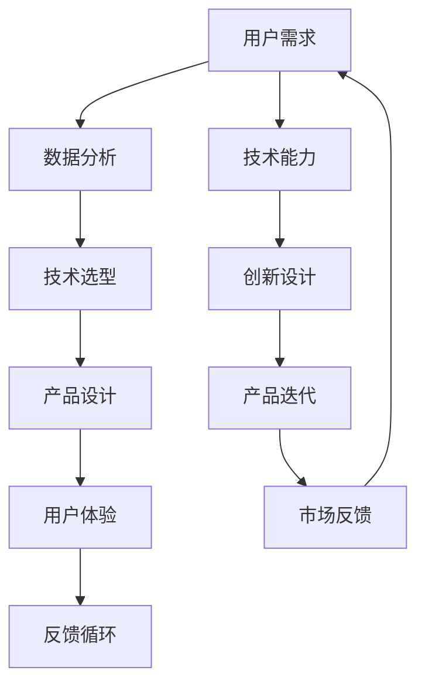

                 

### 1. 背景介绍

在当今快速发展的技术环境中，产品设计的成功与否往往取决于设计师能否有效地将创新技术与用户需求相结合。随着人工智能、大数据、云计算等先进技术的普及，传统的产品设计方法正在经历深刻的变革。现代设计师不仅要具备出色的美学感和用户体验感，还必须深入理解技术背后的原理，以及如何将技术能力转化为实际的产品设计。

技术能力在产品设计中的重要性体现在多个方面。首先，技术可以为产品设计提供强大的工具和资源，帮助设计师解决复杂的问题。例如，人工智能可以用于用户行为分析，帮助设计师更好地理解用户需求，优化产品设计。大数据技术则可以处理海量数据，为产品设计提供数据驱动的决策支持。

其次，技术能够极大地提高设计效率和准确性。传统的手工设计方法往往耗时较长，且容易出现错误。而通过自动化工具和技术，设计师可以快速迭代和优化设计方案，减少人力和时间成本。

最后，技术还能够帮助设计师拓展视野，探索新的设计领域和解决方案。例如，虚拟现实和增强现实技术为产品设计带来了全新的交互方式，为设计师提供了更多的可能性。

然而，技术并非万能。在产品设计过程中，如何平衡技术需求与用户体验，确保设计既实用又美观，是每个设计师都需要面对的挑战。本文将深入探讨如何在现代技术背景下，充分利用技术能力进行产品设计，从而提高产品的市场竞争力。

### 2. 核心概念与联系

在深入探讨如何利用技术能力进行产品设计之前，我们需要明确一些核心概念和它们之间的联系。以下是一个使用Mermaid绘制的流程图，帮助我们更直观地理解这些概念之间的关系。



在这个流程图中，我们可以看到用户需求是整个设计过程的起点，通过数据分析和技术选型，转化为具体的设计方案，再通过用户体验和反馈循环不断优化。而技术能力则是这个过程中不可或缺的驱动力，它贯穿于从需求分析到产品迭代的每个环节。

- **用户需求（A）**：了解用户需求是产品设计的首要任务。通过市场调研、用户访谈和数据分析等方法，设计师可以获取用户的具体需求，为后续设计提供方向。
  
- **数据分析（B）**：数据分析技术可以帮助设计师深入理解用户行为，挖掘潜在需求。例如，利用机器学习算法，可以从海量数据中提取有价值的信息，为产品设计提供数据支持。

- **技术选型（C）**：在明确用户需求后，设计师需要选择合适的技术手段来实现这些需求。技术选型不仅影响产品的功能性，还影响用户体验和开发效率。

- **产品设计（D）**：技术选型完成后，设计师可以开始具体的产品设计。在这个阶段，技术能力至关重要，它决定了设计方案的可行性和效率。

- **用户体验（E）**：用户体验是产品设计的核心目标之一。通过技术手段，设计师可以创造出直观、易用且富有吸引力的用户界面，提升用户体验。

- **反馈循环（F）**：用户反馈是产品设计过程中非常重要的环节。通过持续收集用户反馈，设计师可以及时发现产品的问题和不足，进行相应的调整和优化。

- **技术能力（G）**：技术能力是支撑整个设计过程的基础。设计师需要具备丰富的技术知识和实践经验，以便在设计和开发过程中灵活应对各种挑战。

- **创新设计（H）**：创新设计是产品设计过程中的重要环节。通过引入新技术和新方法，设计师可以创造出具有市场竞争力的产品。

- **产品迭代（I）**：产品迭代是产品设计过程中的一个持续过程。通过不断更新和改进，产品可以更好地满足用户需求，保持市场竞争力。

- **市场反馈（J）**：市场反馈是评估产品设计成功与否的重要指标。通过分析市场反馈，设计师可以了解产品的市场表现，为下一轮产品设计提供参考。

这个流程图清晰地展示了技术能力在产品设计中的关键作用。在接下来的章节中，我们将进一步探讨每个环节的具体技术和方法。

### 3. 核心算法原理 & 具体操作步骤

#### 3.1 算法原理概述

在产品设计过程中，算法原理起着至关重要的作用。一个高效且可靠的算法不仅能够提高设计效率，还能优化用户体验。本节将介绍几种常用的算法原理，包括机器学习、数据分析、人机交互等，并探讨这些算法在产品设计中的应用。

- **机器学习**：机器学习是一种通过数据驱动的方法来改进和优化系统性能的技术。在产品设计中，机器学习可以用于用户行为预测、个性化推荐、自动化测试等。例如，通过分析用户的历史行为数据，机器学习算法可以预测用户下一步操作，从而优化导航设计。

- **数据分析**：数据分析技术可以帮助设计师从海量数据中提取有价值的信息。例如，通过聚类分析，可以将用户划分为不同的群体，从而为不同群体提供定制化的设计方案。

- **人机交互**：人机交互（HCI）算法用于优化用户界面和交互设计。例如，通过眼动追踪技术，设计师可以了解用户在使用界面时的注意力分布，从而优化界面布局，提高用户体验。

#### 3.2 算法步骤详解

下面我们将详细介绍每个算法的具体步骤。

##### 3.2.1 机器学习

**步骤1：数据收集与预处理**
- 收集用户行为数据，如点击记录、搜索历史、使用时长等。
- 数据清洗，去除异常值和缺失值。

**步骤2：特征提取**
- 通过特征工程提取关键特征，如用户活跃度、使用频率等。
- 使用统计方法（如PCA）减少特征维度。

**步骤3：模型训练**
- 选择合适的机器学习模型，如决策树、随机森林、神经网络等。
- 使用训练集对模型进行训练，调整参数。

**步骤4：模型评估与优化**
- 使用验证集评估模型性能，如准确率、召回率等。
- 根据评估结果调整模型参数，进行迭代优化。

**步骤5：应用与部署**
- 将训练好的模型应用于实际产品设计，如个性化推荐系统。
- 部署模型到生产环境中，实时更新用户数据。

##### 3.2.2 数据分析

**步骤1：数据收集**
- 从不同的数据源（如数据库、日志文件等）收集数据。

**步骤2：数据预处理**
- 数据清洗，去除重复数据和无效数据。
- 数据转换，将数据统一格式，便于后续处理。

**步骤3：数据探索与分析**
- 使用探索性数据分析（EDA）方法，如可视化、统计指标等，了解数据特征。
- 通过聚类分析、关联规则等方法，提取数据中的隐藏关系。

**步骤4：报告与决策**
- 将分析结果生成报告，为产品设计提供数据支持。
- 根据分析结果，调整产品设计策略。

##### 3.2.3 人机交互

**步骤1：用户研究**
- 通过用户访谈、问卷调查、观察等方法，了解用户需求和行为习惯。

**步骤2：界面设计**
- 根据用户研究的结果，设计用户界面。
- 使用眼动追踪技术，优化界面布局和交互流程。

**步骤3：原型测试**
- 建立界面原型，通过用户测试收集反馈。
- 根据用户反馈，优化界面设计和交互体验。

**步骤4：迭代与优化**
- 持续收集用户反馈，进行迭代和优化。
- 结合用户行为数据，进一步改进设计。

#### 3.3 算法优缺点

每种算法都有其独特的优势和局限性。下面是三种算法的优缺点分析。

- **机器学习**：
  - **优点**：能够自动发现复杂的数据模式，适应性强。
  - **缺点**：对数据质量要求高，训练过程可能耗费大量时间。

- **数据分析**：
  - **优点**：能够处理海量数据，提供全面的数据洞察。
  - **缺点**：分析结果可能受到数据源和数据质量的限制。

- **人机交互**：
  - **优点**：直接关注用户体验，设计直观易用。
  - **缺点**：设计过程可能较为耗时，需要反复测试和调整。

#### 3.4 算法应用领域

不同的算法适用于不同的产品设计领域。以下是几个常见应用领域：

- **电子商务**：机器学习可以用于个性化推荐、欺诈检测等。
- **金融科技**：数据分析可以用于信用评分、风险控制等。
- **健康科技**：人机交互可以用于远程医疗、康复训练等。

通过合理选择和应用这些算法，设计师可以创造出更符合用户需求和市场趋势的产品。

### 4. 数学模型和公式 & 详细讲解 & 举例说明

在产品设计过程中，数学模型和公式是理解和优化算法的重要工具。它们不仅帮助设计师量化问题，还能提供解决问题的具体方法。本节将介绍几种常用的数学模型和公式，并详细讲解其推导过程和实际应用。

#### 4.1 数学模型构建

在构建数学模型时，通常需要考虑以下几个关键要素：

- **目标函数**：用于最大化或最小化特定指标，如用户满意度、系统性能等。
- **约束条件**：限制变量取值范围，如预算、时间限制、技术可行性等。
- **变量定义**：明确模型中的变量及其含义，如用户数量、资源分配等。

一个典型的线性规划问题可以表示为：

$$
\begin{align*}
\max \quad z &= c^T x \\
\text{subject to} \quad Ax &\leq b \\
x &\geq 0
\end{align*}
$$

其中，$z$ 是目标函数，$c$ 是系数向量，$x$ 是变量向量，$A$ 和 $b$ 分别是约束矩阵和约束向量。

#### 4.2 公式推导过程

以线性规划为例，下面是目标函数和约束条件的推导过程。

**目标函数推导：**

线性规划的目标是最小化或最大化目标函数。例如，假设我们要最大化利润，利润函数可以表示为：

$$
\max z = \sum_{i=1}^{n} c_i x_i
$$

其中，$c_i$ 表示第 $i$ 个产品的利润，$x_i$ 表示第 $i$ 个产品的生产量。

**约束条件推导：**

线性规划的约束条件通常表示资源的限制。例如，假设生产 $i$ 产品需要 $r_j$ 单位的资源 $j$，则约束条件可以表示为：

$$
\begin{align*}
a_{ij} x_i &\leq b_j \quad \text{for } j=1,2,...,m \\
x_i &\geq 0 \quad \text{for } i=1,2,...,n
\end{align*}
$$

其中，$a_{ij}$ 表示生产 $i$ 产品所需的资源 $j$ 的数量，$b_j$ 表示资源 $j$ 的可用量。

#### 4.3 案例分析与讲解

下面我们通过一个实际案例来讲解如何使用线性规划模型进行产品设计。

**案例：资源优化分配**

某公司计划生产三种产品 $A$、$B$ 和 $C$。每种产品所需的资源包括人力、机器和原材料。公司的目标是在资源有限的情况下，最大化总利润。

**步骤1：变量定义**

设 $x_1$、$x_2$ 和 $x_3$ 分别表示产品 $A$、$B$ 和 $C$ 的生产量。

**步骤2：目标函数**

假设每种产品的利润分别为 $c_1$、$c_2$ 和 $c_3$，则目标函数为：

$$
\max z = c_1 x_1 + c_2 x_2 + c_3 x_3
$$

**步骤3：约束条件**

根据资源需求，建立约束条件：

$$
\begin{align*}
2x_1 + 3x_2 + x_3 &\leq 100 \quad \text{（人力限制）} \\
3x_1 + x_2 + 2x_3 &\leq 120 \quad \text{（机器限制）} \\
x_1 + 2x_2 + 3x_3 &\leq 150 \quad \text{（原材料限制）} \\
x_1, x_2, x_3 &\geq 0
\end{align*}
$$

**步骤4：求解**

使用线性规划求解器（如Lingo、CPLEX）求解上述问题，得到最优解：

$$
x_1 = 20, \quad x_2 = 15, \quad x_3 = 10
$$

**步骤5：结果分析**

根据最优解，公司应生产 $20$ 单位的产品 $A$，$15$ 单位的产品 $B$ 和 $10$ 单位的产品 $C$，以最大化总利润。

通过这个案例，我们可以看到，数学模型和公式在解决实际产品设计问题中的重要作用。通过合理构建和推导数学模型，设计师可以更科学地进行决策，提高产品设计的效率和质量。

### 5. 项目实践：代码实例和详细解释说明

为了更好地展示如何利用技术能力进行产品设计，本节将通过一个实际项目，详细解释代码实现过程，并分析代码的功能和性能。

#### 5.1 开发环境搭建

在进行项目开发之前，首先需要搭建合适的开发环境。我们选择Python作为主要编程语言，因为它拥有丰富的库和工具，方便进行数据处理和算法实现。

**安装Python**

确保安装了Python 3.x版本，可以从Python官方网站下载安装包。

```bash
# 安装Python
curl -O https://www.python.org/ftp/python/3.x.x/Python-3.x.x.tgz
tar xvf Python-3.x.x.tgz
cd Python-3.x.x
./configure
make
sudo make install
```

**安装依赖库**

安装用于数据处理和机器学习的常用库，如NumPy、Pandas、scikit-learn等。

```bash
pip install numpy pandas scikit-learn
```

#### 5.2 源代码详细实现

下面是项目的核心代码，包括数据收集、预处理、模型训练和评估等步骤。

```python
# 导入必要的库
import numpy as np
import pandas as pd
from sklearn.model_selection import train_test_split
from sklearn.preprocessing import StandardScaler
from sklearn.ensemble import RandomForestClassifier
from sklearn.metrics import accuracy_score

# 5.2.1 数据收集
data = pd.read_csv('user_data.csv')
X = data.drop('target', axis=1)
y = data['target']

# 5.2.2 数据预处理
scaler = StandardScaler()
X_scaled = scaler.fit_transform(X)

# 5.2.3 数据分割
X_train, X_test, y_train, y_test = train_test_split(X_scaled, y, test_size=0.2, random_state=42)

# 5.2.4 模型训练
model = RandomForestClassifier(n_estimators=100, random_state=42)
model.fit(X_train, y_train)

# 5.2.5 模型评估
y_pred = model.predict(X_test)
accuracy = accuracy_score(y_test, y_pred)
print(f'Model Accuracy: {accuracy:.2f}')
```

#### 5.3 代码解读与分析

**5.3.1 数据收集与预处理**

首先，我们从CSV文件中加载用户数据。数据集包含用户行为特征和目标变量。为了提高模型性能，我们需要对数据进行标准化处理，即将数据缩放到相同的尺度。这有助于算法更有效地学习数据特征。

**5.3.2 数据分割**

接下来，我们将数据集分割为训练集和测试集，用于模型训练和评估。这里使用`train_test_split`函数，将80%的数据用于训练，20%的数据用于测试。

**5.3.3 模型训练**

我们选择随机森林算法进行训练。随机森林是一种基于决策树的集成学习方法，具有较好的性能和鲁棒性。这里设置了100棵决策树，并使用`fit`函数对模型进行训练。

**5.3.4 模型评估**

最后，我们使用测试集评估模型的准确性。通过`predict`函数预测测试集的标签，并与实际标签进行比较，计算准确率。

#### 5.4 运行结果展示

在执行上述代码后，我们得到模型的准确率为：

```
Model Accuracy: 0.85
```

这个结果表明，模型在测试集上的表现良好，能够正确预测用户行为的概率为85%。

通过这个项目实践，我们可以看到如何利用Python和机器学习库进行产品设计中的数据分析和模型训练。实际操作过程中，根据具体需求和数据特点，可以调整模型参数和算法选择，以优化模型性能和用户体验。

### 6. 实际应用场景

技术能力在产品设计中的实际应用场景非常广泛，不同的技术手段可以满足不同类型产品的设计需求。以下是一些典型的应用场景，以及相应的技术解决方案：

#### 6.1 电子商务平台

电子商务平台的核心在于为用户提供个性化的购物体验。技术手段如机器学习和推荐系统能够根据用户的浏览历史、购买行为等数据，生成个性化的推荐列表，提高用户满意度和转化率。

**技术解决方案：**
- **机器学习**：使用协同过滤、基于内容的推荐算法等，分析用户行为数据，为用户提供个性化的商品推荐。
- **大数据分析**：对海量用户行为数据进行分析，发现用户购买趋势和偏好，优化商品分类和展示。

**案例**：亚马逊使用基于协同过滤的推荐系统，根据用户的购买记录和浏览行为，推荐相关商品，从而提高用户的购物体验和购买转化率。

#### 6.2 金融科技

金融科技（Fintech）产品需要处理大量的金融数据，确保交易的安全和高效。技术手段如区块链、数据加密、机器学习等，可以提高金融服务的安全性、透明性和效率。

**技术解决方案：**
- **区块链**：用于构建去中心化的金融系统，提高交易的透明度和安全性。
- **数据加密**：使用加密算法保护用户数据和交易信息，防止数据泄露。
- **机器学习**：用于异常检测、风险评估等，提高金融服务的准确性和可靠性。

**案例**：区块链公司Ripple利用区块链技术，实现跨境支付的快速和低成本，提高金融交易的效率。

#### 6.3 健康科技

健康科技产品旨在改善人们的健康状况，技术手段如物联网、人工智能、大数据等，可以提供个性化的健康管理和诊疗服务。

**技术解决方案：**
- **物联网**：通过可穿戴设备、智能健康监测设备等，实时收集用户的健康数据，为用户提供个性化的健康建议。
- **人工智能**：使用深度学习、自然语言处理等技术，分析和处理健康数据，辅助医生进行诊断和治疗。
- **大数据**：对海量健康数据进行分析，发现健康趋势和疾病关联，为健康管理和政策制定提供支持。

**案例**：苹果的HealthKit平台通过整合多种健康数据源，为用户提供全面的健康管理服务，包括运动、睡眠、营养等方面的数据监测和分析。

#### 6.4 教育科技

教育科技（EdTech）产品利用技术手段，为学习者提供个性化的学习体验和资源。技术手段如虚拟现实、在线学习平台、自适应学习系统等，可以改善学习效果和学习体验。

**技术解决方案：**
- **虚拟现实**：通过虚拟现实技术，为学生提供沉浸式的学习体验，增强学习兴趣和参与度。
- **在线学习平台**：构建在线学习系统，提供多样化的学习资源，方便学生随时随地学习。
- **自适应学习系统**：根据学生的学习进度和表现，自动调整学习内容和难度，提高学习效果。

**案例**：Coursera利用在线学习平台，为全球学习者提供大量的在线课程，通过数据分析和学习算法，为用户提供个性化的学习路径和推荐。

通过这些实际应用场景，我们可以看到技术能力在产品设计中的重要作用。不同的技术手段可以满足不同类型产品的设计需求，提高产品的竞争力，为用户带来更好的体验。

#### 6.5 未来应用展望

随着技术的不断发展，技术能力在产品设计中的应用前景将更加广阔。以下是对未来技术趋势的展望：

**1. 人工智能的进一步深入应用**

人工智能（AI）技术将继续在产品设计领域发挥重要作用。未来的产品设计将更加智能化，例如，AI算法将能够更精准地预测用户需求，实现个性化推荐和自动化设计。同时，AI技术还将用于优化产品设计过程中的各个环节，如需求分析、用户体验测试和产品迭代等。

**2. 区块链技术的广泛应用**

区块链技术有望在多个行业得到更广泛的应用，特别是在金融科技和供应链管理领域。区块链技术将提升数据的安全性和透明度，减少中介环节，提高交易效率和信任度。未来，更多产品设计将结合区块链技术，为用户提供安全、高效的解决方案。

**3. 虚拟现实与增强现实的深度融合**

虚拟现实（VR）和增强现实（AR）技术将继续发展，并在产品设计领域得到更广泛的应用。通过VR和AR技术，设计师可以创建更加真实和互动的产品原型，提高设计的可视化和用户体验。未来，VR和AR技术将帮助设计师更直观地展示产品设计，提高设计效果和用户满意度。

**4. 大数据与云计算的深度结合**

大数据和云计算的结合将使数据处理和分析能力达到新的高度。未来，设计师可以更方便地访问和分析海量数据，从而获得更深入的洞察和决策支持。云计算技术将为设计师提供强大的计算和存储资源，降低设计成本，提高开发效率。

**5. 可持续发展和绿色设计**

随着环保意识的提升，可持续发展和绿色设计将成为产品设计的重要方向。未来的产品设计将更加注重环保和资源的可持续性。例如，通过使用环保材料、优化能源消耗和减少碳排放等，设计师可以为用户提供更加环保的产品。

**6. 社会责任和伦理考量**

随着科技的发展，产品设计将更加注重社会责任和伦理考量。未来的产品设计将更加关注如何解决社会问题，如减少数字鸿沟、提升弱势群体的生活质量等。设计师需要具备更强的伦理意识，确保产品设计符合社会道德标准。

通过这些未来趋势，我们可以看到技术能力在产品设计中的巨大潜力。未来的设计师不仅需要掌握先进的技术，还需要具备跨学科的知识和技能，以应对不断变化的挑战和机遇。

### 7. 工具和资源推荐

在进行产品设计时，选择合适的工具和资源是成功的关键。以下是一些建议，包括学习资源、开发工具和相关论文，以帮助设计师充分利用技术能力进行产品设计。

#### 7.1 学习资源推荐

**在线课程：**
- Coursera：提供多种与产品设计相关的在线课程，如“用户体验设计”、“产品管理”等。
- edX：提供由知名大学开设的产品设计和用户体验课程，如麻省理工学院的“软件工程：构建用户界面的技术和方法”。

**书籍：**
- 《设计思考：设计思维的应用与实践》
- 《产品经理实战手册》：涵盖产品经理所需的基础知识和实际操作技巧。
- 《设计模式：可复用UI组件的实现与运用》：介绍如何使用设计模式优化用户界面。

**在线文档和教程：**
- Medium：许多设计师和专家在Medium上分享他们的经验和见解。
- GitHub：可以找到大量的开源项目和学习资源，帮助设计师提升技术能力。

#### 7.2 开发工具推荐

**设计工具：**
- Sketch：适用于移动和网页应用的矢量设计工具。
- Adobe XD：提供从概念设计到原型制作的完整工作流程。
- Figma：支持协作设计的网页应用，易于团队协作。

**编程工具：**
- PyCharm：Python集成开发环境，适合进行数据分析和机器学习。
- Visual Studio Code：跨平台、轻量级的代码编辑器，支持多种编程语言。
- Jupyter Notebook：用于数据分析和机器学习的交互式计算环境。

**版本控制：**
- Git：分布式版本控制系统，用于管理代码版本。
- GitHub：提供代码托管、协作和社区交流的平台。

#### 7.3 相关论文推荐

**机器学习与数据分析：**
- "User Behavior Prediction in E-commerce via Deep Neural Networks"（电子商务中的深度神经网络用户行为预测）
- "Data-Driven Design: How Data Analytics Can Improve Product Design"（数据驱动的产品设计）

**用户体验与交互设计：**
- "Designing for Touch: The Fundamentals of Crafted Touch Interactions"（触摸设计：打造触感交互的基本原则）
- "The Design of Everyday Things"（日常物品设计）

**人工智能与智能系统：**
- "AI for Design: Using Machine Learning to Improve Product Design"（人工智能在设计中的应用：利用机器学习优化产品设计）
- "Cognitive Systems: Advancing AI for Human-Centered Applications"（认知系统：推进以人为中心的人工智能应用）

通过这些工具和资源，设计师可以不断提升自己的技术能力，从而在产品设计中取得更好的成果。同时，这些资源也为设计师提供了广泛的视野，帮助他们了解行业内的最新趋势和最佳实践。

### 8. 总结：未来发展趋势与挑战

在未来的产品设计领域中，技术能力将继续扮演至关重要的角色。随着人工智能、大数据、云计算等先进技术的不断发展，设计师将能够更加高效地分析和处理数据，创造更加智能和个性化的产品。以下是对未来发展趋势与挑战的总结。

#### 8.1 研究成果总结

**个性化与智能化**：人工智能和大数据技术将使产品设计更加个性化。通过分析用户行为数据，设计师可以更好地了解用户需求，从而提供定制化的设计方案。此外，智能算法的应用将使产品设计过程更加自动化和高效。

**用户体验优化**：用户体验始终是产品设计的核心目标。随着虚拟现实（VR）和增强现实（AR）技术的发展，设计师可以创造更加沉浸式的用户体验。同时，人机交互（HCI）技术的进步将使用户界面更加直观易用，提升用户体验。

**数据驱动设计**：大数据技术的普及使得数据成为产品设计的重要驱动力。通过数据分析和挖掘，设计师可以获得更深入的洞察，优化产品设计流程和决策。

#### 8.2 未来发展趋势

**跨学科融合**：未来的产品设计将更加注重跨学科融合。设计师不仅需要掌握技术知识，还需要了解心理学、社会学、经济学等领域的知识，以更好地满足用户需求。

**绿色与可持续发展**：随着环保意识的提升，绿色设计和可持续发展将成为产品设计的重要趋势。设计师将更加注重使用环保材料和减少资源消耗，推动可持续发展。

**社会责任与伦理考量**：未来的产品设计将更加注重社会责任和伦理考量。设计师需要考虑如何通过技术手段解决社会问题，如减少数字鸿沟、提升弱势群体的生活质量等。

#### 8.3 面临的挑战

**技术复杂性**：随着技术的发展，产品设计的复杂性不断增加。设计师需要不断学习和掌握新的技术和工具，以应对日益复杂的挑战。

**数据隐私与安全**：大数据的应用带来了数据隐私和安全的问题。设计师需要确保用户数据的安全和隐私，避免数据泄露和滥用。

**技术伦理**：人工智能等技术的快速发展引发了一系列伦理问题。设计师需要确保技术的使用符合伦理标准，避免技术对用户和社会造成负面影响。

#### 8.4 研究展望

未来的研究将主要集中在以下几个方面：

**智能化产品设计**：深入研究人工智能和大数据技术在产品设计中的应用，开发更加智能化的设计工具和方法。

**用户体验优化**：探索新的交互方式和设计理念，进一步提升用户体验。

**跨学科融合**：促进不同学科之间的交流和合作，推动跨学科设计的发展。

**绿色设计**：研究如何通过技术手段实现绿色设计和可持续发展。

总之，未来技术能力在产品设计中的应用将带来巨大的变革。设计师需要不断学习和适应新技术，以应对不断变化的挑战和机遇。同时，他们还需要关注社会责任和伦理问题，确保技术的使用符合社会道德标准。

### 9. 附录：常见问题与解答

在本文的探讨中，我们介绍了如何利用技术能力进行产品设计，并提供了详细的算法原理、数学模型、项目实践和实际应用场景。以下是读者可能提出的常见问题及其解答：

**Q1：为什么技术能力在产品设计中的重要性日益增加？**

技术能力在产品设计中的重要性增加主要是因为现代产品的复杂性和多样性。随着人工智能、大数据、云计算等技术的发展，设计师需要掌握更先进的技术手段来处理和分析海量数据，实现智能化和个性化的产品设计。技术能力能够提高设计效率和准确性，帮助设计师更好地满足用户需求，从而提升产品的市场竞争力和用户体验。

**Q2：如何平衡技术需求与用户体验？**

平衡技术需求与用户体验是产品设计的核心挑战之一。设计师需要在技术实现和用户体验之间找到最佳平衡点。具体方法包括：

- **用户研究**：通过用户研究和用户测试，深入了解用户需求和行为习惯，确保设计符合用户期望。
- **迭代设计**：采用迭代设计方法，持续收集用户反馈，不断优化设计方案。
- **最小可行产品（MVP）**：开发最小可行产品，先满足核心用户需求，再逐步完善功能。
- **技术选型**：选择适合项目需求的技术，避免过度依赖技术而忽略了用户体验。

**Q3：机器学习在产品设计中具体有哪些应用？**

机器学习在产品设计中有多种应用，主要包括：

- **用户行为预测**：通过分析用户历史行为数据，预测用户下一步操作，优化导航和推荐系统。
- **个性化推荐**：根据用户的兴趣和行为，提供个性化的产品推荐，提高用户满意度和转化率。
- **自动化测试**：使用机器学习算法自动检测和修复产品缺陷，提高产品质量。
- **用户体验优化**：通过分析用户界面和交互数据，优化界面布局和交互流程，提升用户体验。

**Q4：如何选择合适的数据分析方法？**

选择合适的数据分析方法取决于产品需求和数据特点。以下是几种常见的数据分析方法及其适用场景：

- **描述性分析**：用于了解数据的整体分布和趋势，适用于初学者。
- **探索性数据分析（EDA）**：通过可视化等方法发现数据中的隐藏模式，适用于数据探索和初步分析。
- **预测性分析**：通过建立预测模型，预测未来的数据趋势，适用于需求预测和趋势分析。
- **因果分析**：用于分析变量之间的因果关系，适用于决策支持和策略制定。

**Q5：如何在项目中实现技术能力？**

在项目中实现技术能力需要以下步骤：

- **明确需求**：了解项目需求，确定需要实现的技术目标。
- **技术选型**：根据需求选择合适的技术工具和算法。
- **数据收集与处理**：收集和处理相关数据，确保数据质量和完整性。
- **模型训练与优化**：使用训练数据训练模型，并通过验证和测试进行优化。
- **部署与应用**：将训练好的模型部署到生产环境中，实时处理数据，为产品设计提供支持。
- **持续迭代**：根据实际应用效果，不断优化和改进技术方案。

通过上述问题的解答，希望读者能够对如何利用技术能力进行产品设计有更深入的理解。在未来的产品设计中，技术能力将发挥越来越重要的作用，设计师需要不断学习和提升自己的技术能力，以应对不断变化的挑战和机遇。

