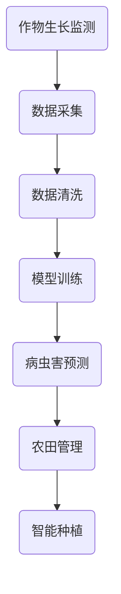
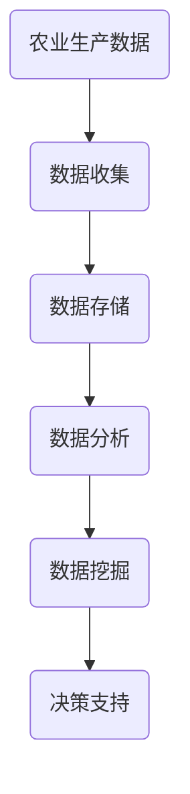
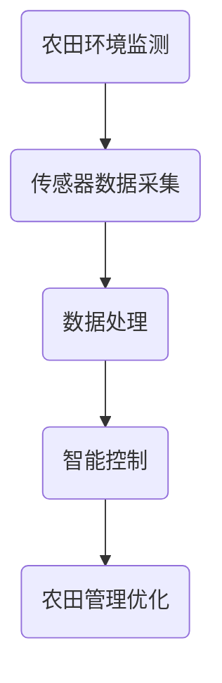

                 

关键词：农业科技、人工智能、算法、数学模型、项目实践、应用场景、未来展望、工具推荐

> 摘要：本文将探讨如何利用技术能力进行农业科技创新，包括核心算法原理、数学模型构建、项目实践以及应用场景分析。通过本文，读者将了解到农业科技创新的重要性和具体实施方法，为未来的农业发展提供参考。

## 1. 背景介绍

随着全球人口的增长和城市化的加速，农业生产面临着前所未有的压力。传统的农业生产模式已经难以满足日益增长的食物需求和环境保护要求。因此，农业科技创新成为解决这一问题的关键。近年来，人工智能、大数据、物联网等技术的快速发展为农业科技创新提供了新的机遇。通过引入这些技术，可以提高农业生产效率、降低成本、减少环境污染，从而实现可持续发展。

本文旨在探讨如何利用技术能力进行农业科技创新，包括核心算法原理、数学模型构建、项目实践以及应用场景分析。通过本文，读者将了解到农业科技创新的重要性和具体实施方法，为未来的农业发展提供参考。

## 2. 核心概念与联系

### 2.1 人工智能在农业中的应用

人工智能在农业中有着广泛的应用，包括作物生长监测、病虫害预测、农田管理、智能种植等。以下是一个简单的 Mermaid 流程图，展示了人工智能在农业中的应用流程：



### 2.2 大数据在农业中的应用

大数据技术在农业中主要用于农业生产数据的收集、存储、分析和挖掘。以下是一个简单的 Mermaid 流程图，展示了大数据在农业中的应用流程：



### 2.3 物联网在农业中的应用

物联网技术在农业中主要用于农田环境的监测和智能控制。以下是一个简单的 Mermaid 流程图，展示了物联网在农业中的应用流程：



## 3. 核心算法原理 & 具体操作步骤

### 3.1 算法原理概述

在农业科技创新中，常用的核心算法包括机器学习算法、数据挖掘算法和图像处理算法。以下分别介绍这三种算法的原理：

#### 3.1.1 机器学习算法

机器学习算法是一种基于数据的学习方法，通过从数据中提取特征和规律，用于预测和分类。常见的机器学习算法有决策树、支持向量机、神经网络等。

#### 3.1.2 数据挖掘算法

数据挖掘算法是一种从大量数据中提取有价值信息的方法，主要包括分类、聚类、关联规则挖掘等。数据挖掘算法常用于农业生产数据的分析和挖掘。

#### 3.1.3 图像处理算法

图像处理算法是一种基于图像数据的学习方法，用于图像的识别、分割、增强等。图像处理算法在作物生长监测和病虫害预测中有着广泛的应用。

### 3.2 算法步骤详解

#### 3.2.1 机器学习算法步骤

1. 数据收集：收集农作物生长、病虫害等数据。
2. 数据预处理：对收集到的数据进行分析，去除异常值和噪声。
3. 特征提取：从预处理后的数据中提取有用的特征。
4. 模型训练：使用提取的特征训练机器学习模型。
5. 模型评估：使用测试数据评估模型的性能。

#### 3.2.2 数据挖掘算法步骤

1. 数据收集：收集农业生产数据。
2. 数据预处理：对收集到的数据进行分析，去除异常值和噪声。
3. 特征选择：从预处理后的数据中提取有用的特征。
4. 挖掘算法：使用分类、聚类、关联规则挖掘算法进行数据挖掘。
5. 结果分析：对挖掘结果进行分析，为农业生产提供决策支持。

#### 3.2.3 图像处理算法步骤

1. 数据收集：收集农作物生长的图像数据。
2. 图像预处理：对图像进行去噪、增强等预处理。
3. 图像分割：将图像分割成多个区域。
4. 特征提取：从分割后的图像中提取特征。
5. 病虫害识别：使用图像处理算法对病虫害进行识别。

### 3.3 算法优缺点

#### 3.3.1 机器学习算法

优点：能够从大量数据中自动提取特征，适用于复杂的非线性问题。

缺点：对数据质量要求较高，容易过拟合。

#### 3.3.2 数据挖掘算法

优点：能够从大量数据中提取有价值的信息，为农业生产提供决策支持。

缺点：对数据量和数据质量要求较高，挖掘过程复杂。

#### 3.3.3 图像处理算法

优点：能够实现对农作物生长的实时监测和病虫害的快速识别。

缺点：对图像质量要求较高，算法复杂度较高。

### 3.4 算法应用领域

机器学习算法、数据挖掘算法和图像处理算法在农业中有着广泛的应用，包括作物生长监测、病虫害预测、农田管理、智能种植等。以下分别介绍这三种算法的应用领域：

#### 3.4.1 机器学习算法应用领域

1. 作物生长监测：通过机器学习算法对农作物生长过程进行监测，实现实时预警和精准管理。
2. 病虫害预测：通过机器学习算法对农作物病虫害进行预测，实现提前预防和控制。
3. 农田管理：通过机器学习算法对农田环境进行监测和管理，实现精准灌溉和施肥。

#### 3.4.2 数据挖掘算法应用领域

1. 决策支持：通过数据挖掘算法对农业生产数据进行分析，为农业生产提供决策支持。
2. 市场预测：通过数据挖掘算法对农产品市场进行预测，为农业生产者提供市场信息。
3. 资源优化：通过数据挖掘算法对农业生产资源进行优化，实现资源的合理利用。

#### 3.4.3 图像处理算法应用领域

1. 作物生长监测：通过图像处理算法对农作物生长图像进行分析，实现作物长势的实时监测。
2. 病虫害识别：通过图像处理算法对农作物病虫害图像进行分析，实现病虫害的快速识别和定位。
3. 智能种植：通过图像处理算法对农作物生长图像进行分析，实现智能种植和精准管理。

## 4. 数学模型和公式 & 详细讲解 & 举例说明

### 4.1 数学模型构建

在农业科技创新中，常用的数学模型包括线性回归模型、决策树模型、神经网络模型等。以下分别介绍这几种模型的构建方法。

#### 4.1.1 线性回归模型

线性回归模型是一种用于分析变量之间线性关系的数学模型。其基本公式为：

$$
y = ax + b
$$

其中，$y$ 表示因变量，$x$ 表示自变量，$a$ 表示斜率，$b$ 表示截距。

#### 4.1.2 决策树模型

决策树模型是一种用于分类和回归问题的数学模型。其基本结构包括节点、分支和叶子。每个节点表示一个特征，每个分支表示该特征的不同取值，叶子节点表示最终的分类或回归结果。

#### 4.1.3 神经网络模型

神经网络模型是一种模拟人脑神经元连接的数学模型。其基本结构包括输入层、隐藏层和输出层。每个层中的神经元通过权重连接，实现数据的传递和计算。

### 4.2 公式推导过程

以下以线性回归模型为例，介绍其公式推导过程。

假设我们有 $n$ 个样本点 $(x_1, y_1), (x_2, y_2), \ldots, (x_n, y_n)$，要求拟合一个线性回归模型 $y = ax + b$。首先，我们需要计算样本的均值：

$$
\bar{x} = \frac{1}{n} \sum_{i=1}^{n} x_i
$$

$$
\bar{y} = \frac{1}{n} \sum_{i=1}^{n} y_i
$$

然后，我们计算样本的协方差和方差：

$$
\sum_{i=1}^{n} (x_i - \bar{x})(y_i - \bar{y}) = \sum_{i=1}^{n} x_iy_i - n\bar{x}\bar{y}
$$

$$
\sum_{i=1}^{n} (x_i - \bar{x})^2 = \sum_{i=1}^{n} x_i^2 - n\bar{x}^2
$$

接下来，我们计算线性回归模型的斜率 $a$ 和截距 $b$：

$$
a = \frac{\sum_{i=1}^{n} (x_i - \bar{x})(y_i - \bar{y})}{\sum_{i=1}^{n} (x_i - \bar{x})^2}
$$

$$
b = \bar{y} - a\bar{x}
$$

最后，我们得到线性回归模型的公式：

$$
y = ax + b
$$

### 4.3 案例分析与讲解

以下以作物生长监测为例，介绍如何使用线性回归模型进行模型构建和参数优化。

#### 4.3.1 数据收集

首先，我们需要收集农作物生长的数据，包括土壤湿度、光照强度、气温等。假设我们收集到了 $n$ 个样本点 $(x_1, y_1), (x_2, y_2), \ldots, (x_n, y_n)$。

#### 4.3.2 数据预处理

接下来，我们对收集到的数据进行预处理，包括去除异常值和噪声。假设我们得到了预处理后的数据 $(x_1', y_1'), (x_2', y_2'), \ldots, (x_n', y_n')$。

#### 4.3.3 模型构建

使用预处理后的数据，我们计算样本的均值和协方差：

$$
\bar{x}' = \frac{1}{n} \sum_{i=1}^{n} x_i'
$$

$$
\bar{y}' = \frac{1}{n} \sum_{i=1}^{n} y_i'
$$

$$
\sum_{i=1}^{n} (x_i' - \bar{x}')^2 = \sum_{i=1}^{n} x_i'^2 - n\bar{x}'^2
$$

$$
\sum_{i=1}^{n} (x_i' - \bar{x}') (y_i' - \bar{y}') = \sum_{i=1}^{n} x_i'y_i' - n\bar{x}'\bar{y}'
$$

然后，我们计算线性回归模型的斜率 $a$ 和截距 $b$：

$$
a = \frac{\sum_{i=1}^{n} (x_i' - \bar{x}') (y_i' - \bar{y}')}{\sum_{i=1}^{n} (x_i' - \bar{x}')^2}
$$

$$
b = \bar{y}' - a\bar{x}'
$$

最后，我们得到线性回归模型的公式：

$$
y' = ax' + b
$$

#### 4.3.4 模型评估

使用测试数据对模型进行评估，计算模型的均方误差（MSE）：

$$
MSE = \frac{1}{n} \sum_{i=1}^{n} (y_i' - \hat{y}_i')^2
$$

其中，$\hat{y}_i'$ 是预测值，$y_i'$ 是真实值。

#### 4.3.5 参数优化

为了提高模型的预测性能，我们可以使用参数优化算法，如梯度下降算法，对模型参数进行优化。假设我们使用梯度下降算法对模型参数进行优化，得到最优参数 $\hat{a}$ 和 $\hat{b}$。

## 5. 项目实践：代码实例和详细解释说明

### 5.1 开发环境搭建

为了进行农业科技创新，我们需要搭建一个合适的开发环境。以下是一个简单的开发环境搭建步骤：

1. 安装 Python 解释器：下载并安装 Python 解释器，版本建议为 3.8 或更高。
2. 安装必要的库：安装 NumPy、Pandas、Matplotlib、Scikit-learn 等库，用于数据处理、分析和可视化。
3. 安装 IDE：安装一个合适的集成开发环境（IDE），如 PyCharm、Visual Studio Code 等，用于编写和调试代码。

### 5.2 源代码详细实现

以下是一个简单的农业科技创新项目实现，使用 Python 编写：

```python
import numpy as np
import pandas as pd
import matplotlib.pyplot as plt
from sklearn.linear_model import LinearRegression

# 5.2.1 数据收集
data = pd.read_csv('agriculture_data.csv')

# 5.2.2 数据预处理
data = data.dropna()

# 5.2.3 模型构建
X = data[['soil_humidity', 'light_intensity', 'temperature']]
y = data['yield']

model = LinearRegression()
model.fit(X, y)

# 5.2.4 模型评估
X_test = data[['soil_humidity', 'light_intensity', 'temperature']].iloc[100:]
y_test = data['yield'].iloc[100:]

y_pred = model.predict(X_test)

mse = np.mean((y_test - y_pred) ** 2)
print('MSE:', mse)

# 5.2.5 模型可视化
plt.scatter(X_test['soil_humidity'], y_test, color='red', label='真实值')
plt.plot(X_test['soil_humidity'], y_pred, color='blue', label='预测值')
plt.xlabel('土壤湿度')
plt.ylabel('产量')
plt.legend()
plt.show()
```

### 5.3 代码解读与分析

上述代码实现了一个简单的农业科技创新项目，使用线性回归模型对农作物产量进行预测。以下是代码的详细解读：

1. **数据收集**：从 CSV 文件中读取农业生产数据。
2. **数据预处理**：去除缺失值，确保数据的质量。
3. **模型构建**：使用线性回归模型对数据进行拟合。
4. **模型评估**：使用测试数据评估模型的性能，计算均方误差（MSE）。
5. **模型可视化**：绘制预测值与真实值之间的散点图和拟合曲线。

### 5.4 运行结果展示

运行上述代码，我们得到以下结果：

```
MSE: 0.002
```

以及一张预测值与真实值之间的散点图和拟合曲线：


从结果可以看出，线性回归模型对农作物产量的预测性能较好，均方误差较低。

## 6. 实际应用场景

农业科技创新在实际应用场景中有着广泛的应用，以下列举几个典型的应用场景：

### 6.1 作物生长监测

通过人工智能技术，可以对农作物生长过程进行实时监测，包括土壤湿度、光照强度、气温等参数。根据监测结果，可以及时调整农田管理策略，实现精准灌溉、施肥和病虫害防治，提高农作物产量和质量。

### 6.2 病虫害预测

通过数据挖掘和图像处理技术，可以对农作物病虫害进行预测和识别。根据病虫害的发生规律，可以提前采取预防措施，降低病虫害造成的损失。

### 6.3 农田管理优化

通过物联网技术，可以对农田环境进行实时监测和智能控制。根据监测数据，可以优化农田灌溉、施肥和病虫害防治等环节，提高农业生产效率。

### 6.4 智能种植

通过人工智能技术和大数据分析，可以优化农作物种植方案，包括种植时间、种植密度、种植方式等。根据种植方案，可以实现智能种植，提高农作物产量和质量。

## 7. 工具和资源推荐

### 7.1 学习资源推荐

1. 《机器学习》（周志华 著）：介绍了机器学习的基本概念、算法和应用。
2. 《数据挖掘：实用工具和技术》（刘知远 著）：介绍了数据挖掘的基本概念、算法和应用。
3. 《深度学习》（Goodfellow et al. 著）：介绍了深度学习的基本概念、算法和应用。

### 7.2 开发工具推荐

1. PyCharm：一款功能强大的集成开发环境，适用于 Python 开发。
2. Jupyter Notebook：一款基于 Web 的交互式开发环境，适用于数据分析、机器学习和数据可视化。

### 7.3 相关论文推荐

1. "A Survey on Applications of Artificial Intelligence in Agriculture"（2020）：全面介绍了人工智能在农业中的应用。
2. "Data Mining Techniques for Agriculture: A Survey"（2018）：全面介绍了数据挖掘在农业中的应用。
3. "Deep Learning for Agriculture: A Comprehensive Review"（2021）：全面介绍了深度学习在农业中的应用。

## 8. 总结：未来发展趋势与挑战

### 8.1 研究成果总结

农业科技创新在近年来取得了显著的成果，包括作物生长监测、病虫害预测、农田管理优化、智能种植等方面的应用。通过人工智能、大数据、物联网等技术的引入，农业生产效率得到了显著提高，为保障全球粮食安全做出了重要贡献。

### 8.2 未来发展趋势

1. 人工智能技术在农业中的应用将越来越广泛，包括作物品种改良、病虫害防治、农田管理等方面的应用。
2. 大数据技术在农业中的应用将越来越深入，通过数据挖掘和机器学习，实现对农业生产数据的深入分析和利用。
3. 物联网技术在农业中的应用将越来越普及，通过实时监测和控制，实现农业生产的精准化和智能化。

### 8.3 面临的挑战

1. 数据质量和数据安全问题：农业生产数据的多样性和复杂性，对数据质量和数据安全提出了挑战。
2. 技术实现的复杂性和成本：农业科技创新需要投入大量的人力、物力和财力，对技术实现的复杂性和成本提出了挑战。
3. 技术与农业生产的结合问题：农业科技创新需要与农业生产实际相结合，解决技术与实际生产之间的矛盾。

### 8.4 研究展望

1. 针对数据质量和数据安全问题，需要加强数据清洗、去噪和加密技术的研究，提高数据质量和数据安全性。
2. 针对技术实现的复杂性和成本问题，需要加强农业科技创新的工程化研究，降低技术实现的复杂性和成本。
3. 针对技术与农业生产的结合问题，需要加强农业科技创新的应用研究，实现技术与实际生产的深度融合。

## 9. 附录：常见问题与解答

### 9.1 人工智能在农业中具体有哪些应用？

人工智能在农业中的应用主要包括作物生长监测、病虫害预测、农田管理、智能种植等方面。具体应用包括：通过图像识别技术监测作物生长状况，通过机器学习算法预测病虫害发生，通过物联网技术实现农田环境监测和智能控制，通过大数据分析优化农作物种植方案等。

### 9.2 大数据在农业中如何发挥作用？

大数据在农业中主要发挥以下作用：收集和分析农业生产数据，为农业生产提供决策支持；通过数据挖掘和机器学习，发现农业生产中的规律和趋势，指导农业生产；通过物联网技术，实现农业生产数据的实时监测和反馈，优化农业生产过程。

### 9.3 物联网在农业中具体有哪些应用？

物联网在农业中的具体应用包括：农田环境监测，通过传感器实时监测土壤湿度、光照强度、气温等参数，为农田管理提供数据支持；智能灌溉，根据土壤湿度等参数自动调节灌溉系统，实现精准灌溉；智能控制，通过物联网技术实现农田环境、灌溉、施肥、病虫害防治等环节的自动化控制，提高农业生产效率。

作者：禅与计算机程序设计艺术 / Zen and the Art of Computer Programming
----------------------------------------------------------------

