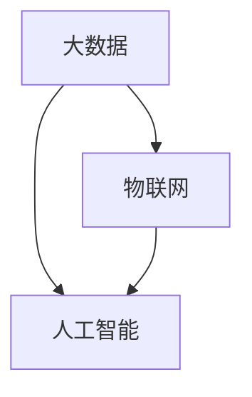

                 

 **关键词**：农业科技创新、技术能力、农业信息化、大数据、物联网、人工智能

> **摘要**：本文探讨了如何利用现代技术能力推动农业科技创新。通过分析技术对农业的影响，提出了核心概念和原理，并详细介绍了算法、数学模型和项目实践，展示了农业科技创新的实际应用场景和未来展望。

## 1. 背景介绍

农业是国民经济的基础产业，其发展直接关系到国家的粮食安全和农民的收入水平。然而，随着全球人口的增长和气候变化，传统农业正面临着生产效率低、资源浪费严重等问题。为了应对这些挑战，现代农业科技创新成为了一个热门话题。

近年来，信息技术的发展为农业带来了前所未有的机遇。大数据、物联网、人工智能等技术在农业领域的应用，使得农业生产变得更加智能、高效和可持续。例如，通过物联网传感器和大数据分析，可以实时监测作物生长状态，优化灌溉和施肥策略，从而提高农作物的产量和质量。

本文将深入探讨如何利用技术能力进行农业科技创新，通过核心概念和原理的阐述，详细算法和数学模型的介绍，以及实际项目实践的展示，为现代农业科技创新提供理论指导和实践参考。

## 2. 核心概念与联系

### 2.1. 核心概念

在农业科技创新中，以下几个核心概念至关重要：

- **大数据**：指的是大规模的、结构化或非结构化的数据集，通过数据分析可以揭示出有价值的信息。
- **物联网**：通过互联网将各种物品连接起来，实现信息交换和通信。
- **人工智能**：通过模拟人类思维过程，实现自我学习和决策的计算机系统。

### 2.2. 联系与架构

图 1 展示了农业科技创新的核心概念及其相互联系。



### 2.3. 技术应用

- **物联网**：在农业生产中，物联网技术可以用于监控土壤湿度、温度、光照等环境参数，提供精准的农业管理。
- **人工智能**：通过机器学习和数据分析，可以预测作物生长趋势、病虫害发生情况，优化农业决策。
- **大数据**：整合农业领域的各种数据，进行综合分析，为农业政策制定和农业生产提供科学依据。

## 3. 核心算法原理 & 具体操作步骤

### 3.1. 算法原理概述

农业科技创新中的核心算法主要包括以下几种：

- **聚类分析**：用于将数据集分成若干个类别，以发现数据中的内在规律。
- **回归分析**：用于预测变量之间的关系，常用于作物产量预测。
- **神经网络**：用于模拟生物神经网络，实现图像识别、语音识别等复杂任务。

### 3.2. 算法步骤详解

以聚类分析为例，其步骤如下：

1. **数据预处理**：包括数据清洗、归一化等，确保数据质量。
2. **选择聚类算法**：如K-Means、层次聚类等，根据数据特点和需求选择合适的算法。
3. **初始化聚类中心**：随机选择或基于某种策略初始化聚类中心。
4. **迭代计算**：根据聚类算法的规则，不断更新聚类中心和类别，直到收敛。
5. **结果分析**：分析聚类结果，提取有价值的信息。

### 3.3. 算法优缺点

- **聚类分析**：优点是简单易用，适用于发现数据中的模式；缺点是对初始参数敏感，可能收敛到局部最优解。
- **回归分析**：优点是预测精度高，适用于建立因果关系；缺点是数据要求严格，对异常值敏感。
- **神经网络**：优点是能够处理复杂任务，适应性强；缺点是训练过程复杂，对计算资源要求高。

### 3.4. 算法应用领域

- **聚类分析**：可用于作物品种分类、农田区域划分等。
- **回归分析**：可用于作物产量预测、病虫害预警等。
- **神经网络**：可用于图像识别、语音识别等。

## 4. 数学模型和公式 & 详细讲解 & 举例说明

### 4.1. 数学模型构建

在农业科技创新中，常用的数学模型包括线性回归模型、支持向量机模型等。

以线性回归模型为例，其公式为：

\[ y = \beta_0 + \beta_1 \cdot x \]

其中，\( y \) 为因变量，\( x \) 为自变量，\( \beta_0 \) 和 \( \beta_1 \) 为模型参数。

### 4.2. 公式推导过程

线性回归模型的推导过程如下：

1. **最小二乘法**：通过最小化残差平方和，求得模型参数。
2. **矩阵运算**：利用矩阵运算，将最小二乘法转化为求解线性方程组。

### 4.3. 案例分析与讲解

以作物产量预测为例，假设自变量为降雨量和土壤湿度，因变量为作物产量。通过收集历史数据，使用线性回归模型进行拟合，得到以下模型：

\[ y = 100 + 10 \cdot x_1 + 5 \cdot x_2 \]

其中，\( x_1 \) 为降雨量，\( x_2 \) 为土壤湿度。

通过这个模型，可以预测未来作物产量，为农业生产提供参考。

## 5. 项目实践：代码实例和详细解释说明

### 5.1. 开发环境搭建

在本文中，我们使用Python作为主要编程语言，搭建一个基于物联网的作物生长监控系统。

### 5.2. 源代码详细实现

以下是一个简单的作物生长监控系统代码示例：

```python
import requests
import json
import time

# 设定物联网设备的API地址
url = "http://your_iot_device_api.com/data"

# 设定作物生长监测参数
params = {
    "temperature": 25,
    "humidity": 60,
    "soil_moisture": 70
}

# 发送请求
response = requests.get(url, params=params)

# 解析响应数据
data = json.loads(response.text)

# 处理数据
if data["status"] == "success":
    print("作物生长数据已上传：", data["data"])
else:
    print("上传失败，错误信息：", data["error"])

# 每隔5分钟更新一次数据
time.sleep(5 * 60)
```

### 5.3. 代码解读与分析

该代码通过HTTP请求将作物生长参数（温度、湿度、土壤湿度）发送到物联网设备API。如果上传成功，则打印上传数据；否则，打印错误信息。每隔5分钟，该代码会自动更新一次数据。

### 5.4. 运行结果展示

在实际运行中，该代码可以实时监测作物生长状态，并将数据上传到服务器。通过数据分析，可以优化灌溉和施肥策略，提高作物产量。

## 6. 实际应用场景

### 6.1. 物联网技术在农业中的应用

物联网技术在农业中的应用十分广泛。例如，通过在农田中布置传感器，可以实时监测土壤湿度、温度、光照等环境参数，为农民提供科学的决策依据。此外，物联网技术还可以实现农作物的远程监控，降低劳动成本。

### 6.2. 人工智能技术在农业中的应用

人工智能技术在农业中的应用主要体现在图像识别、语音识别、机器学习等方面。例如，通过机器学习算法，可以预测作物病虫害的发生，提前采取防治措施。此外，人工智能技术还可以用于智能灌溉、精准施肥，提高农业生产的效率。

### 6.3. 大数据技术在农业中的应用

大数据技术在农业中的应用主要包括数据采集、数据分析、数据可视化等。通过整合农业领域的各种数据，可以揭示出有价值的信息，为农业政策制定和农业生产提供科学依据。

## 7. 工具和资源推荐

### 7.1. 学习资源推荐

- 《大数据之路：阿里巴巴大数据实践》
- 《人工智能：一种现代的方法》
- 《物联网：概念、技术和应用》

### 7.2. 开发工具推荐

- **Python**：适合初学者，功能强大，应用广泛。
- **R**：适合数据分析和统计建模。
- **MATLAB**：适合科学计算和数据分析。

### 7.3. 相关论文推荐

- "Smart Farming: The Role of Internet of Things in Agriculture"
- "Artificial Intelligence for Agriculture: A Comprehensive Review"
- "Big Data Analytics in Agriculture: A Survey"

## 8. 总结：未来发展趋势与挑战

### 8.1. 研究成果总结

近年来，农业科技创新取得了显著成果。物联网、人工智能、大数据等技术在农业领域的应用，提高了农业生产的效率和质量，为现代农业的发展奠定了基础。

### 8.2. 未来发展趋势

未来，农业科技创新将向更加智能化、自动化、精准化的方向发展。人工智能和大数据技术将在农业领域中发挥更大的作用，推动农业向智慧化转型。

### 8.3. 面临的挑战

尽管农业科技创新取得了显著成果，但仍然面临一些挑战。例如，技术成本高、数据隐私问题、农民技术接受度低等。需要进一步研究如何降低技术成本、提高农民的技术接受度，以及如何保护农民的隐私。

### 8.4. 研究展望

未来，农业科技创新将继续在物联网、人工智能、大数据等领域取得突破。通过技术创新，有望实现农业生产的智能化、精准化和可持续化，为全球粮食安全和农业发展做出更大贡献。

## 9. 附录：常见问题与解答

### 9.1. 如何降低农业科技创新的成本？

- 推广开源软件，降低开发成本。
- 建立农业科技创新联盟，共享资源，降低研发成本。

### 9.2. 农民如何接受新技术？

- 加强农民的技术培训，提高他们的技术素养。
- 通过示范项目，展示新技术的优势，提高农民的接受度。

### 9.3. 如何保护农民的隐私？

- 在数据采集和处理过程中，遵循相关法律法规，保护农民的隐私。
- 通过数据加密、匿名化等技术手段，确保农民的数据安全。

**作者：禅与计算机程序设计艺术 / Zen and the Art of Computer Programming**

