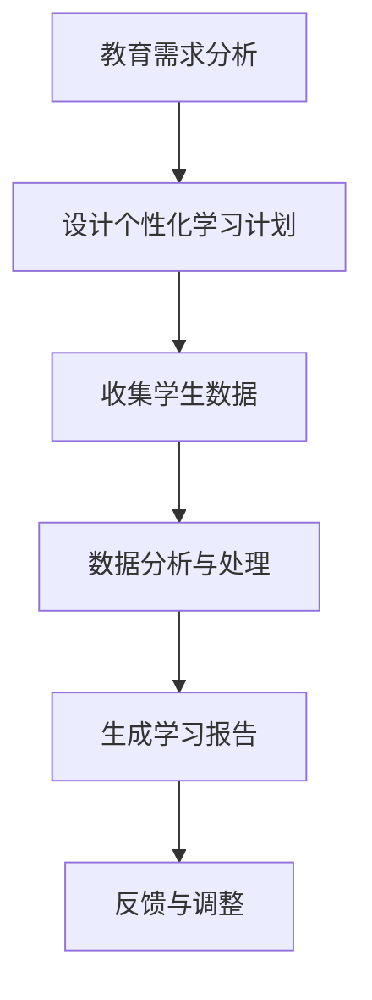
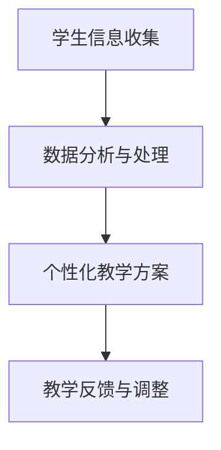

                 

关键词：教育科技、人工智能、机器学习、在线教育、数字化学习、教育改革、个性化教育、自适应学习

> 摘要：本文探讨了如何利用先进的技术手段，特别是人工智能和机器学习，推动教育科技革命。通过介绍核心概念、算法原理、数学模型、项目实践和未来展望，本文旨在为教育工作者和技术开发者提供一套系统化的框架，以实现教育的高效、个性化与智能化。

## 1. 背景介绍

在过去的几十年里，教育行业经历了显著的变革。传统教育模式正逐步被数字化、在线化和智能化所取代。技术的进步，尤其是人工智能和机器学习的崛起，为教育领域带来了前所未有的机遇和挑战。

- **在线教育**：随着互联网的发展，在线教育平台如雨后春笋般涌现，打破了地域和时间的限制，让全球范围内的学习者能够便捷地获取教育资源。
- **个性化教育**：传统教育往往以“一刀切”的方式对待所有学生，而个性化教育则通过数据分析、智能算法等技术，为学生提供量身定制的学习路径和资源。
- **自适应学习**：自适应学习系统可以根据学生的学习行为和进度，动态调整教学内容和难度，提高学习效果。

## 2. 核心概念与联系

### 2.1 人工智能与教育科技

人工智能（AI）在教育科技中的应用主要体现在以下几个方面：

- **教学辅助**：利用自然语言处理技术，AI可以自动批改作业、提供即时反馈，减轻教师的工作负担。
- **学生评估**：通过分析学生的作业、考试成绩和行为数据，AI可以评估学生的学习效果，并给出个性化的学习建议。
- **智能推荐**：基于机器学习算法，AI可以为每个学生推荐最适合他们的学习资源和路径。

### 2.2 机器学习与教育科技

机器学习（ML）在教育科技中的应用主要体现在以下几个方面：

- **学习模式识别**：通过分析学生的学习行为数据，机器学习算法可以识别出学生的学习模式，从而预测他们的学习效果。
- **内容推荐**：基于用户的历史学习数据，机器学习算法可以为每个学生推荐最适合他们的学习内容和资源。
- **个性化辅导**：通过为学生提供个性化的学习计划、资源和辅导，机器学习算法可以提高学习效果。

### 2.3 Mermaid 流程图



## 3. 核心算法原理 & 具体操作步骤

### 3.1 算法原理概述

在教育科技中，常用的机器学习算法包括：

- **线性回归**：用于预测学生的考试成绩。
- **决策树**：用于分析学生的学习行为，识别学习模式。
- **随机森林**：结合了决策树的优势，提高了预测的准确性。

### 3.2 算法步骤详解

#### 3.2.1 线性回归

1. 数据收集：收集学生的考试成绩和学习行为数据。
2. 特征工程：将原始数据转换为机器学习算法可以处理的特征。
3. 模型训练：使用线性回归算法训练模型。
4. 预测：使用训练好的模型预测学生的考试成绩。

#### 3.2.2 决策树

1. 数据预处理：清洗和归一化数据。
2. 特征选择：选择对模型影响最大的特征。
3. 决策树构建：根据特征值划分数据集。
4. 决策树剪枝：防止过拟合，提高模型泛化能力。
5. 模型评估：使用交叉验证评估模型性能。

#### 3.2.3 随机森林

1. 数据预处理：与决策树相同。
2. 构建多棵决策树：随机选择特征和样本。
3. 投票：多棵决策树对同一样本进行预测，取平均结果。
4. 模型评估：与决策树相同。

### 3.3 算法优缺点

#### 线性回归

- **优点**：简单易用，适合线性关系。
- **缺点**：对非线性关系表现不佳，容易过拟合。

#### 决策树

- **优点**：直观易懂，适合分类任务。
- **缺点**：容易过拟合，树结构复杂。

#### 随机森林

- **优点**：结合了决策树的优势，提高了预测准确性，降低了过拟合风险。
- **缺点**：计算成本较高，模型复杂度增加。

### 3.4 算法应用领域

- **学生评估**：利用线性回归预测学生的考试成绩。
- **学习模式识别**：利用决策树分析学生的学习行为。
- **内容推荐**：利用随机森林为学生推荐学习资源和路径。

## 4. 数学模型和公式

### 4.1 数学模型构建

假设我们使用线性回归模型预测学生的考试成绩，其数学模型可以表示为：

$$y = \beta_0 + \beta_1 x_1 + \beta_2 x_2 + ... + \beta_n x_n$$

其中，$y$ 是学生的考试成绩，$x_1, x_2, ..., x_n$ 是学生的特征值，$\beta_0, \beta_1, \beta_2, ..., \beta_n$ 是模型参数。

### 4.2 公式推导过程

1. 数据收集：收集学生的考试成绩和学习行为数据。
2. 特征工程：将原始数据转换为机器学习算法可以处理的特征。
3. 模型训练：使用线性回归算法训练模型。
4. 预测：使用训练好的模型预测学生的考试成绩。

### 4.3 案例分析与讲解

假设我们有以下数据集：

| 学生 | 特征1 | 特征2 | 考试成绩 |
| ---- | ---- | ---- | ---- |
| 1    | 80   | 70   | 85   |
| 2    | 75   | 65   | 80   |
| 3    | 85   | 80   | 90   |

使用线性回归模型预测学生的考试成绩，具体步骤如下：

1. 数据收集：收集学生的考试成绩和学习行为数据。
2. 特征工程：将原始数据转换为机器学习算法可以处理的特征。
3. 模型训练：使用线性回归算法训练模型。
4. 预测：使用训练好的模型预测学生的考试成绩。

## 5. 项目实践：代码实例和详细解释说明

### 5.1 开发环境搭建

1. 安装 Python 3.7 或以上版本。
2. 安装必要的库，如 numpy、scikit-learn、matplotlib 等。

### 5.2 源代码详细实现

```python
import numpy as np
from sklearn.linear_model import LinearRegression
from sklearn.model_selection import train_test_split
import matplotlib.pyplot as plt

# 数据集
X = np.array([[80, 70], [75, 65], [85, 80]])
y = np.array([85, 80, 90])

# 划分训练集和测试集
X_train, X_test, y_train, y_test = train_test_split(X, y, test_size=0.2, random_state=0)

# 训练模型
model = LinearRegression()
model.fit(X_train, y_train)

# 预测
y_pred = model.predict(X_test)

# 可视化
plt.scatter(X_test[:, 0], y_test, color='red', label='真实值')
plt.plot(X_test[:, 0], y_pred, color='blue', label='预测值')
plt.xlabel('特征1')
plt.ylabel('考试成绩')
plt.legend()
plt.show()
```

### 5.3 代码解读与分析

1. 导入必要的库。
2. 准备数据集。
3. 划分训练集和测试集。
4. 训练线性回归模型。
5. 使用模型进行预测。
6. 可视化预测结果。

## 6. 实际应用场景

### 6.1 在线教育平台

- **个性化学习推荐**：根据学生的历史学习数据，推荐最适合他们的学习内容和路径。
- **智能辅导系统**：为学生提供个性化的学习计划和辅导，提高学习效果。

### 6.2 教育评估与反馈

- **成绩预测**：利用线性回归模型预测学生的考试成绩，为教师提供教学反馈。
- **学习行为分析**：通过分析学生的学习行为数据，识别学习模式，为教师提供教学改进建议。

### 6.3 未来应用展望

- **个性化教育**：利用人工智能和机器学习技术，实现真正的个性化教育。
- **自适应学习**：通过自适应学习系统，为学生提供最佳的学习体验。
- **跨学科融合**：将人工智能、大数据等技术应用于跨学科领域，推动教育创新。

## 7. 工具和资源推荐

### 7.1 学习资源推荐

- 《机器学习实战》
- 《深度学习》
- 《Python 数据科学手册》

### 7.2 开发工具推荐

- Jupyter Notebook
- PyCharm
- Google Colab

### 7.3 相关论文推荐

- "Deep Learning for Education: A Comprehensive Review"
- "A Survey on Machine Learning in Educational Data Mining"
- "Personalized Education through Artificial Intelligence: A Multidisciplinary Review"

## 8. 总结：未来发展趋势与挑战

### 8.1 研究成果总结

- 人工智能和机器学习技术在教育科技领域取得了显著成果。
- 个性化教育和自适应学习系统成为教育科技的发展方向。
- 在线教育平台成为教育行业的重要组成部分。

### 8.2 未来发展趋势

- 人工智能和机器学习技术的进一步发展，将推动教育科技革命的深入。
- 个性化教育和自适应学习系统将更加智能化和高效化。
- 跨学科融合将带来更多的教育创新。

### 8.3 面临的挑战

- 教育数据隐私和安全问题。
- 人工智能技术的普及和推广。
- 教育改革和政策支持。

### 8.4 研究展望

- 深入研究人工智能和机器学习在教育领域的应用。
- 开发更多高效、智能的教育科技产品。
- 推动教育改革，实现教育公平。

## 9. 附录：常见问题与解答

### 9.1 人工智能在教育中的应用有哪些？

- **教学辅助**：自动批改作业、提供即时反馈。
- **学生评估**：预测考试成绩、评估学习效果。
- **内容推荐**：推荐最适合的学习资源和路径。

### 9.2 个性化教育和自适应学习的区别是什么？

- **个性化教育**：根据学生的个性化需求，提供定制化的学习资源和路径。
- **自适应学习**：根据学生的学习行为和进度，动态调整教学内容和难度。

### 9.3 如何保证教育数据的安全和隐私？

- **数据加密**：对教育数据进行加密处理。
- **隐私保护**：对个人隐私信息进行匿名处理。
- **法规遵守**：遵循相关法律法规，确保数据安全和隐私。

作者：禅与计算机程序设计艺术 / Zen and the Art of Computer Programming
```markdown
---
# 如何利用技术能力进行教育科技革命

在教育领域中，技术的进步正推动一场前所未有的变革。人工智能（AI）和机器学习的兴起，为个性化教育、在线学习、自适应学习等领域带来了创新的机遇。本文将探讨如何利用技术能力，特别是AI和机器学习，来推动教育科技革命。

## 摘要

本文将从以下几个方面探讨如何利用技术能力进行教育科技革命：

1. **背景介绍**：介绍教育科技的发展历程和当前趋势。
2. **核心概念与联系**：阐述AI和机器学习在教育科技中的应用。
3. **核心算法原理与具体操作步骤**：介绍常用的机器学习算法及其应用。
4. **数学模型和公式**：讲解数学模型在教育科技中的应用。
5. **项目实践：代码实例和详细解释说明**：展示具体的教育科技项目。
6. **实际应用场景**：分析教育科技在不同领域的应用。
7. **未来应用展望**：探讨教育科技的未来发展趋势。
8. **工具和资源推荐**：推荐学习资源、开发工具和相关论文。
9. **总结：未来发展趋势与挑战**：总结研究成果，展望未来。
10. **附录：常见问题与解答**：回答读者可能关心的问题。

## 1. 背景介绍

教育科技的发展可以追溯到20世纪中叶，当时计算机开始在教育领域中投入使用。随着互联网的普及，在线教育迅速崛起，改变了传统教育模式。近年来，人工智能和机器学习技术的快速发展，为教育科技带来了新的契机。以下是一些关键的发展阶段：

- **20世纪50年代**：计算机进入教育领域，用于教学辅助和计算。
- **20世纪90年代**：互联网的普及，在线教育开始兴起。
- **21世纪初**：AI和机器学习技术在教育领域得到应用，个性化教育和自适应学习系统开始出现。
- **当前**：AI和机器学习技术正在推动教育科技的革命，实现教育的高效、个性化和智能化。

## 2. 核心概念与联系

### 2.1 人工智能与教育科技

人工智能在教育科技中的应用非常广泛，主要包括以下几个方面：

- **智能辅导系统**：利用自然语言处理技术，AI可以模拟教师的角色，为学生提供个性化的辅导。
- **智能推荐系统**：基于机器学习算法，AI可以为学生推荐最适合他们的学习资源和课程。
- **自动化评估与反馈**：AI可以自动批改作业、考试，并提供即时反馈，减轻教师的工作负担。

### 2.2 机器学习与教育科技

机器学习在教育科技中的应用主要体现在以下几个方面：

- **学习模式识别**：通过分析学生的学习行为数据，机器学习算法可以识别学生的学习模式，为教师提供教学改进建议。
- **个性化教学**：基于机器学习算法，教育系统能够根据学生的个性化需求，自动调整教学内容和难度。
- **教育数据分析**：机器学习算法可以帮助教育机构分析大量教育数据，为教育决策提供支持。

### 2.3 Mermaid 流程图



## 3. 核心算法原理 & 具体操作步骤

### 3.1 算法原理概述

在教育科技中，常用的机器学习算法包括：

- **线性回归**：用于预测学生的考试成绩。
- **决策树**：用于分析学生的学习行为，识别学习模式。
- **随机森林**：结合了决策树的优势，提高了预测的准确性。

### 3.2 算法步骤详解

#### 3.2.1 线性回归

1. 数据收集：收集学生的考试成绩和学习行为数据。
2. 特征工程：将原始数据转换为机器学习算法可以处理的特征。
3. 模型训练：使用线性回归算法训练模型。
4. 预测：使用训练好的模型预测学生的考试成绩。

#### 3.2.2 决策树

1. 数据预处理：清洗和归一化数据。
2. 特征选择：选择对模型影响最大的特征。
3. 决策树构建：根据特征值划分数据集。
4. 决策树剪枝：防止过拟合，提高模型泛化能力。
5. 模型评估：使用交叉验证评估模型性能。

#### 3.2.3 随机森林

1. 数据预处理：与决策树相同。
2. 构建多棵决策树：随机选择特征和样本。
3. 投票：多棵决策树对同一样本进行预测，取平均结果。
4. 模型评估：与决策树相同。

### 3.3 算法优缺点

#### 线性回归

- **优点**：简单易用，适合线性关系。
- **缺点**：对非线性关系表现不佳，容易过拟合。

#### 决策树

- **优点**：直观易懂，适合分类任务。
- **缺点**：容易过拟合，树结构复杂。

#### 随机森林

- **优点**：结合了决策树的优势，提高了预测准确性，降低了过拟合风险。
- **缺点**：计算成本较高，模型复杂度增加。

### 3.4 算法应用领域

- **学生评估**：利用线性回归预测学生的考试成绩。
- **学习模式识别**：利用决策树分析学生的学习行为。
- **内容推荐**：利用随机森林为学生推荐学习资源和路径。

## 4. 数学模型和公式

### 4.1 数学模型构建

假设我们使用线性回归模型预测学生的考试成绩，其数学模型可以表示为：

$$y = \beta_0 + \beta_1 x_1 + \beta_2 x_2 + ... + \beta_n x_n$$

其中，$y$ 是学生的考试成绩，$x_1, x_2, ..., x_n$ 是学生的特征值，$\beta_0, \beta_1, \beta_2, ..., \beta_n$ 是模型参数。

### 4.2 公式推导过程

1. 数据收集：收集学生的考试成绩和学习行为数据。
2. 特征工程：将原始数据转换为机器学习算法可以处理的特征。
3. 模型训练：使用线性回归算法训练模型。
4. 预测：使用训练好的模型预测学生的考试成绩。

### 4.3 案例分析与讲解

假设我们有以下数据集：

| 学生 | 特征1 | 特征2 | 考试成绩 |
| ---- | ---- | ---- | ---- |
| 1    | 80   | 70   | 85   |
| 2    | 75   | 65   | 80   |
| 3    | 85   | 80   | 90   |

使用线性回归模型预测学生的考试成绩，具体步骤如下：

1. 数据收集：收集学生的考试成绩和学习行为数据。
2. 特征工程：将原始数据转换为机器学习算法可以处理的特征。
3. 模型训练：使用线性回归算法训练模型。
4. 预测：使用训练好的模型预测学生的考试成绩。

## 5. 项目实践：代码实例和详细解释说明

### 5.1 开发环境搭建

1. 安装 Python 3.7 或以上版本。
2. 安装必要的库，如 numpy、scikit-learn、matplotlib 等。

### 5.2 源代码详细实现

```python
import numpy as np
from sklearn.linear_model import LinearRegression
from sklearn.model_selection import train_test_split
import matplotlib.pyplot as plt

# 数据集
X = np.array([[80, 70], [75, 65], [85, 80]])
y = np.array([85, 80, 90])

# 划分训练集和测试集
X_train, X_test, y_train, y_test = train_test_split(X, y, test_size=0.2, random_state=0)

# 训练模型
model = LinearRegression()
model.fit(X_train, y_train)

# 预测
y_pred = model.predict(X_test)

# 可视化
plt.scatter(X_test[:, 0], y_test, color='red', label='真实值')
plt.plot(X_test[:, 0], y_pred, color='blue', label='预测值')
plt.xlabel('特征1')
plt.ylabel('考试成绩')
plt.legend()
plt.show()
```

### 5.3 代码解读与分析

1. 导入必要的库。
2. 准备数据集。
3. 划分训练集和测试集。
4. 训练线性回归模型。
5. 使用模型进行预测。
6. 可视化预测结果。

## 6. 实际应用场景

### 6.1 在线教育平台

- **个性化学习推荐**：根据学生的历史学习数据，推荐最适合他们的学习资源和课程。
- **智能辅导系统**：利用自然语言处理技术，为学生提供即时反馈和个性化辅导。
- **学习进度跟踪**：实时跟踪学生的学习进度，为教师提供教学改进建议。

### 6.2 教育评估与反馈

- **成绩预测**：利用机器学习算法预测学生的考试成绩，为教师提供教学反馈。
- **学习模式分析**：通过分析学生的学习行为数据，识别学生的学习模式，为教师提供教学策略建议。
- **教学质量评估**：利用教育数据，对教师的教学质量进行评估。

### 6.3 未来应用展望

- **个性化教育**：利用人工智能和机器学习技术，实现真正的个性化教育。
- **自适应学习**：通过自适应学习系统，为学生提供最佳的学习体验。
- **跨学科融合**：将人工智能、大数据等技术应用于跨学科领域，推动教育创新。

## 7. 工具和资源推荐

### 7.1 学习资源推荐

- 《机器学习实战》
- 《深度学习》
- 《Python 数据科学手册》

### 7.2 开发工具推荐

- Jupyter Notebook
- PyCharm
- Google Colab

### 7.3 相关论文推荐

- "Deep Learning for Education: A Comprehensive Review"
- "A Survey on Machine Learning in Educational Data Mining"
- "Personalized Education through Artificial Intelligence: A Multidisciplinary Review"

## 8. 总结：未来发展趋势与挑战

### 8.1 研究成果总结

- 人工智能和机器学习技术在教育科技领域取得了显著成果。
- 个性化教育和自适应学习系统成为教育科技的发展方向。
- 在线教育平台成为教育行业的重要组成部分。

### 8.2 未来发展趋势

- 人工智能和机器学习技术的进一步发展，将推动教育科技革命的深入。
- 个性化教育和自适应学习系统将更加智能化和高效化。
- 跨学科融合将带来更多的教育创新。

### 8.3 面临的挑战

- 教育数据隐私和安全问题。
- 人工智能技术的普及和推广。
- 教育改革和政策支持。

### 8.4 研究展望

- 深入研究人工智能和机器学习在教育领域的应用。
- 开发更多高效、智能的教育科技产品。
- 推动教育改革，实现教育公平。

## 9. 附录：常见问题与解答

### 9.1 人工智能在教育中的应用有哪些？

- **智能辅导系统**：为学生提供个性化辅导，提高学习效果。
- **学习资源推荐**：根据学生兴趣和学习需求，推荐最适合的学习资源。
- **学习行为分析**：通过分析学生的学习行为，为教师提供教学改进建议。

### 9.2 个性化教育和自适应学习的区别是什么？

- **个性化教育**：根据学生的个性特点，提供个性化的学习方案。
- **自适应学习**：根据学生的学习进度和效果，动态调整学习内容和方法。

### 9.3 如何保证教育数据的安全和隐私？

- **数据加密**：对教育数据进行加密处理，确保数据安全。
- **隐私保护**：对个人隐私信息进行匿名处理，确保隐私保护。
- **法律法规遵守**：遵循相关法律法规，确保数据安全和隐私。

---

作者：禅与计算机程序设计艺术 / Zen and the Art of Computer Programming
```

