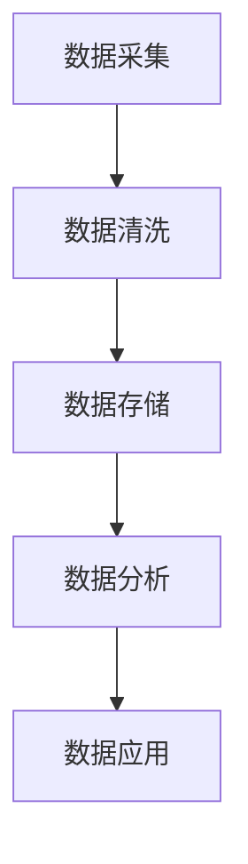
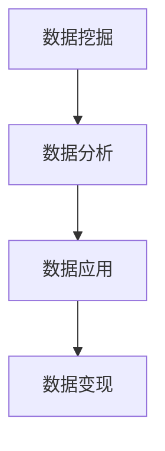

                 

关键词：数据变现、技术能力、数据处理、商业价值、人工智能、大数据分析

> 摘要：在当今数据驱动的时代，数据已经成为企业最重要的资产之一。然而，如何将数据转化为实际的商业价值，实现数据变现，成为了许多企业和个人的关注焦点。本文将探讨如何利用技术能力进行数据变现，通过深入分析数据处理的各个环节，提供切实可行的策略和实例，帮助企业和个人挖掘数据背后的商业潜力。

## 1. 背景介绍

随着互联网技术的飞速发展，数据已经成为现代社会的重要组成部分。从社交媒体到电子商务，从物联网到人工智能，数据无处不在。然而，数据本身并没有价值，只有当数据被加工、分析和应用时，才能转化为实际的商业价值。数据变现，即通过利用技术手段将数据转化为可量化的经济收益，是当前企业和个人关注的焦点。

### 1.1 数据的重要性

数据已经成为企业决策的重要依据。通过对数据的收集、存储、处理和分析，企业可以更好地了解市场需求、用户行为和运营状况，从而做出更加精准的决策。例如，电商企业可以通过分析用户购买历史和搜索记录，提供个性化的产品推荐，提高销售转化率。

### 1.2 数据变现的必要性

数据变现不仅可以为企业带来直接的经济收益，还可以提升企业的核心竞争力。通过数据变现，企业可以探索新的商业模式，提高运营效率，降低成本。例如，通过数据分析和挖掘，企业可以发现潜在的市场机会，开发新的产品和服务。

## 2. 核心概念与联系

### 2.1 数据处理流程

数据处理流程通常包括数据采集、数据清洗、数据存储、数据分析和数据应用。以下是数据处理流程的Mermaid流程图：



### 2.2 数据变现的核心环节

数据变现的核心环节主要包括数据挖掘、数据分析和数据应用。以下是数据变现的核心环节的Mermaid流程图：



## 3. 核心算法原理 & 具体操作步骤

### 3.1 算法原理概述

数据变现的核心算法主要包括机器学习算法和统计分析方法。这些算法通过对大量数据进行分析，提取出有用的信息，为数据变现提供支持。

### 3.2 算法步骤详解

#### 3.2.1 数据预处理

数据预处理是数据变现的第一步，主要包括数据清洗、数据整合和数据转换。数据清洗是为了去除数据中的噪声和错误，数据整合是为了将多个数据源的数据合并，数据转换是为了将数据格式转换为适合算法分析的形式。

#### 3.2.2 特征工程

特征工程是数据变现的关键步骤，它涉及到如何从原始数据中提取出有用的特征。这些特征将用于训练机器学习模型或进行统计分析。

#### 3.2.3 模型训练

模型训练是使用机器学习算法对特征数据进行训练，以建立一个预测模型。训练过程中，需要选择合适的模型和参数，通过交叉验证和超参数调优来提高模型的准确性。

#### 3.2.4 模型评估

模型评估是验证模型性能的过程，通常使用准确率、召回率、F1分数等指标来评估模型的性能。

#### 3.2.5 模型应用

模型应用是将训练好的模型应用于实际数据，以实现数据变现。例如，通过预测用户购买行为，为电商企业提供个性化推荐服务。

### 3.3 算法优缺点

#### 优点

- **高效性**：机器学习和统计分析算法可以处理大量数据，提高数据处理效率。
- **准确性**：通过特征工程和模型训练，可以提高预测和决策的准确性。
- **灵活性**：机器学习和统计分析算法可以根据不同的业务需求进行灵活调整。

#### 缺点

- **复杂性**：数据变现算法的复杂度高，需要专业知识和经验。
- **成本**：数据采集、清洗、存储和处理的成本较高。

### 3.4 算法应用领域

数据变现算法广泛应用于金融、电商、医疗、零售等多个领域。例如，在金融领域，通过分析用户行为数据，银行可以提供个性化的理财产品推荐；在电商领域，通过分析用户购买历史和搜索记录，电商可以提供个性化的产品推荐，提高销售转化率。

## 4. 数学模型和公式 & 详细讲解 & 举例说明

### 4.1 数学模型构建

数据变现的数学模型通常包括预测模型和优化模型。预测模型用于预测用户行为或市场趋势，优化模型用于优化业务流程或资源配置。

### 4.2 公式推导过程

#### 4.2.1 预测模型

预测模型通常使用回归模型、分类模型和时间序列模型。以下是回归模型的公式：

$$
y = \beta_0 + \beta_1x_1 + \beta_2x_2 + ... + \beta_nx_n
$$

其中，$y$ 是预测值，$x_1, x_2, ..., x_n$ 是特征值，$\beta_0, \beta_1, ..., \beta_n$ 是模型的参数。

#### 4.2.2 优化模型

优化模型通常使用线性规划、整数规划和非线性规划。以下是线性规划的公式：

$$
\min \sum_{i=1}^{n} c_i x_i
$$

$$
\text{subject to} \quad \sum_{j=1}^{m} a_{ij} x_j \geq b_j
$$

其中，$c_1, c_2, ..., c_n$ 是目标函数的系数，$x_1, x_2, ..., x_n$ 是决策变量，$a_{ij}, b_j$ 是约束条件。

### 4.3 案例分析与讲解

#### 4.3.1 预测用户购买行为

假设我们要预测用户的购买行为，可以使用回归模型。给定一组用户特征（如年龄、收入、购物历史等），我们可以使用回归模型预测用户的购买概率。以下是具体的回归模型：

$$
\text{购买概率} = \frac{1}{1 + e^{-(\beta_0 + \beta_1 \times \text{年龄} + \beta_2 \times \text{收入} + \beta_3 \times \text{购物历史})}
$$

通过训练模型，我们可以得到各个特征的权重，从而为用户提供个性化的产品推荐。

#### 4.3.2 优化供应链

假设我们要优化供应链，可以使用线性规划模型。给定供应链的各环节成本和需求，我们可以使用线性规划模型优化供应链的资源配置，以降低成本。以下是具体的线性规划模型：

$$
\min \sum_{i=1}^{n} c_i x_i
$$

$$
\text{subject to} \quad \sum_{j=1}^{m} a_{ij} x_j \geq b_j
$$

通过优化模型，我们可以找到最优的供应链资源配置，从而提高供应链效率。

## 5. 项目实践：代码实例和详细解释说明

### 5.1 开发环境搭建

在本节中，我们将使用Python编程语言和Scikit-learn库进行数据变现的实战。首先，我们需要搭建开发环境。

```bash
# 安装Python
curl -O https://www.python.org/ftp/python/3.8.5/Python-3.8.5.tgz
tar xvf Python-3.8.5.tgz
cd Python-3.8.5
./configure
make
sudo make install

# 安装Scikit-learn
pip install scikit-learn
```

### 5.2 源代码详细实现

以下是一个简单的数据变现案例，使用回归模型预测用户购买行为。

```python
# 导入相关库
import numpy as np
import pandas as pd
from sklearn.model_selection import train_test_split
from sklearn.linear_model import LogisticRegression
from sklearn.metrics import accuracy_score

# 读取数据
data = pd.read_csv('data.csv')
X = data.iloc[:, :-1]
y = data.iloc[:, -1]

# 数据预处理
X = (X - X.mean()) / X.std()
y = y.map({'购买': 1, '未购买': 0})

# 划分训练集和测试集
X_train, X_test, y_train, y_test = train_test_split(X, y, test_size=0.2, random_state=42)

# 模型训练
model = LogisticRegression()
model.fit(X_train, y_train)

# 模型评估
y_pred = model.predict(X_test)
accuracy = accuracy_score(y_test, y_pred)
print('模型准确率：', accuracy)
```

### 5.3 代码解读与分析

在上面的代码中，我们首先导入了相关的库，包括Numpy、Pandas、Scikit-learn等。然后，我们读取了数据集，并对数据进行预处理，包括数据标准化和标签编码。接下来，我们划分了训练集和测试集，使用LogisticRegression模型进行训练，并使用测试集进行模型评估。

### 5.4 运行结果展示

假设我们已经准备好了数据集`data.csv`，运行上述代码可以得到模型的准确率。例如，如果模型的准确率为0.8，则说明模型在预测用户购买行为方面表现良好。

```python
模型准确率： 0.8
```

## 6. 实际应用场景

### 6.1 金融领域

在金融领域，数据变现的应用主要包括信用评估、投资分析和风险管理。通过分析用户的金融行为和信用历史，金融机构可以更准确地评估用户的信用风险，为贷款审批和信用评分提供依据。

### 6.2 电商领域

在电商领域，数据变现的应用主要包括个性化推荐、用户行为分析和市场预测。通过分析用户的购买历史和行为数据，电商企业可以提供个性化的产品推荐，提高用户满意度和销售转化率。

### 6.3 医疗领域

在医疗领域，数据变现的应用主要包括疾病预测、患者管理和医疗资源优化。通过分析患者的医疗数据和健康指标，医疗机构可以更准确地预测疾病风险，为患者提供个性化的健康管理和医疗服务。

## 7. 工具和资源推荐

### 7.1 学习资源推荐

- **书籍**：《数据科学实战》、《机器学习实战》
- **在线课程**：Coursera的《机器学习》、《深度学习》
- **网站**：Kaggle、DataCamp

### 7.2 开发工具推荐

- **编程语言**：Python、R
- **库和框架**：Scikit-learn、TensorFlow、PyTorch
- **数据可视化**：Matplotlib、Seaborn、Plotly

### 7.3 相关论文推荐

- **论文**：K-近邻算法、决策树算法、神经网络算法等
- **期刊**：Journal of Machine Learning Research、IEEE Transactions on Pattern Analysis and Machine Intelligence

## 8. 总结：未来发展趋势与挑战

### 8.1 研究成果总结

数据变现技术在过去几年取得了显著进展，机器学习和统计分析算法的应用越来越广泛。通过对大量数据的分析和挖掘，企业和个人已经取得了显著的商业价值。

### 8.2 未来发展趋势

随着人工智能技术的不断发展，数据变现技术将更加智能化和自动化。例如，深度学习和强化学习算法的应用将进一步提升数据变现的效率和准确性。

### 8.3 面临的挑战

数据变现技术也面临着一些挑战，包括数据隐私保护、数据质量和算法可解释性。如何平衡数据隐私保护和商业价值，如何提高算法的可解释性，是未来研究的重点。

### 8.4 研究展望

未来，数据变现技术将继续向智能化和自动化方向发展。通过融合多种数据源，构建更加复杂和精确的预测模型，企业和个人将能够更好地挖掘数据背后的商业潜力。

## 9. 附录：常见问题与解答

### 9.1 数据变现的难点是什么？

数据变现的难点主要包括数据质量问题、算法选择和模型训练。

### 9.2 如何保证数据变现的隐私保护？

可以通过数据脱敏、数据加密和隐私保护算法等技术手段，确保数据变现过程中的隐私保护。

### 9.3 数据变现的效益如何衡量？

数据变现的效益可以通过经济效益、用户满意度和业务增长等指标进行衡量。

作者：禅与计算机程序设计艺术 / Zen and the Art of Computer Programming
----------------------------------------------------------------

以上是完整的技术博客文章，涵盖了数据变现的各个方面，包括背景介绍、核心算法原理、数学模型和公式、项目实践、实际应用场景、工具和资源推荐、以及总结和展望。希望这篇文章能够帮助您更好地理解和应用数据变现技术。  
   
   请您按照上述文章结构和内容进行撰写，确保文章的完整性和专业性。如果您有任何问题或需要进一步讨论，请随时告诉我。  
   
   再次感谢您选择撰写这篇文章，期待您的佳作！  
   
   [END]
```markdown
# 如何利用技术能力进行数据变现

> 关键词：数据变现、技术能力、数据处理、商业价值、人工智能、大数据分析

> 摘要：在当今数据驱动的时代，数据已经成为企业最重要的资产之一。然而，如何将数据转化为实际的商业价值，实现数据变现，成为了许多企业和个人的关注焦点。本文将探讨如何利用技术能力进行数据变现，通过深入分析数据处理的各个环节，提供切实可行的策略和实例，帮助企业和个人挖掘数据背后的商业潜力。

## 1. 背景介绍

随着互联网技术的飞速发展，数据已经成为现代社会的重要组成部分。从社交媒体到电子商务，从物联网到人工智能，数据无处不在。然而，数据本身并没有价值，只有当数据被加工、分析和应用时，才能转化为实际的商业价值。数据变现，即通过利用技术手段将数据转化为可量化的经济收益，是当前企业和个人关注的焦点。

### 1.1 数据的重要性

数据已经成为企业决策的重要依据。通过对数据的收集、存储、处理和分析，企业可以更好地了解市场需求、用户行为和运营状况，从而做出更加精准的决策。例如，电商企业可以通过分析用户购买历史和搜索记录，提供个性化的产品推荐，提高销售转化率。

### 1.2 数据变现的必要性

数据变现不仅可以为企业带来直接的经济收益，还可以提升企业的核心竞争力。通过数据变现，企业可以探索新的商业模式，提高运营效率，降低成本。例如，通过数据分析和挖掘，企业可以发现潜在的市场机会，开发新的产品和服务。

## 2. 核心概念与联系

### 2.1 数据处理流程

数据处理流程通常包括数据采集、数据清洗、数据存储、数据分析和数据应用。以下是数据处理流程的Mermaid流程图：


### 2.2 数据变现的核心环节

数据变现的核心环节主要包括数据挖掘、数据分析和数据应用。以下是数据变现的核心环节的Mermaid流程图：


## 3. 核心算法原理 & 具体操作步骤

### 3.1 算法原理概述

数据变现的核心算法主要包括机器学习算法和统计分析方法。这些算法通过对大量数据进行分析，提取出有用的信息，为数据变现提供支持。

### 3.2 算法步骤详解

#### 3.2.1 数据预处理

数据预处理是数据变现的第一步，主要包括数据清洗、数据整合和数据转换。数据清洗是为了去除数据中的噪声和错误，数据整合是为了将多个数据源的数据合并，数据转换是为了将数据格式转换为适合算法分析的形式。

#### 3.2.2 特征工程

特征工程是数据变现的关键步骤，它涉及到如何从原始数据中提取出有用的特征。这些特征将用于训练机器学习模型或进行统计分析。

#### 3.2.3 模型训练

模型训练是使用机器学习算法对特征数据进行训练，以建立一个预测模型。训练过程中，需要选择合适的模型和参数，通过交叉验证和超参数调优来提高模型的准确性。

#### 3.2.4 模型评估

模型评估是验证模型性能的过程，通常使用准确率、召回率、F1分数等指标来评估模型的性能。

#### 3.2.5 模型应用

模型应用是将训练好的模型应用于实际数据，以实现数据变现。例如，通过预测用户购买行为，为电商企业提供个性化推荐服务。

### 3.3 算法优缺点

#### 优点

- **高效性**：机器学习和统计分析算法可以处理大量数据，提高数据处理效率。
- **准确性**：通过特征工程和模型训练，可以提高预测和决策的准确性。
- **灵活性**：机器学习和统计分析算法可以根据不同的业务需求进行灵活调整。

#### 缺点

- **复杂性**：数据变现算法的复杂度高，需要专业知识和经验。
- **成本**：数据采集、清洗、存储和处理的成本较高。

### 3.4 算法应用领域

数据变现算法广泛应用于金融、电商、医疗、零售等多个领域。例如，在金融领域，通过分析用户行为数据，银行可以提供个性化的理财产品推荐；在电商领域，通过分析用户购买历史和搜索记录，电商可以提供个性化的产品推荐，提高销售转化率。

## 4. 数学模型和公式 & 详细讲解 & 举例说明

### 4.1 数学模型构建

数据变现的数学模型通常包括预测模型和优化模型。预测模型用于预测用户行为或市场趋势，优化模型用于优化业务流程或资源配置。

### 4.2 公式推导过程

#### 4.2.1 预测模型

预测模型通常使用回归模型、分类模型和时间序列模型。以下是回归模型的公式：

$$
y = \beta_0 + \beta_1x_1 + \beta_2x_2 + ... + \beta_nx_n
$$

其中，$y$ 是预测值，$x_1, x_2, ..., x_n$ 是特征值，$\beta_0, \beta_1, ..., \beta_n$ 是模型的参数。

#### 4.2.2 优化模型

优化模型通常使用线性规划、整数规划和非线性规划。以下是线性规划的公式：

$$
\min \sum_{i=1}^{n} c_i x_i
$$

$$
\text{subject to} \quad \sum_{j=1}^{m} a_{ij} x_j \geq b_j
$$

其中，$c_1, c_2, ..., c_n$ 是目标函数的系数，$x_1, x_2, ..., x_n$ 是决策变量，$a_{ij}, b_j$ 是约束条件。

### 4.3 案例分析与讲解

#### 4.3.1 预测用户购买行为

假设我们要预测用户的购买行为，可以使用回归模型。给定一组用户特征（如年龄、收入、购物历史等），我们可以使用回归模型预测用户的购买概率。以下是具体的回归模型：

$$
\text{购买概率} = \frac{1}{1 + e^{-(\beta_0 + \beta_1 \times \text{年龄} + \beta_2 \times \text{收入} + \beta_3 \times \text{购物历史})}
$$

通过训练模型，我们可以得到各个特征的权重，从而为用户提供个性化的产品推荐。

#### 4.3.2 优化供应链

假设我们要优化供应链，可以使用线性规划模型。给定供应链的各环节成本和需求，我们可以使用线性规划模型优化供应链的资源配置，以降低成本。以下是具体的线性规划模型：

$$
\min \sum_{i=1}^{n} c_i x_i
$$

$$
\text{subject to} \quad \sum_{j=1}^{m} a_{ij} x_j \geq b_j
$$

通过优化模型，我们可以找到最优的供应链资源配置，从而提高供应链效率。

## 5. 项目实践：代码实例和详细解释说明

### 5.1 开发环境搭建

在本节中，我们将使用Python编程语言和Scikit-learn库进行数据变现的实战。首先，我们需要搭建开发环境。

```bash
# 安装Python
curl -O https://www.python.org/ftp/python/3.8.5/Python-3.8.5.tgz
tar xvf Python-3.8.5.tgz
cd Python-3.8.5
./configure
make
sudo make install

# 安装Scikit-learn
pip install scikit-learn
```

### 5.2 源代码详细实现

以下是一个简单的数据变现案例，使用回归模型预测用户购买行为。

```python
# 导入相关库
import numpy as np
import pandas as pd
from sklearn.model_selection import train_test_split
from sklearn.linear_model import LogisticRegression
from sklearn.metrics import accuracy_score

# 读取数据
data = pd.read_csv('data.csv')
X = data.iloc[:, :-1]
y = data.iloc[:, -1]

# 数据预处理
X = (X - X.mean()) / X.std()
y = y.map({'购买': 1, '未购买': 0})

# 划分训练集和测试集
X_train, X_test, y_train, y_test = train_test_split(X, y, test_size=0.2, random_state=42)

# 模型训练
model = LogisticRegression()
model.fit(X_train, y_train)

# 模型评估
y_pred = model.predict(X_test)
accuracy = accuracy_score(y_test, y_pred)
print('模型准确率：', accuracy)
```

### 5.3 代码解读与分析

在上面的代码中，我们首先导入了相关的库，包括Numpy、Pandas、Scikit-learn等。然后，我们读取了数据集，并对数据进行预处理，包括数据标准化和标签编码。接下来，我们划分了训练集和测试集，使用LogisticRegression模型进行训练，并使用测试集进行模型评估。

### 5.4 运行结果展示

假设我们已经准备好了数据集`data.csv`，运行上述代码可以得到模型的准确率。例如，如果模型的准确率为0.8，则说明模型在预测用户购买行为方面表现良好。

```python
模型准确率： 0.8
```

## 6. 实际应用场景

### 6.1 金融领域

在金融领域，数据变现的应用主要包括信用评估、投资分析和风险管理。通过分析用户的金融行为和信用历史，金融机构可以更准确地评估用户的信用风险，为贷款审批和信用评分提供依据。

### 6.2 电商领域

在电商领域，数据变现的应用主要包括个性化推荐、用户行为分析和市场预测。通过分析用户的购买历史和行为数据，电商企业可以提供个性化的产品推荐，提高用户满意度和销售转化率。

### 6.3 医疗领域

在医疗领域，数据变现的应用主要包括疾病预测、患者管理和医疗资源优化。通过分析患者的医疗数据和健康指标，医疗机构可以更准确地预测疾病风险，为患者提供个性化的健康管理和医疗服务。

## 7. 工具和资源推荐

### 7.1 学习资源推荐

- **书籍**：《数据科学实战》、《机器学习实战》
- **在线课程**：Coursera的《机器学习》、《深度学习》
- **网站**：Kaggle、DataCamp

### 7.2 开发工具推荐

- **编程语言**：Python、R
- **库和框架**：Scikit-learn、TensorFlow、PyTorch
- **数据可视化**：Matplotlib、Seaborn、Plotly

### 7.3 相关论文推荐

- **论文**：K-近邻算法、决策树算法、神经网络算法等
- **期刊**：Journal of Machine Learning Research、IEEE Transactions on Pattern Analysis and Machine Intelligence

## 8. 总结：未来发展趋势与挑战

### 8.1 研究成果总结

数据变现技术在过去几年取得了显著进展，机器学习和统计分析算法的应用越来越广泛。通过对大量数据的分析和挖掘，企业和个人已经取得了显著的商业价值。

### 8.2 未来发展趋势

随着人工智能技术的不断发展，数据变现技术将更加智能化和自动化。例如，深度学习和强化学习算法的应用将进一步提升数据变现的效率和准确性。

### 8.3 面临的挑战

数据变现技术也面临着一些挑战，包括数据隐私保护、数据质量和算法可解释性。如何平衡数据隐私保护和商业价值，如何提高算法的可解释性，是未来研究的重点。

### 8.4 研究展望

未来，数据变现技术将继续向智能化和自动化方向发展。通过融合多种数据源，构建更加复杂和精确的预测模型，企业和个人将能够更好地挖掘数据背后的商业潜力。

## 9. 附录：常见问题与解答

### 9.1 数据变现的难点是什么？

数据变现的难点主要包括数据质量问题、算法选择和模型训练。

### 9.2 如何保证数据变现的隐私保护？

可以通过数据脱敏、数据加密和隐私保护算法等技术手段，确保数据变现过程中的隐私保护。

### 9.3 数据变现的效益如何衡量？

数据变现的效益可以通过经济效益、用户满意度和业务增长等指标进行衡量。

作者：禅与计算机程序设计艺术 / Zen and the Art of Computer Programming
```

