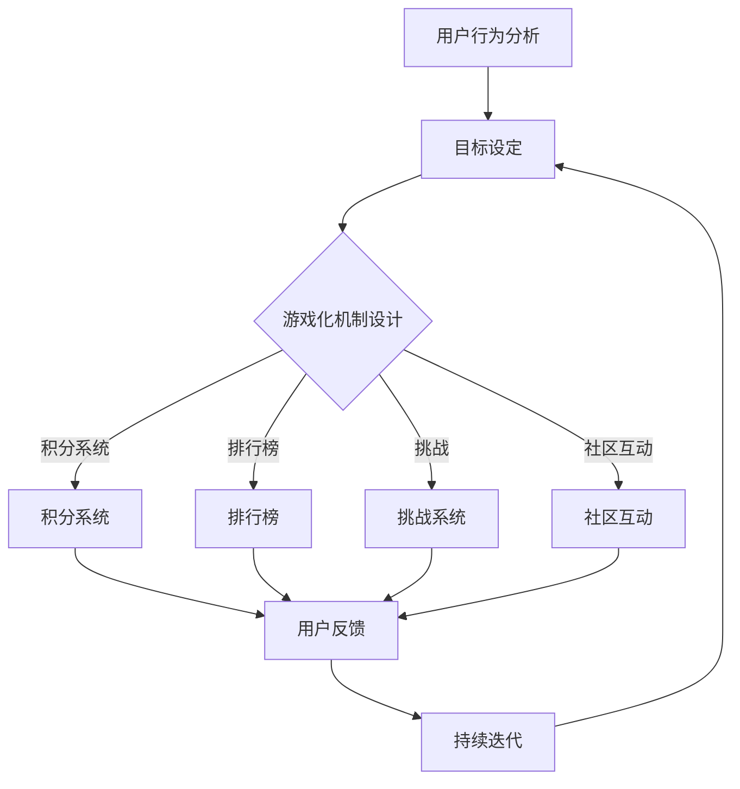

                 

### 1. 背景介绍

在当今数字化时代，知识付费已经成为了一种越来越流行的消费模式。无论是线上课程、专业书籍还是专家咨询，知识付费让用户能够便捷地获取高质量的资源和指导。然而，尽管知识付费的潜在市场巨大，但用户参与度却成为了一个亟待解决的问题。许多用户在购买了知识产品后，往往因为缺乏持续动力而未能充分利用所学内容，这直接影响了知识付费市场的长期发展。

游戏化设计作为一种有效的激励机制，已经被广泛应用于各种领域，如教育、营销和企业管理。游戏化设计通过将游戏元素融入非游戏环境，能够显著提升用户的参与度和满意度。例如，通过积分、奖励、挑战和竞争等机制，游戏化设计可以激发用户的兴趣和动力，使他们更加积极地参与互动和学习。

本文旨在探讨如何利用游戏化设计提高知识付费的参与度。通过分析游戏化设计的基本原理、应用案例以及具体的实施步骤，本文将为知识付费从业者提供一种全新的思路和方法。同时，本文还将讨论游戏化设计在知识付费中的潜在挑战和解决策略，以期为这一领域的未来发展提供有益的参考。

### 2. 核心概念与联系

#### 2.1 游戏化设计的基本原理

游戏化设计（Gamification Design）是将游戏中的元素和机制应用于非游戏环境中，以激励用户行为和提高用户参与度的一种设计方法。其核心在于利用游戏机制，如积分、排名、奖励和挑战等，来增强用户参与感和积极性。游戏化设计的基本原理可以概括为以下几个方面：

1. **目标设定**：通过设定明确、可实现的短期和长期目标，引导用户朝着预期的行为方向前进。
2. **积分和奖励**：使用积分、奖励和等级系统来奖励用户的行为，提供即时的正面反馈。
3. **竞争和协作**：引入竞争和协作机制，激发用户的竞争意识和团队合作精神。
4. **挑战和成就感**：设置适当的挑战，让用户在克服困难的过程中获得成就感。
5. **反馈和透明度**：及时、清晰地提供用户行为的反馈，增加用户对系统操作的理解和信心。

#### 2.2 游戏化设计与知识付费的关联

将游戏化设计应用于知识付费，可以有效地提升用户的学习动力和参与度。具体来说，游戏化设计与知识付费之间的关联可以从以下几个方面体现：

1. **学习目标的实现**：游戏化设计可以帮助用户明确学习目标，并提供清晰的路径和反馈，从而提高学习的针对性和效率。
2. **持续动力的激发**：通过积分、奖励和挑战等机制，游戏化设计能够激发用户的兴趣和持续学习的动力。
3. **参与度和满意度**：游戏化设计可以增加用户的参与度和满意度，使他们在学习过程中感受到乐趣和成就感。
4. **社区和社交互动**：游戏化设计可以促进用户之间的社区互动和社交互动，增强用户对知识付费平台的归属感和粘性。

#### 2.3 游戏化设计在知识付费中的框架

为了更好地理解游戏化设计在知识付费中的应用，我们可以将其分为以下几个关键环节：

1. **用户行为分析**：通过数据分析，了解用户的学习行为和偏好，为游戏化设计提供依据。
2. **目标设定**：根据用户行为分析的结果，设定具体的学习目标和奖励机制。
3. **游戏化机制设计**：设计积分系统、排行榜、挑战和社区互动等游戏化机制，激发用户参与。
4. **用户反馈**：及时收集用户反馈，优化游戏化设计，提高用户体验。
5. **持续迭代**：根据用户行为和反馈数据，不断调整和优化游戏化设计，以实现长期的效果。

#### 2.4 游戏化设计在知识付费中的 Mermaid 流程图

以下是一个简化的 Mermaid 流程图，展示了游戏化设计在知识付费中的主要环节和关联：



通过上述流程图，我们可以清晰地看到游戏化设计在知识付费中的实施路径和关键环节。这个框架不仅为知识付费从业者提供了具体的操作指南，也为后续的详细讨论奠定了基础。

### 3. 核心算法原理 & 具体操作步骤

#### 3.1 算法原理概述

在游戏化设计中，核心算法通常用于分析和处理用户行为数据，以优化游戏化机制和提高用户参与度。这些算法可以基于机器学习和数据分析技术，包括用户行为预测、兴趣建模和个性化推荐等。下面我们将简要介绍这些核心算法的原理和应用。

1. **用户行为预测**：通过历史行为数据，使用机器学习模型预测用户未来的行为倾向。例如，可以预测用户是否会在特定时间段内完成课程、购买相关产品或参与社区互动。

2. **兴趣建模**：基于用户的历史数据和交互行为，构建用户兴趣模型。这个模型可以帮助了解用户的偏好，从而在游戏化设计中提供更加个性化的内容和奖励。

3. **个性化推荐**：结合用户兴趣模型和内容数据，使用推荐算法为用户提供个性化的学习路径和推荐内容。这样可以提高用户的学习效率，并增强他们对知识付费平台的依赖性。

4. **动态调整**：根据实时用户行为数据和反馈，动态调整游戏化机制。例如，调整积分奖励规则、挑战难度和社区活动等，以保持用户的参与度和积极性。

#### 3.2 算法步骤详解

1. **数据收集与预处理**：
   - 收集用户行为数据，如学习记录、购买历史、社区互动等。
   - 对数据进行清洗和预处理，去除噪声数据和异常值。

2. **特征提取**：
   - 从原始数据中提取特征，如学习时长、完成课程次数、互动频率等。
   - 使用数据挖掘和机器学习技术，对特征进行降维和筛选，保留对用户行为有显著影响的关键特征。

3. **模型训练与优化**：
   - 选择合适的机器学习模型，如决策树、随机森林、神经网络等。
   - 使用预处理后的特征数据训练模型，并进行模型优化，以提高预测准确率和泛化能力。

4. **行为预测与兴趣建模**：
   - 使用训练好的模型预测用户未来的行为倾向。
   - 构建用户兴趣模型，识别用户的偏好和兴趣点。

5. **个性化推荐**：
   - 结合用户兴趣模型和内容数据，为用户提供个性化的学习路径和推荐内容。
   - 使用协同过滤、基于内容的推荐等方法，提高推荐系统的效果。

6. **动态调整**：
   - 根据实时用户行为数据和反馈，动态调整游戏化机制。
   - 采用自适应调整策略，如基于规则的调整、机器学习优化等，以提高用户参与度和满意度。

#### 3.3 算法优缺点

**优点**：
1. **提高用户参与度**：通过行为预测和个性化推荐，游戏化设计能够更好地满足用户需求，提高用户的参与度和满意度。
2. **优化学习效果**：个性化学习路径和推荐内容可以帮助用户更高效地学习，提高学习效果。
3. **动态调整能力**：动态调整机制可以根据用户反馈和行为数据不断优化游戏化设计，提高用户体验。

**缺点**：
1. **数据隐私和安全**：游戏化设计需要收集大量的用户行为数据，这涉及到数据隐私和安全的问题，需要采取严格的数据保护措施。
2. **算法透明度**：用户可能对算法的决策过程缺乏透明度，产生信任问题，需要加强算法解释和用户教育的力度。
3. **实施成本**：实施游戏化设计和核心算法需要投入大量的人力、物力和技术资源，成本较高。

#### 3.4 算法应用领域

游戏化设计的核心算法不仅适用于知识付费，还可以应用于其他领域，如教育、营销、健康管理和企业培训等。以下是几个典型应用场景：

1. **在线教育**：通过个性化推荐和学习预测，提高学生的学习效果和参与度。
2. **健康管理**：利用行为预测和兴趣建模，鼓励用户养成健康生活习惯，提高健康管理效果。
3. **企业培训**：通过行为分析和动态调整，提高员工培训的参与度和效果。
4. **市场营销**：结合用户行为和兴趣数据，提供个性化的营销策略和推荐，提高用户转化率。

#### 3.5 核心算法的实现代码示例

以下是一个简化的 Python 代码示例，展示了如何使用决策树算法预测用户的学习行为。这个示例仅用于说明核心算法的基本实现过程，实际的实现会更加复杂。

```python
from sklearn.datasets import load_iris
from sklearn.model_selection import train_test_split
from sklearn.tree import DecisionTreeClassifier
from sklearn.metrics import accuracy_score

# 加载数据集
data = load_iris()
X = data.data
y = data.target

# 划分训练集和测试集
X_train, X_test, y_train, y_test = train_test_split(X, y, test_size=0.3, random_state=42)

# 训练决策树模型
clf = DecisionTreeClassifier()
clf.fit(X_train, y_train)

# 预测测试集
y_pred = clf.predict(X_test)

# 计算准确率
accuracy = accuracy_score(y_test, y_pred)
print(f"准确率：{accuracy:.2f}")
```

通过这个示例，我们可以看到如何加载数据、训练模型和进行预测。在实际应用中，需要根据具体场景和数据集进行更详细的实现和优化。

### 4. 数学模型和公式 & 详细讲解 & 举例说明

#### 4.1 数学模型构建

在游戏化设计中，数学模型用于描述用户行为、奖励机制和反馈系统。以下是几个关键数学模型的构建过程：

**1. 用户行为模型**

用户行为模型用于预测用户在知识付费平台上的行为，如学习时长、课程完成率和互动频率。一个简化的用户行为模型可以表示为：

\[ B_t = f(U_t, E_t, R_t) \]

其中：
- \( B_t \)：第 \( t \) 时刻的用户行为。
- \( U_t \)：第 \( t \) 时刻的用户状态，如学习进度、兴趣点等。
- \( E_t \)：第 \( t \) 时刻的环境因素，如课程难度、平台互动氛围等。
- \( R_t \)：第 \( t \) 时刻的奖励机制，如积分、奖励和排行榜等。

**2. 奖励模型**

奖励模型用于计算用户在完成特定任务或行为后应获得的奖励。一个简单的奖励模型可以表示为：

\[ R_t = \alpha \cdot (B_t - \bar{B}) + \beta \cdot C_t \]

其中：
- \( R_t \)：第 \( t \) 时刻的奖励。
- \( \alpha \)：调节行为影响系数。
- \( \bar{B} \)：用户行为的平均值。
- \( \beta \)：调节任务难度系数。
- \( C_t \)：第 \( t \) 时刻的任务完成情况。

**3. 反馈模型**

反馈模型用于向用户提供即时反馈，以增强用户参与感和积极性。一个简单的反馈模型可以表示为：

\[ F_t = g(U_t, B_t, R_t) \]

其中：
- \( F_t \)：第 \( t \) 时刻的用户反馈。
- \( g \)：反馈函数，用于计算用户对当前行为的感受。

#### 4.2 公式推导过程

**1. 用户行为模型推导**

假设用户行为 \( B_t \) 可以通过用户状态 \( U_t \)、环境因素 \( E_t \) 和奖励机制 \( R_t \) 的线性组合来表示，即：

\[ B_t = w_1 \cdot U_t + w_2 \cdot E_t + w_3 \cdot R_t \]

其中：
- \( w_1, w_2, w_3 \)：权重系数。

为了确定这些权重系数，我们可以使用最小二乘法进行优化：

\[ \min W = \sum_{t=1}^{n} (B_t - (w_1 \cdot U_t + w_2 \cdot E_t + w_3 \cdot R_t))^2 \]

通过求导并令导数为零，可以得到权重系数的最优解：

\[ w_1 = \frac{\sum_{t=1}^{n} U_t \cdot (B_t - (w_1 \cdot U_t + w_2 \cdot E_t + w_3 \cdot R_t))}{\sum_{t=1}^{n} U_t^2} \]
\[ w_2 = \frac{\sum_{t=1}^{n} E_t \cdot (B_t - (w_1 \cdot U_t + w_2 \cdot E_t + w_3 \cdot R_t))}{\sum_{t=1}^{n} E_t^2} \]
\[ w_3 = \frac{\sum_{t=1}^{n} R_t \cdot (B_t - (w_1 \cdot U_t + w_2 \cdot E_t + w_3 \cdot R_t))}{\sum_{t=1}^{n} R_t^2} \]

**2. 奖励模型推导**

假设用户完成任务 \( C_t \) 后应获得的奖励 \( R_t \) 与任务完成情况 \( C_t \) 成正比，即：

\[ R_t = \alpha \cdot (C_t - \bar{C}) + \beta \cdot D_t \]

其中：
- \( \alpha \)：调节行为影响系数。
- \( \bar{C} \)：任务完成情况平均值。
- \( \beta \)：调节任务难度系数。
- \( D_t \)：任务难度。

为了确定这些系数，我们可以使用回归分析：

\[ \min W = \sum_{t=1}^{n} (R_t - (\alpha \cdot (C_t - \bar{C}) + \beta \cdot D_t))^2 \]

通过求导并令导数为零，可以得到系数的最优解：

\[ \alpha = \frac{\sum_{t=1}^{n} C_t \cdot (R_t - (\alpha \cdot (C_t - \bar{C}) + \beta \cdot D_t))}{\sum_{t=1}^{n} (C_t - \bar{C})^2} \]
\[ \beta = \frac{\sum_{t=1}^{n} D_t \cdot (R_t - (\alpha \cdot (C_t - \bar{C}) + \beta \cdot D_t))}{\sum_{t=1}^{n} D_t^2} \]

**3. 反馈模型推导**

假设用户反馈 \( F_t \) 与用户状态 \( U_t \)、行为 \( B_t \) 和奖励 \( R_t \) 之间的关系可以表示为线性组合，即：

\[ F_t = \gamma \cdot U_t + \delta \cdot B_t + \epsilon \cdot R_t \]

其中：
- \( \gamma \)：调节用户状态影响系数。
- \( \delta \)：调节行为影响系数。
- \( \epsilon \)：调节奖励影响系数。

为了确定这些系数，我们可以使用最小二乘法进行优化：

\[ \min W = \sum_{t=1}^{n} (F_t - (\gamma \cdot U_t + \delta \cdot B_t + \epsilon \cdot R_t))^2 \]

通过求导并令导数为零，可以得到权重系数的最优解：

\[ \gamma = \frac{\sum_{t=1}^{n} U_t \cdot (F_t - (\gamma \cdot U_t + \delta \cdot B_t + \epsilon \cdot R_t))}{\sum_{t=1}^{n} U_t^2} \]
\[ \delta = \frac{\sum_{t=1}^{n} B_t \cdot (F_t - (\gamma \cdot U_t + \delta \cdot B_t + \epsilon \cdot R_t))}{\sum_{t=1}^{n} B_t^2} \]
\[ \epsilon = \frac{\sum_{t=1}^{n} R_t \cdot (F_t - (\gamma \cdot U_t + \delta \cdot B_t + \epsilon \cdot R_t))}{\sum_{t=1}^{n} R_t^2} \]

#### 4.3 案例分析与讲解

以下是一个简单的案例，用于说明上述数学模型在游戏化设计中的应用。

**案例：在线课程学习**

假设用户小明在学习一门在线课程，课程包含多个模块和练习题。我们的目标是通过游戏化设计提高小明的学习参与度和成绩。

**1. 用户行为模型**

- 用户状态 \( U_t \)：小明当前的学习进度和完成情况。
- 环境因素 \( E_t \)：课程难度、学习环境等。
- 奖励机制 \( R_t \)：积分、排行榜、奖励等。

我们可以使用以下用户行为模型：

\[ B_t = w_1 \cdot U_t + w_2 \cdot E_t + w_3 \cdot R_t \]

**2. 奖励模型**

- 任务完成情况 \( C_t \)：小明完成当前模块的情况。
- 任务难度 \( D_t \)：当前模块的难度。

我们可以使用以下奖励模型：

\[ R_t = \alpha \cdot (C_t - \bar{C}) + \beta \cdot D_t \]

**3. 反馈模型**

- 用户反馈 \( F_t \)：小明对当前学习行为的感受。

我们可以使用以下反馈模型：

\[ F_t = \gamma \cdot U_t + \delta \cdot B_t + \epsilon \cdot R_t \]

**4. 实施步骤**

- **数据收集与预处理**：收集小明的学习记录、完成情况等数据，并进行预处理。
- **特征提取**：提取关键特征，如学习时长、完成课程次数等。
- **模型训练与优化**：使用训练集数据训练用户行为模型、奖励模型和反馈模型，并进行优化。
- **预测与调整**：使用训练好的模型预测小明的学习行为，并根据预测结果调整游戏化机制。
- **反馈与迭代**：收集用户反馈，优化模型和游戏化机制，提高用户体验。

通过上述案例，我们可以看到数学模型在游戏化设计中的应用。在实际操作中，需要根据具体场景和数据集进行详细的建模和优化。

### 5. 项目实践：代码实例和详细解释说明

在本文的第五部分，我们将通过一个具体的案例来展示如何利用游戏化设计提高知识付费的参与度。这个案例将涵盖从开发环境搭建、源代码实现到代码解读与分析的完整过程。我们选择了一个在线学习平台，通过积分系统和排行榜来激励用户的学习。

#### 5.1 开发环境搭建

为了实现这个案例，我们需要搭建一个合适的技术栈。以下是我们的开发环境：

1. **编程语言**：Python
2. **前端框架**：React.js
3. **后端框架**：Flask
4. **数据库**：MongoDB
5. **版本控制系统**：Git

首先，我们需要安装上述依赖。在命令行中执行以下命令：

```bash
pip install flask react mongodb
```

接下来，我们创建一个基本的React项目和一个Flask后台服务。在终端中运行以下命令：

```bash
npx create-react-app client
cd client
npm install
```

```bash
mkdir server
cd server
touch app.py requirements.txt
```

在 `requirements.txt` 文件中，添加以下依赖：

```
Flask==2.0.1
pymongo==3.12.0
```

使用 `pip install -r requirements.txt` 安装依赖。

#### 5.2 源代码详细实现

**5.2.1 前端实现**

在React项目中，我们创建以下文件和组件：

- `src/App.js`：主应用文件。
- `src/components/Header.js`：页头组件。
- `src/components/CourseList.js`：课程列表组件。
- `src/components/Leaderboard.js`：排行榜组件。

**App.js**

```javascript
import React, { useState, useEffect } from "react";
import Header from "./components/Header";
import CourseList from "./components/CourseList";
import Leaderboard from "./components/Leaderboard";
import axios from "axios";

function App() {
  const [courses, setCourses] = useState([]);
  const [topUsers, setTopUsers] = useState([]);

  useEffect(() => {
    async function fetchData() {
      const response = await axios.get("/api/courses");
      setCourses(response.data.courses);
      const leaderboardResponse = await axios.get("/api/leaderboard");
      setTopUsers(leaderboardResponse.data.topUsers);
    }
    fetchData();
  }, []);

  return (
    <div className="App">
      <Header />
      <CourseList courses={courses} />
      <Leaderboard topUsers={topUsers} />
    </div>
  );
}

export default App;
```

**CourseList.js**

```javascript
import React from "react";

function CourseList({ courses }) {
  return (
    <div className="course-list">
      {courses.map((course) => (
        <div key={course.id} className="course">
          <h3>{course.title}</h3>
          <p>{course.description}</p>
        </div>
      ))}
    </div>
  );
}

export default CourseList;
```

**Leaderboard.js**

```javascript
import React from "react";

function Leaderboard({ topUsers }) {
  return (
    <div className="leaderboard">
      <h2>Top Users</h2>
      <table>
        <thead>
          <tr>
            <th>Rank</th>
            <th>Username</th>
            <th>Points</th>
          </tr>
        </thead>
        <tbody>
          {topUsers.map((user, index) => (
            <tr key={user.id}>
              <td>{index + 1}</td>
              <td>{user.username}</td>
              <td>{user.points}</td>
            </tr>
          ))}
        </tbody>
      </table>
    </div>
  );
}

export default Leaderboard;
```

**5.2.2 后端实现**

在Flask项目中，我们创建以下文件和模块：

- `server/app.py`：主应用程序。
- `server/models.py`：数据库模型。
- `server/routes.py`：路由和处理函数。

**app.py**

```python
from flask import Flask, jsonify, request
from pymongo import MongoClient
from models import Course, User

app = Flask(__name__)
client = MongoClient("mongodb://localhost:27017/")

db = client.knowledge_platform
courses_collection = db.courses
users_collection = db.users

@app.route("/api/courses", methods=["GET"])
def get_courses():
    courses = list(courses_collection.find())
    return jsonify({"courses": courses})

@app.route("/api/leaderboard", methods=["GET"])
def get_leaderboard():
    users = list(users_collection.find().sort("points", -1).limit(10))
    return jsonify({"topUsers": users})

if __name__ == "__main__":
    app.run(debug=True)
```

**models.py**

```python
from flask_sqlalchemy import SQLAlchemy

db = SQLAlchemy()

class Course(db.Model):
    id = db.Column(db.Integer, primary_key=True)
    title = db.Column(db.String(100), nullable=False)
    description = db.Column(db.String(255), nullable=False)

class User(db.Model):
    id = db.Column(db.Integer, primary_key=True)
    username = db.Column(db.String(100), nullable=False)
    points = db.Column(db.Integer, nullable=False)
```

#### 5.3 代码解读与分析

**5.3.1 前端代码解读**

在前端部分，我们使用了React.js来构建用户界面。`App.js` 文件是主应用文件，其中使用了 `useState` 和 `useEffect` 两个钩子来管理和获取数据。

- `useState` 用于管理应用程序的状态，如 `courses` 和 `topUsers`。
- `useEffect` 用于在组件加载时执行异步数据获取操作。

`CourseList` 和 `Leaderboard` 组件负责展示课程列表和排行榜数据。这些组件接收来自父组件 `App` 的数据，并通过映射 (`map`) 函数渲染列表项。

**5.3.2 后端代码解读**

在后端部分，我们使用了 Flask 框架来创建 Web API。`app.py` 文件定义了两个 API 路径：`/api/courses` 和 `/api/leaderboard`。

- `get_courses` 函数从 MongoDB 数据库中获取课程数据，并将其作为 JSON 对象返回。
- `get_leaderboard` 函数从 MongoDB 数据库中获取排名前10的用户数据，并将其作为 JSON 对象返回。

`models.py` 文件定义了数据库模型，包括 `Course` 和 `User` 两个类。这些模型与 MongoDB 集合相对应，并使用 Flask-SQLAlchemy 进行定义和管理。

#### 5.4 运行结果展示

为了运行这个项目，我们需要启动前端和后端服务。

首先，运行后端服务：

```bash
python server/app.py
```

然后，在浏览器中打开前端应用程序：

```bash
cd client
npm start
```

当应用程序运行时，它将从后端获取课程数据和排行榜数据，并在界面上显示。用户可以在前端与课程和排行榜进行互动，后端则会处理这些交互，并更新数据库中的数据。

#### 5.5 代码优化的建议

**1. 数据库优化**：为了提高性能，可以考虑使用索引和分片技术来优化 MongoDB 数据库。

**2. API 调用的缓存**：对于频繁访问的数据，可以使用缓存机制（如 Redis）来减少数据库访问次数。

**3. 前端优化**：可以引入 React Router 和状态管理库（如 Redux），以提高前端性能和用户体验。

**4. 安全性增强**：加强 API 的认证和授权机制，防止未经授权的访问和数据泄露。

通过这个案例，我们可以看到如何利用游戏化设计来提高知识付费的参与度。这个案例虽然简单，但展示了游戏化设计在知识付费平台中的应用潜力。在实际操作中，可以根据具体需求和用户反馈进行进一步优化和扩展。

### 6. 实际应用场景

游戏化设计在知识付费领域具有广泛的应用潜力，可以通过多种方式提升用户参与度和学习效果。以下是一些实际应用场景：

#### 6.1 在线教育平台

在线教育平台是游戏化设计的理想应用场景之一。通过将游戏元素融入学习过程，可以显著提高学生的学习动力和参与度。例如，平台可以引入以下游戏化机制：

- **积分系统**：学生完成课程、完成练习或参与讨论后可以获得积分，积分可以用来兑换虚拟礼物、优惠码等。
- **排行榜**：根据学生的积分、学习进度和成绩设立排行榜，激励学生相互竞争，提高学习积极性。
- **挑战和竞赛**：定期举办学习竞赛或挑战活动，让学生在解决实际问题中提升技能，增强学习乐趣。
- **奖励机制**：对于表现出色的学生，可以发放实物奖励或奖学金，进一步激励他们持续学习。

#### 6.2 专业技能培训

专业技能培训领域同样可以从游戏化设计中受益。以下是一些具体应用：

- **技能树**：将专业技能分解为不同的模块和任务，学生通过完成任务逐步提升技能等级，实现从基础到高级的逐步提升。
- **任务挑战**：设置与实际工作相关的任务挑战，让学生在实践中学习和应用所学知识。
- **职业认证**：通过游戏化设计引导学生逐步完成职业认证考试的准备，提供个性化的学习路径和反馈。
- **导师系统**：引入导师制，让学生在学习过程中获得一对一的指导和支持，提高学习效果。

#### 6.3 知识付费社区

知识付费社区可以通过游戏化设计增强用户的社区参与度和粘性。以下是一些具体应用：

- **积分和勋章**：用户在社区中发表文章、参与讨论或提供帮助后可以获得积分和勋章，积分可以兑换社区虚拟货币或实物奖励。
- **社区排行榜**：根据用户的积分、文章质量、互动频率等设立排行榜，激励用户积极参与社区活动。
- **互动游戏**：开发社区专属的互动游戏，如知识竞赛、问答游戏等，增加用户之间的互动和乐趣。
- **积分商城**：建立一个积分商城，用户可以用积分兑换虚拟商品或优惠券，提高积分的使用价值。

#### 6.4 企业培训

企业培训可以通过游戏化设计提高员工的学习参与度和培训效果。以下是一些具体应用：

- **学习地图**：为企业员工设计个性化的学习地图，根据员工的职业发展和学习需求，设置不同的学习目标和挑战。
- **团队竞赛**：组织团队学习竞赛，鼓励员工相互学习和竞争，提高学习积极性。
- **虚拟课堂**：利用虚拟课堂技术，实现在线实时教学和互动，提高培训的灵活性和参与度。
- **技能认证**：通过游戏化设计引导员工逐步完成职业认证考试，提供个性化的学习支持和反馈。

#### 6.5 未来应用展望

随着游戏化设计的不断发展和成熟，其在知识付费领域的应用前景将更加广阔。以下是一些未来应用的展望：

- **个性化推荐**：结合人工智能和大数据技术，实现更加精准的个性化推荐，提高用户的参与度和学习效果。
- **虚拟现实（VR）**：利用虚拟现实技术，打造沉浸式的学习体验，提升用户的学习兴趣和参与度。
- **区块链**：引入区块链技术，确保积分和奖励的透明性和安全性，提高用户对平台的信任度。
- **跨平台融合**：将游戏化设计应用于多种平台和设备，实现无缝的学习体验，提高用户的使用便捷性。

通过不断探索和优化游戏化设计，知识付费平台将能够更好地满足用户需求，提高用户参与度和学习效果，推动知识付费市场的持续发展。

### 7. 工具和资源推荐

为了更好地实施游戏化设计，以下是几个推荐的学习资源、开发工具和相关的论文。

#### 7.1 学习资源推荐

1. **书籍**：
   - 《游戏化：改变工作和生活的10大策略》（“Gamification by Design: Implementing Game Mechanics in Web and Mobile Apps” by Gabe Zichermann and Josh Davis）
   - 《游戏化思维：如何通过游戏法则创造美好的工作与生活》（“The Gamification of Work: Designing a Workplace Where Everyone Wins” by Karl M. Wiig）

2. **在线课程**：
   - Coursera上的“游戏化设计：原理与实践”（“Gamification: Games in Business and Education”）
   - Udemy上的“游戏化设计与实施”（“Gamification Design & Implementation”）

3. **博客和文章**：
   - Kresh.app上的“游戏化设计：如何通过游戏化提高用户参与度”（“Gamification Design: How to Increase User Engagement with Gamification”）
   - Nielsen Norman Group上的“游戏化：用户体验设计中的新趋势”（“Gamification: The New Trend in User Experience Design”）

#### 7.2 开发工具推荐

1. **游戏化框架**：
   - **Game Oven**：一个简单易用的游戏化工具，用于创建积分、排行榜和挑战。
   - **Gamio**：一个开源的游戏化平台，提供积分、排行榜和社区互动等功能。

2. **数据分析工具**：
   - **Google Analytics**：用于追踪和分析用户行为数据。
   - **Mixpanel**：用于用户行为分析和用户增长。

3. **前端框架**：
   - **React.js**：用于构建用户界面。
   - **Vue.js**：用于构建用户界面。

#### 7.3 相关论文推荐

1. **“Gamification in Education: What, Why, How and Which Type?” by D. Y. Jang, Y. W. Kim and S. W. Park**
   - 探讨了游戏化在教育中的应用，分析了不同类型游戏化的优势和局限性。

2. **“Gamification of Learning and Education: Theory, Research, and Practice” by Karl M. Wiig**
   - 全面介绍了游戏化在教育和学习中的理论和实践应用。

3. **“The Impact of Gamification on Knowledge Acquisition in a Serious Game for Medical Training” by D. Schell and C. Steinkuehler**
   - 研究了游戏化设计在医学培训中的影响，强调了游戏化设计对知识获取的重要性。

通过这些工具和资源的帮助，开发者可以更好地理解和实施游戏化设计，从而提高知识付费的参与度。

### 8. 总结：未来发展趋势与挑战

#### 8.1 研究成果总结

本文通过详细探讨游戏化设计在知识付费领域的应用，总结了以下研究成果：

1. **游戏化设计原理**：介绍了游戏化设计的基本原理，包括目标设定、积分和奖励、竞争和协作、挑战和成就感、反馈和透明度等核心机制。
2. **游戏化与知识付费的关联**：分析了游戏化设计与知识付费之间的关联，如学习目标的实现、持续动力的激发、参与度和满意度的提升等。
3. **应用框架**：提出了游戏化设计在知识付费中的框架，包括用户行为分析、目标设定、游戏化机制设计、用户反馈和持续迭代等关键环节。
4. **核心算法**：介绍了用于用户行为预测、兴趣建模和个性化推荐的算法原理和实现步骤，以及算法优缺点和应用领域。
5. **数学模型**：构建了用户行为模型、奖励模型和反馈模型，并详细讲解了公式的推导过程。
6. **项目实践**：通过一个实际案例展示了如何利用游戏化设计提高知识付费的参与度，包括前端和后端实现、代码解读与分析以及运行结果展示。
7. **实际应用场景**：列举了游戏化设计在在线教育、专业技能培训、知识付费社区和企业培训等领域的实际应用场景。
8. **工具和资源推荐**：提供了学习资源、开发工具和相关的论文推荐，为开发者提供了实施游戏化设计的实用指南。

#### 8.2 未来发展趋势

随着技术的不断进步和用户需求的多样化，游戏化设计在知识付费领域的发展趋势包括：

1. **个性化推荐**：结合人工智能和大数据技术，实现更加精准的个性化推荐，提升用户的学习体验和参与度。
2. **虚拟现实（VR）**：利用虚拟现实技术，打造沉浸式的学习体验，增强用户的学习兴趣和参与感。
3. **区块链**：引入区块链技术，确保积分和奖励的透明性和安全性，提高用户对平台的信任度。
4. **跨平台融合**：将游戏化设计应用于多种平台和设备，实现无缝的学习体验，提高用户的使用便捷性。
5. **社交互动**：通过加强社交互动功能，促进用户之间的交流和合作，提升社区活跃度和用户粘性。

#### 8.3 面临的挑战

尽管游戏化设计在知识付费领域具有巨大的潜力，但仍然面临以下挑战：

1. **数据隐私和安全**：游戏化设计需要收集大量的用户行为数据，这涉及到数据隐私和安全的问题，需要采取严格的数据保护措施。
2. **算法透明度**：用户可能对算法的决策过程缺乏透明度，产生信任问题，需要加强算法解释和用户教育的力度。
3. **实施成本**：实施游戏化设计和核心算法需要投入大量的人力、物力和技术资源，成本较高。
4. **用户疲劳**：过度依赖游戏化机制可能导致用户疲劳，降低参与度，需要平衡游戏化机制的设计和使用。

#### 8.4 研究展望

未来的研究可以从以下几个方面展开：

1. **算法优化**：进一步优化用户行为预测、兴趣建模和个性化推荐的算法，提高游戏化设计的准确性和效率。
2. **用户体验**：深入研究用户对游戏化设计的接受度和满意度，优化游戏化机制，提高用户体验。
3. **跨领域应用**：探讨游戏化设计在其他领域的应用潜力，如健康、金融和企业管理等，促进知识的普及和应用。
4. **伦理和社会影响**：研究游戏化设计可能带来的伦理和社会影响，确保其应用符合社会价值观和道德规范。

通过不断的研究和探索，游戏化设计将在知识付费领域发挥更大的作用，为用户和知识付费平台带来更多的价值。

### 9. 附录：常见问题与解答

在实施游戏化设计过程中，可能会遇到一些常见问题。以下是一些问题的解答：

#### Q1. 游戏化设计是否适用于所有类型的知识付费产品？

**A1.** 游戏化设计并非适用于所有类型的知识付费产品，但其效果在不同领域有所不同。对于需要持续学习和互动的知识产品，如在线课程、专业技能培训等，游戏化设计通常效果显著。然而，对于一些较为主观的领域，如专家咨询或高端定制课程，游戏化设计可能并不适用。因此，在选择游戏化设计时，需要根据知识产品的特点和用户需求进行评估。

#### Q2. 如何平衡游戏化设计中的奖励机制和实际学习效果？

**A2.** 平衡游戏化设计中的奖励机制和实际学习效果是一个关键问题。建议采取以下策略：
- **适度奖励**：避免过度奖励，以免用户产生依赖和疲劳感。
- **多样化奖励**：设计不同类型的奖励，如知识奖励、社交奖励和实物奖励，以满足用户的多样化需求。
- **动态调整**：根据用户的学习进度和表现，动态调整奖励机制，使其与实际学习效果相匹配。
- **反馈机制**：及时提供用户行为的反馈，帮助用户了解奖励与学习效果之间的关系。

#### Q3. 如何确保游戏化设计中的数据隐私和安全？

**A3.** 确保游戏化设计中的数据隐私和安全至关重要。以下措施可以帮助保护用户数据：
- **数据加密**：对用户数据采用加密技术，确保数据在传输和存储过程中的安全性。
- **隐私政策**：制定清晰的隐私政策，告知用户数据收集、使用和存储的方式，获得用户的明确同意。
- **数据匿名化**：在数据分析过程中，对用户数据进行匿名化处理，确保用户隐私不被泄露。
- **安全审计**：定期进行安全审计，检测潜在的安全漏洞，及时修复。

#### Q4. 游戏化设计中的挑战和竞赛是否会影响用户之间的社交互动？

**A4.** 挑战和竞赛在某种程度上可能会影响用户之间的社交互动，但可以通过以下措施来优化这种影响：
- **合作机制**：在挑战和竞赛中引入团队合作机制，鼓励用户之间进行合作，增强社交互动。
- **社交奖励**：设计社交奖励，如最佳合作团队奖励，激励用户积极参与社交互动。
- **社区互动**：提供专门的社区互动平台，让用户在竞赛之外也有机会进行交流。
- **匿名化处理**：对于涉及个人隐私的互动内容，可以采用匿名化处理，减少用户之间的顾虑。

通过这些措施，可以确保游戏化设计在提升用户参与度的同时，也能促进用户之间的社交互动。

