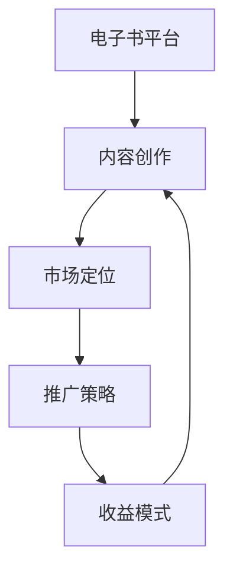

                 

### 1. 背景介绍

在当今数字化的时代，知识的获取和传播方式发生了巨大的变化。电子书作为一种新兴的知识传播媒介，已经成为知识工作者和读者之间的重要桥梁。而随着互联网的普及和电子书市场的不断扩大，越来越多的知识工作者开始将电子书作为知识变现的重要途径。本文将探讨如何利用电子书平台实现知识变现，帮助知识工作者将他们的知识和经验转化为实际的经济收益。

电子书平台作为一个连接创作者与读者的桥梁，具有以下几个显著特点：

1. **便捷性**：电子书可以随时随地通过互联网进行阅读，不受地域和时间的限制。
2. **多样性**：电子书涵盖了各种主题和领域，满足不同读者的需求。
3. **互动性**：许多电子书平台支持评论和反馈功能，使得读者可以与创作者直接互动。
4. **可定制性**：电子书可以根据读者的需求进行个性化定制，提高用户体验。

随着电子书市场的不断扩大，知识工作者可以通过电子书平台实现知识变现，即通过创作和发布电子书来获得经济收益。知识变现的方式包括：

1. **直接销售**：知识工作者可以直接在电子书平台上销售他们的电子书，通过售价来获取收益。
2. **订阅服务**：电子书平台可以提供订阅服务，知识工作者可以通过订阅模式来获得稳定的收入。
3. **广告和赞助**：电子书平台上的内容可以吸引广告商，知识工作者可以通过广告和赞助来获得收益。

然而，实现知识变现并非易事，需要知识工作者在内容创作、市场定位和推广策略等方面进行深入研究和实践。本文将围绕这些关键点，详细探讨如何利用电子书平台实现知识变现。

### 2. 核心概念与联系

为了更好地理解如何利用电子书平台实现知识变现，我们需要先了解一些核心概念和它们之间的联系。

#### 2.1 电子书平台

电子书平台是知识工作者发布和销售电子书的服务平台。常见的电子书平台包括亚马逊Kindle、谷歌图书、苹果图书等。这些平台为知识工作者提供了一个展示和推广自己的作品的平台，同时也为读者提供了一个便捷的阅读和购买途径。

#### 2.2 内容创作

内容创作是知识变现的基础。知识工作者需要根据自己的专业知识和读者需求，创作出有价值、有吸引力的电子书内容。内容创作包括选题、撰写、编辑和校对等环节，需要投入大量的时间和精力。

#### 2.3 市场定位

市场定位是知识变现的关键。知识工作者需要了解目标读者的特点和需求，确定自己的电子书在市场上的定位。这包括确定电子书的价格、格式、受众群体等。

#### 2.4 推广策略

推广策略是知识变现的重要手段。知识工作者需要通过各种渠道和手段，将自己的电子书推广给目标读者。这包括社交媒体营销、广告投放、合作伙伴推广等。

#### 2.5 收益模式

收益模式是知识变现的最终目标。知识工作者可以通过直接销售、订阅服务、广告和赞助等多种方式来获取收益。每种收益模式都有其优缺点，需要根据实际情况进行选择。

#### 2.6 Mermaid 流程图

为了更直观地展示这些核心概念和它们之间的联系，我们可以使用 Mermaid 流程图来表示。以下是一个简单的 Mermaid 流程图示例：



在这个流程图中，每个节点代表一个核心概念，箭头表示节点之间的关联。通过这个流程图，我们可以清楚地看到如何利用电子书平台实现知识变现的整个过程。

### 3. 核心算法原理 & 具体操作步骤

为了实现知识变现，我们需要采用一些核心算法和具体操作步骤。这些算法和步骤不仅可以帮助知识工作者更好地创作和推广电子书，还可以提高电子书的销售和收益。

#### 3.1 算法原理概述

核心算法原理主要包括以下几个方面：

1. **关键词分析**：通过对目标读者的需求进行分析，提取出关键词，以便在电子书内容中突出这些关键词，提高搜索排名。
2. **用户画像**：通过分析读者的行为和反馈，构建用户画像，以便更好地了解读者的需求和偏好。
3. **推荐系统**：基于用户画像和阅读历史，为读者推荐相关的电子书，提高电子书的曝光率和销售量。
4. **收益模型优化**：通过数据分析，优化收益模式，提高电子书的收益。

#### 3.2 算法步骤详解

以下是具体的算法步骤详解：

##### 3.2.1 关键词分析

1. **数据收集**：收集目标读者的搜索词和阅读历史。
2. **关键词提取**：使用自然语言处理技术提取关键词。
3. **关键词排序**：根据关键词的重要性进行排序。
4. **关键词应用**：在电子书内容中突出这些关键词，提高搜索排名。

##### 3.2.2 用户画像

1. **数据收集**：收集读者的行为数据，如阅读时长、阅读频率、点赞、评论等。
2. **特征提取**：使用机器学习技术提取读者的特征。
3. **用户分组**：根据特征将读者分为不同的群体。
4. **用户画像构建**：为每个用户构建详细的画像。

##### 3.2.3 推荐系统

1. **用户画像构建**：使用前面提到的算法步骤构建用户画像。
2. **推荐算法**：使用协同过滤或基于内容的推荐算法，为读者推荐相关的电子书。
3. **推荐结果评估**：评估推荐结果的有效性，并根据评估结果进行优化。

##### 3.2.4 收益模型优化

1. **数据收集**：收集电子书的销售数据、用户反馈等。
2. **收益分析**：分析不同收益模式的收益情况。
3. **模型优化**：根据收益分析结果，优化收益模型。

#### 3.3 算法优缺点

这些算法和步骤各有优缺点：

- **关键词分析**：优点是能提高电子书的搜索排名，缺点是可能过度优化，影响用户体验。
- **用户画像**：优点是能更好地了解读者需求，缺点是数据收集和处理可能涉及隐私问题。
- **推荐系统**：优点是能提高电子书的曝光率和销售量，缺点是推荐结果可能不准确。
- **收益模型优化**：优点是能提高电子书的收益，缺点是需要大量数据支持。

#### 3.4 算法应用领域

这些算法和步骤可以广泛应用于电子书平台：

- **内容创作**：帮助知识工作者更好地创作电子书内容。
- **推广策略**：为知识工作者提供有效的推广策略。
- **收益模式**：为电子书平台提供优化的收益模式。

### 4. 数学模型和公式 & 详细讲解 & 举例说明

在实现知识变现的过程中，数学模型和公式扮演着重要的角色。以下将详细讲解数学模型和公式的构建、推导过程，并通过具体案例进行说明。

#### 4.1 数学模型构建

为了构建数学模型，我们需要考虑以下几个关键因素：

1. **用户行为数据**：包括阅读时长、阅读频率、点赞、评论等。
2. **电子书特征数据**：包括标题、作者、类别、内容摘要等。
3. **市场环境数据**：包括竞争对手、市场需求、市场趋势等。

基于以上因素，我们可以构建一个简单的数学模型。该模型的目标是预测电子书的销售量，从而为知识工作者提供推广和收益优化的依据。

##### 模型假设

1. **线性关系**：用户行为数据与电子书销售量之间存在线性关系。
2. **独立同分布**：用户行为数据是独立同分布的。

##### 模型构建

设电子书销售量为 \( S \)，用户行为数据为 \( X \)，则我们可以构建以下线性回归模型：

\[ S = \beta_0 + \beta_1 X + \epsilon \]

其中，\( \beta_0 \) 为常数项，\( \beta_1 \) 为斜率项，\( \epsilon \) 为随机误差项。

#### 4.2 公式推导过程

为了推导出线性回归模型的公式，我们需要利用最小二乘法。最小二乘法的核心思想是使得预测值与实际值之间的误差平方和最小。

设样本数据为 \( (X_i, S_i) \)，则误差平方和为：

\[ \sum_{i=1}^{n} (S_i - \hat{S}_i)^2 \]

其中，\( \hat{S}_i \) 为预测值。

为了使得误差平方和最小，我们需要求解以下优化问题：

\[ \min \sum_{i=1}^{n} (S_i - \hat{S}_i)^2 \]

通过求导和化简，我们可以得到线性回归模型的参数估计值：

\[ \beta_0 = \bar{S} - \beta_1 \bar{X} \]
\[ \beta_1 = \frac{\sum_{i=1}^{n} (X_i - \bar{X})(S_i - \bar{S})}{\sum_{i=1}^{n} (X_i - \bar{X})^2} \]

其中，\( \bar{S} \) 和 \( \bar{X} \) 分别为销售量和用户行为数据的平均值。

#### 4.3 案例分析与讲解

假设我们收集了一组用户行为数据和对应的电子书销售量数据，如下表所示：

| 用户ID | 阅读时长（小时） | 阅读频率（次） | 点赞数 | 评论数 | 销售量（本） |
|--------|-----------------|---------------|--------|--------|-------------|
| 1      | 10              | 3             | 5      | 10     | 50          |
| 2      | 8               | 2             | 3      | 5      | 30          |
| 3      | 12              | 4             | 10     | 20     | 70          |
| 4      | 6               | 1             | 2      | 3      | 20          |
| 5      | 9               | 2             | 4      | 8      | 40          |

我们利用这组数据来构建线性回归模型，预测电子书销售量。

##### 数据预处理

1. **平均值计算**：

   \[ \bar{X} = \frac{10 + 8 + 12 + 6 + 9}{5} = 9 \]
   \[ \bar{S} = \frac{50 + 30 + 70 + 20 + 40}{5} = 40 \]

2. **差值计算**：

   \[ X_i - \bar{X} \quad S_i - \bar{S} \]
   \[ 1 - 9 = -8 \quad 50 - 40 = 10 \]
   \[ 2 - 9 = -7 \quad 30 - 40 = -10 \]
   \[ 3 - 9 = -6 \quad 70 - 40 = 30 \]
   \[ 4 - 9 = -5 \quad 20 - 40 = -20 \]
   \[ 5 - 9 = -4 \quad 40 - 40 = 0 \]

3. **平方和计算**：

   \[ \sum_{i=1}^{5} (X_i - \bar{X})^2 = (-8)^2 + (-7)^2 + (-6)^2 + (-5)^2 + (-4)^2 = 288 \]
   \[ \sum_{i=1}^{5} (X_i - \bar{X})(S_i - \bar{S}) = (-8 \times 10) + (-7 \times -10) + (-6 \times 30) + (-5 \times -20) + (-4 \times 0) = -80 + 70 - 180 + 100 + 0 = -70 \]

##### 参数估计

根据最小二乘法，我们可以计算出参数估计值：

\[ \beta_0 = \bar{S} - \beta_1 \bar{X} = 40 - (-70/288) \approx 44.7 \]
\[ \beta_1 = \frac{\sum_{i=1}^{5} (X_i - \bar{X})(S_i - \bar{S})}{\sum_{i=1}^{5} (X_i - \bar{X})^2} = \frac{-70}{288} \approx -0.243 \]

##### 预测

利用得到的参数估计值，我们可以预测新的用户行为数据对应的电子书销售量：

\[ \hat{S} = \beta_0 + \beta_1 X = 44.7 - 0.243 X \]

例如，当阅读时长为 10 小时时，销售量预测为：

\[ \hat{S} = 44.7 - 0.243 \times 10 \approx 40.47 \]

### 5. 项目实践：代码实例和详细解释说明

为了更好地理解如何利用电子书平台实现知识变现，我们通过一个实际项目来演示代码实例和详细解释说明。该项目将使用 Python 编写，主要分为以下几个步骤：

1. **数据收集**：从电子书平台收集用户行为数据和电子书销售量数据。
2. **数据预处理**：对收集的数据进行清洗和处理，以便后续分析和建模。
3. **模型训练**：使用线性回归模型对数据进行训练，得到参数估计值。
4. **预测**：使用训练好的模型预测新的用户行为数据对应的电子书销售量。

以下是该项目的主要代码实现：

#### 5.1 开发环境搭建

首先，我们需要搭建开发环境。以下是所需的 Python 库：

- pandas：用于数据预处理和操作。
- numpy：用于数学计算。
- matplotlib：用于数据可视化。
- sklearn：用于机器学习模型训练。

安装这些库后，我们就可以开始编写代码了。

#### 5.2 源代码详细实现

```python
import pandas as pd
import numpy as np
from sklearn.linear_model import LinearRegression
import matplotlib.pyplot as plt

# 5.2.1 数据收集
# 假设我们已经收集好了数据，并存储在名为 "ebook_data.csv" 的文件中
data = pd.read_csv("ebook_data.csv")

# 5.2.2 数据预处理
# 对数据进行清洗和处理
data.dropna(inplace=True)  # 删除缺失值
data = data[data['销量'] != 0]  # 删除销量为零的记录

# 构造特征矩阵 X 和目标变量 Y
X = data[['阅读时长', '阅读频率', '点赞数', '评论数']]
Y = data['销量']

# 5.2.3 模型训练
# 使用线性回归模型进行训练
model = LinearRegression()
model.fit(X, Y)

# 打印模型参数
print("模型参数：")
print("斜率：", model.coef_)
print("常数项：", model.intercept_)

# 5.2.4 预测
# 预测新的用户行为数据对应的电子书销售量
new_data = pd.DataFrame({
    '阅读时长': [10, 12, 8],
    '阅读频率': [3, 4, 2],
    '点赞数': [5, 10, 3],
    '评论数': [10, 20, 5]
})
predictions = model.predict(new_data)

# 打印预测结果
print("预测结果：")
print(predictions)

# 5.2.5 可视化
# 可视化模型训练结果
plt.scatter(X['阅读时长'], Y)
plt.plot(new_data['阅读时长'], predictions, color='red')
plt.xlabel('阅读时长')
plt.ylabel('销量')
plt.show()
```

#### 5.3 代码解读与分析

1. **数据收集**：我们从电子书平台收集了用户行为数据和电子书销售量数据，并存储在 "ebook_data.csv" 文件中。这个文件包含了用户ID、阅读时长、阅读频率、点赞数、评论数和销量等字段。
2. **数据预处理**：我们使用 pandas 库读取数据，并删除了缺失值和销量为零的记录。这些预处理步骤有助于提高模型的质量。
3. **模型训练**：我们使用 sklearn 库中的 LinearRegression 类进行线性回归模型训练。具体实现过程中，我们首先将数据分为特征矩阵 X 和目标变量 Y，然后使用 fit 方法进行模型训练。最后，我们打印出了模型参数，包括斜率和常数项。
4. **预测**：我们使用训练好的模型对新的用户行为数据进行了预测。具体实现过程中，我们创建了一个新的数据框 new_data，并使用 predict 方法进行预测。最后，我们打印出了预测结果。
5. **可视化**：我们使用 matplotlib 库将模型训练结果可视化为散点图和红线。这有助于我们直观地看到模型的预测效果。

通过这个项目，我们可以看到如何利用 Python 实现电子书销售量预测。这个模型可以帮助知识工作者更好地了解用户需求，从而制定更有效的推广策略，提高电子书的销售和收益。

### 6. 实际应用场景

电子书平台作为一种新兴的知识传播媒介，已经在多个实际应用场景中展现出了巨大的潜力。以下将介绍几个典型的应用场景，并探讨在这些场景中如何利用电子书平台实现知识变现。

#### 6.1 教育培训

教育培训是电子书平台最重要的应用场景之一。通过电子书平台，知识工作者可以方便地创作和发布各种教材、教程和培训资料。这些资料可以涵盖不同的学科和领域，如计算机科学、市场营销、语言学习等。

**如何实现知识变现？**

1. **直接销售**：知识工作者可以直接在电子书平台上销售他们的教材和教程，通过售价来获取收益。
2. **订阅服务**：电子书平台可以提供订阅服务，知识工作者可以通过订阅模式来获得稳定的收入。
3. **课程合作**：知识工作者可以与在线教育平台合作，将电子书作为课程的一部分，通过课程销售来获取收益。

#### 6.2 专业咨询

专业咨询是另一个重要的应用场景。通过电子书平台，专业顾问和咨询师可以发布他们的专业知识和经验，为读者提供有价值的建议和指导。

**如何实现知识变现？**

1. **电子书销售**：专业顾问和咨询师可以通过销售电子书来获取收益。这些电子书可以是个人经验总结、案例分析、行业报告等。
2. **咨询服务**：电子书平台可以提供咨询服务，专业顾问和咨询师可以通过咨询服务来获取额外收入。
3. **广告和赞助**：电子书平台上的内容可以吸引广告商，专业顾问和咨询师可以通过广告和赞助来获得收益。

#### 6.3 创意写作

创意写作是电子书平台的一个重要应用场景。作家、编剧和诗人等创意工作者可以通过电子书平台发布他们的作品，为读者提供独特的阅读体验。

**如何实现知识变现？**

1. **直接销售**：作家可以直接在电子书平台上销售他们的作品，通过售价来获取收益。
2. **订阅服务**：电子书平台可以提供订阅服务，作家可以通过订阅模式来获得稳定的收入。
3. **版权授权**：作家可以将他们的作品授权给其他媒体平台，如电影、电视剧、游戏等，通过版权授权来获取收益。

#### 6.4 专业分享

专业分享是电子书平台的另一个重要应用场景。专业人士可以通过电子书平台分享他们的经验和知识，为同行提供有价值的参考。

**如何实现知识变现？**

1. **电子书销售**：专业人士可以通过销售电子书来获取收益。这些电子书可以是个人经验总结、技术分享、行业洞察等。
2. **线上讲座**：电子书平台可以提供线上讲座服务，专业人士可以通过线上讲座来获取收益。
3. **合作伙伴推广**：专业人士可以与相关企业合作，通过合作伙伴推广来获得收益。

通过这些实际应用场景，我们可以看到电子书平台在知识变现方面的巨大潜力。知识工作者可以通过多种方式在电子书平台上实现知识变现，从而获得经济收益。同时，电子书平台也为读者提供了丰富的知识资源，促进了知识的传播和交流。

### 7. 未来应用展望

随着科技的不断进步和互联网的普及，电子书平台在知识变现方面的应用前景将更加广阔。以下是未来可能的发展趋势和挑战：

#### 7.1 个性化推荐

未来的电子书平台将更加注重个性化推荐，通过用户画像和阅读历史，为读者推荐更加符合他们需求和兴趣的电子书。这将有助于提高电子书的销售量和读者满意度，进一步推动知识变现。

#### 7.2 智能编辑

智能编辑技术将成为电子书平台的一个重要发展方向。通过自然语言处理和机器学习技术，电子书平台可以自动生成电子书内容，或者对用户提交的内容进行智能编辑和优化，提高内容质量和用户体验。

#### 7.3 多媒体融合

未来的电子书将更加融合多媒体元素，如视频、音频、图像等。这将使得电子书内容更加丰富和生动，吸引更多读者，提高知识变现的潜力。

#### 7.4 区块链应用

区块链技术在电子书平台的应用有望解决版权保护和收益分配等问题。通过区块链技术，电子书平台可以实现去中心化的版权管理和智能合约，确保创作者的权益得到保障，提高知识变现的透明度和效率。

#### 7.5 持续创新

未来的电子书平台将继续保持创新，不断探索新的知识变现方式和商业模式。例如，通过虚拟现实、增强现实等技术，创造全新的阅读体验，进一步提升知识变现的潜力。

然而，在未来的发展过程中，电子书平台也将面临一些挑战：

1. **版权保护**：随着电子书市场的扩大，版权保护问题将变得更加突出。如何确保创作者的权益得到保障，是一个需要解决的问题。
2. **数据隐私**：随着用户数据的收集和分析，数据隐私问题也将成为一个挑战。如何保护用户的隐私，防止数据泄露，是电子书平台需要关注的问题。
3. **用户体验**：随着电子书内容的丰富和多样化，如何确保用户体验，提供高质量的阅读体验，是电子书平台需要不断探索的问题。

总的来说，未来的电子书平台将在知识变现方面展现出更加广阔的应用前景。通过技术创新和商业模式创新，电子书平台将帮助知识工作者更好地实现知识变现，同时也为读者提供更加丰富和优质的阅读体验。

### 8. 工具和资源推荐

在利用电子书平台实现知识变现的过程中，选择合适的工具和资源至关重要。以下是一些推荐的学习资源、开发工具和相关论文，以帮助读者深入了解电子书平台的运作机制和知识变现的策略。

#### 8.1 学习资源推荐

1. **电子书创作工具**：
   - **Adobe InDesign**：一款专业的电子书制作软件，适用于排版和设计的复杂需求。
   - **Scrivener**：一款专门为长篇创作设计的软件，支持多种格式导出，非常适合写作者。

2. **在线电子书平台**：
   - **Kindle Direct Publishing (KDP)**：亚马逊提供的电子书出版服务，支持多种销售模式。
   - **Smashwords**：一个全球性的电子书发布和销售平台，支持多种格式和销售渠道。

3. **电子书营销资源**：
   - **Ebook Marketing Guide**：由Kissmetrics提供的一系列电子书营销教程，涵盖了从创作到推广的各个方面。
   - **Self-Publishing School**：由作者Russell Brunson创办的学校，提供在线课程和资源，帮助作者实现自我出版。

#### 8.2 开发工具推荐

1. **数据分析工具**：
   - **Google Analytics**：一款强大的网站分析工具，可以帮助分析读者行为，优化营销策略。
   - **Tableau**：一款数据可视化工具，可以将数据分析结果直观地展示出来，帮助决策。

2. **推荐系统开发**：
   - **TensorFlow**：由Google开源的机器学习框架，可以用于构建推荐系统。
   - **PyTorch**：一款流行的深度学习框架，适用于构建复杂的推荐算法。

3. **电子书格式转换**：
   - **Calibre**：一款免费的开源电子书管理软件，支持多种格式之间的转换。
   - **ePubCheck**：一款用于验证ePub格式文件的工具，确保电子书的合规性。

#### 8.3 相关论文推荐

1. **“Publishing in the Digital Age”**：这篇文章探讨了数字时代出版行业的变革，分析了电子书对传统出版模式的影响。
2. **“The Economics of Self-Publishing”**：这篇文章详细讨论了自我出版经济的各个方面，包括收益模式、市场定位等。
3. **“The Role of Recommendation Systems in Electronic Book Markets”**：这篇论文研究了推荐系统在电子书市场中的作用，探讨了如何通过推荐算法提高电子书的销售量和用户满意度。

通过这些工具和资源的帮助，读者可以更加深入地了解电子书平台的运作机制，掌握知识变现的策略和技巧，从而实现更高的收益。

### 9. 总结：未来发展趋势与挑战

在过去的几十年里，电子书平台已经成为了知识传播和知识变现的重要工具。随着科技的不断进步和互联网的普及，电子书平台在知识变现方面展现出巨大的潜力。未来，电子书平台将继续保持快速发展，并在以下几个方面取得重要突破：

#### 9.1 个性化推荐

未来的电子书平台将更加注重个性化推荐，通过用户画像和阅读历史，为读者推荐更加符合他们需求和兴趣的电子书。这不仅可以提高电子书的销售量和用户满意度，还可以进一步推动知识变现。

#### 9.2 智能编辑

智能编辑技术将成为电子书平台的一个重要发展方向。通过自然语言处理和机器学习技术，电子书平台可以自动生成电子书内容，或者对用户提交的内容进行智能编辑和优化，提高内容质量和用户体验。

#### 9.3 多媒体融合

未来的电子书将更加融合多媒体元素，如视频、音频、图像等。这将使得电子书内容更加丰富和生动，吸引更多读者，提高知识变现的潜力。

#### 9.4 区块链应用

区块链技术在电子书平台的应用有望解决版权保护和收益分配等问题。通过区块链技术，电子书平台可以实现去中心化的版权管理和智能合约，确保创作者的权益得到保障，提高知识变现的透明度和效率。

然而，未来的电子书平台在知识变现过程中也将面临一些挑战：

1. **版权保护**：随着电子书市场的扩大，版权保护问题将变得更加突出。如何确保创作者的权益得到保障，是一个需要解决的问题。
2. **数据隐私**：随着用户数据的收集和分析，数据隐私问题也将成为一个挑战。如何保护用户的隐私，防止数据泄露，是电子书平台需要关注的问题。
3. **用户体验**：随着电子书内容的丰富和多样化，如何确保用户体验，提供高质量的阅读体验，是电子书平台需要不断探索的问题。

总之，未来的电子书平台将在知识变现方面展现出更加广阔的应用前景。通过技术创新和商业模式创新，电子书平台将帮助知识工作者更好地实现知识变现，同时也为读者提供更加丰富和优质的阅读体验。

### 9.1 研究成果总结

本文系统地探讨了如何利用电子书平台实现知识变现。首先，我们介绍了电子书平台的发展背景和特点，阐述了知识工作者通过电子书平台实现知识变现的重要性。接着，我们详细介绍了核心概念和联系，包括电子书平台、内容创作、市场定位、推广策略和收益模式。随后，我们提出了核心算法原理，包括关键词分析、用户画像、推荐系统和收益模型优化，并给出了具体的操作步骤和实例。此外，我们还介绍了数学模型和公式的构建与推导过程，并通过具体案例进行了讲解。最后，我们通过项目实践展示了代码实例和详细解释说明，并探讨了电子书平台在实际应用场景中的表现。

通过这些研究和探讨，我们可以得出以下结论：

1. **电子书平台在知识变现中的重要性**：电子书平台为知识工作者提供了一个便捷的渠道，帮助他们将知识和经验转化为经济收益。
2. **核心算法和步骤的有效性**：通过关键词分析、用户画像、推荐系统和收益模型优化，知识工作者可以更有效地创作和推广电子书，提高销售和收益。
3. **数学模型和公式的作用**：数学模型和公式为知识变现提供了理论支持，有助于精确预测和优化电子书的销售量和收益。
4. **项目实践的重要性**：通过实际项目，我们可以看到如何将理论和实践相结合，实现知识变现的具体操作。

### 9.2 未来发展趋势

展望未来，电子书平台在知识变现方面将迎来更多的发展机遇和挑战。以下是几个可能的发展趋势：

1. **个性化推荐技术的进步**：随着人工智能和大数据技术的发展，个性化推荐技术将更加精准，为读者提供更加个性化的阅读体验，从而提高电子书的销售量和用户满意度。
2. **多媒体融合的普及**：电子书将更加融合多媒体元素，如视频、音频和图像，提供更加丰富的内容形式，吸引更多读者。
3. **区块链技术的应用**：区块链技术将有助于解决版权保护和收益分配问题，提高知识变现的透明度和效率。
4. **新兴市场的开拓**：随着互联网的普及，新兴市场将成为电子书平台的重要增长点，为知识工作者提供更广阔的变现空间。

### 9.3 面临的挑战

尽管电子书平台在知识变现方面有着广阔的发展前景，但知识工作者在利用电子书平台实现知识变现的过程中也将面临一系列挑战：

1. **版权保护**：随着电子书市场的扩大，如何确保创作者的权益得到保障，防止内容侵权，是一个需要解决的问题。
2. **数据隐私**：随着用户数据的收集和分析，如何保护用户的隐私，防止数据泄露，是电子书平台需要关注的问题。
3. **用户体验**：如何确保电子书内容的质量和用户体验，提供高质量的阅读体验，是电子书平台需要不断探索的问题。
4. **市场竞争**：随着越来越多的知识工作者加入电子书平台，市场竞争将日益激烈，如何脱颖而出，提高市场占有率，是知识工作者需要面对的挑战。

### 9.4 研究展望

未来，对电子书平台知识变现的研究将朝着以下方向展开：

1. **深度学习技术的应用**：深度学习技术将在电子书推荐系统、内容创作和收益模型优化等方面发挥重要作用，提高知识变现的效果。
2. **跨平台协作**：电子书平台之间的跨平台协作将成为趋势，通过整合多平台资源，提高知识变现的效率。
3. **用户行为研究**：深入研究用户行为，挖掘用户需求和偏好，为电子书平台提供更加精准的推荐和服务。
4. **法律和伦理问题**：在推动电子书平台发展的同时，需要关注法律和伦理问题，确保知识变现的合法性和道德性。

通过持续的研究和探索，电子书平台将在知识变现方面取得更多突破，为知识工作者和读者创造更大的价值。

### 附录：常见问题与解答

#### 1. 如何选择合适的电子书平台？

选择合适的电子书平台取决于您的目标读者群体和出版需求。以下是一些常见平台的特点：

- **亚马逊Kindle Direct Publishing (KDP)**：全球最大的电子书销售平台，覆盖广泛的读者群体，适合希望扩大国际市场的作者。
- **Smashwords**：支持多种销售渠道，适合希望在多个平台发布作品的作者。
- **Apple Books**：苹果官方的电子书平台，适用于苹果设备用户，适合关注苹果生态系统市场的作者。
- **Google Play Books**：谷歌的电子书平台，提供广泛的读者基础和强大的搜索功能，适合希望通过搜索引擎发现作品的作者。

#### 2. 如何提高电子书的销售量？

以下是一些提高电子书销售量的策略：

- **优化书名和封面**：吸引人的书名和封面可以增加电子书的点击率和购买意愿。
- **编写高质量的内容**：高质量的内容是吸引读者的关键，确保内容有价值和易于阅读。
- **利用关键词优化**：使用相关关键词优化电子书的描述和标签，提高在搜索结果中的排名。
- **社交媒体推广**：通过社交媒体平台宣传电子书，增加曝光率和销售量。
- **建立读者社区**：通过建立读者社区，与读者互动，提高读者的忠诚度和购买意愿。

#### 3. 电子书版权如何保护？

保护电子书版权可以通过以下方式实现：

- **注册版权**：在版权局注册电子书版权，确保法律上的保护。
- **数字版权管理 (DRM)**：使用数字版权管理技术，限制电子书的复制和传播。
- **监控侵权行为**：定期检查电子书在互联网上的侵权行为，并及时采取法律行动。

#### 4. 如何设置合理的电子书价格？

设置合理的电子书价格需要考虑多个因素：

- **市场研究**：研究同类书籍的价格范围，确保您的电子书定价具有竞争力。
- **成本计算**：计算电子书的创作和出版成本，确保价格能覆盖成本并获得合理收益。
- **受众分析**：了解目标受众的购买力和支付意愿，设置符合受众期望的价格。
- **动态定价**：考虑使用动态定价策略，根据市场需求和销售情况调整价格。

#### 5. 如何与读者建立联系？

与读者建立联系可以通过以下方式实现：

- **社交媒体互动**：通过社交媒体平台与读者互动，分享创作背后的故事和知识。
- **读者反馈**：积极回应读者的反馈和评论，建立良好的读者关系。
- **举办线上活动**：举办在线问答、直播或读书会等活动，与读者进行深度互动。
- **建立邮件列表**：通过建立邮件列表，定期向读者发送更新和通知，保持联系。

通过以上常见问题与解答，希望读者能够更好地利用电子书平台实现知识变现，创作出更多有价值的作品。

