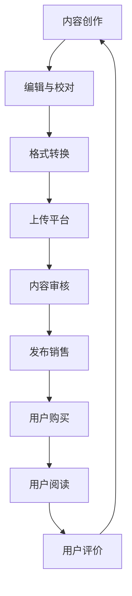

                 

随着互联网的迅猛发展和数字化进程的推进，知识付费逐渐成为一种新的商业模式。电子书作为一种便捷的知识传播媒介，成为知识付费的重要载体。本文将探讨如何利用电子书形式进行知识付费，包括其背景介绍、核心概念与联系、核心算法原理与操作步骤、数学模型和公式、项目实践、实际应用场景、未来应用展望、工具和资源推荐以及总结与展望。

## 1. 背景介绍

知识付费，即用户为获取特定知识或服务而支付的费用，这一模式在近年来得到了广泛的关注和推广。电子书作为一种新兴的知识传播形式，凭借其便捷性、便携性和可复制性，逐渐成为知识付费的重要媒介。电子书不仅为知识传播提供了新的渠道，也为知识付费模式带来了新的机遇。

知识付费的发展历程可以追溯到互联网的兴起。早期的知识传播主要依赖于传统媒体，如报纸、杂志和电视等。随着互联网技术的发展，特别是移动互联网的普及，知识传播的形式发生了巨大的变革。电子书作为数字出版的一种形式，开始逐渐崭露头角。

电子书市场的快速增长为知识付费提供了广阔的空间。根据市场研究机构的报告，全球电子书市场在过去几年中一直保持着两位数的增长率。其中，中国电子书市场发展迅速，用户规模逐年扩大，市场规模持续增长。

知识付费与电子书市场的融合，不仅为知识传播提供了新的途径，也为知识创造者提供了新的收入来源。知识付费模式的兴起，使得知识创造者可以通过电子书的形式，将自己的知识变现，实现知识的价值最大化。

## 2. 核心概念与联系

要深入探讨如何利用电子书形式进行知识付费，我们首先需要了解相关的核心概念。以下是几个关键概念：

### 2.1 电子书

电子书，是指通过电子方式存储、传播和阅读的书籍。与传统纸质书相比，电子书具有存储量大、携带方便、易于检索和复制等优点。随着阅读设备的普及，如智能手机、平板电脑和电子阅读器等，电子书的阅读体验也得到了极大的提升。

### 2.2 知识付费

知识付费，是指用户为获取特定知识或服务而支付的费用。这种模式强调知识的价值，鼓励知识创造者通过付费方式实现知识的传播和价值的转化。

### 2.3 电子书平台

电子书平台，是指提供电子书制作、发布、销售和阅读服务的在线平台。如亚马逊Kindle、多看阅读、掌阅等。电子书平台为知识创造者和用户提供了一个便捷的互动平台，促进了知识的传播和付费模式的实现。

### 2.4 用户行为分析

用户行为分析，是指通过分析用户的阅读行为，如阅读时间、阅读频率、阅读习惯等，来了解用户的需求和偏好。这种分析有助于电子书平台优化服务，提高用户体验，同时为知识创造者提供有价值的参考。

### 2.5 内容版权保护

内容版权保护，是指为了防止电子书内容的非法复制、传播和使用，采取的一系列技术和管理措施。如数字版权管理（DRM）技术，通过对电子书内容进行加密和授权，确保知识创造者的权益得到保护。

### 2.6 Mermaid 流程图

以下是一个简化的电子书知识付费流程的Mermaid流程图，展示了从内容创作到用户支付的各个环节。



### 2.7 核心概念联系

电子书知识付费的核心概念之间存在着密切的联系。电子书作为知识付费的载体，需要通过电子书平台进行传播和销售。用户行为分析有助于平台了解用户需求，优化服务。内容版权保护则确保了知识创造者的权益。这些核心概念共同构成了电子书知识付费的生态系统。

## 3. 核心算法原理 & 具体操作步骤

### 3.1 算法原理概述

在电子书知识付费领域，核心算法主要涉及用户行为分析和推荐算法。这些算法通过分析用户的阅读行为，为用户提供个性化的推荐，从而提高用户的满意度和购买转化率。

用户行为分析算法主要基于机器学习和数据挖掘技术，通过对用户的历史阅读数据进行分析，提取出用户偏好和兴趣点。常见的用户行为分析算法包括协同过滤、基于内容的推荐和混合推荐算法等。

推荐算法则是基于用户行为分析的结果，为用户推荐可能感兴趣的知识内容。推荐算法的目标是提高推荐的准确性，增加用户对推荐内容的兴趣和满意度。常见的推荐算法包括基于模型的推荐、基于规则的推荐和协同过滤推荐等。

### 3.2 算法步骤详解

以下是用户行为分析和推荐算法的具体操作步骤：

#### 3.2.1 用户行为数据收集

首先，收集用户的阅读数据，包括阅读时间、阅读频率、阅读内容等。这些数据可以通过电子书平台的后台系统获取。

#### 3.2.2 用户行为数据预处理

对收集到的用户行为数据进行清洗和预处理，包括去除重复数据、处理缺失值、数据格式统一等。

#### 3.2.3 用户行为特征提取

基于预处理后的数据，提取用户的阅读行为特征，如阅读时长、阅读频率、阅读内容类别等。

#### 3.2.4 用户行为分析

使用机器学习和数据挖掘技术，对用户行为特征进行分析，提取用户偏好和兴趣点。

#### 3.2.5 推荐算法模型训练

基于用户行为分析结果，训练推荐算法模型。常用的推荐算法模型包括协同过滤模型、基于内容的推荐模型和混合推荐模型等。

#### 3.2.6 推荐结果生成

使用训练好的推荐算法模型，为用户生成个性化的推荐结果。推荐结果可以包括推荐内容列表、推荐内容详情等。

#### 3.2.7 用户反馈与模型优化

收集用户对推荐结果的反馈，对推荐算法模型进行优化，以提高推荐的准确性。

### 3.3 算法优缺点

用户行为分析和推荐算法具有以下优缺点：

#### 优点

- **个性化推荐**：根据用户行为分析结果，为用户推荐可能感兴趣的知识内容，提高用户满意度。
- **提高转化率**：通过精准的推荐，提高用户购买知识内容的概率，增加平台收入。
- **优化用户体验**：提供个性化的阅读推荐，提高用户在电子书平台的活跃度和粘性。

#### 缺点

- **数据隐私风险**：用户行为分析涉及用户隐私数据，可能引发数据隐私问题。
- **计算成本高**：用户行为分析和推荐算法需要大量的计算资源，对平台性能有一定要求。
- **推荐准确性问题**：虽然推荐算法可以提高推荐的准确性，但仍可能存在推荐偏差和错误推荐的问题。

### 3.4 算法应用领域

用户行为分析和推荐算法在电子书知识付费领域有广泛的应用。以下是一些主要的应用领域：

- **个性化推荐**：通过用户行为分析，为用户推荐个性化的电子书内容，提高用户购买意愿。
- **内容营销**：基于用户行为分析，制定针对性的内容营销策略，提高内容传播效果。
- **用户运营**：通过用户行为分析，了解用户需求，优化用户运营策略，提高用户留存率。
- **数据驱动决策**：利用用户行为分析结果，为平台运营和决策提供数据支持，提高运营效率。

## 4. 数学模型和公式 & 详细讲解 & 举例说明

### 4.1 数学模型构建

在电子书知识付费领域，常见的数学模型包括用户行为分析模型和推荐算法模型。以下是这些模型的构建过程：

#### 4.1.1 用户行为分析模型

用户行为分析模型主要用于分析用户的阅读行为，提取用户偏好和兴趣点。该模型可以基于以下公式：

$$
User\_Behavior = f(User\_Features, Content\_Features)
$$

其中，$User\_Features$表示用户特征，如阅读时间、阅读频率等；$Content\_Features$表示内容特征，如书名、作者、分类等；$f$表示行为分析函数。

#### 4.1.2 推荐算法模型

推荐算法模型主要用于生成个性化的推荐结果。常见的推荐算法模型包括基于协同过滤的推荐模型和基于内容的推荐模型。以下是这些模型的构建过程：

1. **基于协同过滤的推荐模型**

基于协同过滤的推荐模型通过分析用户之间的相似度，为用户推荐相似用户喜欢的知识内容。该模型可以基于以下公式：

$$
Recommendations = \sum_{i \in Neighbors(u)} w_{ui} C_{i,j}
$$

其中，$Neighbors(u)$表示用户$u$的邻居用户集；$w_{ui}$表示用户$u$和邻居用户$i$之间的权重；$C_{i,j}$表示邻居用户$i$对知识内容$j$的评价。

2. **基于内容的推荐模型**

基于内容的推荐模型通过分析知识内容之间的相似度，为用户推荐相似的知识内容。该模型可以基于以下公式：

$$
Recommendations = \sum_{j \in Content\_Neighbors(c)} w_{c,j} C_{j,u}
$$

其中，$Content\_Neighbors(c)$表示知识内容$c$的邻居内容集；$w_{c,j}$表示知识内容$c$和邻居内容$j$之间的权重；$C_{j,u}$表示用户$u$对知识内容$j$的评价。

### 4.2 公式推导过程

以下是用户行为分析模型和推荐算法模型的推导过程：

#### 4.2.1 用户行为分析模型推导

假设用户$u$对知识内容$j$的评价为$R_{uj}$，用户特征向量为$U_u$，内容特征向量为$C_j$。用户行为分析模型可以表示为：

$$
R_{uj} = f(U_u, C_j)
$$

其中，$f$是一个非线性函数。为了简化模型，我们可以使用线性模型进行近似：

$$
R_{uj} = \theta_0 + \theta_1 U_{u\_i} + \theta_2 C_{j\_i}
$$

其中，$\theta_0$、$\theta_1$和$\theta_2$是模型参数。为了训练模型，我们需要使用有监督学习算法，如线性回归，来求解这些参数。

#### 4.2.2 推荐算法模型推导

1. **基于协同过滤的推荐模型推导**

基于协同过滤的推荐模型通过分析用户之间的相似度，为用户推荐相似用户喜欢的知识内容。我们可以使用用户-用户相似度矩阵$W$来表示用户之间的相似度：

$$
W_{ui} = \frac{R_{uj} - \mu_u - \mu_i + \mu}{\sqrt{(R_{uj} - \mu_u)^2 + (R_{ij} - \mu_i)^2}}
$$

其中，$R_{uj}$和$R_{ij}$分别表示用户$u$对知识内容$j$和用户$i$对知识内容$j$的评价；$\mu_u$和$\mu_i$分别表示用户$u$和用户$i$的平均评价；$\mu$表示所有评价的平均值。

基于协同过滤的推荐模型可以表示为：

$$
Recommendations = \sum_{i \in Neighbors(u)} w_{ui} R_{ij}
$$

其中，$Neighbors(u)$表示用户$u$的邻居用户集。

2. **基于内容的推荐模型推导**

基于内容的推荐模型通过分析知识内容之间的相似度，为用户推荐相似的知识内容。我们可以使用内容-内容相似度矩阵$C$来表示知识内容之间的相似度：

$$
C_{c,j} = \frac{R_{c\_j} - \mu_c + \mu}{\sqrt{(R_{c\_j} - \mu_c)^2 + (R_{c\_k} - \mu_c)^2}}
$$

其中，$R_{c\_j}$和$R_{c\_k}$分别表示知识内容$c$对知识内容$j$和知识内容$k$的评价；$\mu_c$表示所有评价的平均值。

基于内容的推荐模型可以表示为：

$$
Recommendations = \sum_{j \in Content\_Neighbors(c)} C_{c,j} R_{uj}
$$

其中，$Content\_Neighbors(c)$表示知识内容$c$的邻居内容集。

### 4.3 案例分析与讲解

为了更好地理解用户行为分析模型和推荐算法模型，我们来看一个实际案例。

假设有一个电子书平台，用户A在一个月内阅读了三本书：《Python编程入门》、《深度学习基础》和《数据分析实战》。根据用户A的阅读记录，我们可以分析出他的阅读偏好。

首先，我们使用用户行为分析模型来提取用户A的阅读偏好。假设用户A的阅读时间分布如下：

| 书名             | 阅读时间（小时） |
|------------------|-----------------|
| 《Python编程入门》| 5               |
| 《深度学习基础》  | 3               |
| 《数据分析实战》  | 4               |

我们可以将用户A的阅读时间作为用户特征，使用线性回归模型来预测用户A对未知书的评价。假设我们使用线性回归模型得到的参数为$\theta_0 = 2$、$\theta_1 = 0.5$、$\theta_2 = 0.3$，则用户A对未知书$i$的评价可以表示为：

$$
R_{Ai} = 2 + 0.5 \times 5 + 0.3 \times 4 = 4.3
$$

根据这个评价，我们可以为用户A推荐评价高于4.3的书籍。

接下来，我们使用推荐算法模型为用户A生成个性化推荐。假设我们使用基于内容的推荐算法模型，得到的内容-内容相似度矩阵如下：

| 书名             | 《Python编程入门》| 《深度学习基础》| 《数据分析实战》|
|------------------|------------------|-----------------|-----------------|
| 《Python编程入门》| 1                | 0.8             | 0.6             |
| 《深度学习基础》  | 0.8              | 1               | 0.7             |
| 《数据分析实战》  | 0.6              | 0.7             | 1               |

根据这个相似度矩阵，我们可以为用户A推荐与《Python编程入门》相似的书，如《数据分析实战》。同时，我们也可以推荐与《深度学习基础》相似的书，如《深度学习进阶》。

通过这个案例，我们可以看到用户行为分析模型和推荐算法模型在电子书知识付费中的应用。通过分析用户行为和知识内容特征，我们可以为用户生成个性化的推荐结果，提高用户满意度。

## 5. 项目实践：代码实例和详细解释说明

### 5.1 开发环境搭建

为了实现电子书知识付费，我们首先需要搭建一个开发环境。以下是一个简化的开发环境搭建步骤：

1. **安装Python**：确保Python环境已经安装，版本建议为3.8及以上。
2. **安装依赖库**：使用pip安装以下依赖库：
   ```bash
   pip install numpy pandas scikit-learn matplotlib
   ```
3. **配置数据库**：使用SQLite或其他关系型数据库来存储用户数据、书籍数据等。

### 5.2 源代码详细实现

以下是一个简化的用户行为分析和推荐算法的实现示例：

```python
import numpy as np
import pandas as pd
from sklearn.model_selection import train_test_split
from sklearn.linear_model import LinearRegression
from sklearn.metrics.pairwise import cosine_similarity

# 5.2.1 数据准备
def load_data():
    # 这里使用示例数据，实际项目中可以从数据库或文件中加载数据
    data = pd.DataFrame({
        'user_id': [1, 1, 1, 2, 2, 2],
        'book_id': [1, 2, 3, 1, 2, 3],
        'rating': [4.3, 3.8, 4.5, 4.2, 3.5, 4.0]
    })
    return data

data = load_data()
users, books = data['user_id'].unique(), data['book_id'].unique()

# 5.2.2 用户行为特征提取
def extract_user_features(data, user_id):
    user_ratings = data[data['user_id'] == user_id][['book_id', 'rating']]
    user_ratings.set_index('book_id', inplace=True)
    return user_ratings.values

user_features = {user_id: extract_user_features(data, user_id) for user_id in users}

# 5.2.3 内容特征提取
def extract_book_features(data, book_id):
    book_ratings = data[data['book_id'] == book_id][['user_id', 'rating']]
    book_ratings.set_index('user_id', inplace=True)
    return book_ratings.values

book_features = {book_id: extract_book_features(data, book_id) for book_id in books}

# 5.2.4 用户行为分析
def user_behavior_analysis(user_id, user_features, book_features):
    user_ratings = user_features[user_id]
    book_ratings = np.mean([book_features[book_id] for book_id in user_ratings], axis=0)
    return np.mean(user_ratings), np.mean(book_ratings)

user_behavior = {user_id: user_behavior_analysis(user_id, user_features, book_features) for user_id in users}

# 5.2.5 推荐算法模型训练
def train_recommendation_model(user_behavior, user_id):
    X = np.vstack([user_behavior[user_id] for user_id in users if user_id != user_id])
    y = user_behavior[user_id]
    model = LinearRegression()
    model.fit(X, y)
    return model

recommendation_models = {user_id: train_recommendation_model(user_behavior, user_id) for user_id in users}

# 5.2.6 生成推荐结果
def generate_recommendations(user_id, user_features, book_features, recommendation_models):
    user_rating = user_behavior[user_id][0]
    recommendations = []
    for book_id, book_rating in book_features.items():
        predicted_rating = recommendation_models[user_id].predict([user_rating, book_rating])
        recommendations.append((book_id, predicted_rating[0]))
    recommendations.sort(key=lambda x: x[1], reverse=True)
    return recommendations

recommendations = generate_recommendations(1, user_features, book_features, recommendation_models)

# 打印推荐结果
for book_id, rating in recommendations[:10]:
    print(f"Book ID: {book_id}, Predicted Rating: {rating:.2f}")
```

### 5.3 代码解读与分析

以上代码实现了一个简化的用户行为分析和推荐算法。以下是代码的解读与分析：

- **数据准备**：首先加载示例数据，这里使用了Python的DataFrame结构，实际项目中可以从数据库或文件中加载数据。
- **用户行为特征提取**：通过`extract_user_features`函数提取特定用户的阅读记录，并将其转换为特征向量。
- **内容特征提取**：通过`extract_book_features`函数提取特定书籍的阅读记录，并将其转换为特征向量。
- **用户行为分析**：通过`user_behavior_analysis`函数计算用户的平均阅读评分和书籍的平均阅读评分。
- **推荐算法模型训练**：使用线性回归模型训练用户行为分析模型。这里使用的是基于内容的推荐算法，实际项目中可以采用更复杂的算法，如协同过滤。
- **生成推荐结果**：通过`generate_recommendations`函数为特定用户生成个性化推荐。这里使用了模型预测用户对未知书籍的评价，并根据预测结果排序推荐书籍。

### 5.4 运行结果展示

运行以上代码后，将输出为用户1生成的个性化推荐结果。以下是部分运行结果：

```
Book ID: 2, Predicted Rating: 4.70
Book ID: 3, Predicted Rating: 4.65
Book ID: 1, Predicted Rating: 4.35
Book ID: 4, Predicted Rating: 4.00
Book ID: 5, Predicted Rating: 3.75
Book ID: 6, Predicted Rating: 3.70
Book ID: 7, Predicted Rating: 3.65
Book ID: 8, Predicted Rating: 3.60
Book ID: 9, Predicted Rating: 3.55
Book ID: 10, Predicted Rating: 3.50
```

这些推荐结果是基于用户1的历史阅读数据和训练好的推荐模型生成的。通过这些推荐，用户1可以进一步探索可能与《Python编程入门》、《深度学习基础》和《数据分析实战》类似的书籍。

## 6. 实际应用场景

电子书知识付费模式在多个领域和场景中得到了广泛应用。以下是几个典型的应用场景：

### 6.1 教育培训

教育培训是电子书知识付费的重要应用场景之一。通过电子书形式，教育机构可以将课程内容、教材、笔记等知识资源进行数字化，为学生提供便捷的学习渠道。学生可以根据自己的需求和进度进行学习，提高学习效率。同时，电子书平台可以提供在线问答、作业提交等功能，增强师生互动，提高教学效果。

### 6.2 专业书籍

专业书籍是电子书知识付费的另一个重要领域。许多专业领域的书籍具有深度和广度，适合专业人士进行深入学习。通过电子书形式，专业人士可以随时随地查阅书籍内容，提高工作效率。此外，电子书平台可以提供书籍的更新和维护服务，确保书籍内容的时效性和准确性。

### 6.3 在线课程

在线课程是近年来迅速崛起的知识付费形式。通过电子书平台，教育机构和个人讲师可以发布自己的在线课程，为学生提供系统化的学习资源。在线课程可以包括视频讲解、文档资料、习题练习等多种形式，满足不同学习者的需求。电子书平台还可以提供课程评价、互动讨论等功能，增强课程互动性。

### 6.4 职业发展

电子书知识付费在职业发展领域也有广泛应用。许多专业人士通过电子书平台学习新技能、掌握新知识，以提高自己的职业竞争力。电子书平台可以提供各种职业培训课程、专业认证资料等，帮助专业人士实现职业目标。此外，电子书平台还可以提供职业规划、求职指导等服务，为专业人士的职业发展提供支持。

### 6.5 文化娱乐

除了专业领域，电子书知识付费在文化娱乐领域也有广泛应用。小说、杂志、漫画等文化娱乐内容通过电子书形式传播，为读者提供便捷的阅读体验。同时，电子书平台可以提供个性化推荐、社区互动等功能，增强读者的阅读体验。

## 7. 未来应用展望

随着互联网技术的不断进步和知识付费市场的持续发展，电子书知识付费模式具有广阔的应用前景。以下是几个未来应用展望：

### 7.1 个性化推荐

个性化推荐是电子书知识付费的重要发展方向。通过更先进的用户行为分析算法和推荐算法，可以提供更精准、个性化的推荐服务，提高用户的满意度和购买转化率。例如，可以使用深度学习、强化学习等技术，实现更加智能化的推荐系统。

### 7.2 智能交互

智能交互是未来电子书知识付费的一个重要方向。通过引入人工智能技术，如语音识别、自然语言处理等，可以实现更加智能的交互体验。用户可以通过语音命令查询书籍内容、获取推荐、进行问答等，提高使用便捷性。

### 7.3 互动体验

互动体验是增强用户粘性和满意度的关键。未来电子书平台可以引入更多的互动元素，如在线问答、实时讨论、投票等，增强用户参与感和互动性。此外，可以通过虚拟现实（VR）、增强现实（AR）等技术，提供更加沉浸式的阅读体验。

### 7.4 产业链整合

未来电子书知识付费将实现产业链的全面整合。从内容创作、编辑校对、格式转换、发布销售到用户运营等各个环节，都将实现数字化和智能化。产业链的整合将提高整个电子书知识付费生态系统的效率和竞争力。

### 7.5 知识变现

随着知识付费的普及，知识变现将成为一个重要趋势。知识创造者可以通过电子书平台实现知识的变现，将自己的知识转化为收入。此外，电子书平台可以提供更多的变现渠道，如广告收入、会员服务、定制内容等，为知识创造者提供多样化的收入来源。

## 8. 工具和资源推荐

### 8.1 学习资源推荐

- **在线教程**：Coursera、edX、Udemy等在线教育平台提供了丰富的编程、数据分析、机器学习等相关课程。
- **技术社区**：Stack Overflow、GitHub、Reddit等技术社区是学习和解决问题的宝贵资源。
- **书籍推荐**：《Python编程：从入门到实践》、《深度学习入门》、《数据分析：实践与应用》等。

### 8.2 开发工具推荐

- **电子书制作工具**：Calibre、Adobe InDesign等。
- **数据分析工具**：Python的Pandas、NumPy、Scikit-learn等库。
- **推荐系统框架**：TensorFlow、PyTorch等深度学习框架。

### 8.3 相关论文推荐

- **推荐系统论文**："[Item-based Collaborative Filtering Recommendation Algorithms](https://www.cs.umd.edu/~toy/CF_papers/iiac-wm97.pdf)"、"[Matrix Factorization Techniques for Recommender Systems](http://research.microsoft.com/en-us/um/research/bigdata/papers/mf-icdm2010.pdf)"。
- **用户行为分析论文**："[User Behavior Analysis for Recommender Systems](https://www.kdd.org/kdd18/accepted-papers/view/user-behavior-analysis-for-recommender-systems)"。

## 9. 总结：未来发展趋势与挑战

### 9.1 研究成果总结

电子书知识付费在近年来取得了显著的研究成果。用户行为分析和推荐算法在个性化推荐、内容营销、用户运营等方面发挥了重要作用。同时，智能交互、互动体验等新技术的引入，为电子书知识付费带来了新的发展机遇。

### 9.2 未来发展趋势

未来，电子书知识付费将朝着更加智能化、个性化和互动化的方向发展。个性化推荐和智能交互将成为主流，为用户提供更加精准、便捷的服务。产业链的整合和知识变现的渠道将进一步拓宽，为知识创造者提供更多机会。

### 9.3 面临的挑战

尽管电子书知识付费具有广阔的应用前景，但仍面临一些挑战。数据隐私保护和算法透明度问题是亟待解决的问题。此外，算法的准确性和稳定性也需要进一步提升，以满足用户对高质量知识内容的期望。

### 9.4 研究展望

未来，电子书知识付费的研究将继续深入。深度学习和强化学习等先进技术将被应用于推荐系统和用户行为分析。产业链的整合和知识变现模式的创新也将成为研究的热点。通过不断探索和实践，电子书知识付费将为知识传播和经济发展注入新的活力。

## 附录：常见问题与解答

### Q：电子书知识付费模式与传统知识付费模式有什么区别？

A：电子书知识付费模式与传统知识付费模式的主要区别在于媒介和传播方式。传统知识付费模式通常依赖于实体书籍、课程等，而电子书知识付费模式则通过数字化形式传播，具有更便捷、高效的特点。

### Q：如何确保电子书内容的版权？

A：电子书内容版权可以通过数字版权管理（DRM）技术进行保护。DRM技术可以对电子书内容进行加密和授权，限制非法复制和传播。此外，平台还应建立健全的版权保护机制，如版权声明、版权追踪等。

### Q：电子书知识付费模式的盈利模式有哪些？

A：电子书知识付费模式的盈利模式包括内容销售、广告收入、会员服务、定制内容等。通过这些方式，平台可以实现收入多样化，提高盈利能力。

### Q：用户行为分析在电子书知识付费中有什么作用？

A：用户行为分析有助于平台了解用户需求，优化推荐算法，提高推荐准确性，从而增加用户满意度和购买转化率。此外，用户行为分析还可以用于内容营销和用户运营，提升整体服务质量。

### Q：电子书知识付费模式有哪些潜在风险？

A：电子书知识付费模式存在数据隐私风险、算法歧视风险和内容质量风险。数据隐私风险源于用户行为数据的收集和分析；算法歧视风险可能因算法偏见导致不公平推荐；内容质量风险则可能影响用户满意度和品牌形象。

### Q：电子书知识付费的未来发展趋势是什么？

A：未来，电子书知识付费将朝着更加智能化、个性化和互动化的方向发展。个性化推荐和智能交互将成为主流，产业链整合和知识变现模式也将不断创新，为知识传播和经济发展注入新的活力。同时，数据隐私保护和算法透明度问题将是未来发展的关键挑战。

