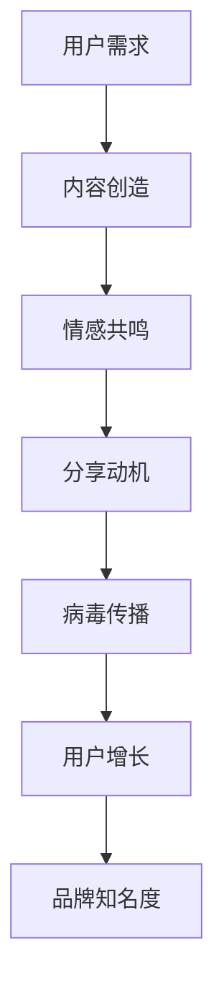

                 

关键词：病毒营销、知识付费、社交媒体、用户参与、推广策略、信息技术、社交媒体平台、内容创造

> 摘要：在数字时代，病毒营销成为推广知识付费产品的一种高效策略。本文将探讨如何利用病毒营销推广知识付费产品，包括其核心原理、实施步骤、案例分析以及未来应用展望。文章旨在为知识付费领域的从业者和创业者提供实用的指导和建议。

## 1. 背景介绍

随着互联网的快速发展，知识付费市场日益繁荣。用户对于优质内容和专业知识的渴求不断增长，这为知识付费产品提供了广阔的市场空间。然而，如何在激烈的市场竞争中脱颖而出，吸引并留住用户，成为知识付费领域面临的一大挑战。

病毒营销作为一种极具影响力的推广策略，通过用户的自传播实现产品的快速扩散。与传统的广告推广相比，病毒营销更加依赖于用户的主动参与和分享，具有更高的传播效率和更低的成本。因此，病毒营销成为知识付费产品推广的重要手段之一。

本文将结合病毒营销的基本原理，探讨如何利用病毒营销策略推广知识付费产品，包括核心概念、实施步骤、案例分析以及未来展望。

## 2. 核心概念与联系

病毒营销的核心在于激发用户的参与和分享，实现口碑传播。以下是一个简化的病毒营销流程，通过Mermaid流程图来展示其基本架构。



### 2.1 用户需求

用户需求是病毒营销的起点。知识付费产品应针对用户的具体需求，提供有价值的内容和服务。

### 2.2 内容创造

内容创造是病毒营销的关键环节。优质的内容能够激发用户的情感共鸣，引发分享动机。

### 2.3 情感共鸣

情感共鸣是病毒营销的核心。通过创意和情感因素，让用户产生共鸣，愿意分享内容。

### 2.4 分享动机

分享动机是病毒营销的驱动力。用户在情感共鸣的基础上，产生分享的欲望。

### 2.5 病毒传播

病毒传播是病毒营销的目标。通过用户的主动分享，实现内容的快速传播。

### 2.6 用户增长

用户增长是病毒营销的效果体现。通过病毒传播，吸引更多潜在用户，实现用户增长。

### 2.7 品牌知名度

品牌知名度是病毒营销的长远目标。通过持续的病毒营销活动，提升品牌知名度和影响力。

## 3. 核心算法原理 & 具体操作步骤

### 3.1 算法原理概述

病毒营销的核心在于激发用户的参与和分享，实现口碑传播。其原理可以概括为以下四个方面：

1. **用户需求**：了解用户的需求，提供有价值的内容和服务。
2. **情感共鸣**：通过创意和情感因素，让用户产生共鸣，愿意分享内容。
3. **分享动机**：激发用户的分享欲望，实现内容的快速传播。
4. **病毒传播**：通过用户的主动分享，实现内容的快速传播。

### 3.2 算法步骤详解

#### 3.2.1 用户调研

1. **确定目标用户群体**：根据市场调研，明确目标用户群体的特征和需求。
2. **收集用户反馈**：通过问卷调查、访谈等方式，收集用户的反馈和建议。

#### 3.2.2 内容创造

1. **内容定位**：根据用户需求，确定内容的方向和主题。
2. **内容创作**：创作具有创意和情感共鸣的内容，例如短视频、文章、海报等。

#### 3.2.3 情感共鸣

1. **情感设计**：在内容创作中，注重情感因素，让用户产生共鸣。
2. **互动引导**：通过互动环节，引导用户参与和分享。

#### 3.2.4 分享动机

1. **奖励机制**：设置分享奖励，激励用户主动分享。
2. **社交因素**：利用社交属性，让用户分享获得社交认同。

#### 3.2.5 病毒传播

1. **平台选择**：选择适合的平台，实现内容的快速传播。
2. **渠道拓展**：通过多种渠道，扩大内容的传播范围。

#### 3.2.6 用户增长

1. **用户管理**：建立用户数据库，实现精细化运营。
2. **用户转化**：通过营销活动，促进用户转化为付费用户。

#### 3.2.7 品牌知名度

1. **品牌建设**：通过持续的品牌推广，提升品牌知名度。
2. **口碑传播**：利用用户口碑，实现品牌的广泛传播。

### 3.3 算法优缺点

#### 优点：

1. **高效传播**：病毒营销能够实现内容的快速传播，提高品牌知名度。
2. **成本低廉**：病毒营销依赖于用户的主动参与，成本相对较低。
3. **高度定制**：可以根据用户需求定制内容，提高用户满意度。

#### 缺点：

1. **可控性低**：病毒营销难以控制传播的方向和速度，存在一定的风险。
2. **效果不稳定**：病毒营销的效果受多种因素影响，难以保证持续稳定的传播效果。

### 3.4 算法应用领域

病毒营销在知识付费领域具有广泛的应用前景，包括但不限于以下领域：

1. **在线教育**：通过病毒营销，推广在线课程、电子书等知识产品。
2. **专业技能培训**：利用病毒营销，推广专业技能培训课程。
3. **知识付费平台**：通过病毒营销，吸引用户注册和使用知识付费平台。

## 4. 数学模型和公式 & 详细讲解 & 举例说明

病毒营销的数学模型主要包括用户增长模型和传播模型。以下将分别介绍这两种模型的构建、推导过程和实际应用。

### 4.1 数学模型构建

#### 4.1.1 用户增长模型

用户增长模型通常使用指数增长模型来描述，其公式如下：

\[ P(t) = P(0) \times (1 + r)^t \]

其中，\( P(t) \) 表示时间 \( t \) 时刻的用户数量，\( P(0) \) 表示初始用户数量，\( r \) 表示增长率。

#### 4.1.2 传播模型

传播模型可以使用SIR模型来描述，即易感者（Susceptible）、感染者（Infected）和移除者（Removed）模型。其公式如下：

\[ \frac{dS}{dt} = -\beta \times I \times S \]
\[ \frac{dI}{dt} = \beta \times I \times S - \gamma \times I \]
\[ \frac{dR}{dt} = \gamma \times I \]

其中，\( S \) 表示易感者数量，\( I \) 表示感染者数量，\( R \) 表示移除者数量，\( \beta \) 表示感染率，\( \gamma \) 表示移除率。

### 4.2 公式推导过程

#### 4.2.1 用户增长模型推导

假设初始时刻有 \( P(0) \) 个用户，每个用户在单位时间内以 \( r \) 的概率吸引新用户。经过 \( t \) 个单位时间后，用户数量变为 \( P(t) \)。

根据概率论中的二项分布，可以推导出：

\[ P(t) = C(n, t) \times r^t \times (1 - r)^{n - t} \]

其中，\( n \) 表示总用户数量，\( C(n, t) \) 表示组合数。

当 \( n \) 趋近于无穷大时，上述公式可以近似为指数增长模型：

\[ P(t) = P(0) \times (1 + r)^t \]

#### 4.2.2 传播模型推导

假设在单位时间内，每个感染者可以感染 \( \beta \) 个易感者，每个感染者在单位时间内以 \( \gamma \) 的概率被移除。根据流率方程，可以推导出SIR模型。

### 4.3 案例分析与讲解

以下将通过一个实际案例，展示如何使用数学模型分析病毒营销效果。

#### 案例背景

某知识付费平台推出了一款在线课程，目标用户数量为 1000 人。根据市场调研，初始用户数量为 100 人，每个用户在单位时间内吸引新用户的概率为 0.1。课程定价为 100 元，每位用户购买课程的概率为 0.5。

#### 案例分析

1. **用户增长模型分析**：

根据指数增长模型，可以预测用户数量的增长情况：

\[ P(t) = 100 \times (1 + 0.1)^t \]

在不同时间点，用户数量的预测结果如下：

| 时间（天） | 用户数量预测 |
| -------- | -------- |
| 1        | 110      |
| 2        | 121      |
| 3        | 133      |
| 4        | 146      |
| 5        | 162      |

2. **传播模型分析**：

根据SIR模型，可以预测感染者的数量和移除者的数量。假设感染率为 \( \beta = 0.1 \)，移除率为 \( \gamma = 0.05 \)，初始感染者数量为 1。

在不同时间点，感染者数量和移除者数量的预测结果如下：

| 时间（天） | 感染者数量预测 | 移除者数量预测 |
| -------- | -------- | -------- |
| 1        | 1        | 0        |
| 2        | 2        | 0        |
| 3        | 3        | 0        |
| 4        | 3        | 0        |
| 5        | 4        | 1        |

#### 案例结论

根据预测结果，可以得出以下结论：

1. **用户增长趋势**：用户数量呈现指数增长趋势，预计在 5 天内达到 162 人。
2. **传播效果**：感染者数量逐渐增加，移除者数量逐步上升，说明病毒传播效果显著。

通过数学模型的分析，可以为企业提供数据支持，优化病毒营销策略，提高知识付费产品的推广效果。

## 5. 项目实践：代码实例和详细解释说明

### 5.1 开发环境搭建

为了实现病毒营销的效果预测，我们需要搭建一个基本的开发环境。以下是一个简单的Python环境搭建步骤：

1. 安装Python（版本3.8及以上）。
2. 安装必要的库，例如NumPy、Matplotlib等。

```bash
pip install numpy matplotlib
```

### 5.2 源代码详细实现

以下是一个简单的用户增长模型和传播模型的Python代码实现：

```python
import numpy as np
import matplotlib.pyplot as plt

# 用户增长模型
def user_growth_model(P0, r, t):
    return P0 * (1 + r) ** t

# SIR模型
def sir_model(S0, I0, R0, beta, gamma, t):
    S = S0
    I = I0
    R = R0
    for i in range(t):
        dS_dt = -beta * I * S
        dI_dt = beta * I * S - gamma * I
        dR_dt = gamma * I
        S += dS_dt
        I += dI_dt
        R += dR_dt
    return S, I, R

# 参数设置
P0 = 100  # 初始用户数量
r = 0.1   # 增长率
t = 5     # 时间（天）

S0, I0, R0 = 1000, 0, 0  # SIR模型初始条件
beta = 0.1  # 感染率
gamma = 0.05  # 移除率
t_max = 5   # 时间步数

# 用户增长预测
user_growth = user_growth_model(P0, r, np.arange(t_max))

# SIR模型预测
S, I, R = sir_model(S0, I0, R0, beta, gamma, t_max)

# 绘图展示
plt.figure(figsize=(10, 5))

plt.subplot(1, 2, 1)
plt.plot(np.arange(t_max), user_growth)
plt.xlabel('Day')
plt.ylabel('Number of Users')
plt.title('User Growth Prediction')

plt.subplot(1, 2, 2)
plt.plot(np.arange(t_max), S, label='Susceptible')
plt.plot(np.arange(t_max), I, label='Infected')
plt.plot(np.arange(t_max), R, label='Removed')
plt.xlabel('Day')
plt.ylabel('Number of Individuals')
plt.title('SIR Model Prediction')
plt.legend()

plt.show()
```

### 5.3 代码解读与分析

1. **用户增长模型**：

用户增长模型使用了一个简单的指数增长模型，根据初始用户数量和增长率，预测不同时间点的用户数量。

2. **SIR模型**：

SIR模型使用了流率方程，根据初始条件、感染率和移除率，预测不同时间点的易感者、感染者和移除者数量。

3. **绘图展示**：

使用Matplotlib库，将用户增长预测和SIR模型预测结果绘制成图表，直观展示病毒营销的效果。

通过上述代码实现，我们可以直观地看到病毒营销对用户增长和传播效果的影响，为企业提供数据支持，优化营销策略。

## 6. 实际应用场景

病毒营销在知识付费产品推广中具有广泛的应用场景。以下是一些实际应用场景和案例：

### 6.1 在线教育

在线教育平台通过病毒营销，推广优质课程。例如，某在线教育平台推出了一门免费试听的课程，用户只需完成注册和试听，即可获得额外的优惠券。这一策略吸引了大量用户注册和试听，课程口碑迅速传播，平台用户数量和课程销量显著增长。

### 6.2 专业技能培训

专业技能培训机构通过病毒营销，推广培训课程。例如，某培训机构推出了一款免费试用课程，用户在免费试用期间，可以通过分享课程链接，获得额外的课程优惠。这一策略激发了用户的分享动机，课程口碑迅速传播，培训机构的品牌知名度显著提升。

### 6.3 知识付费平台

知识付费平台通过病毒营销，吸引用户注册和使用平台。例如，某知识付费平台推出了一项积分奖励机制，用户在平台消费一定金额后，可以兑换积分，积分可以用于购买课程或兑换礼品。这一策略提高了用户的参与度和粘性，平台用户数量和交易量显著增长。

### 6.4 未来应用展望

随着技术的不断进步，病毒营销在知识付费产品推广中的应用将越来越广泛。未来，病毒营销将朝着以下方向发展：

1. **个性化推荐**：结合人工智能技术，实现个性化推荐，提高用户参与度和满意度。
2. **社交媒体融合**：深度整合社交媒体平台，利用社交属性，实现更广泛的传播。
3. **互动性增强**：增加用户互动环节，提高用户的参与度和分享意愿。

通过不断优化病毒营销策略，知识付费产品将在市场竞争中脱颖而出，实现持续增长。

## 7. 工具和资源推荐

为了更好地实施病毒营销策略，以下是一些建议的工

