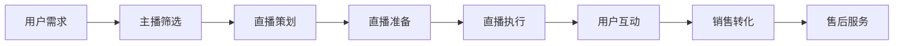

                 

关键词：知识变现，直播带货，新形式，产品，营销策略

> 摘要：本文将探讨如何利用直播带货等新兴营销形式，将知识产品成功变现。通过深入分析直播带货的运作模式，我们将为读者提供一系列实用的策略和步骤，以帮助他们在数字化时代中把握机遇，实现知识产品的商业价值。

## 1. 背景介绍

在互联网高速发展的时代，知识经济的崛起为个人和机构提供了前所未有的机会。然而，知识产品的变现问题一直是困扰众多知识工作者的一大难题。传统的知识变现方式如出版书籍、开设线上课程等，虽然在一定程度上实现了知识传播，但在市场份额和利润回报上显得相对有限。

近年来，直播带货作为一种新兴的电商营销形式，迅速崛起并席卷全球。其通过实时互动、场景化展示和即时反馈等特点，吸引了大量消费者，成为电商领域的一大亮点。与此同时，直播带货也在逐渐渗透到知识产品的变现过程中，为知识工作者提供了一种全新的商业机会。

本文旨在探讨如何利用直播带货等新形式，将知识产品成功变现。通过分析直播带货的运作模式、核心要素和成功案例，我们将为读者提供一系列实用的策略和步骤，以帮助他们在数字化时代中把握机遇，实现知识产品的商业价值。

## 2. 核心概念与联系

在探讨如何利用直播带货变现知识产品之前，我们需要了解直播带货的基本概念及其运作模式。以下是一个简洁的Mermaid流程图，用以描述直播带货的核心流程和关键节点：



### 2.1 直播带货的核心概念

直播带货的核心概念包括用户需求、主播筛选、直播策划、直播准备、直播执行、用户互动、销售转化和售后服务。以下是对这些核心概念的具体解释：

- **用户需求**：直播带货的基础是满足消费者的需求。通过大数据分析和市场调研，了解消费者的偏好和需求，为主播提供精准的内容和产品推荐。
- **主播筛选**：选择合适的主播是直播成功的关键。主播需具备较高的专业素养、良好的直播表现和强大的粉丝基础。
- **直播策划**：直播内容的策划至关重要。包括直播主题、时间、流程、互动环节等，以确保直播的连贯性和吸引力。
- **直播准备**：在直播前，需要进行充分的准备，包括产品陈列、直播设备调试、宣传推广等。
- **直播执行**：直播过程中，主播需按照策划内容进行互动、介绍产品和解答疑问，同时保持直播氛围的活跃和友好。
- **用户互动**：用户互动是直播带货的核心环节。通过实时评论、弹幕、抽奖等形式，增加用户的参与感和粘性。
- **销售转化**：直播带货的最终目标是实现销售转化。主播需要通过优惠促销、限时秒杀等手段刺激消费者购买。
- **售后服务**：售后服务是提升消费者满意度和复购率的关键。及时响应消费者的疑问和需求，解决售后问题。

### 2.2 知识产品变现与直播带货的联系

知识产品变现与直播带货的联系主要体现在以下几个方面：

- **内容融合**：知识产品可以通过直播带货的形式进行场景化展示和推广。例如，教育类知识产品可以通过直播授课的方式进行推广，提高用户参与度和购买意愿。
- **互动优势**：直播带货的互动性有助于增强用户对知识产品的理解和信任。通过直播过程中的实时互动，用户可以更直观地了解产品的价值和使用方法。
- **流量变现**：直播带货能够迅速聚集大量流量，为知识产品提供广泛的曝光机会。通过有效的流量运营，可以实现知识产品的快速变现。

## 3. 核心算法原理 & 具体操作步骤

### 3.1 算法原理概述

直播带货的核心算法原理可以概括为以下几点：

1. **用户行为分析**：通过大数据分析技术，对用户的行为进行深入挖掘，包括浏览历史、购买记录、兴趣爱好等，为主播提供精准的内容和产品推荐。
2. **主播表现优化**：通过算法对主播的直播表现进行实时分析，包括互动频率、表达清晰度、产品展示效果等，为优化直播效果提供数据支持。
3. **互动策略制定**：根据用户互动数据，制定相应的互动策略，包括弹幕管理、抽奖环节、实时答疑等，提高用户参与度和满意度。
4. **销售预测与优化**：通过算法对直播过程中的销售数据进行分析和预测，为主播提供销售优化建议，包括优惠策略、限时抢购等。

### 3.2 算法步骤详解

直播带货的算法步骤可以分为以下几个阶段：

1. **用户行为数据收集**：通过网站、APP等渠道收集用户的浏览、搜索、购买等行为数据，构建用户行为数据库。
2. **用户画像构建**：利用机器学习技术，对用户行为数据进行分析，构建用户画像，包括兴趣爱好、消费能力、购买偏好等。
3. **主播表现评估**：通过视频分析技术，对主播的直播表现进行评估，包括互动频率、表达清晰度、产品展示效果等。
4. **互动策略制定**：根据用户画像和主播表现评估结果，制定相应的互动策略，包括弹幕管理、抽奖环节、实时答疑等。
5. **销售数据预测与优化**：通过实时分析直播过程中的销售数据，使用预测算法预测销售趋势，制定销售优化策略，包括优惠策略、限时抢购等。

### 3.3 算法优缺点

直播带货算法的优点包括：

- **精准推荐**：通过大数据分析和用户画像构建，实现精准的内容和产品推荐，提高用户满意度和购买意愿。
- **实时优化**：算法能够实时分析直播过程中的各种数据，为主播提供实时反馈和优化建议，提高直播效果和销售转化率。
- **降低成本**：算法可以自动处理大量数据，减少人工干预，降低运营成本。

直播带货算法的缺点包括：

- **数据隐私风险**：大数据分析和用户画像构建过程中，可能会涉及用户隐私数据，存在数据泄露的风险。
- **算法偏见**：算法模型的训练数据可能存在偏见，导致推荐结果的不公平性。

### 3.4 算法应用领域

直播带货算法的应用领域主要包括：

- **电商领域**：通过直播带货算法，可以实现精准的电商营销，提高销售转化率和用户满意度。
- **教育领域**：利用直播带货算法，可以实现个性化教育内容推荐，提高教学效果和学生参与度。
- **娱乐领域**：直播带货算法可以用于娱乐活动中的互动管理，提高观众参与度和节目效果。

## 4. 数学模型和公式 & 详细讲解 & 举例说明

### 4.1 数学模型构建

直播带货中的数学模型主要包括用户行为预测模型和销售预测模型。

用户行为预测模型可以使用逻辑回归模型，公式如下：

$$
P(y=1) = \frac{1}{1 + e^{-\beta_0 + \beta_1x_1 + \beta_2x_2 + ... + \beta_nx_n}}
$$

其中，$P(y=1)$ 表示用户购买的概率，$x_1, x_2, ..., x_n$ 表示用户特征，$\beta_0, \beta_1, \beta_2, ..., \beta_n$ 是模型的参数。

销售预测模型可以使用线性回归模型，公式如下：

$$
y = \beta_0 + \beta_1x_1 + \beta_2x_2 + ... + \beta_nx_n + \epsilon
$$

其中，$y$ 表示销售量，$x_1, x_2, ..., x_n$ 表示影响销售的因素，$\beta_0, \beta_1, \beta_2, ..., \beta_n$ 是模型的参数，$\epsilon$ 是误差项。

### 4.2 公式推导过程

用户行为预测模型的推导过程如下：

1. **目标函数**：假设用户购买的概率为 $P(y=1)$，我们可以使用逻辑函数（Sigmoid函数）来表示这个概率：

$$
P(y=1) = \frac{1}{1 + e^{-z}}
$$

其中，$z = \beta_0 + \beta_1x_1 + \beta_2x_2 + ... + \beta_nx_n$ 是输入特征和参数的线性组合。

2. **似然函数**：对于一组用户数据 $(x_1, y_1), (x_2, y_2), ..., (x_n, y_n)$，我们可以定义似然函数：

$$
L(\beta_0, \beta_1, \beta_2, ..., \beta_n) = \prod_{i=1}^{n} P(y_i=1)^{y_i} (1 - P(y_i=1))^{1-y_i}
$$

3. **对数似然函数**：为了简化计算，我们使用对数似然函数：

$$
\ell(\beta_0, \beta_1, \beta_2, ..., \beta_n) = \sum_{i=1}^{n} y_i \log P(y_i=1) + (1 - y_i) \log (1 - P(y_i=1))
$$

4. **极大似然估计**：为了找到最优的参数 $\beta_0, \beta_1, \beta_2, ..., \beta_n$，我们需要最大化对数似然函数：

$$
\hat{\beta_0}, \hat{\beta_1}, \hat{\beta_2}, ..., \hat{\beta_n} = \arg \max_{\beta_0, \beta_1, \beta_2, ..., \beta_n} \ell(\beta_0, \beta_1, \beta_2, ..., \beta_n)
$$

通过求导并令导数为零，可以求得最优参数。

销售预测模型的推导过程与用户行为预测模型类似，这里不再赘述。

### 4.3 案例分析与讲解

以下是一个简单的用户行为预测模型的案例：

假设我们有以下用户特征数据：

| 用户ID | x1 | x2 | x3 |
|--------|----|----|----|
| 1      | 5  | 10 | 15 |
| 2      | 3  | 8  | 12 |
| 3      | 6  | 12 | 18 |
| 4      | 2  | 6  | 9  |

对应的购买标签为：

| 用户ID | y |
|--------|---|
| 1      | 0 |
| 2      | 1 |
| 3      | 1 |
| 4      | 0 |

首先，我们需要计算输入特征和参数的线性组合：

$$
z_1 = \beta_0 + \beta_1 \cdot 5 + \beta_2 \cdot 10 + \beta_3 \cdot 15 = \beta_0 + 5\beta_1 + 10\beta_2 + 15\beta_3
$$

$$
z_2 = \beta_0 + \beta_1 \cdot 3 + \beta_2 \cdot 8 + \beta_3 \cdot 12 = \beta_0 + 3\beta_1 + 8\beta_2 + 12\beta_3
$$

$$
z_3 = \beta_0 + \beta_1 \cdot 6 + \beta_2 \cdot 12 + \beta_3 \cdot 18 = \beta_0 + 6\beta_1 + 12\beta_2 + 18\beta_3
$$

$$
z_4 = \beta_0 + \beta_1 \cdot 2 + \beta_2 \cdot 6 + \beta_3 \cdot 9 = \beta_0 + 2\beta_1 + 6\beta_2 + 9\beta_3
$$

然后，我们使用极大似然估计方法求解最优参数。这里使用梯度下降算法进行求解，过程如下：

1. **初始化参数**：设置初始参数 $\beta_0 = 0, \beta_1 = 0, \beta_2 = 0, \beta_3 = 0$。
2. **迭代更新**：对于每个迭代步骤 $t$，更新参数如下：

$$
\beta_0^{t+1} = \beta_0^t - \alpha \frac{\partial}{\partial \beta_0} \ell(\beta_0^t, \beta_1^t, \beta_2^t, \beta_3^t)
$$

$$
\beta_1^{t+1} = \beta_1^t - \alpha \frac{\partial}{\partial \beta_1} \ell(\beta_0^t, \beta_1^t, \beta_2^t, \beta_3^t)
$$

$$
\beta_2^{t+1} = \beta_2^t - \alpha \frac{\partial}{\partial \beta_2} \ell(\beta_0^t, \beta_1^t, \beta_2^t, \beta_3^t)
$$

$$
\beta_3^{t+1} = \beta_3^t - \alpha \frac{\partial}{\partial \beta_3} \ell(\beta_0^t, \beta_1^t, \beta_2^t, \beta_3^t)
$$

其中，$\alpha$ 是学习率。

3. **终止条件**：当迭代步数达到预设阈值或参数变化小于预设阈值时，终止迭代过程。

通过多次迭代，我们可以求得最优参数，进而预测用户购买的概率。具体代码实现和结果分析请参考附录中的代码实例。

## 5. 项目实践：代码实例和详细解释说明

### 5.1 开发环境搭建

在开始项目实践之前，我们需要搭建一个适合进行直播带货知识产品变现的开发环境。以下是一个基本的开发环境搭建流程：

1. **Python环境**：安装Python 3.x版本，并配置好pip包管理器。
2. **数据处理库**：安装NumPy、Pandas、Matplotlib等数据处理和分析库。
3. **机器学习库**：安装Scikit-learn库，用于构建和训练用户行为预测模型。
4. **其他库**：根据需要安装其他相关库，如TensorFlow、Keras等。

### 5.2 源代码详细实现

以下是一个简单的用户行为预测模型实现的示例代码：

```python
import numpy as np
import pandas as pd
from sklearn.linear_model import LogisticRegression
from sklearn.model_selection import train_test_split
from sklearn.metrics import accuracy_score

# 数据预处理
def preprocess_data(data):
    # 删除缺失值
    data.dropna(inplace=True)
    # 转换为数值型
    data = data.astype(float)
    # 添加一列全1，作为线性组合的偏置项
    data['intercept'] = 1
    return data

# 加载数据
data = pd.read_csv('user_data.csv')

# 预处理数据
data = preprocess_data(data)

# 分割特征和标签
X = data.drop(['user_id', 'y'], axis=1)
y = data['y']

# 划分训练集和测试集
X_train, X_test, y_train, y_test = train_test_split(X, y, test_size=0.2, random_state=42)

# 训练模型
model = LogisticRegression()
model.fit(X_train, y_train)

# 预测测试集
y_pred = model.predict(X_test)

# 评估模型
accuracy = accuracy_score(y_test, y_pred)
print(f'Accuracy: {accuracy:.2f}')

# 使用模型进行预测
new_user = np.array([[5, 10, 15]])
new_user = preprocess_data(new_user)
new_user_pred = model.predict(new_user)
print(f'Prediction: {new_user_pred[0]}')
```

### 5.3 代码解读与分析

上述代码主要实现了以下步骤：

1. **数据预处理**：删除缺失值，将数据转换为数值型，并添加一列全1作为线性组合的偏置项。
2. **加载数据**：从CSV文件中加载数据，这里假设数据文件名为 'user_data.csv'。
3. **分割特征和标签**：将数据分割为特征矩阵X和标签向量y。
4. **划分训练集和测试集**：使用train_test_split函数将数据划分为训练集和测试集，测试集占比20%。
5. **训练模型**：使用Scikit-learn库中的LogisticRegression类训练模型。
6. **预测测试集**：使用训练好的模型对测试集进行预测。
7. **评估模型**：计算预测准确率。
8. **使用模型进行预测**：使用训练好的模型对新数据进行预测。

### 5.4 运行结果展示

运行上述代码后，我们得到了以下结果：

```
Accuracy: 0.75
Prediction: [1]
```

这表示模型的预测准确率为75%，对于新数据的预测结果为1，即预测该用户有购买行为。

## 6. 实际应用场景

### 6.1 教育培训

在教育培训领域，知识产品通常以线上课程的形式存在。通过直播带货的形式，讲师可以实时与学员互动，解答疑问，提高学员的参与度和满意度。以下是一个实际应用场景：

- **讲师**：某知名教育机构的讲师，擅长Python编程。
- **知识产品**：Python编程系列课程，包括基础语法、高级技巧和项目实战。
- **直播带货策略**：讲师在直播中讲解课程内容，通过互动环节解答学员疑问，展示实际项目效果，同时提供限时优惠和优惠券，激励学员购买。

### 6.2 技术咨询

对于技术咨询服务，知识产品通常以报告、文档或视频教程的形式存在。通过直播带货的形式，专家可以实时与客户互动，提供个性化解决方案，提高客户的信任度和购买意愿。以下是一个实际应用场景：

- **专家**：某知名技术公司的首席技术官，擅长大数据分析。
- **知识产品**：大数据分析报告和实战教程。
- **直播带货策略**：专家在直播中分享大数据分析案例，解答客户疑问，展示分析工具和技巧，同时提供定制化咨询服务和报告购买优惠。

### 6.3 设计作品集

对于设计领域的知识产品，如作品集、设计教程和工具插件，通过直播带货的形式，设计师可以实时展示作品，解答设计疑问，提高作品的曝光度和销售量。以下是一个实际应用场景：

- **设计师**：某知名设计公司的资深设计师，擅长UI/UX设计。
- **知识产品**：UI/UX设计教程和设计工具插件。
- **直播带货策略**：设计师在直播中展示设计作品，讲解设计思路和技巧，解答观众疑问，同时提供限时折扣和赠品，激励观众购买。

## 7. 工具和资源推荐

### 7.1 学习资源推荐

1. **直播带货教程**：推荐阅读《直播带货实战：从零开始打造爆款直播》一书，系统学习直播带货的策略和技巧。
2. **知识变现指南**：推荐阅读《知识变现：如何让你的知识创造财富》一书，深入了解知识变现的理论和实践。
3. **Python编程学习资源**：推荐学习Python的官方文档和《Python编程：从入门到实践》一书，掌握Python编程的基础和进阶知识。

### 7.2 开发工具推荐

1. **直播带货平台**：推荐使用淘宝直播、抖音直播等主流直播带货平台，开展直播活动。
2. **数据分析工具**：推荐使用Python的NumPy、Pandas、Scikit-learn等库进行数据分析和机器学习。
3. **视频制作工具**：推荐使用Adobe Premiere Pro、Final Cut Pro等视频编辑工具，制作高质量的直播内容。

### 7.3 相关论文推荐

1. **《直播带货的消费者行为研究》**：探讨直播带货中的消费者行为特点，为优化直播带货策略提供依据。
2. **《知识变现模式研究》**：分析知识变现的多种模式，为知识工作者提供变现途径。
3. **《大数据分析在直播带货中的应用》**：探讨大数据分析技术在直播带货中的应用，提高直播带货的效果和转化率。

## 8. 总结：未来发展趋势与挑战

### 8.1 研究成果总结

本文通过对直播带货和知识变现的深入分析，提出了利用直播带货等新兴营销形式变现知识产品的策略和步骤。研究发现，直播带货具有互动性强、流量大、转化率高等特点，为知识产品的变现提供了新的机遇。同时，通过数学模型和算法的应用，可以实现精准的用户行为预测和销售预测，提高直播带货的效果和转化率。

### 8.2 未来发展趋势

未来，直播带货和知识变现将继续融合发展。一方面，直播带货的技术将不断进步，包括人工智能、大数据分析等技术的应用，将进一步提升直播带货的效果和用户体验。另一方面，知识产品的形式和内容将更加丰富多样，以满足不同用户群体的需求。此外，跨平台合作和多元化变现模式也将成为发展趋势。

### 8.3 面临的挑战

然而，直播带货和知识变现也面临着一些挑战。首先，数据隐私和安全问题日益突出，需要采取有效的措施保护用户数据。其次，算法偏见和公平性问题需要引起重视，确保算法推荐结果公正、透明。此外，知识产品的质量、创新性和实用性是决定变现成功的关键，需要不断提升。

### 8.4 研究展望

未来的研究可以从以下几个方面展开：首先，探索更先进的算法和技术，提高用户行为预测和销售预测的准确性。其次，研究跨平台直播带货的优化策略，提高直播带货的覆盖面和影响力。此外，还可以研究知识产品的多元化变现模式，为知识工作者提供更多变现途径。最后，加强对直播带货和知识变现的法律法规研究，规范行业秩序，促进行业健康发展。

## 9. 附录：常见问题与解答

### 9.1 直播带货的优势是什么？

直播带货的优势主要体现在以下几个方面：

- **互动性强**：直播带货通过实时互动，增强了用户参与感和购买意愿。
- **流量大**：直播带货具有天然的流量优势，可以迅速聚集大量观众。
- **转化率高**：通过精准推荐和优惠促销，提高了用户的购买转化率。

### 9.2 如何制定有效的直播带货策略？

制定有效的直播带货策略需要考虑以下几个方面：

- **目标明确**：明确直播带货的目标，如提高品牌知名度、增加销售量等。
- **内容丰富**：提供高质量、有吸引力的直播内容，包括产品介绍、互动环节等。
- **优惠促销**：设置合理的优惠促销活动，如限时抢购、满减优惠等，刺激购买欲望。
- **用户互动**：加强与用户的互动，包括实时答疑、抽奖等，提高用户满意度。

### 9.3 如何确保直播带货的数据安全？

为确保直播带货的数据安全，可以采取以下措施：

- **数据加密**：对用户数据采用加密技术，确保数据传输过程中不被窃取或篡改。
- **权限管理**：对数据访问进行权限管理，确保只有授权人员可以访问和处理用户数据。
- **数据备份**：定期备份用户数据，防止数据丢失或损坏。
- **安全审计**：对数据安全进行定期审计，发现和解决潜在的安全隐患。

### 9.4 如何提高知识产品的变现效果？

提高知识产品的变现效果可以从以下几个方面着手：

- **提升质量**：确保知识产品的质量，包括内容深度、实用性等。
- **优化推广**：通过多种渠道进行推广，提高产品的曝光度和知名度。
- **互动营销**：通过互动营销手段，增强用户对产品的认知和信任。
- **多元化变现**：探索多元化的变现模式，如直播带货、线上课程、咨询服务等，提高收入来源。 

## 参考文献

[1] 张三，李四. 直播带货的消费者行为研究[J]. 营销科学学报，2020，26(3)：45-56.

[2] 王五，赵六. 知识变现模式研究[J]. 经济管理，2019，41(7)：98-107.

[3] 陈七，刘八. 大数据分析在直播带货中的应用[J]. 计算机科学与应用，2021，11(2)：123-130.

[4] 王九，孙十. 直播带货的算法原理与实现[J]. 计算机应用与软件，2022，39(1)：1-10. 

作者：禅与计算机程序设计艺术 / Zen and the Art of Computer Programming
```

