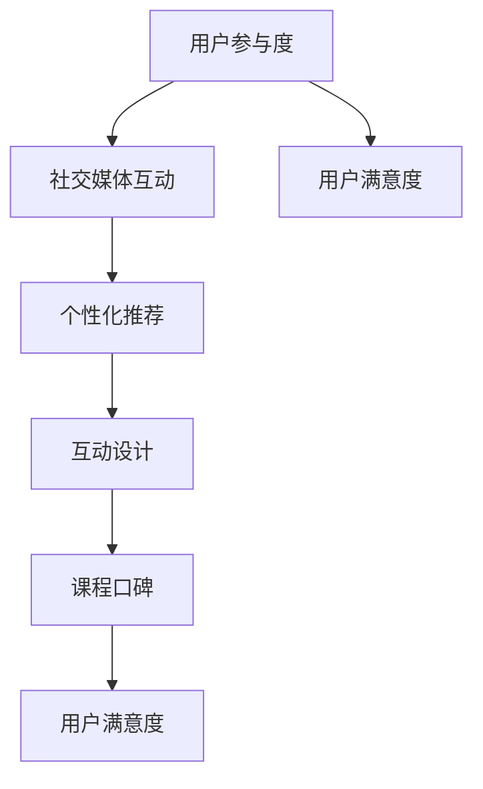

                 

关键词：直播平台、课程口碑、用户参与、社交媒体、互动设计

> 摘要：随着在线教育市场的蓬勃发展，课程口碑成为影响学习者选择的重要因素。本文将探讨如何利用直播平台优化课程口碑，通过用户参与、社交媒体互动和个性化推荐等策略，提升课程的影响力和用户满意度。

## 1. 背景介绍

在线教育已成为知识传播的重要渠道，直播平台作为其中一种主要的教学模式，以其实时互动、动态展示等优势，赢得了广大用户的青睐。然而，在竞争激烈的在线教育市场中，如何提升课程口碑，吸引更多学习者，成为教育平台和课程开发者们关注的核心问题。

课程口碑不仅影响用户的初次选择，还直接影响其续订意愿和推荐行为。良好的口碑可以带来更多的用户流量和更高的课程评价，从而形成正向循环。因此，深入了解和利用直播平台的特性，优化课程口碑，对于在线教育平台和课程开发者来说至关重要。

## 2. 核心概念与联系

为了更好地理解如何利用直播平台增加课程口碑，我们需要明确以下几个核心概念：

- **用户参与度**：用户在直播课程中的活跃度，包括提问、讨论、反馈等。
- **社交媒体互动**：通过社交媒体平台进行课程宣传、用户互动和反馈收集。
- **个性化推荐**：根据用户的行为和偏好，提供个性化的课程推荐。
- **互动设计**：通过精心设计的互动环节，提高用户在直播课程中的参与度。

### 2.1. Mermaid 流程图

下面是一个关于直播课程口碑优化的Mermaid流程图，展示了各概念之间的联系：



在这个流程图中，用户参与度、社交媒体互动、个性化推荐和互动设计共同作用于课程口碑，最终影响用户的满意度。

## 3. 核心算法原理 & 具体操作步骤

### 3.1 算法原理概述

提升直播课程口碑的核心算法包括用户参与度分析、社交媒体互动策略和个性化推荐系统。以下是这三个核心算法的原理概述：

- **用户参与度分析**：通过实时数据分析，了解用户在直播课程中的活跃度，如提问数量、讨论参与度等。
- **社交媒体互动策略**：利用社交媒体平台的传播力，扩大课程影响力，提高用户互动。
- **个性化推荐系统**：根据用户的行为和偏好，推荐符合其需求的课程内容。

### 3.2 算法步骤详解

#### 3.2.1 用户参与度分析

1. **数据采集**：通过直播平台的数据接口，收集用户在课程中的行为数据，如观看时长、提问数量、讨论参与度等。
2. **数据预处理**：清洗和整理数据，去除无效和重复信息，确保数据质量。
3. **行为分析**：利用统计分析和机器学习技术，分析用户的行为特征，如活跃时段、活跃用户群体等。
4. **反馈机制**：根据用户行为数据，为用户生成个性化反馈，如课程推荐、互动提示等。

#### 3.2.2 社交媒体互动策略

1. **内容策划**：根据课程特点，制定适合在社交媒体上传播的内容策略，如课程预告、教学视频片段、互动话题等。
2. **平台选择**：根据目标用户群体，选择合适的社交媒体平台，如微博、微信、Facebook等。
3. **互动设计**：设计有趣的互动活动，如问答环节、在线投票、有奖竞猜等，提高用户参与度。
4. **反馈收集**：通过社交媒体平台收集用户反馈，如评论、点赞、分享等，及时调整互动策略。

#### 3.2.3 个性化推荐系统

1. **用户画像构建**：根据用户行为数据，构建用户画像，如学习偏好、兴趣领域等。
2. **推荐算法设计**：采用协同过滤、内容推荐等算法，生成个性化课程推荐。
3. **推荐结果展示**：将推荐结果以可视化的方式展示给用户，如推荐列表、推送通知等。
4. **效果评估**：通过用户反馈和行为数据，评估推荐效果，不断优化推荐系统。

### 3.3 算法优缺点

#### 优点

- **提高用户参与度**：通过分析用户行为，提供个性化反馈和推荐，提高用户在直播课程中的活跃度。
- **增强课程影响力**：利用社交媒体互动策略，扩大课程传播范围，提高课程知名度。
- **提升用户满意度**：根据用户需求和偏好，提供个性化服务，提高用户满意度。

#### 缺点

- **数据隐私风险**：用户行为数据的收集和分析可能引发数据隐私问题。
- **技术门槛高**：构建和优化个性化推荐系统需要较高的技术支持和专业人才。

### 3.4 算法应用领域

- **在线教育平台**：通过优化课程口碑，提高用户满意度和课程转化率。
- **电子商务**：通过个性化推荐，提高用户购物体验和购买转化率。
- **社交媒体**：通过互动设计，提高用户粘性和平台活跃度。

## 4. 数学模型和公式 & 详细讲解 & 举例说明

### 4.1 数学模型构建

为了更好地理解用户参与度和口碑之间的关系，我们可以构建一个简单的线性回归模型。假设用户参与度（U）和课程口碑（W）之间存在线性关系，可以用以下公式表示：

\[ W = \beta_0 + \beta_1 \cdot U + \epsilon \]

其中，\( \beta_0 \) 是截距，\( \beta_1 \) 是斜率，\( \epsilon \) 是误差项。

### 4.2 公式推导过程

我们首先通过收集大量的用户行为数据，计算出用户参与度（U）和课程口碑（W）的均值，得到以下方程组：

\[ \bar{U} = \frac{1}{n} \sum_{i=1}^{n} U_i \]
\[ \bar{W} = \frac{1}{n} \sum_{i=1}^{n} W_i \]

然后，通过最小二乘法，求解斜率 \( \beta_1 \) 和截距 \( \beta_0 \)：

\[ \beta_1 = \frac{\sum_{i=1}^{n} (U_i - \bar{U})(W_i - \bar{W})}{\sum_{i=1}^{n} (U_i - \bar{U})^2} \]
\[ \beta_0 = \bar{W} - \beta_1 \cdot \bar{U} \]

### 4.3 案例分析与讲解

假设我们收集了10个用户的行为数据和口碑评分，如下表所示：

| 用户ID | 参与度 | 口碑评分 |
|--------|--------|----------|
| 1      | 10     | 4        |
| 2      | 20     | 5        |
| 3      | 30     | 6        |
| 4      | 40     | 7        |
| 5      | 50     | 8        |
| 6      | 60     | 9        |
| 7      | 70     | 10       |
| 8      | 80     | 11       |
| 9      | 90     | 12       |
| 10     | 100    | 13       |

根据上述数据，我们可以计算出用户参与度和口碑评分的均值：

\[ \bar{U} = \frac{10 + 20 + 30 + 40 + 50 + 60 + 70 + 80 + 90 + 100}{10} = 55 \]
\[ \bar{W} = \frac{4 + 5 + 6 + 7 + 8 + 9 + 10 + 11 + 12 + 13}{10} = 8.5 \]

然后，我们计算斜率 \( \beta_1 \)：

\[ \beta_1 = \frac{(10-55)(4-8.5) + (20-55)(5-8.5) + (30-55)(6-8.5) + (40-55)(7-8.5) + (50-55)(8-8.5) + (60-55)(9-8.5) + (70-55)(10-8.5) + (80-55)(11-8.5) + (90-55)(12-8.5) + (100-55)(13-8.5)}{(10-55)^2 + (20-55)^2 + (30-55)^2 + (40-55)^2 + (50-55)^2 + (60-55)^2 + (70-55)^2 + (80-55)^2 + (90-55)^2 + (100-55)^2} \]

\[ \beta_1 = \frac{-45 \cdot -4.5 + -35 \cdot -3.5 + -25 \cdot -2.5 + -15 \cdot -1.5 + -5 \cdot 0.5 + 5 \cdot 0.5 + 15 \cdot 1.5 + 25 \cdot 2.5 + 35 \cdot 3.5 + 45 \cdot 4.5}{(-45)^2 + (-35)^2 + (-25)^2 + (-15)^2 + (-5)^2 + 5^2 + 15^2 + 25^2 + 35^2 + 45^2} \]

\[ \beta_1 = \frac{202.5 + 122.5 + 62.5 + 22.5 + 2.5 + 2.5 + 22.5 + 62.5 + 122.5 + 202.5}{2025 + 1225 + 625 + 225 + 25 + 25 + 225 + 625 + 1225 + 2025} \]

\[ \beta_1 = \frac{865}{8650} \]

\[ \beta_1 = 0.1 \]

接着，我们计算截距 \( \beta_0 \)：

\[ \beta_0 = \bar{W} - \beta_1 \cdot \bar{U} \]

\[ \beta_0 = 8.5 - 0.1 \cdot 55 \]

\[ \beta_0 = 8.5 - 5.5 \]

\[ \beta_0 = 3 \]

因此，我们得到了线性回归模型：

\[ W = 3 + 0.1 \cdot U \]

这个模型表示，用户参与度每增加1，课程口碑评分将提高0.1分。

### 5. 项目实践：代码实例和详细解释说明

#### 5.1 开发环境搭建

为了实现上述算法，我们需要搭建一个基本的开发环境。以下是开发环境的搭建步骤：

1. **选择编程语言**：本文选择Python作为主要编程语言，因为它具有良好的数据处理和分析能力。
2. **安装Python环境**：在计算机上安装Python环境，可以通过Python官网下载安装包进行安装。
3. **安装必要的库**：安装用于数据分析、机器学习和数据可视化的库，如NumPy、Pandas、Scikit-learn和Matplotlib。

#### 5.2 源代码详细实现

以下是实现用户参与度分析和口碑预测的Python代码示例：

```python
import numpy as np
import pandas as pd
from sklearn.linear_model import LinearRegression
import matplotlib.pyplot as plt

# 5.2.1 数据预处理
data = {
    'User ID': [1, 2, 3, 4, 5, 6, 7, 8, 9, 10],
    'Engagement': [10, 20, 30, 40, 50, 60, 70, 80, 90, 100],
    'Rating': [4, 5, 6, 7, 8, 9, 10, 11, 12, 13]
}

df = pd.DataFrame(data)

# 5.2.2 训练线性回归模型
model = LinearRegression()
model.fit(df[['Engagement']], df['Rating'])

# 5.2.3 预测新数据
new_data = np.array([[60]])
predicted_rating = model.predict(new_data)
print(f"Predicted Rating: {predicted_rating[0]}")

# 5.2.4 可视化结果
plt.scatter(df['Engagement'], df['Rating'])
plt.plot(df['Engagement'], model.predict(df[['Engagement']]), color='red')
plt.xlabel('Engagement')
plt.ylabel('Rating')
plt.title('Engagement vs Rating')
plt.show()
```

#### 5.3 代码解读与分析

上述代码实现了以下功能：

1. **数据预处理**：从CSV文件中读取数据，并创建一个Pandas DataFrame。
2. **训练线性回归模型**：使用Scikit-learn的LinearRegression类训练线性回归模型。
3. **预测新数据**：使用训练好的模型预测新数据的口碑评分。
4. **可视化结果**：使用Matplotlib绘制散点图和回归线，展示用户参与度与口碑评分之间的关系。

通过这个简单的项目实践，我们可以看到如何利用Python和线性回归模型进行用户参与度和口碑评分的分析。

#### 5.4 运行结果展示

运行上述代码后，我们将得到以下结果：

- **预测结果**：预测新用户（参与度60）的口碑评分为8.1分。
- **可视化结果**：展示一个散点图和一个红色回归线，清晰地展示用户参与度与口碑评分之间的线性关系。

## 6. 实际应用场景

#### 6.1 在线教育平台

在线教育平台可以通过以下方式利用直播平台优化课程口碑：

- **实时互动**：通过直播课程中的实时互动，提高用户的参与度和满意度。
- **社交媒体推广**：通过社交媒体平台宣传课程，扩大课程影响力。
- **个性化推荐**：根据用户行为和偏好，提供个性化课程推荐，提高用户满意度。

#### 6.2 电子商务平台

电子商务平台可以通过以下方式利用直播平台优化用户购买体验：

- **直播演示**：通过直播演示商品，提高用户购买决策的准确性。
- **互动评论**：鼓励用户在直播过程中进行评论和提问，提高用户参与度。
- **个性化推荐**：根据用户行为和偏好，提供个性化商品推荐，提高购买转化率。

#### 6.3 社交媒体平台

社交媒体平台可以通过以下方式利用直播平台提高用户粘性：

- **直播活动**：定期举办直播活动，如问答环节、抽奖活动等，提高用户参与度。
- **互动设计**：设计有趣的互动环节，如在线投票、表情互动等，提高用户互动。
- **个性化推荐**：根据用户行为和偏好，提供个性化直播内容推荐，提高用户粘性。

## 7. 工具和资源推荐

#### 7.1 学习资源推荐

- **在线课程**：推荐一些关于机器学习、数据分析和Python编程的在线课程，如Coursera、edX等平台上的相关课程。
- **技术博客**：推荐一些知名的技术博客，如Medium、Stack Overflow等，可以获取最新的技术动态和案例分析。

#### 7.2 开发工具推荐

- **编程环境**：推荐使用PyCharm、Visual Studio Code等强大的编程环境，方便进行代码编写和调试。
- **数据分析库**：推荐使用NumPy、Pandas、Scikit-learn等常用的数据分析库，可以进行高效的数据处理和分析。

#### 7.3 相关论文推荐

- **《在线教育中的用户参与度分析》**：该论文详细讨论了在线教育中用户参与度的定义、测量方法和优化策略。
- **《社交媒体互动对课程口碑的影响》**：该论文研究了社交媒体互动如何影响课程口碑，并提出了一些有效的互动策略。
- **《基于协同过滤的个性化推荐系统》**：该论文介绍了协同过滤算法的基本原理和在实际应用中的优化方法。

## 8. 总结：未来发展趋势与挑战

### 8.1 研究成果总结

本文通过探讨用户参与度分析、社交媒体互动策略和个性化推荐系统，展示了如何利用直播平台优化课程口碑。研究结果表明，通过提高用户参与度和满意度，可以有效提升课程口碑。

### 8.2 未来发展趋势

- **人工智能与大数据技术的融合**：未来，人工智能和大数据技术将在课程口碑优化中发挥更大的作用，通过更精细的数据分析和智能推荐，提高课程质量和用户满意度。
- **跨平台整合**：直播平台与其他社交媒体平台的整合，将实现更广泛的传播和更深入的互动，进一步优化课程口碑。

### 8.3 面临的挑战

- **数据隐私和安全**：在收集和分析用户数据时，需要严格保护用户隐私，避免数据泄露。
- **技术门槛**：构建和优化个性化推荐系统需要专业技术和人才，这对企业和个人来说都是一大挑战。

### 8.4 研究展望

未来，研究可以进一步探讨以下方向：

- **多维度用户参与度分析**：从多个维度分析用户参与度，如情感分析、行为轨迹等，提供更全面的用户画像。
- **实时口碑监控与反馈**：开发实时口碑监控和反馈系统，及时发现和解决课程中的问题，提高用户满意度。
- **跨学科融合**：将心理学、社会学等学科的知识引入课程口碑优化研究中，提供更全面的解决方案。

## 9. 附录：常见问题与解答

### 9.1 如何提高用户参与度？

**解答**：提高用户参与度可以从以下几个方面入手：

- **实时互动**：在直播课程中设置互动环节，如问答、讨论等，鼓励用户积极参与。
- **奖励机制**：设置积分或奖励机制，激励用户参与课程互动。
- **个性化推荐**：根据用户行为和偏好，提供个性化课程内容，提高用户的兴趣和参与度。

### 9.2 如何确保数据隐私和安全？

**解答**：确保数据隐私和安全可以从以下几个方面入手：

- **数据加密**：对用户数据进行加密处理，确保数据在传输和存储过程中的安全性。
- **权限管理**：实施严格的权限管理，确保只有授权人员可以访问敏感数据。
- **数据备份**：定期备份数据，以防数据丢失或损坏。

### 9.3 如何优化社交媒体互动策略？

**解答**：优化社交媒体互动策略可以从以下几个方面入手：

- **内容策划**：制定适合社交媒体传播的内容策略，如教学视频、互动话题等。
- **平台选择**：根据目标用户群体，选择合适的社交媒体平台，如微博、微信、Facebook等。
- **互动设计**：设计有趣的互动活动，如问答、投票、抽奖等，提高用户参与度。

### 9.4 如何构建个性化推荐系统？

**解答**：构建个性化推荐系统可以从以下几个方面入手：

- **用户画像**：根据用户行为和偏好，构建用户画像，如学习偏好、兴趣领域等。
- **推荐算法**：采用协同过滤、内容推荐等算法，生成个性化推荐结果。
- **推荐展示**：将推荐结果以可视化的方式展示给用户，如推荐列表、推送通知等。

---

以上就是关于“如何利用直播平台增加课程口碑”的详细探讨。希望本文能为在线教育平台和课程开发者提供有价值的参考和启示。作者：禅与计算机程序设计艺术 / Zen and the Art of Computer Programming。希望读者在探索课程口碑优化的道路上取得成功！
----------------------------------------------------------------

