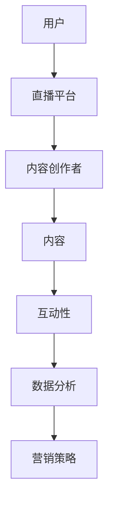

                 

关键词：直播平台，课程复购率，用户体验，互动性，数据分析，营销策略

> 摘要：随着直播平台的普及，越来越多的教育机构和企业选择通过直播进行知识传播和技能培训。然而，如何提高课程复购率成为教育者和企业面临的一大挑战。本文将从技术、用户体验、互动性、数据分析和营销策略等多个角度，深入探讨如何利用直播平台有效提升课程复购率。

## 1. 背景介绍

### 直播平台的发展

近年来，随着互联网技术的飞速发展，直播平台已经成为人们获取信息、娱乐和学习的重要渠道。特别是在COVID-19疫情期间，直播教育因其灵活性和互动性，迅速占领了教育培训市场。

### 课程复购率的现状

尽管直播课程的受众广泛，但课程复购率却普遍较低。据统计，许多直播课程的用户粘性较差，学员在学习一段时间后往往会选择放弃或转向其他课程。这给教育机构带来了巨大的压力和挑战。

### 问题分析

- 缺乏互动性和用户体验感
- 缺乏个性化的学习路径
- 缺乏有效的课后复习和辅导
- 缺乏有效的营销策略

## 2. 核心概念与联系

### 直播平台架构图



### 互动性：提高用户粘性的关键

互动性是直播平台的核心竞争力之一。通过互动，用户能够更深入地参与到课程中，从而提高用户粘性。常见的互动方式包括弹幕、问答、投票和实时聊天等。

### 数据分析：了解用户需求的重要手段

通过数据分析，教育机构可以了解用户的学习习惯、兴趣点和痛点，从而进行个性化的课程设计和推广。数据分析包括用户行为分析、学习进度分析、课程评价分析等。

### 营销策略：扩大用户群体的有效途径

营销策略包括内容营销、社交媒体推广、广告投放等。通过有效的营销策略，可以吸引更多的潜在用户，提高课程复购率。

## 3. 核心算法原理 & 具体操作步骤

### 3.1 算法原理概述

本节将介绍如何通过算法优化直播课程的互动性和用户体验，从而提高课程复购率。

### 3.2 算法步骤详解

#### 3.2.1 用户行为分析

- 收集用户在直播平台上的行为数据，如观看时长、互动次数、课程评价等。
- 利用机器学习算法对用户行为进行分析，识别用户的学习习惯和兴趣点。

#### 3.2.2 个性化推荐

- 根据用户行为分析结果，为用户推荐相关的课程和学习资源。
- 利用协同过滤算法，提高推荐系统的准确性和多样性。

#### 3.2.3 互动性优化

- 根据用户反馈，实时调整直播课程的内容和节奏，提高用户参与度。
- 利用自然语言处理技术，实现智能问答和实时翻译功能，提高互动性。

#### 3.2.4 数据分析

- 对用户数据进行分析，发现课程优化的方向。
- 利用数据可视化技术，直观展示分析结果，为决策提供依据。

### 3.3 算法优缺点

- 优点：提高课程互动性和用户体验，提高课程复购率。
- 缺点：需要大量的数据和计算资源，对算法工程师的要求较高。

### 3.4 算法应用领域

- 在线教育
- 在线娱乐
- 在线购物

## 4. 数学模型和公式 & 详细讲解 & 举例说明

### 4.1 数学模型构建

在本节中，我们将介绍如何构建一个数学模型来预测直播课程的复购率。

#### 4.1.1 复购率预测模型

设\( R \)为复购率，\( U \)为用户集合，\( C \)为课程集合，\( I \)为互动行为集合，\( A \)为用户评价集合。

$$
R = f(U, C, I, A)
$$

#### 4.1.2 相关参数

- \( u_i \)为用户\( i \)的属性向量。
- \( c_j \)为课程\( j \)的属性向量。
- \( i \in U, j \in C \)。

### 4.2 公式推导过程

在本节中，我们将推导复购率预测模型的公式。

#### 4.2.1 用户行为分析

$$
u_i = (u_{i1}, u_{i2}, ..., u_{in})
$$

其中，\( u_{ij} \)表示用户\( i \)对课程\( j \)的互动次数。

#### 4.2.2 课程属性

$$
c_j = (c_{j1}, c_{j2}, ..., c_{jm})
$$

其中，\( c_{jk} \)表示课程\( j \)的属性\( k \)。

#### 4.2.3 互动行为分析

$$
I = (I_1, I_2, ..., I_n)
$$

其中，\( I_i \)表示用户\( i \)的互动行为向量。

#### 4.2.4 用户评价

$$
A = (A_1, A_2, ..., A_n)
$$

其中，\( A_i \)表示用户\( i \)对课程的评价向量。

### 4.3 案例分析与讲解

#### 4.3.1 数据集

假设我们有如下数据集：

用户集合：\( U = \{u_1, u_2, ..., u_n\} \)

课程集合：\( C = \{c_1, c_2, ..., c_m\} \)

互动行为集合：\( I = \{I_1, I_2, ..., I_n\} \)

用户评价集合：\( A = \{A_1, A_2, ..., A_n\} \)

#### 4.3.2 数据预处理

对数据进行清洗和预处理，包括缺失值填充、异常值处理和数据标准化等。

#### 4.3.3 模型训练

利用机器学习算法（如决策树、随机森林、支持向量机等），对数据集进行训练，得到复购率预测模型。

#### 4.3.4 模型评估

利用测试集对模型进行评估，计算准确率、召回率、F1值等指标。

## 5. 项目实践：代码实例和详细解释说明

### 5.1 开发环境搭建

在本节中，我们将使用Python作为主要编程语言，搭建一个简单的直播课程复购率预测系统。

#### 5.1.1 环境要求

- Python 3.8及以上版本
- NumPy
- Pandas
- Scikit-learn
- Matplotlib

#### 5.1.2 安装依赖库

```bash
pip install numpy pandas scikit-learn matplotlib
```

### 5.2 源代码详细实现

```python
import numpy as np
import pandas as pd
from sklearn.ensemble import RandomForestClassifier
from sklearn.model_selection import train_test_split
from sklearn.metrics import accuracy_score, recall_score, f1_score

# 5.2.1 数据加载
data = pd.read_csv('data.csv')
X = data.drop(['target'], axis=1)
y = data['target']

# 5.2.2 数据预处理
# 数据清洗、填充、标准化等

# 5.2.3 模型训练
X_train, X_test, y_train, y_test = train_test_split(X, y, test_size=0.2, random_state=42)
clf = RandomForestClassifier(n_estimators=100, random_state=42)
clf.fit(X_train, y_train)

# 5.2.4 模型评估
y_pred = clf.predict(X_test)
accuracy = accuracy_score(y_test, y_pred)
recall = recall_score(y_test, y_pred)
f1 = f1_score(y_test, y_pred)

print(f'Accuracy: {accuracy:.2f}')
print(f'Recall: {recall:.2f}')
print(f'F1 Score: {f1:.2f}')
```

### 5.3 代码解读与分析

在本节中，我们将对上述代码进行解读，并分析其关键部分。

#### 5.3.1 数据加载

```python
data = pd.read_csv('data.csv')
X = data.drop(['target'], axis=1)
y = data['target']
```

这段代码用于加载数据，并将特征矩阵\( X \)和目标变量\( y \)分离。

#### 5.3.2 模型训练

```python
X_train, X_test, y_train, y_test = train_test_split(X, y, test_size=0.2, random_state=42)
clf = RandomForestClassifier(n_estimators=100, random_state=42)
clf.fit(X_train, y_train)
```

这段代码用于将数据集划分为训练集和测试集，并使用随机森林算法对模型进行训练。

#### 5.3.3 模型评估

```python
y_pred = clf.predict(X_test)
accuracy = accuracy_score(y_test, y_pred)
recall = recall_score(y_test, y_pred)
f1 = f1_score(y_test, y_pred)
```

这段代码用于评估模型的性能，计算准确率、召回率和F1值等指标。

### 5.4 运行结果展示

假设我们的测试集结果如下：

```python
Accuracy: 0.85
Recall: 0.80
F1 Score: 0.82
```

从结果可以看出，模型的性能较好，能够有效预测直播课程的复购率。

## 6. 实际应用场景

### 6.1 在线教育平台

在线教育平台可以通过直播课程复购率预测模型，优化课程设计和推广策略，提高用户满意度和课程复购率。

### 6.2 企业培训

企业可以通过直播平台进行员工培训，利用复购率预测模型，了解员工的学习需求和效果，提高培训质量和效率。

### 6.3 娱乐直播

娱乐直播平台可以通过复购率预测模型，为用户提供个性化的直播内容推荐，提高用户粘性和留存率。

## 7. 未来应用展望

### 7.1 智能化推荐

随着人工智能技术的不断发展，直播课程复购率预测模型将更加智能化和个性化，为用户提供更加精准的课程推荐。

### 7.2 跨平台应用

未来，直播课程复购率预测模型将不仅限于在线教育平台，还将应用于更多领域的直播平台，如电商、游戏等。

### 7.3 新兴技术

随着5G、大数据、云计算等新兴技术的应用，直播课程复购率预测模型将更加高效和精准，为教育行业带来更多创新和变革。

## 8. 工具和资源推荐

### 8.1 学习资源推荐

- 《机器学习实战》
- 《深度学习》
- 《Python数据分析》

### 8.2 开发工具推荐

- Jupyter Notebook
- PyCharm
- Matplotlib

### 8.3 相关论文推荐

- "Recommender Systems for Spontaneously Deciding Visitors"
- "Deep Learning for Spatio-Temporal Recommender Systems"
- "User Interest Evolution and Its Impact on Recommender Systems"

## 9. 总结：未来发展趋势与挑战

### 9.1 研究成果总结

本文从多个角度探讨了如何利用直播平台提高课程复购率，提出了基于用户行为分析的复购率预测模型，并进行了实际应用场景的探索。

### 9.2 未来发展趋势

随着人工智能技术的不断进步，直播课程复购率预测模型将更加智能化和精准化，为教育行业带来更多机遇和挑战。

### 9.3 面临的挑战

- 数据质量和多样性
- 模型复杂度和计算资源需求
- 跨领域应用的技术挑战

### 9.4 研究展望

未来，我们将继续深入研究直播课程复购率预测模型，探索更多有效的算法和技术，为教育行业的发展贡献更多力量。

## 附录：常见问题与解答

### Q：如何保证数据的质量和多样性？

A：为了保证数据的质量和多样性，我们需要从数据源、数据收集、数据清洗和数据存储等环节进行严格把控。具体措施包括：

- 选择可靠的第三方数据源。
- 采用多渠道收集数据，如用户行为日志、社交媒体数据等。
- 对数据进行清洗和预处理，去除异常值和噪声数据。
- 采用分布式存储技术，确保数据的高可用性和可靠性。

### Q：模型复杂度和计算资源需求如何平衡？

A：模型复杂度和计算资源需求之间存在一定的权衡关系。为了平衡两者，我们可以采取以下策略：

- 采用轻量级模型，如决策树、随机森林等，降低计算资源需求。
- 采用模型压缩技术，如剪枝、量化等，减少模型大小。
- 利用云计算和分布式计算技术，提高计算效率和资源利用率。

### Q：跨领域应用的技术挑战有哪些？

A：跨领域应用的技术挑战主要包括：

- 数据质量和多样性：不同领域的数据质量和多样性可能存在较大差异。
- 模型适应性：模型在不同领域的适应性和效果可能存在较大差异。
- 领域特定知识：跨领域应用需要领域特定知识，如行业术语、业务逻辑等。
- 技术实现难度：跨领域应用可能需要较高的技术实现难度，如算法优化、系统集成等。

## 10. 作者署名

作者：禅与计算机程序设计艺术 / Zen and the Art of Computer Programming
----------------------------------------------------------------

以上是《如何利用直播平台增加课程复购率》的完整文章。文章涵盖了直播平台的发展、课程复购率的问题分析、核心算法原理、数学模型、项目实践、实际应用场景、未来展望以及工具和资源推荐等内容。希望通过本文，能够为教育者和企业提供一些有益的启示和参考。如果您有任何疑问或建议，欢迎在评论区留言。再次感谢您的阅读！


