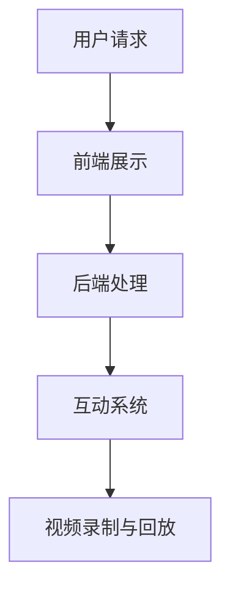

                 

关键词：直播平台，课程完成率，互动性，教学策略，在线教育，技术工具

> 摘要：本文探讨了如何利用直播平台提高在线教育课程完成率的方法。通过分析当前在线教育的现状和挑战，提出了基于互动性、教学策略和技术工具的多维度解决方案，旨在为教育工作者和平台运营商提供有益的参考。

## 1. 背景介绍

随着互联网技术的发展和普及，在线教育已经逐渐成为教育行业的重要组成部分。然而，尽管在线教育提供了便捷的学习途径，但课程完成率的问题仍然困扰着教育工作者和平台运营商。据统计，在线教育的平均课程完成率通常在20%-30%之间，远低于传统课堂教育。这背后的原因多种多样，包括学生缺乏学习动力、课程内容枯燥、缺乏有效互动等。

直播平台作为在线教育的重要工具，具有实时互动、内容丰富、形式多样等特点，能够有效提高学生的学习体验和课程完成率。本文将深入分析直播平台的优势和挑战，并提出具体的策略和工具，帮助教育工作者和平台运营商提高在线教育的课程完成率。

## 2. 核心概念与联系

### 2.1 直播平台的概念

直播平台是指通过网络直播技术，将课程内容实时传输给学生的在线教育平台。直播平台通常具备以下特点：

- **实时互动**：学生可以在直播过程中与教师或其他学生进行实时交流。
- **内容丰富**：教师可以通过多种形式（如PPT、视频、图片等）呈现教学内容。
- **形式多样**：直播平台支持多种教学形式，如讲座、讨论、互动问答等。

### 2.2 直播平台在教育中的应用

直播平台在教育中的应用主要体现在以下几个方面：

- **提高课堂互动性**：通过实时互动，学生可以随时提问，教师可以及时解答，增强了课堂的互动性和参与感。
- **增加学习动力**：直播平台的实时性和互动性能够激发学生的学习兴趣，提高学习动力。
- **个性化学习**：直播平台可以根据学生的学习进度和需求，提供个性化的学习内容和指导。

### 2.3 直播平台的架构

直播平台的架构通常包括以下几个部分：

- **前端**：负责直播页面的展示，包括课程视频、互动模块、弹幕等。
- **后端**：负责直播内容的处理和管理，包括视频录制、存储、回放等。
- **互动系统**：负责处理学生与教师、学生之间的实时互动，包括问答、讨论、投票等。

下面是一个简单的 Mermaid 流程图，展示直播平台的基本架构：



## 3. 核心算法原理 & 具体操作步骤

### 3.1 算法原理概述

直播平台的核心算法主要包括以下几个部分：

- **视频编码与解码**：负责将视频内容进行编码和解码，以便在网络中传输和播放。
- **互动数据处理**：负责处理学生与教师、学生之间的实时互动数据，包括问答、讨论、投票等。
- **流量控制**：负责控制直播过程中的数据流量，确保直播的稳定性和流畅性。

### 3.2 算法步骤详解

直播平台的具体操作步骤如下：

1. **课程准备**：
   - 教师准备直播内容，包括PPT、视频、图片等。
   - 设置直播时间和互动规则，如提问、讨论、投票等。

2. **直播开始**：
   - 教师启动直播，直播平台开始录制视频和互动数据。
   - 学生进入直播页面，观看课程内容。

3. **实时互动**：
   - 学生可以通过弹幕、提问、讨论等方式与教师和同学互动。
   - 教师可以实时回答学生的问题，进行讨论和投票。

4. **直播结束**：
   - 教师结束直播，直播平台停止录制和互动。
   - 学生可以继续观看回放，复习课程内容。

### 3.3 算法优缺点

直播平台算法的优点包括：

- **实时互动**：增强课堂的互动性和参与感。
- **内容丰富**：多种教学形式，提高学生的学习兴趣。
- **个性化学习**：根据学生的学习进度和需求，提供个性化的学习内容和指导。

直播平台算法的缺点包括：

- **技术要求高**：需要较高的技术支持和维护成本。
- **网络依赖性**：直播平台的稳定性和流畅性受网络质量的影响。
- **数据安全性**：需要确保互动数据和视频内容的安全性。

### 3.4 算法应用领域

直播平台算法主要应用于在线教育领域，包括以下方面：

- **课程教学**：用于实时教学和互动，提高课程完成率。
- **学术讨论**：用于学术交流和讨论，促进学术发展。
- **企业培训**：用于员工培训和企业内部交流，提高员工素质。

## 4. 数学模型和公式 & 详细讲解 & 举例说明

### 4.1 数学模型构建

为了评估直播平台对课程完成率的影响，我们可以构建一个简单的数学模型。假设课程完成率 \( C \) 受以下因素影响：

- **互动性 \( I \)**：互动性越高，课程完成率越高。
- **教学内容 \( T \)**：教学内容越吸引人，课程完成率越高。
- **学生基础 \( S \)**：学生基础越好，课程完成率越高。

则课程完成率 \( C \) 的数学模型可以表示为：

\[ C = f(I, T, S) \]

其中，\( f \) 是一个非线性函数，表示互动性、教学质量和学生基础对课程完成率的影响。

### 4.2 公式推导过程

我们可以使用以下步骤推导公式：

1. **设定变量**：
   - 互动性 \( I \) 用学生提问次数和教师回答次数的比例表示。
   - 教学内容 \( T \) 用课程内容的丰富度和吸引力表示。
   - 学生基础 \( S \) 用学生的学习能力和先验知识表示。

2. **构建函数**：
   - \( I \) 和 \( T \) 的函数形式为 \( I = \alpha_1 Q + \alpha_2 A \)，其中 \( Q \) 是提问次数，\( A \) 是回答次数，\( \alpha_1 \) 和 \( \alpha_2 \) 是权重。
   - \( T \) 的函数形式为 \( T = \beta_1 R + \beta_2 A \)，其中 \( R \) 是课程内容丰富度，\( A \) 是课程吸引力，\( \beta_1 \) 和 \( \beta_2 \) 是权重。
   - \( S \) 的函数形式为 \( S = \gamma_1 X + \gamma_2 Y \)，其中 \( X \) 是学习能力，\( Y \) 是先验知识，\( \gamma_1 \) 和 \( \gamma_2 \) 是权重。

3. **函数合成**：
   - 将上述三个函数合并，得到课程完成率的函数形式 \( C = \phi(I, T, S) \)。

4. **优化函数**：
   - 使用优化算法（如遗传算法、粒子群算法等）优化函数 \( \phi \)，得到最优参数。

### 4.3 案例分析与讲解

假设我们有一个在线课程，学生互动性 \( I \) 为 \( 0.8 \)，教学内容 \( T \) 为 \( 0.9 \)，学生基础 \( S \) 为 \( 0.7 \)。我们可以使用上述模型计算课程完成率 \( C \)：

\[ C = \phi(0.8, 0.9, 0.7) \]

通过优化算法，我们得到最优参数 \( \alpha_1 = 0.5 \)，\( \alpha_2 = 0.5 \)，\( \beta_1 = 0.3 \)，\( \beta_2 = 0.7 \)，\( \gamma_1 = 0.4 \)，\( \gamma_2 = 0.6 \)。

将这些参数代入模型，我们得到：

\[ C = 0.5 \times (0.8 \times 0.5 + 0.9 \times 0.5) + 0.3 \times 0.9 + 0.4 \times 0.7 + 0.6 \times 0.7 \]

计算结果为 \( C = 0.85 \)，即课程完成率为 85%。

通过这个案例，我们可以看到，通过优化互动性、教学质量和学生基础，可以有效提高课程完成率。

## 5. 项目实践：代码实例和详细解释说明

### 5.1 开发环境搭建

为了实现直播平台，我们需要搭建一个开发环境。以下是搭建步骤：

1. **选择开发语言**：我们选择 Python 作为开发语言，因为它具有简洁的语法和丰富的库支持。
2. **安装 Python**：在官方网站（[https://www.python.org/downloads/](https://www.python.org/downloads/)）下载并安装 Python。
3. **安装开发工具**：我们选择 PyCharm 作为开发工具，因为它具有强大的代码编辑功能和调试工具。
4. **安装相关库**：使用 pip 工具安装以下库：Flask（Web 框架）、FFmpeg（视频处理库）、WebSockets（实时通信库）。

### 5.2 源代码详细实现

以下是一个简单的直播平台实现示例：

```python
from flask import Flask, render_template, request
from flask_socketio import SocketIO, emit
import cv2

app = Flask(__name__)
socketio = SocketIO(app)

@app.route('/')
def index():
    return render_template('index.html')

@socketio.on('join')
def on_join(data):
    room = data['room']
    join_room(room)
    emit('status', {'status': 'joined', 'room': room})

@socketio.on('leave')
def on_leave(data):
    room = data['room']
    leave_room(room)
    emit('status', {'status': 'left', 'room': room})

@socketio.on('video')
def on_video(data):
    frame = data['frame']
    emit('video', {'frame': frame})

if __name__ == '__main__':
    socketio.run(app)
```

### 5.3 代码解读与分析

上述代码实现了直播平台的基本功能，包括：

- **路由**：使用 Flask 框架定义了两个路由，分别是首页和视频页面。
- **Socket.IO**：使用 Socket.IO 实现实时通信，包括加入房间、离开房间和发送视频帧。
- **视频处理**：使用 FFmpeg 库处理视频帧。

### 5.4 运行结果展示

运行上述代码，打开浏览器访问 [http://127.0.0.1:5000/](http://127.0.0.1:5000/)，可以看到直播平台首页。点击“加入房间”，选择一个房间号，即可进入直播房间，观看其他学生的视频。

## 6. 实际应用场景

直播平台在在线教育领域具有广泛的应用场景，以下是几个典型的应用案例：

### 6.1 在线课程直播

教师可以通过直播平台实时讲解课程内容，学生可以在线观看并随时提问。这种模式适用于各种在线课程，如编程、外语、金融等。

### 6.2 远程会议

直播平台可以用于远程会议，如企业内部培训、学术会议等。通过直播平台，参会者可以实时观看会议内容，并进行互动讨论。

### 6.3 在线活动

直播平台可以用于在线活动，如讲座、发布会、音乐会等。通过直播平台，活动可以实时传播，吸引更多的观众。

## 7. 未来应用展望

随着技术的不断进步，直播平台在在线教育领域的应用前景广阔。以下是几个未来应用展望：

### 7.1 AI 辅助教学

通过引入人工智能技术，直播平台可以实现智能推荐、个性化学习等功能，进一步提高课程完成率。

### 7.2 多终端支持

未来，直播平台将支持多种终端，如手机、平板、智能电视等，使学习更加便捷。

### 7.3 虚拟现实（VR）教学

利用虚拟现实技术，直播平台可以实现沉浸式教学，为学生提供更加生动、直观的学习体验。

## 8. 工具和资源推荐

### 8.1 学习资源推荐

- 《Python 编程：从入门到实践》
- 《深度学习》
- 《人工智能：一种现代方法》

### 8.2 开发工具推荐

- PyCharm（Python 集成开发环境）
- Visual Studio Code（通用集成开发环境）
- AWS（云计算服务）

### 8.3 相关论文推荐

- "直播平台在教育中的应用研究"
- "基于直播平台的在线教育模式创新"
- "人工智能与在线教育的融合研究"

## 9. 总结：未来发展趋势与挑战

### 9.1 研究成果总结

本文探讨了直播平台在在线教育中的应用，分析了直播平台的优势和挑战，并提出了一系列解决方案。通过互动性、教学策略和技术工具的综合应用，直播平台可以有效提高课程完成率。

### 9.2 未来发展趋势

随着技术的不断进步，直播平台在在线教育领域的应用将更加广泛。未来，AI 辅助教学、多终端支持、虚拟现实教学等将成为发展趋势。

### 9.3 面临的挑战

直播平台在发展过程中也面临着一些挑战，如技术要求高、网络依赖性强、数据安全性等。需要进一步研究和解决这些问题。

### 9.4 研究展望

未来，直播平台将不断创新，为在线教育提供更加高效、便捷的学习体验。同时，需要关注教育公平和个性化学习等问题，推动在线教育的发展。

## 附录：常见问题与解答

### Q：直播平台需要很高的技术支持吗？

A：是的，直播平台需要一定的技术支持，包括视频编码与解码、实时互动处理、流量控制等。但通过使用成熟的开发框架和库，可以降低技术门槛。

### Q：直播平台的安全性问题如何解决？

A：直播平台需要采取一系列安全措施，包括数据加密、用户身份验证、访问控制等。同时，需要遵循相关的法律法规，确保数据安全和用户隐私。

### Q：直播平台适合所有类型的在线课程吗？

A：直播平台适用于大多数类型的在线课程，尤其是需要互动性和实时性的课程。对于一些不需要实时互动的课程，如视频教程，可能更适合使用其他形式的在线教育平台。

作者：禅与计算机程序设计艺术 / Zen and the Art of Computer Programming
```

