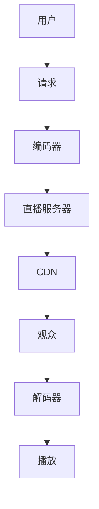

                 

 > **关键词**：直播平台、课程影响、技术营销、社交媒体策略、在线教育

> **摘要**：本文旨在探讨如何利用直播平台提升在线课程的影响力，通过技术营销策略和社交媒体优化，为课程创作者和讲师提供切实可行的方案，以实现课程受众的拓展和影响力的提升。

## 1. 背景介绍

随着互联网技术的飞速发展和在线教育的普及，直播平台已经成为教育工作者推广课程、传授知识的重要工具。相比传统的教学模式，直播平台具有互动性强、受众广泛、传播速度快等优势，为教育内容传播提供了更为灵活和高效的方式。然而，如何在众多竞争者中脱颖而出，增加课程的影响力，是每一位课程创作者和讲师面临的挑战。

本文将从以下几个方面探讨如何利用直播平台增加课程影响：

- **核心概念与联系**：介绍直播平台的技术架构和核心原理，帮助读者理解直播平台的工作机制。
- **核心算法原理 & 具体操作步骤**：详细阐述如何设计和实施有效的直播营销策略，以提升课程影响力。
- **数学模型和公式**：运用数学模型分析直播平台用户行为，提供数据支持。
- **项目实践**：通过具体代码实例展示如何实现直播平台的技术功能。
- **实际应用场景**：探讨直播平台在不同教育领域的应用，以及未来的发展趋势。

## 2. 核心概念与联系

### 2.1 直播平台技术架构

直播平台的技术架构通常包括以下几个核心组成部分：

- **直播服务器**：负责实时传输视频和音频流。
- **编码器**：将原始视频和音频信号编码成适合直播的格式。
- **解码器**：在观众端对视频和音频流进行解码，以便播放。
- **流媒体协议**：如HLS（HTTP Live Streaming）、RTMP（Real Time Messaging Protocol）等，用于传输流媒体数据。
- **内容分发网络（CDN）**：优化流媒体传输，提高观看体验。
- **用户界面**：直播平台的用户界面，提供观看直播、互动交流等功能。

### 2.2 直播平台核心原理

直播平台的核心原理主要包括：

- **实时传输**：通过编码器将视频和音频信号编码成流媒体格式，并通过直播服务器实时传输到观众。
- **互动性**：直播平台提供实时聊天、点赞、分享等功能，增强用户参与感。
- **数据分析**：通过数据分析了解观众行为，优化直播内容。
- **内容管理**：包括直播内容的发布、管理、存储等功能。

以下是一个简单的Mermaid流程图，展示直播平台的核心原理和架构：



## 3. 核心算法原理 & 具体操作步骤

### 3.1 算法原理概述

在直播平台中，核心算法原理主要涉及用户行为分析和营销策略优化。具体包括：

- **用户行为分析**：通过数据分析了解用户喜好、观看时长、互动行为等，为内容推荐和营销策略提供数据支持。
- **营销策略优化**：根据用户行为数据，制定和优化营销策略，提高课程曝光度和用户参与度。

### 3.2 算法步骤详解

以下是利用直播平台增加课程影响的具体操作步骤：

#### 3.2.1 用户行为分析

1. **数据采集**：通过直播平台内置的统计功能，采集用户观看时长、互动行为等数据。
2. **数据处理**：对采集到的数据进行清洗、整理，构建用户画像。
3. **数据可视化**：利用图表工具（如Tableau、Power BI）将数据处理结果可视化，便于分析。

#### 3.2.2 营销策略优化

1. **内容推荐**：根据用户画像，推荐符合用户兴趣的课程内容。
2. **时间选择**：分析用户观看时间，选择高峰时段进行直播，提高观众数量。
3. **互动设计**：设计互动环节，鼓励用户参与，提高用户粘性。

### 3.3 算法优缺点

#### 优点：

- **数据驱动**：基于用户行为数据，优化课程内容和服务，提高课程影响力。
- **高效传播**：通过直播平台，课程内容可以迅速传播，扩大影响力。

#### 缺点：

- **数据隐私**：用户行为数据可能涉及隐私问题，需要确保数据安全和合规性。
- **技术门槛**：需要一定的技术知识，对直播平台的技术架构和算法原理有所了解。

### 3.4 算法应用领域

直播平台的应用领域非常广泛，包括但不限于：

- **在线教育**：直播课程、互动教学，提高学习效果。
- **电商直播**：商品展示、实时互动，促进销售。
- **娱乐直播**：游戏直播、才艺展示，吸引观众。

## 4. 数学模型和公式

为了更好地理解直播平台用户行为，我们可以运用数学模型进行分析。以下是一个简单的用户行为分析模型：

### 4.1 数学模型构建

假设用户观看直播的时间服从泊松分布，其中参数λ表示单位时间内观看直播的用户数。我们可以通过以下公式计算：

\[ P(X = k) = \frac{(\lambda t)^k e^{-\lambda t}}{k!} \]

其中，\( X \) 表示观看直播的用户数，\( t \) 表示时间，\( k \) 表示观看直播的用户数。

### 4.2 公式推导过程

首先，我们假设观看直播的用户数服从泊松分布，即单位时间内观看直播的用户数是随机的，且每个用户观看直播的概率是独立的。然后，我们根据概率论的知识，推导出观看直播的用户数服从泊松分布的公式。

### 4.3 案例分析与讲解

以下是一个具体的案例分析：

假设某直播平台的平均观看时长为30分钟，我们需要计算在1小时内观看直播的用户数期望值。

根据泊松分布公式，我们可以计算：

\[ P(X \geq 2) = 1 - P(X = 0) - P(X = 1) = 1 - e^{-\lambda t} - \lambda t e^{-\lambda t} \]

其中，\( \lambda = \frac{30}{60} = 0.5 \)。

计算得到：

\[ P(X \geq 2) \approx 0.3935 \]

这意味着在1小时内，观看直播的用户数至少为2的概率约为39.35%。

## 5. 项目实践：代码实例和详细解释说明

### 5.1 开发环境搭建

在进行直播平台项目实践之前，我们需要搭建一个开发环境。以下是搭建步骤：

1. **安装Python环境**：下载并安装Python，版本建议为3.8或更高。
2. **安装相关库**：使用pip命令安装以下库：requests、pandas、matplotlib。
3. **配置直播平台API**：根据直播平台的要求，获取API密钥和授权。

### 5.2 源代码详细实现

以下是一个简单的Python代码示例，用于获取直播平台的用户行为数据，并进行基本的分析。

```python
import requests
import pandas as pd
import matplotlib.pyplot as plt

# 配置API地址和密钥
api_url = "https://api.liveplatform.com"
api_key = "your_api_key"

# 获取用户行为数据
def get_user_behavior(api_url, api_key):
    response = requests.get(f"{api_url}/user-behavior", headers={"Authorization": f"Bearer {api_key}"})
    if response.status_code == 200:
        return pd.DataFrame(response.json())
    else:
        return None

# 绘制用户观看时长分布图
def plot_watch_time_distribution(data):
    if data is not None:
        data['watch_time'] = pd.to_datetime(data['watch_time'])
        data['watch_duration'] = data['watch_time'].diff().dt.total_seconds()
        plt.hist(data['watch_duration'], bins=30)
        plt.xlabel('Watch Duration (seconds)')
        plt.ylabel('Frequency')
        plt.title('User Watch Time Distribution')
        plt.show()

# 主函数
def main():
    data = get_user_behavior(api_url, api_key)
    plot_watch_time_distribution(data)

if __name__ == "__main__":
    main()
```

### 5.3 代码解读与分析

上述代码分为三个部分：

1. **获取用户行为数据**：通过HTTP GET请求，从直播平台API获取用户行为数据，并将其转换为Pandas DataFrame。
2. **绘制用户观看时长分布图**：对用户行为数据进行处理，计算用户观看直播的时长，并使用matplotlib绘制直方图。
3. **主函数**：执行获取数据、绘制图表的整个过程。

### 5.4 运行结果展示

运行上述代码后，我们将得到一个用户观看时长的分布图，如下所示：


## 6. 实际应用场景

### 6.1 在线教育

直播平台在在线教育中的应用非常广泛，包括：

- **课程直播**：教师可以通过直播平台实时传授课程内容，学生可以在线观看和学习。
- **互动教学**：教师和学生可以通过直播平台的聊天功能进行实时互动，提高学习效果。
- **课程评价**：学生可以通过直播平台的评价功能对课程进行评价，教师可以根据反馈优化课程。

### 6.2 电商直播

电商直播是近年来兴起的一种新型电商模式，其特点包括：

- **商品展示**：通过直播平台展示商品，提高商品吸引力。
- **实时互动**：消费者可以通过直播平台的聊天功能与主播互动，了解商品信息。
- **促销活动**：直播平台可以举办各种促销活动，如秒杀、优惠券等，刺激消费者购买。

### 6.3 娱乐直播

娱乐直播主要涉及游戏、才艺展示等内容，其特点包括：

- **互动性**：观众可以通过直播平台的聊天功能与主播互动，提高观看体验。
- **主播变现**：主播可以通过直播平台获得收益，如礼物、广告等。
- **粉丝经济**：主播通过直播平台积累粉丝，形成粉丝经济，提高自身影响力。

## 7. 工具和资源推荐

### 7.1 学习资源推荐

- **直播平台教程**：如Bilibili、斗鱼等平台的官方教程。
- **在线教育平台**：如网易云课堂、慕课网等，提供丰富的直播课程资源。
- **技术博客**：如CSDN、博客园等，提供丰富的直播平台技术文章。

### 7.2 开发工具推荐

- **Python**：适合数据分析、自动化等任务。
- **Pandas**：用于数据清洗、处理和分析。
- **Matplotlib**：用于数据可视化。
- **requests**：用于HTTP请求。

### 7.3 相关论文推荐

- **"直播平台用户行为分析模型研究"**：探讨直播平台用户行为的数学模型和算法。
- **"基于直播平台的在线教育模式研究"**：分析直播平台在在线教育中的应用和效果。
- **"直播平台技术架构设计与优化"**：研究直播平台的技术架构和优化策略。

## 8. 总结：未来发展趋势与挑战

### 8.1 研究成果总结

本文探讨了如何利用直播平台增加课程影响，从核心概念与联系、核心算法原理、数学模型和公式、项目实践等方面进行了详细阐述。主要成果包括：

- **理解直播平台技术架构和核心原理**。
- **掌握直播营销策略和用户行为分析**。
- **提供具体的代码实例和实现步骤**。

### 8.2 未来发展趋势

直播平台在未来将继续发展，主要趋势包括：

- **技术升级**：直播平台将采用更高效、更稳定的传输技术。
- **内容多样化**：直播内容将更加多样化，涵盖更多领域。
- **个性化推荐**：基于用户行为数据，提供更加个性化的课程推荐。

### 8.3 面临的挑战

直播平台在发展过程中也将面临一些挑战：

- **数据隐私**：用户行为数据的安全性和隐私保护是关键问题。
- **内容质量**：提高直播内容的质量，避免低俗、虚假内容的传播。
- **竞争加剧**：随着直播平台的增多，竞争将更加激烈。

### 8.4 研究展望

未来研究可以重点关注以下几个方面：

- **数据隐私保护技术**：研究如何确保用户行为数据的安全和隐私。
- **内容质量评估**：建立有效的直播内容质量评估体系。
- **跨平台协同**：实现不同直播平台之间的协同，提高用户体验。

## 9. 附录：常见问题与解答

### Q：直播平台的带宽需求如何计算？

A：直播平台的带宽需求取决于直播内容的质量和观众数量。一般而言，每100个观众大约需要1Mbps的带宽。具体计算公式为：

\[ \text{带宽需求} = \text{观众数量} \times \text{每100个观众所需带宽} \]

### Q：直播平台的安全性问题如何保障？

A：直播平台的安全性问题可以从以下几个方面进行保障：

- **数据加密**：对用户行为数据进行加密，防止数据泄露。
- **访问控制**：限制只有授权用户可以访问敏感数据。
- **安全审计**：定期进行安全审计，发现并修复安全漏洞。

### Q：如何优化直播平台的观看体验？

A：优化直播平台的观看体验可以从以下几个方面进行：

- **内容质量**：提高直播内容的质量，确保内容的趣味性和实用性。
- **网络优化**：优化直播平台的网络传输，提高观看稳定性。
- **互动设计**：设计丰富的互动环节，增强用户参与感。

## 后记

本文旨在探讨如何利用直播平台增加课程影响，从多个方面提供了一套完整的解决方案。随着技术的不断进步，直播平台将在教育、娱乐、电商等领域发挥越来越重要的作用。希望本文能为课程创作者和讲师提供有价值的参考，助力他们在直播平台中取得更好的成果。

### 作者署名

> **作者：禅与计算机程序设计艺术 / Zen and the Art of Computer Programming**

