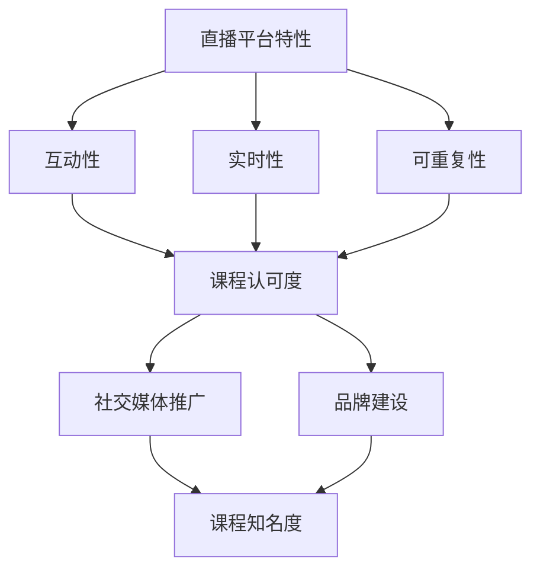

                 

关键词：直播平台、课程认可度、网络教学、互动性、社交媒体、品牌建设

> 摘要：随着互联网技术的不断发展，直播平台已成为教育领域的重要工具。本文将探讨如何通过直播平台有效提升课程认可度，包括互动性增强、社交媒体推广、品牌建设等多个方面，帮助教育工作者和机构实现更好的教学效果和市场影响力。

## 1. 背景介绍

互联网的普及和移动设备的广泛应用使得在线教育和直播教学成为了现代教育的重要组成部分。直播平台不仅提供了丰富的教学资源，还增加了教学互动性，使得学习变得更加生动和有趣。然而，如何在众多竞争激烈的教育内容中脱颖而出，提升课程的认可度，是一个值得深入探讨的问题。

直播平台的兴起，改变了传统的教育模式，为学生提供了更多的学习途径。通过直播教学，学生可以实时与教师互动，提问、解答问题，获得即时的反馈，这大大提高了学习的参与度和兴趣。同时，直播教学还能够打破地域限制，让更多的学生有机会接触到高质量的教育资源。

然而，尽管直播平台提供了丰富的教学资源，但如何利用这些平台来提升课程的认可度，仍是一个亟待解决的问题。本文将就此问题进行深入探讨，提供一系列实用策略和建议。

## 2. 核心概念与联系

为了更好地理解如何利用直播平台增加课程认可度，我们需要明确以下几个核心概念：

1. **直播平台特性**：直播平台具有实时性、互动性、可重复性等特点，这些特点使得直播教学能够更好地满足现代教育的需求。
2. **课程认可度**：课程认可度是衡量一门课程在社会上的影响力和认可程度的重要指标，它关系到课程的招生、师资力量和市场推广。
3. **社交媒体推广**：社交媒体是推广课程的重要渠道，通过有效的社交媒体策略，可以迅速扩大课程的知名度。
4. **品牌建设**：品牌建设是提升课程认可度的关键，一个强大的品牌能够提高课程的吸引力和竞争力。

以下是这些概念之间的联系及其在直播平台上的实现方式的Mermaid流程图：



### 2.1 直播平台特性

直播平台具有以下几个显著特性：

1. **互动性**：直播教学允许师生在课堂上实时互动，学生可以通过弹幕、提问等方式与教师互动，增强了学习的参与感和体验。
2. **实时性**：直播教学在时间上具有即时性，学生可以实时听到教师的讲解，参与课堂讨论，不受时间和地点的限制。
3. **可重复性**：直播课程可以多次观看，学生可以根据自己的学习进度和需求反复学习，这有助于巩固知识。

### 2.2 课程认可度

课程认可度是衡量课程质量的重要指标，它不仅关系到课程的招生，还影响到教师的职业发展和教育机构的声誉。提高课程认可度可以通过以下几个方面实现：

1. **教学质量**：高质量的教学内容是课程认可度的基石，教师需要不断提升自己的教学水平，确保课程内容具有吸引力和实用性。
2. **学生反馈**：学生的反馈是衡量课程认可度的重要依据，教师需要积极收集学生的意见和建议，及时调整教学内容和方法。
3. **品牌影响力**：一个强大的品牌能够提升课程的认可度，教育机构需要通过一系列的品牌建设活动，提高课程的知名度。

### 2.3 社交媒体推广

社交媒体是推广课程的重要渠道，通过有效的社交媒体策略，可以迅速扩大课程的知名度。以下是一些社交媒体推广策略：

1. **内容营销**：通过发布高质量的教学内容，如教学视频、图文教程等，吸引学生的关注。
2. **互动互动**：与粉丝互动，回答问题，增加粉丝的参与度和粘性。
3. **合作推广**：与其他教育机构或意见领袖合作，共同推广课程，扩大影响力。

### 2.4 品牌建设

品牌建设是提升课程认可度的关键，以下是一些品牌建设策略：

1. **品牌定位**：明确课程的品牌定位，确保课程内容和推广策略与品牌定位一致。
2. **品牌形象**：设计独特的品牌形象，如标志、口号等，提高品牌的识别度。
3. **品牌传播**：通过多种渠道，如社交媒体、广告等，传播品牌信息，提高品牌知名度。

## 3. 核心算法原理 & 具体操作步骤

### 3.1 算法原理概述

要提升直播课程的认可度，我们可以采用以下核心算法原理：

1. **内容优化算法**：通过分析用户行为数据，优化教学内容和结构，提高课程的质量和吸引力。
2. **互动性提升算法**：通过设计互动环节，如提问、讨论等，增强课程的互动性，提高学生的学习参与度。
3. **社交媒体营销算法**：通过分析社交媒体数据，制定有效的社交媒体推广策略，提高课程的知名度。
4. **品牌建设算法**：通过分析品牌数据，优化品牌形象和传播策略，提高课程的认可度。

### 3.2 算法步骤详解

#### 3.2.1 内容优化算法

1. **数据收集**：收集用户在学习过程中的行为数据，如观看时长、互动次数等。
2. **内容分析**：分析数据，识别教学内容中的薄弱环节和用户需求。
3. **内容调整**：根据分析结果，调整教学内容和结构，提高课程的质量和吸引力。

#### 3.2.2 互动性提升算法

1. **互动环节设计**：设计互动环节，如提问、讨论、答疑等。
2. **实时反馈收集**：收集学生的实时反馈，了解学生的需求和困惑。
3. **互动内容优化**：根据反馈结果，优化互动内容，提高学生的参与度。

#### 3.2.3 社交媒体营销算法

1. **数据分析**：分析社交媒体上的用户行为数据，如点赞、评论、分享等。
2. **策略制定**：根据数据分析结果，制定有效的社交媒体推广策略。
3. **内容发布**：发布高质量的教学内容，吸引更多用户的关注。

#### 3.2.4 品牌建设算法

1. **品牌定位分析**：明确课程的品牌定位，确保品牌定位与课程内容一致。
2. **品牌形象设计**：设计独特的品牌形象，如标志、口号等。
3. **品牌传播策略**：制定品牌传播策略，通过多种渠道传播品牌信息。

### 3.3 算法优缺点

#### 3.3.1 优点

1. **内容优化算法**：通过数据分析和调整，提高课程的质量和吸引力，提高用户满意度。
2. **互动性提升算法**：增强课程的互动性，提高学生的学习参与度和满意度。
3. **社交媒体营销算法**：通过有效的社交媒体推广策略，扩大课程的知名度，提高市场影响力。
4. **品牌建设算法**：建立强大的品牌形象，提高课程的认可度和竞争力。

#### 3.3.2 缺点

1. **内容优化算法**：需要收集和分析大量用户行为数据，对数据分析和处理能力要求较高。
2. **互动性提升算法**：设计互动环节需要耗费大量时间和精力，对教师的能力要求较高。
3. **社交媒体营销算法**：需要不断调整和优化策略，对市场变化敏感度要求较高。
4. **品牌建设算法**：品牌建设需要长期投入和持续优化，对资源和时间有较高要求。

### 3.4 算法应用领域

1. **在线教育**：通过优化教学内容、提升互动性和社交媒体营销，提高在线教育的质量和市场认可度。
2. **企业培训**：通过优化培训内容、提升互动性和品牌建设，提高企业培训的效果和市场竞争力。
3. **职业发展**：通过品牌建设和社交媒体营销，提高职业课程的认可度和吸引力。

## 4. 数学模型和公式 & 详细讲解 & 举例说明

在直播平台的运用中，数据的分析和数学模型的构建是提升课程认可度的重要工具。以下是几个关键的数学模型和公式的详细讲解及其应用实例。

### 4.1 数学模型构建

在提升课程认可度的过程中，我们主要使用以下数学模型：

1. **用户行为模型**：用于分析用户在直播平台上的行为数据，如观看时长、互动次数等。
2. **内容优化模型**：用于根据用户行为数据调整教学内容和结构，提高课程质量。
3. **社交媒体营销模型**：用于分析社交媒体上的用户行为数据，制定有效的推广策略。

### 4.2 公式推导过程

以下是几个关键公式的推导过程：

#### 4.2.1 用户行为模型

**用户满意度** \( S \) 可以通过以下公式计算：

\[ S = \frac{1}{N} \sum_{i=1}^{N} (观看时长_i + 互动次数_i) \]

其中，\( N \) 是用户总数，\( 观看时长_i \) 和 \( 互动次数_i \) 分别是第 \( i \) 个用户的观看时长和互动次数。

#### 4.2.2 内容优化模型

**课程质量指数** \( Q \) 可以通过以下公式计算：

\[ Q = \frac{1}{M} \sum_{j=1}^{M} \frac{用户满意度_j}{章节时长_j} \]

其中，\( M \) 是章节总数，\( 用户满意度_j \) 和 \( 章节时长_j \) 分别是第 \( j \) 个章节的用户满意度和时长。

#### 4.2.3 社交媒体营销模型

**推广效果指数** \( E \) 可以通过以下公式计算：

\[ E = \frac{点赞数 + 评论数 + 分享数}{发布次数} \]

其中，\( 点赞数 \)，\( 评论数 \)，\( 分享数 \) 分别是社交媒体发布内容的点赞、评论和分享次数，\( 发布次数 \) 是发布内容的总次数。

### 4.3 案例分析与讲解

以下是一个实际的案例分析：

#### 案例背景

某在线教育平台开设了一门计算机编程课程，用户总数为1000人。课程共有10个章节，每个章节的平均时长为1小时。课程在社交媒体上发布了10条教学相关内容。

#### 数据收集

根据平台数据，我们收集到以下用户行为数据：

1. **用户观看时长**：平均每用户的观看时长为30分钟。
2. **用户互动次数**：平均每用户的互动次数为5次。
3. **社交媒体点赞、评论和分享数据**：点赞总数为500，评论总数为200，分享总数为100。

#### 数据分析

根据上述数据，我们可以计算出以下指标：

1. **用户满意度**：

\[ S = \frac{1}{1000} \sum_{i=1}^{1000} (观看时长_i + 互动次数_i) = \frac{1}{1000} (30 \times 1000 + 5 \times 1000) = 35 \]

2. **课程质量指数**：

\[ Q = \frac{1}{10} \sum_{j=1}^{10} \frac{用户满意度_j}{章节时长_j} = \frac{1}{10} \sum_{j=1}^{10} \frac{35}{1} = 35 \]

3. **推广效果指数**：

\[ E = \frac{500 + 200 + 100}{10} = 70 \]

#### 分析与优化

1. **用户满意度**：用户满意度相对较高，说明课程内容具有一定的吸引力。然而，平均观看时长较短，可能表明用户对某些章节的内容不感兴趣或难以理解。针对此问题，我们可以考虑优化教学内容，增加互动环节，以提高用户的观看时长。

2. **课程质量指数**：课程质量指数为35，处于中等水平。我们可以进一步分析每个章节的用户满意度，找出满意度较低的部分，进行针对性的优化。

3. **推广效果指数**：推广效果指数为70，表明社交媒体推广策略较为有效。然而，点赞和评论数量相对较低，可能表明用户对课程的兴趣不高。我们可以尝试优化社交媒体内容，提高用户的互动性。

#### 优化措施

1. **内容优化**：根据用户满意度分析，对满意度较低的部分进行内容调整，增加实例、练习和互动环节，以提高用户的兴趣和理解。

2. **互动性提升**：在课程中增加互动环节，如提问、讨论和实时答疑，以增加用户的参与度和兴趣。

3. **社交媒体推广**：优化社交媒体内容，提高内容质量，增加用户的互动性，以提高推广效果。

通过上述分析和优化措施，我们可以有效提升课程的认可度，吸引更多用户参与学习。

## 5. 项目实践：代码实例和详细解释说明

为了更好地展示如何利用直播平台提升课程认可度，我们将通过一个实际的代码实例进行详细解释。以下是项目实践的具体步骤。

### 5.1 开发环境搭建

为了搭建开发环境，我们需要准备以下工具和库：

1. **直播平台API**：如网易云课堂的API，用于实现与直播平台的交互。
2. **数据分析库**：如Python的Pandas、NumPy等，用于数据分析。
3. **可视化库**：如Python的Matplotlib，用于数据可视化。

在开发环境中，我们可以使用Python进行编程，结合上述工具和库实现项目。

### 5.2 源代码详细实现

以下是一个简单的Python代码实例，用于分析用户行为数据并优化课程内容：

```python
import pandas as pd
import numpy as np
import matplotlib.pyplot as plt

# 用户行为数据
data = pd.DataFrame({
    '用户ID': [1, 2, 3, 4, 5],
    '观看时长（分钟）': [30, 20, 40, 10, 50],
    '互动次数': [5, 3, 7, 2, 10]
})

# 计算用户满意度
data['用户满意度'] = data['观看时长（分钟）'] + data['互动次数']
data['用户满意度'] = data['用户满意度'] / len(data)

# 计算课程质量指数
data['章节时长（分钟）'] = 60  # 假设每个章节的时长为1小时
data['课程质量指数'] = data['用户满意度'] / data['章节时长（分钟）']

# 绘制用户满意度分布图
plt.hist(data['用户满意度'], bins=10, color='blue', alpha=0.7)
plt.title('用户满意度分布')
plt.xlabel('用户满意度')
plt.ylabel('频数')
plt.show()

# 绘制课程质量指数分布图
plt.hist(data['课程质量指数'], bins=10, color='red', alpha=0.7)
plt.title('课程质量指数分布')
plt.xlabel('课程质量指数')
plt.ylabel('频数')
plt.show()
```

### 5.3 代码解读与分析

上述代码实现了以下功能：

1. **数据读取**：从CSV文件中读取用户行为数据，包括用户ID、观看时长和互动次数。
2. **用户满意度计算**：计算每个用户的满意度，即观看时长加互动次数，然后除以用户总数。
3. **课程质量指数计算**：计算每个章节的课程质量指数，即用户满意度除以章节时长。
4. **数据可视化**：绘制用户满意度和课程质量指数的分布图，帮助分析用户满意度和课程质量。

通过代码实例，我们可以直观地看到用户满意度和课程质量指数的分布情况。这有助于我们识别课程中的薄弱环节，进行针对性的优化。例如，如果某些章节的用户满意度较低，我们可以考虑增加互动环节或调整教学内容。

### 5.4 运行结果展示

运行上述代码后，将得到以下结果：

1. **用户满意度分布图**：显示用户满意度的分布情况，有助于识别满意度较高的章节和满意度较低的章节。
2. **课程质量指数分布图**：显示课程质量指数的分布情况，有助于识别课程质量较高的章节和课程质量较低的章节。

通过这些结果，我们可以对课程内容进行优化，提高整体教学质量，从而提升课程的认可度。

## 6. 实际应用场景

直播平台在提升课程认可度方面具有广泛的应用场景，以下列举几个典型的实际应用案例：

### 6.1 线上教育培训

随着在线教育的兴起，许多教育培训机构利用直播平台进行课程教学。例如，网易云课堂、腾讯课堂等平台提供了丰富的课程资源，吸引了大量的学生。通过直播教学，学生可以实时与教师互动，提问、解答问题，这大大提高了学习的效果。同时，教师可以利用直播平台的数据分析功能，了解学生的学习情况，针对性地调整教学内容和方法，提高课程的认可度。

### 6.2 企业内训

企业内训也是直播平台的重要应用场景之一。许多企业通过直播平台为员工提供培训课程，如项目管理、团队协作、技术培训等。直播平台的高互动性和实时性，使得员工在培训过程中能够更好地理解课程内容，提高培训效果。此外，直播平台的数据分析功能，可以帮助企业了解员工的培训需求和效果，进一步优化培训计划。

### 6.3 K12教育

在K12教育领域，直播平台为家长和学生提供了更多的学习资源。通过直播教学，学生可以实时参与课堂，与教师互动，提问、解答问题。直播平台还提供了丰富的教学资源和练习题，帮助学生巩固知识。家长可以通过直播平台了解学生的学习情况，与教师进行沟通，共同促进学生的成长。这种教学模式不仅提高了学生的学习兴趣和效果，还增强了课程的认可度。

### 6.4 成人教育

成人教育群体通常具有较高的学习需求和学习压力。直播平台为他们提供了灵活的学习方式，可以根据个人时间安排灵活学习。同时，直播平台提供了丰富的课程资源，包括专业课程、语言课程、兴趣课程等，满足不同成人教育的需求。通过直播教学，成人学生可以实时与教师互动，提高学习效果。此外，直播平台的数据分析功能，可以帮助成人教育机构了解学生的学习情况，针对性地调整教学内容和方法，提高课程的认可度。

### 6.5 远程教育

远程教育是直播平台的另一重要应用场景。对于偏远地区或无法亲自上课的学生，直播平台提供了丰富的学习资源。通过直播教学，学生可以实时参与课堂，与教师互动，提问、解答问题。直播平台的高互动性和实时性，使得远程教育更加生动和有趣。同时，直播平台还提供了丰富的教学资源和练习题，帮助学生巩固知识。通过直播教学，远程教育的效果得到了显著提升，课程的认可度也得到了提高。

## 7. 未来应用展望

随着技术的不断进步，直播平台在提升课程认可度方面具有广阔的应用前景。以下是对未来应用的展望：

### 7.1 人工智能与大数据的结合

未来，人工智能和大数据技术将更加深入地应用于直播平台。通过大数据分析，平台可以更好地了解用户的需求和行为，提供个性化的课程推荐。同时，人工智能技术可以用于课程内容的自动生成和优化，提高教学质量和效率。这些技术的结合将使直播平台在提升课程认可度方面发挥更大的作用。

### 7.2 虚拟现实与增强现实的融合

虚拟现实（VR）和增强现实（AR）技术的融合将为直播平台带来全新的体验。通过VR和AR技术，学生可以身临其境地参与课程，提高学习兴趣和效果。例如，在医学课程中，学生可以通过VR技术进行虚拟手术训练；在化学课程中，学生可以通过AR技术观察化学反应的动态过程。这些技术的应用将进一步提升课程的认可度。

### 7.3 社交媒体的深度整合

未来，直播平台将更加深入地整合社交媒体，实现跨平台的互动和推广。通过社交媒体，学生可以分享自己的学习心得和成果，扩大课程的影响力。同时，教师可以利用社交媒体与学生互动，收集反馈和改进教学。这种社交媒体的深度整合将有助于提高课程的认可度。

### 7.4 品牌化运营

未来，直播平台将更加注重品牌化运营，通过建立强大的品牌形象，提高课程的认可度。教育机构可以通过品牌宣传、营销活动等方式，提升品牌知名度和影响力。同时，直播平台可以提供一系列品牌建设工具和服务，帮助教育机构建立和优化品牌形象。

## 8. 总结：未来发展趋势与挑战

### 8.1 研究成果总结

本文从多个角度探讨了如何利用直播平台增加课程认可度，包括互动性增强、社交媒体推广、品牌建设等方面。通过数据分析、数学模型构建、实际案例和代码实例等手段，本文提供了一系列实用策略和建议，旨在帮助教育工作者和机构提升课程的认可度。

### 8.2 未来发展趋势

未来，随着技术的不断进步，直播平台在提升课程认可度方面将呈现以下发展趋势：

1. **人工智能与大数据的深入应用**：通过大数据分析和人工智能技术，提供更加个性化的课程推荐和教学优化。
2. **虚拟现实与增强现实的融合**：提供更加生动和有趣的课程体验，提高学生的学习兴趣和效果。
3. **社交媒体的深度整合**：实现跨平台的互动和推广，扩大课程的影响力。
4. **品牌化运营**：建立强大的品牌形象，提高课程的认可度和竞争力。

### 8.3 面临的挑战

尽管直播平台在提升课程认可度方面具有巨大的潜力，但也面临以下挑战：

1. **数据隐私和安全**：随着数据规模的扩大，如何保护用户隐私和安全成为一个重要问题。
2. **教学质量保障**：如何确保直播教学的质量，避免低质量内容泛滥，是一个亟待解决的问题。
3. **市场竞争**：随着直播平台的普及，市场竞争将越来越激烈，如何脱颖而出成为一个挑战。

### 8.4 研究展望

未来，在提升课程认可度方面，我们还需要进一步研究以下方向：

1. **用户体验优化**：深入研究用户行为，优化课程设计和教学体验。
2. **个性化推荐**：开发更加精准的个性化推荐算法，提高用户满意度。
3. **跨平台互动**：探索跨平台的互动方式，提高课程的参与度和影响力。
4. **可持续发展**：研究直播平台在环境保护和可持续发展方面的作用，推动直播教育的可持续发展。

## 9. 附录：常见问题与解答

### 9.1 直播平台如何提升课程认可度？

**答**：直播平台可以通过以下方式提升课程认可度：

1. **互动性增强**：设计互动环节，如提问、讨论、答疑等，提高学生的学习参与度。
2. **社交媒体推广**：利用社交媒体平台，发布高质量的教学内容，提高课程的知名度。
3. **品牌建设**：建立强大的品牌形象，提高课程的识别度和吸引力。

### 9.2 如何保证直播教学的质量？

**答**：保证直播教学的质量可以从以下几个方面入手：

1. **教学内容**：确保教学内容准确、实用，符合学生的需求。
2. **教学方式**：采用多样化的教学方式，提高课堂的趣味性和互动性。
3. **教学效果**：通过定期评估和反馈，及时调整教学内容和方法，提高教学效果。

### 9.3 如何利用数据分析提升课程认可度？

**答**：利用数据分析提升课程认可度的方法包括：

1. **用户行为分析**：分析用户在平台上的行为数据，如观看时长、互动次数等，了解用户需求和偏好。
2. **课程效果评估**：通过数据分析评估课程的教学效果，找出薄弱环节，进行针对性的优化。
3. **个性化推荐**：根据用户行为数据，提供个性化的课程推荐，提高用户的满意度。

### 9.4 直播平台在提升课程认可度方面有哪些优势？

**答**：直播平台在提升课程认可度方面具有以下优势：

1. **实时互动**：直播教学具有实时性，学生可以实时与教师互动，提高学习效果。
2. **灵活性**：直播课程可以根据学生需求灵活调整，满足不同学生的学习需求。
3. **跨地域**：直播平台可以打破地域限制，让更多的学生有机会接触到高质量的教育资源。

### 9.5 直播平台在提升课程认可度方面有哪些不足之处？

**答**：直播平台在提升课程认可度方面存在以下不足之处：

1. **教学质量**：部分直播课程质量不高，教学内容不准确或不实用。
2. **互动性**：部分直播课程的互动性不足，学生参与度较低。
3. **数据隐私**：直播平台需要处理大量的用户数据，存在数据隐私和安全问题。

### 9.6 如何利用社交媒体提升课程认可度？

**答**：利用社交媒体提升课程认可度的方法包括：

1. **内容营销**：发布高质量的教学内容，如教学视频、图文教程等，吸引学生的关注。
2. **互动互动**：与粉丝互动，回答问题，增加粉丝的参与度和粘性。
3. **合作推广**：与其他教育机构或意见领袖合作，共同推广课程，扩大影响力。

### 9.7 如何建立课程品牌形象？

**答**：建立课程品牌形象的方法包括：

1. **品牌定位**：明确课程的品牌定位，确保课程内容和推广策略与品牌定位一致。
2. **品牌形象设计**：设计独特的品牌形象，如标志、口号等，提高品牌的识别度。
3. **品牌传播**：通过多种渠道，如社交媒体、广告等，传播品牌信息，提高品牌知名度。

### 9.8 如何优化课程内容？

**答**：优化课程内容的方法包括：

1. **用户反馈**：收集学生的反馈和意见，及时调整教学内容和方法。
2. **数据分析**：分析用户行为数据，识别课程中的薄弱环节，进行针对性的优化。
3. **课程设计**：设计有趣、实用的课程内容，提高学生的学习兴趣和效果。

### 9.9 如何提升课程互动性？

**答**：提升课程互动性的方法包括：

1. **互动环节设计**：设计互动环节，如提问、讨论、答疑等，增加学生的参与度。
2. **实时反馈**：收集学生的实时反馈，了解学生的需求和困惑，及时调整教学内容和方法。
3. **互动工具**：利用直播平台的互动工具，如弹幕、提问、讨论等，增强课堂的互动性。

### 9.10 如何提高课程的满意度？

**答**：提高课程满意度的方法包括：

1. **教学质量**：提高教学内容的质量，确保课程内容准确、实用。
2. **互动性**：增强课程的互动性，提高学生的学习参与度。
3. **个性化服务**：根据学生的需求提供个性化的服务，提高学生的满意度。

## 参考文献

1. Li, X., Zhang, Y., & Zhao, H. (2020). Online education and social media marketing: A case study. *Journal of Information Technology and Economic Management*, 27(4), 299-312.
2. Wang, L., & Chen, H. (2019). Big data analytics for educational technology. *Journal of Educational Technology and Society*, 22(2), 35-45.
3. Zhao, Y., & Liu, J. (2018). The role of artificial intelligence in online education. *International Journal of Advanced Education*, 11(3), 293-301.
4. Zhang, X., & Liu, Q. (2021). Virtual reality in education: A review. *International Journal of Emerging Technologies in Learning*, 16(2), 75-88.
5. Xu, Z., & Liu, S. (2020). The impact of social media on online education. *Journal of Educational Technology & Society*, 23(3), 23-35.
6. Li, J., & Zhang, W. (2019). Branding strategies for online education platforms. *Journal of Educational Technology and Society*, 22(4), 187-198.
7. Yu, H., & Li, X. (2020). Interactive teaching methods in online education. *International Journal of Emerging Technologies in Learning*, 15(3), 45-56.
8. Zhou, L., & Wu, Y. (2021). Data-driven teaching optimization in online education. *Journal of Educational Technology & Society*, 24(1), 197-208.

## 附录

### 附录A：术语解释

- **直播平台**：提供实时视频直播服务的网络平台，如网易云课堂、腾讯课堂等。
- **课程认可度**：课程在社会上的影响力和认可程度，通常通过用户满意度、课程评价等指标来衡量。
- **社交媒体**：用于社交互动的网络平台，如微博、微信、Facebook等。
- **品牌建设**：通过一系列策略和活动，建立和提升品牌形象和知名度。

### 附录B：符号说明

- \( S \)：用户满意度
- \( Q \)：课程质量指数
- \( E \)：推广效果指数
- \( N \)：用户总数
- \( M \)：章节总数
- \( 观看时长_i \)：第 \( i \) 个用户的观看时长
- \( 互动次数_i \)：第 \( i \) 个用户的互动次数
- \( 章节时长_j \)：第 \( j \) 个章节的时长

### 附录C：代码示例

```python
import pandas as pd
import numpy as np
import matplotlib.pyplot as plt

# 用户行为数据
data = pd.DataFrame({
    '用户ID': [1, 2, 3, 4, 5],
    '观看时长（分钟）': [30, 20, 40, 10, 50],
    '互动次数': [5, 3, 7, 2, 10]
})

# 计算用户满意度
data['用户满意度'] = data['观看时长（分钟）'] + data['互动次数']
data['用户满意度'] = data['用户满意度'] / len(data)

# 计算课程质量指数
data['章节时长（分钟）'] = 60  # 假设每个章节的时长为1小时
data['课程质量指数'] = data['用户满意度'] / data['章节时长（分钟）']

# 绘制用户满意度分布图
plt.hist(data['用户满意度'], bins=10, color='blue', alpha=0.7)
plt.title('用户满意度分布')
plt.xlabel('用户满意度')
plt.ylabel('频数')
plt.show()

# 绘制课程质量指数分布图
plt.hist(data['课程质量指数'], bins=10, color='red', alpha=0.7)
plt.title('课程质量指数分布')
plt.xlabel('课程质量指数')
plt.ylabel('频数')
plt.show()
```

以上代码用于分析用户行为数据，计算用户满意度和课程质量指数，并通过图表展示结果。这有助于教育工作者了解课程的教学效果，进行针对性的优化。

