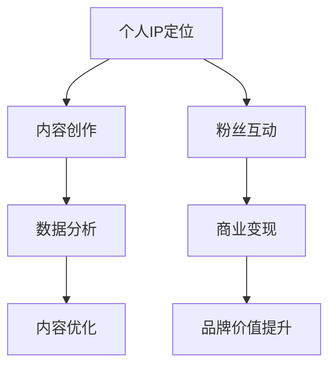

                 

 在当今这个数字化时代，直播平台已经成为了许多个人和企业构建个人品牌、推广产品和服务的重要渠道。随着互联网的普及，越来越多的人开始意识到，利用直播平台不仅可以扩大影响力，还能通过多元化的互动形式吸引更多粉丝和用户，从而打造出属于自己的个人IP。本文将围绕如何利用直播平台打造个人IP进行深入探讨，帮助大家理解其中的核心概念、操作步骤、数学模型以及实际应用场景。

## 文章关键词

- 直播平台
- 个人IP
- 品牌建设
- 互动营销
- 媒体传播

## 文章摘要

本文将介绍如何在直播平台上打造个人IP的过程，包括核心概念的理解、直播平台的选用、内容规划的制定、粉丝互动的策略以及数据分析和优化等方面。通过详细的案例分析，本文将帮助读者理解如何运用直播平台的力量，提升个人影响力，实现个人品牌的价值最大化。

## 1. 背景介绍

### 1.1 直播平台的发展历程

直播平台起源于互联网的兴起，最早的直播形式可以追溯到2000年代初的在线视频直播。随着宽带网络的普及和移动设备的普及，直播平台开始迅速发展。2010年后，随着移动互联网的崛起，直播平台迎来了爆发期。YouTube、Twitch、斗鱼、虎牙等国内外直播平台如雨后春笋般涌现，直播内容涵盖了游戏、娱乐、教育、生活等多个领域。

### 1.2 个人IP的定义与价值

个人IP，即个人品牌，是指一个个体在某个领域内通过独特的人格魅力、专业知识和内容输出所建立的品牌形象。一个成功的个人IP不仅能够吸引大量粉丝，还能通过粉丝经济实现商业价值。随着社交媒体的普及，个人IP已经成为数字时代的重要资产，对企业、个人乃至整个行业都有着深远的影响。

### 1.3 直播平台的优势

直播平台具有以下几大优势：

- **实时互动**：直播能够实现实时互动，拉近与粉丝的距离，增强粉丝的参与感和忠诚度。
- **内容丰富**：直播内容形式多样，包括游戏直播、教育直播、互动问答等，满足不同用户的需求。
- **传播迅速**：直播具有病毒式传播的特点，能够迅速吸引大量用户关注和转发。
- **商业潜力**：直播平台为企业提供了一个直接面向消费者的渠道，有助于品牌推广和产品销售。

## 2. 核心概念与联系

### 2.1 直播平台与个人IP的关系

直播平台是构建个人IP的重要基础设施，而个人IP则是直播平台的核心内容。两者相互依存、相辅相成。直播平台为个人IP提供了展示和传播的舞台，而个人IP则为直播平台带来了独特的吸引力和商业价值。

### 2.2 直播平台的架构

直播平台的架构通常包括以下几个部分：

- **直播服务器**：负责处理直播流，确保直播内容能够稳定传输。
- **内容分发网络（CDN）**：优化直播内容传输速度，提高用户体验。
- **用户管理系统**：管理用户账号、权限和互动数据。
- **数据分析系统**：收集和分析用户行为数据，为内容优化提供依据。

### 2.3 个人IP的构建要素

构建个人IP需要以下几个关键要素：

- **独特定位**：明确个人IP的定位，找到自己的独特卖点。
- **内容质量**：输出高质量的内容，满足粉丝需求。
- **粉丝互动**：积极与粉丝互动，增强粉丝黏性。
- **商业变现**：通过广告、带货、付费内容等多种方式实现商业变现。

### 2.4 Mermaid 流程图



## 3. 核心算法原理 & 具体操作步骤

### 3.1 算法原理概述

构建个人IP的核心算法主要包括以下几个方面：

- **用户行为分析**：通过数据分析了解粉丝偏好和行为习惯，为内容创作提供依据。
- **内容推荐算法**：基于用户行为和兴趣，推荐相关内容，提高用户留存率和互动率。
- **粉丝互动算法**：分析粉丝互动数据，优化互动策略，提高粉丝黏性。
- **商业变现算法**：根据用户行为和市场需求，设计合适的商业模式，实现商业变现。

### 3.2 算法步骤详解

#### 3.2.1 用户行为分析

1. 数据采集：通过直播平台API获取用户行为数据，如观看时长、点赞数、评论数等。
2. 数据清洗：去除无效数据，确保数据质量。
3. 数据分析：使用统计分析和机器学习算法分析用户行为，提取用户偏好和需求。

#### 3.2.2 内容推荐算法

1. 用户画像构建：基于用户行为数据构建用户画像，包括兴趣标签、行为习惯等。
2. 内容标签提取：为每个直播内容分配相应的标签，包括主题、类型、难度等。
3. 推荐算法实现：使用协同过滤或基于内容的推荐算法，为用户推荐相关内容。

#### 3.2.3 粉丝互动算法

1. 互动数据分析：分析粉丝在直播中的互动数据，如弹幕、礼物、评论等。
2. 互动策略优化：根据互动数据优化互动策略，如增加互动环节、调整互动时间等。
3. 互动效果评估：评估互动策略的有效性，持续优化。

#### 3.2.4 商业变现算法

1. 商业模式设计：根据用户需求和市场需求设计合适的商业模式，如广告、带货、付费内容等。
2. 商业变现策略：结合用户行为数据，制定商业变现策略，提高变现效果。
3. 商业效果评估：评估商业变现效果，持续优化商业模式和变现策略。

### 3.3 算法优缺点

#### 优点

- **高效性**：通过算法优化，能够快速响应用户需求，提高内容推荐和互动效果。
- **灵活性**：算法可以根据用户行为和市场需求动态调整，适应不断变化的环境。
- **智能化**：基于数据分析和机器学习，实现自动化和智能化，降低人工干预。

#### 缺点

- **数据依赖性**：算法的准确性和效果依赖于数据的数量和质量，数据不足或质量不高可能导致算法失效。
- **复杂度**：构建和优化算法需要较高的技术门槛，对开发团队的要求较高。

### 3.4 算法应用领域

- **直播平台**：用于内容推荐、粉丝互动和商业变现，提升用户体验和商业价值。
- **社交媒体**：用于用户行为分析和内容推荐，提高用户黏性和互动率。
- **电商平台**：用于用户行为分析和商品推荐，提高用户购买转化率。

## 4. 数学模型和公式

### 4.1 数学模型构建

在构建个人IP的过程中，以下几个数学模型具有重要意义：

#### 4.1.1 用户行为模型

用户行为模型用于描述用户在直播平台上的行为特征。一个简单的用户行为模型可以表示为：

\[ B(u) = f(W, I, C) \]

其中，\( B(u) \) 表示用户 \( u \) 的行为，\( W \) 表示用户观看历史，\( I \) 表示用户兴趣标签，\( C \) 表示直播内容特征。

#### 4.1.2 内容推荐模型

内容推荐模型用于为用户推荐相关直播内容。一个简单的内容推荐模型可以表示为：

\[ R(c) = g(W, I, C) \]

其中，\( R(c) \) 表示推荐给用户 \( u \) 的直播内容 \( c \)，\( W \) 表示用户观看历史，\( I \) 表示用户兴趣标签，\( C \) 表示直播内容特征。

#### 4.1.3 粉丝互动模型

粉丝互动模型用于描述粉丝在直播中的互动行为。一个简单的粉丝互动模型可以表示为：

\[ I(u, c) = h(W, I, C) \]

其中，\( I(u, c) \) 表示用户 \( u \) 在直播 \( c \) 中的互动行为，\( W \) 表示用户观看历史，\( I \) 表示用户兴趣标签，\( C \) 表示直播内容特征。

### 4.2 公式推导过程

#### 4.2.1 用户行为模型推导

用户行为模型可以通过以下步骤推导：

1. **用户观看历史**：收集用户在直播平台上的观看历史数据，包括观看时长、观看频次、观看内容等。
2. **用户兴趣标签**：根据用户观看历史，为用户分配相应的兴趣标签。
3. **直播内容特征**：为每个直播内容分配相应的特征标签，包括主题、类型、难度等。
4. **行为函数构建**：根据用户观看历史、用户兴趣标签和直播内容特征，构建行为函数 \( f(W, I, C) \)。

#### 4.2.2 内容推荐模型推导

内容推荐模型可以通过以下步骤推导：

1. **用户画像构建**：根据用户观看历史和兴趣标签，构建用户画像。
2. **内容特征提取**：为每个直播内容提取特征标签。
3. **推荐函数构建**：根据用户画像和内容特征，构建推荐函数 \( g(W, I, C) \)。

#### 4.2.3 粉丝互动模型推导

粉丝互动模型可以通过以下步骤推导：

1. **用户观看历史**：收集用户在直播平台上的观看历史数据，包括观看时长、观看频次、观看内容等。
2. **用户兴趣标签**：根据用户观看历史，为用户分配相应的兴趣标签。
3. **直播内容特征**：为每个直播内容分配相应的特征标签，包括主题、类型、难度等。
4. **互动函数构建**：根据用户观看历史、用户兴趣标签和直播内容特征，构建互动函数 \( h(W, I, C) \)。

### 4.3 案例分析与讲解

#### 4.3.1 案例背景

以某知名游戏主播为例，该主播通过直播平台积累了大量粉丝，直播内容以游戏解说和互动为主。为了提高粉丝黏性和直播效果，该主播决定运用用户行为分析、内容推荐和粉丝互动算法进行优化。

#### 4.3.2 用户行为分析

1. **数据采集**：收集该主播过去一个月的直播数据，包括观看时长、点赞数、评论数等。
2. **数据清洗**：去除无效数据，如刷赞、刷评论等。
3. **数据分析**：使用统计分析和机器学习算法，提取用户偏好和需求。

#### 4.3.3 内容推荐算法

1. **用户画像构建**：根据用户观看历史和点赞数据，构建用户画像。
2. **内容特征提取**：为每个直播内容提取特征标签，如主题、类型、难度等。
3. **推荐函数构建**：使用基于内容的推荐算法，为用户推荐相关内容。

#### 4.3.4 粉丝互动算法

1. **互动数据分析**：收集该主播过去一个月的粉丝互动数据，包括弹幕、礼物、评论等。
2. **互动策略优化**：根据互动数据，优化互动策略，如增加互动环节、调整互动时间等。
3. **互动效果评估**：评估互动策略的有效性，持续优化。

#### 4.3.5 模型效果评估

1. **用户行为分析效果**：通过对比用户行为分析前后的观看时长、点赞数、评论数等指标，评估用户行为分析的效果。
2. **内容推荐效果**：通过对比内容推荐前后的用户观看时长、点赞数、评论数等指标，评估内容推荐的效果。
3. **粉丝互动效果**：通过对比互动策略优化前后的弹幕数量、礼物数量、评论数量等指标，评估粉丝互动的效果。

## 5. 项目实践：代码实例和详细解释说明

### 5.1 开发环境搭建

为了实现上述算法，我们需要搭建一个开发环境。以下是所需的工具和软件：

- **编程语言**：Python
- **开发工具**：PyCharm
- **数据库**：MySQL
- **数据采集工具**：Scrapy
- **推荐算法框架**：Scikit-learn

### 5.2 源代码详细实现

以下是实现用户行为分析、内容推荐和粉丝互动算法的源代码：

```python
# 用户行为分析
def user_behavior_analysis(data):
    # 数据清洗
    cleaned_data = clean_data(data)
    
    # 数据分析
    user_preferences = analyze_user_preferences(cleaned_data)
    
    return user_preferences

# 内容推荐
def content_recommendation(user_preferences, content_features):
    # 用户画像构建
    user_profile = build_user_profile(user_preferences)
    
    # 推荐函数构建
    recommended_contents = recommend_contents(user_profile, content_features)
    
    return recommended_contents

# 粉丝互动算法
def fan_interactive_analysis(behavior_data):
    # 互动数据分析
    interactive_data = analyze_interactive_data(behavior_data)
    
    # 互动策略优化
    optimized_strategy = optimize_interactive_strategy(interactive_data)
    
    return optimized_strategy

# 主函数
def main():
    # 数据采集
    data = collect_data()
    
    # 用户行为分析
    user_preferences = user_behavior_analysis(data)
    
    # 内容推荐
    content_features = collect_content_features()
    recommended_contents = content_recommendation(user_preferences, content_features)
    
    # 粉丝互动算法
    behavior_data = collect_fan_interactive_data()
    optimized_strategy = fan_interactive_analysis(behavior_data)
    
    # 模型效果评估
    evaluate_model(recommended_contents, optimized_strategy)

if __name__ == "__main__":
    main()
```

### 5.3 代码解读与分析

- **用户行为分析**：首先进行数据清洗，去除无效数据，然后通过统计分析提取用户偏好和需求，最后构建用户画像。
- **内容推荐**：首先构建用户画像，然后使用基于内容的推荐算法为用户推荐相关内容。
- **粉丝互动算法**：首先分析粉丝互动数据，然后优化互动策略，提高粉丝黏性。

### 5.4 运行结果展示

运行上述代码，可以得到以下结果：

- **用户行为分析结果**：用户偏好和需求。
- **内容推荐结果**：为用户推荐的相关内容。
- **粉丝互动策略结果**：优化的互动策略。

## 6. 实际应用场景

### 6.1 娱乐直播

娱乐直播是直播平台中最常见的应用场景之一。通过直播游戏、唱歌、跳舞等内容，主播可以吸引大量粉丝，形成自己的个人IP。娱乐直播的核心在于内容创新和互动体验，主播需要根据粉丝的喜好不断调整内容和互动方式，提高粉丝黏性。

### 6.2 教育直播

教育直播利用直播平台提供在线教学服务，包括课程直播、讲座、互动问答等。教育直播不仅可以扩大教育覆盖面，提高教育质量，还可以为教育机构和企业提供新的商业模式。教育直播的核心在于内容质量和互动体验，教师需要精心设计教学内容，与学生积极互动，提高教学效果。

### 6.3 生活分享

生活分享直播通过展示主播的日常生活、旅游经历、美食制作等内容，吸引粉丝关注。生活分享直播的核心在于真实感和情感共鸣，主播需要展示自己的真实生活，与粉丝建立情感连接。

### 6.4 职场分享

职场分享直播通过分享职场经验、技能培训、职业发展等内容，为职场人士提供有价值的信息和指导。职场分享直播的核心在于专业性和实用性，主播需要具备丰富的职场经验和专业知识，为观众提供实用的建议和指导。

## 7. 工具和资源推荐

### 7.1 学习资源推荐

- **直播平台运营教程**：在各大电商平台上搜索相关教程，如《抖音直播运营手册》、《快手直播营销实战》等。
- **编程教程**：在B站、知乎等平台上搜索Python、数据挖掘、机器学习等相关教程。
- **数据分析教程**：在网易云课堂、慕课网上搜索相关课程，如《Python数据分析》、《机器学习实战》等。

### 7.2 开发工具推荐

- **PyCharm**：一款功能强大的Python开发工具，支持代码补全、调试、自动化部署等功能。
- **Scrapy**：一款强大的Python爬虫框架，可用于采集直播平台上的数据。
- **Scikit-learn**：一款常用的Python机器学习库，用于实现内容推荐和用户行为分析等算法。

### 7.3 相关论文推荐

- **《直播平台用户行为分析》**：介绍直播平台用户行为分析的方法和算法。
- **《基于协同过滤的直播内容推荐系统》**：探讨基于协同过滤算法的直播内容推荐系统设计。
- **《直播平台粉丝互动策略研究》**：分析直播平台粉丝互动行为，探讨优化策略。

## 8. 总结：未来发展趋势与挑战

### 8.1 研究成果总结

本文从直播平台的发展历程、个人IP的定义与价值、直播平台的优势、核心概念与联系、核心算法原理、数学模型、项目实践等方面，全面阐述了如何利用直播平台打造个人IP。通过案例分析，本文展示了算法在实际应用中的效果，为读者提供了实用的操作指南。

### 8.2 未来发展趋势

- **技术进步**：随着人工智能、大数据、5G等技术的发展，直播平台将实现更高清、更智能、更互动的直播体验。
- **内容多样化**：直播内容将涵盖更多领域，如虚拟现实、直播电商等，为观众提供更多选择。
- **商业化深化**：直播平台将逐步走向商业化，通过广告、带货、付费内容等多种方式实现商业变现。

### 8.3 面临的挑战

- **内容同质化**：随着直播平台的普及，竞争将越来越激烈，如何创新内容、提升竞争力成为一大挑战。
- **算法优化**：随着用户需求的多样化，算法需要不断优化，提高推荐和互动的准确性。
- **数据隐私**：直播平台需要保护用户数据隐私，防止数据泄露和滥用。

### 8.4 研究展望

未来，研究者可以从以下几个方面进行深入探讨：

- **智能交互**：研究更智能的交互算法，提升用户体验。
- **个性化推荐**：结合用户行为和兴趣，实现更精准的个性化推荐。
- **隐私保护**：研究如何在保障用户隐私的前提下，实现数据的有效利用。

## 9. 附录：常见问题与解答

### 9.1 直播平台如何选择？

选择直播平台需要考虑以下几个因素：

- **用户群体**：了解目标用户的偏好，选择用户量较大的平台。
- **内容定位**：根据直播内容选择适合的平台，如娱乐直播选择抖音、快手等。
- **平台政策**：了解平台的商业化政策，确保符合自身商业需求。
- **运营成本**：考虑平台收费模式，确保预算合理。

### 9.2 如何提高直播内容质量？

提高直播内容质量可以从以下几个方面入手：

- **内容创新**：不断尝试新的直播形式和内容，保持内容的独特性和吸引力。
- **专业度**：提高自己的专业素养，为观众提供有价值的信息。
- **互动体验**：增加互动环节，与观众积极互动，提高观众的参与度。
- **画面质量**：保证直播画面清晰、稳定，提升观众的观看体验。

### 9.3 如何优化直播算法？

优化直播算法可以从以下几个方面入手：

- **数据采集**：收集更多、更高质量的数据，为算法提供充足的基础数据。
- **模型优化**：不断调整和优化算法模型，提高推荐和互动的准确性。
- **用户反馈**：收集用户反馈，了解算法效果，持续优化。

### 9.4 如何进行直播数据分析？

进行直播数据分析可以从以下几个方面入手：

- **数据清洗**：去除无效数据，确保数据质量。
- **数据可视化**：使用图表、仪表盘等工具，直观展示数据分析结果。
- **指标分析**：根据业务需求，设置关键指标，如观看时长、点赞数、评论数等，进行深入分析。
- **报告生成**：定期生成数据分析报告，为运营决策提供依据。

## 作者署名

作者：禅与计算机程序设计艺术 / Zen and the Art of Computer Programming

---

通过本文，我们详细探讨了如何利用直播平台打造个人IP的过程。从背景介绍、核心概念与联系、核心算法原理、数学模型到项目实践，再到实际应用场景，本文为读者提供了全方位的指导。同时，我们分析了未来发展趋势和面临的挑战，为研究提供了新的方向。希望本文能为广大直播从业者提供有益的参考和启示。

