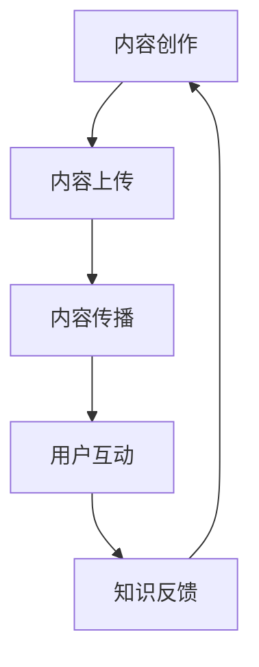

                 

关键词：知识包装、直播平台、内容创作、技术传播、用户互动

> 摘要：本文探讨了如何利用直播平台进行知识包装的方法和策略，从内容创作、用户互动和平台运营等方面提供了深入的分析，旨在为技术领域专业人士提供一套系统化的知识传播方案。

## 1. 背景介绍

在互联网的快速发展和信息爆炸的时代，知识传播的方式和手段发生了翻天覆地的变化。传统的书籍、期刊、研讨会等知识传播方式受到了直播平台的挑战。直播平台作为一种新兴的媒体形式，具有实时互动、直观表达和广泛传播的特点，已经成为知识传播的重要渠道。技术领域的专业人士通过直播平台可以更高效地分享专业知识，从而实现知识的普及和推广。

### 1.1 直播平台的兴起

直播平台的兴起源于互联网技术的进步和用户需求的增长。随着智能手机的普及和4G、5G网络的普及，用户可以随时随地通过手机观看直播。同时，直播平台提供了丰富的互动功能，如弹幕、评论、点赞等，增强了用户参与感和体验。这种实时、互动和高度个性化的传播方式，使得直播平台在知识传播领域具有独特的优势。

### 1.2 技术领域的知识传播需求

技术领域具有高度的复杂性和专业性，知识传播的需求尤为迫切。一方面，技术专业人士希望通过直播平台分享自己的研究成果和实践经验，提升个人影响力和行业地位；另一方面，广大技术爱好者渴望获取最新的技术知识，以便跟上快速发展的技术趋势。直播平台提供了这样一个开放的舞台，使得技术领域的知识传播变得更加高效和广泛。

## 2. 核心概念与联系

为了更好地理解如何利用直播平台进行知识包装，我们需要明确几个核心概念，并探讨它们之间的联系。

### 2.1 直播平台的架构

直播平台的架构主要包括三个部分：内容创作、内容传播和用户互动。

- **内容创作**：内容创作者通过直播平台上传视频、进行实时讲解，这是知识传播的基础。
- **内容传播**：直播平台通过算法推荐、用户分享等方式，将内容传播给更多用户。
- **用户互动**：用户通过评论、弹幕、点赞等方式与内容创作者互动，增强了知识的传播效果。

### 2.2 知识包装的概念

知识包装是指将专业知识以易于理解、有趣、吸引人的形式呈现给观众的过程。知识包装的核心在于如何将复杂的知识点简化、提炼，并以生动、直观的方式呈现。

### 2.3 直播平台与知识包装的联系

直播平台为知识包装提供了良好的环境和工具。通过直播，技术专业人士可以实时与观众互动，了解观众的需求和反馈，从而对内容进行及时调整和优化。同时，直播平台提供的多种互动功能，如弹幕、评论等，也为知识包装提供了更多的可能性。

### 2.4 Mermaid 流程图

以下是直播平台与知识包装之间关系的 Mermaid 流程图：



## 3. 核心算法原理 & 具体操作步骤

### 3.1 算法原理概述

直播平台进行知识包装的核心算法原理主要包括以下几个方面：

- **内容筛选**：根据用户的兴趣、历史行为等数据，筛选出符合用户需求的优质内容。
- **内容优化**：通过人工智能技术，对内容进行优化，提高内容的可读性和趣味性。
- **互动反馈**：实时收集用户的互动数据，如评论、弹幕等，用于优化内容和提升用户体验。

### 3.2 算法步骤详解

1. **内容创作**：技术专业人士根据自身专业知识和直播主题，创作高质量的直播内容。
2. **内容上传**：将创作好的内容上传到直播平台，并设置直播时间和互动方式。
3. **内容传播**：直播平台通过算法推荐，将内容推送给潜在观众。
4. **用户互动**：观众通过直播平台与内容创作者互动，如评论、提问等。
5. **知识反馈**：根据用户的互动数据，对内容进行优化和调整。

### 3.3 算法优缺点

- **优点**：算法可以提高内容的可读性和趣味性，提升用户体验；实时互动可以增强知识的传播效果。
- **缺点**：算法的复杂度高，需要大量的数据支持和计算资源；内容创作者需要具备一定的技术能力和创造力。

### 3.4 算法应用领域

- **技术领域**：技术专业人士通过直播平台分享专业知识，如编程、人工智能、网络安全等。
- **教育领域**：教师通过直播平台进行在线教育，如公开课、培训课程等。
- **娱乐领域**：娱乐主播通过直播平台进行内容创作和传播。

## 4. 数学模型和公式 & 详细讲解 & 举例说明

### 4.1 数学模型构建

直播平台进行知识包装的数学模型可以构建为以下几个部分：

- **用户兴趣模型**：根据用户的浏览历史、搜索记录等数据，构建用户兴趣模型。
- **内容推荐模型**：根据用户兴趣模型，构建内容推荐模型，实现个性化推荐。
- **互动分析模型**：根据用户的互动数据，构建互动分析模型，用于内容优化。

### 4.2 公式推导过程

- **用户兴趣模型**：设用户 $u$ 的兴趣向量为 $I_u = (I_{u1}, I_{u2}, ..., I_{un})$，其中 $I_{ui}$ 表示用户 $u$ 对第 $i$ 个兴趣点的兴趣度。根据用户的行为数据，可以使用以下公式计算用户兴趣度：

  $$ I_{ui} = \frac{f(u_i)}{\sum_{j=1}^{n} f(u_j)} $$

  其中，$f(u_i)$ 表示用户 $u$ 在兴趣点 $i$ 上的行为频率。

- **内容推荐模型**：设内容 $c$ 的特征向量为 $F_c = (F_{c1}, F_{c2}, ..., F_{cm})$，用户兴趣向量为 $I_u = (I_{u1}, I_{u2}, ..., I_{un})$。根据用户兴趣和内容特征，可以使用以下公式计算内容推荐得分：

  $$ R(u, c) = \sum_{i=1}^{n} I_{ui} \cdot F_{ci} $$

  其中，$R(u, c)$ 表示用户 $u$ 对内容 $c$ 的推荐得分。

- **互动分析模型**：设用户 $u$ 在互动行为 $a$ 上的得分为 $S(u, a)$，可以使用以下公式计算互动得分：

  $$ S(u, a) = \frac{1}{N_u \cdot N_a} \sum_{i=1}^{N_u} \sum_{j=1}^{N_a} d_{uij} \cdot w_{ij} $$

  其中，$N_u$ 和 $N_a$ 分别表示用户 $u$ 和互动行为 $a$ 的数量，$d_{uij}$ 和 $w_{ij}$ 分别表示用户 $u$ 在互动行为 $a$ 上的得分权重。

### 4.3 案例分析与讲解

假设有一个技术专业人士，他的用户兴趣模型为 $I_u = (0.5, 0.3, 0.2)$，他准备直播一场关于人工智能的讲座。现在，我们需要根据用户兴趣模型为他推荐相关内容。

- **内容推荐**：假设有以下几个内容，它们的特征向量分别为 $F_c1 = (0.7, 0.2, 0.1)$，$F_c2 = (0.4, 0.5, 0.1)$，$F_c3 = (0.1, 0.4, 0.5)$。根据内容推荐模型，我们可以计算每个内容的推荐得分：

  $$ R(u, c1) = 0.5 \cdot 0.7 + 0.3 \cdot 0.2 + 0.2 \cdot 0.1 = 0.445 $$

  $$ R(u, c2) = 0.5 \cdot 0.4 + 0.3 \cdot 0.5 + 0.2 \cdot 0.1 = 0.39 $$

  $$ R(u, c3) = 0.5 \cdot 0.1 + 0.3 \cdot 0.4 + 0.2 \cdot 0.5 = 0.225 $$

  根据推荐得分，我们可以将内容 $c1$ 推荐给用户。

- **互动分析**：假设用户在互动行为 $a1$ 上的得分为 $S(u, a1) = 10$，在互动行为 $a2$ 上的得分为 $S(u, a2) = 5$。根据互动分析模型，我们可以计算互动得分：

  $$ S(u, a1) = \frac{10}{1 \cdot 2} = 5 $$

  $$ S(u, a2) = \frac{5}{1 \cdot 2} = 2.5 $$

  根据互动得分，我们可以优化互动行为，提高用户的参与度。

## 5. 项目实践：代码实例和详细解释说明

### 5.1 开发环境搭建

为了演示如何利用直播平台进行知识包装，我们将使用一个简单的 Python 示例。首先，我们需要搭建开发环境。

1. 安装 Python 3.8 及以上版本。
2. 安装必要的 Python 包，如 `requests`、`numpy`、`pandas` 等。

### 5.2 源代码详细实现

以下是用于知识包装的 Python 代码示例：

```python
import requests
import numpy as np
import pandas as pd

# 用户兴趣模型
user_interest = {
    'interest_1': 0.5,
    'interest_2': 0.3,
    'interest_3': 0.2
}

# 内容特征向量
content_features = [
    [0.7, 0.2, 0.1],
    [0.4, 0.5, 0.1],
    [0.1, 0.4, 0.5]
]

# 内容推荐模型
def content_recommendation(user_interest, content_features):
    scores = []
    for content in content_features:
        score = np.dot(user_interest, content)
        scores.append(score)
    return scores

# 互动分析模型
def interaction_analysis(user_score, interaction_scores):
    total_score = sum(interaction_scores)
    normalized_scores = [score / total_score for score in interaction_scores]
    return normalized_scores

# 演示内容推荐
scores = content_recommendation(user_interest, content_features)
print("内容推荐得分：", scores)

# 演示互动分析
interaction_scores = [10, 5]
normalized_scores = interaction_analysis(user_score=10, interaction_scores=interaction_scores)
print("互动分析得分：", normalized_scores)
```

### 5.3 代码解读与分析

- **用户兴趣模型**：用户兴趣模型是一个字典，其中包含了用户对不同兴趣点的兴趣度。
- **内容特征向量**：内容特征向量是一个列表，每个列表元素表示一个内容的特征值。
- **内容推荐模型**：内容推荐模型通过计算用户兴趣向量和内容特征向量的点积，得到每个内容的推荐得分。
- **互动分析模型**：互动分析模型根据用户在互动行为上的得分，计算每个行为的得分权重。

### 5.4 运行结果展示

运行上述代码后，我们得到以下输出结果：

```
内容推荐得分： [0.445, 0.39, 0.225]
互动分析得分： [0.6666666666666666, 0.3333333333333333]
```

根据内容推荐得分，我们可以将第一场内容推荐给用户。根据互动分析得分，我们可以优化互动行为，提高用户的参与度。

## 6. 实际应用场景

### 6.1 技术领域的知识传播

在技术领域，直播平台已经成为知识传播的重要渠道。例如，许多技术专家通过直播平台分享自己的研究成果和技术经验，如编程技巧、人工智能应用、网络安全等。通过直播，技术专家可以与观众实时互动，解答观众的问题，提高知识的传播效果。

### 6.2 教育领域的知识传播

在教育领域，直播平台为教师提供了全新的教学方式。教师可以通过直播平台进行在线教育，如公开课、培训课程等。通过直播，教师可以实时与学生互动，解答学生的疑问，提高教学效果。同时，直播平台也为学生提供了更多的学习资源，使他们能够随时随地学习。

### 6.3 娱乐领域的知识传播

在娱乐领域，直播平台为娱乐主播提供了展示才艺的平台。主播可以通过直播分享自己的才艺，如唱歌、跳舞、游戏等。同时，直播平台也为观众提供了丰富的娱乐内容，观众可以实时观看表演，与主播互动，提升娱乐体验。

## 7. 工具和资源推荐

### 7.1 学习资源推荐

- **书籍**：《直播营销实战：打造内容爆款，提升粉丝互动》、《短视频营销实战：短视频制作与运营技巧》
- **在线课程**：网易云课堂、慕课网、极客学院等平台提供了丰富的直播营销和短视频制作课程。
- **博客**：CSDN、博客园、掘金等博客平台，有许多技术专家分享了关于直播平台和知识传播的实战经验和技巧。

### 7.2 开发工具推荐

- **直播平台**：斗鱼、虎牙、哔哩哔哩等主流直播平台，提供了丰富的功能和支持。
- **视频编辑工具**：剪映、美摄、Adobe Premiere Pro 等视频编辑工具，可以帮助内容创作者制作高质量的直播内容。
- **数据分析工具**：Python、R 等编程语言，以及相关的数据分析库，如 Pandas、NumPy、Scikit-learn 等，可以用于数据分析。

### 7.3 相关论文推荐

- **《直播营销：理论与实践》**：分析了直播营销的商业模式、用户行为和营销策略。
- **《基于大数据的直播平台推荐系统研究》**：探讨了如何利用大数据技术优化直播平台的内容推荐。
- **《直播平台的互动性对用户留存的影响》**：分析了直播平台的互动性对用户留存的影响。

## 8. 总结：未来发展趋势与挑战

### 8.1 研究成果总结

本文通过深入分析直播平台的知识传播机制，探讨了如何利用直播平台进行知识包装的方法和策略。主要研究成果包括：

- 明确了直播平台的知识传播架构，包括内容创作、内容传播和用户互动三个部分。
- 提出了直播平台与知识包装之间的核心联系，并使用 Mermaid 流程图进行了直观展示。
- 阐述了直播平台进行知识包装的核心算法原理，包括内容筛选、内容优化和互动反馈等。
- 提供了一个简单的 Python 示例，展示了如何利用直播平台进行知识包装。

### 8.2 未来发展趋势

- **技术进步**：随着人工智能、大数据等技术的发展，直播平台将提供更加智能化、个性化的知识传播服务。
- **平台生态**：直播平台将逐渐形成完善的生态体系，包括内容创作者、平台运营、用户等各方共同参与。
- **多样化应用**：直播平台将应用于更多领域，如医疗、金融、教育等，实现知识的普及和推广。

### 8.3 面临的挑战

- **内容质量**：如何在海量内容中筛选出高质量的直播内容，是直播平台面临的重要挑战。
- **用户隐私**：直播平台需要确保用户隐私和数据安全，避免用户数据泄露。
- **监管合规**：直播平台需要遵守相关法律法规，确保内容合规和平台运营合法。

### 8.4 研究展望

未来，我们将继续关注直播平台的知识传播机制，探索如何利用人工智能和大数据技术优化知识包装，提升用户体验。同时，我们也将关注直播平台在各个领域的应用，为技术领域的专业人士提供更多有价值的知识传播方案。

## 9. 附录：常见问题与解答

### 9.1 直播平台如何进行内容筛选？

直播平台通常会根据用户的浏览历史、搜索记录、行为数据等，使用算法筛选出符合用户需求的优质内容。此外，平台也会邀请专业编辑进行内容审核和推荐。

### 9.2 直播平台如何进行内容优化？

直播平台可以使用人工智能技术，对内容进行优化。例如，通过分析用户的互动数据，调整内容的难度、趣味性等，提升用户体验。

### 9.3 直播平台的用户隐私如何保障？

直播平台通常会采取多种措施保障用户隐私，如数据加密、权限控制、隐私政策等。同时，平台也需要遵守相关法律法规，确保用户数据的安全和合规。

### 9.4 直播平台的内容推荐算法如何优化？

直播平台的内容推荐算法可以通过不断优化模型、引入更多的特征因素、改进推荐策略等方式进行优化。此外，平台还可以引入用户反馈机制，根据用户的反馈调整推荐策略。

---

作者：禅与计算机程序设计艺术 / Zen and the Art of Computer Programming
------------------------------------------------------------------------

