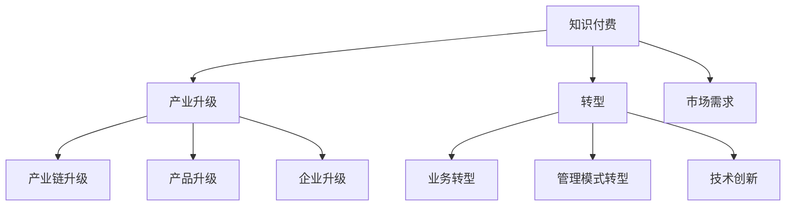

                 

关键词：知识付费、产业升级、数字化转型、技术赋能、商业模式创新

> 摘要：本文将探讨知识付费在产业升级与转型中的关键作用。通过分析知识付费的核心概念、机制及其影响，我们将揭示如何通过知识付费实现产业升级与转型，为我国企业和社会提供有益的参考。

## 1. 背景介绍

### 1.1 知识付费的兴起

随着互联网和数字技术的发展，知识付费逐渐成为一种新兴的商业模式。知识付费是指通过在线平台、APP 或线下活动等渠道，将专业知识和技能以付费形式提供给有需求的人群。这种模式的出现，为知识提供者和需求者搭建了一个直接沟通和交易的桥梁，推动了知识共享和传播。

### 1.2 产业升级与转型的重要性

产业升级与转型是当前我国经济发展的重要战略。通过产业升级，企业可以提升产品和服务质量，提高生产效率，降低成本，从而增强市场竞争力。而数字化转型作为产业升级的重要驱动力，正日益成为企业实现转型升级的关键手段。

### 1.3 知识付费与产业升级、转型的关联

知识付费不仅为企业提供了丰富的学习资源，还促进了人才素质的提升。高素质的人才队伍是企业实现产业升级和转型的重要保障。此外，知识付费还可以推动商业模式创新，为企业带来新的发展机遇。

## 2. 核心概念与联系

### 2.1 知识付费的概念

知识付费是指以付费形式获取专业知识和技能的过程。它包括在线课程、专业技能认证、一对一辅导等多种形式。知识付费的核心在于将知识以有偿方式提供给需求者，从而实现知识的价值转化。

### 2.2 产业升级的概念

产业升级是指通过技术进步、管理创新、产业协同等手段，提高产业整体竞争力，实现从低端向高端的转型升级。产业升级包括产业链升级、产品升级、企业升级等多个层面。

### 2.3 转型的概念

转型是指企业根据市场环境和自身条件，调整经营策略、业务模式、组织架构等，以适应新的发展需求。转型通常包括业务转型、管理模式转型、技术创新等多个方面。

### 2.4 知识付费与产业升级、转型的联系

知识付费为产业升级和转型提供了丰富的智力支持。通过付费获取专业知识，企业可以提升管理水平、优化生产工艺、创新商业模式，从而实现产业升级和转型。同时，产业升级和转型也为知识付费创造了更大的市场需求。

### 2.5 Mermaid 流程图



## 3. 核心算法原理 & 具体操作步骤

### 3.1 算法原理概述

知识付费的核心算法原理是需求匹配。通过分析市场需求和知识供给，实现供需双方的有效对接。具体操作步骤如下：

### 3.2 算法步骤详解

#### 3.2.1 数据收集与处理

收集市场需求和知识供给的相关数据，如用户需求、课程内容、讲师资质等。对数据进行预处理，包括去重、清洗、归一化等操作。

#### 3.2.2 需求分析与匹配

利用自然语言处理、数据挖掘等技术，对用户需求进行分析，提取关键信息。将需求与知识供给进行匹配，推荐合适的知识和课程。

#### 3.2.3 付费与交易

用户选择合适的知识或课程后，进行付费购买。平台提供安全的支付渠道和便捷的支付方式，确保交易的顺利进行。

#### 3.2.4 反馈与迭代

收集用户反馈，对推荐系统进行优化调整，提高推荐精度和满意度。

### 3.3 算法优缺点

#### 3.3.1 优点

- 提高知识传播效率，满足个性化需求。
- 促进知识创新和人才培养。
- 增强企业竞争力，实现产业升级和转型。

#### 3.3.2 缺点

- 知识供给质量参差不齐，存在滥竽充数现象。
- 知识付费可能导致信息鸿沟扩大，加剧贫富差距。

### 3.4 算法应用领域

- 在线教育
- 企业培训
- 专业技能认证
- 创新创业

## 4. 数学模型和公式 & 详细讲解 & 举例说明

### 4.1 数学模型构建

假设知识付费平台上的知识供给和需求分别为 \(X\) 和 \(Y\)，供需匹配的满意度为 \(S\)，则知识付费平台的收益 \(R\) 可表示为：

\[ R = S \times (X - Y) \]

其中，\(S\) 表示供需匹配满意度，\(X - Y\) 表示供需差。

### 4.2 公式推导过程

供需匹配满意度 \(S\) 取决于供需差和供需平衡点。假设供需平衡点为 \(B\)，则：

\[ S = \frac{|X - Y|}{B} \]

将供需差代入收益公式，得：

\[ R = \frac{|X - Y|}{B} \times (X - Y) \]

### 4.3 案例分析与讲解

假设知识付费平台上的知识供给 \(X\) 为 1000 门，需求 \(Y\) 为 800 门，供需平衡点 \(B\) 为 500 门，则：

\[ S = \frac{|1000 - 800|}{500} = \frac{200}{500} = 0.4 \]

\[ R = 0.4 \times (1000 - 800) = 0.4 \times 200 = 80 \]

该平台在当前供需情况下，收益为 80。

## 5. 项目实践：代码实例和详细解释说明

### 5.1 开发环境搭建

- 操作系统：Windows / macOS / Linux
- 开发工具：Python 3.8+
- 数据库：MySQL / PostgreSQL
- Web 框架：Django / Flask

### 5.2 源代码详细实现

以下是一个简单的知识付费平台后台代码示例：

```python
# app.py

from flask import Flask, request, jsonify
from flask_sqlalchemy import SQLAlchemy

app = Flask(__name__)
app.config['SQLALCHEMY_DATABASE_URI'] = 'sqlite:///knowledge.db'
db = SQLAlchemy(app)

class Knowledge(db.Model):
    id = db.Column(db.Integer, primary_key=True)
    title = db.Column(db.String(255), nullable=False)
    content = db.Column(db.Text, nullable=False)
    price = db.Column(db.Float, nullable=False)

@app.route('/knowledge', methods=['GET'])
def get_knowledge():
    title = request.args.get('title')
    knowledge = Knowledge.query.filter_by(title=title).first()
    if knowledge:
        return jsonify({'title': knowledge.title, 'content': knowledge.content, 'price': knowledge.price})
    else:
        return jsonify({'error': '知识不存在'})

@app.route('/knowledge', methods=['POST'])
def create_knowledge():
    title = request.form['title']
    content = request.form['content']
    price = request.form['price']
    new_knowledge = Knowledge(title=title, content=content, price=price)
    db.session.add(new_knowledge)
    db.session.commit()
    return jsonify({'message': '知识创建成功'})

if __name__ == '__main__':
    db.create_all()
    app.run(debug=True)
```

### 5.3 代码解读与分析

该代码实现了知识付费平台的基本功能，包括获取知识和创建知识。其中：

- `Knowledge` 类：定义了知识的属性，包括 ID、标题、内容和价格。
- `get_knowledge` 函数：通过请求参数获取知识标题，查询数据库并返回知识信息。
- `create_knowledge` 函数：通过 POST 请求创建知识，保存到数据库。

### 5.4 运行结果展示

运行代码后，可以通过浏览器访问知识付费平台后台，执行如下操作：

- 获取知识：访问 `http://127.0.0.1:5000/knowledge?title=Python基础`，返回知识信息。
- 创建知识：访问 `http://127.0.0.1:5000/knowledge`，提交表单创建知识。

## 6. 实际应用场景

### 6.1 在线教育平台

在线教育平台可以通过知识付费模式，为用户提供丰富的课程资源。用户可以根据自身需求选择合适的课程，提升专业技能。

### 6.2 企业培训

企业可以通过知识付费平台，为员工提供定制化的培训课程。员工通过付费学习，提升自身素质，为企业发展贡献力量。

### 6.3 专业技能认证

专业技能认证机构可以通过知识付费模式，为考生提供权威的培训资源。考生通过学习，提高通过考试的概率。

### 6.4 创新创业

创业者可以通过知识付费平台，学习成功企业的经验教训，提升创业成功率。同时，知识付费平台也为创业者提供了丰富的项目资源。

## 7. 未来应用展望

### 7.1 个性化推荐

随着人工智能技术的发展，知识付费平台可以实现更加精准的个性化推荐，满足用户多样化的学习需求。

### 7.2 社交互动

知识付费平台可以引入社交功能，促进用户之间的互动和交流，提高学习效果和用户体验。

### 7.3 跨界融合

知识付费平台可以与其他行业进行跨界合作，如文化产业、旅游产业等，打造更加多元化的商业模式。

## 8. 工具和资源推荐

### 8.1 学习资源推荐

- 《Python编程：从入门到实践》
- 《深入理解计算机系统》
- 《大数据之路：阿里巴巴大数据实践》

### 8.2 开发工具推荐

- PyCharm
- VSCode
- MySQL Workbench

### 8.3 相关论文推荐

- “Knowledge付费商业模式研究”
- “数字化转型背景下企业知识管理研究”
- “人工智能在知识付费领域的应用研究”

## 9. 总结：未来发展趋势与挑战

### 9.1 研究成果总结

知识付费在产业升级与转型中发挥了重要作用，为企业提供了丰富的智力支持。通过个性化推荐、社交互动等创新模式，知识付费平台将不断优化用户体验，提高知识传播效率。

### 9.2 未来发展趋势

- 个性化推荐技术将更加成熟，满足用户多样化学习需求。
- 知识付费平台将引入更多跨界合作，拓展业务范围。
- 知识付费将成为企业人才管理和人才培养的重要手段。

### 9.3 面临的挑战

- 知识供给质量参差不齐，存在滥竽充数现象。
- 知识付费可能导致信息鸿沟扩大，加剧贫富差距。
- 知识付费平台需要不断创新，以适应快速变化的市场需求。

### 9.4 研究展望

未来，知识付费将在人工智能、大数据等新兴技术的支持下，实现更加智能化、个性化的发展。同时，研究如何平衡知识供给质量与市场需求，将是一个重要的研究方向。

## 附录：常见问题与解答

### Q1：知识付费是否会导致信息鸿沟扩大？

A1：知识付费本身不会导致信息鸿沟扩大，但如果没有合理的监管和引导，部分低质量的知识供给可能会误导用户，加剧信息鸿沟。因此，加强知识付费平台的质量控制和用户评价机制，是减少信息鸿沟的重要措施。

### Q2：企业如何通过知识付费提升员工素质？

A2：企业可以通过以下方式通过知识付费提升员工素质：

- 分析员工需求，有针对性地推荐优质课程。
- 建立内部知识库，共享企业内外部优质知识资源。
- 定期组织知识付费学习活动，提高员工学习积极性。
- 将知识付费与员工绩效挂钩，激发学习动力。

### Q3：如何评估知识付费平台的质量？

A3：评估知识付费平台的质量可以从以下几个方面入手：

- 课程内容是否丰富、实用。
- 讲师资质和教学经验。
- 用户评价和反馈。
- 平台的技术实力和用户体验。

### Q4：知识付费在创业领域的应用有哪些？

A4：知识付费在创业领域有以下应用：

- 创业者可以通过知识付费学习成功企业的经验教训，提高创业成功率。
- 创业者可以付费获取项目资源，加速项目进展。
- 创业者可以通过知识付费平台进行市场调研，了解市场需求。
- 创业者可以付费参加创业培训班，提升创业能力。

### Q5：知识付费是否适用于所有行业？

A5：知识付费适用于大多数行业，但具体应用效果取决于行业特点和需求。例如：

- 在线教育、IT、金融等领域，知识付费已成为主流商业模式。
- 制造业、农业等传统行业，知识付费可以提升企业管理和生产效率。
- 医疗、法律等专业领域，知识付费可以为专业人士提供权威的知识资源。

## 作者署名

作者：禅与计算机程序设计艺术 / Zen and the Art of Computer Programming
-------------------------------------------------------------------

以上就是本文的完整内容。希望这篇文章能够帮助读者了解知识付费在产业升级与转型中的重要作用，以及如何通过知识付费实现企业和社会的可持续发展。在未来的发展中，知识付费将继续发挥其独特的作用，为我国经济的繁荣做出更大的贡献。

