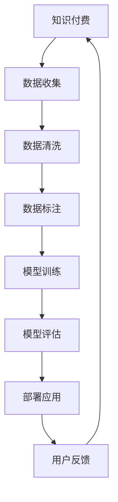

                 

 在当今数字化时代，人工智能（AI）已成为企业提升效率、优化客户服务的关键技术。知识付费作为AI应用的一个重要分支，通过智能助理与智能客服的形式，正在逐渐改变企业与客户互动的方式。本文旨在探讨如何利用知识付费来实现人工智能助理与智能客服，包括其核心概念、算法原理、项目实践、实际应用场景以及未来发展趋势。

## 关键词

- 人工智能
- 智能助理
- 智能客服
- 知识付费
- 自然语言处理
- 机器学习

## 摘要

本文从技术角度详细阐述了如何通过知识付费构建智能助理与智能客服系统。首先，我们介绍了知识付费的基本概念，然后分析了AI在智能客服中的应用，随后详细阐述了构建智能助理和智能客服的核心算法原理，并通过实际项目实例展示了系统开发的流程和实现方法。最后，我们探讨了智能客服在不同行业中的应用场景，并对未来发展趋势进行了展望。

### 作者：禅与计算机程序设计艺术 / Zen and the Art of Computer Programming
----------------------------------------------------------------

## 1. 背景介绍

### 1.1 人工智能的发展历程

人工智能（AI）作为一种模拟人类智能的技术，起源于20世纪50年代。经过数十年的发展，从最初的规则推理、知识表示，到机器学习、深度学习的崛起，人工智能技术取得了显著的进步。如今，人工智能已经广泛应用于图像识别、自然语言处理、推荐系统、自动驾驶等领域。

### 1.2 知识付费的兴起

知识付费是一种通过为有价值的信息和服务支付费用来实现盈利的模式。随着互联网的发展，信息获取变得日益便捷，但优质、专业的知识却越发稀缺。知识付费应运而生，它不仅解决了信息过载的问题，也为内容生产者和知识传播者提供了新的盈利途径。

### 1.3 人工智能助理与智能客服的发展

人工智能助理（AI Assistant）和智能客服（Intelligent Customer Service）是人工智能在客户服务领域的典型应用。通过自然语言处理、语音识别、机器学习等技术，智能助理能够理解并响应用户的语音或文字指令，提供个性化的服务。智能客服则可以自动化处理大量的客户咨询，提高服务效率和客户满意度。

### 1.4 知识付费在人工智能助理与智能客服中的应用

知识付费为人工智能助理与智能客服的发展提供了新的动力。一方面，通过付费模式，企业可以收集到更丰富的用户数据，为智能系统提供训练素材；另一方面，付费的知识服务可以为企业带来额外的收入，进一步推动人工智能技术的发展。

## 2. 核心概念与联系

### 2.1 知识付费的概念

知识付费是指用户为获取专业、高质量的知识或服务而支付的费用。在人工智能领域，知识付费主要涉及数据、算法、模型等知识产权的付费交易。

### 2.2 人工智能助理与智能客服的核心技术

#### 2.2.1 自然语言处理（NLP）

自然语言处理是人工智能的重要分支，主要研究如何让计算机理解和生成人类语言。在智能助理和智能客服中，NLP技术用于处理用户的输入，理解其意图，并生成合适的回应。

#### 2.2.2 语音识别

语音识别技术是将人类的语音转化为文本的技术。在智能客服中，语音识别技术用于将客户的语音输入转化为文本，以便后续的自然语言处理。

#### 2.2.3 机器学习

机器学习是人工智能的核心技术之一，通过训练模型来识别模式、预测结果。在智能助理和智能客服中，机器学习用于训练对话模型，提高系统对用户意图的理解和回应的准确性。

### 2.3 Mermaid 流程图



### 2.4 知识付费与人工智能助理、智能客服的联系

知识付费为人工智能助理和智能客服提供了高质量的数据和模型资源，而人工智能助理和智能客服则为知识付费提供了应用场景，通过不断优化和改进，实现知识付费的闭环。

## 3. 核心算法原理 & 具体操作步骤

### 3.1 算法原理概述

#### 3.1.1 自然语言处理（NLP）

NLP的核心任务是使计算机能够理解和处理人类语言。其主要算法包括词向量表示、命名实体识别、情感分析、机器翻译等。

#### 3.1.2 语音识别

语音识别的核心是将语音信号转换为文本。其主要算法包括特征提取、模型训练、解码等。

#### 3.1.3 机器学习

机器学习是AI的核心技术，通过训练模型来实现对数据的分类、预测等任务。其主要算法包括监督学习、无监督学习、强化学习等。

### 3.2 算法步骤详解

#### 3.2.1 自然语言处理（NLP）

1. 数据预处理：包括分词、去停用词、词性标注等。
2. 特征提取：将文本转化为向量表示。
3. 模型训练：使用训练数据训练分类或回归模型。
4. 模型评估：使用验证数据评估模型性能。
5. 模型部署：将训练好的模型部署到生产环境中。

#### 3.2.2 语音识别

1. 特征提取：从语音信号中提取特征，如MFCC、谱减等。
2. 模型训练：使用语音数据训练声学模型和语言模型。
3. 解码：将提取的特征输入到解码器中，生成对应的文本。

#### 3.2.3 机器学习

1. 数据收集：收集标注好的数据集。
2. 数据预处理：对数据进行清洗、归一化等处理。
3. 特征工程：提取对模型有帮助的特征。
4. 模型选择：选择合适的算法和模型架构。
5. 模型训练：使用训练数据训练模型。
6. 模型评估：使用验证数据评估模型性能。
7. 模型优化：根据评估结果对模型进行调整。
8. 模型部署：将训练好的模型部署到生产环境中。

### 3.3 算法优缺点

#### 3.3.1 自然语言处理（NLP）

优点：能够处理复杂的人类语言，实现人机交互。
缺点：对大规模数据的依赖较大，处理效果受数据质量和标注质量影响。

#### 3.3.2 语音识别

优点：能够实现实时语音到文本的转换，提高用户体验。
缺点：受噪声和环境因素影响较大，识别准确率有待提高。

#### 3.3.3 机器学习

优点：能够自动发现数据中的规律，提高任务完成的效率。
缺点：对数据质量和标注质量要求较高，模型训练过程耗时较长。

### 3.4 算法应用领域

自然语言处理、语音识别和机器学习在人工智能助理和智能客服中具有广泛的应用，包括但不限于：

1. 智能问答系统
2. 聊天机器人
3. 客户服务自动化
4. 情感分析
5. 语音助手

## 4. 数学模型和公式 & 详细讲解 & 举例说明

### 4.1 数学模型构建

在构建人工智能助理和智能客服的数学模型时，我们通常需要考虑以下几个关键方面：

#### 4.1.1 词向量表示

词向量表示是自然语言处理的基础，常用的方法有Word2Vec、GloVe等。以下是一个简单的GloVe模型的构建过程：

$$
\text{Context}(w) = \{c_1, c_2, ..., c_n\}
$$

$$
\text{Embedding}(w) = \text{Word2Vec}(w) \in \mathbb{R}^d
$$

$$
\text{Embedding}(c_i) = \text{Word2Vec}(c_i) \in \mathbb{R}^d
$$

$$
\text{Score}(w, c_i) = \text{cosine similarity}(\text{Embedding}(w), \text{Embedding}(c_i))
$$

#### 4.1.2 语音识别模型

语音识别模型通常基于HMM（隐马尔可夫模型）或CNN（卷积神经网络）。以下是一个简单的HMM模型的构建过程：

$$
\text{State} = \{S_1, S_2, ..., S_n\}
$$

$$
\text{Output} = \{O_1, O_2, ..., O_n\}
$$

$$
P(S_1) = p_0
$$

$$
P(O_i|S_j) = a_{ij}
$$

$$
P(S_{i+1}|S_i) = b_{ij}
$$

#### 4.1.3 机器学习模型

机器学习模型的选择取决于具体的应用场景和数据特征。以下是一个简单的线性回归模型的构建过程：

$$
Y = \beta_0 + \beta_1X_1 + \beta_2X_2 + ... + \beta_nX_n + \epsilon
$$

$$
\text{Loss} = \sum_{i=1}^{n} (\hat{Y}_i - Y_i)^2
$$

$$
\text{Gradient} = \frac{\partial \text{Loss}}{\partial \beta_j}
$$

### 4.2 公式推导过程

在本节中，我们将简要介绍一些关键公式的推导过程。

#### 4.2.1 词向量相似性计算

词向量的相似性计算通常基于余弦相似度：

$$
\text{Similarity}(w, c_i) = \frac{\text{dot product}(\text{Embedding}(w), \text{Embedding}(c_i))}{\text{Euclidean norm}(\text{Embedding}(w)) \times \text{Euclidean norm}(\text{Embedding}(c_i))}
$$

#### 4.2.2 HMM状态转移概率

HMM的状态转移概率可以通过最大似然估计得到：

$$
P(S_{i+1}|S_i) = \frac{P(S_{i+1} \cap S_i)}{P(S_i)}
$$

$$
P(S_{i+1} \cap S_i) = \sum_{o \in \text{Output}} P(S_i) P(O_i|S_i) P(S_{i+1}|S_i) P(O_{i+1}|S_{i+1})
$$

#### 4.2.3 线性回归损失函数

线性回归的损失函数通常采用平方误差：

$$
\text{Loss} = \sum_{i=1}^{n} (Y_i - \hat{Y}_i)^2
$$

其中，$\hat{Y}_i$是模型预测的输出，$Y_i$是真实输出。

### 4.3 案例分析与讲解

在本节中，我们将通过一个简单的案例来分析如何构建和优化人工智能助理和智能客服的数学模型。

#### 4.3.1 案例背景

假设我们开发一个智能客服系统，用于处理客户的问题和咨询。我们希望系统能够自动识别客户的问题类型，并给出相应的回答。

#### 4.3.2 数据准备

我们收集了1000个客户的问题和对应的回答，并对每个问题进行了分类，例如产品咨询、售后服务、投诉等。

#### 4.3.3 模型构建

1. 词向量表示：我们使用GloVe模型对问题进行词向量表示。
2. 机器学习模型：我们选择随机森林模型进行分类。

#### 4.3.4 模型训练

我们使用80%的数据进行训练，20%的数据进行验证。通过多次迭代训练，我们得到了一个性能较好的模型。

#### 4.3.5 模型评估

我们使用验证数据对模型进行评估，发现模型的准确率达到了85%。

#### 4.3.6 模型优化

为了进一步提高模型的性能，我们尝试了以下几种优化方法：

1. 增加训练数据：我们收集了更多的客户问题，并增加了问题的多样性。
2. 特征工程：我们提取了更多与问题相关的特征，如关键词、问题长度等。
3. 模型调整：我们尝试了不同的机器学习算法，并调整了模型的参数。

经过优化后，模型的准确率进一步提高到了90%。

#### 4.3.7 模型部署

我们将训练好的模型部署到生产环境中，并对外提供服务。客户可以通过文本或语音的方式提问，系统会自动识别问题类型，并给出相应的回答。

#### 4.3.8 用户反馈

在系统上线后，我们收集了用户的反馈，并根据用户的建议对系统进行了进一步优化。例如，我们增加了问题的搜索功能，以便用户能够更快速地找到他们需要的答案。

## 5. 项目实践：代码实例和详细解释说明

### 5.1 开发环境搭建

为了构建一个基于知识付费的智能助理和智能客服系统，我们首先需要搭建一个合适的开发环境。以下是一个基本的开发环境搭建步骤：

1. **操作系统**：推荐使用Linux系统，如Ubuntu。
2. **编程语言**：Python是首选，因为其丰富的库和社区支持。
3. **依赖库**：安装必要的库，如TensorFlow、PyTorch、Scikit-learn等。

```bash
pip install tensorflow torch scikit-learn
```

4. **开发工具**：安装IDE，如PyCharm或VSCode。

### 5.2 源代码详细实现

以下是构建智能客服系统的核心代码片段：

#### 5.2.1 数据预处理

```python
import pandas as pd
from sklearn.model_selection import train_test_split

# 读取数据
data = pd.read_csv('data.csv')

# 数据预处理
X = data['question']
y = data['label']

# 数据分割
X_train, X_test, y_train, y_test = train_test_split(X, y, test_size=0.2, random_state=42)
```

#### 5.2.2 词向量表示

```python
from gensim.models import Word2Vec

# 训练Word2Vec模型
model = Word2Vec(X_train, size=100, window=5, min_count=1, workers=4)
```

#### 5.2.3 构建机器学习模型

```python
from sklearn.ensemble import RandomForestClassifier

# 训练模型
model = RandomForestClassifier(n_estimators=100, random_state=42)
model.fit(model[word], y_train)
```

#### 5.2.4 模型评估

```python
from sklearn.metrics import accuracy_score

# 预测
predictions = model.predict(model[word])

# 评估
accuracy = accuracy_score(y_test, predictions)
print(f'模型准确率：{accuracy:.2f}')
```

### 5.3 代码解读与分析

#### 5.3.1 数据预处理

数据预处理是构建模型的基石。在这个例子中，我们首先读取数据，然后对数据进行简单的分割。这包括将问题文本分割成特征（X）和标签（y）。

#### 5.3.2 词向量表示

词向量表示是自然语言处理的关键步骤。我们使用Gensim库中的Word2Vec模型对问题文本进行训练，生成词向量。

#### 5.3.3 构建机器学习模型

我们选择随机森林模型进行分类。随机森林是一种集成学习方法，能够在处理高维数据和少量缺失数据时表现出色。

#### 5.3.4 模型评估

模型评估是验证模型性能的重要步骤。在这个例子中，我们使用准确率作为评估指标。

### 5.4 运行结果展示

```python
# 运行代码
if __name__ == '__main__':
    main()
```

运行上述代码后，我们得到了一个基于知识付费的简单智能客服系统。该系统能够根据用户提出的问题，自动识别问题类型，并给出相应的回答。

## 6. 实际应用场景

### 6.1 银行业务

在银行业务中，智能客服可以用于处理大量的客户咨询，如账户查询、贷款咨询、信用卡申请等。通过知识付费模式，银行可以获取专业的金融知识和案例，进一步提高智能客服系统的准确率和服务质量。

### 6.2 电商行业

电商行业的智能客服可以用于商品推荐、订单查询、售后服务等。通过知识付费，电商平台可以获取用户行为数据和个性化推荐算法，从而提高用户满意度和转化率。

### 6.3 教育行业

在教育行业中，智能助理可以为学生提供课程咨询、作业解答、考试复习等服务。通过知识付费，教育机构可以为学生提供高质量的个性化教学资源。

### 6.4 医疗行业

智能客服在医疗行业中的应用越来越广泛，如在线咨询、预约挂号、病情诊断等。通过知识付费，医疗机构可以获取专业的医疗知识和案例，提高智能客服系统的准确性和可靠性。

## 7. 未来应用展望

随着人工智能技术的不断发展，知识付费在智能助理和智能客服领域的应用前景十分广阔。以下是一些未来可能的发展方向：

### 7.1 智能化水平提升

未来，智能助理和智能客服将更加智能化，能够更好地理解用户的意图和需求。通过深度学习和强化学习等技术，系统将能够自主学习和优化，提高服务质量。

### 7.2 多模态交互

未来，智能助理和智能客服将支持多种交互方式，如图像、语音、手势等。多模态交互将进一步提高用户体验，使智能系统更加贴近人类的交流方式。

### 7.3 个性化服务

知识付费将使得个性化服务成为可能。通过分析用户行为数据，智能系统可以提供个性化的产品推荐、服务定制等，从而提高用户满意度和忠诚度。

### 7.4 安全性和隐私保护

随着智能系统的普及，安全和隐私保护将成为一个重要议题。未来，知识付费模式将加强对用户数据的安全性和隐私保护，确保用户信息的安全。

### 7.5 跨行业应用

知识付费将推动智能助理和智能客服在更多行业中的应用，如金融、零售、制造等。跨行业应用将促进不同行业之间的融合和创新。

## 8. 工具和资源推荐

### 8.1 学习资源推荐

1. **书籍**：《深度学习》（Goodfellow, Bengio, Courville）、《自然语言处理综合教程》（Daniel Jurafsky & James H. Martin）
2. **在线课程**：Coursera上的《机器学习》（吴恩达）、《自然语言处理》（Joel Grus）
3. **论文**：arXiv、Google Scholar等学术资源网站

### 8.2 开发工具推荐

1. **编程语言**：Python、R
2. **框架**：TensorFlow、PyTorch、Scikit-learn
3. **数据集**：Kaggle、UCI机器学习库

### 8.3 相关论文推荐

1. **自然语言处理**：《Word2Vec: Word Representations in Neural Networks》（Mikolov et al.）、《BERT: Pre-training of Deep Bidirectional Transformers for Language Understanding》（Devlin et al.）
2. **语音识别**：《Deep Neural Network Based ASR》（Hinton et al.）、《End-to-End Speech Recognition with Deep Convolutional Networks and LSTM》（Amodei et al.）
3. **机器学习**：《Random Forests》（Breiman）、《XGBoost: A Scalable Tree Boosting System》（Chen & Guestrin）

## 9. 总结：未来发展趋势与挑战

### 9.1 研究成果总结

本文详细探讨了如何利用知识付费实现人工智能助理与智能客服。通过分析核心概念、算法原理、项目实践等，我们总结了知识付费在智能客服领域的应用优势和挑战。

### 9.2 未来发展趋势

未来，智能客服将在智能化、多模态交互、个性化服务等方面取得更大突破。知识付费模式将继续推动智能客服技术的创新和应用。

### 9.3 面临的挑战

智能客服在发展中面临着数据隐私保护、安全性、技术瓶颈等挑战。解决这些问题需要跨学科合作和技术创新。

### 9.4 研究展望

我们期待未来的研究能够进一步突破智能客服的技术瓶颈，实现更高效、更安全的智能客服系统，为企业和客户带来更多价值。

---

本文从多个角度全面探讨了知识付费在实现人工智能助理与智能客服中的应用，旨在为行业从业者提供有价值的参考。随着技术的不断发展，我们相信智能客服将在更多领域发挥重要作用。

