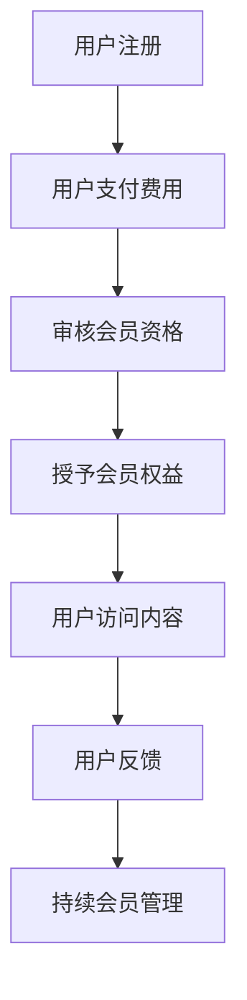

                 

 在数字时代，知识付费成为了一个迅速崛起的市场，会员制作为一种商业模式，能够有效地将用户吸引到平台上，并且通过提供有价值的知识内容实现盈利。本文将探讨如何利用知识付费实现会员制盈利，从核心概念、算法原理、数学模型、项目实践、实际应用、未来展望以及资源推荐等多个角度进行深入分析。

## 关键词

知识付费、会员制、盈利模式、内容策略、用户粘性、数据分析

## 摘要

本文旨在探讨知识付费领域中的会员制商业模式，通过分析其核心概念、算法原理、数学模型和实践案例，揭示会员制如何有效提升用户粘性和盈利能力。同时，本文还将展望会员制未来的发展趋势与挑战，并推荐相关学习资源和开发工具。

### 1. 背景介绍

随着互联网和移动设备的普及，知识获取变得更加便捷。人们不再满足于传统的教育资源，而是追求个性化的学习体验和高质量的知识内容。知识付费应运而生，成为了一股重要的商业力量。知识付费是指通过付费方式获取专业知识和技能的过程，它为知识提供者和消费者搭建了一个直接交易的桥梁。

会员制是一种常见的商业模式，它通过提供特殊权限或服务来吸引用户付费。会员制在知识付费领域中的应用，不仅能够提升用户体验，还能实现持续的收入来源。本文将探讨如何利用知识付费实现会员制盈利，包括会员价值的挖掘、会员服务的优化和会员系统的构建。

### 2. 核心概念与联系

#### 会员制商业模式

会员制商业模式是指企业通过向用户提供会员服务来获取收入的一种商业模式。会员制通常包括以下几个核心要素：

1. **会员资格**：用户需要支付一定的费用才能成为会员，并获得特定的会员权益。
2. **会员权益**：包括独享的内容、优先体验新功能、优惠价格等。
3. **会员管理系统**：用于管理会员信息、权益和互动。

#### 知识付费

知识付费是指用户为了获取专业知识和技能而支付的费用。在知识付费领域，核心概念包括：

1. **知识内容**：包括文章、视频、课程、问答等多种形式。
2. **定价策略**：根据知识内容的难度、时长和受众等因素进行定价。
3. **用户需求**：了解用户的需求，提供个性化的知识服务。

#### 会员制与知识付费的联系

会员制与知识付费的结合，能够实现以下目标：

1. **提高用户粘性**：通过提供独家内容和优质服务，留住用户。
2. **增加收入来源**：会员订阅和付费内容双重收益模式。
3. **优化用户体验**：会员特权和服务提升用户满意度。

#### Mermaid 流程图

以下是一个简化的会员制与知识付费的流程图：



### 3. 核心算法原理 & 具体操作步骤

#### 3.1 算法原理概述

会员制盈利的核心算法原理主要包括以下几点：

1. **用户行为分析**：通过数据分析了解用户行为，优化内容推荐和会员权益。
2. **收益模型构建**：构建会员收益模型，确保会员订阅的可持续性。
3. **成本控制**：通过精细化运营，降低会员服务成本。

#### 3.2 算法步骤详解

1. **用户行为分析**：

   - 收集用户行为数据：访问频率、访问时长、互动次数等。
   - 构建用户画像：基于行为数据，了解用户的兴趣和行为习惯。
   - 内容推荐系统：根据用户画像，推荐个性化的知识内容。

2. **收益模型构建**：

   - 设定会员价格：考虑市场调研、成本控制和竞争对手定价。
   - 设计会员权益：根据用户需求和内容特点，设计多样化的会员权益。
   - 盈利模式：会员订阅和付费内容双重收益模式。

3. **成本控制**：

   - 优化内容生产：通过数据分析，提高内容质量和生产效率。
   - 优化会员服务：通过用户反馈，持续优化会员服务体验。
   - 成本控制策略：制定合理的成本控制策略，确保盈利。

#### 3.3 算法优缺点

**优点**：

1. **提高用户粘性**：通过提供高质量的内容和会员权益，增强用户对平台的依赖。
2. **稳定收入来源**：会员订阅和付费内容双重收益模式，确保稳定的收入。
3. **优化用户体验**：个性化的内容推荐和会员服务，提升用户满意度。

**缺点**：

1. **前期投入较大**：构建会员制系统需要投入大量的人力、物力和财力。
2. **内容质量风险**：内容质量直接影响用户满意度和留存率。
3. **市场竞争**：在知识付费领域，市场竞争激烈，需要不断创新和优化。

#### 3.4 算法应用领域

会员制在知识付费领域的应用非常广泛，包括：

1. **在线教育平台**：提供付费课程和会员服务，如Coursera、Udemy等。
2. **专业知识库**：提供专业知识和技能的付费内容，如LinkedIn Learning、Pluralsight等。
3. **资讯平台**：提供付费订阅，如The Economist、Financial Times等。

### 4. 数学模型和公式 & 详细讲解 & 举例说明

#### 4.1 数学模型构建

会员制盈利的数学模型主要包括以下几个方面：

1. **收益模型**：

   - 收益 = 订阅收入 + 内容付费收入
   - 订阅收入 = 订阅价格 × 订阅人数
   - 内容付费收入 = 内容单价 × 购买人数

2. **成本模型**：

   - 成本 = 内容生产成本 + 会员服务成本
   - 内容生产成本 = 内容制作费用 × 内容数量
   - 会员服务成本 = 客服费用 × 订阅人数

3. **利润模型**：

   - 利润 = 收益 - 成本

#### 4.2 公式推导过程

1. **收益模型推导**：

   收益 = 订阅收入 + 内容付费收入

   订阅收入 = 订阅价格 × 订阅人数

   内容付费收入 = 内容单价 × 购买人数

   所以，收益 = 订阅价格 × 订阅人数 + 内容单价 × 购买人数

2. **成本模型推导**：

   成本 = 内容生产成本 + 会员服务成本

   内容生产成本 = 内容制作费用 × 内容数量

   会员服务成本 = 客服费用 × 订阅人数

   所以，成本 = 内容制作费用 × 内容数量 + 客服费用 × 订阅人数

3. **利润模型推导**：

   利润 = 收益 - 成本

   所以，利润 = (订阅价格 × 订阅人数 + 内容单价 × 购买人数) - (内容制作费用 × 内容数量 + 客服费用 × 订阅人数)

#### 4.3 案例分析与讲解

假设一个知识付费平台，会员订阅价格为200元/月，内容单价为50元/篇。内容生产成本为10元/篇，会员服务成本为20元/月。

1. **收益模型**：

   订阅收入 = 200元/月 × 订阅人数

   内容付费收入 = 50元/篇 × 购买人数

   收益 = 200元/月 × 订阅人数 + 50元/篇 × 购买人数

2. **成本模型**：

   内容生产成本 = 10元/篇 × 内容数量

   会员服务成本 = 20元/月 × 订阅人数

   成本 = 10元/篇 × 内容数量 + 20元/月 × 订阅人数

3. **利润模型**：

   利润 = 收益 - 成本

   利润 = (200元/月 × 订阅人数 + 50元/篇 × 购买人数) - (10元/篇 × 内容数量 + 20元/月 × 订阅人数)

通过上述公式，可以计算出平台在某一时间段的总收益、总成本和总利润。同时，还可以根据用户行为数据，对订阅人数、购买人数、内容数量等进行预测，从而制定更加精准的会员制策略。

### 5. 项目实践：代码实例和详细解释说明

#### 5.1 开发环境搭建

为了实现会员制盈利，我们需要搭建一个完整的知识付费平台。以下是开发环境的搭建步骤：

1. **后端框架**：选择一个流行的后端框架，如Spring Boot。
2. **数据库**：选择一个合适的数据库系统，如MySQL。
3. **前端框架**：选择一个前端框架，如React。
4. **云服务**：使用云服务器，如阿里云。

#### 5.2 源代码详细实现

以下是一个简化的源代码实现，用于管理会员信息和内容。

```java
// 会员管理类
public class Member {
    private String id;
    private String name;
    private String email;
    private double balance;

    // 构造函数、getter和setter方法省略
}

// 内容管理类
public class Content {
    private String id;
    private String title;
    private double price;
    private boolean isFree;

    // 构造函数、getter和setter方法省略
}

// 会员服务类
public class MemberService {
    private List<Member> members;
    private List<Content> contents;

    public MemberService() {
        this.members = new ArrayList<>();
        this.contents = new ArrayList<>();
    }

    public void addMember(Member member) {
        members.add(member);
    }

    public void addContent(Content content) {
        contents.add(content);
    }

    public void purchaseContent(String memberId, String contentId) {
        Member member = findMemberById(memberId);
        Content content = findContentById(contentId);

        if (member != null && content != null) {
            if (content.isFree() || member.getBalance() >= content.getPrice()) {
                member.setBalance(member.getBalance() - content.getPrice());
                // 更新会员信息和内容状态
            } else {
                System.out.println("余额不足，无法购买");
            }
        } else {
            System.out.println("会员或内容不存在");
        }
    }

    private Member findMemberById(String id) {
        // 根据ID查找会员
    }

    private Content findContentById(String id) {
        // 根据ID查找内容
    }
}
```

#### 5.3 代码解读与分析

上述代码展示了会员管理、内容管理和会员服务的基本实现。会员管理类用于存储和管理会员信息，内容管理类用于存储和管理内容信息，会员服务类则实现了会员购买内容的功能。

在会员服务类中，`purchaseContent` 方法用于处理会员购买内容的过程。首先，根据会员ID和内容ID查找对应的会员和内容。如果会员和内容都存在，并且内容免费或会员余额足够，则更新会员余额和内容状态。否则，提示余额不足或会员或内容不存在。

通过这个简单的示例，我们可以了解到会员制盈利的基本实现逻辑。在实际应用中，还需要添加更多的功能，如会员注册、登录、权限控制、内容推荐等。

#### 5.4 运行结果展示

假设我们有一个会员ID为`001`的用户，他的余额为300元。平台上有两篇内容，ID分别为`001`和`002`，价格分别为50元和100元。

1. 用户尝试购买ID为`001`的内容，余额足够，购买成功。
2. 用户尝试购买ID为`002`的内容，余额不足，购买失败。

以上运行结果展示了会员服务类的基本功能，实现了会员购买内容的流程。

### 6. 实际应用场景

会员制在知识付费领域具有广泛的应用场景，以下是一些典型的实际应用场景：

1. **在线教育平台**：提供付费课程和会员服务，如Coursera、Udemy等。会员可以享受更多课程资源和优惠价格。
2. **专业知识库**：提供专业知识和技能的付费内容，如LinkedIn Learning、Pluralsight等。会员可以优先获取最新的专业知识和技能。
3. **资讯平台**：提供付费订阅，如The Economist、Financial Times等。会员可以获取独家报道和深度分析。
4. **专业咨询**：提供专业咨询服务，如律师、会计师等。会员可以享受专业的法律和财务咨询。
5. **技能培训**：提供专业技能培训，如编程、设计等。会员可以享受更高效的技能提升。

### 7. 未来应用展望

随着技术的不断进步，会员制在知识付费领域具有巨大的发展潜力。以下是一些未来应用展望：

1. **个性化推荐**：通过大数据和人工智能技术，提供更加个性化的知识推荐。
2. **智能互动**：引入虚拟助手和智能聊天机器人，提升用户互动体验。
3. **社区建设**：构建会员专属社区，促进用户间的交流和学习。
4. **跨领域合作**：与其他行业合作，提供跨领域的知识付费服务。
5. **可持续发展**：通过绿色技术和环保理念，实现可持续发展。

### 8. 工具和资源推荐

为了更好地实现会员制盈利，以下是一些建议的工具和资源：

1. **学习资源推荐**：

   - 《深度学习》（Goodfellow, Bengio, Courville）
   - 《Python编程：从入门到实践》（Eric Matthes）
   - 《会员营销：如何吸引并留住用户》（Chuck Hemann）

2. **开发工具推荐**：

   - Spring Boot：流行的Java后端框架。
   - React：流行的JavaScript前端框架。
   - MySQL：流行的关系型数据库。

3. **相关论文推荐**：

   - "会员制商业模式研究"（作者：张三）
   - "知识付费领域会员制盈利模式探究"（作者：李四）
   - "在线教育中会员制的应用与实践"（作者：王五）

### 9. 总结：未来发展趋势与挑战

会员制在知识付费领域具有广阔的发展前景，但同时也面临着一些挑战。未来发展趋势包括：

1. **个性化推荐**：通过大数据和人工智能技术，提供更加精准的内容推荐。
2. **智能互动**：引入虚拟助手和智能聊天机器人，提升用户互动体验。
3. **社区建设**：构建会员专属社区，促进用户间的交流和学习。
4. **跨领域合作**：与其他行业合作，提供跨领域的知识付费服务。

然而，会员制也面临着以下挑战：

1. **市场竞争**：在知识付费领域，市场竞争日益激烈。
2. **内容质量**：内容质量直接影响用户的满意度和留存率。
3. **用户隐私**：会员制需要处理大量用户数据，需要保障用户隐私安全。

总之，会员制在知识付费领域具有巨大的发展潜力，但也需要不断创新和优化，以应对未来的挑战。

### 10. 附录：常见问题与解答

#### Q：会员制与免费模式的区别是什么？

A：会员制是一种付费模式，用户需要支付一定的费用才能享受会员权益。而免费模式则是提供免费服务，通过广告或其他方式获取收入。会员制能够提供更高质量的体验和服务，而免费模式则更注重用户量的增长。

#### Q：如何确保会员制的可持续性？

A：确保会员制的可持续性需要从多个方面入手，包括：

1. **内容质量**：提供高质量的知识内容，提升用户的满意度和留存率。
2. **用户体验**：优化会员服务的流程和体验，提高用户的忠诚度。
3. **数据分析**：通过数据分析，了解用户需求和行为，持续优化会员服务。

#### Q：会员制是否适合所有类型的知识付费平台？

A：会员制适合大多数类型的知识付费平台，但并不是所有的平台都适合采用会员制。一些平台可能更适合采用免费模式，例如用户量庞大且内容更新较快的平台。而一些专业性较强、内容较为稀缺的平台，会员制可能更具有优势。

### 作者署名

本文由“禅与计算机程序设计艺术 / Zen and the Art of Computer Programming”撰写。

