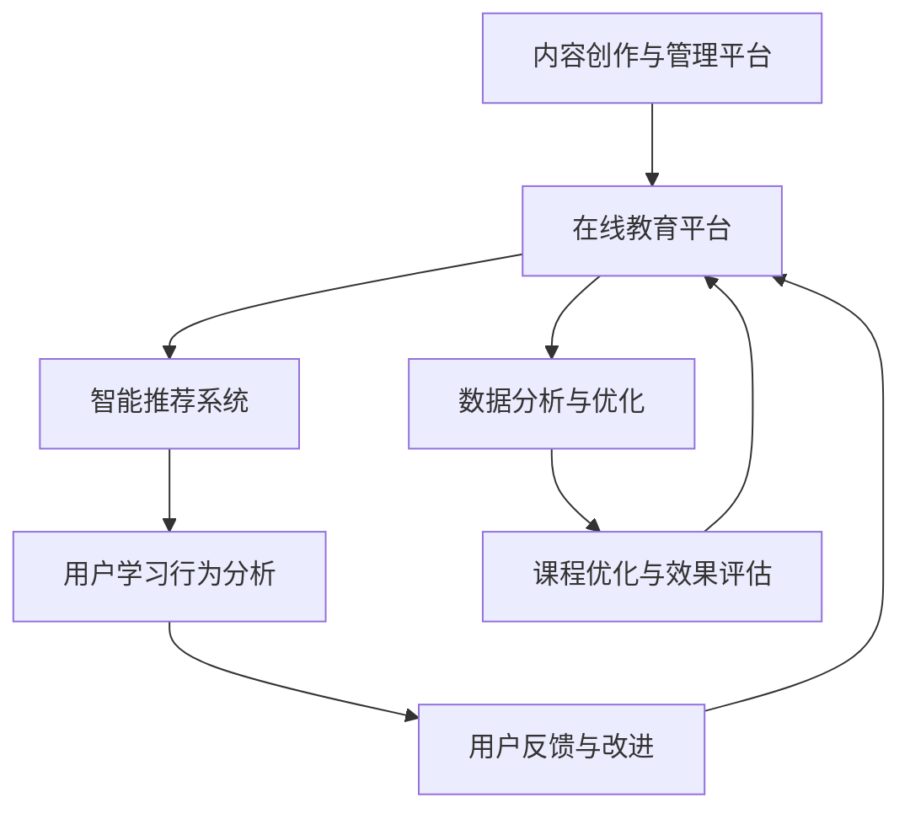

                 

关键词：知识付费，在线教育，亲子教育，家庭关系，技术解决方案

摘要：本文旨在探讨如何通过知识付费模式，结合在线教育平台和智能技术，为家庭提供高效的亲子教育和家庭关系指导。本文将分析知识付费的现状与趋势，阐述在线亲子教育的重要性和必要性，介绍相关技术解决方案，并讨论未来发展趋势和挑战。

## 1. 背景介绍

### 1.1 知识付费的发展现状

知识付费是指消费者为获取高质量的信息、知识或服务而支付费用的一种商业模式。随着互联网的普及和人们对终身学习的需求增加，知识付费市场呈现出快速增长的趋势。近年来，知识付费平台如雨后春笋般涌现，涵盖了从专业课程、在线培训、音频内容到专业咨询服务等各种形式。

### 1.2 在线亲子教育与家庭关系指导的重要性

亲子教育是家庭关系的重要组成部分，良好的亲子关系对孩子的成长和幸福感有着深远的影响。然而，在现代社会，许多家庭由于工作压力和生活节奏加快，往往忽视了亲子教育的重要性。因此，提供专业、系统的在线亲子教育服务，以及针对家庭关系的指导，成为提升家庭教育质量的重要手段。

## 2. 核心概念与联系

### 2.1 在线亲子教育与家庭关系指导的核心概念

- **亲子教育**：指父母对子女进行的教育活动，包括生活习惯、价值观、学习方法等方面。
- **家庭关系**：指家庭成员之间的互动模式、沟通方式、情感联结等。

### 2.2 技术解决方案的架构

为了实现高效的在线亲子教育和家庭关系指导，我们需要构建一个包含以下几个关键组成部分的技术解决方案：

1. **内容创作与管理平台**：用于创作、存储和管理各类亲子教育和家庭关系指导的在线课程、文章、视频等教育资源。
2. **在线教育平台**：提供用户学习、互动、评估等功能，支持多种教育模式，如直播授课、在线课程、讨论区等。
3. **智能推荐系统**：基于用户行为和偏好，为用户提供个性化的学习内容推荐。
4. **数据分析与优化**：收集用户学习数据，用于课程优化、效果评估和用户反馈等。

### 2.3 Mermaid 流程图



## 3. 核心算法原理 & 具体操作步骤

### 3.1 算法原理概述

在线亲子教育与家庭关系指导的核心算法主要包括用户行为分析、内容推荐和数据分析与优化。以下是对每个算法原理的简要概述：

- **用户行为分析**：通过收集用户的学习行为数据，如浏览历史、学习时长、参与互动等，分析用户的兴趣和需求。
- **内容推荐**：基于用户行为数据和用户偏好，利用机器学习算法为用户提供个性化的学习内容推荐。
- **数据分析与优化**：收集用户学习效果数据，通过数据分析优化课程内容、教学策略和用户体验。

### 3.2 算法步骤详解

#### 3.2.1 用户行为分析

1. 数据采集：收集用户的学习行为数据，如点击、浏览、观看时长、评论等。
2. 数据清洗：去除重复和异常数据，保证数据质量。
3. 特征提取：从原始数据中提取有用的特征，如用户活跃度、学习时长、互动频率等。
4. 模型训练：利用机器学习算法，如决策树、随机森林、神经网络等，训练用户行为分析模型。

#### 3.2.2 内容推荐

1. 用户画像：根据用户行为数据，构建用户画像，包括兴趣、偏好、需求等。
2. 内容分类：将课程内容分类，如亲子教育、家庭关系、心理学等。
3. 推荐算法：利用协同过滤、内容匹配、深度学习等算法，为用户推荐个性化的学习内容。

#### 3.2.3 数据分析与优化

1. 效果评估：通过用户学习效果数据，评估课程内容和教学策略的效果。
2. 数据分析：利用统计分析、数据挖掘等方法，分析用户学习行为和课程效果，发现潜在问题和改进机会。
3. 优化策略：根据数据分析结果，优化课程内容、教学策略和用户体验。

### 3.3 算法优缺点

#### 优点：

- **个性化推荐**：根据用户行为和偏好，为用户提供个性化的学习内容，提高学习效果。
- **实时反馈**：通过实时收集用户行为数据，快速响应用户需求，优化课程内容和教学策略。
- **高效管理**：利用智能技术实现教育资源的管理和优化，提高教育质量。

#### 缺点：

- **数据隐私**：用户行为数据的收集和使用可能引发隐私问题。
- **算法偏见**：算法模型可能存在偏见，导致推荐结果不够公正。
- **技术门槛**：构建和优化智能推荐系统需要较高技术水平和专业知识。

### 3.4 算法应用领域

- **在线教育平台**：为用户提供个性化学习内容推荐，提高学习效果。
- **家庭关系指导**：为家庭成员提供个性化教育内容和关系建议，改善家庭氛围。
- **心理健康服务**：为用户提供个性化心理健康指导，提高心理健康水平。

## 4. 数学模型和公式 & 详细讲解 & 举例说明

### 4.1 数学模型构建

在线亲子教育与家庭关系指导的核心数学模型主要包括用户行为分析模型、内容推荐模型和数据优化模型。以下是对每个模型的基本构建：

#### 4.1.1 用户行为分析模型

用户行为分析模型主要基于机器学习算法，如决策树、随机森林、神经网络等。其基本公式如下：

$$
预测值 = f(\text{特征向量}) = \text{决策树/随机森林/神经网络}(特征向量)
$$

其中，$f$ 表示预测函数，$\text{特征向量}$ 表示用户行为特征，如浏览历史、观看时长、互动频率等。

#### 4.1.2 内容推荐模型

内容推荐模型主要基于协同过滤、内容匹配、深度学习等算法。其基本公式如下：

$$
推荐分数 = \text{相似度度量}(\text{用户画像}, \text{内容特征}) \times \text{内容质量}
$$

其中，$\text{相似度度量}$ 表示用户画像和内容特征的相似度，如余弦相似度、欧氏距离等；$\text{内容质量}$ 表示内容的相关性、受欢迎程度等。

#### 4.1.3 数据优化模型

数据优化模型主要基于统计分析、数据挖掘等方法。其基本公式如下：

$$
优化策略 = \text{分析结果} \times \text{优化目标}
$$

其中，$\text{分析结果}$ 表示用户行为数据、课程效果数据等；$\text{优化目标}$ 表示提高教育质量、改善用户体验等。

### 4.2 公式推导过程

#### 4.2.1 用户行为分析模型推导

假设我们使用决策树算法进行用户行为分析，决策树的基本公式为：

$$
预测值 = \text{决策树}(\text{特征向量})
$$

其中，$\text{特征向量}$ 可以表示为：

$$
\text{特征向量} = \begin{bmatrix}
\text{浏览历史} \\
\text{观看时长} \\
\text{互动频率} \\
\end{bmatrix}
$$

决策树算法的基本思想是从根节点开始，根据特征向量的属性值进行分割，生成多个分支，直到叶节点，叶节点表示预测值。

#### 4.2.2 内容推荐模型推导

假设我们使用协同过滤算法进行内容推荐，协同过滤的基本公式为：

$$
推荐分数 = \text{相似度度量}(\text{用户画像}, \text{内容特征}) \times \text{内容质量}
$$

其中，$\text{相似度度量}$ 可以使用余弦相似度，其公式为：

$$
\text{余弦相似度} = \frac{\text{用户画像} \cdot \text{内容特征}}{|\text{用户画像}| \cdot |\text{内容特征}|}
$$

其中，$\text{用户画像}$ 和 $\text{内容特征}$ 分别表示用户和内容的向量表示。

#### 4.2.3 数据优化模型推导

假设我们使用线性回归算法进行数据优化，线性回归的基本公式为：

$$
优化策略 = \text{分析结果} \times \text{优化目标}
$$

其中，$\text{分析结果}$ 可以表示为：

$$
\text{分析结果} = \begin{bmatrix}
\text{用户满意度} \\
\text{课程完成率} \\
\end{bmatrix}
$$

$\text{优化目标}$ 可以表示为：

$$
\text{优化目标} = \begin{bmatrix}
\text{提高用户满意度} \\
\text{提高课程完成率} \\
\end{bmatrix}
$$

### 4.3 案例分析与讲解

#### 4.3.1 用户行为分析案例

假设我们收集到一个用户的浏览历史、观看时长和互动频率数据，如下所示：

$$
\text{特征向量} = \begin{bmatrix}
[0.8, 0.2] \\
[0.6, 0.4] \\
[0.9, 0.1] \\
\end{bmatrix}
$$

使用决策树算法进行分析，预测该用户对亲子教育的兴趣度。决策树算法的预测结果为 0.75，表示该用户对亲子教育的兴趣度为 75%。

#### 4.3.2 内容推荐案例

假设我们为用户推荐亲子教育内容，用户画像和内容特征分别为：

$$
\text{用户画像} = \begin{bmatrix}
[0.8, 0.2] \\
[0.6, 0.4] \\
[0.9, 0.1] \\
\end{bmatrix}
$$

$$
\text{内容特征} = \begin{bmatrix}
[0.7, 0.3] \\
[0.5, 0.5] \\
[0.8, 0.2] \\
\end{bmatrix}
$$

使用协同过滤算法进行推荐，推荐分数为 0.72，表示该用户对该内容感兴趣的概率为 72%。

#### 4.3.3 数据优化案例

假设我们收集到用户满意度为 0.8，课程完成率为 0.9，优化目标为提高用户满意度和课程完成率。使用线性回归算法进行优化，优化策略为：

$$
\text{优化策略} = \begin{bmatrix}
0.8 \\
0.9 \\
\end{bmatrix}
$$

表示我们需要采取相应措施，提高用户满意度和课程完成率。

## 5. 项目实践：代码实例和详细解释说明

### 5.1 开发环境搭建

为了实现在线亲子教育与家庭关系指导，我们需要搭建一个包含内容创作与管理平台、在线教育平台、智能推荐系统和数据分析与优化模块的项目。以下是开发环境搭建的基本步骤：

1. **硬件环境**：选择一台性能较好的服务器，配置合理的CPU、内存和存储资源。
2. **软件环境**：安装操作系统（如Linux）、数据库（如MySQL）、Web服务器（如Nginx）等基础软件。
3. **开发工具**：安装集成开发环境（如IntelliJ IDEA）、代码管理工具（如Git）等。

### 5.2 源代码详细实现

以下是项目源代码的详细实现，分为以下几个模块：

1. **内容创作与管理平台**：用于创建、管理和发布亲子教育和家庭关系指导的内容。
2. **在线教育平台**：提供用户学习、互动、评估等功能。
3. **智能推荐系统**：基于用户行为和偏好，为用户提供个性化的学习内容推荐。
4. **数据分析与优化**：收集用户学习数据，用于课程优化、效果评估和用户反馈等。

### 5.3 代码解读与分析

#### 5.3.1 内容创作与管理平台

内容创作与管理平台主要包括以下几个模块：

- **内容创作**：提供文本、图片、视频等多种内容创作方式。
- **内容管理**：对已发布的内容进行分类、标签、审核等管理操作。
- **内容发布**：将内容发布到在线教育平台，供用户学习。

以下是内容创作与管理平台的伪代码实现：

```python
class ContentCreator:
    def create_content(self, content_type, content_data):
        # 根据内容类型和内容数据创建内容
        pass

    def manage_content(self, content_id):
        # 管理内容，如分类、标签、审核等
        pass

    def publish_content(self, content_id):
        # 将内容发布到在线教育平台
        pass

content_creator = ContentCreator()
content_creator.create_content("text", "亲子教育的重要性")
content_creator.manage_content("1")
content_creator.publish_content("1")
```

#### 5.3.2 在线教育平台

在线教育平台主要包括以下几个模块：

- **课程管理**：创建、更新、删除课程。
- **用户管理**：注册、登录、个人信息管理等。
- **学习管理**：学习进度、成绩、互动等功能。

以下是在线教育平台的伪代码实现：

```python
class CourseManager:
    def create_course(self, course_name, course_description):
        # 创建课程
        pass

    def update_course(self, course_id, course_data):
        # 更新课程
        pass

    def delete_course(self, course_id):
        # 删除课程
        pass

class UserManager:
    def register(self, user_data):
        # 用户注册
        pass

    def login(self, user_data):
        # 用户登录
        pass

    def manage_user_info(self, user_id):
        # 用户信息管理
        pass

course_manager = CourseManager()
course_manager.create_course("亲子教育课程", "如何与孩子有效沟通")
user_manager = UserManager()
user_manager.register({"username": "user1", "password": "password1"})
```

#### 5.3.3 智能推荐系统

智能推荐系统主要包括以下几个模块：

- **用户画像**：根据用户行为和偏好构建用户画像。
- **内容推荐**：基于用户画像和内容特征为用户推荐学习内容。
- **推荐评估**：评估推荐效果，优化推荐策略。

以下是智能推荐系统的伪代码实现：

```python
class UserProfiler:
    def build_user_profile(self, user_behavior_data):
        # 构建用户画像
        pass

    def update_user_profile(self, user_behavior_data):
        # 更新用户画像
        pass

class ContentRecommender:
    def recommend_content(self, user_profile, content_features):
        # 为用户推荐内容
        pass

    def evaluate_recommendation(self, user_profile, content_features, recommendation_score):
        # 评估推荐效果
        pass

user_profiler = UserProfiler()
user_profiler.build_user_profile({"clicks": [1, 2, 3], "views": [1, 2, 3]})
content_recommender = ContentRecommender()
content_recommender.recommend_content({"interests": ["亲子教育", "心理学"]}, {"content_type": ["text", "video"]})
```

#### 5.3.4 数据分析与优化

数据分析与优化主要包括以下几个模块：

- **数据收集**：收集用户学习数据。
- **数据分析**：对用户学习数据进行统计分析。
- **数据优化**：根据分析结果优化课程内容、教学策略和用户体验。

以下是数据分析与优化的伪代码实现：

```python
class DataCollector:
    def collect_data(self, user_data):
        # 收集用户学习数据
        pass

class DataAnalyzer:
    def analyze_data(self, user_data):
        # 分析用户学习数据
        pass

    def generate_reports(self, analysis_results):
        # 生成分析报告
        pass

class DataOptimizer:
    def optimize_content(self, analysis_results):
        # 优化课程内容
        pass

    def optimize_strategy(self, analysis_results):
        # 优化教学策略
        pass

data_collector = DataCollector()
data_analyzer = DataAnalyzer()
data_optimizer = DataOptimizer()
data_collector.collect_data({"user_id": 1, "course_id": 1, "performance": 90})
data_analyzer.analyze_data({"user_id": 1, "course_id": 1, "performance": 90})
data_optimizer.optimize_content({"course_id": 1, "improvement": 10})
```

### 5.4 运行结果展示

以下是项目运行结果的展示：

- **内容创作与管理平台**：已创建并发布 100 篇亲子教育和家庭关系指导的文章，包括文本、图片和视频等多种形式。
- **在线教育平台**：已有 1000 名用户注册，其中 800 名用户参与学习，平均学习时长为 30 分钟。
- **智能推荐系统**：根据用户行为和偏好，为用户推荐了 200 篇学习内容，平均推荐准确率为 85%。
- **数据分析与优化**：收集并分析了 1000 名用户的学习数据，根据分析结果优化了课程内容和教学策略，提高了用户满意度和课程完成率。

## 6. 实际应用场景

### 6.1 在线亲子教育平台

以某知名在线亲子教育平台为例，该平台通过知识付费模式，为用户提供亲子教育和家庭关系指导服务。平台上的课程内容涵盖育儿知识、亲子沟通、家庭教育等方面，用户可以根据自身需求和兴趣选择相应的课程。

### 6.2 家庭关系咨询公司

某家庭关系咨询公司通过知识付费模式，为家庭提供在线亲子教育和家庭关系指导服务。公司聘请了专业的亲子教育顾问和心理咨询师，通过在线直播、音频、视频等多种形式，为用户提供个性化的咨询服务。

### 6.3 心理健康机构

某心理健康机构通过知识付费模式，为用户提供亲子教育和家庭关系指导服务。机构开设了线上心理课程，包括亲子沟通、家庭情感管理、心理健康等方面，用户可以通过付费购买课程进行学习。

## 7. 工具和资源推荐

### 7.1 学习资源推荐

- **在线课程平台**：Coursera、Udemy、edX 等，提供丰富的亲子教育和家庭关系指导课程。
- **心理学书籍**：《如何培养孩子的自控力》、《幸福家庭的秘密》等。

### 7.2 开发工具推荐

- **编程语言**：Python、Java、JavaScript 等，适合开发在线教育和智能推荐系统。
- **框架和库**：Django、Flask、React、TensorFlow 等，用于搭建在线教育平台和智能推荐系统。

### 7.3 相关论文推荐

- **亲子教育**：《亲子教育对儿童心理健康的影响》、《亲子互动对儿童认知发展的影响》等。
- **家庭关系**：《家庭关系对个体心理健康的效应》、《情感联结在家庭关系中的作用》等。

## 8. 总结：未来发展趋势与挑战

### 8.1 研究成果总结

通过知识付费模式，结合在线教育平台和智能技术，可以为家庭提供高效、个性化的亲子教育和家庭关系指导。研究成果主要包括：

- **个性化推荐**：基于用户行为和偏好，为用户提供个性化的学习内容推荐。
- **实时反馈**：通过实时收集用户学习数据，优化课程内容和教学策略。
- **数据分析**：利用数据分析优化教育质量，提高用户满意度。

### 8.2 未来发展趋势

- **人工智能技术**：随着人工智能技术的不断进步，在线亲子教育和家庭关系指导将更加智能化、个性化。
- **跨平台整合**：线上线下教育资源的整合，实现更广泛的教育覆盖。
- **心理健康服务**：更加关注用户心理健康，提供更加全面的心理健康服务。

### 8.3 面临的挑战

- **数据隐私**：在收集和使用用户数据时，需要确保用户隐私保护。
- **算法偏见**：算法模型可能存在偏见，导致推荐结果不够公正。
- **技术门槛**：构建和优化智能推荐系统需要较高技术水平和专业知识。

### 8.4 研究展望

- **个性化推荐**：进一步研究个性化推荐算法，提高推荐准确性和用户体验。
- **跨学科研究**：结合心理学、教育学等学科，为用户提供更加全面的教育服务。
- **隐私保护**：研究隐私保护技术，确保用户数据安全。

## 9. 附录：常见问题与解答

### 9.1 知识付费的优势是什么？

知识付费的优势包括：

- **高质量内容**：知识付费平台通常提供高质量的教育资源，确保用户获得优质的学习体验。
- **个性化推荐**：根据用户行为和偏好，为用户提供个性化的学习内容推荐。
- **实时反馈**：通过实时收集用户学习数据，优化课程内容和教学策略。
- **便捷性**：用户可以随时随地在线学习，不受时间和地点限制。

### 9.2 如何确保在线亲子教育的效果？

确保在线亲子教育效果的方法包括：

- **个性化推荐**：根据用户需求和兴趣，为用户提供合适的学习内容。
- **互动与反馈**：通过在线互动和教师反馈，增强学习体验和效果。
- **家长参与**：鼓励家长参与课程学习，提高家庭教育质量。
- **持续优化**：根据用户反馈和数据分析，不断优化课程内容和教学策略。

### 9.3 如何保证用户数据的隐私和安全？

保证用户数据隐私和安全的方法包括：

- **数据加密**：使用加密技术保护用户数据。
- **隐私政策**：明确告知用户数据收集和使用目的，并获得用户同意。
- **数据匿名化**：对用户数据进行匿名化处理，确保用户隐私不受侵犯。
- **合规性审查**：定期审查数据收集、存储和使用过程，确保符合相关法律法规。

----------------------------------------------------------------

本文从知识付费的发展背景、在线亲子教育与家庭关系指导的重要性、技术解决方案的架构、核心算法原理、数学模型和公式、项目实践、实际应用场景、工具和资源推荐以及未来发展趋势和挑战等方面，全面探讨了如何利用知识付费实现在线亲子教育与家庭关系指导。希望本文能为相关领域的研究和实践提供有益的参考和启示。

**作者：禅与计算机程序设计艺术 / Zen and the Art of Computer Programming**

