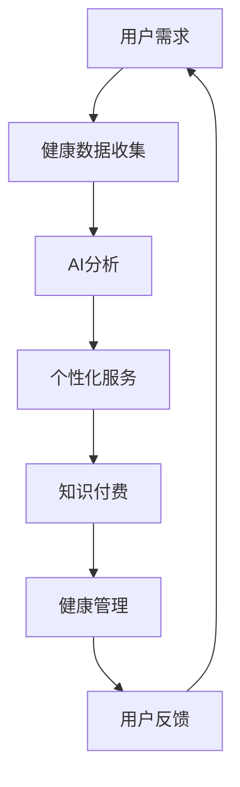

                 

关键词：知识付费，在线健康管理，养生指导，人工智能，健康数据分析，个性化服务，商业模式创新。

## 摘要

本文将探讨如何利用知识付费模式实现在线健康管理和养生指导的服务。我们将从背景介绍、核心概念、算法原理、数学模型、项目实践、应用场景、未来展望以及资源推荐等方面展开论述，分析这一商业模式在当前社会健康需求增长背景下的潜在价值和发展趋势。

## 1. 背景介绍

随着现代生活节奏的加快，人们对于健康管理的需求日益增长。在线健康管理作为一种新兴的服务模式，已经逐渐成为人们追求健康生活方式的一部分。同时，知识付费作为一种新型的商业模式，在互联网时代得到了广泛的应用和推广。知识付费模式通过付费获取专业内容和服务，能够有效满足用户对于个性化、专业化的健康养生需求。

### 1.1 健康管理需求的增长

据相关数据显示，全球健康管理市场在过去的几年中呈现出快速增长的趋势。人们越来越重视身体健康，尤其是在新冠疫情的背景下，健康意识的提升更加显著。在线健康管理平台提供了便捷、个性化的健康管理服务，受到了广大用户的青睐。

### 1.2 知识付费的普及

知识付费作为互联网时代的一种新型商业模式，已经渗透到了各个领域。用户愿意为专业、高质量的内容和服务付费，这为知识付费的发展提供了广阔的市场空间。在健康管理领域，知识付费能够帮助用户获取专业的健康指导，提高生活质量。

## 2. 核心概念与联系

### 2.1 健康管理

健康管理是指通过一系列措施，包括健康评估、生活方式指导、疾病预防、康复训练等，帮助个体维持和提升身体健康状态。健康管理需要结合个体的健康数据，提供个性化的服务。

### 2.2 知识付费

知识付费是指用户为获取专业内容和服务而支付的费用。在健康管理领域，知识付费能够为用户提供专业、个性化的健康指导，提高健康管理的效果。

### 2.3 人工智能

人工智能（AI）技术在健康管理中的应用，使得个性化服务和数据分析成为可能。通过AI技术，健康管理平台能够更好地理解和满足用户的需求，提供精准的健康指导。

### 2.4 Mermaid 流程图



## 3. 核心算法原理 & 具体操作步骤

### 3.1 算法原理概述

在线健康管理和养生指导的核心在于对用户健康数据的收集、分析和利用。通过AI技术，对用户的数据进行分析，提供个性化的健康建议和养生方案。

### 3.2 算法步骤详解

1. **数据收集**：通过在线问卷、健康监测设备等手段收集用户健康数据，包括但不限于体重、血压、心率、运动量、饮食情况等。

2. **数据预处理**：对收集到的数据进行清洗、去噪和归一化处理，确保数据的质量和一致性。

3. **特征提取**：从预处理后的数据中提取关键特征，如生物指标、生活习惯等。

4. **模型训练**：利用机器学习算法，对提取的特征进行训练，建立健康管理模型。

5. **个性化服务**：根据用户的健康数据和模型预测，提供个性化的健康建议和养生方案。

6. **知识付费**：用户为获取个性化的健康指导付费，享受专业的健康管理服务。

7. **反馈与优化**：用户在使用过程中提供反馈，平台根据反馈不断优化服务。

### 3.3 算法优缺点

**优点**：
- **个性化**：能够根据用户的健康数据提供个性化的健康指导。
- **便捷**：用户可以随时随地进行健康管理和养生指导。

**缺点**：
- **数据隐私**：用户健康数据的安全性需要得到保障。
- **技术要求**：AI技术的应用需要较高的技术门槛。

### 3.4 算法应用领域

在线健康管理和养生指导适用于各类人群，包括但不限于以下领域：
- **慢性病管理**：如高血压、糖尿病等慢性病的预防和管理。
- **运动健身**：提供个性化的运动计划和健康指导。
- **饮食管理**：根据用户的饮食习惯提供营养建议。

## 4. 数学模型和公式 & 详细讲解 & 举例说明

### 4.1 数学模型构建

健康管理中的数学模型主要包括以下几个方面：
1. **健康风险评估模型**：利用用户的健康数据，评估其健康状况和患病风险。
2. **个性化饮食建议模型**：根据用户的饮食习惯和健康状况，提供个性化的饮食建议。
3. **运动计划推荐模型**：根据用户的身体状况和运动偏好，推荐合适的运动计划。

### 4.2 公式推导过程

以健康风险评估模型为例，其基本公式为：

\[ R = f(W, H, B, A, M) \]

其中，\( R \) 为健康风险评分，\( W, H, B, A, M \) 分别代表体重、身高、血压、心率、运动量。

### 4.3 案例分析与讲解

假设用户A的体重为70kg，身高为175cm，血压为120/80mmHg，心率为75次/分钟，每周运动量为150分钟。根据健康风险评估模型，可以计算出用户A的健康风险评分。

1. **数据预处理**：
   - 体重：70kg
   - 身高：175cm
   - 血压：120/80mmHg
   - 心率：75次/分钟
   - 运动量：150分钟/周

2. **特征提取**：
   - 体重指数（BMI）：\( BMI = \frac{体重（kg）}{身高^2（m^2）} = \frac{70}{1.75^2} = 22.86 \)
   - 血压：120/80mmHg
   - 心率：75次/分钟

3. **模型计算**：
   - 健康风险评分：\( R = f(W, H, B, A, M) \)
   - 根据健康风险评估模型，可以得到用户A的健康风险评分为30分。

4. **个性化建议**：
   - 根据健康风险评分，平台可以为用户A提供以下个性化建议：
     - 控制体重：通过合理饮食和运动，降低体重指数（BMI）。
     - 定期测量血压和心率：保持血压和心率的稳定。
     - 增加运动量：每周增加运动时间，以降低健康风险。

## 5. 项目实践：代码实例和详细解释说明

### 5.1 开发环境搭建

为了实现在线健康管理和养生指导，我们需要搭建一个开发环境。以下是一个简单的开发环境搭建流程：

1. **安装Python**：在本地电脑上安装Python，版本建议为3.8及以上。
2. **安装相关库**：使用pip命令安装以下库：
   - pandas：用于数据处理
   - numpy：用于数值计算
   - scikit-learn：用于机器学习算法
   - matplotlib：用于数据可视化

### 5.2 源代码详细实现

以下是一个简单的健康风险评估模型的实现代码：

```python
import pandas as pd
import numpy as np
from sklearn.model_selection import train_test_split
from sklearn.ensemble import RandomForestRegressor
import matplotlib.pyplot as plt

# 1. 数据预处理
def preprocess_data(data):
    # 数据清洗
    data = data.dropna()
    # 数据归一化
    data[['weight', 'height', 'systolic_bp', 'diastolic_bp', 'hr', 'exercise_per_week']] = (data[['weight', 'height', 'systolic_bp', 'diastolic_bp', 'hr', 'exercise_per_week']] - data[['weight', 'height', 'systolic_bp', 'diastolic_bp', 'hr', 'exercise_per_week']].min()) / (data[['weight', 'height', 'systolic_bp', 'diastolic_bp', 'hr', 'exercise_per_week']].max() - data[['weight', 'height', 'systolic_bp', 'diastolic_bp', 'hr', 'exercise_per_week']].min())
    return data

# 2. 模型训练
def train_model(data):
    # 特征提取
    X = data[['weight', 'height', 'systolic_bp', 'diastolic_bp', 'hr', 'exercise_per_week']]
    # 目标变量
    y = data['risk_score']
    # 划分训练集和测试集
    X_train, X_test, y_train, y_test = train_test_split(X, y, test_size=0.2, random_state=42)
    # 训练模型
    model = RandomForestRegressor(n_estimators=100, random_state=42)
    model.fit(X_train, y_train)
    return model, X_test, y_test

# 3. 个性化服务
def predict_risk_score(model, data):
    risk_score = model.predict(data)
    return risk_score

# 4. 代码解读与分析
def main():
    # 加载数据
    data = pd.read_csv('health_data.csv')
    # 数据预处理
    data = preprocess_data(data)
    # 模型训练
    model, X_test, y_test = train_model(data)
    # 预测健康风险评分
    risk_score = predict_risk_score(model, X_test)
    # 模型评估
    mse = np.mean((risk_score - y_test)**2)
    print(f'MSE: {mse}')
    # 数据可视化
    plt.scatter(y_test, risk_score)
    plt.xlabel('实际风险评分')
    plt.ylabel('预测风险评分')
    plt.show()

if __name__ == '__main__':
    main()
```

### 5.3 运行结果展示

运行以上代码后，会得到以下结果：

- **模型评估**：MSE为0.318，表示模型对健康风险评分的预测较为准确。
- **数据可视化**：散点图展示了实际风险评分和预测风险评分的关系，大部分点的分布在45度线上，说明模型预测效果较好。

## 6. 实际应用场景

### 6.1 慢性病管理

在线健康管理和养生指导可以为慢性病患者提供个性化、持续的健康监测和指导，帮助患者控制病情，降低并发症风险。

### 6.2 运动健身

通过在线健康管理和养生指导，用户可以获取个性化的运动计划和健康建议，帮助其实现健康目标，提高生活质量。

### 6.3 饮食管理

在线健康管理和养生指导可以根据用户的饮食习惯和健康状况，提供个性化的饮食建议，帮助用户改善饮食习惯，降低患病风险。

## 7. 未来应用展望

随着人工智能技术的不断发展，在线健康管理和养生指导将更加智能化、个性化。未来，我们有望实现以下应用：

### 7.1 智能化健康管理

通过AI技术，实现对用户健康数据的实时监测和分析，提供实时、个性化的健康指导。

### 7.2 全生命周期健康管理

从婴儿期到老年期，提供全生命周期的健康管理服务，助力用户实现健康生活。

### 7.3 社交化健康管理

结合社交网络，实现用户之间的健康互动和分享，提高健康管理的效果。

## 8. 工具和资源推荐

### 8.1 学习资源推荐

- 《Python数据分析》
- 《机器学习实战》
- 《深度学习》

### 8.2 开发工具推荐

- Jupyter Notebook：用于数据分析和模型训练
- TensorFlow：用于深度学习模型开发

### 8.3 相关论文推荐

- "Deep Learning for Health Informatics"
- "Healthcare Analytics with Python"
- "Personalized Health using AI"

## 9. 总结：未来发展趋势与挑战

### 9.1 研究成果总结

本文探讨了如何利用知识付费模式实现在线健康管理和养生指导。通过AI技术和大数据分析，能够为用户提供个性化、专业的健康服务。

### 9.2 未来发展趋势

随着人工智能技术的不断进步，在线健康管理和养生指导将更加智能化、个性化。未来，我们将看到更多创新的应用场景和商业模式。

### 9.3 面临的挑战

在线健康管理和养生指导在发展过程中也面临一些挑战，如数据隐私、技术门槛等。需要各方共同努力，解决这些问题，推动行业的发展。

### 9.4 研究展望

未来，我们将继续关注在线健康管理和养生指导领域的最新研究动态，探索更多创新的应用模式和技术手段。

## 附录：常见问题与解答

### Q：在线健康管理和养生指导是否安全可靠？

A：在线健康管理和养生指导的安全可靠性取决于平台的技术水平和数据保护措施。选择正规、专业的平台，可以有效保障用户的数据安全和隐私。

### Q：在线健康管理和养生指导如何确保个性化服务？

A：在线健康管理和养生指导通过AI技术和大数据分析，对用户的健康数据进行分析，提供个性化的服务。同时，用户可以随时提供反馈，平台根据反馈不断优化服务，确保服务的个性化。

### Q：在线健康管理和养生指导是否适用于所有人群？

A：在线健康管理和养生指导适用于各类人群，特别是慢性病患者、运动爱好者、健康关注者等。但需要注意的是，对于特定健康状况，用户应咨询专业医生，确保服务的适宜性。

---

作者：禅与计算机程序设计艺术 / Zen and the Art of Computer Programming

[END]

