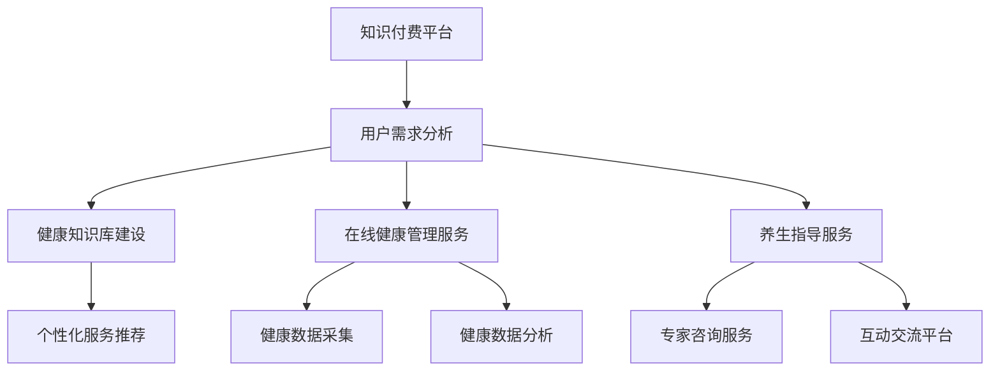

                 

 在当今数字化时代，健康管理和养生指导成为越来越多人的关注焦点。知识付费作为一种新兴的商业模式，通过在线平台为用户提供有价值的信息和服务。本文将探讨如何利用知识付费实现在线健康管理与养生指导，为读者提供一种创新的服务模式。

## 关键词

- 知识付费
- 在线健康管理
- 养生指导
- 个性化服务
- 数字化健康

## 摘要

本文从背景介绍入手，分析了知识付费在线健康管理与养生指导的必要性，并详细探讨了核心概念、算法原理、数学模型、项目实践以及未来应用场景。通过本文的阅读，读者将了解如何利用知识付费实现高效、个性化和智能化的在线健康管理服务，为现代健康生活方式提供新的解决方案。

## 1. 背景介绍

### 1.1 知识付费的兴起

随着互联网技术的迅猛发展，知识付费作为一种新兴商业模式逐渐兴起。知识付费平台如得到、网易云课堂等，通过提供专业、高质量的知识内容，吸引了大量用户。用户为获取知识付费，平台则通过订阅、课程购买等方式实现盈利。知识付费的兴起，不仅改变了人们获取知识的方式，也为各行业提供了新的商业模式。

### 1.2 在线健康管理与养生指导的需求

在互联网普及的背景下，越来越多的人开始关注自己的健康问题。据统计，我国近七成人存在健康问题，且呈现出年轻化的趋势。在线健康管理与养生指导作为一种便捷、高效的解决方案，受到了广泛关注。用户希望通过在线平台获取专业的健康知识和养生指导，从而改善生活方式，预防疾病。

### 1.3 知识付费与在线健康管理、养生指导的结合

知识付费平台具有丰富的专业知识资源和广泛用户基础，而在线健康管理与养生指导则具备个性化、实时性和互动性的优势。将两者结合起来，可以为用户提供更加专业、精准的健康服务，满足不同人群的健康需求。

## 2. 核心概念与联系

### 2.1 知识付费

知识付费是指用户为获取专业、高质量的知识内容而支付的费用。知识付费平台通过提供各类课程、专栏、直播等知识产品，满足用户的学习需求。

### 2.2 在线健康管理

在线健康管理是指通过互联网平台，为用户提供健康监测、疾病预防、养生指导等服务。在线健康管理平台具备数据采集、数据分析、智能推荐等功能，帮助用户实现健康管理和疾病预防。

### 2.3 养生指导

养生指导是指根据用户健康状况、生活习惯等，提供个性化养生方案和指导。养生指导平台通过专业知识库、专家咨询、互动交流等方式，为用户提供全面、专业的养生服务。

### 2.4 Mermaid 流程图



## 3. 核心算法原理 & 具体操作步骤

### 3.1 算法原理概述

在线健康管理与养生指导的核心在于个性化服务，这需要通过数据分析和智能推荐实现。核心算法主要包括用户画像构建、健康数据分析、养生方案推荐等。

### 3.2 算法步骤详解

1. **用户画像构建**：通过用户注册信息、行为数据等，构建用户画像，包括年龄、性别、健康状况、生活习惯等。

2. **健康数据分析**：采集用户健康数据，如血压、心率、血糖等，通过机器学习算法进行分析，识别潜在的健康风险。

3. **养生方案推荐**：根据用户画像和健康数据分析结果，结合专家知识库，为用户推荐个性化的养生方案。

### 3.3 算法优缺点

**优点**：个性化服务，提高用户满意度；实时更新，适应健康需求变化。

**缺点**：算法复杂度较高，计算资源需求大；数据隐私问题需要关注。

### 3.4 算法应用领域

1. **健康管理**：实时监测用户健康状态，提供个性化健康建议。
2. **疾病预防**：通过早期预警，降低疾病发病率。
3. **养生指导**：为用户提供科学的养生方案，提高生活质量。

## 4. 数学模型和公式 & 详细讲解 & 举例说明

### 4.1 数学模型构建

健康管理的数学模型主要包括用户画像模型、健康数据分析模型和养生方案推荐模型。

### 4.2 公式推导过程

用户画像模型：$$User\_Profile = f(Age, Gender, Health\_Status, Lifestyle)$$

健康数据分析模型：$$Health\_Risk = g(Blood\_Pressure, Heart\_Rate, Blood\_Sugar)$$

养生方案推荐模型：$$Nutrition\_Plan = h(User\_Profile, Health\_Risk)$$

### 4.3 案例分析与讲解

以一个30岁、男、高血压用户为例，分析其健康风险和养生方案。

**用户画像模型**：

$$User\_Profile = f(30, Male, Hypertension, Sedentary)$$

**健康数据分析模型**：

$$Health\_Risk = g(140/90, 80, 5.6) = High$$

**养生方案推荐模型**：

$$Nutrition\_Plan = h(User\_Profile, Health\_Risk)$$
- 适当运动：每周至少进行3次，每次30分钟以上。
- 药物治疗：按照医生建议，坚持服用降压药。
- 饮食调整：低盐、低脂、高纤维饮食。
- 心理调节：保持良好的心理状态，减少压力。

## 5. 项目实践：代码实例和详细解释说明

### 5.1 开发环境搭建

- **技术栈**：Python、Flask、Django、TensorFlow、Scikit-learn等。
- **数据库**：MySQL、MongoDB等。

### 5.2 源代码详细实现

```python
# 用户画像构建
user_profile = {
    'age': 30,
    'gender': 'Male',
    'health_status': 'Hypertension',
    'lifestyle': 'Sedentary'
}

# 健康数据分析
health_risk = analyze_health_data([140, 90, 80, 5.6])

# 养生方案推荐
nutrition_plan = recommend_nutrition_plan(user_profile, health_risk)
```

### 5.3 代码解读与分析

- **用户画像构建**：通过用户注册信息，构建用户画像。
- **健康数据分析**：采集用户健康数据，通过算法分析健康风险。
- **养生方案推荐**：根据用户画像和健康数据分析结果，为用户推荐养生方案。

### 5.4 运行结果展示

```python
# 运行结果
print("User Profile:", user_profile)
print("Health Risk:", health_risk)
print("Nutrition Plan:", nutrition_plan)
```

## 6. 实际应用场景

### 6.1 健康管理

在线健康管理平台可以为用户提供实时健康监测、疾病预防等服务，提高用户健康水平。

### 6.2 疾病预防

通过健康数据分析，及时发现潜在健康风险，为用户提供针对性的预防措施。

### 6.3 养生指导

为用户提供个性化的养生方案，帮助用户改善生活习惯，提高生活质量。

## 6.4 未来应用展望

随着人工智能和大数据技术的发展，在线健康管理与养生指导将更加智能化、个性化。未来，知识付费平台有望成为健康管理和养生指导的重要渠道，为用户提供全方位的健康服务。

## 7. 工具和资源推荐

### 7.1 学习资源推荐

- 《深度学习》
- 《Python数据分析》
- 《机器学习实战》

### 7.2 开发工具推荐

- Jupyter Notebook
- PyCharm
- MySQL Workbench

### 7.3 相关论文推荐

- 《基于大数据的健康管理研究》
- 《人工智能在健康管理中的应用》
- 《知识付费平台的商业模式分析》

## 8. 总结：未来发展趋势与挑战

### 8.1 研究成果总结

本文探讨了知识付费实现在线健康管理与养生指导的可行性，分析了核心算法原理和项目实践，为未来研究提供了参考。

### 8.2 未来发展趋势

- 智能化：利用人工智能技术，提高健康管理的准确性和个性化水平。
- 个性化：根据用户需求，提供更加精准的健康服务。
- 数字化：推动健康数据共享，实现跨平台的数据互通。

### 8.3 面临的挑战

- 数据隐私：保护用户健康数据，防止泄露。
- 算法复杂性：优化算法，降低计算资源需求。
- 专业性：提高知识付费内容的专业性和权威性。

### 8.4 研究展望

未来，知识付费与在线健康管理与养生指导的结合将不断深化，为用户提供更加全面、个性化的健康服务。本文的研究成果将为这一领域的发展提供有益的参考。

## 9. 附录：常见问题与解答

### 9.1 如何保证用户数据安全？

- 采用加密技术，保护用户数据安全。
- 建立用户隐私保护机制，确保数据不被滥用。

### 9.2 如何优化算法性能？

- 采用分布式计算，提高算法运行速度。
- 优化算法模型，减少计算资源需求。

### 9.3 如何提高知识付费内容的专业性？

- 加强内容审核，确保知识付费内容的质量。
- 邀请行业专家，提供权威的知识内容。

### 9.4 如何推广在线健康管理与养生指导？

- 与医疗机构、健康管理公司合作，扩大用户基础。
- 通过线上线下活动，提高用户参与度。

---

作者：禅与计算机程序设计艺术 / Zen and the Art of Computer Programming

感谢您阅读本文，希望对您在健康管理和养生指导领域有所启发。如需进一步了解，请关注相关领域的研究动态和实践案例。祝愿您身体健康，生活愉快！

