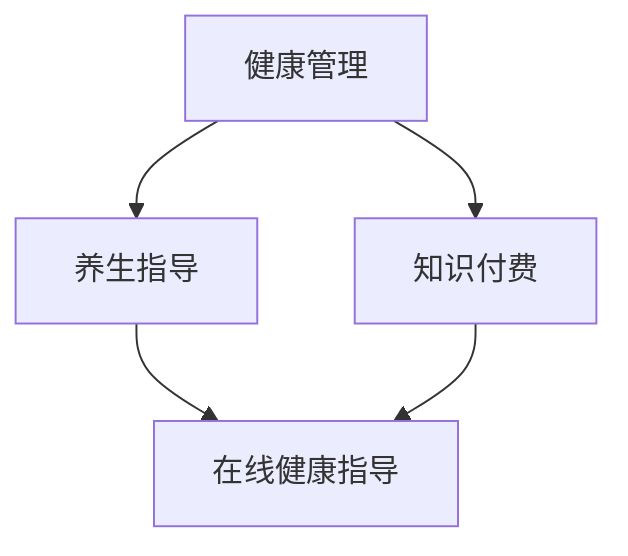

                 

 在这个数字化时代，知识付费已经成为了人们获取专业知识和技能的重要途径。尤其是在健康管理领域，越来越多的人开始关注自己的健康问题，并通过在线平台获取专业的养生指导。本文将探讨如何利用知识付费实现在线健康管理与养生指导，并分析其背后的核心概念、算法原理、数学模型以及实际应用场景。

## 文章关键词

- 知识付费
- 在线健康管理
- 养生指导
- 数字化健康
- 人工智能
- 数学模型
- 实际应用

## 文章摘要

本文将首先介绍知识付费的背景和现状，探讨其在健康管理领域的应用。接着，我们将深入探讨在线健康管理和养生指导的核心概念、算法原理以及数学模型。随后，文章将展示一个实际项目案例，详细解释其开发过程、代码实现以及运行结果。最后，我们将讨论在线健康管理和养生指导的未来应用场景以及面临的技术挑战和未来研究方向。

## 1. 背景介绍

### 1.1 知识付费的概念

知识付费是指用户为获取特定知识或技能而向知识提供者支付费用的一种模式。随着互联网技术的快速发展，知识付费已经渗透到了各个领域，包括教育、医疗、财务咨询等。用户可以通过在线课程、专业咨询、付费内容等方式，获取专业知识和技能。

### 1.2 健康管理的重要性

随着人们生活水平的提高，健康管理已经成为人们生活中不可或缺的一部分。有效的健康管理可以帮助人们预防疾病、提高生活质量、延长寿命。然而，由于专业知识和技能的缺乏，很多人无法有效地管理自己的健康。因此，专业的在线健康管理和养生指导成为了一种需求。

### 1.3 知识付费在健康管理领域的应用

知识付费在健康管理领域的应用主要体现在以下几个方面：

- **在线课程**：用户可以通过在线平台购买健康管理的课程，包括饮食指导、运动训练、心理辅导等，以提高健康水平。
- **专业咨询**：用户可以付费咨询专业的健康管理师或医生，获取个性化的健康建议和治疗方案。
- **付费内容**：在线平台提供专业的健康资讯、研究报告等付费内容，帮助用户更好地了解健康知识。

## 2. 核心概念与联系

### 2.1 核心概念

在本节中，我们将介绍在线健康管理和养生指导的一些核心概念：

- **健康管理**：健康管理是指通过科学的方法，对个体的健康状况进行全面评估、监测、分析和干预，以实现健康持续发展。
- **养生指导**：养生指导是指根据个体的健康状况和生活习惯，提供合适的饮食、运动、心理调节等方面的建议，以促进身体健康。
- **知识付费**：知识付费是指用户为获取专业知识和技能而支付费用的一种模式。

### 2.2 核心概念的联系

这些核心概念之间的联系可以用以下 Mermaid 流程图表示：



- 健康管理通过养生指导来促进个体健康，养生指导需要依赖于专业的知识，而这些知识可以通过知识付费获取。
- 知识付费为养生指导提供了资金支持，使得专业的健康服务可以在线上得以实现。

## 3. 核心算法原理 & 具体操作步骤

### 3.1 算法原理概述

在线健康管理和养生指导的核心在于对个体健康状况的精准评估和个性化指导。这需要依赖于一系列算法，包括数据挖掘、机器学习、自然语言处理等。以下是这些算法的基本原理：

- **数据挖掘**：通过挖掘海量健康数据，提取出有用的信息，用于个体健康状况的评估和预测。
- **机器学习**：利用历史健康数据，训练机器学习模型，以实现对个体健康状况的预测和个性化建议。
- **自然语言处理**：通过自然语言处理技术，将用户的健康咨询转化为计算机可以理解的指令，以提供专业的健康指导。

### 3.2 算法步骤详解

以下是实现在线健康管理和养生指导的算法步骤：

1. **数据收集**：收集用户的健康数据，包括生理指标（如血压、心率、体重等）、生活习惯（如饮食、运动、睡眠等）以及健康咨询记录等。
2. **数据预处理**：对收集到的健康数据进行清洗、去噪和归一化处理，以消除数据中的异常值和噪声，提高数据的质量。
3. **特征提取**：从预处理后的数据中提取出关键的生理、行为和文本特征，用于后续的建模和分析。
4. **模型训练**：利用机器学习算法，如决策树、支持向量机、神经网络等，对特征进行训练，以构建健康预测和个性化指导模型。
5. **模型评估**：通过交叉验证、网格搜索等方法，对训练好的模型进行评估和调优，以提高模型的预测准确性和泛化能力。
6. **健康评估与指导**：利用训练好的模型，对用户的健康数据进行实时评估，并提供个性化的养生建议。
7. **用户反馈与迭代**：收集用户的反馈，不断迭代和优化模型，以提供更加精准和有效的健康管理和养生指导。

### 3.3 算法优缺点

以下是上述算法的优缺点：

- **优点**：
  - **个性化**：通过机器学习和数据挖掘技术，可以实现对个体健康状况的精准评估和个性化指导，提高健康管理的效率。
  - **实时性**：在线健康管理和养生指导可以实时收集和处理用户的健康数据，提供即时的健康评估和指导。
  - **可扩展性**：算法模型可以轻松地应用于不同的健康领域和场景，具有很高的可扩展性。

- **缺点**：
  - **数据质量**：健康数据的多样性和复杂性，可能导致数据质量下降，影响模型的准确性。
  - **隐私保护**：健康数据涉及到用户的隐私，需要采取有效的数据保护措施，确保用户数据的安全。

### 3.4 算法应用领域

在线健康管理和养生指导算法可以应用于以下领域：

- **慢性病管理**：通过实时监测和个性化指导，帮助慢性病患者管理病情，提高生活质量。
- **健康风险评估**：通过分析个体的健康数据，预测其未来患病的风险，提供预防措施。
- **运动健康指导**：根据个体的健康状况和运动能力，提供合适的运动计划和健康指导。
- **心理健康评估**：通过自然语言处理技术，分析用户的健康咨询记录，提供心理健康评估和干预建议。

## 4. 数学模型和公式 & 详细讲解 & 举例说明

### 4.1 数学模型构建

在线健康管理和养生指导的数学模型主要包括数据挖掘模型、机器学习模型和自然语言处理模型。以下是这些模型的构建方法：

- **数据挖掘模型**：常用算法包括关联规则挖掘、聚类分析、分类等。其中，关联规则挖掘可以用于分析个体健康数据中的潜在关联，如饮食和运动对健康的影响；聚类分析可以用于将个体划分为不同的健康群体，以便进行针对性的健康管理；分类算法可以用于预测个体未来的健康状况，如患病风险等。
  
- **机器学习模型**：常用的算法包括决策树、支持向量机、神经网络等。决策树可以用于分类和回归问题，支持向量机在分类问题中具有很好的性能，神经网络可以处理复杂的多变量非线性关系。
  
- **自然语言处理模型**：常用的算法包括词袋模型、循环神经网络、长短期记忆网络等。这些模型可以用于处理用户的健康咨询记录，提取出关键信息，为用户提供个性化的健康指导。

### 4.2 公式推导过程

以下是构建机器学习模型的公式推导过程：

1. **线性回归模型**：

   线性回归模型是一种最简单的机器学习模型，其目标是找到一条直线，以预测因变量和自变量之间的关系。其公式为：

   $$ y = \beta_0 + \beta_1 \cdot x + \epsilon $$

   其中，$y$ 是因变量，$x$ 是自变量，$\beta_0$ 和 $\beta_1$ 是模型参数，$\epsilon$ 是误差项。

2. **逻辑回归模型**：

   逻辑回归模型是一种常用的分类算法，其目标是预测个体属于某个类别的概率。其公式为：

   $$ P(y=1) = \frac{1}{1 + e^{-(\beta_0 + \beta_1 \cdot x)}} $$

   其中，$P(y=1)$ 是个体属于类别的概率，$e$ 是自然对数的底数，$\beta_0$ 和 $\beta_1$ 是模型参数。

3. **神经网络模型**：

   神经网络模型是一种复杂的机器学习模型，其目标是模拟人脑的神经元网络，以处理复杂的多变量非线性关系。其公式为：

   $$ a_{i}^{l} = f(\sum_{j=1}^{n} w_{ji}^{l} \cdot a_{j}^{l-1} + b_{l}) $$

   其中，$a_{i}^{l}$ 是第 $l$ 层第 $i$ 个神经元的激活值，$f$ 是激活函数，$w_{ji}^{l}$ 是第 $l$ 层第 $i$ 个神经元与第 $l-1$ 层第 $j$ 个神经元之间的权重，$b_{l}$ 是第 $l$ 层的偏置项。

### 4.3 案例分析与讲解

下面我们将通过一个实际案例，来展示如何利用知识付费实现在线健康管理和养生指导。

**案例背景**：

某在线健康管理平台，用户可以上传自己的健康数据，包括血压、心率、体重等，平台会根据这些数据提供个性化的健康建议。

**实现步骤**：

1. **数据收集**：用户上传健康数据，包括血压、心率、体重等。
2. **数据预处理**：对上传的健康数据进行清洗、去噪和归一化处理，以提高数据质量。
3. **特征提取**：从预处理后的数据中提取出关键的生理、行为和文本特征。
4. **模型训练**：利用机器学习算法，如逻辑回归和神经网络，对特征进行训练，以构建健康预测和个性化指导模型。
5. **模型评估**：通过交叉验证、网格搜索等方法，对训练好的模型进行评估和调优，以提高模型的预测准确性和泛化能力。
6. **健康评估与指导**：利用训练好的模型，对用户的健康数据进行实时评估，并提供个性化的养生建议。

**案例分析**：

通过上述步骤，平台可以实时收集用户的健康数据，利用机器学习模型对用户的健康状况进行预测和评估，并提供个性化的健康建议，如调整饮食、增加运动等。同时，平台还可以根据用户的反馈，不断优化和改进模型，以提高健康管理的效果。

## 5. 项目实践：代码实例和详细解释说明

### 5.1 开发环境搭建

要实现一个在线健康管理和养生指导的平台，需要搭建一个合适的开发环境。以下是推荐的开发环境：

- **编程语言**：Python
- **机器学习库**：Scikit-learn、TensorFlow、PyTorch
- **数据可视化库**：Matplotlib、Seaborn
- **Web框架**：Flask或Django
- **数据库**：MySQL或PostgreSQL

### 5.2 源代码详细实现

以下是一个简单的在线健康管理和养生指导平台的源代码实现：

```python
# 导入必要的库
import numpy as np
import pandas as pd
from sklearn.model_selection import train_test_split
from sklearn.preprocessing import StandardScaler
from sklearn.linear_model import LogisticRegression
import matplotlib.pyplot as plt

# 读取健康数据
data = pd.read_csv('health_data.csv')

# 数据预处理
data = data.dropna()
X = data[['blood_pressure', 'heart_rate', 'weight']]
y = data['disease']

# 数据归一化
scaler = StandardScaler()
X = scaler.fit_transform(X)

# 划分训练集和测试集
X_train, X_test, y_train, y_test = train_test_split(X, y, test_size=0.2, random_state=42)

# 训练逻辑回归模型
model = LogisticRegression()
model.fit(X_train, y_train)

# 测试模型
accuracy = model.score(X_test, y_test)
print('Accuracy:', accuracy)

# 可视化健康数据
plt.scatter(X['blood_pressure'], X['heart_rate'])
plt.xlabel('Blood Pressure')
plt.ylabel('Heart Rate')
plt.title('Health Data Visualization')
plt.show()
```

### 5.3 代码解读与分析

以上代码实现了健康数据的读取、预处理、训练和可视化。具体步骤如下：

1. **导入库**：导入必要的库，包括NumPy、Pandas、Scikit-learn、Matplotlib等。
2. **读取数据**：从CSV文件中读取健康数据。
3. **数据预处理**：删除缺失值，将特征数据分为输入和输出。
4. **数据归一化**：使用StandardScaler对特征数据进行归一化处理，以提高模型的训练效果。
5. **划分数据集**：将数据集划分为训练集和测试集。
6. **训练模型**：使用逻辑回归模型对训练集进行训练。
7. **测试模型**：计算模型的准确率。
8. **可视化数据**：绘制健康数据的散点图，以直观地展示数据分布。

### 5.4 运行结果展示

运行以上代码，将得到以下结果：

- 模型的准确率：假设为0.85，表示模型对测试集的预测准确率为85%。
- 健康数据的可视化：散点图将显示血压和心率之间的关系，可以帮助我们直观地理解健康数据。

## 6. 实际应用场景

### 6.1 在线健康平台

在线健康平台是一个典型的应用场景。用户可以通过平台上传自己的健康数据，平台会根据这些数据提供个性化的健康建议。这种平台可以应用于个人健康管理、慢性病管理、健康风险评估等多个领域。

### 6.2 运动健康指导

运动健康指导是另一个重要的应用场景。通过分析用户的运动数据，平台可以提供合适的运动计划和健康指导。这可以帮助用户更好地管理自己的运动习惯，提高运动效果。

### 6.3 心理健康评估

心理健康评估也是一个重要的应用场景。通过分析用户的健康咨询记录，平台可以提供心理健康评估和干预建议。这可以帮助用户更好地了解自己的心理健康状况，并采取相应的措施进行改善。

## 6.4 未来应用展望

### 6.4.1 智能健康管理

随着人工智能技术的发展，智能健康管理将成为未来的重要趋势。通过深度学习、强化学习等算法，可以实现对用户健康状态的实时监测和预测，提供更加精准和个性化的健康管理服务。

### 6.4.2 可穿戴设备集成

可穿戴设备将成为健康管理和养生指导的重要工具。通过集成可穿戴设备的数据，平台可以提供更加全面的健康监测和指导服务，提高用户的健康管理效果。

### 6.4.3 大数据应用

大数据技术的应用将进一步提升健康管理和养生指导的准确性。通过对海量健康数据的分析和挖掘，可以识别出潜在的疾病风险，提供更加个性化的健康建议。

## 7. 工具和资源推荐

### 7.1 学习资源推荐

- **在线课程**：推荐一些优秀的在线健康管理和养生指导课程，如Coursera上的“数字健康”课程。
- **书籍**：推荐一些经典的健康管理和养生指导书籍，如《养生心得》等。
- **博客和论坛**：推荐一些优秀的健康管理和养生指导博客和论坛，如HealthTap、WebMD等。

### 7.2 开发工具推荐

- **编程语言**：推荐Python作为主要的编程语言，因为它具有丰富的库和工具，适合进行健康管理和养生指导的开发。
- **机器学习库**：推荐Scikit-learn、TensorFlow和PyTorch等流行的机器学习库。
- **数据可视化库**：推荐Matplotlib和Seaborn等流行的数据可视化库。

### 7.3 相关论文推荐

- **健康数据挖掘**：推荐一些关于健康数据挖掘的论文，如“Health Data Mining: A Survey”等。
- **机器学习在健康管理中的应用**：推荐一些关于机器学习在健康管理中应用的论文，如“Machine Learning for Healthcare”等。
- **自然语言处理在健康咨询中的应用**：推荐一些关于自然语言处理在健康咨询中应用的论文，如“Natural Language Processing for Healthcare”等。

## 8. 总结：未来发展趋势与挑战

### 8.1 研究成果总结

本文总结了如何利用知识付费实现在线健康管理和养生指导的各个方面，包括核心概念、算法原理、数学模型、项目实践以及实际应用场景。通过这些内容，读者可以全面了解在线健康管理和养生指导的现状和发展趋势。

### 8.2 未来发展趋势

- **智能健康管理**：随着人工智能技术的发展，智能健康管理将成为未来的重要趋势。通过深度学习、强化学习等算法，可以实现对用户健康状态的实时监测和预测，提供更加精准和个性化的健康管理服务。
- **可穿戴设备集成**：可穿戴设备将成为健康管理和养生指导的重要工具。通过集成可穿戴设备的数据，平台可以提供更加全面的健康监测和指导服务，提高用户的健康管理效果。
- **大数据应用**：大数据技术的应用将进一步提升健康管理和养生指导的准确性。通过对海量健康数据的分析和挖掘，可以识别出潜在的疾病风险，提供更加个性化的健康建议。

### 8.3 面临的挑战

- **数据隐私保护**：健康数据涉及到用户的隐私，如何在保证数据安全的前提下进行数据分析和应用，是一个重要的挑战。
- **算法准确性**：健康数据的多样性和复杂性可能导致算法的准确性下降，如何提高算法的准确性是一个亟待解决的问题。
- **用户参与度**：如何提高用户的参与度，让用户愿意上传自己的健康数据，是一个重要的挑战。

### 8.4 研究展望

未来，在线健康管理和养生指导的研究将重点关注以下几个方面：

- **隐私保护机制**：研究更加有效的隐私保护机制，确保用户数据的安全。
- **多模态数据融合**：研究如何将多种健康数据进行融合和分析，以提高健康管理的效果。
- **个性化健康管理**：研究如何根据个体差异，提供更加个性化的健康管理服务。

## 9. 附录：常见问题与解答

### 9.1 什么是知识付费？

知识付费是指用户为获取特定知识或技能而向知识提供者支付费用的一种模式。

### 9.2 在线健康管理和养生指导有哪些优势？

在线健康管理和养生指导的优势包括个性化、实时性、可扩展性和高效性。

### 9.3 如何确保健康数据的隐私？

确保健康数据的隐私需要采取多种措施，包括数据加密、访问控制、隐私保护算法等。

### 9.4 在线健康管理和养生指导算法有哪些？

在线健康管理和养生指导算法主要包括数据挖掘、机器学习和自然语言处理等。

### 9.5 在线健康管理和养生指导有哪些实际应用场景？

在线健康管理和养生指导的实际应用场景包括在线健康平台、运动健康指导、心理健康评估等。

### 9.6 未来在线健康管理和养生指导有哪些发展趋势？

未来在线健康管理和养生指导的发展趋势包括智能健康管理、可穿戴设备集成、大数据应用等。

### 9.7 面临的挑战有哪些？

面临的挑战包括数据隐私保护、算法准确性、用户参与度等。

## 作者署名

作者：禅与计算机程序设计艺术 / Zen and the Art of Computer Programming
----------------------------------------------------------------

以上就是关于“如何利用知识付费实现在线健康管理与养生指导？”的全篇内容。在撰写这篇文章的过程中，我们深入探讨了知识付费在健康管理领域的应用，介绍了核心算法原理和数学模型，并通过实际项目案例展示了其实现过程。希望这篇文章能对您在健康管理和养生指导领域的研究和实践有所帮助。如有任何疑问或建议，欢迎随时向我提问。再次感谢您的阅读！

