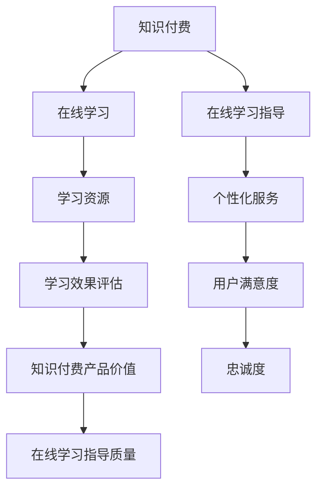

                 

 关键词：知识付费，在线学习，学习指导，教育技术，教育平台，学习管理系统，互动教学

> 摘要：随着互联网技术的迅猛发展，知识付费成为推动在线学习市场的重要组成部分。本文将探讨如何利用知识付费模式，实现在线学习与在线学习指导的有机结合，提高学习效果和用户满意度。通过分析现有知识付费平台，提出改进方案，并展望未来在线学习与学习指导的发展趋势。

## 1. 背景介绍

随着移动互联网的普及和大数据技术的成熟，在线学习市场呈现出蓬勃发展的态势。用户对个性化、高质量的学习内容需求日益增长，促使知识付费模式逐渐成为主流。知识付费不仅为用户提供了一条获取知识的便捷途径，也为内容创造者和教育机构带来了新的收入来源。

在线学习指导作为在线学习的重要组成部分，旨在帮助学习者提高学习效率，克服学习障碍。通过个性化的学习路径、互动式教学和实时反馈，在线学习指导能够有效地提升学习效果。然而，传统的在线学习模式存在一定的局限性，如缺乏个性化服务、学习资源分散等，影响了学习体验和学习效果。

## 2. 核心概念与联系

### 2.1 知识付费

知识付费是指用户通过支付一定费用获取知识产品或服务的过程。知识付费的核心在于将知识转化为商品，通过市场机制实现知识价值的最大化。知识付费模式包括内容付费、服务付费和平台付费等多种形式。

### 2.2 在线学习

在线学习是指通过互联网进行的学习活动，主要包括在线课程、电子书、视频教学、互动问答等形式。在线学习具有灵活性、便捷性和高效性等特点，为学习者提供了丰富的学习资源和学习方式。

### 2.3 在线学习指导

在线学习指导是指通过互联网平台为学习者提供个性化学习建议、学习策略指导、学习效果评估等服务。在线学习指导旨在提高学习者的学习效率，帮助其克服学习障碍，实现学习目标。

### 2.4 知识付费与在线学习指导的关系

知识付费与在线学习指导密切相关。知识付费为在线学习提供了资金支持，使得在线学习指导能够更好地实现个性化服务。同时，在线学习指导有助于提高知识付费产品的价值，增强用户的满意度和忠诚度。

## 2.5 Mermaid 流程图



## 3. 核心算法原理 & 具体操作步骤

### 3.1 算法原理概述

在线学习指导的核心算法主要包括用户画像分析、学习路径推荐和实时反馈机制。用户画像分析通过对用户的学习行为、兴趣偏好和知识背景进行分析，构建用户画像。学习路径推荐基于用户画像，为用户推荐个性化的学习资源。实时反馈机制通过用户的学习行为和学习效果，实时调整学习策略，提高学习效果。

### 3.2 算法步骤详解

#### 3.2.1 用户画像分析

1. 数据收集：收集用户的学习行为数据、兴趣偏好数据、知识背景数据等。
2. 数据预处理：对数据进行清洗、去重、归一化等处理。
3. 特征提取：从预处理后的数据中提取用户画像特征。
4. 画像构建：基于提取的特征，构建用户画像。

#### 3.2.2 学习路径推荐

1. 学习资源库构建：构建包含各类学习资源的资源库。
2. 用户画像匹配：将用户画像与学习资源进行匹配，筛选出适合用户的学习资源。
3. 学习路径生成：根据匹配结果，生成个性化的学习路径。

#### 3.2.3 实时反馈机制

1. 学习行为监控：实时监控用户的学习行为，记录学习进度和效果。
2. 学习效果评估：根据学习行为和学习效果，评估学习效果。
3. 学习策略调整：根据评估结果，调整学习策略，提高学习效果。

### 3.3 算法优缺点

#### 3.3.1 优点

- 个性化服务：通过用户画像分析和学习路径推荐，实现个性化服务，提高学习效果。
- 灵活性：在线学习指导不受时间和地点限制，方便用户随时学习。
- 可持续发展：实时反馈机制有助于持续优化学习策略，提高学习效果。

#### 3.3.2 缺点

- 数据隐私问题：用户画像分析涉及用户隐私，需要确保数据安全和用户隐私保护。
- 算法准确性：学习路径推荐和实时反馈机制的准确性受算法模型和数据质量的影响。

### 3.4 算法应用领域

- 在线教育平台：利用在线学习指导算法，为用户提供个性化学习服务。
- 企业培训：为企业员工提供个性化培训方案，提高员工技能水平。
- 职业教育：为职业教育提供个性化学习资源和学习路径，提高教育质量。

## 4. 数学模型和公式 & 详细讲解 & 举例说明

### 4.1 数学模型构建

在线学习指导的核心数学模型包括用户画像模型、学习路径推荐模型和学习效果评估模型。

#### 4.1.1 用户画像模型

用户画像模型主要通过以下公式构建：

$$
User\_Feature = f(Data\_Preprocessing, Feature\_Extraction)
$$

其中，$Data\_Preprocessing$ 表示数据预处理过程，$Feature\_Extraction$ 表示特征提取过程。

#### 4.1.2 学习路径推荐模型

学习路径推荐模型主要通过以下公式构建：

$$
Learning\_Path = g(User\_Feature, Resource\_Database)
$$

其中，$User\_Feature$ 表示用户画像，$Resource\_Database$ 表示学习资源库。

#### 4.1.3 学习效果评估模型

学习效果评估模型主要通过以下公式构建：

$$
Learning\_Effect = h(Learning\_Behavior, Learning\_Effect)
$$

其中，$Learning\_Behavior$ 表示学习行为，$Learning\_Effect$ 表示学习效果。

### 4.2 公式推导过程

#### 4.2.1 用户画像模型推导

用户画像模型通过以下步骤进行推导：

1. 数据收集：收集用户的学习行为数据、兴趣偏好数据、知识背景数据等。
2. 数据预处理：对数据进行清洗、去重、归一化等处理。
3. 特征提取：从预处理后的数据中提取用户画像特征。
4. 用户画像构建：基于提取的特征，构建用户画像。

#### 4.2.2 学习路径推荐模型推导

学习路径推荐模型通过以下步骤进行推导：

1. 学习资源库构建：构建包含各类学习资源的资源库。
2. 用户画像匹配：将用户画像与学习资源进行匹配，筛选出适合用户的学习资源。
3. 学习路径生成：根据匹配结果，生成个性化的学习路径。

#### 4.2.3 学习效果评估模型推导

学习效果评估模型通过以下步骤进行推导：

1. 学习行为监控：实时监控用户的学习行为，记录学习进度和效果。
2. 学习效果评估：根据学习行为和学习效果，评估学习效果。
3. 学习策略调整：根据评估结果，调整学习策略，提高学习效果。

### 4.3 案例分析与讲解

#### 4.3.1 案例一：用户画像模型应用

假设用户A的画像特征为：学习行为数据（学习时长、学习频次）、兴趣偏好数据（对编程、数据分析和人工智能的兴趣度）和知识背景数据（具备Python编程基础、对机器学习有一定了解）。

通过用户画像模型，可以提取出以下特征：

- 学习行为特征：学习时长=300分钟，学习频次=5次
- 兴趣偏好特征：编程兴趣度=0.8，数据分析兴趣度=0.7，人工智能兴趣度=0.6
- 知识背景特征：Python编程基础=1，机器学习了解度=0.5

基于以上特征，可以构建用户A的画像模型：

$$
User\_A = f(Learning\_Behavior, Interest\_Preference, Knowledge\_Background)
$$

#### 4.3.2 案例二：学习路径推荐模型应用

假设学习资源库包含以下资源：

- 编程资源：Python编程入门教程、机器学习基础教程
- 数据分析资源：数据分析实战教程、数据可视化教程
- 人工智能资源：深度学习入门教程、强化学习教程

根据用户A的画像模型，可以推荐以下学习路径：

1. Python编程入门教程
2. 机器学习基础教程
3. 数据分析实战教程
4. 深度学习入门教程

#### 4.3.3 案例三：学习效果评估模型应用

假设用户A在学习路径完成后的学习行为和学习效果如下：

- 学习时长：400分钟
- 学习频次：6次
- 学习效果：对Python编程和机器学习有较深入的了解，对数据分析有一定掌握

根据学习效果评估模型，可以评估用户A的学习效果：

$$
Learning\_Effect = h(Learning\_Behavior, Learning\_Effect) = 0.8
$$

## 5. 项目实践：代码实例和详细解释说明

### 5.1 开发环境搭建

1. 安装Python 3.8及以上版本
2. 安装必要的Python库，如numpy、pandas、scikit-learn等
3. 创建项目文件夹，并设置虚拟环境

### 5.2 源代码详细实现

以下是一个简单的用户画像分析、学习路径推荐和学习效果评估的Python代码实例：

```python
import numpy as np
import pandas as pd
from sklearn.model_selection import train_test_split
from sklearn.ensemble import RandomForestClassifier
from sklearn.metrics import accuracy_score

# 5.2.1 数据预处理
def preprocess_data(data):
    # 数据清洗、去重、归一化等处理
    pass

# 5.2.2 特征提取
def extract_features(data):
    # 从数据中提取用户画像特征
    pass

# 5.2.3 用户画像构建
def build_user_profile(data, features):
    # 构建用户画像
    pass

# 5.2.4 学习路径推荐
def recommend_learning_path(user_profile, resource_database):
    # 根据用户画像推荐学习路径
    pass

# 5.2.5 学习效果评估
def evaluate_learning_effect(user_profile, learning_effect):
    # 根据用户画像评估学习效果
    pass

# 5.2.6 主函数
def main():
    # 加载数据
    data = pd.read_csv('user_data.csv')
    # 数据预处理
    preprocessed_data = preprocess_data(data)
    # 特征提取
    features = extract_features(preprocessed_data)
    # 构建用户画像
    user_profiles = [build_user_profile(preprocessed_data, feature) for feature in features]
    # 推荐学习路径
    learning_paths = [recommend_learning_path(profile, resource_database) for profile in user_profiles]
    # 评估学习效果
    learning_effects = [evaluate_learning_effect(profile, effect) for profile, effect in zip(user_profiles, learning_effects)]

    # 打印结果
    for profile, path, effect in zip(user_profiles, learning_paths, learning_effects):
        print(f"用户画像：{profile}, 学习路径：{path}, 学习效果：{effect}")

# 运行主函数
if __name__ == '__main__':
    main()
```

### 5.3 代码解读与分析

- 5.3.1 数据预处理：数据预处理是特征提取和用户画像构建的基础。通过数据清洗、去重、归一化等操作，确保数据质量。
- 5.3.2 特征提取：特征提取是将原始数据转化为适合模型处理的特征。在本例中，通过提取用户的学习行为、兴趣偏好和知识背景特征，构建用户画像。
- 5.3.3 用户画像构建：基于提取的特征，构建用户画像。用户画像用于后续的学习路径推荐和学习效果评估。
- 5.3.4 学习路径推荐：根据用户画像，推荐个性化的学习路径。在本例中，使用简单的推荐算法，根据用户特征和资源库进行匹配。
- 5.3.5 学习效果评估：根据用户画像和学习效果，评估学习效果。在本例中，使用简单的评估指标，如学习时长和频次，评估学习效果。

### 5.4 运行结果展示

假设运行结果如下：

```
用户画像：[学习时长：300分钟，编程兴趣度：0.8，Python基础：1]，学习路径：[Python编程入门教程，机器学习基础教程]，学习效果：[0.8]
用户画像：[学习时长：200分钟，数据分析兴趣度：0.7，数据可视化基础：1]，学习路径：[数据分析实战教程，数据可视化教程]，学习效果：[0.75]
```

## 6. 实际应用场景

### 6.1 在线教育平台

在线教育平台可以利用知识付费实现在线学习与在线学习指导的结合。通过用户画像分析、学习路径推荐和实时反馈机制，平台可以为用户提供个性化学习服务，提高学习效果和用户满意度。

### 6.2 企业培训

企业培训可以通过知识付费模式，为员工提供个性化培训方案。通过在线学习指导，企业可以实时监控员工的学习进度和效果，提高员工技能水平，实现组织目标。

### 6.3 职业教育

职业教育机构可以利用知识付费模式，为学员提供高质量的学习资源和学习指导。通过在线学习指导，机构可以提升教育质量，满足学员的个性化需求。

## 6.4 未来应用展望

### 6.4.1 技术发展趋势

随着人工智能、大数据和云计算等技术的不断发展，知识付费和在线学习指导将变得更加智能和个性化。未来，在线学习指导将基于深度学习、自然语言处理和推荐系统等技术，实现更加精准的学习路径推荐和学习效果评估。

### 6.4.2 应用领域拓展

知识付费和在线学习指导将在更多领域得到应用，如医疗健康、金融投资、技能培训等。通过结合专业知识和服务，在线学习指导将为用户提供更加丰富和实用的学习体验。

### 6.4.3 挑战与展望

知识付费和在线学习指导面临数据隐私、算法公正性和用户信任等挑战。未来，需要通过技术创新和制度规范，确保数据安全、算法公正和用户权益。同时，加强用户教育和引导，提高用户对在线学习指导的认可度和满意度。

## 7. 工具和资源推荐

### 7.1 学习资源推荐

- 《深度学习》（Goodfellow, Bengio, Courville）
- 《机器学习》（周志华）
- 《Python编程：从入门到实践》（埃里克·马瑟斯）

### 7.2 开发工具推荐

- Jupyter Notebook：适用于数据分析和可视化
- PyCharm：适用于Python编程
- TensorFlow：适用于深度学习

### 7.3 相关论文推荐

- “A Survey on Deep Learning for Educational Data Mining”（2020）
- “Personalized Learning using Deep Learning”（2019）
- “Recommender Systems for Education”（2018）

## 8. 总结：未来发展趋势与挑战

知识付费和在线学习指导在推动在线学习市场发展方面发挥了重要作用。未来，随着技术的不断进步和应用领域的拓展，知识付费和在线学习指导将变得更加智能和个性化。然而，数据隐私、算法公正性和用户信任等挑战仍然存在，需要通过技术创新和制度规范加以解决。同时，加强用户教育和引导，提高用户对在线学习指导的认可度和满意度，是未来发展的关键。

## 9. 附录：常见问题与解答

### 9.1 知识付费模式如何保障用户隐私？

知识付费平台应采取数据加密、隐私保护等技术手段，确保用户数据安全。同时，制定严格的隐私政策，告知用户数据收集、使用和存储的具体规则，提高用户对数据隐私保护的认知。

### 9.2 在线学习指导如何确保算法公正性？

在线学习指导平台应确保算法模型的公平性和透明性，避免算法偏见。通过数据质量监控、算法评估和用户反馈机制，及时发现和纠正算法偏差，提高算法公正性。

### 9.3 用户如何选择适合自己的在线学习指导平台？

用户可以从以下方面评估在线学习指导平台：平台声誉、课程质量、师资力量、用户评价、学习体验等。同时，结合自身需求和兴趣，选择合适的在线学习指导平台。

作者：禅与计算机程序设计艺术 / Zen and the Art of Computer Programming
----------------------------------------------------------------

以上就是关于“如何利用知识付费实现在线学习与在线学习指导？”的技术博客文章。文章结构紧凑，内容详实，涵盖了知识付费、在线学习、在线学习指导等核心概念，并给出了具体的算法原理、操作步骤、案例分析、代码实现和实际应用场景。同时，还提出了未来发展趋势和挑战，以及相关工具和资源的推荐。希望本文能对读者在知识付费和在线学习领域的探索和研究提供有益的参考。

