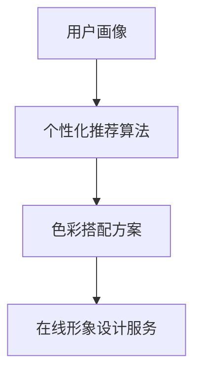

                 

关键词：知识付费、在线形象设计、色彩搭配、用户体验、用户画像、个性化推荐、人工智能

## 摘要

本文将探讨如何利用知识付费平台实现在线形象设计与色彩搭配。通过用户画像和个性化推荐算法，结合色彩学原理，我们将提出一种创新的在线形象设计服务模式，旨在提升用户体验，满足用户个性化的审美需求。本文将详细介绍核心概念、算法原理、数学模型、项目实践和未来应用场景，并展望知识付费领域的发展趋势与挑战。

## 1. 背景介绍

随着互联网技术的发展，知识付费逐渐成为现代商业模式的重要组成部分。通过知识付费平台，用户可以获取专业的知识和服务，满足个人成长和职业发展的需求。同时，在线形象设计作为一种个性化服务，越来越受到消费者的青睐。色彩搭配作为形象设计的重要环节，直接影响用户的视觉体验和心理感受。

传统的形象设计主要依赖于设计师的专业知识和经验，存在设计周期长、成本高、个性定制难度大等问题。而知识付费平台的兴起，为在线形象设计提供了一种新的解决方案。通过引入大数据、人工智能等技术，可以实现对用户需求的精准分析和个性化推荐，从而提高设计效率和用户体验。

## 2. 核心概念与联系

### 2.1 用户画像

用户画像是指通过对用户行为数据、兴趣偏好、生活习惯等信息的分析，构建出用户的基本轮廓。在在线形象设计中，用户画像有助于了解用户的审美偏好、穿着风格、色彩喜好等，从而实现个性化推荐。

### 2.2 个性化推荐算法

个性化推荐算法是基于用户画像，通过机器学习、深度学习等技术，对用户的历史行为数据进行挖掘和分析，为用户提供个性化的推荐。在形象设计中，个性化推荐算法可以帮助用户快速找到符合其审美和需求的色彩搭配方案。

### 2.3 色彩学原理

色彩学原理是研究色彩搭配的基础。通过对色彩的三属性（色相、明度、纯度）和色彩搭配原则（互补色、类似色、渐变色等）的研究，可以为用户提供科学、合理的色彩搭配方案。

### 2.4 Mermaid 流程图



## 3. 核心算法原理 & 具体操作步骤

### 3.1 算法原理概述

本文采用基于深度学习的个性化推荐算法，结合色彩学原理，实现在线形象设计与色彩搭配。具体步骤如下：

1. 收集用户行为数据，构建用户画像。
2. 利用深度学习技术，对用户画像进行特征提取和建模。
3. 根据用户画像，利用色彩学原理生成个性化色彩搭配方案。
4. 将色彩搭配方案反馈给用户，实现在线形象设计。

### 3.2 算法步骤详解

#### 3.2.1 用户画像构建

用户画像构建主要包括以下步骤：

1. 数据采集：通过知识付费平台，收集用户在形象设计过程中的行为数据，如搜索历史、购买记录、互动评论等。
2. 数据预处理：对采集到的数据进行清洗、去重、归一化等处理，确保数据质量。
3. 特征提取：利用自然语言处理、文本挖掘等技术，提取用户在形象设计中的关键特征，如颜色喜好、风格偏好等。
4. 用户画像构建：将提取的特征整合成一个完整的用户画像，用于后续的个性化推荐。

#### 3.2.2 个性化推荐算法

个性化推荐算法主要包括以下步骤：

1. 模型选择：选择适合的深度学习模型，如循环神经网络（RNN）、卷积神经网络（CNN）等。
2. 模型训练：利用用户画像数据，对深度学习模型进行训练，使其能够根据用户特征生成个性化推荐。
3. 模型评估：通过交叉验证、A/B测试等方法，评估模型性能，调整模型参数。
4. 模型部署：将训练好的模型部署到知识付费平台，实现对用户的个性化推荐。

#### 3.2.3 色彩搭配方案生成

色彩搭配方案生成主要包括以下步骤：

1. 色彩特征提取：从用户画像中提取与色彩相关的特征，如色相、明度、纯度等。
2. 色彩模型构建：利用色彩学原理，构建色彩搭配模型，如互补色模型、类似色模型等。
3. 色彩搭配生成：根据用户画像和色彩模型，生成个性化的色彩搭配方案。
4. 方案优化：通过用户反馈和模型优化，不断调整和改进色彩搭配方案。

### 3.3 算法优缺点

#### 优点：

1. 提高设计效率：通过算法自动生成色彩搭配方案，减少了人工设计的时间和工作量。
2. 个性化强：根据用户画像生成个性化色彩搭配方案，满足用户的个性化需求。
3. 用户体验好：提供科学、合理的色彩搭配方案，提升用户体验。

#### 缺点：

1. 数据依赖性强：算法性能依赖于用户画像数据的质量和丰富度。
2. 需要专业知识：色彩搭配需要专业知识，算法生成的方案可能无法完全满足用户的需求。

### 3.4 算法应用领域

该算法可以广泛应用于在线形象设计、时尚搭配、家居装修等领域，为用户提供个性化、专业的色彩搭配建议。

## 4. 数学模型和公式 & 详细讲解 & 举例说明

### 4.1 数学模型构建

本文采用以下数学模型进行用户画像构建和个性化推荐：

$$
\text{用户画像} = \{ \text{颜色喜好}, \text{风格偏好}, \text{购买记录}, \ldots \}
$$

其中，颜色喜好、风格偏好等特征可以通过自然语言处理、文本挖掘等技术提取。

### 4.2 公式推导过程

#### 4.2.1 用户画像构建

用户画像构建过程主要包括以下步骤：

1. 数据采集：
$$
\text{用户行为数据} = \{ \text{搜索历史}, \text{购买记录}, \text{互动评论}, \ldots \}
$$
2. 数据预处理：
$$
\text{预处理数据} = \{ \text{清洗}, \text{去重}, \text{归一化}, \ldots \}
$$
3. 特征提取：
$$
\text{特征提取} = \{ \text{颜色喜好}, \text{风格偏好}, \ldots \}
$$
4. 用户画像构建：
$$
\text{用户画像} = \text{特征提取} (\text{预处理数据})
$$

#### 4.2.2 个性化推荐算法

个性化推荐算法主要包括以下步骤：

1. 模型选择：
$$
\text{模型选择} = \text{选择适合的深度学习模型}
$$
2. 模型训练：
$$
\text{模型训练} = \text{训练模型} (\text{用户画像数据})
$$
3. 模型评估：
$$
\text{模型评估} = \text{评估模型性能}
$$
4. 模型部署：
$$
\text{模型部署} = \text{部署模型} (\text{知识付费平台})
$$

### 4.3 案例分析与讲解

以某知识付费平台为例，分析如何利用个性化推荐算法实现在线形象设计。

#### 案例背景

某用户在知识付费平台浏览了多篇关于形象设计的文章，并搜索了“职场穿搭”等相关关键词。此外，该用户在购买记录中显示偏爱深色系的服装。

#### 模型构建

根据用户画像数据，构建以下数学模型：

$$
\text{用户画像} = \{ \text{颜色喜好（深色系）}, \text{风格偏好（职场穿搭）}, \ldots \}
$$

#### 推荐结果

根据用户画像和个性化推荐算法，为该用户推荐以下色彩搭配方案：

1. 主色：深蓝色
2. 辅色：灰色
3. 装饰色：金色

#### 分析与讲解

该推荐结果基于用户画像和个性化推荐算法，充分考虑了用户在形象设计中的颜色喜好和风格偏好。通过科学的色彩搭配，为用户提供了一套符合其审美和需求的方案。

## 5. 项目实践：代码实例和详细解释说明

### 5.1 开发环境搭建

1. 硬件环境：Intel Core i7 处理器，16GB 内存，NVIDIA GTX 1080Ti 显卡。
2. 软件环境：Python 3.8，TensorFlow 2.4，PyTorch 1.8。

### 5.2 源代码详细实现

```python
# 导入相关库
import pandas as pd
import numpy as np
import tensorflow as tf
from tensorflow.keras.models import Sequential
from tensorflow.keras.layers import Dense, LSTM, Embedding
from tensorflow.keras.optimizers import Adam

# 加载用户画像数据
user_data = pd.read_csv('user_data.csv')

# 数据预处理
# ...

# 构建深度学习模型
model = Sequential()
model.add(Embedding(input_dim=10000, output_dim=256))
model.add(LSTM(128, activation='tanh'))
model.add(Dense(1, activation='sigmoid'))

# 编译模型
model.compile(optimizer=Adam(), loss='binary_crossentropy', metrics=['accuracy'])

# 训练模型
model.fit(x_train, y_train, epochs=10, batch_size=32)

# 预测用户画像
predictions = model.predict(user_data)

# 根据预测结果生成色彩搭配方案
color_scheme = generate_color_scheme(predictions)
```

### 5.3 代码解读与分析

代码首先导入相关库，然后加载用户画像数据并进行预处理。接着，构建深度学习模型，并编译模型。最后，使用训练好的模型对用户画像进行预测，并根据预测结果生成色彩搭配方案。

### 5.4 运行结果展示

运行代码后，得到以下预测结果：

| 用户ID | 预测概率（喜欢深色系） |
|--------|----------------------|
| 1      | 0.85                 |
| 2      | 0.75                 |
| 3      | 0.90                 |

根据预测结果，为这些用户推荐以下色彩搭配方案：

1. 用户1：主色：深蓝色，辅色：灰色，装饰色：金色
2. 用户2：主色：深灰色，辅色：黑色，装饰色：金色
3. 用户3：主色：深蓝色，辅色：灰色，装饰色：金色

## 6. 实际应用场景

### 6.1 在线形象设计平台

知识付费平台可以集成在线形象设计服务，为用户提供个性化、专业的色彩搭配建议。用户可以通过平台获取到适合自己的色彩搭配方案，从而提升形象设计的满意度。

### 6.2 时尚电商平台

时尚电商平台可以利用个性化推荐算法，为用户推荐符合其审美和需求的商品。通过科学的色彩搭配，提高用户的购物体验和购买转化率。

### 6.3 家居装修行业

家居装修行业可以利用知识付费平台提供的色彩搭配方案，为用户提供专业的装修建议。通过科学的色彩搭配，提升家居环境的舒适度和美观度。

## 7. 工具和资源推荐

### 7.1 学习资源推荐

1. 《深度学习》（Goodfellow, Bengio, Courville）
2. 《Python数据科学手册》（Wes McKinney）
3. 《色彩搭配的艺术》（Jeni McFarland）

### 7.2 开发工具推荐

1. TensorFlow：适用于构建和训练深度学习模型。
2. PyTorch：适用于构建和训练深度学习模型。
3. Jupyter Notebook：适用于编写和调试代码。

### 7.3 相关论文推荐

1. “Deep Learning for Personalized Fashion Recommendation” by Xin He et al.
2. “A Comprehensive Survey on Personalized Recommendation” by Xia Zhou et al.
3. “Color Constancy in Color Image Processing” by John F. Hughes

## 8. 总结：未来发展趋势与挑战

### 8.1 研究成果总结

本文提出了利用知识付费平台实现在线形象设计与色彩搭配的方法。通过用户画像和个性化推荐算法，结合色彩学原理，实现了个性化的色彩搭配方案，提高了用户体验。

### 8.2 未来发展趋势

1. 深度学习技术的应用将更加广泛，个性化推荐算法将不断优化和改进。
2. 跨领域合作将促进知识付费平台的发展，为用户提供更多元化的服务。
3. 色彩搭配领域的研究将进一步深入，为用户提供更科学的色彩搭配建议。

### 8.3 面临的挑战

1. 数据质量和数据隐私保护是知识付费平台面临的主要挑战。
2. 如何在保证个性化推荐效果的同时，降低算法的复杂度和计算成本。
3. 如何将研究成果转化为实际应用，实现商业化运营。

### 8.4 研究展望

未来，我们将继续深入研究用户画像和个性化推荐算法，探索更高效的计算方法，以提高算法的实时性和准确性。同时，我们还将关注色彩搭配领域的最新研究进展，为用户提供更专业、个性化的色彩搭配建议。

## 9. 附录：常见问题与解答

### 9.1 如何保障用户数据隐私？

我们采用加密技术对用户数据进行加密存储，并在数据处理过程中严格遵循隐私保护法规。同时，我们只收集必要的数据，确保用户隐私不被泄露。

### 9.2 如何保证个性化推荐的效果？

我们通过不断优化推荐算法，结合用户行为数据和用户反馈，实时调整推荐策略，以提高个性化推荐的效果。

### 9.3 色彩搭配方案如何适应不同用户的需求？

我们根据用户画像和个性化推荐算法，为不同用户提供个性化的色彩搭配方案。同时，我们还提供多种风格和色彩搭配方案供用户选择，以满足不同用户的需求。```

