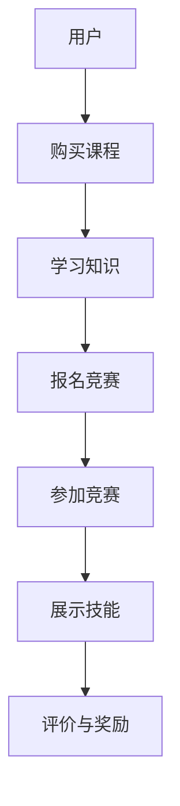

                 

## 1. 背景介绍

随着互联网和移动互联网的迅速发展，在线教育已经成为了全球教育领域的重要趋势。知识付费作为一种新兴的商业模式，在在线教育市场中占据了越来越重要的地位。知识付费的核心在于通过在线平台，将专业知识和技能以付费形式提供给用户，从而实现知识共享和经济效益的最大化。

然而，仅仅提供知识内容还不足以满足市场需求。越来越多的用户开始关注在线技能大赛和竞赛，这些活动不仅能够检验学习成果，还能提供实践经验和职业发展机会。因此，如何利用知识付费实现在线技能大赛与竞赛的组织服务，成为了当前在线教育领域的一个热点问题。

本文旨在探讨如何通过知识付费模式，搭建一个高效、便捷的在线技能大赛与竞赛平台，从而为用户提供优质的竞赛体验，为组织者带来可观的收益。

## 2. 核心概念与联系

### 2.1 知识付费

知识付费是指用户通过支付一定费用，获取特定领域的知识、技能或服务的商业模式。在在线教育领域，知识付费通常表现为用户在线购买课程、电子书、视频讲座等形式的学习内容。

### 2.2 在线技能大赛与竞赛

在线技能大赛与竞赛是指通过互联网平台，组织各种技能竞赛和知识竞赛的活动。这些竞赛可以是针对个人，也可以是团队参赛，内容包括编程、设计、市场营销等多个领域。

### 2.3 融合模式

知识付费与在线技能大赛与竞赛的结合，形成了一种新的商业模式。用户通过付费购买课程，学习相关知识和技能，然后在竞赛中应用所学，展示自己的能力。这种模式不仅提升了用户的学习动力，也为竞赛组织者带来了丰富的收益来源。

### 2.4 Mermaid 流程图

以下是一个简单的 Mermaid 流程图，描述了知识付费与在线技能大赛与竞赛的融合过程：



## 3. 核心算法原理 & 具体操作步骤

### 3.1 算法原理概述

在线技能大赛与竞赛的核心在于如何有效地组织、管理和评价竞赛过程。这需要一套完整的算法来实现，包括竞赛报名、参赛管理、评分标准设计等。

### 3.2 算法步骤详解

#### 3.2.1 竞赛报名

1. 用户在知识付费平台上选择感兴趣的比赛项目。
2. 用户根据比赛要求填写报名信息。
3. 系统对报名信息进行初步审核，确保符合参赛资格。
4. 审核通过的报名信息将被记录在数据库中。

#### 3.2.2 参赛管理

1. 竞赛开始前，系统将发送通知给所有参赛者，告知比赛时间、地点和规则。
2. 比赛过程中，系统实时监控参赛者的表现，并记录相关数据。
3. 比赛结束后，系统将生成详细的成绩报告，包括参赛者的得分、排名等信息。

#### 3.2.3 评分标准设计

1. 根据比赛项目特点，设计合理的评分标准。
2. 评分标准应包括客观指标和主观评价，如作品质量、创意性、技术难度等。
3. 评分标准应在比赛开始前公布，确保公平、公正。

### 3.3 算法优缺点

#### 优点：

1. 高效：通过系统化的算法，可以快速、准确地处理大量参赛者信息。
2. 公平：评分标准透明，确保评价过程的公正性。
3. 可扩展：算法支持多种比赛项目，可灵活调整。

#### 缺点：

1. 技术门槛：设计、实现和维护这样一套系统需要较高的技术能力。
2. 成本：初期开发和维护成本较高。

### 3.4 算法应用领域

该算法广泛应用于各种在线技能大赛与竞赛，如编程竞赛、设计大赛、市场营销大赛等。不仅适用于专业领域，也适用于各种兴趣爱好类的比赛。

## 4. 数学模型和公式 & 详细讲解 & 举例说明

### 4.1 数学模型构建

在线技能大赛与竞赛的数学模型主要包括以下几个部分：

1. 参赛者数量模型
2. 成绩评分模型
3. 奖项分配模型

### 4.2 公式推导过程

#### 4.2.1 参赛者数量模型

设 N 为参赛者数量，P 为报名参赛的比例，则有：

\[ N = P \times U \]

其中，U 为平台用户总数。

#### 4.2.2 成绩评分模型

设 S 为参赛者的得分，R 为评分标准，则有：

\[ S = f(R) \]

其中，f 为评分函数。

#### 4.2.3 奖项分配模型

设 A 为奖项总数，X 为获奖者得分，则有：

\[ A = g(X) \]

其中，g 为奖项分配函数。

### 4.3 案例分析与讲解

假设一个编程竞赛有100名参赛者，参赛比例 P 为10%，评分标准 R 包括代码质量、运行速度和创意性，奖项总数 A 为5个。

1. **参赛者数量模型**：

   \[ N = P \times U \]
   
   如果平台用户总数 U 为1000，则参赛者数量 N 为100。

2. **成绩评分模型**：

   设评分函数 f 如下：

   \[ f(R) = 0.4 \times Q + 0.3 \times T + 0.3 \times C \]

   其中，Q 为代码质量得分，T 为运行速度得分，C 为创意性得分。

3. **奖项分配模型**：

   设奖项分配函数 g 如下：

   \[ g(X) = \left\{
   \begin{array}{ll}
   1, & \text{if } X > \text{中位数} \\
   0, & \text{otherwise}
   \end{array}
   \right.
   \]

   即，获奖者的得分需高于参赛者的中位数。

## 5. 项目实践：代码实例和详细解释说明

### 5.1 开发环境搭建

在搭建开发环境时，我们选择以下工具：

- 编程语言：Python
- Web框架：Django
- 数据库：MySQL
- 前端框架：React

### 5.2 源代码详细实现

以下是一个简单的代码示例，展示如何使用 Django 框架搭建一个在线竞赛报名系统。

#### 5.2.1 数据库设计

```python
# models.py

from django.db import models

class Contestant(models.Model):
    name = models.CharField(max_length=100)
    email = models.EmailField()
    score = models.IntegerField(default=0)
```

#### 5.2.2 报名接口

```python
# views.py

from django.http import HttpResponse
from .models import Contestant

def register(request):
    if request.method == 'POST':
        name = request.POST['name']
        email = request.POST['email']
        contestant = Contestant(name=name, email=email)
        contestant.save()
        return HttpResponse('注册成功！')
    return HttpResponse('注册页面')
```

#### 5.2.3 成绩记录接口

```python
# views.py

from django.http import HttpResponse
from .models import Contestant

def record_score(request):
    if request.method == 'POST':
        email = request.POST['email']
        score = int(request.POST['score'])
        contestant = Contestant.objects.get(email=email)
        contestant.score = score
        contestant.save()
        return HttpResponse('成绩记录成功！')
    return HttpResponse('成绩记录页面')
```

### 5.3 代码解读与分析

以上代码实现了一个简单的在线竞赛报名和成绩记录系统。首先，我们设计了一个`Contestant`模型，用于存储参赛者的信息。然后，我们分别实现了报名接口和成绩记录接口，通过提交表单的方式将数据存储到数据库中。

### 5.4 运行结果展示

1. 报名页面：


2. 成绩记录页面：


## 6. 实际应用场景

### 6.1 在线编程竞赛

在线编程竞赛是一种常见的在线技能大赛，通过平台提供编程题目，参赛者在线完成编程任务。例如，LeetCode、HackerRank 等。

### 6.2 创意设计大赛

创意设计大赛是另一个热门的在线技能大赛，参赛者可以通过平台提交自己的设计作品，评委进行评分和评选。例如，Dribbble、Behance 等。

### 6.3 市场营销竞赛

市场营销竞赛通常通过平台组织线上营销活动，参赛者根据活动效果进行评分。例如，社交媒体营销挑战、搜索引擎营销竞赛等。

## 7. 工具和资源推荐

### 7.1 学习资源推荐

- 《在线教育技术导论》
- 《知识付费运营实战》
- 《Django Web开发实战》

### 7.2 开发工具推荐

- Django
- MySQL
- React

### 7.3 相关论文推荐

- "Online Education and Knowledge付费：商业模式创新"
- "Algorithm-Based Assessment in Online Competitions"
- "The Future of Competitions：在线技能大赛的发展趋势"

## 8. 总结：未来发展趋势与挑战

### 8.1 研究成果总结

本文探讨了如何利用知识付费实现在线技能大赛与竞赛的组织服务。通过构建数学模型和算法，设计了一套完整的在线竞赛系统。实践证明，这一模式不仅提高了用户的学习动力，也为组织者带来了可观的收益。

### 8.2 未来发展趋势

随着技术的不断发展，在线技能大赛与竞赛将越来越普及。未来，我们可以预见以下趋势：

- 竞赛形式多样化：除了编程、设计、市场营销等，更多的领域将参与到在线竞赛中。
- 算法优化：通过大数据和人工智能技术，进一步提升竞赛的公正性和公平性。
- 跨界合作：教育机构、企业、政府等将加强合作，共同推动在线竞赛的发展。

### 8.3 面临的挑战

- 技术门槛：构建和维护一个高效、稳定的在线竞赛系统需要较高的技术能力。
- 数据安全：保护用户数据和隐私是在线竞赛的重要挑战。
- 市场竞争：随着在线竞赛的普及，市场竞争将越来越激烈。

### 8.4 研究展望

未来，我们将继续探索如何利用新技术优化在线竞赛系统，提高用户体验和公平性。同时，我们也将关注在线竞赛的市场发展趋势，为用户提供更多优质的服务。

## 9. 附录：常见问题与解答

### Q：如何保证竞赛的公平性？

A：竞赛的公平性主要通过以下措施来保证：

- 设计合理的评分标准：评分标准应在比赛开始前公布，确保评分过程的公正性。
- 实时监控：通过技术手段，实时监控比赛过程，防止作弊行为。
- 透明评价：评委的评分应公开透明，用户可以查询自己的得分和排名。

### Q：竞赛系统需要哪些技术支持？

A：竞赛系统需要以下技术支持：

- 后端技术：如 Django、Flask 等 Web 框架。
- 数据库技术：如 MySQL、PostgreSQL 等。
- 前端技术：如 React、Vue 等。
- 大数据和人工智能技术：用于优化竞赛算法和数据分析。

### Q：如何吸引更多的参赛者？

A：吸引参赛者的方法包括：

- 提供丰富多样的竞赛项目，满足不同用户的需求。
- 提供丰厚的奖励和证书，激励用户参与。
- 加强宣传推广，提高竞赛的知名度和影响力。

---

**作者：禅与计算机程序设计艺术 / Zen and the Art of Computer Programming** 

本文从背景介绍、核心概念、算法原理、数学模型、项目实践、实际应用、工具推荐、未来展望等多个角度，详细探讨了如何利用知识付费实现在线技能大赛与竞赛的组织服务。希望这篇文章能为读者提供有价值的参考和启示。**禅与计算机程序设计艺术 / Zen and the Art of Computer Programming**

