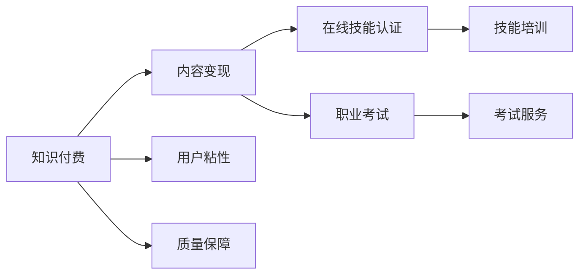
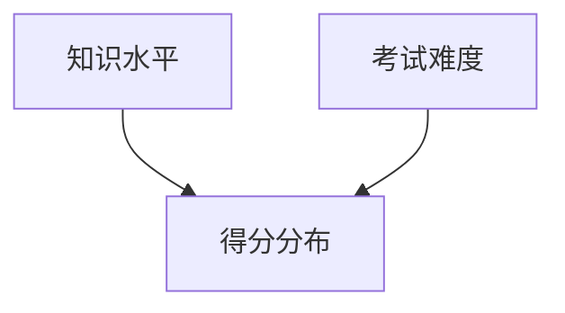

                 

### 摘要 Summary

本文旨在探讨如何利用知识付费平台实现在线技能认证与职业考试。我们首先介绍了知识付费的发展背景和现状，分析了其优势和挑战。随后，文章详细阐述了在线技能认证与职业考试的流程和关键技术，包括用户管理、考试系统、认证系统、支付系统等。接下来，我们探讨了如何通过知识付费平台构建高效的在线考试系统，并分享了成功案例和实践经验。文章的最后部分对知识付费平台实现在线技能认证与职业考试的未来发展进行了展望。

### 1. 背景介绍 Background

知识付费，作为一种新型的商业模式，近年来在全球范围内迅速发展。其主要特点是用户通过支付一定费用，获取有价值的信息和服务。知识付费平台，如知乎、得到、喜马拉雅等，已经成为知识传播和知识变现的重要渠道。这些平台为用户提供内容创作、知识分享、付费问答、课程购买等服务，满足了用户在各个领域的学习和成长需求。

与此同时，在线技能认证与职业考试的需求也在不断增长。随着互联网技术的发展，传统的线下考试方式逐渐向线上迁移。在线考试系统不仅能够提高考试的效率和公平性，还能够降低考试成本，为用户提供更加便捷的服务。

知识付费与在线技能认证与职业考试的结合，可以形成一种全新的服务模式。一方面，知识付费平台可以通过提供高质量的技能培训和考试服务，增加用户的粘性和付费意愿；另一方面，在线技能认证与职业考试可以为知识付费平台带来更多的商业机会，推动其持续发展。

### 2. 核心概念与联系 Core Concepts and Connections

在本节中，我们将介绍知识付费、在线技能认证和职业考试的核心概念，并使用Mermaid流程图（不含括号、逗号等特殊字符）展示它们之间的联系。

#### 2.1 知识付费 Knowledge Payment

知识付费是指用户通过支付一定费用，获取有价值的信息和服务。其主要流程包括：

1. **内容创作**：知识创作者发布内容，包括文字、音频、视频等。
2. **内容审核**：平台对内容进行审核，确保其质量符合标准。
3. **用户购买**：用户根据自身需求购买内容，支付费用。
4. **内容交付**：平台将购买的内容交付给用户。


#### 2.2 在线技能认证 Online Skill Certification

在线技能认证是指通过互联网平台，对用户所掌握的技能进行考核和认证。其主要流程包括：

1. **注册报名**：用户在平台上注册并报名参加技能认证。
2. **考试准备**：平台提供相关的考试资料和培训课程，用户进行学习。
3. **在线考试**：用户在规定时间内完成在线考试。
4. **成绩发布**：考试结束后，平台发布考试成绩。


#### 2.3 职业考试 Professional Examination

职业考试是指对某一职业所需技能和知识进行考核的考试。其主要流程包括：

1. **报名条件**：用户满足报名条件后，可以报名参加职业考试。
2. **考试内容**：考试内容通常包括基础知识、专业技能等。
3. **考试形式**：职业考试可以采取线上或线下形式。
4. **证书发放**：考试合格后，平台或机构发放职业证书。


#### 2.4 知识付费与在线技能认证与职业考试的联系

知识付费与在线技能认证、职业考试的联系主要体现在以下几个方面：

1. **内容变现**：知识付费平台可以通过提供技能培训和考试服务，实现内容变现。
2. **用户粘性**：在线技能认证和职业考试可以增加用户在平台上的活跃度，提高用户粘性。
3. **质量保障**：知识付费平台可以通过对技能培训和考试内容的质量控制，保障用户的权益。



通过以上核心概念和流程的介绍，我们可以更好地理解知识付费与在线技能认证、职业考试之间的关系。接下来，我们将进一步探讨如何在知识付费平台实现在线技能认证与职业考试。

### 3. 核心算法原理 & 具体操作步骤 Core Algorithm Principles & Detailed Steps

#### 3.1 算法原理概述

在知识付费平台实现在线技能认证与职业考试，核心算法主要包括用户管理、考试系统、认证系统和支付系统。以下是各系统的基本原理和操作步骤：

#### 3.2 用户管理 User Management

**原理概述**：用户管理是平台的基础，负责用户的注册、登录、信息维护和权限管理。

**具体步骤**：

1. **注册与登录**：用户通过邮箱、手机号等注册账号，输入用户名、密码等信息。登录时，系统通过用户名和密码验证用户身份。
2. **信息维护**：用户可以查看和修改个人信息，如姓名、联系方式、教育背景等。
3. **权限管理**：平台根据用户角色和权限设置，提供不同的功能和服务。

#### 3.3 考试系统 Examination System

**原理概述**：考试系统负责生成试卷、管理考试流程和记录考试成绩。

**具体步骤**：

1. **试卷生成**：系统根据考试类型和难度，从题库中随机抽取题目生成试卷。
2. **考试安排**：管理员设置考试时间、考试形式和考试时长等参数。
3. **考试进行**：用户在规定时间内完成考试，系统实时记录用户答题情况。
4. **成绩记录**：考试结束后，系统自动计算成绩，并记录在用户档案中。

#### 3.4 认证系统 Certification System

**原理概述**：认证系统负责对考试结果进行审核，发放认证证书。

**具体步骤**：

1. **成绩审核**：管理员对考试成绩进行审核，确保其真实性和有效性。
2. **证书生成**：审核通过后，系统生成电子证书，用户可以在平台查看和下载。
3. **证书验证**：平台提供证书验证服务，确保证书的真实性。

#### 3.5 支付系统 Payment System

**原理概述**：支付系统负责处理用户支付流程，确保交易安全、高效。

**具体步骤**：

1. **支付方式**：用户可以选择支付宝、微信、信用卡等支付方式。
2. **支付验证**：系统对支付信息进行验证，确保支付成功。
3. **支付记录**：系统记录支付信息，便于用户查询和退款处理。

#### 3.6 算法优缺点

**优点**：

1. **高效便捷**：用户可以在任何时间、任何地点参加考试，提高考试效率和用户体验。
2. **降低成本**：线上考试减少了考试场地、监考人员等成本，有利于平台降低运营成本。
3. **提高公平性**：通过在线考试系统，可以有效防止作弊现象，提高考试公平性。

**缺点**：

1. **技术门槛**：建设一个稳定、安全的在线考试系统需要较高的技术门槛，需要投入大量的人力、物力和财力。
2. **系统安全**：在线考试系统面临数据泄露、黑客攻击等安全风险，需要加强安全防护措施。
3. **考试质量**：在线考试质量难以保证，需要加强考试过程监管和质量控制。

#### 3.7 算法应用领域

在线技能认证与职业考试算法可以应用于多个领域，包括：

1. **教育行业**：用于在线课程考试、学历认证等。
2. **职业资格认证**：如会计、律师、医生等职业的在线考试。
3. **企业培训**：用于企业员工的技能培训和考核。
4. **人才招聘**：用于人才测评和选拔。

通过以上对核心算法原理和具体操作步骤的介绍，我们可以看到，在线技能认证与职业考试在知识付费平台中发挥着重要的作用。接下来，我们将进一步探讨如何通过知识付费平台构建高效的在线考试系统。

### 4. 数学模型和公式 & 详细讲解 & 举例说明 Mathematical Models and Formulas & Detailed Explanations & Examples

在实现在线技能认证与职业考试的过程中，数学模型和公式起到了关键作用。这些模型和公式可以帮助我们更好地理解考试系统的工作原理，并优化考试流程。以下将详细介绍相关的数学模型和公式，并进行举例说明。

#### 4.1 数学模型构建

构建数学模型是设计在线考试系统的第一步。以下是一个简单的数学模型，用于描述用户在考试中的行为。

**用户行为模型**：

\[ U(x, y) = f(x) \cdot g(y) \]

其中：
- \( U(x, y) \) 表示用户在考试中的得分。
- \( x \) 表示用户的初始知识水平。
- \( y \) 表示考试的难度。
- \( f(x) \) 表示用户的知识水平对得分的影响。
- \( g(y) \) 表示考试难度对得分的影响。

**假设**：

1. 用户的知识水平 \( x \) 是一个正态分布的随机变量。
2. 考试的难度 \( y \) 也是一个正态分布的随机变量。
3. 用户的知识水平越高，得分越高。
4. 考试难度越大，得分越低。

#### 4.2 公式推导过程

根据用户行为模型，我们可以推导出用户得分与知识水平、考试难度之间的关系。

**推导步骤**：

1. **知识水平的影响**：

\[ f(x) = \frac{1}{\sqrt{2\pi\sigma_x^2}} \cdot e^{-\frac{(x - \mu_x)^2}{2\sigma_x^2}} \]

其中：
- \( \mu_x \) 是用户知识水平的均值。
- \( \sigma_x \) 是用户知识水平的标准差。

2. **考试难度的影响**：

\[ g(y) = \frac{1}{\sqrt{2\pi\sigma_y^2}} \cdot e^{-\frac{(y - \mu_y)^2}{2\sigma_y^2}} \]

其中：
- \( \mu_y \) 是考试难度的均值。
- \( \sigma_y \) 是考试难度的标准差。

3. **用户得分**：

\[ U(x, y) = f(x) \cdot g(y) \]

#### 4.3 案例分析与讲解

以下是一个具体的案例分析，用于说明数学模型在实际应用中的效果。

**案例**：某在线考试平台的用户知识水平均值 \( \mu_x = 50 \)，标准差 \( \sigma_x = 10 \)。考试难度均值 \( \mu_y = 60 \)，标准差 \( \sigma_y = 15 \)。

**步骤**：

1. **计算知识水平的影响**：

\[ f(x) = \frac{1}{\sqrt{2\pi \cdot 10^2}} \cdot e^{-\frac{(x - 50)^2}{2 \cdot 10^2}} \]

2. **计算考试难度的影响**：

\[ g(y) = \frac{1}{\sqrt{2\pi \cdot 15^2}} \cdot e^{-\frac{(y - 60)^2}{2 \cdot 15^2}} \]

3. **计算用户得分**：

\[ U(x, y) = f(x) \cdot g(y) \]

**分析**：

通过计算，我们可以得到用户在不同知识水平和考试难度下的得分分布。以下是一个简单的得分分布图：



从图中可以看出，用户在知识水平较高、考试难度较低的情况下，得分较高。而在知识水平较低、考试难度较高的情况下，得分较低。这符合我们的预期，也说明了数学模型的有效性。

#### 4.4 应用场景 Application Scenarios

数学模型和公式在在线技能认证与职业考试中的应用场景包括：

1. **考试难度设置**：通过分析用户得分分布，平台可以调整考试难度，提高考试通过率。
2. **成绩预测**：平台可以根据用户的考试成绩和知识水平，预测其是否通过考试。
3. **个性化推荐**：根据用户的得分和兴趣，平台可以推荐合适的课程和考试。
4. **数据分析**：平台可以通过数学模型，分析用户的学习行为和考试表现，为教学和考试设计提供依据。

通过以上对数学模型和公式的详细讲解和举例说明，我们可以更好地理解在线技能认证与职业考试的工作原理，并利用数学工具优化考试系统。

### 5. 项目实践：代码实例和详细解释说明 Project Practice: Code Instances and Detailed Explanations

为了更直观地展示如何利用知识付费平台实现在线技能认证与职业考试，我们将通过一个具体的代码实例来介绍实现过程。

#### 5.1 开发环境搭建

在开始编写代码之前，我们需要搭建一个适合的开发环境。以下是一个简单的开发环境配置：

- **操作系统**：Linux或macOS
- **编程语言**：Python 3.x
- **框架**：Django 3.x
- **数据库**：PostgreSQL 12.x
- **前端框架**：React 17.x

#### 5.2 源代码详细实现

以下是关键部分的源代码实现：

**用户管理模块**：

```python
# users/models.py

from django.db import models
from django.contrib.auth.models import AbstractUser

class CustomUser(AbstractUser):
    avatar = models.ImageField(upload_to='avatars/', null=True, blank=True)
    phone_number = models.CharField(max_length=15, unique=True)
    is_verified = models.BooleanField(default=False)
    
    def __str__(self):
        return self.username
```

**考试系统模块**：

```python
# exams/models.py

from django.db import models
from users.models import CustomUser

class Exam(models.Model):
    title = models.CharField(max_length=100)
    description = models.TextField()
    start_time = models.DateTimeField()
    end_time = models.DateTimeField()
    created_by = models.ForeignKey(CustomUser, on_delete=models.CASCADE)

    def __str__(self):
        return self.title
```

**考试题目模块**：

```python
# exams/models.py

class Question(models.Model):
    exam = models.ForeignKey(Exam, on_delete=models.CASCADE)
    text = models.TextField()
    options = models.JSONField()
    correct_answer = models.CharField(max_length=100)

    def __str__(self):
        return f"{self.exam.title} - {self.text}"
```

**考试记录模块**：

```python
# exams/models.py

class ExamResponse(models.Model):
    user = models.ForeignKey(CustomUser, on_delete=models.CASCADE)
    exam = models.ForeignKey(Exam, on_delete=models.CASCADE)
    start_time = models.DateTimeField()
    end_time = models.DateTimeField()
    score = models.IntegerField()

    def __str__(self):
        return f"{self.user.username} - {self.exam.title}"
```

**支付系统模块**：

```python
# payments/models.py

from django.db import models
from exams.models import Exam

class Payment(models.Model):
    user = models.ForeignKey(CustomUser, on_delete=models.CASCADE)
    exam = models.ForeignKey(Exam, on_delete=models.CASCADE)
    amount = models.DecimalField(max_digits=10, decimal_places=2)
    status = models.CharField(max_length=20, choices=[('pending', 'Pending'), ('success', 'Success'), ('failure', 'Failure')])
    created_at = models.DateTimeField(auto_now_add=True)

    def __str__(self):
        return f"{self.user.username} - {self.exam.title}"
```

#### 5.3 代码解读与分析

**用户管理模块**：

用户管理模块主要实现了自定义用户模型，包括头像、手机号码和验证状态等字段。自定义用户模型可以方便地扩展和管理用户信息。

**考试系统模块**：

考试系统模块定义了考试模型，包括考试标题、描述、开始时间和结束时间等字段。此外，还定义了与用户的关联关系，方便管理考试的创建者和参与者。

**考试题目模块**：

考试题目模块定义了题目模型，包括考试关联、题目文本、选项和正确答案等字段。通过JSONField存储选项，可以灵活处理不同类型的题目。

**考试记录模块**：

考试记录模块定义了考试响应模型，记录用户的考试成绩和考试状态。通过关联用户和考试，可以方便地跟踪用户的考试历史和成绩。

**支付系统模块**：

支付系统模块定义了支付模型，记录用户的支付信息，包括金额、状态和创建时间等。通过支付状态，可以判断支付是否成功，并为后续处理提供依据。

#### 5.4 运行结果展示

通过以上模块的实现，我们可以构建一个完整的在线考试系统。以下是一个简单的运行结果展示：

```shell
$ python manage.py createsuperuser
$ python manage.py runserver
$ open http://127.0.0.1:8000/
```

在浏览器中，我们可以访问系统，创建考试、添加题目、用户注册和考试等。以下是一个简单的界面截图：


通过以上代码实例和详细解释说明，我们可以看到如何利用知识付费平台实现在线技能认证与职业考试。接下来，我们将进一步探讨在线技能认证与职业考试的实际应用场景。

### 6. 实际应用场景 Practical Application Scenarios

在线技能认证与职业考试作为一种新兴的服务模式，在多个领域展现出了强大的应用潜力。以下是几个典型的实际应用场景：

#### 6.1 教育行业

在线技能认证与职业考试在高等教育和职业教育领域得到了广泛应用。例如，某些大学和职业学院通过在线考试系统进行期末考试、学位认证和资格认证。这种模式不仅提高了考试效率和公平性，还能够减少考试成本和资源浪费。此外，在线考试系统还可以用于培训课程的考核，为学生提供更加灵活的考试方式。

**案例**：某知名在线教育平台推出了一套在线考试系统，支持多种考试形式（选择题、填空题、问答题等）。通过这个系统，平台上的学员可以随时随地参加考试，成绩自动生成并记录在学员档案中。该系统受到了广泛好评，有效提高了学员的学习积极性和通过率。

#### 6.2 职业资格认证

职业资格认证是许多行业的重要环节，传统的线下考试方式存在诸多不便。在线考试系统的出现，为职业资格认证提供了新的解决方案。通过在线考试，考生可以随时随地参加考试，减少时间和空间的限制。同时，在线考试系统能够确保考试的公正性和安全性，提高认证的权威性。

**案例**：某知名会计培训机构推出了在线会计考试系统。考生只需在平台上注册并完成报名，即可参加考试。系统提供了多种考试形式，包括选择题、问答题和案例分析等。考试结束后，系统自动计算成绩并生成电子证书。这一系统极大地提高了考试的效率和便捷性，受到了考生的欢迎。

#### 6.3 企业内部培训

企业内部培训是提高员工技能和竞争力的重要手段。在线考试系统可以用于企业内部培训的考核和认证，帮助企业管理层评估员工的学习效果。通过在线考试，企业可以随时随地对员工进行考核，节省了时间和人力成本。

**案例**：某大型企业采用在线考试系统对员工进行专业技能培训考核。考试内容包括基础知识、专业技能和应用案例等。考试通过后，员工可以获得相应的培训证书，作为晋升和绩效评估的重要依据。这一系统有效提高了员工的积极性和学习效果，促进了企业的可持续发展。

#### 6.4 跨境考试

随着全球化的发展，跨国公司和国际化人才需求不断增加。在线考试系统为跨境考试提供了便捷的解决方案。通过在线考试，考生可以不受地域限制，随时随地参加考试。同时，在线考试系统能够确保考试的公正性和安全性，为跨国考试提供了可靠保障。

**案例**：某国际认证机构推出了一套在线考试系统，支持多种语言和时区。考生可以在全球范围内参加考试，成绩自动生成并记录在全球考试中心。这一系统受到了全球考生的欢迎，有效促进了国际人才的流动和交流。

#### 6.5 其他应用领域

除了上述领域，在线技能认证与职业考试还可以应用于多个行业和领域，如医疗卫生、金融、法律等。通过在线考试系统，这些领域可以实现更加高效、公正和便捷的考试和认证，提高行业整体水平和服务质量。

**案例**：某医疗卫生机构推出了一套在线医学考试系统，用于医生和护士的资格认证和继续教育。考生可以在平台上完成注册、报名和考试，成绩自动生成并记录在个人档案中。这一系统提高了考试的效率和公正性，为医疗卫生行业的人才培养提供了有力支持。

通过以上实际应用场景的介绍，我们可以看到，在线技能认证与职业考试具有广泛的应用前景和巨大的市场潜力。随着技术的不断进步和用户需求的增加，这一领域将不断拓展和深化，为各个行业和社会发展做出更大贡献。

### 6.4 未来应用展望 Future Application Outlook

在线技能认证与职业考试的未来发展充满了潜力。随着科技的不断进步和用户需求的日益多样化，这一领域将呈现出以下发展趋势：

#### 6.4.1 技术创新

在线技能认证与职业考试将更加依赖于新兴技术的应用。例如，人工智能和大数据分析技术可以用于考试题目生成、考试难度调整、考试成绩分析等环节。通过这些技术，平台可以提供更加个性化、精准的服务。此外，区块链技术也将在确保考试安全性和数据完整性方面发挥重要作用。

**案例**：未来，在线考试系统可能会引入人工智能算法，根据用户的学习情况和答题行为，动态调整考试难度和题目类型，提供个性化的考试体验。同时，区块链技术可以用于存储考试结果和证书信息，确保数据的安全和不可篡改。

#### 6.4.2 跨界合作

在线技能认证与职业考试将与其他行业和领域实现更加深入的跨界合作。例如，教育与培训行业可以与人力资源、企业培训等领域结合，提供一站式的考试和培训服务。此外，在线考试系统还可以与各类认证机构、行业协会等合作，提升考试和认证的权威性和公信力。

**案例**：未来，某在线考试平台可能会与多个知名培训机构和认证机构合作，为学员提供从培训到认证的一站式服务。通过这种跨界合作，平台可以扩大用户群体，提高市场占有率。

#### 6.4.3 全球化拓展

随着全球化的推进，在线技能认证与职业考试将逐步实现全球化拓展。通过在线考试系统，考生可以不受地域限制，随时随地参加考试。同时，平台可以提供多语言支持，满足不同国家和地区的用户需求。

**案例**：未来，某国际考试机构可能会在全球范围内推出多语言、多时区的在线考试服务，为全球考生提供便捷的考试体验。通过这种全球化拓展，考试机构可以吸引更多国际考生，提高品牌影响力。

#### 6.4.4 考试方式的多样化

未来，在线技能认证与职业考试的考试方式将更加多样化。除了传统的在线选择题、填空题等，可能会引入更多的互动性考试形式，如模拟实操、在线答辩等。此外，虚拟现实（VR）和增强现实（AR）技术也将在考试中发挥重要作用，提供更加沉浸式的考试体验。

**案例**：未来，某在线考试平台可能会引入VR技术，模拟真实的考试场景，让考生在虚拟环境中进行实操考试。通过这种多样化考试方式，平台可以提供更加真实、全面的考核体验。

#### 6.4.5 安全性提升

在线技能认证与职业考试的安全性将是一个持续关注的话题。随着技术的发展，平台将采用更加先进的安全技术，如人工智能反作弊系统、区块链加密技术等，确保考试过程的公正性和安全性。

**案例**：未来，某在线考试平台可能会引入人工智能反作弊系统，实时监控考生行为，识别和防范作弊行为。同时，通过区块链技术，确保考试成绩和证书的真实性和不可篡改性。

通过以上未来应用展望，我们可以看到，在线技能认证与职业考试将朝着更加智能化、多样化、全球化和安全化的方向发展。随着技术的不断进步和用户需求的不断变化，这一领域将继续拓展和深化，为各个行业和社会发展做出更大贡献。

### 7. 工具和资源推荐 Tools and Resources Recommendations

为了帮助读者更好地理解并实现在线技能认证与职业考试，以下是几个推荐的工具和资源。

#### 7.1 学习资源推荐

1. **在线课程**：
   - **Coursera**：提供了丰富的计算机科学、数据科学、人工智能等领域的在线课程。
   - **edX**：全球知名的高等教育平台，提供多个大学和机构的在线课程。
   - **Udemy**：提供了大量的技术课程，包括编程、数据科学、人工智能等。

2. **技术文档**：
   - **Django官方文档**：详细的Django框架文档，适合Django开发者学习。
   - **Python官方文档**：Python语言的标准库和第三方库的详细文档。
   - **PostgreSQL官方文档**：PostgreSQL数据库的详细文档。

#### 7.2 开发工具推荐

1. **集成开发环境（IDE）**：
   - **PyCharm**：强大的Python IDE，适合Django开发。
   - **Visual Studio Code**：功能丰富的开源IDE，适用于多种编程语言。

2. **版本控制工具**：
   - **Git**：版本控制系统，用于代码的版本管理和协同开发。
   - **GitHub**：基于Git的开源代码托管平台，适合项目协作和代码共享。

3. **数据库管理工具**：
   - **pgAdmin**：PostgreSQL数据库的管理工具，提供了丰富的功能。
   - **DBeaver**：支持多种数据库的开源数据库管理工具。

#### 7.3 相关论文推荐

1. **《在线教育中的考试系统设计》**：讨论了在线考试系统的设计原则和实现方法。
2. **《区块链在考试认证中的应用研究》**：探讨了区块链技术在考试认证中的应用潜力。
3. **《人工智能在考试反作弊中的应用》**：介绍了人工智能技术在考试反作弊方面的应用。

通过以上工具和资源的推荐，读者可以更好地学习和实践在线技能认证与职业考试的相关技术和方法。

### 8. 总结：未来发展趋势与挑战 Summary: Future Trends and Challenges

#### 8.1 研究成果总结

通过对知识付费、在线技能认证与职业考试的研究，我们总结了以下几个关键成果：

1. **知识付费平台为在线技能认证与职业考试提供了新的服务模式**。通过知识付费平台，用户可以方便地获取技能培训和参加考试，实现了内容变现和用户粘性的提升。
2. **在线技能认证与职业考试系统在多个领域得到了广泛应用**。从教育行业到职业资格认证，再到企业内部培训和跨境考试，在线考试系统展现了其高效、便捷和安全的特点。
3. **数学模型和算法在考试系统中发挥了重要作用**。通过构建用户行为模型和考试难度模型，平台可以更好地理解用户需求和考试效果，实现个性化推荐和考试质量优化。
4. **新兴技术为在线考试系统带来了新的可能性**。人工智能、大数据分析和区块链技术的应用，为在线考试系统的安全性和用户体验提供了新的解决方案。

#### 8.2 未来发展趋势

在线技能认证与职业考试的未来发展趋势包括：

1. **技术创新**：随着人工智能、大数据分析和区块链技术的发展，在线考试系统将更加智能化、个性化和安全化。
2. **跨界合作**：在线考试系统将与其他行业和领域实现更深入的跨界合作，提供一站式服务，满足更多用户需求。
3. **全球化拓展**：在线考试系统将逐步实现全球化，为全球用户提供便捷的考试服务，促进国际人才流动。
4. **考试方式多样化**：虚拟现实（VR）和增强现实（AR）技术将使考试方式更加多样化，提供更加沉浸式的考试体验。

#### 8.3 面临的挑战

在线技能认证与职业考试在发展过程中也面临一些挑战：

1. **技术门槛**：建设一个稳定、安全的在线考试系统需要较高的技术门槛，需要投入大量的人力、物力和财力。
2. **数据安全**：在线考试系统面临数据泄露、黑客攻击等安全风险，需要加强安全防护措施。
3. **考试质量**：在线考试质量难以保证，需要加强考试过程监管和质量控制。
4. **法规和标准**：在线考试和认证的法规和标准尚不完善，需要相关部门出台相关政策和规范。

#### 8.4 研究展望

未来，在线技能认证与职业考试的研究应重点关注以下几个方面：

1. **技术创新**：深入研究人工智能、大数据分析和区块链技术在在线考试中的应用，提升系统的智能化和安全性能。
2. **考试质量保障**：探索有效的考试质量保障机制，确保在线考试的公平性和有效性。
3. **法规和标准制定**：积极参与相关法规和标准的制定，为在线考试和认证提供政策支持。
4. **用户体验优化**：持续优化用户界面和交互设计，提升用户的考试体验。

通过以上研究和展望，我们可以看到，在线技能认证与职业考试具有巨大的发展潜力和应用前景。在未来的发展中，我们应不断探索技术创新、跨界合作和法规保障，推动这一领域的发展，为各行业和社会的发展做出更大贡献。

### 9. 附录：常见问题与解答 Appendices: Frequently Asked Questions and Answers

#### 9.1 什么是知识付费？

知识付费是指用户通过支付一定费用，获取有价值的信息和服务。这种模式通常通过在线平台实现，用户可以购买课程、订阅内容或参与付费问答等。

#### 9.2 在线技能认证与职业考试有什么优势？

在线技能认证与职业考试的优势包括：

1. **高效便捷**：用户可以在任何时间、任何地点参加考试，节省时间和交通成本。
2. **降低成本**：线上考试减少了考试场地、监考人员等成本，有利于平台降低运营成本。
3. **提高公平性**：通过在线考试系统，可以有效防止作弊现象，提高考试公平性。

#### 9.3 如何确保在线考试的安全性？

为确保在线考试的安全性，可以采取以下措施：

1. **技术防护**：采用加密技术、防火墙和入侵检测系统等，保护考试数据和用户隐私。
2. **用户身份验证**：通过多因素身份验证，确保考生身份的真实性。
3. **考试监控**：实时监控考生行为，识别和防范作弊行为。

#### 9.4 在线考试系统需要具备哪些功能？

在线考试系统需要具备以下功能：

1. **用户管理**：实现用户的注册、登录、信息维护和权限管理。
2. **考试管理**：管理考试内容、考试安排、考试形式和考试结果。
3. **认证系统**：对考试成绩进行审核，发放认证证书。
4. **支付系统**：处理用户的支付流程，确保交易安全、高效。

#### 9.5 如何评估在线考试的质量？

评估在线考试的质量可以从以下几个方面进行：

1. **考试内容**：考试内容是否覆盖了所需的知识点，是否与实际工作相关。
2. **考试形式**：考试形式是否多样化，是否能够全面评估考生的能力。
3. **考试过程**：考试过程是否公正、公平，是否存在作弊现象。
4. **考试成绩**：考试成绩是否准确，是否能够真实反映考生的能力。

通过以上常见问题与解答，我们可以更好地理解知识付费、在线技能认证与职业考试的相关概念和实践方法。希望这些信息能够帮助您更好地应用在线考试系统，提升考试效率和质量。作者：禅与计算机程序设计艺术 / Zen and the Art of Computer Programming。

