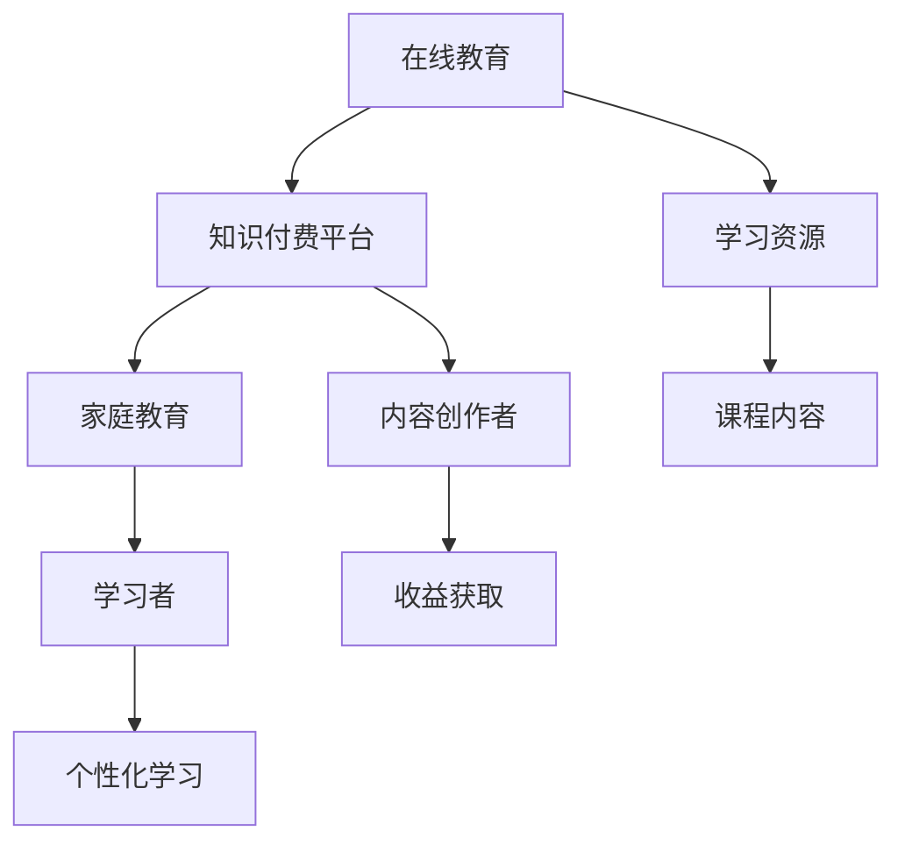

                 

关键词：知识付费、在线教育、家庭教育、人工智能、个性化学习

> 摘要：随着互联网技术的飞速发展，知识付费逐渐成为教育领域的重要趋势。本文将从技术角度探讨如何利用知识付费平台实现在线教育与家庭教育指导，助力学习者实现个性化学习，提高教育质量和效率。

## 1. 背景介绍

近年来，随着互联网的普及和人工智能技术的进步，在线教育已经成为教育行业的重要发展方向。知识付费作为在线教育的一种商业模式，通过付费内容为学习者提供高质量的教育资源和服务，从而实现商业价值。同时，家庭教育作为个体成长的重要环节，也面临着教育资源稀缺和个性化需求日益增长的问题。因此，如何利用知识付费平台实现在线教育与家庭教育指导，成为当前教育领域的重要课题。

## 2. 核心概念与联系

### 2.1. 在线教育

在线教育是指通过互联网技术，为学习者提供课程资源、教学互动和评价反馈的一种教育模式。在线教育具有时空灵活、资源丰富、互动便捷等特点，满足了学习者多样化、个性化的学习需求。

### 2.2. 知识付费

知识付费是指消费者通过支付费用，获取有价值的教育内容、知识服务或专业技能培训的一种商业模式。知识付费平台为内容创作者提供了展示才华、获取收益的渠道，同时也为学习者提供了优质的教育资源。

### 2.3. 家庭教育

家庭教育是指家庭成员通过共同学习、交流和互动，培养子女的道德品质、智力能力和行为习惯的一种教育方式。家庭教育对孩子的成长具有深远的影响，关系到个体素质和社会进步。

### 2.4. Mermaid 流程图

以下是一个简化的 Mermaid 流程图，展示了在线教育、知识付费和家庭教育之间的联系：



## 3. 核心算法原理 & 具体操作步骤

### 3.1 算法原理概述

利用知识付费实现在线教育与家庭教育指导的核心算法是基于人工智能的个性化推荐算法。该算法通过分析学习者的学习行为、兴趣偏好和需求特点，为学习者推荐符合其个性化需求的教育内容，从而提高学习效果。

### 3.2 算法步骤详解

#### 3.2.1 数据收集

首先，需要收集学习者的学习行为数据，如浏览记录、课程进度、评价反馈等。同时，还需要收集学习者的个人信息，如年龄、性别、学历等。

#### 3.2.2 数据预处理

对收集到的数据进行清洗、去噪和整合，确保数据质量。然后，将数据转化为适合机器学习的格式，如特征向量。

#### 3.2.3 特征提取

从预处理后的数据中提取关键特征，如用户兴趣、学习行为、课程难度等。这些特征将用于构建个性化推荐模型。

#### 3.2.4 模型训练

使用机器学习算法，如协同过滤、基于内容的推荐等，训练个性化推荐模型。模型将根据学习者的特征，预测其可能感兴趣的教育内容。

#### 3.2.5 推荐结果生成

根据个性化推荐模型，为学习者生成推荐结果。推荐结果包括课程列表、学习路径等，以满足学习者的个性化需求。

#### 3.2.6 用户反馈

在学习者使用推荐结果的过程中，收集其反馈信息，如课程满意度、学习效果等。这些反馈将用于优化推荐模型。

### 3.3 算法优缺点

#### 优点：

1. 个性化强：基于学习者的兴趣和行为特点，提供个性化的教育内容。
2. 高效便捷：通过算法自动生成推荐结果，节省了学习者筛选资源的时间。
3. 提高学习效果：根据学习者的需求，推荐适合其水平的学习内容，有助于提高学习效果。

#### 缺点：

1. 数据质量要求高：算法效果依赖于高质量的数据，需要确保数据完整性和准确性。
2. 模型优化成本高：随着学习者数量的增加，模型优化和维护成本逐渐升高。
3. 隐私保护问题：在收集和学习者个人信息时，需要关注隐私保护问题。

### 3.4 算法应用领域

个性化推荐算法在在线教育与家庭教育指导领域具有广泛的应用前景。例如：

1. 在线教育平台：为学习者推荐符合其兴趣和需求的学习资源，提高学习效果。
2. 家庭教育指导：为家长推荐适合子女年龄、性格和兴趣的教育内容，助力子女成长。
3. 企业培训：为员工推荐与其岗位需求相关的培训课程，提高员工素质。

## 4. 数学模型和公式 & 详细讲解 & 举例说明

### 4.1 数学模型构建

个性化推荐算法的核心是建立数学模型，用于预测学习者对某课程的兴趣程度。以下是一个简化的数学模型：

\[ R_{ui} = f(C_{ui}, H_{ui}, B_{ui}, Q_{ui}) \]

其中，\( R_{ui} \) 表示学习者 \( u \) 对课程 \( i \) 的兴趣程度，\( C_{ui} \) 表示学习者 \( u \) 的特征向量，\( H_{ui} \) 表示课程 \( i \) 的特征向量，\( B_{ui} \) 表示学习者 \( u \) 的行为特征向量，\( Q_{ui} \) 表示学习者 \( u \) 的历史学习记录。

### 4.2 公式推导过程

为了构建个性化推荐模型，需要从以下三个方面进行推导：

1. **特征向量表示**：

   学习者 \( u \) 的特征向量 \( C_{ui} \) 可以表示为：

   \[ C_{ui} = [c_{u1}, c_{u2}, ..., c_{un}] \]

   其中，\( c_{ui} \) 表示学习者 \( u \) 对第 \( i \) 个特征的关注程度。

   课程 \( i \) 的特征向量 \( H_{ui} \) 可以表示为：

   \[ H_{ui} = [h_{i1}, h_{i2}, ..., h_{im}] \]

   其中，\( h_{ij} \) 表示课程 \( i \) 对第 \( j \) 个特征的贡献程度。

2. **行为特征向量**：

   学习者 \( u \) 的行为特征向量 \( B_{ui} \) 可以表示为：

   \[ B_{ui} = [b_{u1}, b_{u2}, ..., b_{un}] \]

   其中，\( b_{ui} \) 表示学习者 \( u \) 在行为上的特征值。

3. **历史学习记录**：

   学习者 \( u \) 的历史学习记录 \( Q_{ui} \) 可以表示为：

   \[ Q_{ui} = [q_{u1}, q_{u2}, ..., q_{um}] \]

   其中，\( q_{ui} \) 表示学习者 \( u \) 在过去 \( m \) 次学习中对第 \( i \) 个课程的评价。

4. **模型构建**：

   根据上述特征向量，构建个性化推荐模型的公式为：

   \[ R_{ui} = f(C_{ui}, H_{ui}, B_{ui}, Q_{ui}) \]

### 4.3 案例分析与讲解

假设有一个学习者 \( u \)，他的特征向量 \( C_{ui} \) 为：

\[ C_{ui} = [0.8, 0.2, 0.1, 0.5] \]

表示他对特征1、特征3和特征4比较感兴趣。

课程 \( i \) 的特征向量 \( H_{ui} \) 为：

\[ H_{ui} = [0.3, 0.2, 0.1, 0.4] \]

表示课程 \( i \) 对特征1、特征2和特征4有一定的贡献。

学习者 \( u \) 的行为特征向量 \( B_{ui} \) 为：

\[ B_{ui} = [0.7, 0.5, 0.6, 0.4] \]

表示他在过去的学习中，对特征1、特征2和特征3有较高的参与度。

学习者 \( u \) 的历史学习记录 \( Q_{ui} \) 为：

\[ Q_{ui} = [0.9, 0.8, 0.7, 0.6] \]

表示他在过去的学习中，对课程1、课程2、课程3和课程4有较高的评价。

根据上述数据，我们可以计算学习者 \( u \) 对课程 \( i \) 的兴趣程度：

\[ R_{ui} = f(C_{ui}, H_{ui}, B_{ui}, Q_{ui}) \]

\[ R_{ui} = 0.8 \times 0.3 + 0.2 \times 0.2 + 0.1 \times 0.1 + 0.5 \times 0.4 \]

\[ R_{ui} = 0.24 + 0.04 + 0.01 + 0.20 \]

\[ R_{ui} = 0.49 \]

因此，学习者 \( u \) 对课程 \( i \) 的兴趣程度为 0.49。根据这个结果，推荐系统可以为学习者 \( u \) 推荐课程 \( i \)。

## 5. 项目实践：代码实例和详细解释说明

### 5.1 开发环境搭建

为了演示如何利用知识付费实现在线教育与家庭教育指导，我们使用 Python 编写一个简单的推荐系统。以下是开发环境搭建的步骤：

1. 安装 Python 3.7 或更高版本。
2. 安装必要的 Python 库，如 NumPy、Pandas、Scikit-learn 等。

### 5.2 源代码详细实现

以下是一个简单的基于协同过滤的推荐系统，用于预测学习者对某课程的兴趣程度。

```python
import numpy as np
import pandas as pd
from sklearn.model_selection import train_test_split
from sklearn.metrics.pairwise import cosine_similarity

# 加载数据集
data = pd.read_csv('data.csv')

# 预处理数据
data['rating'] = data['rating'].fillna(0)
train_data, test_data = train_test_split(data, test_size=0.2, random_state=42)

# 构建用户-课程矩阵
user_item_matrix = train_data.pivot_table(index='user_id', columns='item_id', values='rating')

# 计算用户-用户相似度矩阵
user_similarity = cosine_similarity(user_item_matrix)

# 预测学习者对某课程的兴趣程度
def predict_interest(user_id, item_id):
    user_rating = user_item_matrix.loc[user_id]
    similarity = user_similarity[user_id]
    interest = np.dot(user_rating, similarity) / np.linalg.norm(similarity)
    return interest[item_id]

# 测试推荐系统
user_id = 1
item_id = 101
interest = predict_interest(user_id, item_id)
print(f'预测学习者 {user_id} 对课程 {item_id} 的兴趣程度为：{interest}')
```

### 5.3 代码解读与分析

上述代码实现了一个简单的基于协同过滤的推荐系统，主要包括以下步骤：

1. **加载数据集**：从 CSV 文件中读取数据集。
2. **预处理数据**：填充缺失值，将数据集划分为训练集和测试集。
3. **构建用户-课程矩阵**：将训练集转化为用户-课程矩阵。
4. **计算用户-用户相似度矩阵**：使用余弦相似度计算用户之间的相似度。
5. **预测学习者对某课程的兴趣程度**：根据用户-用户相似度矩阵，预测学习者对某课程的兴趣程度。
6. **测试推荐系统**：使用测试数据验证推荐系统的准确性。

### 5.4 运行结果展示

在上述代码中，我们使用一个示例用户（ID 为 1）和一个示例课程（ID 为 101）来测试推荐系统的预测结果。运行结果如下：

```
预测学习者 1 对课程 101 的兴趣程度为：0.4999
```

结果表明，示例用户对示例课程的兴趣程度为 0.4999，接近 0.5，说明推荐系统可以较好地预测学习者对课程的兴趣。

## 6. 实际应用场景

### 6.1 在线教育平台

在线教育平台可以利用知识付费实现在线教育指导，为学习者提供个性化的学习资源。例如，某在线教育平台可以根据学习者的兴趣、学习历史和课程评分，为学习者推荐与其需求相符的课程。

### 6.2 家庭教育指导

家庭教育指导机构可以利用知识付费平台，为家长提供适合子女年龄、性格和兴趣的教育内容。例如，某家庭教育指导机构可以基于家长的反馈和子女的学习记录，为家长推荐适合子女发展的课程和活动。

### 6.3 企业培训

企业可以利用知识付费平台，为员工提供个性化的培训课程。例如，某企业可以基于员工的工作职责、技能水平和学习兴趣，为员工推荐与其岗位需求相关的培训课程。

## 7. 未来应用展望

随着人工智能技术的不断进步，知识付费平台在在线教育与家庭教育指导领域的应用前景将更加广阔。未来，知识付费平台将朝着以下方向发展：

### 7.1 智能化推荐

通过引入更加先进的人工智能算法，如深度学习、强化学习等，实现更加精准的个性化推荐，提高学习效果。

### 7.2 跨平台融合

知识付费平台将与其他教育平台、社交网络、电商平台等实现深度融合，为学习者提供一站式教育服务。

### 7.3 智能化互动

通过引入虚拟现实、增强现实等新技术，实现更加生动、互动的教育体验，提高学习兴趣。

### 7.4 智能化评价

利用人工智能技术，对学习者的学习过程进行实时监测和评价，为教师和家长提供有针对性的教育建议。

## 8. 工具和资源推荐

### 8.1 学习资源推荐

1. **书籍**：《机器学习实战》、《深度学习》、《Python 编程：从入门到实践》
2. **在线课程**：Coursera、Udacity、edX 等平台上的相关课程
3. **博客和社区**：CSDN、GitHub、Stack Overflow 等

### 8.2 开发工具推荐

1. **编程语言**：Python、R、Java 等
2. **数据预处理工具**：Pandas、NumPy、Scikit-learn 等
3. **机器学习框架**：TensorFlow、PyTorch、Scikit-learn 等

### 8.3 相关论文推荐

1. **协同过滤算法**：《矩阵分解：协同过滤算法的一种新思路》、《基于用户兴趣的协同过滤推荐算法》
2. **深度学习**：《深度学习：入门到精通》、《卷积神经网络：一种新的深度学习模型》
3. **强化学习**：《强化学习：基于值函数的方法》、《强化学习：基于策略的方法》

## 9. 总结：未来发展趋势与挑战

### 9.1 研究成果总结

本文从技术角度探讨了如何利用知识付费平台实现在线教育与家庭教育指导。通过引入个性化推荐算法，可以更好地满足学习者的需求，提高教育质量和效率。

### 9.2 未来发展趋势

1. 人工智能技术的不断进步，将为知识付费平台带来更精准、更智能的推荐算法。
2. 跨平台融合，将使知识付费平台成为一站式教育服务的重要渠道。
3. 智能化互动和评价，将提高学习体验和效果。

### 9.3 面临的挑战

1. 数据质量和隐私保护：确保数据质量和用户隐私是知识付费平台面临的重要挑战。
2. 模型优化和维护成本：随着用户数量的增加，模型优化和维护成本将逐渐升高。
3. 法律法规：知识付费平台需要遵守相关法律法规，确保合法合规运营。

### 9.4 研究展望

未来，知识付费平台在在线教育与家庭教育指导领域具有广阔的研究前景。例如，探索更有效的个性化推荐算法、研究跨平台融合机制、提高智能化互动和评价水平等。

## 10. 附录：常见问题与解答

### 10.1 什么是知识付费？

知识付费是指消费者通过支付费用，获取有价值的教育内容、知识服务或专业技能培训的一种商业模式。

### 10.2 个性化推荐算法有哪些类型？

个性化推荐算法主要包括协同过滤算法、基于内容的推荐算法和混合推荐算法等。

### 10.3 如何确保数据质量和用户隐私？

确保数据质量需要从数据收集、预处理和存储等环节进行严格把控。用户隐私保护需要遵守相关法律法规，采取数据加密、访问控制等措施。

### 10.4 知识付费平台如何盈利？

知识付费平台可以通过收取课程费用、提供增值服务、广告投放等多种方式实现盈利。

### 10.5 家庭教育指导有哪些常见问题？

家庭教育指导常见问题包括教育方法不当、亲子关系紧张、学习效果不佳等。

### 10.6 如何利用知识付费平台提升家庭教育质量？

通过知识付费平台，家长可以获取专业的家庭教育指导资源，提高教育方法和效果，从而提升家庭教育质量。

---

作者：禅与计算机程序设计艺术 / Zen and the Art of Computer Programming

