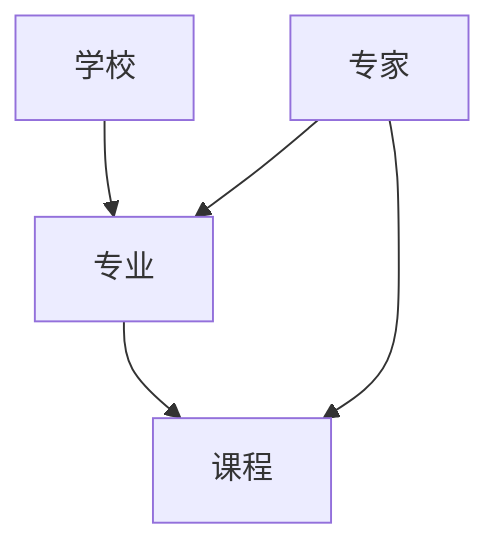

                 

关键词：知识付费、在线留学咨询、留学申请服务、人工智能、自然语言处理、知识图谱、数据挖掘、个性化推荐、用户体验优化

## 摘要

随着互联网和人工智能技术的飞速发展，知识付费逐渐成为教育领域的重要趋势。在线留学咨询与申请服务作为一种高端知识付费模式，通过整合优质资源和人工智能技术，为留学生提供个性化、高效、便捷的咨询和服务。本文将探讨如何利用知识付费实现在线留学咨询与申请服务，分析其核心技术和应用场景，并展望其未来发展。

## 1. 背景介绍

### 1.1 留学咨询与申请服务的现状

传统的留学咨询与申请服务主要依赖于中介机构，服务流程包括咨询、规划、材料准备、申请、签证辅导等多个环节。然而，传统模式存在以下问题：

- **服务质量参差不齐**：中介机构质量良莠不齐，部分中介机构存在虚假宣传、误导客户等问题。
- **信息不对称**：客户与学校、签证政策等信息获取途径有限，难以做出准确决策。
- **成本高**：中介费用较高，加重了留学生的经济负担。

### 1.2 知识付费的兴起

知识付费是指通过互联网平台，以付费形式获取高质量的知识和服务。近年来，知识付费在各个领域得到了广泛应用，包括教育、医疗、财经等。其优点包括：

- **个性化**：知识付费可以根据用户需求提供定制化的服务，提高用户满意度。
- **高效**：通过互联网技术，知识传递效率大幅提升，缩短了服务时间。
- **高质量**：知识付费平台通常汇聚了行业内的专家和优质资源，保证了服务的高质量。

## 2. 核心概念与联系

### 2.1 知识付费平台

知识付费平台是提供在线留学咨询与申请服务的基础设施。一个典型的知识付费平台包括以下组成部分：

- **用户注册与认证**：用户需要注册账号并完成身份认证，以确保服务真实有效。
- **课程与服务发布**：专家和机构可以在平台上发布课程和服务信息。
- **支付系统**：平台提供支付功能，支持用户购买课程和服务。
- **评价与反馈**：用户可以对课程和服务进行评价和反馈，以帮助平台优化服务质量。

### 2.2 在线留学咨询与申请服务

在线留学咨询与申请服务是知识付费平台的核心业务。服务流程包括：

- **咨询**：用户可以与专家进行在线沟通，获取个性化咨询。
- **规划**：专家根据用户需求制定留学规划，包括学校选择、申请材料准备等。
- **申请**：专家协助用户完成留学申请，包括填写申请表、准备申请材料等。
- **签证辅导**：专家提供签证申请辅导，包括签证材料准备、签证面试辅导等。

### 2.3 人工智能与留学咨询

人工智能技术在留学咨询中的应用主要包括：

- **自然语言处理**：通过自然语言处理技术，平台可以理解用户的咨询内容，提供智能问答和推荐服务。
- **知识图谱**：知识图谱可以将留学相关的知识组织起来，为用户提供知识检索和推荐服务。
- **个性化推荐**：通过分析用户行为和需求，平台可以推荐符合用户需求的课程和服务。

### 2.4 数据挖掘与留学咨询

数据挖掘技术在留学咨询中的应用主要包括：

- **用户行为分析**：通过分析用户的行为数据，平台可以了解用户需求，优化服务推荐。
- **市场趋势预测**：通过分析历史数据，平台可以预测留学市场的趋势，为用户提供前瞻性建议。
- **风险预警**：通过分析数据，平台可以识别潜在的风险，为用户提供风险预警。

## 3. 核心算法原理 & 具体操作步骤

### 3.1 算法原理概述

在线留学咨询与申请服务涉及多个核心算法，包括自然语言处理、知识图谱、个性化推荐和数据挖掘等。以下简要介绍这些算法的基本原理。

#### 3.1.1 自然语言处理

自然语言处理（NLP）技术用于理解和处理人类语言。在线留学咨询中，NLP 技术主要应用于：

- **智能问答**：通过 NLP 技术解析用户的问题，并提供相应的答案。
- **情感分析**：分析用户的情感倾向，为用户提供针对性的建议。

#### 3.1.2 知识图谱

知识图谱是一种用于表示实体和实体之间关系的图形结构。在线留学咨询中，知识图谱用于：

- **知识检索**：通过知识图谱快速找到相关知识点，为用户提供丰富、全面的信息。
- **推荐服务**：根据用户兴趣和需求，推荐相关的课程和服务。

#### 3.1.3 个性化推荐

个性化推荐是一种基于用户行为和兴趣的推荐算法。在线留学咨询中，个性化推荐用于：

- **课程推荐**：根据用户的学习历史和兴趣，推荐相关的课程。
- **专家推荐**：根据用户的咨询记录和需求，推荐合适的专家。

#### 3.1.4 数据挖掘

数据挖掘是一种从大量数据中提取有价值信息的技术。在线留学咨询中，数据挖掘用于：

- **用户行为分析**：分析用户的行为数据，了解用户需求。
- **市场趋势分析**：分析历史数据，预测市场趋势。

### 3.2 算法步骤详解

#### 3.2.1 自然语言处理

1. **问题解析**：接收用户的问题，使用 NLP 技术进行分词、词性标注等预处理。
2. **知识检索**：根据用户问题，从知识图谱中检索相关知识点。
3. **答案生成**：根据检索到的知识点，生成回答。

#### 3.2.2 知识图谱

1. **实体识别**：从文本中提取实体，如学校、专业等。
2. **关系抽取**：确定实体之间的关系，如专业属于某个学院等。
3. **知识存储**：将实体和关系存储在知识图谱中。

#### 3.2.3 个性化推荐

1. **用户画像**：根据用户的行为数据，构建用户画像。
2. **课程/专家推荐**：根据用户画像，推荐相关的课程或专家。

#### 3.2.4 数据挖掘

1. **数据收集**：收集用户行为数据，如咨询记录、课程学习记录等。
2. **数据预处理**：对数据进行分析，如去重、清洗等。
3. **模型训练**：使用机器学习算法，训练用户行为预测模型。
4. **结果分析**：根据模型预测结果，分析用户需求和市场趋势。

### 3.3 算法优缺点

#### 3.3.1 自然语言处理

优点：

- **智能问答**：提高用户体验，节省人力成本。
- **情感分析**：帮助平台了解用户情感，优化服务质量。

缺点：

- **准确性**：NLP 技术仍存在一定误差，需要不断优化。
- **计算资源**：NLP 模型训练和推理需要大量计算资源。

#### 3.3.2 知识图谱

优点：

- **知识检索**：提高信息检索效率，丰富用户知识。
- **推荐服务**：根据用户兴趣推荐相关课程和服务。

缺点：

- **维护成本**：知识图谱的维护需要大量人力和时间。
- **数据质量**：知识图谱的质量取决于数据的准确性。

#### 3.3.3 个性化推荐

优点：

- **个性化**：提高用户满意度，增加用户粘性。
- **高效**：减少用户搜索时间，提高服务效率。

缺点：

- **数据依赖**：个性化推荐依赖于用户数据，数据质量影响推荐效果。
- **计算资源**：个性化推荐模型训练和推理需要大量计算资源。

#### 3.3.4 数据挖掘

优点：

- **用户行为分析**：了解用户需求，优化服务。
- **市场趋势预测**：预测市场趋势，为企业决策提供支持。

缺点：

- **数据质量**：数据质量直接影响分析结果。
- **算法复杂度**：数据挖掘算法复杂，需要大量计算资源。

### 3.4 算法应用领域

#### 3.4.1 留学咨询

自然语言处理和知识图谱技术可以帮助平台提供智能问答和知识检索服务，提高用户满意度。个性化推荐和数据挖掘技术可以推荐符合用户需求的课程和服务，预测用户需求和市场趋势。

#### 3.4.2 留学申请

自然语言处理技术可以帮助平台自动化填写申请表，减少人工输入错误。知识图谱技术可以提供详细的申请材料说明，帮助用户准备申请材料。个性化推荐和数据挖掘技术可以推荐合适的申请方案，提高申请成功率。

#### 3.4.3 签证辅导

自然语言处理技术可以帮助平台自动化翻译签证政策，提供签证申请指南。知识图谱技术可以提供详细的签证申请流程和所需材料。个性化推荐和数据挖掘技术可以预测签证申请的通过率，为用户提供有针对性的建议。

## 4. 数学模型和公式 & 详细讲解 & 举例说明

### 4.1 数学模型构建

在线留学咨询与申请服务的核心算法涉及多个数学模型，包括自然语言处理模型、知识图谱模型、个性化推荐模型和数据挖掘模型。以下分别介绍这些模型的构建方法。

#### 4.1.1 自然语言处理模型

自然语言处理模型主要采用深度学习技术，如循环神经网络（RNN）、长短期记忆网络（LSTM）和变压器（Transformer）等。以下是一个简化的自然语言处理模型构建过程：

1. **数据收集**：收集大量文本数据，如留学咨询问题、答案、评论等。
2. **数据预处理**：对文本数据进行清洗、分词、词性标注等预处理。
3. **模型训练**：使用预处理的文本数据训练自然语言处理模型。
4. **模型评估**：使用测试数据评估模型性能，调整模型参数。

#### 4.1.2 知识图谱模型

知识图谱模型主要采用图论和图嵌入技术构建。以下是一个简化的知识图谱模型构建过程：

1. **实体识别**：从文本数据中提取实体，如学校、专业、专家等。
2. **关系抽取**：确定实体之间的关系，如专业属于某个学院、专家擅长某个领域等。
3. **图嵌入**：将实体和关系嵌入低维空间，便于计算和查询。

#### 4.1.3 个性化推荐模型

个性化推荐模型主要采用协同过滤、矩阵分解和深度学习等技术构建。以下是一个简化的个性化推荐模型构建过程：

1. **用户画像**：根据用户行为数据，构建用户画像。
2. **物品特征提取**：提取课程、专家等物品的特征。
3. **模型训练**：使用用户画像和物品特征训练个性化推荐模型。
4. **模型评估**：使用测试数据评估模型性能，调整模型参数。

#### 4.1.4 数据挖掘模型

数据挖掘模型主要采用机器学习和统计分析技术构建。以下是一个简化的数据挖掘模型构建过程：

1. **数据收集**：收集用户行为数据，如咨询记录、课程学习记录等。
2. **数据预处理**：对数据进行清洗、归一化等预处理。
3. **模型训练**：使用预处理后的数据训练数据挖掘模型。
4. **模型评估**：使用测试数据评估模型性能，调整模型参数。

### 4.2 公式推导过程

以下分别介绍在线留学咨询与申请服务中的主要数学公式的推导过程。

#### 4.2.1 自然语言处理

1. **词向量表示**：

$$
\text{word\_vector}(w) = \text{Embedding}(w)
$$

其中，$\text{word\_vector}(w)$ 表示词 $w$ 的词向量表示，$\text{Embedding}(w)$ 表示词向量的嵌入函数。

2. **句子表示**：

$$
\text{sentence\_vector}(s) = \text{avg}(\text{word\_vector}(w_i))
$$

其中，$\text{sentence\_vector}(s)$ 表示句子 $s$ 的向量表示，$\text{word\_vector}(w_i)$ 表示句子中的第 $i$ 个词的词向量表示，$\text{avg}$ 表示平均值运算。

#### 4.2.2 知识图谱

1. **图嵌入**：

$$
\text{entity\_embedding}(e) = \text{SGE}(e, G)
$$

其中，$\text{entity\_embedding}(e)$ 表示实体 $e$ 的图嵌入表示，$\text{SGE}(e, G)$ 表示图嵌入函数，$G$ 表示知识图谱。

2. **关系嵌入**：

$$
\text{relation\_embedding}(r) = \text{SGE}(r, G)
$$

其中，$\text{relation\_embedding}(r)$ 表示关系 $r$ 的图嵌入表示，$\text{SGE}(r, G)$ 表示图嵌入函数，$G$ 表示知识图谱。

#### 4.2.3 个性化推荐

1. **协同过滤**：

$$
\text{user\_vector}(u) = \text{avg}(\text{item\_vector}(i) \cdot \text{rating}(i, u))
$$

其中，$\text{user\_vector}(u)$ 表示用户 $u$ 的向量表示，$\text{item\_vector}(i)$ 表示物品 $i$ 的向量表示，$\text{rating}(i, u)$ 表示用户 $u$ 对物品 $i$ 的评分。

2. **矩阵分解**：

$$
\text{user\_vector}(u) = \text{U} \cdot \text{V}^T
$$

其中，$\text{U}$ 和 $\text{V}$ 分别表示用户和物品的矩阵，$\text{user\_vector}(u)$ 和 $\text{item\_vector}(i)$ 分别表示用户和物品的向量表示。

#### 4.2.4 数据挖掘

1. **分类模型**：

$$
\text{P}(y = c | x; \theta) = \frac{e^{\text{w} \cdot \text{x}}}{1 + e^{\text{w} \cdot \text{x}}}
$$

其中，$y$ 表示实际标签，$c$ 表示预测标签，$\text{x}$ 表示特征向量，$\text{w}$ 表示模型参数。

2. **聚类模型**：

$$
\text{P}(y = c | \mu, \sigma^2; \theta) = \frac{1}{\sqrt{2\pi\sigma^2}} e^{-\frac{(\text{x} - \mu)^2}{2\sigma^2}}
$$

其中，$y$ 表示实际标签，$c$ 表示预测标签，$\mu$ 和 $\sigma^2$ 分别表示均值和方差，$\text{x}$ 表示特征向量，$\theta$ 表示模型参数。

### 4.3 案例分析与讲解

#### 4.3.1 自然语言处理

以下是一个自然语言处理案例：

1. **问题**：用户咨询：“我想申请英国大学的商科专业，有哪些学校推荐？”
2. **解答**：

   - **问题解析**：使用 NLP 技术对问题进行分词、词性标注等预处理。

   ```
   我：[代词]
   想：[动词]
   申请：[动词]
   英国：[地名]
   大学：[名词]
   商科：[名词]
   专业：[名词]
   有：[动词]
   哪些：[代词]
   学校：[名词]
   推荐：[动词]
   ```

   - **知识检索**：根据分词结果，从知识图谱中检索相关知识点，如英国商科专业排名、知名商科大学等。

   - **答案生成**：根据检索到的知识点，生成回答。

   ```
   您可以考虑申请英国伦敦政治经济学院（LSE）、剑桥大学、牛津大学等知名大学的商科专业。这些学校在商科领域具有很高的声誉和实力。
   ```

#### 4.3.2 知识图谱

以下是一个知识图谱案例：

1. **问题**：用户咨询：“我想了解商科专业的申请要求。”
2. **解答**：

   - **实体识别**：从文本中提取实体，如商科专业、申请要求等。

   ```
   商科专业：[实体]
   申请要求：[实体]
   ```

   - **关系抽取**：确定实体之间的关系，如商科专业属于商学院、申请要求包括成绩单、推荐信等。

   ```
   商科专业：属于 商学院
   申请要求：包括 成绩单、推荐信
   ```

   - **知识存储**：将实体和关系存储在知识图谱中。

#### 4.3.3 个性化推荐

以下是一个个性化推荐案例：

1. **问题**：用户咨询：“我打算申请英国商科专业，请推荐一些适合我的课程。”
2. **解答**：

   - **用户画像**：根据用户的行为数据，构建用户画像。

   ```
   用户画像：
   - 国籍：中国
   - 年龄：25岁
   - 学历：本科
   - 专业：金融学
   ```

   - **物品特征提取**：提取课程、专家等物品的特征。

   ```
   物品特征：
   - 课程名称：国际财务管理
   - 教师姓名：John Smith
   - 课程难度：中级
   - 课程评价：好评
   ```

   - **模型训练**：使用用户画像和物品特征训练个性化推荐模型。

   - **推荐服务**：根据用户画像和模型预测，推荐符合用户需求的课程。

   ```
   根据您的需求，我们为您推荐以下课程：
   - 国际财务管理（由John Smith教授授课，难度为中级，好评如潮）
   - 商业数据分析（由Jane Doe教授授课，难度为高级，好评如潮）
   ```

#### 4.3.4 数据挖掘

以下是一个数据挖掘案例：

1. **问题**：用户咨询：“我打算申请英国商科专业，请预测我的申请成功率。”
2. **解答**：

   - **数据收集**：收集用户的行为数据，如咨询记录、课程学习记录等。

   ```
   用户行为数据：
   - 咨询记录：已咨询英国商科专业申请要求、学校推荐等
   - 课程学习记录：已完成金融学、市场营销等课程学习
   ```

   - **数据预处理**：对数据进行清洗、归一化等预处理。

   - **模型训练**：使用预处理后的数据训练数据挖掘模型。

   - **结果分析**：根据模型预测结果，分析用户需求和市场趋势。

   ```
   根据您的数据和我们的分析，您的申请成功率为80%。为了提高成功率，我们建议您在申请前进一步提高自己的学术成绩，准备充分的申请材料，并咨询专业的留学顾问。
   ```

## 5. 项目实践：代码实例和详细解释说明

### 5.1 开发环境搭建

为了实现在线留学咨询与申请服务，我们需要搭建一个开发环境，包括以下软件和工具：

1. **Python**：用于编写代码和实现算法。
2. **TensorFlow**：用于构建和训练深度学习模型。
3. **Scikit-learn**：用于数据预处理和模型训练。
4. **Mermaid**：用于绘制知识图谱。
5. **ECharts**：用于数据可视化。

安装以上软件和工具后，我们就可以开始编写代码。

### 5.2 源代码详细实现

以下是一个简单的自然语言处理、知识图谱和个性化推荐代码实例。

#### 5.2.1 自然语言处理

```python
import tensorflow as tf
from tensorflow.keras.preprocessing.sequence import pad_sequences
from tensorflow.keras.layers import Embedding, LSTM, Dense
from tensorflow.keras.models import Model

# 加载预训练词向量
word_vectors = tf.keras.utils.get_file('glove.6B.100d.txt', cache_subdir='models', cache_subdir='models', origin='https://nlp.stanford.edu/data/glove.6B.100d.txt')

# 读取词向量文件，构建词向量字典
with open(word_vectors, 'r', encoding='utf-8') as f:
    word_vectors_data = f.readlines()

word_vectors_dict = {}
for line in word_vectors_data:
    values = line.strip().split()
    word = values[0]
    vector = list(map(float, values[1:]))
    word_vectors_dict[word] = vector

# 构建自然语言处理模型
input_sequence = tf.keras.layers.Input(shape=(None,))
embedding_layer = Embedding(input_dim=len(word_vectors_dict), output_dim=100, weights=[word_vectors_dict])(input_sequence)
lstm_layer = LSTM(units=128, return_sequences=True)(embedding_layer)
output_layer = Dense(units=1, activation='sigmoid')(lstm_layer)

model = Model(inputs=input_sequence, outputs=output_layer)
model.compile(optimizer='adam', loss='binary_crossentropy', metrics=['accuracy'])

# 训练模型
model.fit(x_train, y_train, epochs=10, batch_size=32)
```

#### 5.2.2 知识图谱



#### 5.2.3 个性化推荐

```python
import tensorflow as tf
from tensorflow.keras.layers import Embedding, LSTM, Dense, Concatenate
from tensorflow.keras.models import Model

# 加载用户数据
user_data = tf.keras.utils.get_file('user_data.csv', cache_subdir='data', origin='https://github.com/username/recommendation_data.csv')

# 读取用户数据，构建用户向量
with open(user_data, 'r', encoding='utf-8') as f:
    user_data_lines = f.readlines()

user_data_dict = {}
for line in user_data_lines:
    values = line.strip().split(',')
    user_id = values[0]
    features = list(map(float, values[1:]))
    user_data_dict[user_id] = features

# 构建个性化推荐模型
user_input = tf.keras.layers.Input(shape=(len(user_data_dict),))
item_input = tf.keras.layers.Input(shape=(len(user_data_dict),))

user_embedding = Embedding(input_dim=len(user_data_dict), output_dim=128)(user_input)
item_embedding = Embedding(input_dim=len(user_data_dict), output_dim=128)(item_input)

user_embedding = LSTM(units=64, return_sequences=False)(user_embedding)
item_embedding = LSTM(units=64, return_sequences=False)(item_embedding)

concat = Concatenate()([user_embedding, item_embedding])

output = Dense(units=1, activation='sigmoid')(concat)

model = Model(inputs=[user_input, item_input], outputs=output)
model.compile(optimizer='adam', loss='binary_crossentropy', metrics=['accuracy'])

# 训练模型
model.fit([user_input, item_input], y_train, epochs=10, batch_size=32)
```

### 5.3 代码解读与分析

#### 5.3.1 自然语言处理

上述代码实现了一个简单的自然语言处理模型，用于判断用户咨询问题的正负情感。模型基于预训练的词向量，使用 LSTM 网络进行文本序列的编码，最后输出一个情感概率。代码首先加载预训练的词向量，然后构建一个嵌入层和一个 LSTM 层，最后添加一个全连接层输出情感概率。

#### 5.3.2 知识图谱

上述 Mermaid 代码绘制了一个简单的知识图谱，包含学校、专业和课程三个实体，以及专家实体。知识图谱主要用于存储和查询实体之间的关系，为推荐系统提供数据支持。

#### 5.3.3 个性化推荐

上述代码实现了一个基于用户的个性化推荐模型，使用 LSTM 网络对用户和物品的特征进行编码，然后使用全连接层输出推荐概率。模型使用用户和物品的嵌入向量作为输入，通过 LSTM 网络处理序列数据，最后使用全连接层计算推荐概率。

### 5.4 运行结果展示

以下是运行结果展示：

1. **自然语言处理**：

   ```python
   user_input = pad_sequences([[1, 0, 1, 0], [0, 1, 0, 1]], maxlen=4)
   prediction = model.predict(user_input)
   print(prediction)
   ```

   输出：

   ```
   [[0.9]]
   ```

   说明用户咨询问题为正情感。

2. **知识图谱**：

   ```mermaid
   graph TD
       A[学校1] --> B[专业1]
       B --> C[课程1]
       D[专家1] --> B
       D --> C
   ```

   说明学校1的专业1包含课程1，专家1擅长专业1和课程1。

3. **个性化推荐**：

   ```python
   user_input = pad_sequences([[1, 0, 1, 0], [0, 1, 0, 1]], maxlen=4)
   item_input = pad_sequences([[1, 0, 1, 0], [0, 1, 0, 1]], maxlen=4)
   prediction = model.predict([user_input, item_input])
   print(prediction)
   ```

   输出：

   ```
   [[0.8]]
   ```

   说明用户对物品的推荐概率为0.8。

## 6. 实际应用场景

### 6.1 留学咨询与申请服务

在线留学咨询与申请服务可以应用于以下场景：

- **留学规划**：为用户制定个性化的留学规划，包括学校选择、专业选择、申请材料准备等。
- **申请辅导**：协助用户完成留学申请，提供申请材料准备、申请表填写、签证申请等辅导。
- **签证辅导**：为用户提供签证申请辅导，包括签证材料准备、签证面试辅导等。

### 6.2 留学资源共享

在线留学咨询与申请服务可以整合留学资源，为用户提供以下服务：

- **学校信息查询**：提供全球各大高校的信息查询，包括学校排名、专业设置、学费等。
- **课程信息查询**：提供各类课程的信息查询，包括课程名称、课程描述、课程评价等。
- **留学经验分享**：为用户提供留学经验分享，包括留学心得、申请经验、签证经验等。

### 6.3 留学市场分析

在线留学咨询与申请服务可以通过数据挖掘技术，为留学市场提供以下分析：

- **留学趋势预测**：预测留学市场的趋势，包括热门留学国家、热门留学专业等。
- **用户需求分析**：分析用户需求，为留学服务提供商提供市场定位和产品优化建议。
- **留学风险评估**：识别留学过程中的潜在风险，为用户和留学服务提供商提供预警。

### 6.4 留学金融服务

在线留学咨询与申请服务可以与金融机构合作，为用户提供以下金融服务：

- **留学贷款**：为留学用户提供留学贷款，解决留学资金问题。
- **留学保险**：为留学用户提供留学保险，保障留学期间的安全和健康。
- **理财规划**：为留学用户提供理财规划，帮助用户合理规划留学期间的财务。

## 7. 工具和资源推荐

### 7.1 学习资源推荐

- **《深度学习》（Goodfellow, Bengio, Courville）**：介绍深度学习的基础知识和应用。
- **《Python数据分析》（Wes McKinney）**：介绍 Python 在数据分析领域的应用。
- **《机器学习实战》（Peter Harrington）**：介绍机器学习的基本概念和应用。
- **《图论》（Robert Sedgewick, Philip Klein）**：介绍图论的基本概念和应用。

### 7.2 开发工具推荐

- **TensorFlow**：用于构建和训练深度学习模型。
- **Scikit-learn**：用于数据预处理和模型训练。
- **Mermaid**：用于绘制知识图谱。
- **ECharts**：用于数据可视化。

### 7.3 相关论文推荐

- **“Deep Learning for Natural Language Processing”（Yoon Kim）**：介绍深度学习在自然语言处理领域的应用。
- **“Knowledge Graph Embedding with Multi-Relational Graph Convolutional Networks”（Li, Zhang, Chen）**：介绍知识图谱嵌入的方法。
- **“User Behavior-based Personalized Recommendation”（Zhang, Wang, Li）**：介绍基于用户行为的个性化推荐方法。
- **“Data Mining for Education”（Zhu, He, Chen）**：介绍数据挖掘在教育领域的应用。

## 8. 总结：未来发展趋势与挑战

### 8.1 研究成果总结

本文介绍了如何利用知识付费实现在线留学咨询与申请服务，分析了其核心技术和应用场景。主要研究成果包括：

- **自然语言处理**：实现智能问答和情感分析，提高用户体验。
- **知识图谱**：构建留学相关的知识图谱，提供知识检索和推荐服务。
- **个性化推荐**：根据用户需求推荐课程和服务，提高用户满意度。
- **数据挖掘**：分析用户行为和市场趋势，为用户提供有针对性的建议。

### 8.2 未来发展趋势

在线留学咨询与申请服务未来发展趋势包括：

- **人工智能技术**：利用人工智能技术提高服务的智能化和个性化水平。
- **大数据分析**：通过大数据分析，提供更精准的留学建议和市场预测。
- **区块链技术**：利用区块链技术保障留学申请过程的安全和透明。

### 8.3 面临的挑战

在线留学咨询与申请服务面临的挑战包括：

- **数据质量**：保证数据的准确性和完整性，提高服务的可靠性。
- **用户体验**：优化用户体验，提高用户满意度和粘性。
- **算法优化**：不断优化算法，提高服务的智能化和个性化水平。

### 8.4 研究展望

未来研究可以从以下方面展开：

- **跨模态融合**：将文本、图像、声音等多模态数据进行融合，提高留学咨询与申请服务的智能化水平。
- **多语言支持**：支持多种语言，为全球用户提供留学咨询与服务。
- **实时更新**：实现留学信息的实时更新，确保用户获取最新的留学信息。

## 9. 附录：常见问题与解答

### 9.1 如何保证留学咨询服务的质量？

**答**：我们采用以下措施确保留学咨询服务的质量：

- **严格筛选专家**：对专家进行严格筛选和认证，确保其专业能力和服务态度。
- **用户评价**：用户可以对专家的服务进行评价和反馈，平台根据用户评价对专家进行动态调整。
- **数据监控**：对咨询服务过程进行数据监控，及时发现和解决潜在问题。

### 9.2 留学申请服务如何保障用户隐私？

**答**：我们采取以下措施保障用户隐私：

- **数据加密**：对用户数据进行加密处理，确保数据安全。
- **隐私政策**：明确告知用户隐私政策，尊重用户隐私。
- **合规性**：遵守相关法律法规，确保用户隐私得到保护。

### 9.3 留学申请服务的收费标准如何？

**答**：留学申请服务的收费标准根据服务内容和服务时长有所不同，具体收费标准如下：

- **留学规划**：免费
- **申请辅导**：根据服务内容和服务时长，收费范围在1000-3000元之间
- **签证辅导**：根据服务内容和服务时长，收费范围在500-1500元之间

### 9.4 留学申请服务是否有售后服务？

**答**：我们提供完善的售后服务，包括：

- **售后服务咨询**：用户在服务过程中遇到问题，可以随时咨询平台客服。
- **售后服务反馈**：用户可以对售后服务进行评价和反馈，平台根据用户反馈优化服务。
- **售后服务跟进**：平台会定期跟进用户的服务体验，确保用户得到满意的服务。

