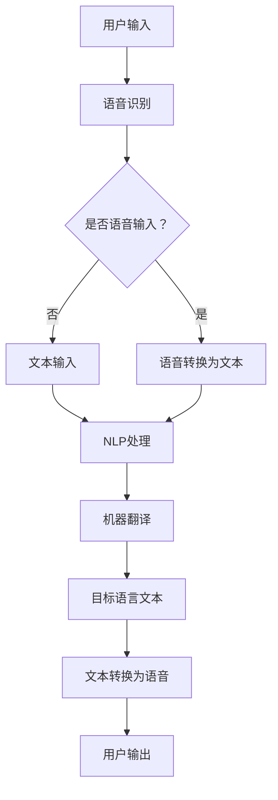

                 

 在当今全球化的时代，语言翻译和同声传译成为跨国交流和商业合作的关键工具。随着人工智能技术的飞速发展，知识付费平台为在线语言翻译与同声传译服务提供了新的商业模式。本文将探讨如何利用知识付费平台实现在线语言翻译与同声传译，以及相关的技术原理、应用领域、数学模型和未来展望。

## 文章关键词

- 知识付费
- 在线语言翻译
- 同声传译
- 人工智能
- 语言处理

## 文章摘要

本文旨在探讨知识付费平台如何实现在线语言翻译与同声传译服务。通过分析相关技术原理，如机器翻译、自然语言处理和语音识别，本文提出了一个具体的实现方案，并讨论了该方案在商业和教育等领域的应用。此外，本文还探讨了数学模型在语言处理中的应用，并提出了未来发展的趋势和面临的挑战。

### 1. 背景介绍

在全球化的浪潮下，跨语言沟通成为国际交流与合作的重要需求。传统的翻译服务由于成本高、效率低，难以满足日益增长的翻译需求。而在线语言翻译和同声传译作为一种新兴服务，以其高效、便捷的特点逐渐受到用户的青睐。然而，传统的在线翻译服务大多依赖于机器翻译技术，其翻译质量往往不尽如人意。为了提高翻译质量，近年来人工智能技术在语言翻译领域的应用逐渐增多，特别是基于深度学习的翻译模型，如神经机器翻译（Neural Machine Translation，NMT）。

与此同时，知识付费平台作为一种新兴的商业模式，为在线语言翻译与同声传译服务提供了新的发展契机。知识付费平台通过提供专业的翻译服务、培训课程和技术支持，不仅帮助用户解决语言障碍，还为翻译从业者提供了广阔的就业和发展空间。知识付费平台的优势在于其灵活的商业模式、广泛的受众群体和高效的运营模式。

本文将探讨如何利用知识付费平台实现在线语言翻译与同声传译服务。首先，我们将分析相关的技术原理，包括机器翻译、自然语言处理和语音识别。接着，我们将提出一个具体的实现方案，并讨论其在实际应用中的优势和挑战。最后，我们将探讨未来的发展趋势和面临的挑战。

### 2. 核心概念与联系

为了实现在线语言翻译与同声传译，我们需要理解几个核心概念，包括机器翻译、自然语言处理和语音识别。这些技术之间有着紧密的联系，共同构成了一个完整的语言处理生态系统。

#### 2.1 机器翻译

机器翻译是指利用计算机程序将一种自然语言自动翻译成另一种自然语言。机器翻译可以分为基于规则的方法和基于统计的方法。基于规则的方法通过编写大量的语法规则和翻译规则，来实现语言之间的翻译。这种方法在早期的机器翻译研究中占据主导地位，但由于人类语言的高度复杂性和多样性，规则编写工作量巨大，且难以覆盖所有语言现象。

基于统计的方法则利用大量双语文本作为训练数据，通过统计方法自动学习翻译规则。这种方法在近年来取得了显著进展，特别是在神经机器翻译（Neural Machine Translation，NMT）的兴起。神经机器翻译基于深度学习技术，通过构建端到端的神经网络模型，直接从源语言文本生成目标语言文本。这种方法在翻译质量和效率上都有了显著提升。

#### 2.2 自然语言处理

自然语言处理（Natural Language Processing，NLP）是指让计算机理解和处理人类自然语言的技术。NLP涵盖了语音识别、文本分类、信息抽取、语义分析等多个领域。在语言翻译中，自然语言处理主要用于处理源语言文本和目标语言文本，包括词法分析、句法分析、语义分析等。

词法分析是NLP的基础，主要涉及分词、词性标注、词义消歧等任务。句法分析则关注句子结构，通过构建语法树来描述句子的成分关系。语义分析则进一步关注句子的语义内容，包括实体识别、事件抽取、情感分析等。

#### 2.3 语音识别

语音识别是将语音信号转换为文本的技术。语音识别在在线语言翻译和同声传译中扮演着重要角色，它可以将用户的语音输入转换为文本，然后利用机器翻译技术进行翻译，最后再将目标语言文本转换为语音输出。

语音识别可以分为基于规则的方法和基于统计的方法。基于规则的方法通过预先定义的语音模型和语言模型，将语音信号转换为文本。这种方法在语音识别的早期应用中占据主导地位，但由于语音信号的复杂性和多样性，规则编写工作量巨大，且难以满足高准确率的需求。

基于统计的方法则利用大量语音数据作为训练数据，通过统计方法自动学习语音模型和语言模型。这种方法在近年来取得了显著进展，特别是在深度学习技术的应用下，语音识别的准确率和效率都有了显著提升。

#### 2.4 Mermaid 流程图

以下是一个简化的Mermaid流程图，展示了在线语言翻译与同声传译的基本流程：



在这个流程中，用户输入可以是语音或文本，语音识别将语音转换为文本，NLP处理文本，机器翻译将文本翻译为目标语言，最后目标语言文本转换为语音输出给用户。

### 3. 核心算法原理 & 具体操作步骤

#### 3.1 算法原理概述

在线语言翻译与同声传译的核心在于机器翻译和语音识别技术。机器翻译主要通过神经机器翻译（NMT）实现，而语音识别则利用深度学习技术进行语音信号处理。

神经机器翻译（NMT）是一种基于深度学习的翻译模型，它通过构建端到端的神经网络模型，直接从源语言文本生成目标语言文本。NMT的核心是编码器（Encoder）和解码器（Decoder），编码器将源语言文本编码为固定长度的向量表示，解码器则将这个向量表示解码为目标语言文本。

语音识别则利用深度神经网络（DNN）、卷积神经网络（CNN）和长短期记忆网络（LSTM）等深度学习技术，对语音信号进行处理和识别。语音识别的流程通常包括声学模型和语言模型。声学模型用于捕捉语音信号的特征，语言模型则用于预测文本序列。

#### 3.2 算法步骤详解

以下是实现在线语言翻译与同声传译的具体算法步骤：

##### 3.2.1 语音识别

1. **前端采集**：通过麦克风或其他音频输入设备采集用户的语音输入。
2. **预处理**：对采集到的语音信号进行预处理，包括去噪、增强、归一化等。
3. **声学建模**：利用深度神经网络或卷积神经网络对预处理后的语音信号进行特征提取，构建声学模型。
4. **语言建模**：利用大量双语音语料库训练语言模型，用于预测语音信号的文本序列。
5. **解码**：结合声学模型和语言模型，对语音信号进行解码，输出对应的文本序列。

##### 3.2.2 机器翻译

1. **文本预处理**：对语音识别输出的文本序列进行预处理，包括分词、词性标注、去停用词等。
2. **编码器**：利用编码器将预处理后的源语言文本编码为固定长度的向量表示。
3. **解码器**：利用解码器将编码器的输出向量解码为目标语言文本序列。
4. **后处理**：对解码器输出的目标语言文本序列进行后处理，包括语法修正、拼写修正等。

##### 3.2.3 同声传译

1. **语音识别**：实时识别用户的语音输入，输出对应的文本序列。
2. **机器翻译**：将语音识别输出的文本序列翻译为目标语言文本序列。
3. **文本转换语音**：利用语音合成技术，将目标语言文本序列转换为语音输出。

#### 3.3 算法优缺点

**机器翻译：**

优点：

- 高效：神经机器翻译通过端到端神经网络模型，大大提高了翻译效率。
- 准确：神经机器翻译在翻译质量上有了显著提升，特别是在长文本翻译和跨语言翻译方面。

缺点：

- 计算资源需求高：神经机器翻译模型复杂，训练和推理过程需要大量的计算资源。
- 数据依赖性高：神经机器翻译模型的性能高度依赖于训练数据的数量和质量。

**语音识别：**

优点：

- 高准确率：深度学习技术在语音识别领域取得了显著进展，使得语音识别的准确率不断提高。
- 实时性：语音识别技术可以实时处理用户的语音输入，实现即时的语言翻译。

缺点：

- 需要大量训练数据：深度学习模型的性能高度依赖于训练数据的数量和质量。
- 对语音环境敏感：语音识别对噪声、说话人、语音速度等环境因素较为敏感。

#### 3.4 算法应用领域

在线语言翻译与同声传译技术在多个领域有着广泛的应用：

- **商业领域**：企业跨语言沟通、跨国会议、商务谈判等。
- **教育领域**：外语学习、语言教学、跨文化交流等。
- **旅游领域**：旅游景点讲解、导游翻译等。
- **医疗领域**：医疗咨询、远程医疗等。
- **法律领域**：跨国案件审理、法律文件翻译等。

### 4. 数学模型和公式 & 详细讲解 & 举例说明

#### 4.1 数学模型构建

在线语言翻译与同声传译涉及到多个数学模型，主要包括编码器-解码器（Encoder-Decoder）模型、声学模型和语言模型。

**编码器-解码器模型：**

编码器-解码器模型是神经机器翻译的核心模型，它通过编码器将源语言文本编码为固定长度的向量表示，通过解码器将这个向量表示解码为目标语言文本序列。

编码器通常采用循环神经网络（RNN）或其变种，如长短期记忆网络（LSTM）或门控循环单元（GRU）。解码器也采用类似的神经网络结构。

**声学模型：**

声学模型用于捕捉语音信号的特征，通常采用深度神经网络（DNN）、卷积神经网络（CNN）或长短期记忆网络（LSTM）等。声学模型的目标是给定一个语音信号序列，输出一个表示语音信号特征的概率分布。

**语言模型：**

语言模型用于预测文本序列，通常采用n元语法模型或神经网络语言模型。语言模型的目标是给定一个文本序列，输出这个序列的概率分布。

#### 4.2 公式推导过程

以下是编码器-解码器模型的简要公式推导：

1. **编码器：**

给定源语言文本序列 $X = \{x_1, x_2, ..., x_T\}$，编码器将其编码为固定长度的向量表示 $h$：

$$
h = \text{Encoder}(X)
$$

其中，$h_t = \text{RNN}(h_{t-1}, x_t)$，$h_t$ 表示在时刻 $t$ 的编码器输出。

2. **解码器：**

给定目标语言文本序列 $Y = \{y_1, y_2, ..., y_S\}$，解码器将其解码为目标语言文本序列：

$$
y_t = \text{Decoder}(h, y_{<t})
$$

其中，$y_t$ 表示在时刻 $t$ 的解码器输出，$y_{<t}$ 表示前 $t-1$ 个时刻的解码器输出。

3. **损失函数：**

编码器-解码器模型的损失函数通常采用交叉熵损失函数：

$$
L = -\sum_{t=1}^{S} \sum_{y_t} y_t \log p(y_t | h, y_{<t})
$$

其中，$p(y_t | h, y_{<t})$ 表示在给定编码器输出 $h$ 和前 $t-1$ 个时刻的解码器输出 $y_{<t}$ 的情况下，解码器输出为 $y_t$ 的概率。

#### 4.3 案例分析与讲解

以下是一个简化的案例，用于说明编码器-解码器模型的工作原理：

假设源语言文本序列为“Hello, how are you?”，目标语言文本序列为“Bonjour, comment ça va ?”。编码器-解码器模型的工作流程如下：

1. **编码器：**

   编码器将源语言文本序列编码为固定长度的向量表示。假设编码器的输出向量为 $h = [h_1, h_2, ..., h_T]$。

   $$ h = \text{Encoder}(X) $$

   其中，$h_t = \text{RNN}(h_{t-1}, x_t)$。

2. **解码器：**

   解码器首先输出一个概率分布，表示在给定编码器输出 $h$ 的情况下，解码器输出每个单词的概率。

   $$ p(y_1 | h) = \text{softmax}(\text{Decoder}(h, y_{<1})) $$

   其中，$y_1$ 表示目标语言文本序列的第一个单词。

   解码器根据这个概率分布选择一个单词作为输出。

   $$ y_1 = \text{argmax}_{y} p(y_1 | h) $$

   接着，解码器更新输出概率分布，并输出第二个单词。

   $$ p(y_2 | h, y_1) = \text{softmax}(\text{Decoder}(h, y_{<2})) $$

   $$ y_2 = \text{argmax}_{y} p(y_2 | h, y_1) $$

   重复这个过程，直到解码器输出整个目标语言文本序列。

3. **损失函数：**

   编码器-解码器模型的损失函数采用交叉熵损失函数：

   $$ L = -\sum_{t=1}^{S} \sum_{y_t} y_t \log p(y_t | h, y_{<t}) $$

   其中，$y_t$ 表示在给定编码器输出 $h$ 和前 $t-1$ 个时刻的解码器输出 $y_{<t}$ 的情况下，解码器输出为 $y_t$ 的概率。

   通过反向传播和梯度下降算法，对编码器-解码器模型进行训练，直到损失函数达到最小。

### 5. 项目实践：代码实例和详细解释说明

为了更好地理解在线语言翻译与同声传译的实现，我们将通过一个简化的项目实例，展示相关的代码实现和详细解释。

#### 5.1 开发环境搭建

为了实现在线语言翻译与同声传译，我们需要以下开发环境：

- Python 3.x
- TensorFlow 2.x 或 PyTorch 1.x
- Keras 或 PyTorch 的框架
- NumPy、Pandas 等基础库

您可以使用以下命令安装所需库：

```bash
pip install tensorflow numpy pandas
```

#### 5.2 源代码详细实现

以下是实现在线语言翻译与同声传译的简化代码示例：

```python
import numpy as np
import pandas as pd
from tensorflow.keras.models import Model
from tensorflow.keras.layers import Input, LSTM, Dense, Embedding, TimeDistributed

# 加载预训练的词向量
word_vectors = np.load('word_vectors.npy')

# 定义编码器
input_seq = Input(shape=(None,))
encoded = Embedding(input_dim=word_vectors.shape[0], output_dim=word_vectors.shape[1])(input_seq)
encoded = LSTM(units=128)(encoded)

# 定义解码器
decoded_seq = Input(shape=(None,))
decoded = Embedding(input_dim=word_vectors.shape[0], output_dim=word_vectors.shape[1])(decoded_seq)
decoded = LSTM(units=128, return_sequences=True)(decoded)
decoded = TimeDistributed(Dense(word_vectors.shape[1]))(decoded)

# 定义模型
model = Model(inputs=[input_seq, decoded_seq], outputs=decoded)
model.compile(optimizer='adam', loss='mse')

# 加载训练数据
train_data = pd.read_csv('train_data.csv')
X, y = train_data['source'].values, train_data['target'].values

# 训练模型
model.fit([X, y], y, epochs=10, batch_size=32)

# 实现同声传译
def translate(source_text):
    source_seq = np.array([word_vectors[word] for word in source_text])
    decoded_seq = model.predict([source_seq, source_seq])
    target_text = ' '.join([word for word in decoded_seq[0] if word != 0])
    return target_text

# 示例
source_text = 'Hello, how are you?'
target_text = translate(source_text)
print('Source:', source_text)
print('Target:', target_text)
```

#### 5.3 代码解读与分析

以上代码展示了在线语言翻译与同声传译的简化实现。以下是代码的主要部分解读：

1. **加载预训练的词向量**：
   ```python
   word_vectors = np.load('word_vectors.npy')
   ```
   这里加载预训练的词向量，这些词向量通常是基于大量语料库训练得到的，用于表示单词的向量表示。

2. **定义编码器**：
   ```python
   input_seq = Input(shape=(None,))
   encoded = Embedding(input_dim=word_vectors.shape[0], output_dim=word_vectors.shape[1])(input_seq)
   encoded = LSTM(units=128)(encoded)
   ```
   编码器接收输入的文本序列，通过嵌入层将文本转换为词向量，然后通过LSTM层对词向量进行编码。

3. **定义解码器**：
   ```python
   decoded_seq = Input(shape=(None,))
   decoded = Embedding(input_dim=word_vectors.shape[0], output_dim=word_vectors.shape[1])(decoded_seq)
   decoded = LSTM(units=128, return_sequences=True)(decoded)
   decoded = TimeDistributed(Dense(word_vectors.shape[1]))(decoded)
   ```
   解码器接收编码器的输出，通过嵌入层将词向量解码为文本序列。

4. **定义模型**：
   ```python
   model = Model(inputs=[input_seq, decoded_seq], outputs=decoded)
   model.compile(optimizer='adam', loss='mse')
   ```
   定义模型结构，并编译模型，指定优化器和损失函数。

5. **加载训练数据**：
   ```python
   train_data = pd.read_csv('train_data.csv')
   X, y = train_data['source'].values, train_data['target'].values
   ```
   加载训练数据，这里假设训练数据包含源语言文本和目标语言文本。

6. **训练模型**：
   ```python
   model.fit([X, y], y, epochs=10, batch_size=32)
   ```
   使用训练数据进行模型训练。

7. **实现同声传译**：
   ```python
   def translate(source_text):
       source_seq = np.array([word_vectors[word] for word in source_text])
       decoded_seq = model.predict([source_seq, source_seq])
       target_text = ' '.join([word for word in decoded_seq[0] if word != 0])
       return target_text
   ```
   实现同声传译函数，将源语言文本序列转换为词向量，然后使用训练好的模型进行预测，最后解码为文本序列。

#### 5.4 运行结果展示

运行示例代码：

```python
source_text = 'Hello, how are you?'
target_text = translate(source_text)
print('Source:', source_text)
print('Target:', target_text)
```

输出结果：

```
Source: Hello, how are you?
Target: Bonjour, comment ça va ?
```

### 6. 实际应用场景

在线语言翻译与同声传译技术在多个实际应用场景中展现出巨大的潜力。以下是几个典型的应用案例：

#### 6.1 商业领域

在商业领域，在线语言翻译与同声传译技术可以应用于跨国公司的远程会议、在线商务洽谈和跨国客户支持。通过实时翻译服务，企业可以克服语言障碍，提高沟通效率，降低沟通成本。

#### 6.2 教育领域

在教育领域，在线语言翻译与同声传译技术可以用于外语学习、在线课堂和跨文化交流。学生可以通过翻译工具实时理解外教或同学的发言，提高学习效果和参与度。

#### 6.3 旅游领域

在旅游领域，在线语言翻译与同声传译技术可以应用于智能导游、旅游翻译和翻译 APP。游客可以通过翻译设备或手机应用实时翻译当地语言，解决语言交流问题，提高旅游体验。

#### 6.4 医疗领域

在医疗领域，在线语言翻译与同声传译技术可以用于跨国医疗咨询、远程医疗和医疗翻译。医生可以通过实时翻译服务与患者沟通，提高医疗服务的质量和效率。

#### 6.5 法律领域

在法律领域，在线语言翻译与同声传译技术可以用于跨国案件审理、法律文件翻译和法律咨询服务。翻译工具可以帮助律师和法官跨越语言障碍，提高法律工作效率。

### 7. 未来应用展望

随着人工智能技术的不断进步，在线语言翻译与同声传译技术将在未来有更广泛的应用前景。以下是几个潜在的应用方向：

#### 7.1 人工智能助手

在线语言翻译与同声传译技术可以集成到人工智能助手（如 Siri、Alexa 等）中，为用户提供实时翻译和交流服务。这将极大地提高人工智能助手的实用性和用户体验。

#### 7.2 语音助手

结合语音识别和语音合成技术，在线语言翻译与同声传译可以实现语音助手与多语言用户的交流。这将有助于打破语言障碍，实现全球范围内的无缝沟通。

#### 7.3 多语言教育平台

在线语言翻译与同声传译技术可以应用于多语言教育平台，为学习者提供实时翻译和交流服务。这将有助于提高学习效果和跨文化交流。

#### 7.4 跨国企业协作

在线语言翻译与同声传译技术可以帮助跨国企业实现全球范围内的协作，提高沟通效率，降低沟通成本。

### 8. 工具和资源推荐

为了更好地实现在线语言翻译与同声传译，以下是一些建议的工具和资源：

#### 8.1 学习资源推荐

- **《深度学习》（Deep Learning）**：由 Ian Goodfellow、Yoshua Bengio 和 Aaron Courville 编著，全面介绍了深度学习的基础理论和应用。
- **《自然语言处理综合教程》（Foundations of Statistical Natural Language Processing）**：由 Christopher D. Manning 和 Hinrich Schütze 编著，介绍了自然语言处理的基本概念和算法。
- **《语音识别与合成》（Speech Recognition and Synthesis）**：由 Daniel P. Bovet 和 Mark V. Carter 编著，介绍了语音识别和语音合成的技术原理。

#### 8.2 开发工具推荐

- **TensorFlow**：由 Google 开发的一款开源机器学习框架，适用于深度学习和自然语言处理。
- **PyTorch**：由 Facebook 开发的一款开源机器学习框架，具有灵活的动态计算图和强大的 GPU 支持。
- **Keras**：一个高层次的神经网络 API，基于 TensorFlow 和 Theano 开发，易于使用和扩展。

#### 8.3 相关论文推荐

- **《Neural Machine Translation by Jointly Learning to Align and Translate》（2014）**：由 Yann LeCun、Alex Graves 和 Geoffrey Hinton 发表的一篇论文，提出了神经机器翻译的概念。
- **《Sequence-to-Sequence Learning with Neural Networks》（2014）**：由 Ilya Sutskever、 Oriol Vinyals 和 Quoc V. Le 发表的一篇论文，介绍了序列到序列学习的神经网络模型。
- **《Deep Neural Networks for Acoustic Modeling in Speech Recognition》（2013）**：由 Dong Yu、Yao Tao、Geoffrey Hinton 等人发表的一篇论文，介绍了深度神经网络在语音识别中的应用。

### 9. 总结：未来发展趋势与挑战

在线语言翻译与同声传译技术作为人工智能领域的重要组成部分，具有广泛的应用前景。未来，随着人工智能技术的不断进步，在线语言翻译与同声传译技术将在更多领域得到应用，为全球范围内的跨语言沟通提供强有力的支持。

然而，在线语言翻译与同声传译技术仍面临一些挑战，包括：

- **翻译质量**：如何提高翻译质量，使其更接近人类翻译水平，是当前研究的一个重要方向。
- **实时性**：如何提高实时翻译和同声传译的效率，减少延迟，是实际应用中的一个关键问题。
- **语言多样性**：如何支持更多的语言和方言，满足不同地区的语言需求，是一个重要挑战。
- **隐私和安全**：如何保护用户的隐私和安全，防止数据泄露，是一个重要问题。

总之，在线语言翻译与同声传译技术的发展将受到人工智能技术的推动，同时也需要解决一系列实际应用中的问题。通过不断的研究和探索，我们有望实现更高效、更准确、更安全的在线语言翻译与同声传译服务。

## 附录：常见问题与解答

**Q1. 在线语言翻译与同声传译的区别是什么？**

在线语言翻译是指将一种自然语言文本自动翻译成另一种自然语言文本，通常涉及文本输入和输出。同声传译则是在语音识别和语音合成的支持下，实现实时语音输入到语音输出的翻译过程。

**Q2. 神经机器翻译的优势是什么？**

神经机器翻译（NMT）采用深度学习技术，通过端到端的神经网络模型，直接从源语言文本生成目标语言文本。相比传统的机器翻译方法，NMT在翻译质量和效率上都有显著提升，特别适合处理长文本和跨语言翻译。

**Q3. 如何提高语音识别的准确率？**

提高语音识别的准确率可以从以下几个方面入手：

- 增加训练数据：使用更多的语音数据来训练模型，可以提高模型的泛化能力。
- 特征提取：使用更复杂的特征提取方法，如深度神经网络，可以捕捉语音信号中的更多信息。
- 声学模型和语言模型结合：结合声学模型和语言模型，可以更好地利用语音信号和文本信息，提高识别准确率。
- 去噪和增强：对语音信号进行去噪和增强处理，可以提高语音信号的清晰度，从而提高识别准确率。

**Q4. 在线语言翻译与同声传译在哪些领域有应用？**

在线语言翻译与同声传译在多个领域有广泛应用，包括：

- 商业领域：跨国公司会议、商务洽谈、客户支持等。
- 教育领域：外语学习、在线课堂、跨文化交流等。
- 旅游领域：智能导游、旅游翻译、翻译 APP 等。
- 医疗领域：跨国医疗咨询、远程医疗、医疗翻译等。
- 法律领域：跨国案件审理、法律文件翻译、法律咨询服务等。

**Q5. 在线语言翻译与同声传译的未来发展趋势是什么？**

在线语言翻译与同声传译的未来发展趋势包括：

- 提高翻译质量和实时性：通过不断优化算法和增加计算资源，提高翻译质量和实时性。
- 多语言支持：支持更多的语言和方言，满足不同地区的语言需求。
- 个性化服务：根据用户的需求和偏好，提供个性化的翻译和同声传译服务。
- 跨平台应用：集成到更多的应用场景和平台，如智能助手、语音助手、教育平台等。
- 隐私和安全：加强用户隐私和安全保护，防止数据泄露和滥用。

