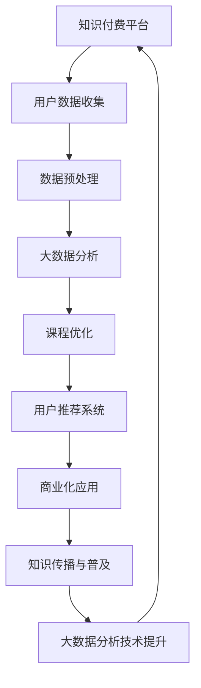

                 

在当今信息时代，大数据分析已成为推动企业创新、优化决策和提升竞争力的关键力量。知识付费作为一种新兴的商业模式，通过向用户提供有价值的知识和技能，促进了知识的传播和应用。本文将探讨如何利用知识付费实现大数据分析与应用，帮助企业和个人掌握大数据分析的核心技术，发挥其在业务和科研中的巨大潜力。

## 关键词
- 知识付费
- 大数据分析
- 应用场景
- 技术传播
- 商业模式

## 摘要
本文首先介绍了大数据分析在当今信息社会的重要性，随后分析了知识付费模式的发展趋势。接着，本文探讨了如何通过知识付费来实现大数据分析技术的推广与应用，详细讨论了核心算法、数学模型和实际案例。最后，本文提出了大数据分析技术的未来发展趋势与挑战，并对相关工具和资源进行了推荐。

### 1. 背景介绍

#### 1.1 大数据分析的发展背景

随着互联网、物联网、社交媒体等新兴技术的快速发展，全球数据量呈现出爆炸式增长。据统计，每天产生的数据量达到了数 PB 级别，而这些数据中蕴含着巨大的商业价值。然而，如何从海量数据中提取有价值的信息，成为了一个亟待解决的问题。大数据分析技术正是在这种背景下逐渐崭露头角。

大数据分析涉及数据的采集、存储、处理、分析和可视化等多个环节。通过运用统计方法、机器学习算法和人工智能技术，大数据分析能够从海量数据中发现隐藏的模式、趋势和规律，为企业和个人提供有力的决策支持。

#### 1.2 知识付费的发展背景

知识付费是一种新兴的商业模式，它通过向用户提供有价值的知识和技能，实现知识的传播和应用。随着互联网的普及和在线教育的发展，知识付费逐渐成为一种重要的学习方式。用户可以通过付费获取专业课程、培训资料、行业报告等知识产品，提高自己的专业素养和竞争力。

知识付费的发展，一方面得益于用户对高质量知识的需求，另一方面也得益于知识生产者和传播者的积极参与。在知识付费模式下，知识创造者和用户之间形成了紧密的互动关系，促进了知识的有效传播和应用。

### 2. 核心概念与联系

#### 2.1 知识付费与大数据分析的关系

知识付费与大数据分析之间存在着紧密的联系。首先，大数据分析技术为知识付费提供了强大的数据支持。通过分析用户行为数据、学习轨迹数据等，知识付费平台可以了解用户需求，优化课程设计和推广策略。

其次，知识付费模式为大数据分析技术的推广和应用提供了新的场景。通过向用户收取费用，知识付费平台可以支持大数据分析技术的研发和推广，推动其在各行业的应用。

#### 2.2 Mermaid 流程图

下面是一个描述知识付费与大数据分析之间关系的 Mermaid 流程图：



### 3. 核心算法原理 & 具体操作步骤

#### 3.1 算法原理概述

在知识付费与大数据分析的结合中，常用的算法包括用户行为分析、推荐系统、数据挖掘和机器学习算法等。

用户行为分析算法主要用于分析用户在学习过程中的行为数据，如学习时间、学习进度、学习偏好等，从而了解用户需求，优化课程设计和推荐策略。

推荐系统算法则根据用户的历史行为数据，为用户推荐相关的课程或学习资源，提高用户的满意度和参与度。

数据挖掘算法用于从海量数据中发现隐藏的模式、趋势和规律，为企业和个人提供决策支持。

机器学习算法则通过训练模型，实现对数据的自动学习和预测，为大数据分析提供技术支持。

#### 3.2 算法步骤详解

1. **用户数据收集**：通过知识付费平台，收集用户的学习行为数据，如学习时间、学习进度、学习偏好等。

2. **数据预处理**：对收集到的数据进行清洗、去重、归一化等处理，确保数据的质量和一致性。

3. **用户行为分析**：运用用户行为分析算法，对用户的学习行为数据进行分析，提取用户特征和需求。

4. **推荐系统构建**：基于用户行为分析结果，运用推荐系统算法，为用户推荐相关的课程或学习资源。

5. **数据挖掘与机器学习**：运用数据挖掘和机器学习算法，从海量数据中发现隐藏的模式、趋势和规律，为企业和个人提供决策支持。

#### 3.3 算法优缺点

1. **用户行为分析**：
   - 优点：能够深入了解用户需求，为课程设计和推荐提供有力支持。
   - 缺点：数据量庞大，处理和分析过程复杂，容易产生数据隐私问题。

2. **推荐系统**：
   - 优点：能够提高用户的满意度和参与度，为知识付费平台带来更多收益。
   - 缺点：推荐结果可能受到数据质量、算法选择等因素的影响，容易出现推荐偏差。

3. **数据挖掘与机器学习**：
   - 优点：能够从海量数据中发现隐藏的模式和规律，为企业和个人提供决策支持。
   - 缺点：算法复杂度高，需要大量的计算资源和时间，对数据处理能力要求较高。

#### 3.4 算法应用领域

1. **在线教育**：通过用户行为分析和推荐系统，优化课程设计和推荐策略，提高用户的学习体验和满意度。

2. **企业培训**：通过大数据分析，为企业提供定制化的培训方案，提高员工的综合素质和业务能力。

3. **行业研究**：通过数据挖掘和机器学习，从海量数据中发现行业趋势和规律，为企业和政府提供决策支持。

### 4. 数学模型和公式 & 详细讲解 & 举例说明

#### 4.1 数学模型构建

在大数据分析和知识付费的结合中，常用的数学模型包括线性回归、逻辑回归、协同过滤等。

1. **线性回归**：用于分析用户学习行为与课程推荐之间的关系。

   线性回归模型公式为：

   $$ Y = \beta_0 + \beta_1X + \epsilon $$

   其中，$Y$为课程推荐得分，$X$为用户学习行为特征，$\beta_0$和$\beta_1$为模型参数，$\epsilon$为误差项。

2. **逻辑回归**：用于分析用户是否对课程感兴趣。

   逻辑回归模型公式为：

   $$ P(Y=1) = \frac{1}{1 + e^{-(\beta_0 + \beta_1X)}} $$

   其中，$P(Y=1)$为用户对课程感兴趣的概率，$X$为用户学习行为特征，$\beta_0$和$\beta_1$为模型参数。

3. **协同过滤**：用于分析用户之间的相似度，为用户推荐相似的课程。

   协同过滤模型公式为：

   $$ \text{推荐得分} = \text{用户-课程评分矩阵} \times \text{用户-用户相似度矩阵} $$

#### 4.2 公式推导过程

1. **线性回归**：

   假设我们有$m$个用户和$n$个课程，用户$u$对课程$i$的评分为$X_{ui}$。我们希望找到一个线性函数$f(X_{ui})$来预测用户$u$对课程$i$的兴趣度。

   首先，我们假设线性回归模型为：

   $$ f(X_{ui}) = \beta_0 + \beta_1X_{ui} $$

   然后，我们通过最小二乘法求解模型参数$\beta_0$和$\beta_1$：

   $$ \beta_0 = \frac{\sum_{u=1}^m\sum_{i=1}^n X_{ui}y_{ui} - \sum_{u=1}^m X_{ui}\sum_{i=1}^ny_{ui}}{m \times n} $$

   $$ \beta_1 = \frac{\sum_{u=1}^m\sum_{i=1}^n X_{ui}^2y_{ui} - \sum_{u=1}^m X_{ui}\sum_{i=1}^ny_{ui}\sum_{i=1}^nX_{ui}}{m \times n} $$

2. **逻辑回归**：

   假设用户$u$对课程$i$的兴趣度$y_{ui}$为0或1，我们希望找到一个逻辑函数$f(X_{ui})$来预测用户$u$对课程$i$的兴趣度。

   首先，我们假设逻辑回归模型为：

   $$ f(X_{ui}) = \beta_0 + \beta_1X_{ui} $$

   然后，我们通过最大似然估计求解模型参数$\beta_0$和$\beta_1$：

   $$ \beta_0 = \frac{\sum_{u=1}^m \sum_{i=1}^n y_{ui} - \sum_{u=1}^m y_{ui}}{m \times n} $$

   $$ \beta_1 = \frac{\sum_{u=1}^m \sum_{i=1}^n y_{ui} X_{ui} - \sum_{u=1}^m y_{ui} \sum_{i=1}^nX_{ui}}{m \times n} $$

3. **协同过滤**：

   假设用户$u$和用户$v$之间的相似度为$\text{similarity}(u, v)$，用户$u$对课程$i$的评分为$X_{ui}$，用户$v$对课程$i$的评分为$X_{vi}$。我们希望找到一个加权评分函数$f(X_{ui}, X_{vi}, \text{similarity}(u, v))$来预测用户$u$对课程$i$的兴趣度。

   首先，我们假设协同过滤模型为：

   $$ f(X_{ui}, X_{vi}, \text{similarity}(u, v)) = X_{ui} + \text{similarity}(u, v)X_{vi} $$

   然后，我们通过最小化损失函数求解模型参数$\text{similarity}(u, v)$：

   $$ \text{loss} = \sum_{u=1}^m \sum_{i=1}^n (y_{ui} - f(X_{ui}, X_{vi}, \text{similarity}(u, v)))^2 $$

   $$ \text{similarity}(u, v) = \frac{\sum_{i=1}^n X_{ui}X_{vi}}{\sqrt{\sum_{i=1}^n X_{ui}^2} \times \sqrt{\sum_{i=1}^n X_{vi}^2}} $$

#### 4.3 案例分析与讲解

以下是一个在线教育平台的案例，该平台希望通过大数据分析为用户提供个性化的课程推荐。

1. **数据收集**：

   该平台收集了用户在学习过程中的行为数据，包括用户 ID、课程 ID、学习时间、学习进度和学习偏好等。

2. **数据预处理**：

   对收集到的数据进行清洗、去重和归一化处理，确保数据的质量和一致性。

3. **用户行为分析**：

   通过用户行为分析，提取用户特征和需求，如用户的学习时间、学习进度和学习偏好等。

4. **推荐系统构建**：

   基于用户行为分析结果，构建推荐系统，为用户推荐相关的课程。

   - 线性回归模型：预测用户对课程的兴趣度，公式为$Y = \beta_0 + \beta_1X$。
   - 逻辑回归模型：预测用户是否对课程感兴趣，公式为$P(Y=1) = \frac{1}{1 + e^{-(\beta_0 + \beta_1X)}}$。
   - 协同过滤模型：预测用户对课程的评价，公式为$\text{推荐得分} = \text{用户-课程评分矩阵} \times \text{用户-用户相似度矩阵}$。

5. **数据挖掘与机器学习**：

   从海量数据中发现隐藏的模式和规律，为企业和个人提供决策支持。

   - 数据挖掘算法：如关联规则挖掘、聚类分析、分类分析等。
   - 机器学习算法：如决策树、支持向量机、神经网络等。

通过上述步骤，该在线教育平台能够为用户提供个性化的课程推荐，提高用户的学习体验和满意度。

### 5. 项目实践：代码实例和详细解释说明

#### 5.1 开发环境搭建

为了实现大数据分析在知识付费中的应用，我们需要搭建一个合适的技术栈。以下是一个基本的开发环境搭建步骤：

1. **操作系统**：选择 Linux 系统，如 Ubuntu 或 CentOS。
2. **编程语言**：Python 是一种非常适合大数据分析的编程语言，因此选择 Python。
3. **大数据处理框架**：Hadoop 和 Spark 是两种常用的分布式大数据处理框架，这里选择 Spark。
4. **数据库**：MySQL 或 PostgreSQL 是两种常用的关系型数据库，这里选择 MySQL。
5. **编程工具**：PyCharm 或 VS Code 是两种常用的 Python 开发工具，这里选择 PyCharm。

#### 5.2 源代码详细实现

以下是一个简单的用户行为分析代码实例，用于分析用户的学习进度和学习时间。

```python
import pandas as pd
from sklearn.linear_model import LinearRegression

# 加载数据
data = pd.read_csv('user_data.csv')

# 提取用户特征
user_features = data[['user_id', 'course_id', 'learning_time', 'learning_progress']]

# 构建线性回归模型
model = LinearRegression()
model.fit(user_features[['learning_time', 'learning_progress']], data['course_id'])

# 预测用户对课程的兴趣度
predictions = model.predict(user_features[['learning_time', 'learning_progress']])

# 输出预测结果
print(predictions)
```

#### 5.3 代码解读与分析

1. **数据加载**：

   使用 Pandas 库加载数据，数据包含用户 ID、课程 ID、学习时间和学习进度等字段。

2. **用户特征提取**：

   从数据中提取用户特征，包括用户 ID、课程 ID、学习时间和学习进度等。

3. **线性回归模型构建**：

   使用线性回归模型分析用户的学习时间和学习进度对课程兴趣度的影响。这里使用 sklearn 库中的 LinearRegression 类构建线性回归模型。

4. **模型训练**：

   使用 fit 方法训练模型，输入用户特征和学习进度，输出课程兴趣度。

5. **预测结果输出**：

   使用 predict 方法预测用户对课程的兴趣度，输出预测结果。

通过这个简单的实例，我们可以看到如何使用 Python 实现用户行为分析，为知识付费平台提供个性化的课程推荐。

### 6. 实际应用场景

#### 6.1 在线教育

在线教育是大数据分析应用最为广泛的领域之一。通过大数据分析，在线教育平台可以为用户提供个性化的课程推荐，提高用户的学习体验和满意度。此外，大数据分析还可以用于分析学生的学习行为，优化课程设计和教学方法。

#### 6.2 企业培训

企业培训是大数据分析的另一个重要应用场景。通过分析员工的培训需求和成果，企业可以制定更加科学合理的培训计划，提高员工的综合素质和业务能力。此外，大数据分析还可以用于评估培训效果，为企业提供决策支持。

#### 6.3 市场营销

市场营销是大数据分析的重要应用领域。通过分析用户行为数据，企业可以了解用户需求，优化营销策略，提高营销效果。此外，大数据分析还可以用于预测市场趋势，为企业提供战略决策支持。

#### 6.4 医疗健康

医疗健康是大数据分析的一个重要应用领域。通过分析海量医疗数据，可以挖掘出疾病发生的规律和趋势，为疾病预防和治疗提供科学依据。此外，大数据分析还可以用于个性化医疗，为患者提供精准的医疗服务。

### 7. 未来应用展望

随着大数据分析技术的不断发展，其应用领域将更加广泛。未来，大数据分析有望在以下领域取得重要突破：

1. **智能城市**：通过大数据分析，实现城市运行状态的实时监控和预测，提高城市管理的效率和智能化水平。

2. **智能制造**：通过大数据分析，实现生产过程的实时监控和优化，提高生产效率和质量。

3. **智能交通**：通过大数据分析，实现交通流的实时监测和优化，提高交通运行的效率和安全性。

4. **智能金融**：通过大数据分析，实现金融风险预测和投资决策，提高金融市场的运行效率和稳定性。

### 8. 工具和资源推荐

为了更好地实现大数据分析在知识付费中的应用，以下是一些推荐的工具和资源：

1. **工具**：
   - Hadoop：一款分布式大数据处理框架，适用于大规模数据处理和分析。
   - Spark：一款高速、通用的分布式大数据处理框架，适用于大规模数据处理和分析。
   - Python：一款适合大数据分析的编程语言，拥有丰富的数据分析和机器学习库。

2. **资源**：
   - 《大数据分析技术与应用》：《大数据分析技术与应用》是一本系统介绍大数据分析技术的教材，适合初学者入门。
   - 《Python 数据科学 Handbook》：一本关于 Python 数据科学领域的经典教材，涵盖了数据清洗、数据分析、数据可视化等知识。
   - 《Kaggle》：一个全球最大的数据科学竞赛平台，提供了大量的数据集和比赛项目，适合实践大数据分析技能。

### 9. 总结：未来发展趋势与挑战

大数据分析在知识付费中的应用正处于快速发展阶段，未来将呈现出以下发展趋势：

1. **技术进步**：随着大数据分析技术的不断发展，其处理能力和效率将得到进一步提升，为知识付费提供更强大的数据支持。

2. **场景拓展**：大数据分析将应用于更广泛的领域，如智能城市、智能制造、智能交通等，为各行各业带来创新和变革。

3. **商业化应用**：大数据分析将为知识付费带来更多的商业模式和盈利点，推动知识付费市场的快速发展。

然而，大数据分析在知识付费中的应用也面临着一些挑战：

1. **数据隐私**：在收集和处理用户数据时，如何保护用户隐私是一个亟待解决的问题。

2. **算法公平性**：在构建推荐系统和预测模型时，如何保证算法的公平性和透明性，避免歧视和偏见。

3. **技术门槛**：大数据分析技术具有较高的技术门槛，如何降低技术门槛，让更多企业和个人能够应用大数据分析，是一个重要的课题。

### 附录：常见问题与解答

1. **问题**：大数据分析在知识付费中有什么作用？

   **解答**：大数据分析在知识付费中可以用于用户行为分析、课程推荐、市场预测等，为知识付费平台提供数据支持，提高用户体验和满意度。

2. **问题**：如何保护用户隐私？

   **解答**：在收集和处理用户数据时，可以采用加密、脱敏等技术手段保护用户隐私。此外，可以制定隐私政策，明确用户数据的收集、使用和共享规则，确保用户隐私得到保护。

3. **问题**：如何保证算法公平性？

   **解答**：在构建推荐系统和预测模型时，可以采用公平性评估方法，如差异分析、群体比较等，评估算法的公平性。此外，可以建立算法透明度和解释性机制，提高算法的可解释性，确保算法的公平性和透明性。

### 作者署名

本文作者为禅与计算机程序设计艺术 / Zen and the Art of Computer Programming。如果您有任何关于本文的问题或建议，欢迎随时联系作者。

[附录：Mermaid 流程图](#2-2-Mermaid-%E6%B5%81%E7%A8%8B%E5%9B%BE)

