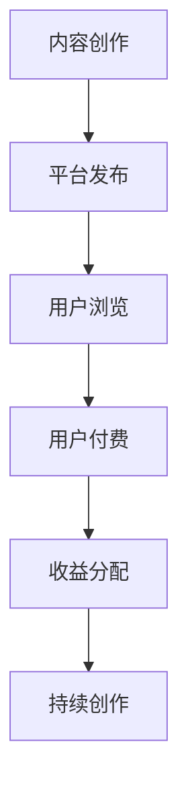

                 

关键词：知识付费、被动收入、内容创作、技术分享、商业变现

摘要：在数字化时代，知识付费成为了一种新型的商业模式。本文将探讨如何利用知识付费实现被动收入，通过技术分享、内容创作等手段，构建起一个可持续的商业生态。

## 1. 背景介绍

在互联网技术飞速发展的今天，信息获取变得越来越容易，知识的传播速度也大大加快。然而，随着信息的过载，用户对于高质量、有深度的内容需求变得尤为强烈。知识付费作为一种回应市场需求的商业模式，应运而生。

知识付费的本质是消费者为获取知识或技能而付费。这种模式改变了传统的教育方式，使得知识传播更加个性化和精准化。通过知识付费，内容创作者可以更好地实现个人价值，而消费者也能够更高效地获取所需的知识。

### 1.1 知识付费的发展历程

知识付费起源于20世纪末的在线教育。最早的在线教育平台主要是提供免费的公开课程，如Coursera、edX等。然而，随着用户需求的不断变化，平台逐渐推出了付费课程，以满足用户对高质量内容的需求。

21世纪初，知识付费市场开始迅速发展。知识付费平台如知乎、得到、喜马拉雅等相继涌现，涵盖了各个领域的内容，如专业知识、技能培训、人文历史等。这些平台通过提供付费内容，实现了商业模式的创新。

### 1.2 被动收入的定义与价值

被动收入是指在不直接参与运营的情况下，通过某种方式获取的持续性的经济回报。相比主动收入，被动收入具有时间自由度更高、风险更低等特点。在知识付费领域，通过内容创作和技术分享，可以构建起一种被动收入的模式。

被动收入的价值在于：

1. **时间自由**：创作者可以在创作内容的过程中，实现时间上的自由安排，无需时刻在线。
2. **持续收益**：一旦内容创作完成并上线，就可以持续获得收益，无需额外的劳动投入。
3. **风险分散**：被动收入来源多样，可以分散风险，降低因某个收入渠道出现问题而带来的影响。

## 2. 核心概念与联系

### 2.1 知识付费的核心概念

知识付费的核心概念包括内容创作、用户需求、平台运营等。

**内容创作**：内容创作者通过提供高质量、有深度的内容，满足用户的需求。

**用户需求**：用户对知识的需求是知识付费的根本动力。用户的需求多种多样，包括专业知识、技能培训、兴趣爱好等。

**平台运营**：知识付费平台作为连接创作者和用户的桥梁，提供内容发布、用户管理、收益分配等运营服务。

### 2.2 被动收入的核心概念

被动收入的核心概念包括内容价值、平台机制、用户粘性等。

**内容价值**：内容的价值决定了用户是否愿意为其付费。高质量的内容可以吸引更多用户，从而提高被动收入。

**平台机制**：知识付费平台的机制包括内容审核、用户评价、收益分配等，这些机制保证了内容的品质和用户的权益。

**用户粘性**：用户粘性是维持被动收入的关键。通过提供优质内容，提升用户体验，可以增加用户粘性。

### 2.3 Mermaid 流程图

以下是一个简单的 Mermaid 流程图，展示了知识付费实现被动收入的过程：

## 3. 核心算法原理 & 具体操作步骤

### 3.1 算法原理概述

知识付费实现被动收入的算法原理主要包括以下几个方面：

1. **内容价值评估**：通过算法对内容的价值进行评估，筛选出高质量的内容。
2. **用户需求分析**：通过算法分析用户的需求，提供个性化的内容推荐。
3. **收益分配机制**：通过算法实现创作者的收益分配，激励创作者持续创作高质量内容。

### 3.2 算法步骤详解

1. **内容价值评估**：首先，平台会通过算法对内容的价值进行初步评估。评估指标包括内容的质量、内容的吸引力、内容的独特性等。通过这些指标，可以初步筛选出高质量的内容。

2. **用户需求分析**：接下来，平台会通过算法分析用户的需求。算法会根据用户的浏览历史、搜索记录、购买行为等数据，生成用户的兴趣模型。基于用户的兴趣模型，平台可以推荐个性化的内容。

3. **收益分配机制**：最后，平台会通过算法实现创作者的收益分配。算法会根据内容的曝光量、用户的付费意愿等数据，计算出创作者的收益。这种机制可以激励创作者持续创作高质量的内容。

### 3.3 算法优缺点

**优点**：

1. **提高内容质量**：通过算法评估内容的价值，可以提高内容的质量，满足用户的需求。
2. **个性化推荐**：通过算法分析用户的需求，可以提供个性化的内容推荐，提升用户体验。
3. **激励创作者**：通过算法实现收益分配，可以激励创作者持续创作高质量的内容。

**缺点**：

1. **算法偏见**：算法可能会存在偏见，导致某些内容被低估或高估。
2. **用户隐私**：算法在分析用户需求时，可能会涉及用户的隐私数据，需要保证用户数据的安全。

### 3.4 算法应用领域

算法在知识付费领域的应用非常广泛，包括在线教育、技能培训、专业咨询等。通过算法的应用，可以大大提升内容的价值和用户体验。

## 4. 数学模型和公式 & 详细讲解 & 举例说明

### 4.1 数学模型构建

在知识付费中，我们可以构建以下数学模型：

1. **用户价值模型**：用户价值 = 内容质量 × 用户需求
2. **收益分配模型**：收益 = 曝光量 × 用户付费意愿

### 4.2 公式推导过程

1. **用户价值模型**：假设用户价值为V，内容质量为Q，用户需求为D，则用户价值模型可以表示为：

   V = Q × D

   其中，Q和D都是0到1之间的数值，表示内容的质量和用户的需

