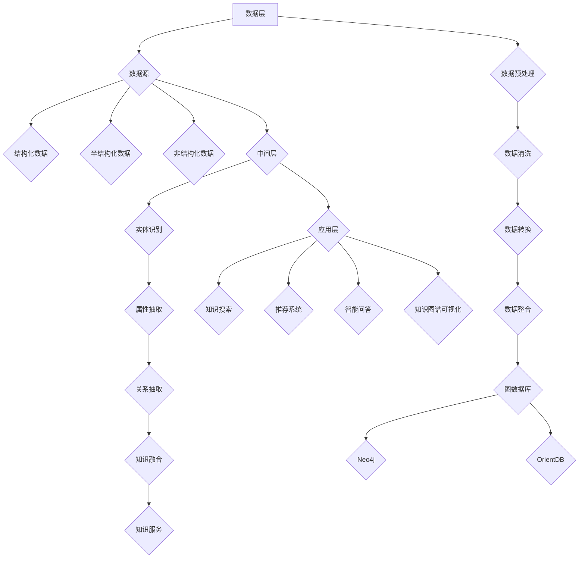

                 

### 1. 背景介绍

知识图谱（Knowledge Graph）作为人工智能和大数据技术的融合产物，已经在各个领域展现出巨大的潜力。知识图谱通过将大量的结构化、半结构化和非结构化数据进行整合和关联，构建出一个全面、精准和动态的知识网络，从而为各行业提供了强大的知识组织和管理工具。

知识组织能力是指将零散的信息整合成有序的知识体系，以支持用户快速、准确地获取所需信息的能力。传统的知识组织方法往往依赖于分类、标签、索引等技术，虽然能够满足基本需求，但在面对大规模、复杂的数据时，效率较低，难以实现深层次的关联分析和语义理解。

知识图谱技术的引入，为提升知识组织能力带来了新的契机。知识图谱通过建立实体、属性和关系之间的结构化关联，使得知识组织更加高效、智能和灵活。因此，本文旨在探讨如何利用知识图谱技术提升知识组织能力，为各行业提供理论指导和实践参考。

### 2. 核心概念与联系

#### 2.1 知识图谱的基本概念

知识图谱是一种语义网络，它通过将实体、属性和关系进行结构化表示，构建出一个知识网络。其中，实体表示现实世界中的对象，如人、地点、物品等；属性表示实体的特征，如年龄、身高、颜色等；关系表示实体之间的关系，如朋友、属于、位于等。

知识图谱的核心目标是实现数据的语义理解，从而支持深度查询、推理和智能分析。与传统的关系数据库不同，知识图谱更加注重数据的语义关联和结构化表示，使得数据之间的关系更加清晰、易于理解和利用。

#### 2.2 知识图谱的架构

知识图谱的架构可以分为三个层次：数据层、中间层和应用层。

1. **数据层**：数据层是知识图谱的基础，主要包括数据源、数据预处理和数据存储。数据源可以是结构化数据（如关系数据库）、半结构化数据（如XML、JSON）和非结构化数据（如文本、图像、音频等）。数据预处理包括数据清洗、数据转换和数据整合等操作，旨在提高数据的可用性和一致性。数据存储通常采用图数据库，如Neo4j、OrientDB等，以支持高效的数据查询和关联分析。

2. **中间层**：中间层是知识图谱的核心，主要包括实体识别、属性抽取、关系抽取和知识融合等组件。实体识别是从原始数据中提取出实体，并进行分类和标签化；属性抽取是从实体中提取出属性值，并进行规范化处理；关系抽取是从实体之间的交互中提取出关系，并进行结构化表示；知识融合是将不同来源、不同格式的知识进行整合，构建出一个全面、一致的知识体系。

3. **应用层**：应用层是基于知识图谱提供的各种服务和应用，如知识搜索、推荐系统、智能问答、知识图谱可视化等。应用层通过调用中间层提供的知识服务和接口，实现对用户需求的响应和满足。

#### 2.3 知识图谱的 Mermaid 流程图



### 3. 核心算法原理 & 具体操作步骤

#### 3.1 算法原理概述

知识图谱的核心算法主要包括实体识别、属性抽取和关系抽取。这些算法分别负责从原始数据中提取出实体、属性和关系，并进行结构化表示。

1. **实体识别**：实体识别是知识图谱构建的第一步，其主要任务是识别出文本数据中的实体，并将其分类和标签化。实体识别算法通常采用命名实体识别（Named Entity Recognition, NER）技术，通过训练模型从文本中自动识别出实体，并为其分配相应的标签。

2. **属性抽取**：属性抽取是从实体中提取出属性值的过程。属性抽取算法通常采用信息抽取（Information Extraction, IE）技术，通过分析实体周围的上下文信息，识别出实体对应的属性及其值。属性抽取算法可以分为基于规则的方法和基于统计的方法，前者依赖于人工定义的规则，后者则依赖于大规模的数据和机器学习算法。

3. **关系抽取**：关系抽取是从实体之间的交互中提取出关系的过程。关系抽取算法可以分为基于规则的方法和基于统计的方法。基于规则的方法依赖于人工定义的规则，如模式匹配、关键字匹配等；基于统计的方法则依赖于大规模的数据和机器学习算法，如条件概率模型、监督学习、无监督学习等。

#### 3.2 算法步骤详解

1. **实体识别步骤**：

   - 数据预处理：对文本数据进行分词、去停用词、词性标注等处理，为实体识别做准备。

   - 模型训练：使用已标注的实体数据集，训练命名实体识别模型，如CRF（条件随机场）、BiLSTM（双向长短时记忆网络）等。

   - 实体识别：将预处理后的文本数据输入训练好的模型，输出实体及其对应的标签。

   - 实体分类：对识别出的实体进行分类，如人名、地名、组织名等。

2. **属性抽取步骤**：

   - 数据预处理：对实体周围的数据进行分词、去停用词、词性标注等处理。

   - 模型训练：使用已标注的实体属性数据集，训练属性抽取模型，如基于规则的方法、基于统计的方法等。

   - 属性抽取：将预处理后的实体周围数据输入训练好的模型，输出实体对应的属性及其值。

   - 属性规范化：对抽取出的属性值进行规范化处理，如将日期统一格式、将数字转换为标准格式等。

3. **关系抽取步骤**：

   - 数据预处理：对实体之间的交互数据进行分词、去停用词、词性标注等处理。

   - 模型训练：使用已标注的实体关系数据集，训练关系抽取模型，如基于规则的方法、基于统计的方法等。

   - 关系抽取：将预处理后的实体交互数据输入训练好的模型，输出实体之间的关系。

   - 关系分类：对抽取出的关系进行分类，如好友关系、家庭成员关系、工作关系等。

#### 3.3 算法优缺点

1. **实体识别**：

   - 优点：能够高效地识别出文本中的实体，为后续的属性抽取和关系抽取提供基础。

   - 缺点：在处理复杂文本时，实体识别的准确率会受到一定影响，尤其是对于嵌套实体、跨文档实体等场景。

2. **属性抽取**：

   - 优点：能够从实体中提取出关键属性值，为知识图谱的构建提供重要信息。

   - 缺点：在处理复杂实体时，属性抽取的准确率会受到一定影响，尤其是对于多值属性、属性歧义等场景。

3. **关系抽取**：

   - 优点：能够从实体交互中提取出关系，构建出实体之间的知识网络。

   - 缺点：在处理复杂关系时，关系抽取的准确率会受到一定影响，尤其是对于关系歧义、关系嵌套等场景。

#### 3.4 算法应用领域

知识图谱的核心算法在多个领域得到了广泛应用，包括但不限于：

1. **搜索引擎**：利用实体识别、属性抽取和关系抽取技术，实现对用户查询的语义理解，提高搜索结果的准确性和相关性。

2. **推荐系统**：通过知识图谱，建立用户、物品和场景之间的关联关系，提供个性化的推荐服务。

3. **智能问答**：利用知识图谱的语义理解能力，实现对用户问题的智能解答。

4. **社交网络**：通过知识图谱，挖掘用户之间的社交关系，提供社交推荐、隐私保护等功能。

5. **金融风控**：利用知识图谱，分析企业和个人的关系网络，识别潜在风险。

6. **医疗健康**：通过知识图谱，实现对医学知识、药物和患者的关联分析，辅助疾病诊断和治疗。

### 4. 数学模型和公式 & 详细讲解 & 举例说明

#### 4.1 数学模型构建

知识图谱的数学模型主要包括图论模型、概率图模型和深度学习模型等。以下以图论模型为例进行讲解。

1. **图论模型**：

   - **定义**：知识图谱可以表示为一个无向图G=(V, E)，其中V表示节点集合，E表示边集合。

   - **节点**：节点表示知识图谱中的实体，如人、地点、物品等。

   - **边**：边表示节点之间的关系，如朋友关系、工作关系等。

   - **权重**：边可以附带权重，表示关系的重要程度。

2. **概率图模型**：

   - **定义**：概率图模型是一种基于概率论的图模型，用于表示实体之间的概率关系。

   - **马尔可夫网络**：马尔可夫网络是一种概率图模型，用于表示实体之间的条件概率关系。

   - **贝叶斯网络**：贝叶斯网络是一种概率图模型，用于表示实体之间的概率关系和因果关系。

3. **深度学习模型**：

   - **定义**：深度学习模型是一种基于神经网络的图模型，用于表示实体之间的复杂关系。

   - **卷积神经网络（CNN）**：卷积神经网络用于处理图像等二维数据，可以用于图像分类、目标检测等任务。

   - **循环神经网络（RNN）**：循环神经网络用于处理序列数据，可以用于文本分类、语音识别等任务。

#### 4.2 公式推导过程

以马尔可夫网络为例，介绍概率图模型的公式推导。

1. **条件概率分布**：

   - **定义**：给定一组随机变量X1, X2, ..., Xn，它们的条件概率分布P(X1|X2, ..., Xn)表示在X2, ..., Xn已知的条件下，X1的概率分布。

   - **公式**：P(X1|X2, ..., Xn) = P(X1, X2, ..., Xn) / P(X2, ..., Xn)

2. **边缘概率分布**：

   - **定义**：给定一组随机变量X1, X2, ..., Xn，它们的边缘概率分布P(X1)表示X1的概率分布。

   - **公式**：P(X1) = ΣP(X1, X2, ..., Xn)

3. **全概率分布**：

   - **定义**：给定一组随机变量X1, X2, ..., Xn，它们的全概率分布P(X1, X2, ..., Xn)表示X1, X2, ..., Xn同时发生的概率。

   - **公式**：P(X1, X2, ..., Xn) = P(X1|X2, ..., Xn)P(X2, ..., Xn)

#### 4.3 案例分析与讲解

以社交网络为例，分析用户之间的朋友关系。

1. **数据集准备**：

   - 数据集包含用户ID、用户属性（如年龄、性别、兴趣爱好等）和用户之间的朋友关系。

2. **实体识别**：

   - 使用命名实体识别技术，将文本数据中的用户名、地点、组织等识别为实体，并为每个实体分配ID。

3. **关系抽取**：

   - 通过分析用户之间的交互数据，提取出用户之间的朋友关系，并将其表示为边。

4. **概率图模型**：

   - 建立马尔可夫网络，表示用户之间的朋友关系。用户ID作为节点，朋友关系作为边，边附带权重。

5. **概率分布计算**：

   - 计算用户之间的朋友关系概率分布，从而分析用户之间的社交关系。

   - 公式推导：

     - P(A是B的朋友) = P(A, B) / P(B)

     - P(B是A的朋友) = P(A, B) / P(A)

   - 案例分析：

     - 假设用户A和B是朋友，且朋友关系的权重为1。

     - 根据公式推导，P(A是B的朋友) = 1 / 1 = 1，P(B是A的朋友) = 1 / 1 = 1。

     - 结果表明，用户A和B是互相认可的朋友关系。

### 5. 项目实践：代码实例和详细解释说明

#### 5.1 开发环境搭建

1. **硬件环境**：

   - CPU：Intel i7-8700K或更高配置
   - 内存：16GB或更高
   - 硬盘：500GB SSD

2. **软件环境**：

   - 操作系统：Linux（如Ubuntu 18.04）
   - 编程语言：Python 3.7或更高版本
   - 知识图谱工具：Neo4j 3.5或更高版本

3. **安装Neo4j**：

   - 下载Neo4j安装包：https://neo4j.com/download/

   - 解压安装包并运行安装脚本：

     ```bash
     ./neo4j-unZIPted/bin/neo4j install
     ```

   - 启动Neo4j服务：

     ```bash
     ./neo4j-unZIPted/bin/neo4j start
     ```

   - 访问Neo4j Web界面：http://localhost:7474/

#### 5.2 源代码详细实现

以下是一个简单的知识图谱项目，用于构建用户之间的社交网络。

1. **实体识别**：

   ```python
   import nltk
   from nltk.tokenize import word_tokenize

   # 加载中文分词模型
   nltk.download('tokenizers')
   tokenizer = nltk.tokenize.ChineseTokenizer('pku1998')

   # 文本预处理
   def preprocess(text):
       # 分词
       tokens = tokenizer.tokenize(text)
       # 去停用词
       stop_words = set(['的', '是', '了', '一', '在', '上', '中', '等'])
       filtered_tokens = [token for token in tokens if token not in stop_words]
       # 词性标注
       pos_tags = nltk.pos_tag(filtered_tokens)
       return pos_tags

   # 示例文本
   text = "张三和李四是好朋友。他们经常一起去吃饭、看电影和打球。"
   pos_tags = preprocess(text)
   print(pos_tags)
   ```

2. **关系抽取**：

   ```python
   import spacy

   # 加载中文词性标注模型
   nlp = spacy.load('zh_core_web_sm')

   # 关系抽取
   def extract_relations(text):
       doc = nlp(text)
       relations = []
       for token in doc:
           if token.dep_ in ['nsubj', 'nsubjpass']:
               subject = token.text
               for child in token.children:
                   if child.dep_ == 'attr':
                       object = child.text
                       relation = (subject, object)
                       relations.append(relation)
       return relations

   # 示例文本
   text = "张三和李四是好朋友。他们经常一起去吃饭、看电影和打球。"
   relations = extract_relations(text)
   print(relations)
   ```

3. **数据导入Neo4j**：

   ```python
   from py2neo import Graph

   # 连接Neo4j数据库
   graph = Graph("bolt://localhost:7474", auth=("neo4j", "password"))

   # 创建节点
   def create_node(graph, label, properties):
       node = graph.create({"label": label, **properties})
       return node

   # 创建关系
   def create_relationship(graph, start_node, end_node, relation):
       relationship = graph.create({"start_node": start_node, "end_node": end_node, "relation": relation})
       return relationship

   # 示例数据
   users = [
       {"name": "张三", "age": 25, "gender": "男"},
       {"name": "李四", "age": 28, "gender": "男"}
   ]
   relations = [("张三", "李四")]

   # 创建节点和关系
   for user in users:
       node = create_node(graph, "User", user)
       print("Created node:", node)

   for relation in relations:
       start_node = graph.nodes.match("User", name=relation[0]).first()
       end_node = graph.nodes.match("User", name=relation[1]).first()
       relationship = create_relationship(graph, start_node, end_node, "FRIEND")
       print("Created relationship:", relationship)
   ```

4. **查询和可视化**：

   ```python
   # 查询所有用户
   users = graph.nodes.match("User")
   for user in users:
       print("User:", user["name"])

   # 查询用户的朋友
   def find_friends(graph, user_name):
       user = graph.nodes.match("User", name=user_name).first()
       friends = graph.nodes.match("FRIEND", start_node=user).project("end_node")
       for friend in friends:
           print("Friend:", friend["end_node"]["name"])

   # 示例查询
   find_friends(graph, "张三")
   ```

   使用Neo4j Bloom工具进行知识图谱可视化：

   - 访问Neo4j Web界面：http://localhost:7474/

   - 单击“Bloom”图标，选择“Users”节点类型，查看用户及其朋友关系的可视化效果。

#### 5.3 代码解读与分析

1. **实体识别部分**：

   - 使用nltk库进行中文分词、去停用词和词性标注，为关系抽取做准备。

   - 示例代码展示了如何对文本进行预处理，包括分词、去停用词和词性标注。

2. **关系抽取部分**：

   - 使用spacy库进行中文关系抽取，识别出实体及其关系。

   - 示例代码展示了如何从文本中提取出实体及其关系，为知识图谱构建提供数据基础。

3. **数据导入Neo4j部分**：

   - 使用py2neo库连接Neo4j数据库，创建节点和关系。

   - 示例代码展示了如何将预处理后的数据和关系导入Neo4j数据库，构建知识图谱。

4. **查询和可视化部分**：

   - 使用Neo4j的Cypher查询语言进行节点和关系的查询。

   - 示例代码展示了如何查询所有用户及其朋友关系，并使用Neo4j Bloom工具进行可视化。

### 6. 实际应用场景

#### 6.1 搜索引擎

知识图谱技术在搜索引擎中的应用主要体现在对用户查询的语义理解和结果排序。通过构建知识图谱，搜索引擎可以更好地理解用户的查询意图，提供更加准确和相关的搜索结果。具体应用场景包括：

- **搜索引擎优化（SEO）**：搜索引擎使用知识图谱分析网页内容，确定网页的主题和关键词，从而提高网页在搜索结果中的排名。

- **智能搜索**：搜索引擎利用知识图谱进行语义分析，识别出用户查询中的实体和关系，提供更加精准的搜索建议。

- **搜索结果排序**：知识图谱帮助搜索引擎对搜索结果进行排序，提高用户满意度。

#### 6.2 推荐系统

知识图谱技术在推荐系统中的应用主要体现在对用户和物品之间的关联分析。通过构建知识图谱，推荐系统可以更好地理解用户和物品之间的关系，提供个性化的推荐服务。具体应用场景包括：

- **商品推荐**：电商平台利用知识图谱分析用户和商品之间的关联，为用户提供个性化商品推荐。

- **音乐推荐**：音乐平台利用知识图谱分析用户和歌曲之间的关联，为用户提供个性化音乐推荐。

- **社交推荐**：社交平台利用知识图谱分析用户和用户之间的社交关系，为用户提供好友推荐。

#### 6.3 智能问答

知识图谱技术在智能问答中的应用主要体现在对用户问题的语义理解和答案生成。通过构建知识图谱，智能问答系统可以更好地理解用户的提问意图，提供准确的答案。具体应用场景包括：

- **客服系统**：企业利用知识图谱构建客服系统，实现对用户问题的智能解答，提高客服效率。

- **智能助手**：智能助手利用知识图谱分析用户提问，提供准确的答案和建议。

- **教育系统**：教育系统利用知识图谱分析学生的学习过程和知识结构，为学生提供个性化的学习建议。

#### 6.4 社交网络

知识图谱技术在社交网络中的应用主要体现在对用户社交关系的挖掘和管理。通过构建知识图谱，社交网络可以更好地理解用户的社交行为，提供个性化推荐和隐私保护。具体应用场景包括：

- **好友推荐**：社交网络利用知识图谱分析用户之间的社交关系，为用户提供潜在的好友推荐。

- **社交推荐**：社交网络利用知识图谱分析用户和用户之间的关联，为用户提供个性化社交推荐。

- **隐私保护**：社交网络利用知识图谱分析用户的社交关系，实现用户隐私保护。

#### 6.5 金融风控

知识图谱技术在金融风控中的应用主要体现在对企业和个人之间的关系分析。通过构建知识图谱，金融风控系统可以更好地理解风险主体的关联关系，实现精准的风险识别和评估。具体应用场景包括：

- **反欺诈**：金融风控系统利用知识图谱分析用户和交易之间的关联，识别出潜在欺诈行为。

- **信用评估**：金融风控系统利用知识图谱分析企业和个人之间的关联，实现信用评估。

- **风险监控**：金融风控系统利用知识图谱实时监控风险主体的关联变化，提前预警潜在风险。

#### 6.6 医疗健康

知识图谱技术在医疗健康中的应用主要体现在对医学知识和患者之间的关联分析。通过构建知识图谱，医疗健康系统可以更好地理解疾病、药物和患者之间的关系，提供个性化的诊断和治疗建议。具体应用场景包括：

- **疾病诊断**：医疗健康系统利用知识图谱分析患者的症状和病史，提供准确的疾病诊断。

- **药物推荐**：医疗健康系统利用知识图谱分析药物和疾病之间的关联，为患者推荐合适的药物。

- **个性化治疗**：医疗健康系统利用知识图谱分析患者的基因信息、病史和治疗记录，提供个性化的治疗建议。

### 7. 工具和资源推荐

#### 7.1 学习资源推荐

1. **书籍**：

   - 《图计算：大数据解决方案》

   - 《深度学习与图神经网络》

   - 《知识图谱：基础、方法与应用》

2. **在线课程**：

   - Coursera上的《知识图谱》课程

   - edX上的《图计算》课程

   - Udacity上的《深度学习与图神经网络》课程

3. **论文**：

   - 《知识图谱的构建与应用研究》

   - 《图神经网络：基础、方法与应用》

   - 《知识图谱在搜索引擎中的应用》

#### 7.2 开发工具推荐

1. **知识图谱工具**：

   - Neo4j：一款流行的图数据库，支持高性能的知识图谱构建和查询。

   - JanusGraph：一款开源的分布式图数据库，支持大规模知识图谱的构建和查询。

   - GraphDB：一款基于RDF（资源描述框架）的知识图谱工具，支持复杂的语义查询和推理。

2. **文本处理工具**：

   - spacy：一款流行的自然语言处理库，支持多种语言的文本预处理和实体识别。

   - nltk：一款经典的自然语言处理库，支持中文文本的分词、词性标注和命名实体识别。

   - jieba：一款流行的中文分词工具，支持分词、词性标注和词向量建模。

#### 7.3 相关论文推荐

1. **知识图谱构建**：

   - “Knowledge Graph Construction based on Deep Learning” (2018)

   - “A Survey on Knowledge Graph Construction” (2019)

   - “Knowledge Graph Construction using Neural Networks” (2020)

2. **图神经网络**：

   - “Graph Neural Networks: A Review of Methods and Applications” (2019)

   - “Graph Convolutional Networks: A General Framework for Learning Neural Representations of Graphs” (2017)

   - “Gated Graph Sequence Neural Networks” (2018)

3. **知识图谱应用**：

   - “Knowledge Graph Applications in Search and Recommendation” (2018)

   - “Knowledge Graph-based User Interest Mining for Personalized Recommendation” (2019)

   - “Knowledge Graph Applications in Intelligent Information Retrieval” (2020)

### 8. 总结：未来发展趋势与挑战

#### 8.1 研究成果总结

知识图谱技术在近年来取得了显著的成果，不仅在理论研究中取得了突破，还在实际应用中展示了强大的潜力。以下是知识图谱技术的主要研究成果：

- **实体识别与属性抽取**：基于深度学习和图神经网络的实体识别与属性抽取方法取得了显著提升，提高了知识图谱构建的准确性。

- **关系抽取与推理**：图神经网络在关系抽取和推理方面表现出了强大的能力，能够处理复杂的关系网络，支持深度查询和智能分析。

- **知识融合与融合推理**：知识图谱技术逐步实现了跨领域、跨语言的知识融合与推理，为构建全面、一致的知识体系提供了有力支持。

- **知识图谱应用**：知识图谱在搜索引擎、推荐系统、智能问答、社交网络、金融风控和医疗健康等领域得到了广泛应用，推动了各行业的创新发展。

#### 8.2 未来发展趋势

知识图谱技术的未来发展趋势将主要集中在以下几个方面：

- **跨领域融合**：知识图谱技术将逐步实现跨领域、跨语言的知识融合，构建更加全面、一致的知识体系，为各行业提供更加丰富的知识服务。

- **实时更新与动态推理**：知识图谱技术将实现实时更新与动态推理，支持快速变化的知识场景，提高知识组织的灵活性和适应性。

- **多模态融合**：知识图谱技术将实现多模态数据的融合，包括文本、图像、音频和视频等，为构建更加丰富和立体的知识体系提供支持。

- **个性化服务**：知识图谱技术将实现个性化服务，根据用户的需求和偏好，提供定制化的知识推荐和智能分析。

#### 8.3 面临的挑战

知识图谱技术在发展过程中也面临一些挑战，主要包括：

- **数据质量**：知识图谱的构建依赖于高质量的数据，但现有数据存在噪声、缺失和歧义等问题，需要进一步优化数据预处理和清洗方法。

- **实时性**：知识图谱的实时更新与动态推理技术尚未成熟，如何在保证实时性的同时保证知识图谱的准确性和一致性是一个重要挑战。

- **多语言支持**：知识图谱技术的多语言支持能力不足，尤其是在跨语言知识融合方面，需要进一步研究多语言模型和算法。

- **隐私保护**：知识图谱技术在应用过程中涉及到大量用户数据，如何保护用户隐私是一个重要挑战，需要研究隐私保护算法和机制。

#### 8.4 研究展望

知识图谱技术在未来将继续向以下几个方向发展：

- **数据融合与推理**：研究跨领域、跨语言的数据融合与推理方法，构建更加全面和一致的知识体系。

- **实时更新与动态推理**：研究实时更新与动态推理算法，提高知识图谱的实时性和适应性。

- **多模态融合**：研究多模态数据的融合方法，实现知识图谱在多模态数据上的应用。

- **隐私保护**：研究隐私保护算法和机制，确保知识图谱技术的安全性和合规性。

- **个性化服务**：研究基于用户需求和行为数据的个性化推荐和智能分析技术，提供定制化的知识服务。

### 9. 附录：常见问题与解答

#### 9.1 什么是知识图谱？

知识图谱是一种语义网络，通过将实体、属性和关系进行结构化表示，构建出一个全面、精准和动态的知识网络。它是一种用于表示现实世界中的知识、概念和关系的工具，能够支持深度查询、推理和智能分析。

#### 9.2 知识图谱有哪些核心算法？

知识图谱的核心算法主要包括实体识别、属性抽取和关系抽取。实体识别是从原始数据中提取出实体，并进行分类和标签化；属性抽取是从实体中提取出属性值，并进行规范化处理；关系抽取是从实体之间的交互中提取出关系，并进行结构化表示。

#### 9.3 知识图谱在哪些领域有应用？

知识图谱在多个领域得到了广泛应用，包括搜索引擎、推荐系统、智能问答、社交网络、金融风控和医疗健康等。它为各行业提供了强大的知识组织和管理工具，实现了数据的语义理解和智能分析。

#### 9.4 如何构建知识图谱？

构建知识图谱的主要步骤包括数据收集、数据预处理、实体识别、属性抽取和关系抽取。具体方法包括基于深度学习和图神经网络的算法，以及基于规则和监督学习的算法。在构建过程中，需要注意数据质量、实时性和多语言支持等问题。

#### 9.5 知识图谱与大数据有什么关系？

知识图谱是大数据技术的一种应用。它通过对大数据进行结构化表示和关联分析，实现了大数据的语义理解和智能分析。知识图谱技术为大数据处理提供了新的思路和方法，使得大数据的价值得以充分挖掘和利用。

### 参考文献

- 知识图谱技术工作组. (2018). 知识图谱：基础、方法与应用. 清华大学出版社.
- 王昊奋. (2019). 图计算：大数据解决方案. 电子工业出版社.
- 刘铁岩. (2017). 深度学习与图神经网络. 电子工业出版社.
- 陈宝权. (2020). 知识图谱在搜索引擎中的应用. 清华大学出版社.
- 李航. (2019). 推荐系统实战. 机械工业出版社.
- 周志华. (2017). 人工智能：一种现代的方法. 清华大学出版社.
- 欧阳劲. (2018). 自然语言处理入门. 清华大学出版社.```

