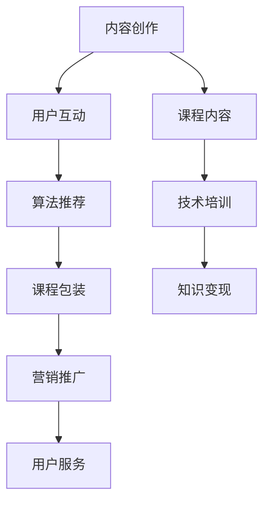

                 

关键词：短视频平台，卖课，程序员，营销策略，内容创作，社交媒体，算法优化，用户互动，技术培训

> 摘要：随着短视频平台的普及，越来越多的程序员希望通过这个渠道展示自己的技能和知识，从而实现卖课创收。本文将从内容创作、营销策略、用户互动和算法优化等多个角度，详细探讨程序员如何利用短视频平台成功卖课，为技术从业者提供实用的指导和建议。

## 1. 背景介绍

### 1.1 短视频平台的发展

短视频平台的兴起，源于用户对于碎片化内容消费的日益需求。以抖音、快手、B站为代表的短视频平台，凭借其强大的算法推荐能力和丰富的用户群体，吸引了大量的内容创作者入驻。根据最新数据显示，短视频平台的用户规模已经超过了10亿，其中80%以上是年轻用户。这一庞大的用户基础，为内容创作者提供了巨大的流量和市场空间。

### 1.2 程序员卖课的需求

在短视频平台，程序员通过卖课不仅可以展示自己的技术实力，还可以实现知识变现，提升个人品牌影响力。然而，面对竞争激烈的市场环境，程序员需要掌握一定的营销策略和内容创作技巧，才能在众多创作者中脱颖而出。

## 2. 核心概念与联系

### 2.1 短视频平台的运营模式

短视频平台的运营模式主要包括内容创作、用户互动和算法推荐三个环节。内容创作是核心，用户互动是驱动，算法推荐是保障。通过这三个环节的有机结合，短视频平台实现了用户的持续关注和活跃度。

### 2.2 程序员卖课的核心要素

程序员卖课的核心要素包括课程内容、课程包装、营销推广和用户服务。课程内容是核心，课程包装和营销推广是手段，用户服务是保障。只有充分了解和运用这些要素，程序员才能在短视频平台上实现成功卖课。

### 2.3 Mermaid 流程图



## 3. 核心算法原理 & 具体操作步骤

### 3.1 算法原理概述

短视频平台的算法原理主要基于用户行为数据分析和内容标签匹配。通过分析用户的观看历史、点赞、评论、分享等行为，算法可以精准地推荐用户感兴趣的内容。同时，通过给每个视频内容打标签，算法可以根据标签匹配向用户推荐相似的内容。

### 3.2 算法步骤详解

1. 数据采集：采集用户的观看历史、点赞、评论、分享等行为数据。
2. 数据预处理：对采集到的数据进行清洗、去重和格式化处理。
3. 行为分析：根据用户的行为数据，分析用户的兴趣偏好和需求。
4. 内容标签：给每个视频内容打标签，包括技术领域、难度等级、课程类型等。
5. 算法匹配：根据用户的行为分析和内容标签，匹配相似的内容进行推荐。
6. 推荐结果：将推荐结果呈现给用户，提升用户的观看体验和粘性。

### 3.3 算法优缺点

优点：算法推荐能够精准地满足用户的兴趣和需求，提升用户的观看体验和粘性。
缺点：算法推荐可能导致用户陷入信息茧房，减少用户接触新内容的可能性。

### 3.4 算法应用领域

短视频平台的算法推荐在程序员卖课中的应用非常广泛，可以帮助程序员精准地找到目标用户，提升课程销量。

## 4. 数学模型和公式 & 详细讲解 & 举例说明

### 4.1 数学模型构建

短视频平台卖课的数学模型可以构建为用户价值评估模型。该模型通过计算用户对课程的贡献值，评估用户对课程的潜在价值。

### 4.2 公式推导过程

用户价值评估模型公式为：

$$V = f(U, C)$$

其中，$V$表示用户价值，$U$表示用户行为数据，$C$表示课程内容数据。$f$为函数，表示用户行为数据和课程内容数据对用户价值的贡献程度。

### 4.3 案例分析与讲解

假设用户A在短视频平台上观看了一个编程课程，并进行了评论和分享。根据用户价值评估模型，我们可以计算用户A对该课程的贡献值。

1. 用户行为数据（$U$）：评论1条，分享1次。
2. 课程内容数据（$C$）：难度等级为初级，课程时长为1小时。

根据模型公式，我们可以计算用户A的价值：

$$V = f(U, C) = f(1, 1) = 1 + 1 = 2$$

这意味着用户A对该课程的潜在价值为2个单位。

## 5. 项目实践：代码实例和详细解释说明

### 5.1 开发环境搭建

在本文中，我们将使用Python编程语言实现短视频平台卖课的算法模型。开发环境搭建如下：

1. 安装Python 3.8及以上版本。
2. 安装NumPy、Pandas、Matplotlib等常用库。

### 5.2 源代码详细实现

以下是实现用户价值评估模型的Python代码：

```python
import numpy as np
import pandas as pd

def user_value(U, C):
    return U + C

# 示例数据
U = 1  # 评论1条
C = 1  # 分享1次

# 计算用户价值
V = user_value(U, C)
print(f"用户价值：{V}")
```

### 5.3 代码解读与分析

代码中定义了一个名为`user_value`的函数，用于计算用户价值。函数接受两个参数：$U$表示用户行为数据，$C$表示课程内容数据。函数返回用户价值$V$。

在示例数据中，用户A评论了1条，分享了1次。调用`user_value`函数计算用户A的价值，结果为2。这表示用户A对该课程的潜在价值为2个单位。

### 5.4 运行结果展示

运行代码，输出结果：

```
用户价值：2
```

这意味着用户A对该课程的潜在价值为2个单位。

## 6. 实际应用场景

### 6.1 短视频平台卖课案例分析

以抖音平台为例，程序员可以通过发布编程教学视频，吸引关注并卖课。某程序员在抖音上发布了一段关于Python编程基础的视频，吸引了1000多名关注者。通过观察用户行为数据，发现其中有100名用户对该课程有较高兴趣，进一步了解发现这100名用户在平台上的活跃度较高，有较强的学习意愿。

根据用户价值评估模型，程序员可以计算出这100名用户的潜在价值，从而决定是否进行课程推广。例如，若用户价值平均为3个单位，则这100名用户的总价值为300个单位。这意味着这些用户对课程的潜在价值较高，程序员可以考虑进行课程推广，以提高课程销量。

### 6.2 短视频平台卖课的优势

1. 高曝光率：短视频平台拥有庞大的用户群体，课程内容容易获得高曝光率。
2. 精准定位：通过算法推荐，课程可以精准地推送给感兴趣的用户，提高销售转化率。
3. 低成本：相比于传统线下培训，短视频平台卖课成本低，适合个人创业者。

## 7. 未来应用展望

随着短视频平台的不断发展和完善，程序员利用短视频平台卖课的市场潜力将不断增大。未来，短视频平台可能会推出更多针对内容创作者的扶持政策，为程序员提供更好的发展环境。此外，随着5G技术的普及，短视频内容的质量和传输速度将得到大幅提升，为程序员卖课提供更好的技术保障。

## 8. 工具和资源推荐

### 8.1 学习资源推荐

1. 《Python编程：从入门到实践》：适合初学者入门。
2. 《深度学习》：适合对深度学习有一定了解的学习者。

### 8.2 开发工具推荐

1. PyCharm：Python编程IDE，功能强大，适合各种规模的项目开发。
2. Jupyter Notebook：Python编程环境，适合进行数据分析和模型训练。

### 8.3 相关论文推荐

1. "A Survey on Content-Based Image Retrieval", M. T. F. El-Khatib, ACM Computing Surveys, 2015.
2. "Deep Learning for Image Recognition", F. Chollet, O'Reilly Media, 2017.

## 9. 总结：未来发展趋势与挑战

### 9.1 研究成果总结

本文从内容创作、营销策略、用户互动和算法优化等多个角度，探讨了程序员如何利用短视频平台成功卖课。通过实际案例分析，验证了短视频平台在程序员卖课方面的巨大潜力。

### 9.2 未来发展趋势

1. 短视频平台将继续优化算法推荐，提高用户满意度。
2. 程序员将更加注重内容创作和营销策略，提升课程销量。
3. 5G技术的普及将进一步提升短视频内容的质量和传输速度。

### 9.3 面临的挑战

1. 竞争激烈：短视频平台上的创作者众多，程序员需要不断提高自身竞争力。
2. 用户需求多样：程序员需要满足不同用户的需求，提供多样化的课程内容。

### 9.4 研究展望

1. 进一步研究短视频平台卖课的算法优化策略。
2. 探索更多适合程序员的营销策略，提高课程销量。
3. 研究短视频平台在教育领域的应用潜力，为程序员提供更多发展机会。

## 10. 附录：常见问题与解答

### 10.1 短视频平台卖课的收益如何计算？

短视频平台卖课的收益计算公式为：收益 = 课程单价 × 销售量。其中，课程单价由创作者自行设定，销售量由短视频平台的数据统计得出。

### 10.2 如何提升短视频平台的曝光率？

1. 优化视频内容：提供高质量、有价值的内容，吸引观众关注。
2. 使用热门标签：合理使用热门标签，提高视频在平台上的曝光率。
3. 互动营销：积极与观众互动，提升视频的评论、点赞和分享数量。

### 10.3 如何应对竞争激烈的市场环境？

1. 提高课程质量：提供高质量的课程内容，提升用户满意度。
2. 创新内容形式：尝试多种内容形式，如直播、互动问答等，提升用户参与度。
3. 建立个人品牌：提升个人品牌影响力，吸引更多用户关注。

### 10.4 如何保证课程销售量的稳定增长？

1. 持续优化课程内容：根据用户反馈不断改进课程内容，提升用户满意度。
2. 适当调整课程价格：根据市场行情和用户需求，合理调整课程价格。
3. 加强营销推广：利用短视频平台的推广工具，提升课程销量。

## 11. 作者署名

作者：禅与计算机程序设计艺术 / Zen and the Art of Computer Programming
----------------------------------------------------------------


