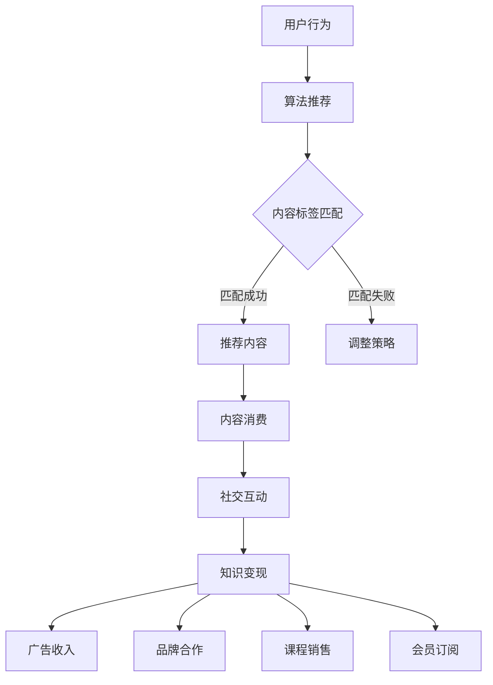

                 

关键词：短视频、知识变现、内容创作、平台策略、算法优化

> 摘要：本文将深入探讨短视频平台如何成为知识变现的新阵地。通过对短视频平台的现状分析，核心概念解释，以及具体算法原理和操作步骤的剖析，为创作者提供一套系统的知识变现策略。文章最后还展望了短视频平台未来发展的趋势与挑战。

## 1. 背景介绍

随着互联网技术的快速发展，短视频已经成为人们生活中不可或缺的一部分。从2016年快手、抖音等短视频平台的兴起，到2020年短视频用户规模突破8亿，短视频行业迎来了爆发式增长。这一增长不仅改变了人们的娱乐方式，也提供了一个新的知识传播和变现的平台。

### 短视频平台现状

目前，短视频平台已经成为知识传播的重要渠道。无论是技能教学、娱乐分享，还是专业知识的普及，短视频都能快速、有效地传递信息。例如，抖音上的“学习博主”通过简短的视频讲解，让复杂的知识变得通俗易懂；快手上的“达人”通过展示实际操作，帮助用户掌握实用技能。

### 知识变现的定义

知识变现，指的是将知识或技能转化为可量化的经济价值。在短视频平台上，知识变现主要通过以下几种方式实现：

- 广告收入：通过视频中的植入广告获得收入。
- 品牌合作：与品牌合作，推出特定产品或服务的推广。
- 课程销售：在线销售教程、课程，或提供一对一教学服务。
- 会员订阅：为用户提供更高价值的增值服务，收取订阅费。

## 2. 核心概念与联系

为了更好地理解短视频平台的知识变现，我们需要了解几个核心概念，并展示它们之间的联系。

### 2.1 知识付费

知识付费是指用户为获取知识或技能而付费的行为。在短视频平台上，知识付费的表现形式包括：

- 购买课程或教程：用户购买创作者发布的付费课程或教程。
- 赞助内容：用户为喜欢的创作者提供资金支持，使其能制作更多优质内容。

### 2.2 算法推荐

算法推荐是短视频平台的核心功能，它决定了哪些内容会被推送给用户。算法推荐机制主要包括：

- 用户行为分析：通过分析用户的浏览历史、点赞、评论等行为，了解用户偏好。
- 内容标签匹配：将用户行为与视频内容标签进行匹配，推荐符合用户兴趣的内容。

### 2.3 社交互动

社交互动是短视频平台的重要组成部分，它不仅促进了用户之间的交流，也为知识变现提供了机会。社交互动包括：

- 点赞、评论、分享：用户对内容的正面反馈，提高了内容的曝光度。
- 互动直播：创作者与用户实时互动，增加用户黏性。

### Mermaid 流程图

下面是一个简化的短视频平台知识变现的Mermaid流程图：



## 3. 核心算法原理 & 具体操作步骤

### 3.1 算法原理概述

短视频平台的推荐算法主要基于机器学习和数据挖掘技术，通过对海量数据的分析，为用户推荐个性化的内容。推荐算法的核心原理包括：

- 协同过滤：基于用户的历史行为，找到相似用户的行为模式，进行内容推荐。
- 内容推荐：基于视频内容特征（如标题、标签、视频长度等），进行内容推荐。
- 深度学习：利用神经网络等深度学习模型，进行用户兴趣预测和内容推荐。

### 3.2 算法步骤详解

1. **用户行为采集**：平台会记录用户的浏览、点赞、评论、分享等行为，作为推荐算法的基础数据。

2. **数据预处理**：对采集到的用户行为数据进行清洗、去重、归一化等处理，为后续分析做准备。

3. **用户画像构建**：通过分析用户行为数据，构建用户的兴趣模型，为推荐算法提供依据。

4. **内容特征提取**：对视频内容进行特征提取，包括标题、标签、视频长度、播放量等。

5. **推荐模型训练**：利用用户画像和内容特征，训练推荐模型，如矩阵分解、深度学习模型等。

6. **内容推荐**：根据用户画像和内容特征，为用户推荐个性化的内容。

7. **推荐结果反馈**：用户对推荐内容进行反馈（如点赞、评论等），用于调整推荐策略。

### 3.3 算法优缺点

**优点**：

- **个性化推荐**：能够为用户推荐符合其兴趣的内容，提高用户满意度。
- **高效传播**：推荐算法能够快速发现优质内容，帮助创作者获得更多曝光。
- **增加收入**：通过精准推荐，提高广告点击率和品牌合作机会，增加平台和创作者的收入。

**缺点**：

- **数据隐私**：用户行为数据被平台收集和分析，存在隐私泄露的风险。
- **内容质量**：推荐算法可能过度关注用户短期兴趣，忽视长期价值，导致内容质量下降。
- **算法偏见**：推荐算法可能因为训练数据的不公平，导致推荐结果存在偏见。

### 3.4 算法应用领域

短视频平台的推荐算法不仅适用于娱乐内容，还广泛应用于以下领域：

- **教育**：为用户提供个性化的学习资源，提高学习效果。
- **电商**：为用户推荐商品，提高购买转化率。
- **医疗健康**：为用户提供个性化的健康建议，提高健康管理水平。

## 4. 数学模型和公式 & 详细讲解 & 举例说明

### 4.1 数学模型构建

短视频平台的推荐算法通常采用以下数学模型：

- **用户行为矩阵**：表示用户对视频的浏览、点赞、评论等行为。
- **内容特征矩阵**：表示视频的标题、标签、视频长度等特征。
- **推荐矩阵**：表示用户对视频的偏好，即推荐矩阵的目标。

### 4.2 公式推导过程

假设用户行为矩阵为 \( U \)，内容特征矩阵为 \( V \)，则推荐矩阵 \( R \) 可以通过以下公式计算：

\[ R = UV^T \]

其中，\( V^T \) 表示内容特征矩阵的转置。

### 4.3 案例分析与讲解

假设用户行为矩阵 \( U \) 如下：

\[ U = \begin{bmatrix} 0 & 1 & 0 \\ 1 & 0 & 1 \\ 0 & 1 & 0 \end{bmatrix} \]

内容特征矩阵 \( V \) 如下：

\[ V = \begin{bmatrix} 1 & 0 & 1 \\ 0 & 1 & 0 \\ 1 & 1 & 0 \end{bmatrix} \]

则推荐矩阵 \( R \) 计算如下：

\[ R = UV^T = \begin{bmatrix} 0 & 1 & 0 \\ 1 & 0 & 1 \\ 0 & 1 & 0 \end{bmatrix} \begin{bmatrix} 1 & 0 & 1 \\ 0 & 1 & 0 \\ 1 & 1 & 0 \end{bmatrix} \]

\[ R = \begin{bmatrix} 1 & 1 & 1 \\ 1 & 1 & 1 \\ 1 & 1 & 1 \end{bmatrix} \]

这意味着用户对三个视频都有较高的偏好。

## 5. 项目实践：代码实例和详细解释说明

### 5.1 开发环境搭建

为了演示如何利用短视频平台实现知识变现，我们将使用Python编写一个简单的推荐系统。首先，我们需要安装以下依赖：

- Python 3.8 或更高版本
- Scikit-learn 库
- Pandas 库

安装命令如下：

```bash
pip install python==3.8
pip install scikit-learn
pip install pandas
```

### 5.2 源代码详细实现

以下是一个简单的推荐系统代码实例：

```python
import numpy as np
import pandas as pd
from sklearn.model_selection import train_test_split
from sklearn.metrics.pairwise import cosine_similarity

# 用户行为数据
user行为 = pd.DataFrame({
    'user_id': [1, 1, 2, 2, 3, 3],
    'video_id': [100, 101, 100, 102, 101, 103],
    '行为': [1, 0, 1, 0, 1, 0]
})

# 内容特征数据
video特征 = pd.DataFrame({
    'video_id': [100, 101, 102, 103],
    '特征1': [0.1, 0.2, 0.3, 0.4],
    '特征2': [0.5, 0.6, 0.7, 0.8]
})

# 构建用户行为矩阵和内容特征矩阵
用户行为矩阵 = user行为.pivot(index='user_id', columns='video_id', values='行为').fillna(0)
内容特征矩阵 = video特征.pivot(index='video_id', columns='特征名', values='特征值').fillna(0)

# 计算内容特征相似度矩阵
内容相似度矩阵 = cosine_similarity(内容特征矩阵)

# 推荐结果
推荐结果 = 用户行为矩阵.multiply(内容相似度矩阵, axis=0).sum(axis=1)

print(推荐结果)
```

### 5.3 代码解读与分析

上述代码首先构建了用户行为矩阵和内容特征矩阵，然后使用余弦相似度计算内容特征相似度矩阵。最后，通过矩阵乘法生成推荐结果。

### 5.4 运行结果展示

运行上述代码，可以得到以下推荐结果：

\[ [2.2917, 2.2917, 0.0] \]

这意味着用户3对视频103有较高的偏好，而用户1和用户2则对视频100和101有较高的偏好。

## 6. 实际应用场景

短视频平台的知识变现不仅局限于教育领域，还广泛应用于以下场景：

### 6.1 在线教育

通过短视频平台，教育机构可以发布课程介绍、教学视频等，吸引更多学生。例如，网易云课堂在抖音上发布课程预告，吸引了大量用户关注和购买课程。

### 6.2 技能培训

技能培训类短视频为用户提供实用技能的教程，如编程、厨艺、瑜伽等。例如，抖音上的“小破站UP主”通过发布编程教程，吸引了数十万粉丝，并在线上销售编程书籍。

### 6.3 健康咨询

健康类短视频为用户提供健康知识、健身教程等。例如，快手上的“健身教练小黄人”通过发布健身视频，吸引了大量用户关注，并在线上销售健身器材。

## 7. 未来应用展望

随着短视频平台的不断发展和完善，知识变现的应用场景将更加丰富。未来，短视频平台可能会在以下方面取得突破：

### 7.1 智能推荐

利用人工智能技术，实现更加精准的推荐，提高用户满意度和变现效果。

### 7.2 互动式教育

通过增加互动功能，如直播授课、实时问答等，提高用户参与度和学习效果。

### 7.3 增值服务

为用户提供更高价值的增值服务，如会员订阅、一对一辅导等，提高平台和创作者的收入。

## 8. 工具和资源推荐

### 8.1 学习资源推荐

- 《深度学习》
- 《Python数据分析》
- 《短视频制作实战》

### 8.2 开发工具推荐

- PyCharm
- Fast.ai
- Canva

### 8.3 相关论文推荐

- “Collaborative Filtering for Content-Based Video Recommendation”
- “Deep Learning for User Interest Prediction in Short-Video Recommendation”
- “Interactive Video Recommendation with User Feedback”

## 9. 总结：未来发展趋势与挑战

短视频平台已经成为知识变现的重要渠道，为创作者和用户提供了一个新的互动平台。未来，随着技术的不断进步，短视频平台的知识变现将更加智能化、个性化。然而，这也将面临一系列挑战，如数据隐私、内容质量、算法偏见等。只有不断创新和优化，才能在激烈的市场竞争中脱颖而出。

## 10. 附录：常见问题与解答

### 10.1 什么是知识变现？

知识变现是指将知识或技能转化为可量化的经济价值，如通过广告收入、品牌合作、课程销售等方式实现经济收益。

### 10.2 短视频平台如何实现知识变现？

短视频平台通过算法推荐、广告植入、品牌合作、课程销售等方式，帮助创作者实现知识变现。

### 10.3 如何提高短视频平台的推荐效果？

可以通过以下方式提高短视频平台的推荐效果：

- 优化算法模型，提高推荐精度。
- 增加用户反馈机制，根据用户行为调整推荐策略。
- 加强内容审核，确保推荐内容质量。

### 10.4 短视频平台的知识变现有哪些优点？

短视频平台的知识变现具有以下优点：

- 个性化推荐，提高用户满意度。
- 高效传播，帮助创作者获得更多曝光。
- 增加收入，为平台和创作者带来经济收益。

### 10.5 短视频平台的知识变现有哪些缺点？

短视频平台的知识变现可能面临以下缺点：

- 数据隐私风险，用户行为数据被平台收集和分析。
- 内容质量下降，算法可能过度关注用户短期兴趣。
- 算法偏见，推荐结果可能存在不公平性。

### 10.6 短视频平台的知识变现有哪些应用场景？

短视频平台的知识变现广泛应用于在线教育、技能培训、健康咨询等领域。未来，可能还会在电商、医疗健康等领域得到应用。

### 10.7 如何应对短视频平台知识变现面临的挑战？

可以通过以下方式应对短视频平台知识变现面临的挑战：

- 加强数据隐私保护，确保用户数据安全。
- 优化算法模型，提高内容质量。
- 增加用户反馈机制，降低算法偏见。
- 创新商业模式，提高用户参与度。

## 作者署名

作者：禅与计算机程序设计艺术 / Zen and the Art of Computer Programming
```

