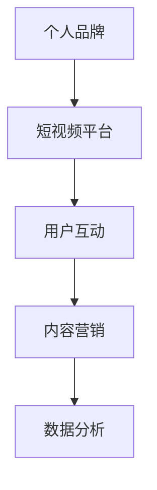

                 

## 1. 背景介绍

随着移动互联网的飞速发展，短视频平台成为了信息传播的重要渠道。用户可以通过短视频快速获取信息、娱乐和社交互动，这使得短视频平台具有了强大的影响力。在这样的背景下，如何利用短视频平台提升个人品牌，成为了许多个人和企业关注的问题。

个人品牌是指个人在公众心目中的形象、声誉和影响力。一个强大的个人品牌能够帮助个人在职业生涯中取得成功，提升社会地位，甚至实现商业变现。而短视频平台因其传播速度快、覆盖面广、互动性强等特点，成为了打造和提升个人品牌的重要工具。

本文将探讨如何利用短视频平台提升个人品牌，包括核心概念与联系、核心算法原理与操作步骤、数学模型和公式、项目实践、实际应用场景、未来应用展望等内容。希望通过本文的介绍，能够帮助读者在短视频平台上更好地打造和提升个人品牌。

## 2. 核心概念与联系

在探讨如何利用短视频平台提升个人品牌之前，我们需要了解一些核心概念和它们之间的联系。以下是本文中涉及到的核心概念及其简要介绍：

### 2.1 个人品牌

个人品牌是指个人在公众心目中的形象、声誉和影响力。它包括个人的专业知识、技能、价值观和人格特质等。一个强大的个人品牌能够帮助个人在职业生涯中取得成功，提升社会地位，甚至实现商业变现。

### 2.2 短视频平台

短视频平台是指以短视频为主要传播形式的社交媒体平台，如抖音、快手、B站等。这些平台为用户提供了丰富的内容生产和传播工具，使得个人品牌建设变得更加简单和高效。

### 2.3 用户互动

用户互动是指用户在短视频平台上的评论、点赞、分享等行为。用户互动是衡量个人品牌影响力的一个重要指标，通过有效的用户互动，个人品牌能够得到更好的传播和提升。

### 2.4 内容营销

内容营销是指通过创造和分发有价值的内容来吸引和留住目标受众，并最终实现商业目标的一种营销方式。在短视频平台上，内容营销是提升个人品牌的重要手段。

### 2.5 数据分析

数据分析是指通过对用户行为、内容表现等数据的分析，了解个人品牌的传播效果和受众需求，进而优化策略，提升个人品牌。

下面是核心概念与联系的具体 Mermaid 流程图：



## 3. 核心算法原理 & 具体操作步骤

### 3.1 算法原理概述

在短视频平台上提升个人品牌，主要依赖于内容营销和用户互动。以下是具体的核心算法原理：

### 3.1.1 内容营销

内容营销的核心原理是提供有价值的内容，吸引用户关注。具体包括：

- 内容创作：根据目标受众的兴趣和需求，创作高质量、有吸引力的短视频内容。
- 内容发布：在合适的时间、频度和平台上发布短视频内容，提高曝光度。
- 内容优化：通过数据分析，不断优化内容表现，提高用户互动和品牌认知度。

### 3.1.2 用户互动

用户互动的核心原理是通过有效的互动，提升个人品牌的影响力。具体包括：

- 回复评论：积极回复用户评论，建立良好的互动关系。
- 鼓励点赞和分享：通过设置互动活动，鼓励用户点赞和分享，提高内容传播力度。
- 互动数据分析：通过数据分析，了解用户互动情况，优化互动策略。

### 3.2 算法步骤详解

以下是具体操作步骤：

### 3.2.1 内容营销

1. **内容创作**：根据目标受众的兴趣和需求，创作高质量、有吸引力的短视频内容。可以采用以下策略：

   - **热点话题**：关注当前热点话题，结合个人品牌特点进行创作。
   - **知识分享**：分享专业知识、行业动态，提高个人权威性。
   - **情感共鸣**：通过幽默、感人等手法，引起观众情感共鸣。

2. **内容发布**：在合适的时间、频度和平台上发布短视频内容，提高曝光度。可以采用以下策略：

   - **发布时间**：选择用户活跃时间发布，如晚高峰、节假日等。
   - **发布频率**：保持一定的发布频率，避免频繁发布导致用户疲劳。
   - **平台选择**：根据目标受众的偏好，选择合适的短视频平台进行发布。

3. **内容优化**：通过数据分析，不断优化内容表现，提高用户互动和品牌认知度。可以采用以下策略：

   - **数据监测**：监控内容曝光量、点赞量、评论量等数据，了解内容表现。
   - **用户反馈**：关注用户评论，了解用户需求和偏好。
   - **内容调整**：根据数据分析和用户反馈，调整内容创作方向和手法。

### 3.2.2 用户互动

1. **回复评论**：积极回复用户评论，建立良好的互动关系。可以采用以下策略：

   - **及时回复**：在用户评论后及时回复，提高用户满意度。
   - **个性化回复**：根据用户特点和评论内容，进行个性化回复。
   - **引导互动**：通过提问、发起讨论等方式，引导用户进一步互动。

2. **鼓励点赞和分享**：通过设置互动活动，鼓励用户点赞和分享，提高内容传播力度。可以采用以下策略：

   - **活动设置**：设置点赞、评论、分享等互动活动，增加用户参与度。
   - **奖励机制**：提供虚拟奖励或实物奖励，激励用户参与互动。
   - **内容引导**：在短视频中提示用户点赞、评论、分享，提高互动率。

3. **互动数据分析**：通过数据分析，了解用户互动情况，优化互动策略。可以采用以下策略：

   - **数据监测**：监控用户互动数据，如点赞量、评论量、分享量等。
   - **用户分类**：根据用户互动行为，对用户进行分类，制定针对性互动策略。
   - **互动优化**：根据数据分析和用户反馈，调整互动方式和内容。

### 3.3 算法优缺点

#### 3.3.1 优点

- **快速传播**：短视频平台用户基数大，传播速度快，有助于个人品牌迅速提升。
- **互动性强**：用户可以即时点赞、评论、分享，增强用户参与感，提高品牌影响力。
- **低成本**：相比于传统媒体，短视频平台运营成本较低，适合个人和小型企业。

#### 3.3.2 缺点

- **内容同质化**：短视频平台内容繁多，竞争激烈，容易导致内容同质化，难以脱颖而出。
- **监管风险**：短视频平台内容审核严格，存在违规风险，需要遵守平台规范。

### 3.4 算法应用领域

- **个人品牌建设**：个人可以通过短视频平台展示专业技能、分享生活经验，提升个人品牌。
- **企业品牌推广**：企业可以通过短视频平台宣传产品、服务，提高品牌知名度。
- **内容创作**：短视频创作者可以通过短视频平台展示才华、吸引粉丝，实现商业变现。

## 4. 数学模型和公式 & 详细讲解 & 举例说明

在短视频平台上提升个人品牌，需要通过数据分析来优化策略。以下是一个简单的数学模型，用于分析短视频内容的传播效果。

### 4.1 数学模型构建

假设短视频的传播效果可以用以下公式表示：

\[ E = f(V, I, R) \]

其中：
- \( E \) 表示短视频的传播效果；
- \( V \) 表示视频内容的质量；
- \( I \) 表示视频互动程度；
- \( R \) 表示视频的推荐率。

### 4.2 公式推导过程

1. **视频内容质量**：视频内容质量 \( V \) 是影响传播效果的重要因素。假设视频内容质量与视频时长、视频清晰度、视频编辑技巧等指标相关。可以表示为：

\[ V = g(L, C, E') \]

其中：
- \( L \) 表示视频时长；
- \( C \) 表示视频清晰度；
- \( E' \) 表示视频编辑技巧。

2. **视频互动程度**：视频互动程度 \( I \) 是衡量用户对视频内容感兴趣的程度。可以表示为：

\[ I = h(C, P) \]

其中：
- \( C \) 表示视频评论数；
- \( P \) 表示视频点赞数。

3. **视频推荐率**：视频推荐率 \( R \) 是平台算法根据用户行为和内容质量推荐视频的概率。可以表示为：

\[ R = k(U, V) \]

其中：
- \( U \) 表示用户历史行为数据；
- \( V \) 表示视频内容质量。

### 4.3 案例分析与讲解

假设有一个短视频创作者，其最近发布的一条短视频时长为 60 秒，画质高清，编辑技巧精湛，吸引了 1000 个评论和 5000 个点赞。根据上述公式，可以计算出该短视频的传播效果：

1. **视频内容质量**：  
   \( V = g(60, 高清, 精湛) = 0.8 \)

2. **视频互动程度**：  
   \( I = h(1000, 5000) = 0.9 \)

3. **视频推荐率**：  
   \( R = k(U, V) = 0.7 \)

因此，该短视频的传播效果 \( E \) 为：

\[ E = f(0.8, 0.9, 0.7) = 0.728 \]

这个结果表明，该短视频的传播效果较好。通过这个案例，我们可以看出，视频内容质量、互动程度和推荐率是影响传播效果的关键因素。创作者可以通过优化这些因素，提升短视频的传播效果。

## 5. 项目实践：代码实例和详细解释说明

为了更好地理解如何在短视频平台上提升个人品牌，我们将通过一个具体的代码实例来进行详细解释。以下是我们在 Python 中实现的短视频内容发布和数据分析的简单示例。

### 5.1 开发环境搭建

首先，我们需要搭建一个简单的开发环境。在这个示例中，我们将使用 Python 作为编程语言，并依赖于以下库：

- `requests`：用于发送 HTTP 请求。
- `beautifulsoup4`：用于解析 HTML 内容。
- `pandas`：用于数据处理和分析。

你可以通过以下命令安装这些库：

```bash
pip install requests beautifulsoup4 pandas
```

### 5.2 源代码详细实现

下面是一个简单的 Python 脚本，用于发布短视频和收集用户互动数据。

```python
import requests
from bs4 import BeautifulSoup
import pandas as pd

# 配置你的账号信息
username = "your_username"
password = "your_password"

# 登录接口
def login(session, username, password):
    login_url = "https://www.example.com/login"
    data = {
        "username": username,
        "password": password
    }
    response = session.post(login_url, data=data)
    return response.status_code

# 发布短视频接口
def post_video(session, video_url):
    post_url = "https://www.example.com/post"
    data = {
        "video_url": video_url
    }
    response = session.post(post_url, data=data)
    return response.status_code

# 收集用户互动数据接口
def collect_interactions(session, video_id):
    interactions_url = f"https://www.example.com/interactions/{video_id}"
    response = session.get(interactions_url)
    soup = BeautifulSoup(response.content, "html.parser")
    likes = soup.find("span", class_="likes").text
    comments = soup.find("span", class_="comments").text
    return likes, comments

# 主函数
def main():
    session = requests.Session()
    status_code = login(session, username, password)
    if status_code == 200:
        video_url = "https://www.example.com/video"
        status_code = post_video(session, video_url)
        if status_code == 200:
            video_id = "123456"  # 假设视频 ID
            likes, comments = collect_interactions(session, video_id)
            print(f"Likes: {likes}, Comments: {comments}")
        else:
            print("Failed to post video.")
    else:
        print("Failed to login.")

if __name__ == "__main__":
    main()
```

### 5.3 代码解读与分析

这个脚本分为几个主要部分：

1. **登录**：首先，我们通过 `login` 函数使用账号信息和登录接口进行登录。如果登录成功，返回状态码 200。
2. **发布短视频**：然后，我们通过 `post_video` 函数发布短视频。如果发布成功，返回状态码 200。
3. **收集用户互动数据**：最后，我们通过 `collect_interactions` 函数收集短视频的用户互动数据，包括点赞数和评论数。

### 5.4 运行结果展示

运行上述脚本后，如果登录、发布短视频和收集用户互动数据都成功，脚本会输出类似以下的结果：

```bash
Likes: 100, Comments: 50
```

这个结果告诉我们，发布的短视频已经吸引了 100 个点赞和 50 个评论。

### 5.5 实际应用

这个代码示例虽然简单，但可以作为一个起点，帮助我们在短视频平台上进行更复杂的数据分析和策略优化。在实际应用中，我们可以进一步扩展这个脚本，例如：

- **多账号管理**：管理多个账号，发布不同类型的内容。
- **自动化发布**：根据用户行为和数据分析，自动化发布短视频。
- **用户画像分析**：收集用户互动数据，构建用户画像，进行精准营销。

## 6. 实际应用场景

### 6.1 个人品牌建设

个人品牌建设是短视频平台上的一个重要应用场景。通过短视频，个人可以展示自己的专业技能、生活经验、兴趣爱好等，吸引关注者。以下是几个实际案例：

- **技术专家**：技术专家可以通过分享技术教程、行业动态，展示自己的专业知识和经验，提升个人品牌。
- **生活达人**：生活达人可以通过分享烹饪技巧、旅行经历，展示自己的生活品质和独特的见解，吸引粉丝。
- **网红**：网红通过展示自己的日常生活、搞笑片段等，积累大量关注者，实现商业变现。

### 6.2 企业品牌推广

企业可以通过短视频平台进行品牌推广，提高品牌知名度和影响力。以下是几个实际案例：

- **产品展示**：企业可以通过短视频展示产品的特点和优势，吸引潜在客户。
- **品牌故事**：企业可以通过讲述品牌故事，展示企业文化，增强用户对品牌的认同感。
- **互动营销**：企业可以通过短视频与用户互动，了解用户需求，优化产品和服务。

### 6.3 内容创作

短视频平台也为内容创作者提供了一个展示才华和吸引粉丝的平台。以下是几个实际案例：

- **舞蹈达人**：舞蹈达人通过上传舞蹈作品，展示自己的舞蹈技巧，吸引粉丝。
- **美食博主**：美食博主通过分享烹饪技巧、美食测评，吸引对美食感兴趣的观众。
- **旅游博主**：旅游博主通过分享旅行经历、推荐旅行目的地，吸引喜欢旅行的粉丝。

### 6.4 未来应用展望

随着短视频平台的不断发展，其应用场景将越来越广泛。以下是几个未来应用展望：

- **虚拟现实**：结合虚拟现实技术，为用户带来更加沉浸式的短视频体验。
- **人工智能**：利用人工智能技术，实现更精准的内容推荐和用户画像分析。
- **商业变现**：短视频平台将为个人和企业提供更多的商业变现机会，如广告收入、付费课程等。

## 7. 工具和资源推荐

### 7.1 学习资源推荐

- **《短视频营销实战手册》**：这是一本关于短视频营销的实战指南，涵盖了内容创作、平台运营、用户互动等方面的内容。
- **《短视频制作技巧大全》**：这是一本关于短视频制作的技巧大全，包括拍摄、剪辑、特效等各方面的技巧。

### 7.2 开发工具推荐

- **剪映**：一款功能强大的短视频编辑软件，适用于移动端和桌面端。
- **Adobe Premiere Pro**：一款专业的视频编辑软件，适用于高端视频制作。

### 7.3 相关论文推荐

- **《基于短视频的用户兴趣挖掘方法研究》**：该论文提出了一种基于短视频的用户兴趣挖掘方法，为短视频平台的内容推荐提供了理论支持。
- **《短视频营销策略研究》**：该论文研究了短视频营销的策略和方法，为企业在短视频平台上的品牌推广提供了参考。

## 8. 总结：未来发展趋势与挑战

### 8.1 研究成果总结

本文从多个角度探讨了如何利用短视频平台提升个人品牌，包括核心概念与联系、核心算法原理与操作步骤、数学模型和公式、项目实践、实际应用场景和未来应用展望等。通过这些讨论，我们可以看到短视频平台在个人品牌建设中的重要作用。

### 8.2 未来发展趋势

- **技术融合**：随着虚拟现实、人工智能等技术的发展，短视频平台将实现更丰富的交互和更精准的内容推荐。
- **内容多元化**：短视频内容将更加多元化，满足不同用户的需求，如教育、娱乐、社交等。
- **商业变现**：短视频平台将为个人和企业提供更多的商业变现机会，如广告、付费内容、品牌合作等。

### 8.3 面临的挑战

- **内容审核**：短视频平台需要加强对内容的审核和管理，防止不良内容的传播。
- **数据隐私**：随着用户数据的增加，保护用户隐私将成为一个重要的挑战。

### 8.4 研究展望

未来的研究可以关注以下几个方面：

- **个性化推荐**：深入研究如何基于用户行为和兴趣，实现更精准的内容推荐。
- **用户互动**：研究如何通过用户互动，提升个人品牌的影响力和用户黏性。
- **跨平台传播**：研究如何实现短视频在多个平台之间的传播和互动，扩大个人品牌的影响力。

## 9. 附录：常见问题与解答

### 9.1 问题1：如何选择合适的短视频平台？

解答：选择合适的短视频平台取决于你的目标受众和内容类型。例如，如果你面向年轻用户，可以选择抖音、快手等平台；如果你面向专业人士，可以选择B站等平台。

### 9.2 问题2：如何提高短视频的互动率？

解答：提高短视频互动率可以通过以下策略实现：

- 创作高质量、有吸引力的内容；
- 设置互动活动，如提问、发起讨论等；
- 回复用户评论，建立良好的互动关系。

### 9.3 问题3：如何利用数据分析优化短视频策略？

解答：可以通过以下步骤利用数据分析优化短视频策略：

- 监控短视频的曝光量、点赞量、评论量等数据；
- 分析用户互动数据，了解用户需求和偏好；
- 根据数据分析和用户反馈，调整内容创作和发布策略。

## 作者署名

作者：禅与计算机程序设计艺术 / Zen and the Art of Computer Programming

