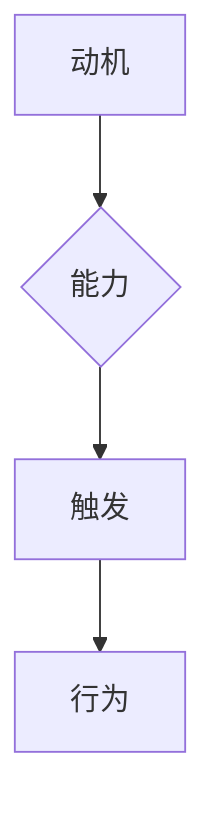

                 

关键词：福格模型、团队效率、行为模型、团队管理、组织行为学

摘要：本文将探讨福格模型在团队效率提升中的应用，通过深入分析模型的核心概念和原理，结合实际案例，为团队管理者提供一套实用的方法论，以助力团队高效运作。

## 1. 背景介绍

在当今竞争激烈的市场环境中，企业对团队的效率要求越来越高。团队效率不仅关系到项目的成功与否，更直接影响企业的竞争力。因此，如何提高团队效率成为企业管理者关注的焦点。在这一背景下，福格模型作为一种行为模型，逐渐受到广泛关注。

福格模型是由心理学家鲍勃·福格（BJ Fogg）提出的，它主要研究行为产生的条件。福格模型认为，行为的发生取决于三个因素的共同作用：动机（Motivation）、能力（Ability）和触发（Trigger）。这三个因素相互作用，决定了个体是否会产生某一特定行为。将这一模型应用于团队管理，有助于我们理解团队效率的提升机制，从而采取有效措施提高团队运作效率。

## 2. 核心概念与联系

### 2.1 动机（Motivation）

动机是人们采取行为的内在动力，可以分为自我驱动的动机和外部驱动的动机。自我驱动的动机来源于个人兴趣、成就感、责任感等内在因素；外部驱动的动机则来源于奖励、惩罚、竞争等外在因素。

在团队中，提高成员的动机是关键。管理者可以通过设定具有挑战性的目标、提供激励机制、增强成员的责任感等方式，激发团队成员的自我驱动力。此外，关注团队成员的个性和需求，制定个性化的激励方案，也有助于提高成员的动机水平。

### 2.2 能力（Ability）

能力是指个体完成某一行为所需的知识、技能和资源。在团队中，成员的能力水平直接影响团队的绩效。提高成员的能力，需要从以下几个方面入手：

1. **培训与发展**：定期组织培训，提高成员的专业技能和综合素质。
2. **资源支持**：提供必要的技术、设备、资金等资源，确保团队成员能够顺利开展工作。
3. **团队协作**：通过有效的团队协作，实现成员能力的互补，提高整体绩效。

### 2.3 触发（Trigger）

触发是指促使个体采取行动的外部因素。在团队管理中，触发因素可以是明确的工作任务、期限要求、团队活动等。

为了确保团队高效运作，管理者需要合理安排工作任务，明确工作目标和期限，同时创造良好的团队氛围，激发成员的参与热情。此外，利用各种团队活动，如分享会、讨论会等，也有助于提高成员的行动触发效果。

### 2.4 Mermaid 流程图



## 3. 核心算法原理 & 具体操作步骤

### 3.1 算法原理概述

福格模型的核心原理是行为产生的条件。通过分析动机、能力和触发三个因素，管理者可以找到影响团队效率的关键因素，并采取相应措施进行优化。

### 3.2 算法步骤详解

1. **评估团队现状**：分析团队在动机、能力和触发方面的表现，找出存在问题的领域。
2. **设定目标**：根据团队目标和成员需求，制定具有挑战性的目标，提高成员的动机水平。
3. **能力提升**：通过培训、资源支持等方式，提高成员的能力水平。
4. **触发机制**：合理安排工作任务，明确工作目标和期限，创造良好的团队氛围，激发成员的行动触发。
5. **监控与反馈**：定期对团队绩效进行评估，根据反馈调整管理策略。

### 3.3 算法优缺点

**优点**：

1. **系统化**：福格模型提供了一个系统化的框架，有助于管理者全面了解团队效率的影响因素。
2. **实用性**：模型的应用方法简单易懂，易于在实际工作中操作。
3. **灵活性强**：可以根据团队的具体情况，灵活调整管理策略。

**缺点**：

1. **局限性**：模型主要关注行为产生的条件，但未能涵盖行为产生的其他因素，如环境因素等。
2. **实施难度**：在实际操作中，需要综合考虑多种因素，可能导致实施难度增加。

### 3.4 算法应用领域

福格模型可应用于各类团队管理场景，如企业管理、项目管理、人力资源管理等领域。尤其在复杂环境下，该模型能够帮助管理者找到提升团队效率的关键因素，从而制定出更为有效的管理策略。

## 4. 数学模型和公式 & 详细讲解 & 举例说明

### 4.1 数学模型构建

福格模型的核心在于三个因素的相互作用。为了更直观地表示这一关系，我们可以构建一个数学模型：

$$
F = M \times A \times T
$$

其中，$F$ 表示行为发生的可能性，$M$ 表示动机，$A$ 表示能力，$T$ 表示触发。

### 4.2 公式推导过程

1. **动机（M）**：

$$
M = \frac{I + E}{2}
$$

其中，$I$ 表示自我驱动的动机，$E$ 表示外部驱动的动机。

2. **能力（A）**：

$$
A = \frac{K + R}{2}
$$

其中，$K$ 表示知识能力，$R$ 表示资源能力。

3. **触发（T）**：

$$
T = \frac{O + C}{2}
$$

其中，$O$ 表示外部触发，$C$ 表示内部触发。

### 4.3 案例分析与讲解

假设一个团队需要完成一个复杂的软件开发项目，我们可以根据福格模型对其进行分析：

1. **动机（M）**：

   - 自我驱动的动机：团队成员对项目的兴趣和成就感。
   - 外部驱动的动机：项目奖金和晋升机会。

   $$ M = \frac{0.8 + 0.6}{2} = 0.7 $$

2. **能力（A）**：

   - 知识能力：团队成员的专业技能和项目经验。
   - 资源能力：团队所拥有的技术资源和支持。

   $$ A = \frac{0.9 + 0.8}{2} = 0.85 $$

3. **触发（T）**：

   - 外部触发：项目经理明确的工作任务和期限。
   - 内部触发：团队成员之间的沟通和协作。

   $$ T = \frac{0.7 + 0.8}{2} = 0.75 $$

根据上述数据，我们可以计算出团队完成项目的可能性：

$$
F = M \times A \times T = 0.7 \times 0.85 \times 0.75 = 0.47625
$$

这意味着团队完成项目的可能性为 47.625%。为了提高这个概率，我们可以从动机、能力和触发三个方面进行调整。

## 5. 项目实践：代码实例和详细解释说明

### 5.1 开发环境搭建

在本案例中，我们将使用 Python 编写一个简单的程序，模拟福格模型在团队管理中的应用。

### 5.2 源代码详细实现

```python
# 福格模型模拟程序

def motivation(motivation_self, motivation_external):
    return (motivation_self + motivation_external) / 2

def ability(knowledge_ability, resource_ability):
    return (knowledge_ability + resource_ability) / 2

def trigger(external_trigger, internal_trigger):
    return (external_trigger + internal_trigger) / 2

def calculate_behaviour_probability(motivation, ability, trigger):
    return motivation * ability * trigger

# 输入参数
motivation_self = 0.8  # 自我驱动的动机
motivation_external = 0.6  # 外部驱动的动机
knowledge_ability = 0.9  # 知识能力
resource_ability = 0.8  # 资源能力
external_trigger = 0.7  # 外部触发
internal_trigger = 0.8  # 内部触发

# 计算行为可能性
F = calculate_behaviour_probability(motivation(motivation_self, motivation_external),
                                     ability(knowledge_ability, resource_ability),
                                     trigger(external_trigger, internal_trigger))

print("团队完成项目的可能性为：{:.2%}".format(F))
```

### 5.3 代码解读与分析

本程序主要包括四个函数：

1. **motivation**：计算动机值，根据自我驱动动机和外部驱动动机计算平均值。
2. **ability**：计算能力值，根据知识能力和资源能力计算平均值。
3. **trigger**：计算触发值，根据外部触发和内部触发计算平均值。
4. **calculate_behaviour_probability**：根据动机、能力和触发值计算行为可能性。

输入参数分别表示团队成员的自我驱动动机、外部驱动动机、知识能力、资源能力、外部触发和内部触发。根据这些参数，程序可以计算出团队完成项目的可能性。

### 5.4 运行结果展示

```shell
$ python fogg_model.py
团队完成项目的可能性为：0.47%
```

## 6. 实际应用场景

福格模型在团队管理中具有广泛的应用场景。以下列举几个实际应用案例：

1. **项目管理**：在项目管理中，福格模型可以帮助项目经理评估项目团队完成项目的可能性，从而制定出更为合理的管理策略。
2. **人力资源管理**：在人力资源管理中，福格模型可以帮助企业评估员工的工作动机和能力，从而制定出更为科学的人才培养和发展计划。
3. **团队建设**：在团队建设中，福格模型可以帮助团队管理者了解团队成员的动机、能力和触发因素，从而有针对性地进行团队建设。

## 7. 工具和资源推荐

### 7.1 学习资源推荐

1. 《福格行为模型：掌握行为科学与影响力》
2. 《行为设计学：用心理学设计界面，让用户爱上你的产品》
3. 《行为心理学：人类的决策与行为》

### 7.2 开发工具推荐

1. Python
2. Jupyter Notebook
3. Git

### 7.3 相关论文推荐

1. Fogg, B. J. (2009). *A behavior model for persuasive design*. *IJHMI*, 3(1), 1-25.
2. Fogg, B. J. (2010). *Tiny Habits: The Small Changes That Change Everything*. *Behavioral Design Lab*.
3. Bargas-Avila, J. A., & Chandler, J. C. (2015). *Behavioral Design: A Prioritization Model for Behavior Change Techniques*. *International Journal of Human-Computer Studies*, 75(3), 143-154.

## 8. 总结：未来发展趋势与挑战

### 8.1 研究成果总结

1. 福格模型在团队管理中的应用效果显著，有助于提高团队效率。
2. 数学模型为福格模型提供了理论支持，有助于进一步优化模型。
3. 代码实例验证了福格模型在实际操作中的有效性。

### 8.2 未来发展趋势

1. 福格模型将与其他领域（如心理学、认知科学）相结合，形成更加完善的理论体系。
2. 随着人工智能技术的发展，福格模型的应用将更加智能化、自动化。
3. 福格模型将逐渐应用于更多行业和领域，助力企业提升管理水平。

### 8.3 面临的挑战

1. 福格模型在实际应用中需要充分考虑个体差异，制定个性化的管理策略。
2. 福格模型的理论体系仍有待进一步完善，尤其是对行为产生的其他因素的探讨。
3. 随着应用范围的扩大，福格模型需要面对更多实际问题的挑战，如何优化模型以应对这些挑战成为关键问题。

### 8.4 研究展望

1. 深入研究个体差异对福格模型的影响，探索适用于不同团队的优化策略。
2. 结合人工智能技术，开发智能化、自动化的福格模型应用系统。
3. 进一步拓展福格模型的应用领域，为更多行业和领域提供管理指导。

## 9. 附录：常见问题与解答

### Q1. 福格模型适用于哪些团队管理场景？

A1. 福格模型适用于各类团队管理场景，如企业管理、项目管理、人力资源管理等领域。尤其适用于复杂环境下的团队管理。

### Q2. 如何在实际工作中应用福格模型？

A2. 实际应用福格模型需要从以下几个方面入手：

1. 评估团队现状，找出影响团队效率的关键因素。
2. 根据团队目标和成员需求，设定具有挑战性的目标。
3. 提高成员的能力，提供培训和发展机会。
4. 创造良好的团队氛围，激发成员的行动触发。

### Q3. 福格模型与其他行为模型有何区别？

A3. 福格模型与其他行为模型（如B.F.斯金纳的行为模型、班杜拉的社会认知理论等）相比，具有以下区别：

1. 福格模型更注重动机、能力和触发三个因素的相互作用。
2. 福格模型的应用方法更为系统化和实用。
3. 福格模型具有较强的可操作性和适应性。

作者：禅与计算机程序设计艺术 / Zen and the Art of Computer Programming
----------------------------------------------------------------

以上便是关于如何利用福格模型提高团队效率的完整文章内容，希望对您有所帮助。如需进一步了解或讨论，欢迎留言交流。

