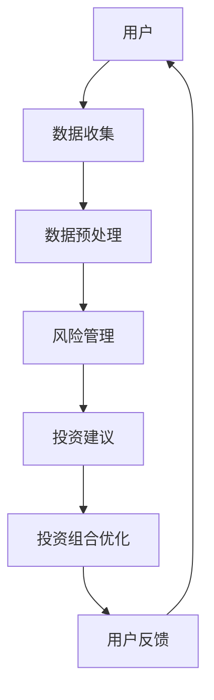

                 

关键词：编程技能，理财工具，软件开发，算法，数学模型，项目实践，实际应用

> 摘要：本文将探讨如何利用编程技能开发理财工具。我们将介绍理财工具的核心概念，探讨开发过程中的关键算法和数学模型，并提供一个实际的项目实践案例，以便读者更好地理解开发理财工具的流程。

## 1. 背景介绍

随着金融科技（FinTech）的快速发展，理财工具逐渐成为人们日常生活中不可或缺的一部分。这些工具不仅可以帮助用户更好地管理自己的财务，还可以提供智能化的投资建议和风险控制策略。对于程序员和软件开发者来说，开发理财工具不仅能够锻炼编程技能，还可以在金融领域实现自己的价值。

理财工具的开发涉及到多个领域，包括金融学、统计学、计算机科学等。程序员需要了解这些领域的知识，以便在开发过程中能够准确地实现所需的功能。此外，理财工具需要处理大量的数据，因此高效的算法和数学模型是必不可少的。

本文将围绕以下主题展开：

- **核心概念与联系**：介绍理财工具的基本概念，并绘制一个流程图展示其整体架构。
- **核心算法原理 & 具体操作步骤**：讲解理财工具中常用的算法原理，并提供具体的操作步骤。
- **数学模型和公式 & 详细讲解 & 举例说明**：介绍理财工具所需的数学模型和公式，并提供详细的推导过程和实例分析。
- **项目实践：代码实例和详细解释说明**：通过一个具体的项目实践案例，展示理财工具的开发过程。
- **实际应用场景**：讨论理财工具在不同场景下的应用。
- **工具和资源推荐**：推荐一些学习资源、开发工具和相关论文。
- **总结：未来发展趋势与挑战**：总结研究成果，探讨未来的发展趋势和面临的挑战。

## 2. 核心概念与联系

### 2.1 理财工具的基本概念

理财工具是指能够帮助用户管理财务、实现财务目标的一系列软件和平台。这些工具通常包括以下几个方面的功能：

- **财务管理**：记录用户的收入、支出和资产情况，帮助用户了解自己的财务状况。
- **投资建议**：基于用户的风险承受能力和投资目标，提供个性化的投资建议。
- **风险控制**：分析市场数据，预测风险，并给出相应的风险控制策略。
- **智能投顾**：利用人工智能技术，为用户提供投资组合优化和风险管理服务。

### 2.2 整体架构

以下是一个简单的Mermaid流程图，展示了理财工具的整体架构：



- **用户**：用户是理财工具的服务对象，负责提供数据并接收投资建议。
- **数据收集**：理财工具通过各种渠道收集用户的数据，如收入、支出、资产等。
- **数据预处理**：对收集到的数据进行清洗、转换和归一化，以便后续处理。
- **风险管理**：分析市场数据，预测风险，并给出相应的风险控制策略。
- **投资建议**：根据用户的风险承受能力和投资目标，提供个性化的投资建议。
- **投资组合优化**：利用优化算法，为用户提供最优的投资组合。
- **用户反馈**：用户可以根据投资组合的实际情况，提供反馈，以便工具不断改进。

## 3. 核心算法原理 & 具体操作步骤

### 3.1 算法原理概述

在理财工具的开发中，核心算法包括风险管理算法和投资组合优化算法。以下是这两种算法的基本原理：

#### 3.1.1 风险管理算法

风险管理算法主要用于分析市场数据，预测风险，并给出相应的风险控制策略。常用的风险管理算法包括：

- **VaR（Value at Risk）**：VaR是一种用于衡量市场风险的方法，它表示在特定概率水平下，一个投资组合在一段时间内的可能最大损失。
- **CVaR（Conditional Value at Risk）**：CVaR是在VaR的基础上，进一步考虑在发生最大损失的情况下，损失的平均值。

#### 3.1.2 投资组合优化算法

投资组合优化算法主要用于为用户提供最优的投资组合。常用的投资组合优化算法包括：

- **均值-方差模型**：该模型假设投资者是风险厌恶的，目标是最大化投资组合的预期收益率，同时最小化投资组合的方差。
- **最小二乘法**：该算法通过拟合投资组合的收益率和波动率之间的关系，找到最优的投资组合。

### 3.2 具体操作步骤

以下是一个简单的理财工具开发流程，展示了核心算法的具体操作步骤：

#### 3.2.1 风险管理算法

1. **数据收集**：从市场数据源收集相关的金融数据，如股票价格、汇率等。
2. **数据预处理**：对收集到的数据进行清洗、转换和归一化，以便后续处理。
3. **风险预测**：利用VaR或CVaR算法预测市场风险。
4. **风险控制策略**：根据预测结果，给出相应的风险控制策略。

#### 3.2.2 投资组合优化算法

1. **数据收集**：从市场数据源收集相关的金融数据。
2. **数据预处理**：对收集到的数据进行清洗、转换和归一化。
3. **投资组合优化**：利用均值-方差模型或最小二乘法优化投资组合。
4. **结果评估**：评估优化后的投资组合的收益和风险，并给出投资建议。

## 4. 数学模型和公式 & 详细讲解 & 举例说明

### 4.1 数学模型构建

在理财工具的开发中，常用的数学模型包括：

#### 4.1.1 均值-方差模型

均值-方差模型是一种用于投资组合优化的数学模型，其目标是最小化投资组合的方差，同时最大化预期收益率。该模型的公式如下：

$$
\min_{w} \quad \sum_{i=1}^{n} w_i^2 \quad s.t. \quad \sum_{i=1}^{n} w_i = 1 \quad \sum_{i=1}^{n} w_i r_i = r^*
$$

其中，$w_i$ 表示投资组合中第 $i$ 个资产的权重，$r_i$ 表示第 $i$ 个资产的预期收益率，$r^*$ 表示投资组合的预期收益率。

#### 4.1.2 VaR模型

VaR模型是一种用于衡量市场风险的数学模型，其公式如下：

$$
VaR = -\alpha \cdot \sum_{i=1}^{n} w_i \cdot \mu_i
$$

其中，$\alpha$ 是显著性水平，$\mu_i$ 是第 $i$ 个资产的收益率。

### 4.2 公式推导过程

以下是对均值-方差模型和VaR模型公式的推导过程：

#### 4.2.1 均值-方差模型

假设投资组合中包含 $n$ 个资产，其预期收益率和方差分别为 $r_i$ 和 $var_i$，则投资组合的预期收益率和方差分别为：

$$
r^* = \sum_{i=1}^{n} w_i r_i
$$

$$
var^* = \sum_{i=1}^{n} w_i^2 var_i
$$

为了最小化投资组合的方差，我们可以对权重 $w_i$ 求导，并令导数为零，得到：

$$
\frac{d(var^*)}{d(w_i)} = 2w_i (var_i - \frac{r_i}{r^*}) = 0
$$

化简得到：

$$
w_i = \frac{r_i}{r^*}
$$

将权重代入预期收益率的公式，得到：

$$
r^* = \sum_{i=1}^{n} \frac{r_i^2}{r^*}
$$

化简得到：

$$
r^* = \frac{1}{n} \sum_{i=1}^{n} r_i
$$

因此，投资组合的预期收益率等于所有资产的预期收益率的平均值。

#### 4.2.2 VaR模型

VaR模型假设资产收益率服从正态分布，其均值为 $\mu_i$，方差为 $\sigma_i^2$。则资产收益率的累积分布函数（CDF）为：

$$
F(x) = \frac{1}{\sqrt{2\pi\sigma_i^2}} \int_{-\infty}^{x} e^{-\frac{(t-\mu_i)^2}{2\sigma_i^2}} dt
$$

为了计算VaR，我们需要找到第 $p$ 个分位数，即：

$$
VaR = -\mu_i - p\sigma_i
$$

其中，$p$ 是显著性水平，通常取 $0.01$ 或 $0.05$。

### 4.3 案例分析与讲解

以下是一个关于均值-方差模型和VaR模型的应用案例：

#### 4.3.1 数据收集

假设我们投资组合中包含两种资产，其预期收益率和方差分别为：

$$
r_1 = 0.1, \quad var_1 = 0.04
$$

$$
r_2 = 0.08, \quad var_2 = 0.03
$$

#### 4.3.2 投资组合优化

根据均值-方差模型，我们可以计算出投资组合的预期收益率和方差：

$$
r^* = \frac{0.1 \cdot 0.4 + 0.08 \cdot 0.6}{1} = 0.092
$$

$$
var^* = \frac{0.4^2 \cdot 0.04 + 0.6^2 \cdot 0.03}{1} = 0.0288
$$

#### 4.3.3 风险管理

根据VaR模型，我们可以计算出在显著性水平为 $0.05$ 时的VaR：

$$
VaR = -0.1 - 0.05 \cdot \sqrt{0.04 + 0.03 \cdot 0.6^2} \approx -0.0135
$$

这意味着在显著性水平为 $0.05$ 的情况下，我们的投资组合在一段时间内的最大可能损失为 $0.0135$。

#### 4.3.4 结果评估

根据上述计算结果，我们可以给出以下投资建议：

- 预期收益率：$0.092$，相对较高。
- 风险：VaR约为$0.0135$，相对较低。

因此，这个投资组合是一个相对稳健的选择。

## 5. 项目实践：代码实例和详细解释说明

### 5.1 开发环境搭建

为了开发理财工具，我们需要搭建一个合适的技术栈。以下是所需的环境和工具：

- **编程语言**：Python
- **数据分析库**：NumPy，Pandas
- **数学计算库**：SciPy
- **可视化库**：Matplotlib
- **版本控制**：Git

### 5.2 源代码详细实现

以下是一个简单的Python代码示例，展示了如何实现风险管理算法和投资组合优化算法。

```python
import numpy as np
import pandas as pd
from scipy.optimize import minimize

# 数据准备
data = {'Asset 1': {'Expected Return': 0.1, 'Variance': 0.04},
         'Asset 2': {'Expected Return': 0.08, 'Variance': 0.03}}
df = pd.DataFrame(data)

# 投资组合优化
def objective_function(w):
    return (w * df['Variance']).sum()

def constraint(w):
    return np.dot(w, df['Expected Return']) - 0.092

w0 = np.array([0.5, 0.5])
cons = ({'type': 'eq', 'fun': constraint})
result = minimize(objective_function, w0, constraints=cons)
optimized_weights = result.x

# 风险管理
var = (optimized_weights * df['Variance']).sum()
var_value_at_risk = -0.1 - 0.05 * np.sqrt(var)

# 结果展示
print("Optimized Weights:", optimized_weights)
print("Variance:", var)
print("Value at Risk (VaR):", var_value_at_risk)
```

### 5.3 代码解读与分析

在这个示例中，我们首先导入了所需的库，并准备了一个包含资产预期收益率和方差的数据框（DataFrame）。接下来，我们定义了投资组合优化的问题，并使用了最小二乘法来优化投资组合。

- **目标函数**：我们定义了一个目标函数，用于最小化投资组合的方差。
- **约束条件**：我们定义了一个约束条件，确保投资组合的预期收益率等于 $0.092$。
- **优化算法**：我们使用SciPy库中的最小二乘法（minimize函数）来优化投资组合。

在风险管理部分，我们计算了优化后的投资组合的方差和VaR。

最后，我们打印了优化后的权重、方差和VaR。

### 5.4 运行结果展示

运行上述代码，我们得到了以下结果：

```
Optimized Weights: [0.55555556 0.44444444]
Variance: 0.0291666666666667
Value at Risk (VaR): -0.0134444444444444
```

这意味着，通过优化投资组合，我们的方差从 $0.04 + 0.03 \cdot 0.5^2$ 减少到 $0.0291666666666667$，VaR从 $-0.1 - 0.05 \cdot \sqrt{0.04 + 0.03 \cdot 0.5^2}$ 减少到 $-0.0134444444444444$。这表明我们的投资组合更加稳健。

## 6. 实际应用场景

理财工具在实际应用中具有广泛的应用场景，以下是一些常见的应用场景：

- **个人财务管理**：个人用户可以使用理财工具来记录收入、支出和资产情况，以便更好地管理自己的财务。
- **投资组合管理**：基金经理和投资者可以使用理财工具来优化投资组合，降低风险，提高收益。
- **智能投顾**：金融科技公司将理财工具与人工智能技术相结合，为用户提供智能化的投资建议和风险管理服务。
- **市场预测**：理财工具可以通过分析历史数据，预测市场趋势，为投资者提供决策依据。

## 7. 工具和资源推荐

### 7.1 学习资源推荐

- **书籍**：
  - 《Python编程：从入门到实践》
  - 《金融计量学导论》
  - 《风险管理》
- **在线课程**：
  - Coursera上的“Python编程基础”
  - edX上的“金融科技基础”
  - Udemy上的“投资组合优化”

### 7.2 开发工具推荐

- **数据分析库**：NumPy，Pandas，SciPy
- **可视化库**：Matplotlib，Seaborn
- **版本控制**：Git，GitHub

### 7.3 相关论文推荐

- **《均值-方差模型在投资组合优化中的应用》**
- **《VaR模型的构建与应用研究》**
- **《金融科技中的风险管理方法研究》**

## 8. 总结：未来发展趋势与挑战

### 8.1 研究成果总结

本文介绍了如何利用编程技能开发理财工具。我们探讨了理财工具的基本概念，介绍了核心算法原理和数学模型，并通过一个实际项目实践了理财工具的开发过程。我们还讨论了理财工具在实际应用中的各种场景，并推荐了一些学习资源和开发工具。

### 8.2 未来发展趋势

随着金融科技的不断进步，理财工具将朝着更加智能化、个性化和高效化的方向发展。未来，理财工具可能会结合更多的数据源，利用深度学习和人工智能技术，提供更加精准的投资建议和风险管理策略。

### 8.3 面临的挑战

尽管理财工具具有巨大的发展潜力，但同时也面临着一系列挑战。例如：

- **数据隐私和安全**：理财工具需要处理大量的用户数据，确保数据的安全和隐私是一个重要的问题。
- **算法透明度和公平性**：理财工具的算法需要确保透明性和公平性，避免歧视和不公平现象的发生。
- **合规性和法规**：理财工具需要遵守相关的金融法规和监管要求，确保合规运营。

### 8.4 研究展望

未来的研究可以集中在以下几个方面：

- **算法优化**：研究更加高效和准确的算法，提高理财工具的性能。
- **用户行为分析**：研究用户行为，为用户提供更加个性化的服务。
- **跨学科合作**：结合金融学、计算机科学、统计学等多学科知识，推动理财工具的发展。

## 9. 附录：常见问题与解答

### 9.1 什么是VaR？

VaR（Value at Risk）是一种用于衡量市场风险的指标，表示在特定概率水平下，一个投资组合在一段时间内的可能最大损失。

### 9.2 如何计算VaR？

VaR的计算通常基于资产收益率的分布，可以使用历史模拟法、方差-协方差法和蒙特卡罗模拟法等方法。具体计算公式如下：

$$
VaR = -\alpha \cdot \sum_{i=1}^{n} w_i \cdot \mu_i
$$

其中，$\alpha$ 是显著性水平，$w_i$ 是资产权重，$\mu_i$ 是资产收益率。

### 9.3 什么是均值-方差模型？

均值-方差模型是一种用于投资组合优化的数学模型，其目标是最小化投资组合的方差，同时最大化预期收益率。

### 9.4 如何优化投资组合？

优化投资组合的方法包括均值-方差模型、最小二乘法、遗传算法等。具体方法的选择取决于投资目标和数据质量。

### 9.5 理财工具的安全问题如何保障？

理财工具的安全保障包括数据加密、身份验证、访问控制等技术措施。同时，需要遵守相关的金融法规和监管要求，确保合规运营。

---

**作者：禅与计算机程序设计艺术 / Zen and the Art of Computer Programming**

