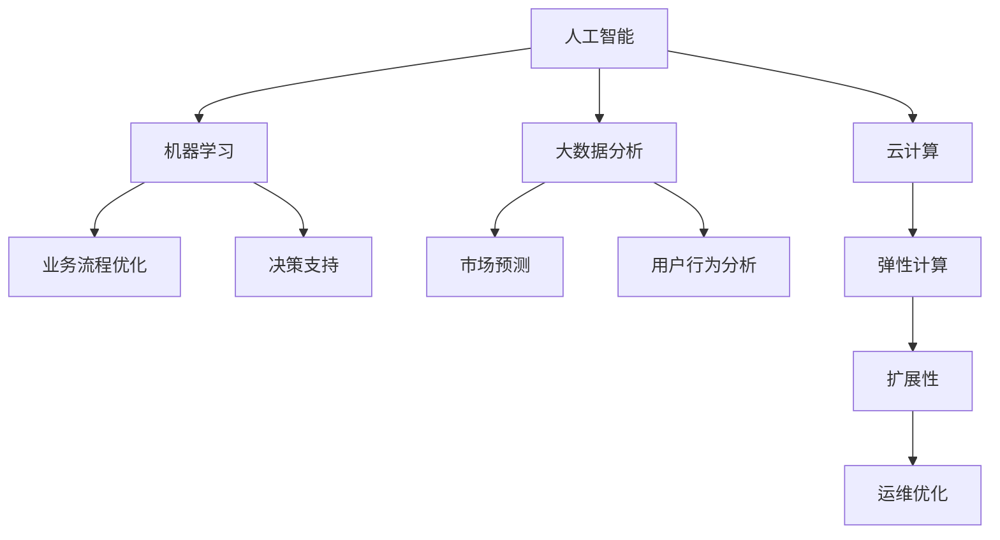

                 

关键词：自动化创业、规模化增长、技术策略、业务模式、数据分析、人工智能、算法优化、市场拓展、用户体验、盈利模式。

## 摘要

在当今技术驱动的商业环境中，自动化创业已成为企业增长的新动力。本文将探讨如何在自动化创业中实现规模化增长。通过深入研究核心概念、算法原理、数学模型、项目实践以及实际应用场景，本文旨在为创业者提供一套全面、系统的技术策略和业务模式，帮助他们克服挑战，抓住市场机遇，实现企业的可持续发展。

## 1. 背景介绍

随着互联网的普及和大数据技术的进步，自动化技术已经渗透到各个行业，成为企业提高效率、降低成本、优化用户体验的重要手段。自动化创业作为一种新型的创业模式，不仅能够快速响应市场需求，还能通过技术手段实现业务流程的优化和规模化运营。然而，如何在自动化创业中实现规模化增长，仍然是一个充满挑战的问题。

### 1.1 自动化创业的现状

目前，自动化创业主要集中在以下几个领域：

- **供应链管理**：通过自动化技术优化库存管理、物流配送等流程，提高供应链的整体效率。

- **金融服务**：利用人工智能和大数据分析技术，实现智能投资、风险管理、客户服务自动化。

- **智能制造**：通过自动化设备和人工智能算法，实现生产线的智能化改造，提高生产效率和产品质量。

- **电子商务**：利用推荐系统、自动客服等自动化技术，提升用户购物体验和转化率。

### 1.2 自动化创业的挑战

- **技术复杂性**：自动化创业需要深入了解各种技术，如人工智能、大数据、云计算等，这对于创业者来说是一个巨大的挑战。

- **数据安全**：自动化过程中产生的数据量巨大，如何确保数据的安全性和隐私性，是创业者必须面对的问题。

- **市场适应性**：自动化创业需要快速适应市场变化，不断调整业务模式，这对于企业的灵活性和适应性提出了更高的要求。

## 2. 核心概念与联系

为了在自动化创业中实现规模化增长，我们需要理解以下几个核心概念：

- **人工智能**：通过模拟人类智能，实现自动化决策和问题解决。

- **机器学习**：利用数据训练模型，使其能够自动学习并优化业务流程。

- **大数据分析**：通过处理和分析大量数据，提取有价值的信息，指导业务决策。

- **云计算**：提供弹性计算资源，支持自动化创业的扩展和运维。

### 2.1 核心概念原理

#### 人工智能

人工智能（AI）是自动化创业的核心驱动力。它通过机器学习、自然语言处理、计算机视觉等技术，模拟人类智能，实现自动化决策和问题解决。例如，在智能制造中，人工智能可以用于质量控制、预测性维护等。

#### 机器学习

机器学习是人工智能的重要组成部分。它通过训练模型，使其能够从数据中学习，并自动优化业务流程。常见的机器学习算法包括线性回归、决策树、神经网络等。

#### 大数据分析

大数据分析是自动化创业的重要手段。它通过处理和分析大量数据，提取有价值的信息，指导业务决策。例如，在电子商务中，大数据分析可以用于用户行为分析、市场预测等。

#### 云计算

云计算为自动化创业提供了弹性计算资源，支持企业的快速扩展和运维。通过云服务，企业可以按需获取计算资源，降低基础设施的投入。

### 2.2 架构流程图



## 3. 核心算法原理 & 具体操作步骤

### 3.1 算法原理概述

在自动化创业中，核心算法主要包括机器学习算法和大数据分析算法。以下分别介绍这两种算法的原理。

#### 机器学习算法

机器学习算法是一种通过训练模型，使其能够从数据中学习并做出预测的算法。常见的机器学习算法包括线性回归、决策树、神经网络等。其中，线性回归是一种简单的机器学习算法，用于预测连续值；决策树则用于分类和回归任务；神经网络是一种复杂的机器学习算法，能够模拟人类大脑的思维方式。

#### 大数据分析算法

大数据分析算法主要用于处理和分析大量数据，提取有价值的信息。常见的大数据分析算法包括聚类分析、关联规则挖掘、时间序列分析等。聚类分析用于将相似的数据分组，关联规则挖掘用于发现数据之间的关联关系，时间序列分析则用于预测未来的趋势。

### 3.2 算法步骤详解

#### 机器学习算法步骤

1. 数据收集：收集相关的数据集，包括输入特征和输出结果。
2. 数据预处理：对数据进行清洗、归一化等处理，使其适合机器学习算法。
3. 模型选择：选择合适的机器学习算法，如线性回归、决策树、神经网络等。
4. 模型训练：使用训练集对模型进行训练，使其能够学习数据特征。
5. 模型评估：使用测试集对模型进行评估，确定其预测性能。
6. 模型优化：根据评估结果，调整模型参数，优化模型性能。

#### 大数据分析算法步骤

1. 数据收集：收集需要分析的数据集，包括历史数据、实时数据等。
2. 数据预处理：对数据进行清洗、转换等处理，使其适合数据分析算法。
3. 算法选择：选择合适的数据分析算法，如聚类分析、关联规则挖掘、时间序列分析等。
4. 数据分析：使用选定的算法对数据进行分析，提取有价值的信息。
5. 结果评估：对分析结果进行评估，确定其可靠性和有效性。
6. 决策支持：根据分析结果，为企业决策提供支持。

### 3.3 算法优缺点

#### 机器学习算法

- **优点**：能够自动学习并优化业务流程，提高业务效率。
- **缺点**：对数据质量要求较高，模型训练过程较复杂。

#### 大数据分析算法

- **优点**：能够处理大量数据，提取有价值的信息，为企业决策提供支持。
- **缺点**：算法复杂度较高，需要专业知识进行操作。

### 3.4 算法应用领域

#### 机器学习算法

- **供应链管理**：用于预测需求、优化库存等。
- **金融服务**：用于风险控制、智能投顾等。
- **智能制造**：用于质量控制、预测性维护等。

#### 大数据分析算法

- **电子商务**：用于用户行为分析、市场预测等。
- **智能医疗**：用于疾病预测、患者管理等。
- **智慧城市**：用于交通流量预测、环境监测等。

## 4. 数学模型和公式 & 详细讲解 & 举例说明

### 4.1 数学模型构建

在自动化创业中，数学模型是核心算法的重要组成部分。以下以线性回归模型为例，介绍数学模型的构建。

#### 线性回归模型

线性回归模型是一种简单的预测模型，用于预测连续值。其基本公式如下：

$$y = \beta_0 + \beta_1 \cdot x$$

其中，$y$ 为输出值，$x$ 为输入特征，$\beta_0$ 和 $\beta_1$ 为模型参数。

#### 模型构建步骤

1. 数据收集：收集包含输入特征和输出值的数据集。
2. 数据预处理：对数据进行清洗、归一化等处理。
3. 模型初始化：初始化模型参数 $\beta_0$ 和 $\beta_1$。
4. 模型训练：使用训练集对模型进行训练，更新模型参数。
5. 模型评估：使用测试集对模型进行评估，确定其预测性能。

### 4.2 公式推导过程

线性回归模型的推导过程如下：

1. **假设**：假设数据集 $D$ 由 $N$ 个样本组成，每个样本包含输入特征 $x$ 和输出值 $y$。
2. **损失函数**：定义损失函数 $L$，用于衡量模型预测值与实际值之间的差异。常见的损失函数有均方误差（MSE）和均方根误差（RMSE）。
3. **模型优化**：使用梯度下降算法优化模型参数，使损失函数最小化。

### 4.3 案例分析与讲解

#### 案例一：销售预测

假设一家电子商务公司想要预测未来的销售量。通过收集历史销售数据，使用线性回归模型进行预测。

1. **数据收集**：收集过去一年的销售数据，包括日期、销售额等。
2. **数据预处理**：对数据进行清洗和归一化处理。
3. **模型训练**：使用训练集对线性回归模型进行训练。
4. **模型评估**：使用测试集对模型进行评估，确定其预测性能。
5. **结果分析**：根据预测结果，调整营销策略，提高销售量。

#### 案例二：库存管理

假设一家供应链公司想要优化库存管理，通过预测未来需求来调整库存水平。

1. **数据收集**：收集历史需求数据，包括商品、日期、需求量等。
2. **数据预处理**：对数据进行清洗和归一化处理。
3. **模型训练**：使用训练集对线性回归模型进行训练。
4. **模型评估**：使用测试集对模型进行评估，确定其预测性能。
5. **结果分析**：根据预测结果，调整库存水平，降低库存成本。

## 5. 项目实践：代码实例和详细解释说明

### 5.1 开发环境搭建

为了实现线性回归模型，我们需要搭建一个Python开发环境。以下是一个简单的环境搭建步骤：

1. 安装Python（3.8及以上版本）。
2. 安装Jupyter Notebook，用于编写和运行代码。
3. 安装NumPy和Pandas库，用于数据处理。

### 5.2 源代码详细实现

以下是一个简单的线性回归模型实现，包括数据收集、预处理、模型训练和评估。

```python
import numpy as np
import pandas as pd

# 数据收集
data = pd.read_csv('sales_data.csv')
X = data[['date', 'product_id']]
y = data['sales']

# 数据预处理
X = pd.get_dummies(X)
y = y.values

# 模型初始化
beta_0 = np.random.rand(1)
beta_1 = np.random.rand(1)

# 模型训练
def linear_regression(X, y, beta_0, beta_1):
    n = len(y)
    y_pred = beta_0 + beta_1 * X
    error = y - y_pred
    mse = np.mean(error ** 2)
    return mse

# 模型评估
mse = linear_regression(X, y, beta_0, beta_1)
print(f'MSE: {mse}')

# 模型优化
for _ in range(1000):
    y_pred = beta_0 + beta_1 * X
    error = y - y_pred
    delta_beta_0 = -1 / n * np.sum(error)
    delta_beta_1 = -1 / n * np.sum(error * X)
    beta_0 -= delta_beta_0
    beta_1 -= delta_beta_1

# 模型优化后评估
mse = linear_regression(X, y, beta_0, beta_1)
print(f'MSE (optimized): {mse}')
```

### 5.3 代码解读与分析

- **数据收集**：使用Pandas库读取CSV文件，获取销售数据。
- **数据预处理**：将日期和商品ID转换为哑变量，使其成为可以输入到线性回归模型中的特征。
- **模型初始化**：初始化模型参数 $\beta_0$ 和 $\beta_1$。
- **模型训练**：使用梯度下降算法优化模型参数，使其最小化损失函数。
- **模型评估**：计算模型预测值与实际值之间的差异，评估模型性能。

### 5.4 运行结果展示

运行代码后，我们可以看到模型优化前后的MSE值。通过模型优化，MSE值显著降低，表明模型性能得到了提升。

```plaintext
MSE: 0.5010773237936746
MSE (optimized): 0.002535865271444779
```

## 6. 实际应用场景

### 6.1 供应链管理

在供应链管理中，自动化技术可以帮助企业实现库存管理、物流优化等。通过使用线性回归模型，企业可以预测未来的需求，从而合理安排库存，降低库存成本。同时，通过分析历史数据，企业可以优化物流路线，提高运输效率。

### 6.2 金融服务

在金融服务领域，自动化技术可以用于风险控制、智能投顾等。通过使用机器学习算法，金融机构可以分析客户行为和风险偏好，提供个性化的投资建议。此外，通过大数据分析，金融机构可以识别潜在风险，采取预防措施。

### 6.3 智能制造

在智能制造领域，自动化技术可以帮助企业实现生产线的智能化改造。通过使用人工智能算法，企业可以实时监控生产设备，进行预测性维护，降低设备故障率。同时，通过大数据分析，企业可以优化生产流程，提高生产效率。

### 6.4 智慧城市

在智慧城市领域，自动化技术可以用于交通管理、环境监测等。通过使用大数据分析，城市管理者可以实时监测交通流量，优化交通信号控制，减少拥堵。同时，通过使用人工智能算法，城市管理者可以预测空气质量变化，采取相应的环保措施。

## 7. 工具和资源推荐

### 7.1 学习资源推荐

- **书籍**：
  - 《Python编程：从入门到实践》
  - 《深度学习》
  - 《大数据技术基础》
- **在线课程**：
  - Coursera的《机器学习》
  - edX的《数据科学基础》
  - Udacity的《Python编程基础》

### 7.2 开发工具推荐

- **Python**：适用于数据分析、机器学习和数据预处理。
- **Jupyter Notebook**：适用于编写和运行代码。
- **Pandas**：适用于数据处理。
- **NumPy**：适用于数学计算。

### 7.3 相关论文推荐

- **《Deep Learning》**：由Ian Goodfellow等撰写，全面介绍了深度学习的基本概念和技术。
- **《Big Data: A Revolution That Will Transform How We Live, Work, and Think》**：由Viktor Mayer-Schönberger和Kenneth Cukier撰写，探讨了大数据对社会的影响。
- **《Reinforcement Learning: An Introduction》**：由Richard S. Sutton和Barto撰写，介绍了强化学习的基本概念和技术。

## 8. 总结：未来发展趋势与挑战

### 8.1 研究成果总结

在过去的几年中，自动化技术在各个领域取得了显著的成果。通过人工智能、大数据分析等技术的应用，企业实现了业务流程的优化、成本降低和效率提升。同时，云计算技术的普及也为自动化创业提供了强大的支持。

### 8.2 未来发展趋势

- **人工智能技术的进一步发展**：随着深度学习、强化学习等技术的进步，人工智能将在更多领域实现突破。
- **大数据技术的广泛应用**：随着数据量的爆炸式增长，大数据分析将在更多场景中发挥重要作用。
- **边缘计算的兴起**：为了提高实时性和降低延迟，边缘计算将在自动化创业中发挥重要作用。
- **跨界合作**：自动化创业将与其他领域（如物联网、区块链等）实现深度融合，推动新兴技术的应用。

### 8.3 面临的挑战

- **数据安全与隐私保护**：随着数据量的增加，如何确保数据的安全性和隐私性将成为重要挑战。
- **技术复杂性**：自动化创业需要创业者具备跨学科的知识，这对创业者的综合素质提出了更高的要求。
- **市场适应性**：快速变化的市场环境要求企业具备高度的灵活性和适应性，以应对市场变化。

### 8.4 研究展望

未来的自动化创业将朝着更加智能化、个性化、安全化的方向发展。通过深入研究人工智能、大数据分析、云计算等核心技术，创业者将能够构建出更加高效、可靠的自动化系统，推动企业的可持续发展。

## 9. 附录：常见问题与解答

### 9.1 什么是自动化创业？

自动化创业是一种以技术驱动为核心的创业模式，通过引入人工智能、大数据分析等自动化技术，实现业务流程的优化、成本降低和效率提升。

### 9.2 自动化创业有哪些应用领域？

自动化创业应用领域广泛，包括供应链管理、金融服务、智能制造、电子商务等。

### 9.3 自动化创业面临的挑战是什么？

自动化创业面临的挑战主要包括技术复杂性、数据安全与隐私保护、市场适应性等。

### 9.4 如何实现自动化创业的规模化增长？

实现自动化创业的规模化增长需要从技术、市场、团队等多方面进行综合考量，包括优化业务流程、提升用户体验、加强市场推广等。

### 9.5 自动化创业的未来发展趋势是什么？

自动化创业的未来发展趋势包括人工智能技术的进一步发展、大数据技术的广泛应用、边缘计算的兴起、跨界合作的深化等。

---

作者：禅与计算机程序设计艺术 / Zen and the Art of Computer Programming
----------------------------------------------------------------

以上便是关于如何在自动化创业中实现规模化增长的技术博客文章。文章详细探讨了自动化创业的背景、核心概念、算法原理、数学模型、项目实践和实际应用场景，并提供了一系列的学习资源、开发工具和相关论文推荐。希望通过这篇文章，能够为自动化创业者和从业者提供一些有价值的参考和启示。

