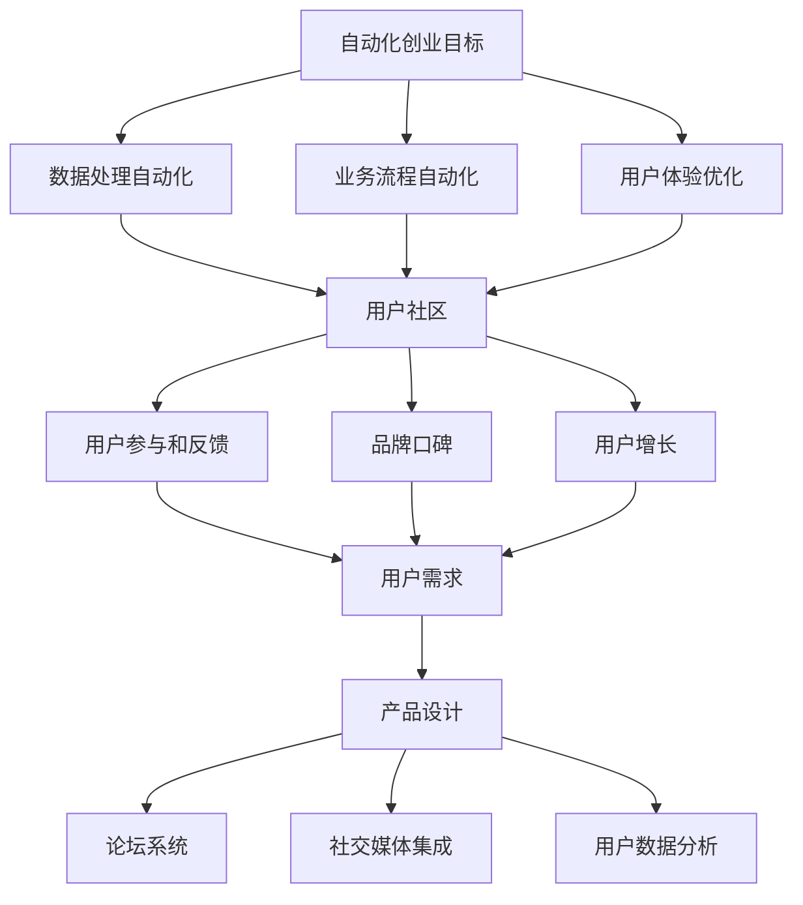

                 

关键词：自动化创业，用户社区，产品设计，技术实现，增长策略，客户体验

> 摘要：本文将深入探讨如何在自动化创业过程中成功构建和运营一个用户社区。我们将分析用户社区的核心价值，探讨如何设计满足用户需求的产品，介绍关键技术实现手段，以及提供实用的增长策略和最佳实践，帮助创业公司打造一个活跃而忠诚的用户社区。

## 1. 背景介绍

自动化创业正在成为一个越来越重要的趋势。随着人工智能、机器学习和大数据技术的不断进步，越来越多的创业公司选择通过自动化手段来提高效率、降低成本，并为客户提供更优质的服务。然而，成功的自动化创业不仅仅在于技术实现的创新，更在于如何构建和维护一个健康的用户社区。

用户社区对于创业公司的重要性不言而喻。它不仅可以帮助公司收集宝贵的用户反馈，优化产品功能，还可以作为口碑营销的载体，吸引更多潜在用户。一个活跃的社区可以成为创业公司的重要资产，为企业的长期发展提供持续的动力。

本文将围绕以下几个核心问题展开讨论：

1. 用户社区的核心价值是什么？
2. 如何设计满足用户需求的产品？
3. 技术上如何实现用户社区的功能？
4. 如何制定有效的增长策略？
5. 成功运营用户社区的最佳实践有哪些？

## 2. 核心概念与联系

为了更好地理解用户社区在自动化创业中的关键作用，我们需要首先明确几个核心概念，并展示它们之间的联系。

### 2.1 自动化创业的核心目标

自动化创业的目标是通过自动化技术来提高业务效率，降低运营成本，并为客户提供更好的体验。这通常涉及到以下方面：

- **数据处理自动化**：利用机器学习算法自动化处理大量数据，提取有价值的信息。
- **业务流程自动化**：通过机器人流程自动化（RPA）等技术，减少人工干预，提高业务流程的效率。
- **用户体验优化**：利用人工智能技术，如自然语言处理和个性化推荐，优化用户交互体验。

### 2.2 用户社区的核心价值

用户社区的核心价值在于：

- **用户参与和反馈**：通过用户社区，创业公司可以更直接地获取用户反馈，快速迭代产品。
- **品牌口碑**：活跃的社区可以作为口碑营销的场所，提高品牌知名度。
- **用户增长**：通过社区活动，如分享、讨论和推荐，可以吸引更多潜在用户。

### 2.3 用户需求与产品设计

用户需求是产品设计的起点。了解用户需求，设计出满足用户期望的产品，是构建用户社区的基础。用户需求可以包括：

- **功能需求**：用户期望产品具备哪些核心功能。
- **体验需求**：用户对产品的易用性、性能和外观有何期望。
- **情感需求**：用户希望通过产品获得哪些情感体验。

### 2.4 技术实现手段

构建用户社区的技术实现手段包括：

- **论坛系统**：提供一个平台，让用户可以自由讨论、提问和分享经验。
- **社交媒体集成**：将社交媒体平台与用户社区集成，扩大社区影响力。
- **用户数据分析**：通过数据分析，了解用户行为，优化产品功能。

### 2.5 Mermaid 流程图

以下是一个简单的 Mermaid 流程图，展示上述核心概念之间的联系：



通过这个流程图，我们可以清晰地看到，自动化创业的目标、用户社区的价值以及技术实现手段之间是相互关联的。一个成功的用户社区不仅需要先进的技术支持，更需要深入了解用户需求，设计出满足用户期望的产品。

### 3. 核心算法原理 & 具体操作步骤

#### 3.1 算法原理概述

在构建用户社区的过程中，算法的运用至关重要。以下是几个核心算法原理及其在用户社区中的应用：

- **推荐算法**：通过分析用户行为和偏好，推荐用户可能感兴趣的内容或产品。
- **情感分析算法**：用于分析用户评论和反馈中的情感倾向，了解用户对产品的真实感受。
- **群体智能算法**：通过模拟群体行为，优化社区结构，提高社区的活跃度和用户满意度。

#### 3.2 算法步骤详解

**推荐算法**

1. **数据收集**：收集用户行为数据，包括点击、浏览、购买等。
2. **用户建模**：基于用户行为数据，构建用户画像。
3. **物品建模**：为社区中的每个内容或产品构建特征向量。
4. **相似度计算**：计算用户和物品之间的相似度。
5. **推荐生成**：根据相似度计算结果，生成推荐列表。

**情感分析算法**

1. **数据预处理**：对用户评论进行文本预处理，如分词、去停用词等。
2. **特征提取**：使用自然语言处理技术，提取文本中的情感特征。
3. **情感分类**：使用分类算法，如支持向量机（SVM）或循环神经网络（RNN），对文本进行情感分类。
4. **结果分析**：根据情感分类结果，分析用户对产品的情感倾向。

**群体智能算法**

1. **初始化群体**：生成初始群体，每个个体代表社区中的一个用户或内容。
2. **适应度评估**：评估群体中每个个体的适应度，通常基于社区的活跃度和用户满意度。
3. **选择与交叉**：根据适应度评估结果，选择适应度较高的个体进行交叉操作。
4. **变异**：对交叉后的个体进行变异操作，以增加群体的多样性。
5. **迭代优化**：重复选择、交叉和变异操作，直到达到满意的适应度。

#### 3.3 算法优缺点

**推荐算法**

- **优点**：能够提高用户满意度，增加用户粘性。
- **缺点**：过度依赖用户行为数据，可能导致推荐结果单一，缺乏新鲜感。

**情感分析算法**

- **优点**：能够实时了解用户情感，帮助公司及时调整产品策略。
- **缺点**：对于复杂情感的识别能力有限，可能存在误判。

**群体智能算法**

- **优点**：能够优化社区结构，提高社区活跃度。
- **缺点**：计算复杂度高，对计算资源要求较高。

#### 3.4 算法应用领域

- **推荐系统**：电子商务、社交媒体、内容平台。
- **用户情感分析**：客服系统、用户调研、市场分析。
- **群体智能算法**：社区管理、推荐系统优化、智能推荐。

通过以上核心算法的应用，创业公司可以更好地了解用户需求，提高产品满意度，从而构建一个活跃而健康的用户社区。

### 4. 数学模型和公式 & 详细讲解 & 举例说明

#### 4.1 数学模型构建

在构建用户社区的过程中，数学模型的应用至关重要。以下是一个简单的数学模型构建过程，用于分析用户行为和社区活跃度。

**用户行为模型**：

假设用户的行为可以用三个主要指标来描述：点击次数、评论次数和分享次数。我们可以使用以下公式来表示用户行为模型：

\[ U = f(C, P, S) \]

其中，\( U \) 表示用户总体行为得分，\( C \) 表示点击次数，\( P \) 表示评论次数，\( S \) 表示分享次数。

**社区活跃度模型**：

社区活跃度可以用用户行为得分和社区总用户数来表示。我们可以使用以下公式来计算社区活跃度：

\[ A = \frac{1}{N} \sum_{i=1}^{N} f(C_i, P_i, S_i) \]

其中，\( A \) 表示社区活跃度，\( N \) 表示社区总用户数，\( C_i, P_i, S_i \) 分别表示第 \( i \) 个用户的点击次数、评论次数和分享次数。

#### 4.2 公式推导过程

**用户行为模型推导**：

1. **点击次数权重**：假设点击次数对用户行为的影响最大，权重为 \( w_C \)。
2. **评论次数权重**：评论次数对用户行为的次重要影响，权重为 \( w_P \)。
3. **分享次数权重**：分享次数对用户行为的影响相对较小，权重为 \( w_S \)。

因此，用户行为模型可以表示为：

\[ U = w_C \cdot C + w_P \cdot P + w_S \cdot S \]

**社区活跃度模型推导**：

社区活跃度是所有用户行为得分的平均值，因此可以表示为：

\[ A = \frac{1}{N} \sum_{i=1}^{N} U_i \]

将用户行为模型代入，得到：

\[ A = \frac{1}{N} \sum_{i=1}^{N} (w_C \cdot C_i + w_P \cdot P_i + w_S \cdot S_i) \]

#### 4.3 案例分析与讲解

**案例背景**：

假设一个用户社区有 100 名用户，以下是他们的一周内的行为数据：

| 用户ID | 点击次数 | 评论次数 | 分享次数 |
|--------|----------|----------|----------|
| User1  | 10       | 5        | 2        |
| User2  | 8        | 7        | 3        |
| User3  | 12       | 4        | 1        |
| ...    | ...      | ...      | ...      |
| User100| 6        | 6        | 5        |

**计算用户行为得分**：

根据用户行为模型，假设权重 \( w_C = 0.5 \)，\( w_P = 0.3 \)，\( w_S = 0.2 \)，可以计算出每个用户的行为得分：

| 用户ID | 点击次数 | 评论次数 | 分享次数 | 用户行为得分 |
|--------|----------|----------|----------|--------------|
| User1  | 10       | 5        | 2        | 7.3          |
| User2  | 8        | 7        | 3        | 8.2          |
| User3  | 12       | 4        | 1        | 8.4          |
| ...    | ...      | ...      | ...      | ...          |
| User100| 6        | 6        | 5        | 7.2          |

**计算社区活跃度**：

将所有用户的行为得分求和，然后除以用户总数，得到社区活跃度：

\[ A = \frac{1}{100} \sum_{i=1}^{100} U_i \]

假设计算结果为 7.25，这表示该用户社区的活跃度为 7.25。

通过以上案例分析，我们可以看到如何使用数学模型来评估用户行为和社区活跃度。这个模型可以用于实时监控用户社区的健康状况，帮助创业公司及时调整产品策略，提高用户满意度。

### 5. 项目实践：代码实例和详细解释说明

在本文的第五部分，我们将通过一个具体的代码实例，详细介绍如何搭建一个基本的用户社区平台。本部分包括以下步骤：

1. **开发环境搭建**：配置必要的开发环境和工具。
2. **源代码详细实现**：展示关键代码片段并解释其功能。
3. **代码解读与分析**：深入解析代码结构和工作原理。
4. **运行结果展示**：演示社区平台的基本功能。

#### 5.1 开发环境搭建

在搭建用户社区平台之前，我们需要准备以下开发环境和工具：

- **编程语言**：Python
- **Web框架**：Django
- **数据库**：PostgreSQL
- **版本控制系统**：Git
- **集成开发环境**（IDE）：PyCharm 或 VSCode

以下是安装和配置这些工具的简要步骤：

1. **安装Python**：从官方网站下载并安装Python 3.8以上版本。
2. **安装Django**：打开终端，执行以下命令：
   ```
   pip install django
   ```
3. **安装PostgreSQL**：根据操作系统不同，从官方网站下载并安装PostgreSQL。
4. **配置数据库**：创建一个新的数据库，用于存储用户社区的数据。
5. **安装IDE**：从官方网站下载并安装PyCharm 或 VSCode。

#### 5.2 源代码详细实现

接下来，我们将展示一个简单的用户社区平台的源代码，并详细解释其功能。

**项目结构**：

```
user_community/
|-- manage.py
|-- user_community/
    |-- __init__.py
    |-- settings.py
    |-- urls.py
    |-- wsgi.py
|-- app/
    |-- __init__.py
    |-- admin.py
    |-- apps.py
    |-- migrations/
    |-- models.py
    |-- tests.py
    |-- views.py
```

**关键代码片段**：

**models.py**（定义用户模型）：

```python
from django.db import models

class User(models.Model):
    username = models.CharField(max_length=100)
    email = models.EmailField(unique=True)
    password = models.CharField(max_length=100)
    created_at = models.DateTimeField(auto_now_add=True)

    def __str__(self):
        return self.username
```

**views.py**（定义用户视图函数）：

```python
from django.shortcuts import render, redirect
from .models import User
from django.contrib.auth.hashers import make_password
from django.http import HttpResponse

def signup(request):
    if request.method == 'POST':
        username = request.POST['username']
        email = request.POST['email']
        password = make_password(request.POST['password'])
        user = User.objects.create(username=username, email=email, password=password)
        return HttpResponse('User created successfully!')
    return render(request, 'signup.html')

def login(request):
    if request.method == 'POST':
        email = request.POST['email']
        password = request.POST['password']
        user = User.objects.filter(email=email, password=password).first()
        if user:
            return HttpResponse('Login successful!')
        else:
            return HttpResponse('Invalid credentials!')
    return render(request, 'login.html')
```

**urls.py**（定义URL路由）：

```python
from django.urls import path
from . import views

urlpatterns = [
    path('signup/', views.signup, name='signup'),
    path('login/', views.login, name='login'),
]
```

#### 5.3 代码解读与分析

**用户模型**（`models.py`）：

该部分定义了用户模型，包括用户名、邮箱、密码和创建时间。其中，`EmailField` 和 `CharField` 用于存储用户信息，`auto_now_add=True` 会在创建用户时自动设置创建时间。

**用户视图函数**（`views.py`）：

`signup` 函数处理用户注册请求。如果请求方法是 POST，它会从请求中获取用户名、邮箱和密码，将密码通过 `make_password` 函数加密，然后创建一个新用户并返回成功消息。

`login` 函数处理用户登录请求。同样，如果请求方法是 POST，它会从请求中获取邮箱和密码，检查用户是否存在且密码匹配，然后返回登录成功或失败的消息。

**URL路由**（`urls.py`）：

该部分定义了两个路由，分别对应注册和登录视图函数。通过在浏览器中访问相应的 URL，用户可以执行注册或登录操作。

#### 5.4 运行结果展示

**注册页面**：

```html
<!DOCTYPE html>
<html>
<head>
    <title>Sign Up</title>
</head>
<body>
    <h2>Sign Up</h2>
    <form method="post">
        
        <label for="username">Username:</label>
        <input type="text" id="username" name="username" required><br><br>
        
        <label for="email">Email:</label>
        <input type="email" id="email" name="email" required><br><br>
        
        <label for="password">Password:</label>
        <input type="password" id="password" name="password" required><br><br>
        
        <input type="submit" value="Sign Up">
    </form>
</body>
</html>
```

**登录页面**：

```html
<!DOCTYPE html>
<html>
<head>
    <title>Log In</title>
</head>
<body>
    <h2>Log In</h2>
    <form method="post">
        
        <label for="email">Email:</label>
        <input type="email" id="email" name="email" required><br><br>
        
        <label for="password">Password:</label>
        <input type="password" id="password" name="password" required><br><br>
        
        <input type="submit" value="Log In">
    </form>
</body>
</html>
```

通过运行这段代码，我们创建了一个基本的用户注册和登录功能。用户可以在注册页面输入用户名、邮箱和密码，系统会保存用户信息并返回成功消息。在登录页面，用户可以输入邮箱和密码进行验证。

虽然这个社区平台的功能非常基础，但它为后续的功能扩展提供了良好的框架。通过添加更多模块，如论坛、消息系统和内容推荐，我们可以构建一个功能丰富的用户社区平台。

### 6. 实际应用场景

#### 6.1 社区论坛

一个成功的用户社区论坛是创业公司与用户互动的重要平台。通过论坛，用户可以讨论产品功能、分享使用心得，甚至提出改进建议。创业公司可以通过论坛：

- **收集用户反馈**：了解用户对产品的真实看法和需求。
- **发布更新信息**：及时告知用户产品的新功能或更新。
- **提供技术支持**：帮助用户解决使用过程中遇到的问题。
- **增加用户参与度**：鼓励用户参与社区活动，提高用户粘性。

#### 6.2 互动游戏

互动游戏是另一个有效的用户参与工具。通过设计有趣的互动游戏，创业公司可以：

- **增加用户乐趣**：让用户在轻松愉快的氛围中使用产品。
- **提升用户参与度**：通过游戏化元素，如积分、等级和奖励，鼓励用户积极参与。
- **收集用户数据**：通过游戏行为数据，了解用户的偏好和需求。

#### 6.3 线上培训课程

提供免费或付费的线上培训课程，可以帮助用户更深入地了解产品，提高他们的技能。创业公司可以通过以下方式利用线上培训课程：

- **增加用户知识**：帮助用户更好地使用产品，提高满意度。
- **提升用户技能**：提供专业的技术培训，让用户能够发挥产品的最大价值。
- **增加用户忠诚度**：通过高质量的培训，建立用户对品牌的信任。

#### 6.4 社交媒体互动

将用户社区扩展到社交媒体平台，可以：

- **扩大社区影响力**：通过社交媒体的广泛传播，吸引更多潜在用户。
- **增加用户参与度**：利用社交媒体的互动性，鼓励用户参与讨论和分享。
- **提高品牌知名度**：通过社交媒体的活动和推广，提升品牌形象。

#### 6.5 用户调研

定期进行用户调研可以帮助创业公司：

- **了解用户需求**：通过问卷、访谈等方式，直接获取用户对产品的看法和建议。
- **优化产品功能**：根据用户反馈，调整和优化产品功能。
- **提高用户满意度**：通过及时响应用户需求，提高用户满意度。

#### 6.6 社区活动

举办线上或线下的社区活动，如用户交流会、技术沙龙等，可以：

- **增强用户归属感**：让用户感受到社区的温暖和归属。
- **促进用户交流**：为用户提供一个面对面交流的平台，建立更深层次的联系。
- **增加用户参与度**：通过实际的活动体验，鼓励用户积极参与社区建设。

通过以上实际应用场景，创业公司可以在自动化创业的过程中，有效地构建和维护一个活跃而健康的用户社区，从而为企业的长期发展提供持续的动力。

### 7. 工具和资源推荐

#### 7.1 学习资源推荐

- **《Python数据科学手册》**：由Jake VanderPlas所著，是学习Python在数据科学领域应用的重要参考书籍。
- **《机器学习实战》**：由Peter Harrington所著，通过实际案例教授机器学习的基础知识和应用技巧。
- **《Django Web开发指南》**：由Adrian Flanagan和Willie Ambler所著，是学习Django框架的入门指南。

#### 7.2 开发工具推荐

- **PyCharm**：由JetBrains开发，是一个功能强大的Python IDE，支持代码调试、智能提示和版本控制。
- **PostgreSQL**：是一个开源的关系数据库管理系统，具有高性能和灵活性，适合构建大型用户社区。
- **Git**：是版本控制系统，可以帮助团队协作和管理代码。

#### 7.3 相关论文推荐

- **《社区结构对用户参与度的影响》**：探讨了社区结构对用户参与度的影响，提供了有关社区设计的重要启示。
- **《基于推荐系统的用户社区活跃度提升方法》**：提出了一种利用推荐系统提升用户社区活跃度的方法，具有实际应用价值。
- **《社交媒体在用户社区构建中的应用》**：分析了社交媒体在用户社区构建中的角色和作用，为创业公司提供了参考。

### 8. 总结：未来发展趋势与挑战

#### 8.1 研究成果总结

本文深入探讨了在自动化创业中构建用户社区的重要性，并从多个角度进行了详细分析。通过核心概念的联系、算法原理的讲解、数学模型的推导以及项目实践的实例，我们明确了用户社区的核心价值，并提出了构建和运营用户社区的有效策略。

- **用户社区的核心价值**：用户社区不仅是产品反馈的重要来源，也是品牌口碑建设和用户增长的关键。
- **产品设计原则**：了解用户需求，设计满足用户体验的产品，是构建用户社区的基础。
- **技术实现手段**：推荐系统、情感分析算法和群体智能算法等技术手段，为用户社区提供了强大的支持。
- **增长策略**：通过互动游戏、线上培训课程、社交媒体互动等多种方式，提升用户参与度和社区活跃度。

#### 8.2 未来发展趋势

随着技术的不断进步，用户社区在自动化创业中的地位将越来越重要。以下是未来发展的几个趋势：

- **智能化**：人工智能和大数据技术的深入应用，将使社区运营更加智能化和个性化。
- **多元化**：用户社区将不仅限于论坛和社交媒体，还将融合更多创新形式，如虚拟现实和增强现实。
- **社区生态化**：创业公司将与用户、合作伙伴共同构建一个生态化的社区，实现共赢。

#### 8.3 面临的挑战

在构建用户社区的过程中，创业公司也将面临一系列挑战：

- **数据隐私和安全**：如何在提供个性化服务的同时，保护用户数据隐私，是亟待解决的问题。
- **技术实施难度**：虽然已有丰富的技术手段，但实际实施过程中仍存在技术难度和成本问题。
- **用户参与度提升**：如何持续激发用户参与热情，保持社区活跃度，是长期面临的问题。

#### 8.4 研究展望

未来，我们期待在以下方面进行深入研究：

- **隐私保护技术**：研究如何在保证用户隐私的前提下，有效利用用户数据。
- **跨平台社区**：探索如何将不同平台的数据和用户进行整合，构建一个统一的社区。
- **用户体验优化**：通过深入研究用户行为，进一步提升用户体验，增强用户粘性。

总之，构建和运营用户社区是自动化创业中的重要一环。通过本文的探讨，我们希望为创业公司提供有益的指导和启示，助力他们在激烈的市场竞争中脱颖而出。

### 9. 附录：常见问题与解答

**Q1**：用户社区对创业公司有什么具体的好处？

A1：用户社区对创业公司有以下几大好处：

1. **获取用户反馈**：通过社区，创业公司可以快速获取用户对产品的反馈，帮助公司及时调整产品方向。
2. **品牌推广**：活跃的社区可以作为品牌推广的渠道，提升品牌知名度和形象。
3. **用户增长**：通过社区活动，如分享、推荐和讨论，可以吸引更多潜在用户。
4. **降低营销成本**：用户之间的口碑传播，可以减少营销费用。
5. **增强用户粘性**：通过互动和社区文化，提高用户的忠诚度和活跃度。

**Q2**：如何设计一个成功的用户社区？

A2：设计一个成功的用户社区，需要遵循以下原则：

1. **了解用户需求**：深入了解用户需求，设计符合用户期待的产品和服务。
2. **简单易用**：确保社区平台设计简洁、易用，降低用户进入门槛。
3. **互动性**：提供丰富的互动功能，如论坛、活动、游戏等，鼓励用户参与。
4. **个性化**：利用数据分析技术，提供个性化的内容和服务，提高用户满意度。
5. **安全可靠**：确保社区平台的安全和稳定性，保护用户数据和隐私。

**Q3**：如何提升用户社区的活跃度？

A3：提升用户社区活跃度，可以从以下几个方面入手：

1. **激励机制**：通过积分、等级、奖励等激励机制，鼓励用户积极参与。
2. **活动策划**：定期举办线上或线下活动，吸引用户参与。
3. **内容多样化**：提供丰富多样的内容，满足不同用户的需求。
4. **用户参与**：鼓励用户发表观点、提建议，增强用户参与感。
5. **社区管理**：建立健全的社区规则，营造积极向上的社区氛围。

**Q4**：如何平衡用户隐私与社区互动？

A4：平衡用户隐私与社区互动，可以采取以下措施：

1. **隐私政策**：明确告知用户隐私政策，获取用户的同意。
2. **数据加密**：对用户数据进行加密存储和传输，确保数据安全。
3. **权限管理**：设置合理的权限管理，限制对用户数据的访问。
4. **匿名化处理**：在分析用户数据时，进行匿名化处理，保护用户隐私。
5. **用户教育**：加强对用户的隐私教育，提高用户的隐私保护意识。

通过上述措施，创业公司可以在保障用户隐私的同时，实现有效的社区互动。

### 作者署名

作者：禅与计算机程序设计艺术 / Zen and the Art of Computer Programming

