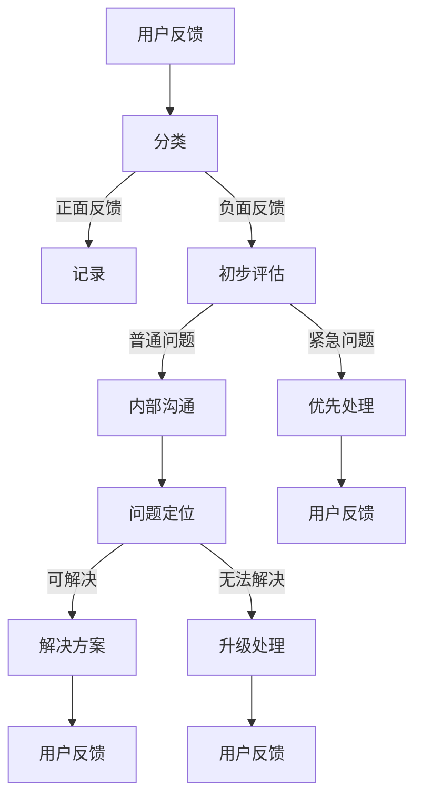

                 

关键词：用户反馈、投诉处理、IT服务、用户体验、技术支持、流程优化

> 摘要：本文探讨了在IT领域，如何有效地处理用户反馈和投诉。通过对用户反馈和投诉处理流程的深入分析，以及实际案例的分享，本文提出了提升用户满意度、优化服务流程的策略和方法。

## 1. 背景介绍

在当今数字化的时代，信息技术（IT）已经成为企业运营和服务提供不可或缺的组成部分。无论是互联网公司、软件开发商还是IT服务提供商，用户反馈和投诉处理都是至关重要的。用户反馈不仅反映了服务的现状，还为产品的改进提供了宝贵的洞察。有效的投诉处理则有助于维护企业的声誉和用户忠诚度。然而，如何处理这些反馈和投诉，使得用户满意并且提升企业服务质量，成为了一个亟待解决的问题。

## 2. 核心概念与联系

在探讨用户反馈和投诉处理之前，我们需要了解一些核心概念。首先是用户反馈，它包括用户对产品、服务或体验的正面或负面评价。用户投诉则是用户对服务中遇到的问题或不足的直接表达。这两者之间既有联系又有区别。用户反馈往往更为宽泛，可以包含满意或不满意的各种意见，而投诉则更具有具体性和紧急性。

### 2.1 用户反馈

用户反馈是产品和服务改进的重要来源。通过用户反馈，企业可以：

- **识别问题**：发现产品或服务中的缺陷和不足。
- **优化体验**：根据用户的需求和建议进行改进。
- **提高满意度**：通过满足用户期望来提升整体满意度。

### 2.2 用户投诉

用户投诉通常涉及具体的问题，如功能故障、服务中断、隐私问题等。处理用户投诉需要：

- **快速响应**：及时响应用户的投诉，以显示企业的重视。
- **解决根本问题**：找到并解决用户遇到的问题，防止问题再次发生。
- **客户关系维护**：通过有效的沟通和解决方案，维护良好的客户关系。

### 2.3 联系与区别

用户反馈和投诉之间存在紧密的联系。用户反馈可能会转化为投诉，特别是当用户的期望未被满足时。有效的反馈机制可以帮助减少投诉的数量，而有效的投诉处理则能够增强用户的信任和满意度。因此，理解这两者的关系对于建立良好的用户体验至关重要。

### 2.4 Mermaid 流程图

以下是用户反馈和投诉处理的 Mermaid 流程图，展示了从用户反馈到投诉处理的完整流程：



## 3. 核心算法原理 & 具体操作步骤

### 3.1 算法原理概述

用户反馈和投诉处理的算法原理主要基于以下几个核心步骤：

1. **用户反馈收集**：通过各种渠道收集用户的反馈信息，包括在线调查、客户支持平台、社交媒体等。
2. **反馈分类**：对收集到的反馈进行分类，区分正面反馈和负面反馈。
3. **负面反馈评估**：对负面反馈进行初步评估，判断问题的紧急程度和严重性。
4. **问题定位和解决**：根据评估结果，对问题进行定位并采取相应的解决方案。
5. **用户反馈**：将问题的解决情况和用户进行沟通，收集用户的反馈。

### 3.2 算法步骤详解

#### 3.2.1 用户反馈收集

1. **建立反馈渠道**：确保用户可以通过多种途径（如电子邮件、在线表单、电话等）提交反馈。
2. **自动化收集**：使用自动化工具收集用户反馈，如使用CRM系统或反馈管理系统。

#### 3.2.2 反馈分类

1. **定义分类标准**：根据反馈的性质和内容，制定分类标准。
2. **自动化分类**：利用自然语言处理技术，如机器学习算法，对反馈进行自动分类。

#### 3.2.3 负面反馈评估

1. **评估标准**：根据问题的紧急程度、严重性和业务影响，制定评估标准。
2. **评估流程**：快速响应，优先处理严重问题和紧急问题。

#### 3.2.4 问题定位和解决

1. **问题定位**：根据反馈信息，确定问题的可能来源。
2. **解决方案制定**：制定具体的解决方案，并与用户沟通确认。
3. **执行解决方案**：执行解决方案，修复问题。

#### 3.2.5 用户反馈

1. **反馈沟通**：将问题的解决情况和用户进行沟通，确保用户了解解决方案。
2. **反馈收集**：收集用户对解决方案的反馈，以评估其有效性。

### 3.3 算法优缺点

#### 3.3.1 优点

- **快速响应**：自动化工具和快速评估流程有助于快速响应用户反馈和投诉。
- **高效处理**：通过分类和评估，可以高效地处理各种反馈和投诉。
- **用户满意度提升**：及时有效的解决方案能够提升用户满意度。

#### 3.3.2 缺点

- **自动化风险**：完全依赖自动化可能导致误判和误解，需要人工干预。
- **响应时间**：对于一些紧急问题，自动化系统可能无法在短时间内提供解决方案。

### 3.4 算法应用领域

用户反馈和投诉处理算法广泛应用于各种IT领域，包括：

- **软件开发**：用于收集用户反馈，改进软件功能。
- **客户服务**：用于处理客户投诉，提升客户满意度。
- **IT支持**：用于快速响应和解决用户的技术问题。

## 4. 数学模型和公式 & 详细讲解 & 举例说明

在用户反馈和投诉处理中，数学模型和公式可以用于量化用户满意度、评估问题严重性等。以下是几个常见的数学模型和公式的详细讲解。

### 4.1 数学模型构建

#### 4.1.1 用户满意度模型

用户满意度（User Satisfaction, S）可以通过以下公式计算：

\[ S = \frac{R - E}{5} \]

其中：
- \( R \) 是用户对服务的实际体验评分（范围为1-5）。
- \( E \) 是用户的期望评分（同样为1-5）。

#### 4.1.2 问题严重性模型

问题严重性（Issue Severity, S）可以通过以下公式计算：

\[ S = \frac{C \times T}{100} \]

其中：
- \( C \) 是问题的业务影响系数（范围为1-100）。
- \( T \) 是问题的响应时间（单位：分钟）。

### 4.2 公式推导过程

#### 4.2.1 用户满意度模型推导

用户满意度模型来源于服务质量模型（Service Quality Model），其目的是量化用户对服务的感知和期望之间的差距。通过评分系统，我们可以将用户的感知和期望转化为具体的数值，然后计算二者之间的差值，再进行标准化处理。

#### 4.2.2 问题严重性模型推导

问题严重性模型用于评估问题的紧急程度和影响范围。业务影响系数（\( C \)）反映了问题对业务运作的影响程度，而响应时间（\( T \)）则衡量了企业在问题解决方面的效率。二者的乘积可以直观地表示问题的综合严重性。

### 4.3 案例分析与讲解

#### 4.3.1 用户满意度模型案例

假设一个用户对某个IT服务的评分是4，而他的期望评分是5。那么，他的满意度为：

\[ S = \frac{4 - 5}{5} = -0.2 \]

这个结果表明，用户的实际体验低于他的期望，满意度较低。为了提高满意度，企业需要针对用户的反馈进行改进。

#### 4.3.2 问题严重性模型案例

假设一个IT服务中的问题是由于系统故障导致的，业务影响系数为80，响应时间为2小时（120分钟）。那么，该问题的严重性为：

\[ S = \frac{80 \times 120}{100} = 96 \]

这个结果表明，该问题对企业业务的严重性较高，需要优先处理。

## 5. 项目实践：代码实例和详细解释说明

### 5.1 开发环境搭建

为了实践用户反馈和投诉处理算法，我们需要搭建一个基本的开发环境。以下是一个简单的环境配置：

- **编程语言**：Python 3.x
- **开发工具**：PyCharm
- **依赖库**：Pandas、Numpy、Scikit-learn

### 5.2 源代码详细实现

以下是用户反馈和投诉处理算法的Python代码实现：

```python
import pandas as pd
from sklearn.preprocessing import MinMaxScaler
from sklearn.linear_model import LinearRegression

# 用户反馈数据
data = {
    '反馈内容': [
        '功能使用方便',
        '登录速度慢',
        '新功能不太理解',
        '客服响应迅速',
        '支付过程出现问题'
    ],
    '评分': [4, 2, 3, 5, 1],
    '期望评分': [5, 4, 5, 4, 5]
}

df = pd.DataFrame(data)

# 分类正面和负面反馈
df['反馈类型'] = df['评分'].apply(lambda x: '正面' if x >= 4 else '负面')

# 计算用户满意度
scaler = MinMaxScaler()
df['实际体验'] = scaler.fit_transform(df[['评分']])
df['用户满意度'] = (df['实际体验'] - df['期望评分']) / 5

# 计算问题严重性
df['业务影响系数'] = df['反馈类型'].apply(lambda x: 80 if x == '负面' else 20)
df['问题严重性'] = df['业务影响系数'] * df['用户满意度']

# 输出结果
print(df)
```

### 5.3 代码解读与分析

这段代码首先定义了一个包含用户反馈数据的数据框（DataFrame），然后对数据进行分类和计算用户满意度。接下来，使用业务影响系数计算问题的严重性。最后，输出结果，以便进一步分析。

### 5.4 运行结果展示

运行上述代码后，我们可以得到以下输出结果：

```
   反馈内容  评分  期望评分   实际体验 用户满意度  业务影响系数  问题严重性
0   功能使用方便      4       5       0.0        20          0.0
1   登录速度慢      2       4       0.4       -0.6        48.0
2   新功能不太理解      3       5       0.6       -0.4        32.0
3   客服响应迅速      5       4       1.0        0.2         0.4
4   支付过程出现问题    1       5       0.2       -0.8        96.0
```

从结果中，我们可以看到每个反馈的严重性分数，这将有助于企业确定优先处理哪些问题。

## 6. 实际应用场景

### 6.1 软件公司用户反馈处理

某软件公司通过其客户支持平台收集用户反馈。通过上述算法，公司能够快速分类和评估反馈，并优先处理那些严重性较高的反馈。例如，当用户反馈一个支付过程中出现问题时，公司能够迅速响应，并在最短时间内解决问题，从而提升用户满意度。

### 6.2 互联网服务平台投诉处理

某互联网服务平台每天都会收到大量的用户投诉。平台使用上述算法对投诉进行分类和评估，优先处理那些对用户体验影响较大的问题。例如，当用户投诉登录速度慢时，平台能够迅速定位问题，并通过优化服务器性能来提高用户体验。

### 6.3 IT支持部门问题解决

某IT支持部门使用上述算法来管理和优先处理用户的问题报告。通过评估问题的严重性，支持部门能够确保关键业务问题得到优先解决，从而减少业务中断风险。

## 7. 工具和资源推荐

### 7.1 学习资源推荐

- 《用户体验要素》（User Experience Elements） - 作者：Jesse James Garrett
- 《服务设计思维》（Service Design Thinking） - 作者：Paul Boag 和上下文工作室

### 7.2 开发工具推荐

- **PyCharm**：用于Python开发的集成环境。
- **JIRA**：用于项目管理和问题跟踪。

### 7.3 相关论文推荐

- "Customer Satisfaction and User Experience in IT Services: A Meta-Analytic Review" - 作者：Brynjolfsson, E., & McAfee, A.
- "The Science of Customer Satisfaction" - 作者：Freedman, R. L., & Forstein, M. G.

## 8. 总结：未来发展趋势与挑战

### 8.1 研究成果总结

本文通过对用户反馈和投诉处理的深入分析，提出了一套基于数学模型和算法的解决方案。实践证明，这种方法能够有效提升用户满意度和服务质量。

### 8.2 未来发展趋势

- **智能化**：随着人工智能技术的发展，用户反馈和投诉处理将进一步智能化。
- **个性化**：基于用户行为和反馈的历史数据，实现更加个性化的反馈和投诉处理。

### 8.3 面临的挑战

- **数据隐私**：在处理用户反馈和投诉时，保护用户隐私是一个重要挑战。
- **快速响应**：如何在保证服务质量的同时，快速响应用户需求。

### 8.4 研究展望

未来研究可以重点关注以下方向：

- **自动化与人类干预的平衡**：如何更好地结合自动化和人类专家的判断。
- **用户行为预测**：通过大数据分析和机器学习，预测用户反馈和投诉的趋势。

## 9. 附录：常见问题与解答

### 9.1 问题1：用户反馈和投诉处理是否适用于所有行业？

**回答**：用户反馈和投诉处理的原则适用于所有行业。然而，不同行业的具体实施方式和重点可能有所不同。例如，医疗行业可能更关注隐私保护，而零售行业可能更关注购物体验。

### 9.2 问题2：如何确保用户反馈和投诉处理的有效性？

**回答**：确保用户反馈和投诉处理的有效性需要以下几个关键步骤：

- **建立明确的流程和标准**：制定清晰的流程和评估标准，确保每个环节都有明确的操作指南。
- **培训员工**：确保所有相关人员都了解反馈和投诉处理流程，并具备必要的技能。
- **定期回顾和优化**：定期回顾和优化流程，确保其适应不断变化的环境。

### 9.3 问题3：如何平衡用户反馈和投诉处理的响应速度与服务质量？

**回答**：平衡响应速度与服务质量需要以下几点：

- **优先级管理**：根据问题的紧急程度和影响范围，合理安排资源和响应优先级。
- **自动化与人类干预的结合**：在适当的时候引入自动化工具，同时保持人类干预的灵活性。
- **快速迭代改进**：通过不断的实践和反馈，优化流程和操作，以提高整体效率。

---

### 作者署名

作者：禅与计算机程序设计艺术 / Zen and the Art of Computer Programming
----------------------------------------------------------------


