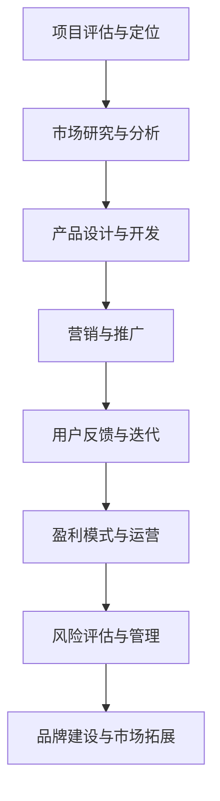

                 

关键词：Side Project，创业，独立开发者，职业转型，成功案例

> 摘要：本文将探讨如何将个人Side Project成功转化为主业，通过分享经验、策略和实践方法，帮助独立开发者实现职业转型，开启属于自己的创业之路。

## 1. 背景介绍

在当今数字化时代，越来越多的开发者选择开展Side Project，即在工作之外的个人项目。这些项目不仅能够丰富开发者的技能和经验，还可以成为实现职业转型的跳板。然而，将一个Side Project转化为主业并非易事，需要明确的策略和切实可行的步骤。

本文旨在为那些有志将个人项目转化为职业的开发者提供指导。我们将讨论如何评估项目潜力、制定营销策略、提升品牌知名度，并分享一些成功案例，以期为您的创业之路提供有益的启示。

### 1.1 Side Project的意义

Side Project对开发者来说意义重大：

- **技能提升**：通过参与不同的项目，开发者可以不断学习和掌握新技能。
- **实践经验**：实际操作项目可以帮助开发者更好地理解业务需求和问题解决方法。
- **职业拓展**：成功项目可能成为职业转型的契机，为开发者打开新的职业道路。
- **个人品牌**：优秀的项目可以帮助开发者建立个人品牌，提升市场竞争力。

### 1.2 创业之路的挑战

尽管Side Project具有诸多优势，但将其转化为主业也面临着诸多挑战：

- **资源限制**：资金、时间和人脉等资源可能成为制约因素。
- **市场定位**：需要明确目标市场和用户需求，避免盲目投入。
- **竞争压力**：面对众多竞争者，如何脱颖而出是关键。
- **风险管理**：包括技术风险、市场风险等，需要精心策划和管理。

### 1.3 文章结构

本文将分为以下几个部分：

1. **背景介绍**：阐述Side Project的重要性及其在职业转型中的作用。
2. **核心概念与联系**：通过Mermaid流程图展示项目转化过程中的关键环节。
3. **核心算法原理 & 具体操作步骤**：详细解析项目转化的策略和方法。
4. **数学模型和公式 & 详细讲解 & 举例说明**：介绍支持决策的数学模型和公式。
5. **项目实践：代码实例和详细解释说明**：提供实际项目操作的示范。
6. **实际应用场景**：探讨项目在不同领域的应用案例。
7. **工具和资源推荐**：推荐有助于项目开发与推广的工具和资源。
8. **总结：未来发展趋势与挑战**：总结研究成果，展望未来发展。

## 2. 核心概念与联系

在将Side Project转化为主业的过程中，理解以下几个核心概念和它们之间的联系是至关重要的。以下是一个使用Mermaid绘制的流程图，帮助读者更直观地了解各个环节：



### 2.1 项目评估与定位

首先，开发者需要对项目进行评估和定位。这包括确定项目的市场潜力、技术可行性和个人兴趣。以下是一些评估标准：

- **市场潜力**：目标市场的规模、增长速度和用户需求。
- **技术可行性**：项目所需的技术栈、开发周期和资源需求。
- **个人兴趣**：个人对项目的热情和投入程度。

### 2.2 市场研究与分析

市场研究是项目成功的关键环节。通过分析竞争对手、目标用户和市场需求，开发者可以制定更有效的营销策略。

- **竞争对手分析**：了解竞争对手的产品特点、市场策略和用户反馈。
- **目标用户分析**：明确目标用户群体的特征、需求和痛点。
- **市场需求分析**：识别市场趋势、用户需求和潜在的商业机会。

### 2.3 产品设计与开发

在确定了项目方向和市场需求后，开发者需要进行产品设计和开发。这包括：

- **产品规划**：明确产品功能、性能和用户体验。
- **技术选型**：选择合适的技术栈和开发工具。
- **开发流程**：制定合理的开发计划和进度跟踪。

### 2.4 营销与推广

营销与推广是项目成功的重要环节。以下是一些推广策略：

- **内容营销**：通过博客、社交媒体和论坛等渠道分享项目经验和见解。
- **社交媒体推广**：利用Twitter、LinkedIn、Facebook等平台扩大影响力。
- **广告投放**：在Google Ads、Facebook Ads等平台上进行精准广告投放。
- **合作与交流**：与其他开发者、行业专家和潜在客户建立合作关系。

### 2.5 用户反馈与迭代

用户反馈是项目迭代的重要依据。开发者需要积极收集用户反馈，并根据反馈进行产品迭代。

- **用户调研**：通过问卷调查、用户访谈等方式了解用户需求和意见。
- **A/B测试**：对产品功能进行A/B测试，比较不同设计方案的用户体验。
- **持续迭代**：根据用户反馈不断优化产品功能和用户体验。

### 2.6 盈利模式与运营

制定合理的盈利模式是项目可持续发展的关键。以下是一些常见的盈利模式：

- **订阅制**：通过提供定期更新的服务或产品来吸引用户订阅。
- **广告收入**：通过展示广告来获取收入。
- **销售产品**：销售软件、硬件或其他相关产品。
- **咨询服务**：提供专业咨询服务，帮助客户解决技术问题。

### 2.7 风险评估与管理

在项目发展过程中，风险评估和管理至关重要。以下是一些常见风险和应对策略：

- **技术风险**：技术选型不当或开发过程中遇到技术难题。
- **市场风险**：市场需求变化或竞争对手的挑战。
- **资金风险**：项目融资失败或资金不足。
- **法律风险**：知识产权纠纷或合同问题。

## 3. 核心算法原理 & 具体操作步骤

### 3.1 算法原理概述

在将Side Project转化为主业的过程中，有几个核心算法原理和方法值得探讨。这些算法不仅帮助开发者制定战略，还指导项目开发与推广的具体操作步骤。

**算法原理一：SWOT分析**

SWOT分析是一种常用的战略规划工具，用于评估项目的优势（Strengths）、劣势（Weaknesses）、机会（Opportunities）和威胁（Threats）。通过SWOT分析，开发者可以明确项目的核心竞争力，制定针对性的营销策略。

**算法原理二：用户画像**

用户画像是一种基于用户特征和行为数据的建模方法。通过用户画像，开发者可以深入了解目标用户，制定更精准的市场定位和推广策略。

**算法原理三：A/B测试**

A/B测试是一种用于比较不同设计方案的用户体验的实验方法。通过A/B测试，开发者可以识别出更受欢迎的设计，提高产品的用户满意度。

### 3.2 算法步骤详解

**步骤一：SWOT分析**

1. **收集数据**：通过问卷调查、用户访谈和数据分析等方式收集项目相关数据。
2. **分析优势与劣势**：分析项目在技术、市场、团队等方面的优势与劣势。
3. **确定机会与威胁**：分析市场趋势、竞争对手和用户需求，识别潜在机会和威胁。
4. **制定策略**：根据SWOT分析结果，制定针对性的战略和营销计划。

**步骤二：用户画像**

1. **定义目标用户**：明确项目的目标用户群体。
2. **收集用户数据**：通过数据分析、用户调研等方式收集用户行为和特征数据。
3. **构建用户画像**：基于用户数据，构建详细的用户画像模型。
4. **应用用户画像**：根据用户画像，制定市场定位和推广策略。

**步骤三：A/B测试**

1. **确定测试目标**：明确测试的目标和指标，例如用户留存率、转化率等。
2. **设计测试方案**：设计两种或多种不同的设计方案，例如界面布局、功能按钮等。
3. **实施测试**：在部分用户中实施A/B测试，收集用户行为数据。
4. **分析结果**：比较不同设计方案的测试结果，选择更受欢迎的设计。

### 3.3 算法优缺点

**SWOT分析**的优点在于能够全面评估项目的优势和劣势，制定全面的战略计划。缺点在于数据分析过程可能较为复杂，需要大量时间和资源。

**用户画像**的优点在于能够深入了解目标用户，制定更精准的营销策略。缺点在于用户数据的收集和处理可能存在隐私和伦理问题。

**A/B测试**的优点在于能够通过实验验证不同设计方案的用户体验，提高产品的用户满意度。缺点在于测试结果可能受到样本偏差和随机因素的影响。

### 3.4 算法应用领域

**SWOT分析**广泛应用于企业战略规划、市场营销等领域。

**用户画像**广泛应用于电子商务、金融、互联网等领域，用于用户行为分析和市场定位。

**A/B测试**广泛应用于互联网产品开发和用户体验优化，例如网站设计、移动应用等。

## 4. 数学模型和公式 & 详细讲解 & 举例说明

在将Side Project转化为主业的过程中，数学模型和公式可以提供有力的支持。以下是一些常用的数学模型和公式，并对其进行详细讲解和举例说明。

### 4.1 数学模型构建

**模型一：用户留存率模型**

用户留存率是衡量产品受欢迎程度的重要指标。用户留存率模型可以帮助开发者预测产品在不同时间段内的留存情况。

**公式**：
$$
\text{留存率} = \frac{\text{持续用户数}}{\text{总用户数}} \times 100\%
$$

**解释**：
留存率模型通过计算持续用户数与总用户数的比例，反映了用户对产品的持续使用意愿。

**模型二：盈利能力模型**

盈利能力模型可以帮助开发者评估产品的盈利潜力，包括收入、成本和利润等关键指标。

**公式**：
$$
\text{盈利能力} = \text{收入} - \text{成本} - \text{费用}
$$

**解释**：
盈利能力模型通过计算收入、成本和费用的差额，反映了产品的盈利水平。

### 4.2 公式推导过程

**推导一：用户留存率公式**

用户留存率公式基于以下假设：

1. 初始用户数为N。
2. 在时间t内，有R个用户持续使用产品。

根据以上假设，可以推导出用户留存率公式：
$$
\text{留存率} = \frac{R}{N} \times 100\%
$$

**推导二：盈利能力公式**

盈利能力公式基于以下假设：

1. 每单位产品的收入为R。
2. 每单位产品的成本为C。
3. 每单位产品的费用为F。

根据以上假设，可以推导出盈利能力公式：
$$
\text{盈利能力} = R \times \text{销量} - C \times \text{销量} - F
$$

### 4.3 案例分析与讲解

**案例一：用户留存率分析**

假设一个产品在初始阶段拥有1000名用户，经过一个月后，有300名用户持续使用产品。根据用户留存率公式，可以计算出用户留存率为：
$$
\text{留存率} = \frac{300}{1000} \times 100\% = 30\%
$$

**案例二：盈利能力分析**

假设一个产品的收入为100万元，成本为60万元，费用为10万元。根据盈利能力公式，可以计算出盈利能力为：
$$
\text{盈利能力} = 100万元 - 60万元 - 10万元 = 30万元
$$

通过这两个案例，我们可以看到数学模型和公式在实际应用中的重要性。它们不仅帮助我们评估项目的性能，还为决策提供科学依据。

## 5. 项目实践：代码实例和详细解释说明

### 5.1 开发环境搭建

在将Side Project转化为主业的过程中，选择合适的开发环境和工具是至关重要的。以下是一个基本的开发环境搭建步骤：

1. **安装开发工具**：安装常用的开发工具，例如Visual Studio Code、PyCharm等。
2. **配置版本控制**：使用Git进行版本控制，以便管理和跟踪代码变更。
3. **安装依赖库**：根据项目需求，安装相应的依赖库和框架，例如Django、Flask等。
4. **搭建测试环境**：配置测试环境，以便进行功能测试和性能测试。

### 5.2 源代码详细实现

以下是一个简单的Web应用程序的源代码实现，用于展示项目的基本功能：

```python
# app.py

from flask import Flask, render_template, request

app = Flask(__name__)

@app.route('/')
def home():
    return render_template('home.html')

@app.route('/about')
def about():
    return render_template('about.html')

@app.route('/contact', methods=['GET', 'POST'])
def contact():
    if request.method == 'POST':
        name = request.form['name']
        email = request.form['email']
        message = request.form['message']
        # 存储到数据库或发送邮件
        return 'Thank you for your message!'
    return render_template('contact.html')

if __name__ == '__main__':
    app.run(debug=True)
```

**代码解读**：

- 导入所需的模块和库。
- 创建一个Flask应用程序实例。
- 定义三个路由：首页、关于页面和联系页面。
- 在`contact`路由中处理表单提交，并返回相应的响应。

### 5.3 代码解读与分析

**代码结构**：

- **模块导入**：从`flask`模块导入必要的函数和类，例如`Flask`、`render_template`和`request`。
- **应用程序实例**：创建一个Flask应用程序实例，命名为`app`。
- **路由定义**：使用`@app.route()`装饰器定义路由，对应不同的URL路径。
- **响应处理**：根据请求类型（GET或POST）处理用户输入，并返回相应的响应。

**关键功能**：

- **首页**：展示项目的首页，使用`render_template()`函数渲染`home.html`模板。
- **关于页面**：展示项目的关于页面，同样使用`render_template()`函数渲染`about.html`模板。
- **联系页面**：处理用户提交的表单数据，并返回感谢信息。使用`request.form`获取表单数据。

### 5.4 运行结果展示

在开发环境中运行此代码，将显示以下结果：

- 访问`http://localhost:5000/`，显示项目的首页。
- 访问`http://localhost:5000/about`，显示项目的关于页面。
- 访问`http://localhost:5000/contact`，显示联系页面并可以提交表单。

通过以上步骤，我们可以搭建一个简单的Web应用程序，为项目转化为主业打下基础。

## 6. 实际应用场景

### 6.1 教育领域

在教育领域，将个人项目转化为主业的成功案例包括在线教育平台和教学工具。例如，Coursera和edX等平台都是由个人项目发展而来，通过在线课程和开放教育资源，吸引了全球范围内的学生和教师。这些平台不仅提升了教育资源的可及性，还促进了在线学习的普及和发展。

### 6.2 健康医疗领域

在健康医疗领域，个人项目转化为主业的成功案例包括医疗数据分析工具和健康监测设备。例如，IBM的Watson for Health是一个基于人工智能的医疗数据分析平台，它通过分析大量的医学数据，为医生提供诊断和治疗建议。另外，Fitbit等健康监测设备也是由个人项目发展而来，通过追踪用户的健康数据，帮助用户改善生活方式和健康状况。

### 6.3 金融科技领域

在金融科技领域，个人项目转化为主业的成功案例包括区块链技术和移动支付平台。例如，比特币和以太坊等区块链项目都是由个人开发者发起，通过去中心化的交易系统，改变了传统金融行业的运作方式。另外，支付宝和微信支付等移动支付平台也是由个人项目发展而来，通过移动支付技术，极大地提升了金融服务的便捷性和安全性。

### 6.4 媒体娱乐领域

在媒体娱乐领域，个人项目转化为主业的成功案例包括视频分享平台和在线音乐服务。例如，YouTube和Spotify等平台都是由个人项目发展而来，通过提供免费和付费的内容，吸引了大量的用户。这些平台不仅改变了媒体消费的方式，还为内容创作者提供了新的收入来源。

### 6.5 环境保护领域

在环境保护领域，个人项目转化为主业的成功案例包括可再生能源技术和环保应用程序。例如，SolarCity和Tesla等可再生能源项目都是由个人项目发展而来，通过提供太阳能发电和电动汽车等解决方案，推动了可持续发展。另外，诸如EcoWatch等环保应用程序也是由个人项目发展而来，通过提供环境监测和环保活动信息，提高了公众的环境意识。

## 7. 工具和资源推荐

### 7.1 学习资源推荐

- **Coursera和edX**：提供丰富的在线课程，涵盖计算机科学、人工智能、数据科学等多个领域。
- **Khan Academy**：提供免费的计算机科学课程，适合初学者入门。
- **GitHub**：一个用于版本控制和项目管理的在线平台，可以帮助开发者协作和展示项目。

### 7.2 开发工具推荐

- **Visual Studio Code**：一款功能强大的开源代码编辑器，适合各种编程语言开发。
- **PyCharm**：一款专为Python开发者设计的IDE，提供丰富的功能和支持。
- **Docker**：一个用于容器化应用程序的开发和部署工具，可以提高开发效率和可移植性。

### 7.3 相关论文推荐

- **“Blockchain: A System for Global Attack on Trust”**：一篇关于区块链技术的综述论文，介绍了区块链的基本原理和应用场景。
- **“The Power of Abstraction in Software Engineering”**：一篇关于软件工程中抽象力量的论文，探讨了抽象在软件开发中的重要性。
- **“A New Era for Computer Programming”**：一篇关于现代编程技术的论文，探讨了编程语言和开发工具的发展趋势。

## 8. 总结：未来发展趋势与挑战

### 8.1 研究成果总结

本文探讨了如何将个人Side Project成功转化为主业，通过背景介绍、核心概念与联系、核心算法原理、数学模型和公式、项目实践及实际应用场景，提供了一套完整的转化策略和方法。通过SWOT分析、用户画像和A/B测试等算法，开发者可以更科学地评估项目潜力、制定营销策略、提升产品用户体验。此外，数学模型和公式为项目评估和决策提供了量化依据，项目实践和案例分析则为实际操作提供了示范。

### 8.2 未来发展趋势

随着科技的不断进步，个人项目的转化趋势将更加明显：

- **人工智能与大数据的应用**：人工智能和大数据技术的普及将进一步提升项目评估和营销的精准性，为项目转化提供更强大的支持。
- **数字化转型加速**：越来越多的行业将数字化作为战略重点，为个人项目提供了广阔的应用场景和市场空间。
- **开源生态的繁荣**：开源软件的发展为个人项目提供了丰富的技术和资源支持，促进了项目的创新和普及。

### 8.3 面临的挑战

尽管前景广阔，但个人项目转化也面临诸多挑战：

- **资源限制**：个人项目通常面临资金、时间和人力等资源限制，需要精心规划和高效利用。
- **市场竞争**：随着个人项目的增多，市场竞争将日益激烈，如何脱颖而出是关键。
- **风险管理**：技术风险、市场风险和资金风险等需要引起重视，合理规避和应对风险是项目成功的关键。

### 8.4 研究展望

未来研究可以进一步探讨以下几个方面：

- **项目评估方法的优化**：结合机器学习和数据挖掘技术，开发更智能的项目评估工具。
- **项目转化策略的个性化**：根据不同类型的项目和市场需求，制定个性化的转化策略。
- **跨领域项目转化**：探索不同领域项目之间的转化路径和协同效应，推动跨领域的创新发展。

通过不断探索和创新，个人项目转化为主业的道路将更加平坦，为开发者提供更广阔的发展空间。

## 9. 附录：常见问题与解答

### 9.1 如何评估项目的市场潜力？

**解答**：可以通过以下方法评估项目的市场潜力：

- **市场调研**：收集行业报告、市场趋势分析和竞争对手信息，了解目标市场的规模和增长速度。
- **用户调研**：通过问卷调查、用户访谈等方式，了解目标用户的需求和痛点。
- **SWOT分析**：对项目的优势、劣势、机会和威胁进行综合评估，确定项目的市场定位。

### 9.2 如何制定有效的营销策略？

**解答**：制定有效的营销策略可以从以下几个方面入手：

- **明确目标市场**：根据市场调研结果，明确目标市场和用户群体。
- **内容营销**：通过博客、社交媒体等渠道，分享项目经验和见解，提高品牌知名度。
- **广告投放**：在Google Ads、Facebook Ads等平台上进行精准广告投放，扩大受众范围。
- **合作与交流**：与其他开发者、行业专家和潜在客户建立合作关系，共同推广项目。

### 9.3 如何管理项目风险？

**解答**：管理项目风险可以从以下几个方面入手：

- **风险评估**：对项目可能面临的风险进行评估，识别关键风险点。
- **风险规避**：通过变更项目计划、调整资源分配等方式，规避或减少风险。
- **风险转移**：通过购买保险、签订合同等方式，将部分风险转移给第三方。
- **风险监控**：建立风险监控机制，定期评估项目风险状况，及时调整应对策略。

### 9.4 如何提升项目的用户体验？

**解答**：提升项目用户体验可以从以下几个方面入手：

- **用户调研**：通过问卷调查、用户访谈等方式，了解用户需求和反馈。
- **A/B测试**：对不同的设计方案进行A/B测试，比较用户反馈，选择更受欢迎的设计。
- **用户体验设计**：关注用户界面、交互设计和用户流程，提高用户的操作便捷性和满意度。
- **持续迭代**：根据用户反馈，不断优化产品功能和用户体验，提高用户的黏性和忠诚度。

## 作者署名

作者：禅与计算机程序设计艺术 / Zen and the Art of Computer Programming

